# hero

## 简介

```R
######################################################

# R语言绘图

# par函数
# 保存(存储)初始设定(初始设定是一张图占据整个画布)
inipar <- par(no.readonly = T)

# 可以恢复初始设定
par(inipar)

# 将画布分为两行3列的区域，以后需要画的图行会逐步填充到这6个区域上去。这6个区域用完了，会再开一个一模一样的。
par(mfrow = c(2,3)) # mfcol也是一个函数
plot(1:30)
plot(1:30)
plot(1:30)

# 保存图片
png("pic.png")   #打开保存图片的路径 #其他图片格式见help
# 绘图过程
plot(1:30)       #在该路径绘图并保存
# 关闭当前绘图设备  #关闭保存图片的路径
dev.off()
```

图形保存：用鼠标操作。

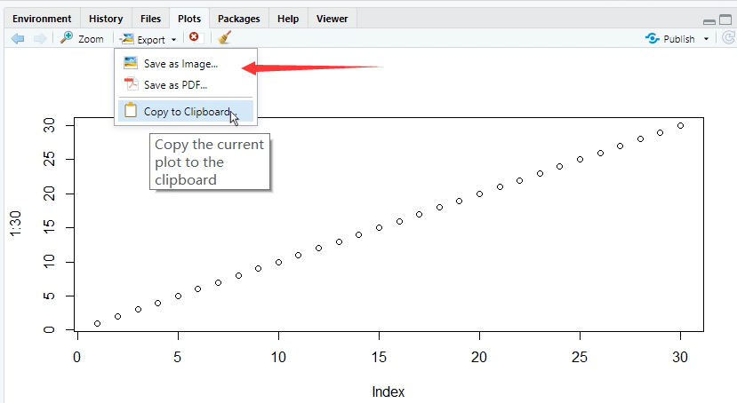

## 基本绘图

```R
#########

# plot函数
plot(x = -1:6,          #8个点
     y = 2*(-1:6),      #坐标 然后y从-2：12连线
     type = "o",        #绘图类型
     family = "serif",  #字体，这是新罗马
     xlim = c(-5,7),    #值域
     ylim = c(-5,14),
     ylab = "y----",    #y轴的名称
     xlab = "----x",
     main = "plot示例") #标题

#下面的是低级函数，需要先使用plot函数，然后叠加到polt绘制的图形上去
# lines函数  
lines(x = 1:6, y = 2:7, col = "blue")
# abline函数
abline(a = 3, b = 2, col = "green")  a:截距 b:斜率
abline(v = 0, h = 3)
# text函数
text(x = 3, y = 2.5, labels = "y=3")
```

运行结果：

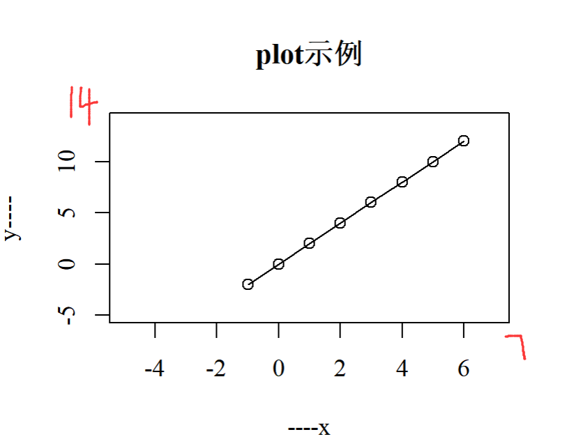

****

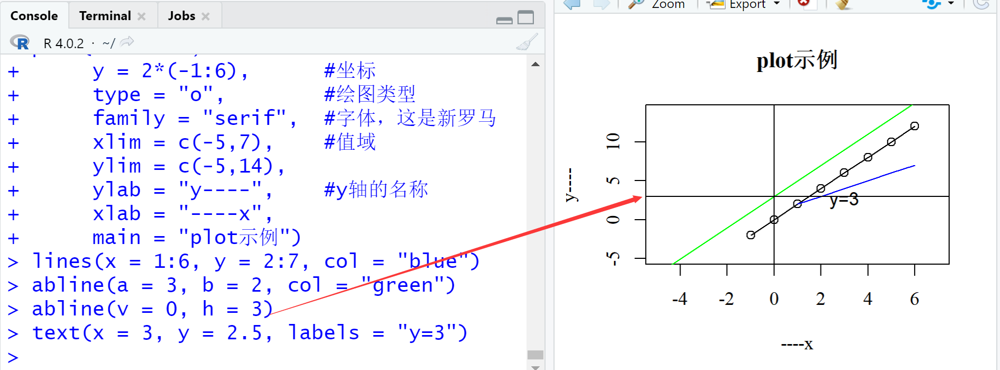

***

条形图：

```R
#########
set.seed(432)
d0 <- data.frame(rs1 = sample(letters[1:4], 100, replace = T),
                 rs2 = sample(LETTERS[21:22], 100, replace = T))

# barplot函数   #条形图
barplot(1:5, names.arg = letters[1:5])
barplot(table(d0$rs1), main = "barplot") #table函数返回的是一个向量，我们绘制它
                                         #即rs1取值出现的频率
```

barplot(1:5, names.arg = letters[1:5])：

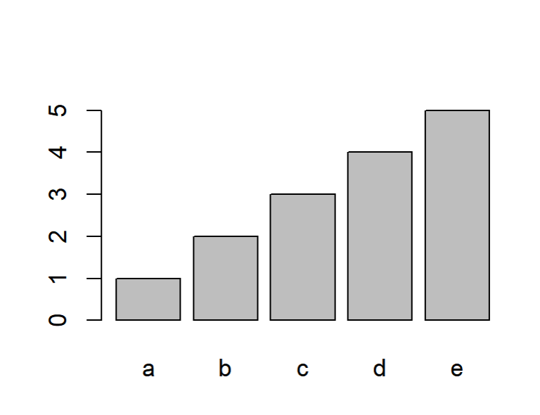

barplot(table(d0$rs1), main = "barplot")：

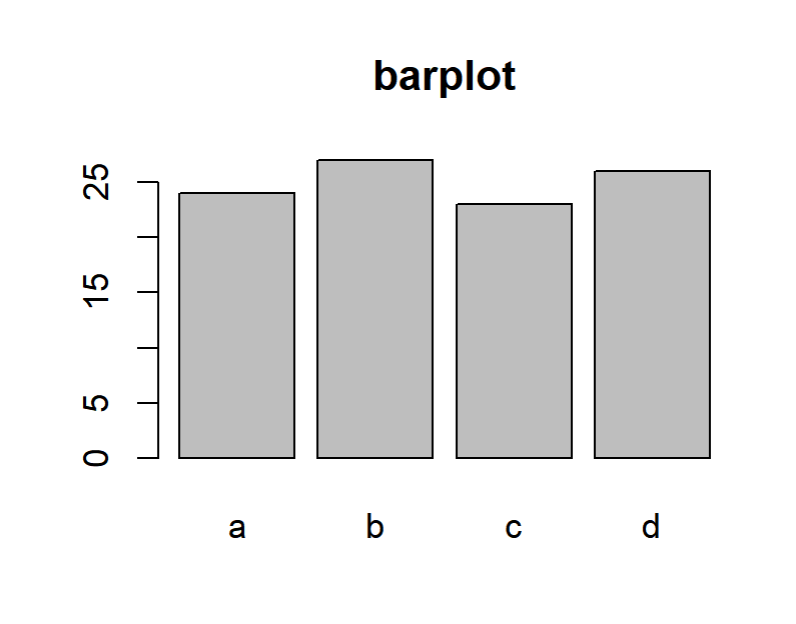

****

箱线图：

```R
# boxplot函数  #箱线图
boxplot(ToothGrowth$len)
boxplot(len ~ supp, data = ToothGrowth) #supp变量在不同取值的时候，在len上的分布是否会有差异。
# supp是分类型变量 len是连续型变量

# hist函数 #直方图
hist(rnorm(1000), breaks = 15)  # 他就是多个条形图啦

######################################################
```

`boxplot(ToothGrowth$len)`：

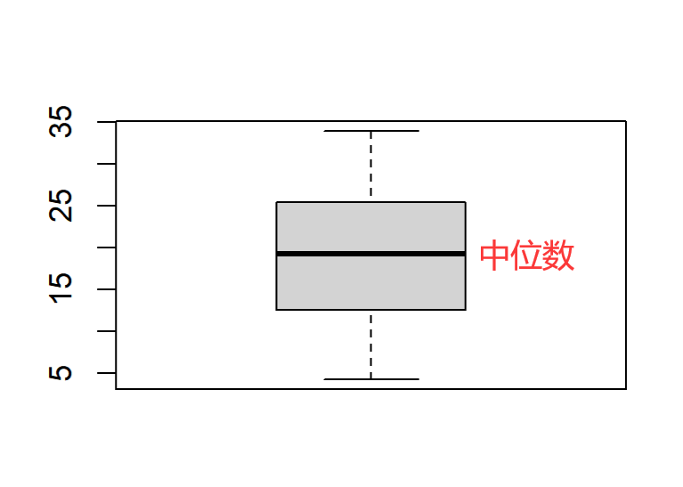

***

**boxplot(len ~ supp, data = ToothGrowth):**

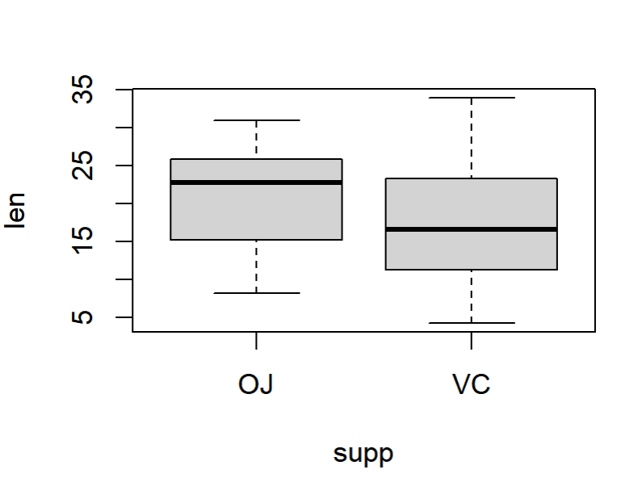

上图可以直观的看到，supp有两个不同的取值，他们在len上面的中位数是有显著差异的。

就是说先把len分为两组，一组是OJ，一组是VC。然后属于OJ和VC上的len分别求中位数来进行比较。

**hist(rnorm(1000), breaks = 15):**

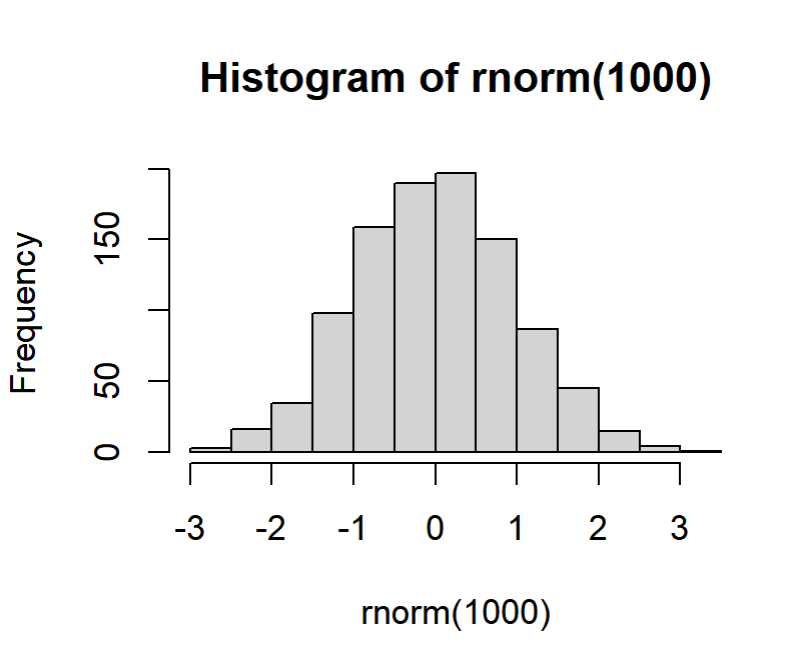

****

**直方图叠加密度曲线：**

```R
# 直方图叠加密度曲线
set.seed(10)
d1 <- rnorm(1000)  #随机抽取服从标准正态分布的1000个点                                                                              # 下面有对比
hist(d1, breaks = 100, freq = F, main = "Histogram") #一定要设置一个F
lines(density(d1), col = "blue", lwd=2) #得到经验密度曲线？lwd是线的宽带，plot函数也可以使用。然后画线。
d2 <- seq(min(d1), max(d1), length=10000) #最大值和最小值分为10000份
lines(d2, dnorm(d2), col = "red", lwd=2) # dnorm是返回正态分布密度曲线
#d2是x轴，dnorm(d2)是y轴。
```

**freq = F:**

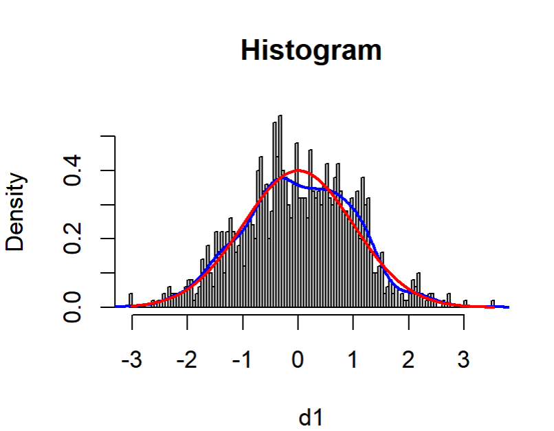

相对于frep=T是成比例缩小的。

**freq = T:**

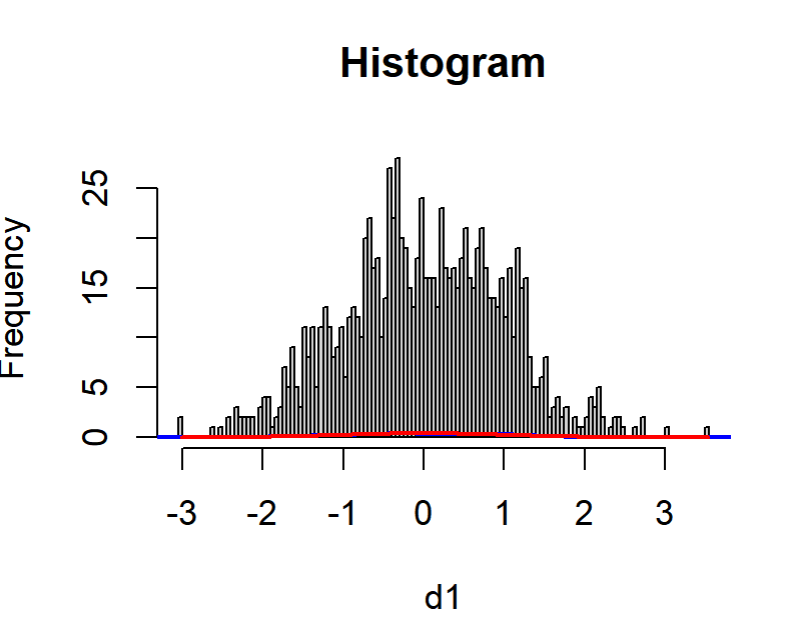

****

**马赛克图:**

```R
# 马赛克图
table(d0$rs1)  #列联表
table(d0$rs2)
table(d0$rs1, d0$rs2) #列联表 这个适用于两个连续型变量哦
mosaicplot(table(d0$rs1, d0$rs2)) #放入这个二维列联表
```

运行结果：

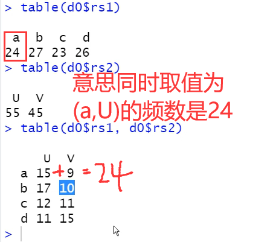

***

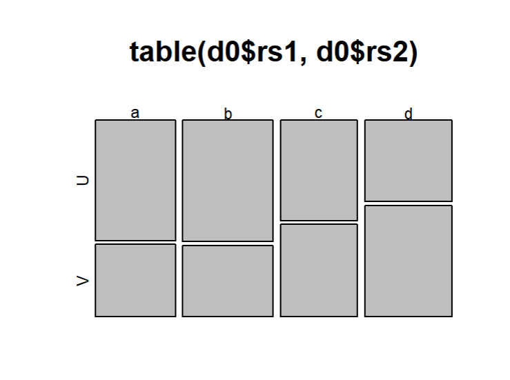

上图可以看到(a,V)和(a,U)差距还是很明显的。

***

## ggplot2

```R
######################################################


# ggplot2包
library(tidyverse)
set.seed(432)
d3 <- data.frame(
  ind = 1:100,
  rn = rnorm(100),
  rt = rt(100, df=5),
  rs1 = sample(letters[1:3], 100, replace = T),
  rs2 = sample(LETTERS[21:22], 100, replace = T)
)

# 点图
ggplot() +    #相当于是画布
  geom_point(data = d3,  #geom_point相当于画笔，里面的值是要画的元素
             mapping = aes(x=rn, y=rt, fill=rs2), #x和y轴。
             shape = 21,  
             size = 5)
#一般我们将mapping和data放到ggplot()中。并且省略这两个名字。


# 线图
ggplot(d3, aes(x=ind, y=rn)) +
  geom_line(size=1.2)

# 条形图
d3 %>%
  ggplot(aes(x=rs1)) +  #自动统计了rs1上不同取值的频率
  geom_bar(fill = "white", color = "black") #边框是黑色

d3 %>%   #分组汇总
  group_by(rs1) %>%  #按rs1分组
  summarise(mean_rn = mean(rn)) %>% #展示不同的rs1所对应rn的均值
  ggplot(aes(x=rs1, y=mean_rn)) +   #x=rs1, y=mean_rn
  geom_col(fill="grey", colour="black", width = 0.5)

d3 %>%
  group_by(rs1, rs2) %>%
  summarise(m = median(rn)) %>%
  ggplot(aes(x = rs1, y = m, fill = rs2)) + #rs2作为填充显示
  geom_col(position = "dodge") #是为了并列显示，你可以去掉看看效果
```

**点图：**

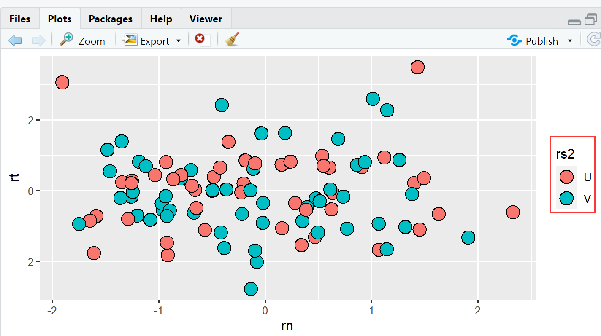

**这应该是rn和rt在rs2的两个取值u和v上分布的频率**。

**线图：**

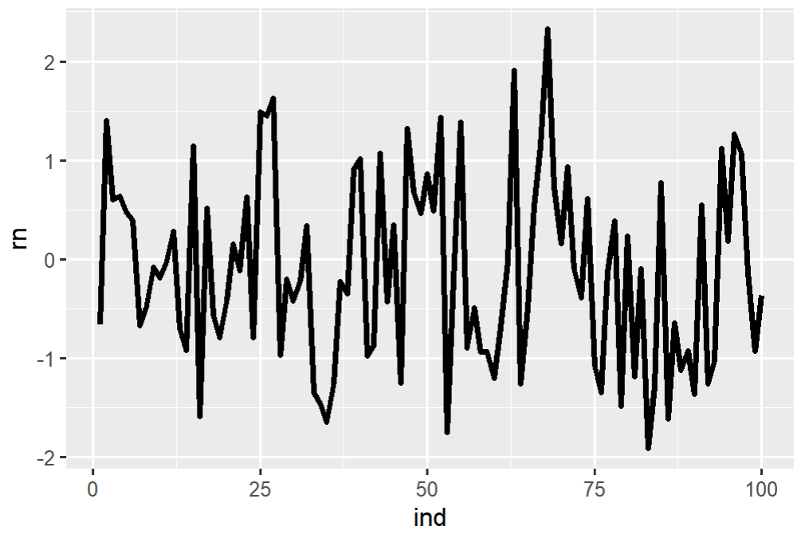

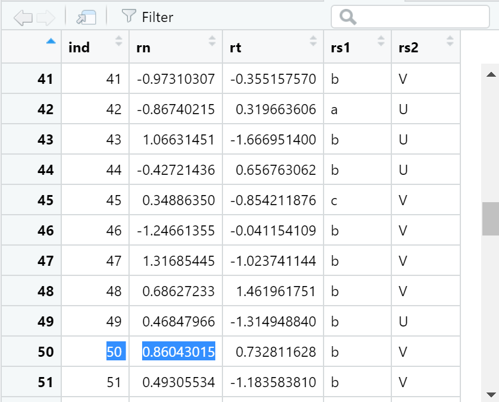

**ind取50的时候，rn是0.8。这是对应上的。**

**条形图：**

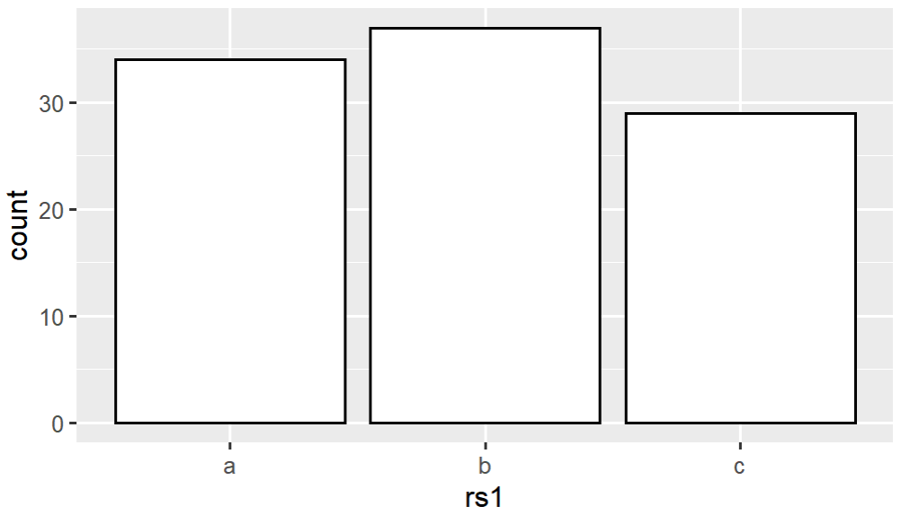

***

aaa

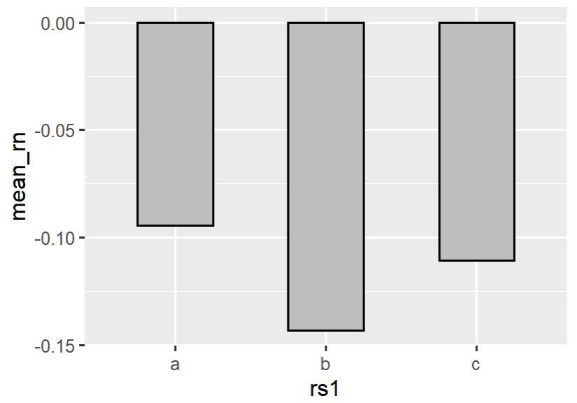

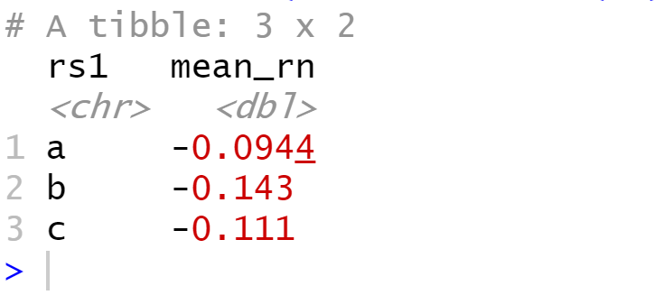

上图是执行d3 %>%   #分组汇总
  group_by(rs1) %>%  #按rs1分组
  summarise(mean_rn = mean(rn))后得到的，然后用它画条形图。

****

bbb

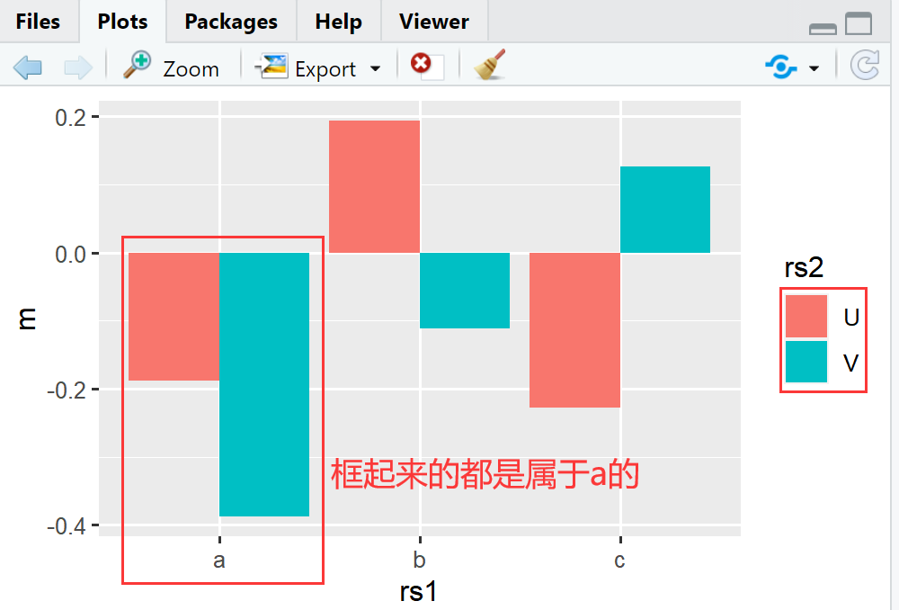

***

箱线图：

```R
# 箱线图
ggplot(ToothGrowth, aes(y=len)) +
  geom_boxplot()
                        #分类型  #连续型
ggplot(ToothGrowth, aes(x=supp, y=len)) + 
  geom_boxplot()

ggplot(d3, aes(x=rs1, y=rn, fill=rs2)) +
  geom_boxplot()
```

运行结果1：

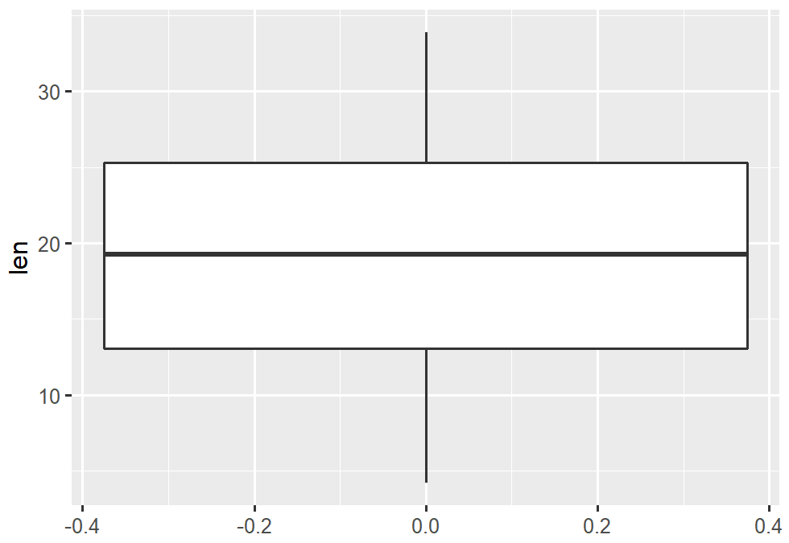

运行结果2：

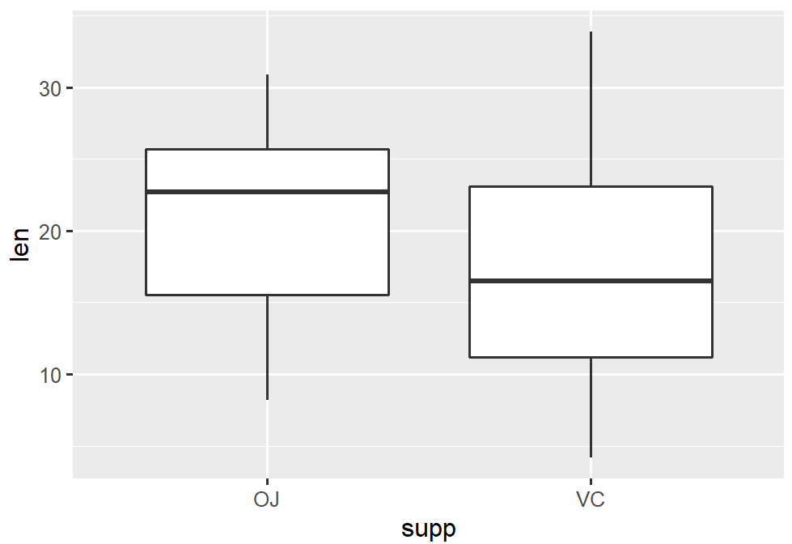

上图描述了len在OJ和VC两个不同取值上的差异性。

运行结果3：用不同的填充色来反映rs2的取值。那个黑点是离群值。

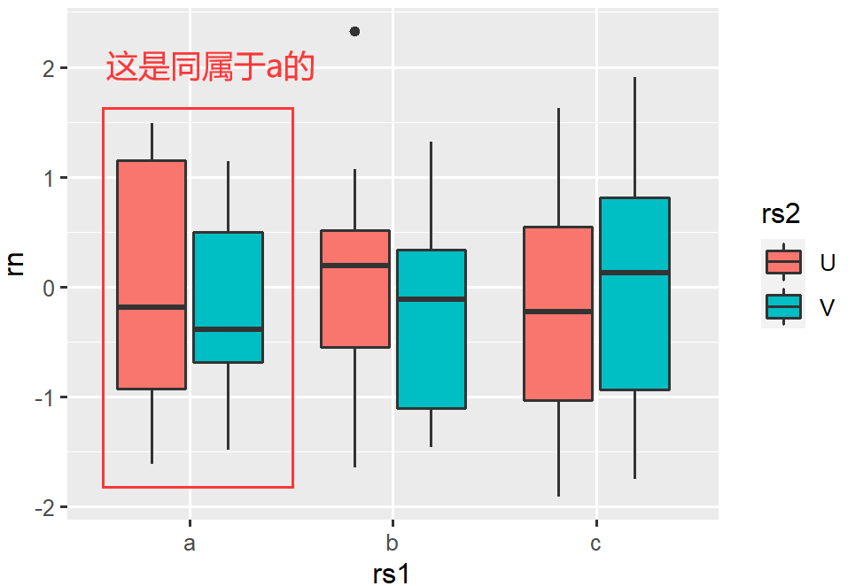

**直方图：**

```R
# 直方图
ggplot(d3, aes(x=rn, fill=rs2)) +
  geom_histogram(bins = 20, alpha=0.1, colour="black")

# 密度曲线
ggplot(d3, aes(x=rn, fill=rs2)) +
  geom_density(alpha=0.1) +
  labs(x = "aa", y = "bb", title = "density") +
  theme(plot.title = element_text(hjust = 0.5))

######################################################
```

密度曲线运行结果：

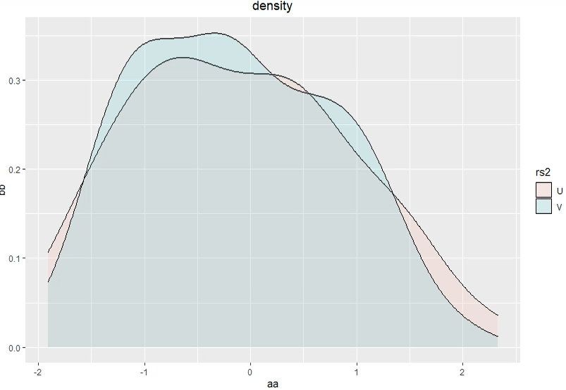