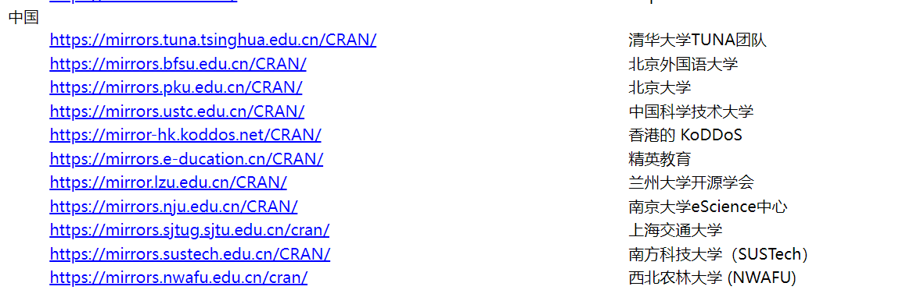
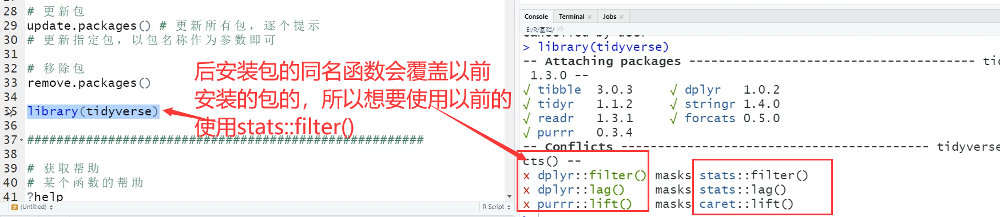
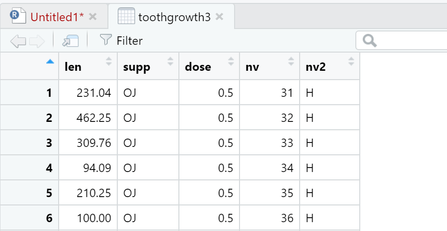
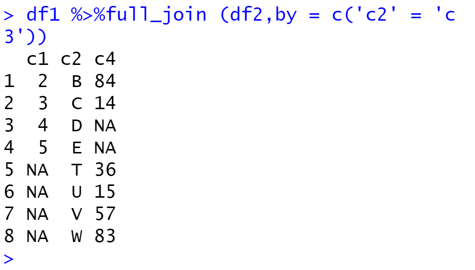
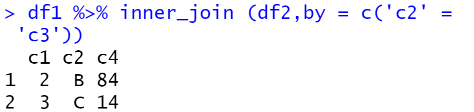
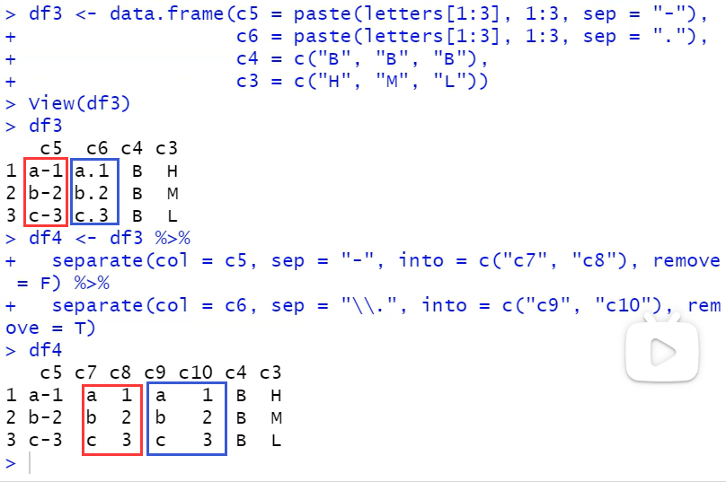
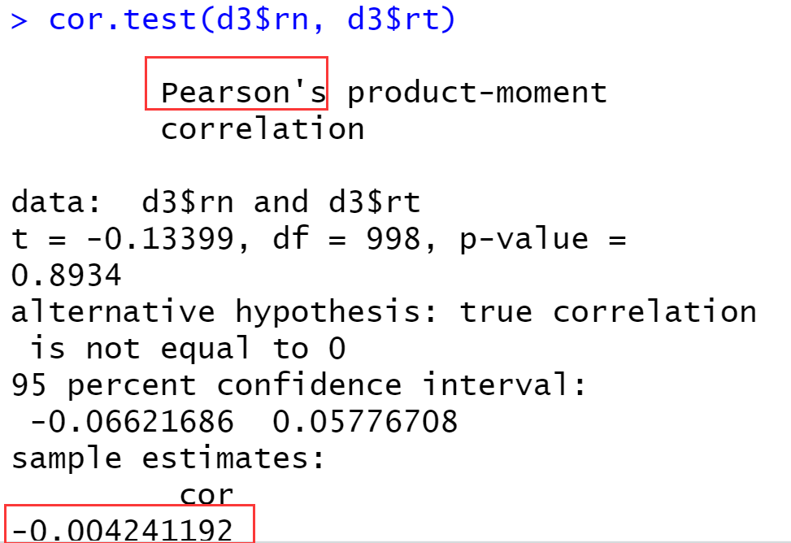
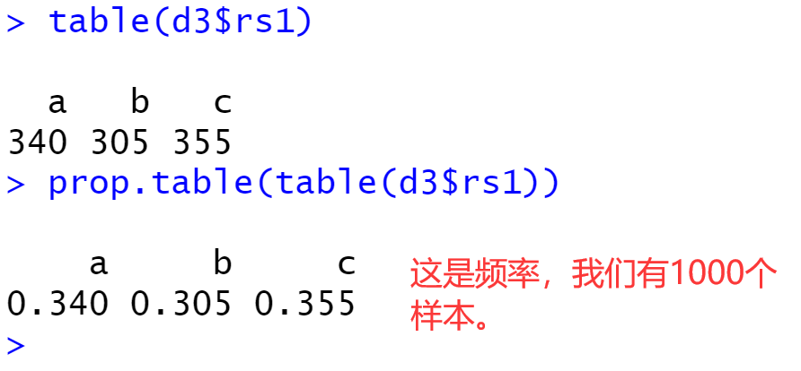

随机森林通过自助法（bootstrap）重采样技术，从原始训练样本集 N 中有放回地重复 随机抽取 k 个样本生成新的训练样本集合，**然后根据自助样本集生成 k 个分类树组成随机森 林**，新数据的分类结果按分类树投票多少形成的分数而定。其实质是对决策树算法的一种改 进，将多个决策树合并在一起，每棵树的建立依赖于一个独立抽取的样品，森林中的每棵树 具有相同的分布，分类误差取决于每一棵树的分类能力和它们之间的相关性。特征选择采用 随机的方法去分裂每一个节点，然后比较不同情况下产生的误差。能够检测到的内在估计误 差、分类能力和相关性决定选择特征的数目。单棵树的分类能力可能很小，但在随机产生大 量的决策树后，一个测试样品可以通过每一棵树的分类结果经统计后选择最可能的分类[2]。 在建立每一棵决策树的过程中，有两点需要注意采样与完全分裂。首先是两个随机采样 的过程，随机森林对输入的数据要进行行、列的采样。对于行采样，采用有放回的方式，也 就是在采样得到的样本集合中，可能有重复的样本。假设输入样本为 N 个，那么采样的样本 也为 N 个。这样使得在训练的时候，每一棵树的输入样本都不是全部的样本，使得相对不容 易出现过拟合。然后进行列采样，从 M 个特征中，选择 m 个（m << M）。之后就是对采样之 后的数据使用完全分裂的方式建立出决策树，这样决策树的某一个叶子节点要么是无法继续 分裂的，要么里面的所有样本的都是指向的同一个分类。**一般很多的决策树算法都一个重要 的步骤——剪枝，但是这里不这样干，由于之前的两个随机采样的过程保证了随机性，所以 就算不剪枝，也不会出现过拟合**。

# 一、安装与基本使用

CRAN镜像网址：https://www.r-project.org/



随便选择一个镜像进行下载。


Rstudio下载(下载exe那个就行)https://www.rstudio.com/products/rstudio/download/#download

****

调节页面布局及字体大小。


**调整编码在：file--->Reopen with encoding。修正中文乱码**。

****


包的查找：https://mirror.lzu.edu.cn/CRAN/、


**可以在这个界面按下ctrl+f进行查找**。


## 1.2 包的管理


****

安装下载好的二进制包，但是不安装依赖。


****

Rstudio中的操作。

多个包使用空格或逗号分割。


下面这个warning不用理会。


原因：


****

如何运行代码？


单行：选中这行或者将光标放在这行后面，然后点击run。

多行：选中然后run。


包的使用：一次安装，多次加载。

```R
# 安装
install.packages("car")
# 包的加载
library(caret)  //没有引号
更新包
```



## 1.3 获取帮助

```R
# 获取某个函数的帮助
?help  #注意，这里是获取help函数的帮助文档
help("library") #获取library函数的帮助文档

# 获取某个关键词的帮助
??help   #这个可以打出有关help这个关键字的绝大部分信息
help.search("library")  #和上面效果差不错 打出有关library这个关键字的绝大部分信息

# 获取某个包的帮助
help(package="ggplot2")  #就是把网站上的帮助内容打出来了
 
# 获取当前工作目录
getwd()
# 设置工作目录
setwd ("E:/R") #斜杠  #转义字符\反斜杠

#获取文件路径
file.choose()   #这个函数会让你到文件夹中选择文件
read.csv("路径名")   复制上面得到的路径进来
read.csv(file.choose()) 或者我们可以之间读取

#rstudio的项目(工程)创建
先建立工程，然后创建脚本，就完事了。
```


这个是保存已经运行生成的数据集，后缀是.rDATA。退出时他也会问你存不存。


# 二、数据类型

```R
#R常用数据类型

#数值型
123
2.34

#字符型
"Hello，wor1d."
'123'

#逻辑型TRUE
T
FALSEF

#判断函数名(参数名=参数值)
is.numeric(123)
is.numeric(FALSE)
is.character('123')  TRUE
is.character(FALSE)  FALSE
is.1ogical('123')
is.logical(FALSE)

#转换
as.numeric('123') 
as.numeric('转换')
as.numeric(T)
as.numeric(F)
as.character(123)
as.1ogical( "He1lo,wor1d."）
as.1ogical(2)
as.1ogical(1)
as.1ogical(-2)
as.1ogical(2.1)
as.1ogica1(0)
             
#特殊值 
NA          # not availiable  比较重要 也可以叫缺失值
is.na(NA)
NULL
is.null(NULL)
is.nan(NAN)  # not a number

Inf
-Inf
is.infinite(-Inf)
#示例
2/0-2/o0/0

```

# 数据结构

## 向量

```R
#R常用数据结构
#赋值
#对象名<-对象值

#=  不推荐赋值时使用，推荐在
v5 <- rep (v2, times = 2, each = 2) 函数中使用=

#快捷键alt 加上 -
向量

常量(已经被R语言开发者赋值了)
> pi
[1] 3.141593
letters
LETTERS
month.name  #月份全称
month.abb   #月份简称
实际上就是letters<-c("a","c",......) #26个英文字母

v1 <- 1:5  生成1到5的序列，为了简化seq函数
v2 <- c(v1，3,2,7,4,6)  # c是连接函数，connetion，随便连接就得了
v3 <- rep(v2,times = 2) #repeat v2重复2次
v4 <- rep(v2,each = 2)  #v2中的每个元素重复2次
#v2中的每个元素重复2次，再是v2重复2次
v5 <- rep(v2,times = 2,each = 2)
v6 <- seq(from = 2,to = 9,by = 3) #步长为3，小于等于9 (2 5 8)

v7 <- seq(from = 2,to = 9,length.out = 3) 向量长度为3
v8 <- seq(from = 2,by = 3,length.out = 4) 步长为3，向量长度为4
v9 <- c( 'aic', 'bic' , 'cp ' )
rep(v9，each = 3) #这是临时结果，没有重新赋值给v9哦

c(T,T，F,T)

#强制转换为同一种类型的数据，此处字符型优先级较高
c(T， "aic") #只接受单一数据类型

#向量元素名称
names(v2)  #此时向量中的元素还没有名字

变量可以给函数赋值
names(v2) <- v9  #用v9中向量的元素作为v2中向量的元素的名字
v2   #此时向量中的元素有了名字

#向量长度
length(v9)
length(v9)<-9  # 多余的位置填充为NA

#向量索引  注意索引是由1开始的
v8[3]  单个元素
v8[c(1，3，5)] 多个元素
v8[-c(1，4)]   排除1，4位置的元素
v2[c('aic','cp')] #用向量的名称作为索引
v1[v1%%2==1]  # 填入条件索引 这里是模的意思，就是取出奇数
```


****


****


***


## 矩阵

```R
#矩阵 也是接收单一数据类型，否则引发强制类型转换
m1 <- matrix(
1:6,
nrow = 2,
# ncol = 3,  #行就能确定一个矩阵了，列省略
byrow = F,  # F是默认的代表列 T代表行排列
dimnames = list(c( 'r1', 'r2'),  #为矩阵生成行列名称
c( 'c1', 'c2', 'c3')))
    
m1  #输出

#matrix(NA, ncol = 3,nrow = 3) #这是准备了一个空的矩阵，以便于将来有数据时直接填入

m1 <- matrix(
c(1:6,letters[1:6])   # 连接出一个向量
nrow = 3,
# ncol = 3,  
byrow = T,  
dimnames = list(c('r1','r2','r3'),  
c( 'c1','c2','c3','c4')))
结果：
> m1   # 注意看全都被强制转为了字符类型
   c1  c2  c3  c4 
r1 "1" "2" "3" "4"
r2 "5" "6" "a" "b"
r3 "c" "d" "e" "f"

# 行列名称
colnames(m1)
[1] "c1" "c2" "c3" "c4"
rownames(m1)
[1] "r1" "r2" "r3"
dimnames(m1)
[[1]]
[1] "r1" "r2" "r3"

[[2]]
[1] "c1" "c2" "c3" "c4"

dimnames(m1)<-c(行向量，列向量)   #这个是可以被更改的
********************************************************

# 维度信息
> ncol(m1)
[1] 4
> nrow(m1)
[1] 3
> dim(m1)   #打出行数和列数
[1] 3 4
********************************************************
#矩阵索引
m1[1,2]  #返回向量  第一行第二列的元素
m1[1,]   #返回向量  第一行所有列
m1[,2]   #返回向量  第二列所有行 #逗号前后都是向量，2是长度为1的向量
m1[1:2,2:3]  #返回矩阵 这个得到的是1 2两行的2 3两列
运行结果：
> m1[1:2,2:3]
   c2  c3 
r1 "2" "3"
r2 "6" "a"
> m1
   c1  c2  c3  c4 
r1 "1" "2" "3" "4"
r2 "5" "6" "a" "b"
r3 "c" "d" "e" "f"

m2[c(1,3)，c(2,4)]  # 用c函数生成的向量，1 3两行，2 4两列

m2['r1',]   #返回向量 r1这一行
m2[,'c1']   #返回向量 c1这一列
m2[c('r1','r2')，c('c2','c3')] #返回矩阵 # r1 r2这两行，c2,c3这两列交叉位置上的元素 
********************************************************
# 转换成向量
as.vector(m1)
运行结果：
> as.vector(m1)  #注意是按列进行抽取的
 [1] "1" "5" "c" "2" "6" "d" "3" "a" "e" "4" "b" "f"
> m1
   c1  c2  c3  c4 
r1 "1" "2" "3" "4"
r2 "5" "6" "a" "b"
r3 "c" "d" "e" "f"
********************************************************
# 数组
arr=array() # 这是构造更高维的矩阵，不常用
```


****


## 列表(重要)

```R
v1<-1:5

m1 <- matrix(
c(1:6,letters[1:6])   
nrow = 3,
# ncol = 3,  
byrow = T,  
dimnames = list(c('r1','r2','r3'),  
c( 'c1','c2','c3','c4')))

l1<-list(com1=v1,com2=m1) # 该列表有两个成分，v1和m1，分别起名为com1和com2。注意可以数据类型不同哦！！！

> l1
$com1
[1] 1 2 3 4 5

$com2
   c1 c2 c3
r1  1  3  5
r2  2  4  6
************************************************************
# 长度信息
length(l1)  #与向量使用的函数一样
[1] 2
# 名称
names(l1)   #与向量使用的函数一样
[1] "com1" "com2"
************************************************************
#列表索引
l1$com1      #返回对应的成分，是向量则返回向量，是矩阵则返回矩阵
l1[['com2']] #此处返回矩阵   是向量则返回向量，是矩阵则返回矩阵
l1[[2]]      #此处返回矩阵   是向量则返回向量，是矩阵则返回矩阵
             # 指返回第二个成分
运行结果：
> l1$com1
[1] 1 2 3 4 5
> l1$com2
   c1 c2 c3
r1  1  3  5
r2  2  4  6

> l1[[1]]
[1] 1 2 3 4 5
> l1[['com1']]
[1] 1 2 3 4 5

> l1[['com2']]
   c1 c2 c3
r1  1  3  5
r2  2  4  6
> l1[[2]]
   c1 c2 c3
r1  1  3  5
r2  2  4  6

l1['com1']   #返回列表  # 一定注意[]和[[]]是有区别的
l1[2]        #返回列表
运行结果：
> l1['com1']
$com1         # 这是列表的标志
[1] 1 2 3 4 5
> l1[2]       # 这是列表的标志
$com2
   c1 c2 c3
r1  1  3  5
r2  2  4  6
> l1['com2']
$com2        # 这是列表的标志
   c1 c2 c3
r1  1  3  5
r2  2  4  6
                                                            
# 新建成分
l1$com3 <- 3:6#实际上，这也可以修改列，将com3换成com2就是修改com2列

# 释放列表
unlist(l1)  #将列表中的元素转化为向量 会自动规律性的加上名称
运行结果：
> unlist(l1)                  #矩阵按列提取
com11 com12 com13 com14 com15 com21 com22 com23 com24 
    1     2     3     4     5     1     2     3     4 
com25 com26 com31 com32 com33 com34 
    5     6     3     4     5     6 
```

## 数据框(重要)

**==这个相当于mysql的一张表==**。

值得注意的是，R语言读取csv文件会自动处理为数据框。

```R
# 数据框 (特殊的列表)
df1<-data.frame(
    c1=2:5,
    c2=LETTERS[2:5]
)
可以看到，我们只是把list换成了data.frame。显示的方式也发生了变化，以前是每个组成成分单独显示，现在是行列的这种二维结构。
当然，也可以理解为一个矩阵的升级版，以前的矩阵是单一的数据类型，现在可以每列是不同的数据类型。

运行结果：
> df1
  c1 c2
1  2  B
2  3  C
3  4  D
4  5  E
************************************************************
# 行列名称
names(df1)
colnames(df1)
rownames(df1)
dimnames(df1)
运行结果：
> names(df1)   #同colnames #数据库是一种特殊的列表，这是返回列表成分的函数，数据框也可以使用
[1] "c1" "c2"
> colnames(df1)
[1] "c1" "c2"
> rownames(df1)
[1] "1" "2" "3" "4"
> dimnames(df1)
[[1]]               #单独的成分
[1] "1" "2" "3" "4"

[[2]]               #单独的成分
[1] "c1" "c2"

# 维度信息
> ncol(m1)
[1] 4
> nrow(m1)
[1] 3
> dim(m1)   #打出行数和列数
[1] 3 4
************************************************************
# 数据框索引
df1[1:2,2]  # 返回向量
运行结果：
> df1[1:2,2]  #1，2两行，第2列的元素
[1] "B" "C"
> df1
  c1 c2
1  2  B
2  3  C
3  4  D
4  5  E

df1[,2]   # 返回向量
运行结果：
> df1[,2]
[1] "B" "C" "D" "E"

df1[1,]  # 返回的是数据框哦
运行结果：
> df1[1,]  # 返回第一行，但是是一个数据框
  c1 c2
1  2  B

df1[,"c1"] #返回向量   c1列
df1['1',]  #返回数据框 第'1'行(实际上就是第1行)

df1[[2]]   #返回向量   第2列(也就是列表的第2个成分，数据框是特殊列表)
df1$c1     #返回向量   c1列

df1[2]     #返回数据框 第2列(也就是列表的第2个成分，数据框是特殊列表)
df1['c1']  #返回数据框 c1列
***********************************************************
# 新建列
df1$c3<-1:4  # 这里也是，将c3换成c2就是修改c2列。
***********************************************************

# 生成用于网格搜索的数据框 这个与随机森林有关，以后再来看
expand.grid(mtry = 2 : 5,ntree = c(200,500))
运行结果：
> expand.grid(mtry = 2 : 5,ntree = c(200,500))
  mtry ntree
1    2   200
2    3   200
3    4   200
4    5   200  #(2,3,4,5)的向量与(200,500)的向量进行组合
5    2   500
6    3   500
7    4   500
8    5   500
```

# 基本运算和常用函数

## 基本运算


****

```R
2 %in% 2:5 # 2:5这个向量是否包含2
```


`%in% `是二元操作符。

## 向量相关函数

```R
v2 <- c ( 3,2,7,4,6,8,11,21)
max(v2) #最大值
cummax(v2) #累积最大值
min(v2)    #最小值
cummin(v2) #累积最小值 3里面的最小 3，2里面的最小 ...... 
sum(v2)    #求和
cumsum(v2) #累积求和
prod(v2)   #乘积
cumprod(v2) #累积乘积
运行结果：
> cumprod(v2)
[1]       3       6      42     168    1008    8064
[7]   88704 1862784

mean(v2)    #均值
median(v2)  #中位数  # (6+7)/2=6.5
sd(v2)      #标准差
var(v2)     #方差
rev(v2)     #向量逆转
sort(v2)    #向量重排(升序)

v5 <- rep(v2,times =2)
table(v5)   #向量元素频数统计(就是统计出现的次数)
运行结果:
> table(v5)  
v5
 2  3  4  6  7  8 11 21 
 2  2  2  2  2  2  2  2
unique(v5)  #向量的取值水平(就是去重)
***********************************************************
# 索引函数
which(v5==7)  # 与v5中的元素逐一比较交，返回元素值为7的索引
运行结果：
> v5==7
 [1] FALSE FALSE  TRUE FALSE FALSE FALSE FALSE FALSE
 [9] FALSE FALSE  TRUE FALSE FALSE FALSE FALSE FALSE
> which(v5==7)
[1]  3 11

which.max(v5) #找到最大值的索引
which.min(v5) #找到最小值的索引
运行结果：
> which.max(v5)
[1] 8         # 返回的是最大(小)值第一次出现的位置
> v5
 [1]  3  2  7  4  6  8 11 21  3  2  7  4  6  8 11 21
************************************************************

intersect(1:5，4:7) #交集
setdiff(1:5，4 :7)  #差集
union(1:5,4:7)     #并集
> union(1:5,4:7)
[1] 1 2 3 4 5 6 7 注意不是1 2 3 4 5 4 5 6 7 
```

## 数据框和矩阵相关函数

```R
dfs <- data.frame (a=1 : 5,
b=3 : 7,
d=letters[1:5])
#行列合并
df1 <- dfs[1:3,]  #截取出1，2，3行所有列
df2 <- dfs[3:5,]  #截取出3，4，5行所有列

#行合并(增加行数)
rbind(df1,df2) #要求列数、列名称相同  #这只能是两个数据框，3个数据框需要做2次，如果想一次多个数据库，搜索相关的库。
运行结果：
> rbind(df1,df2)
   a b d
1  1 3 a
2  2 4 b
3  3 5 c
31 3 5 c   #为啥是31，但是这是对的
4  4 6 d
5  5 7 e
#列合并(增加列数)
cbind(df1,df2) #要求行数相同
***********************************************************
#行列运算
colMeans(dfs[,1:2]) #均值
运行结果：
> colMeans(dfs[,1:2])
a b 
3 5 
co1Sums(dfs[,1:2])  #求和
运行结果：
> colSums(dfs[,1:2])
 a  b 
15 25 
rowMeans(dfs[,1:2])
rowSums(dfs[,1:2])

            #1代表行，2代表列
# apply (x, margin, function)
apply(dfs[,1:2],2,sd)  # 使用系统函数 对1，2两列求标准差
apply(
dfs[,1:2],2,
function(x){sum(is.na(x))}) # 使用自定义函数
# is.na(x)的返回值是一个包含T,F两个取值的向量，sum作用于元素T,F会转换为1，0。
************************************************************
#对象结构信息
str(dfs)      #structure
运行结果：
> dfs
  a b d
1 1 3 a
2 2 4 b
3 3 5 c
4 4 6 d
5 5 7 e
> str(dfs)        observation
#告诉你是一个数据框，有5个观测样本(应该是5行的意思)，3个变量。
'data.frame':	5 obs. of  3 variables:
 $ a: int  1 2 3 4 5            # 这显示的是每一列最前面的一些数据
 $ b: int  3 4 5 6 7
 $ d: chr  "a" "b" "c" "d" ...  # charactor类型

summary(dfs)
运行结果：
       a           b          d            
 Min.   :1   Min.   :3   Length:5          
 1st Qu.:2   1st Qu.:4   Class :character  
 Median :3   Median :5   Mode  :character  
 Mean   :3   Mean   :5                     
 3rd Qu.:4   3rd Qu.:6                     
 Max.   :5   Max.   :7  

View(dfs)    # 这个v是大写的
head(dfs,n = 2) # 返回前两行，默认值是6
tai1(dfs,n = 2)

```


直接点击变量名(就是调用View函数)，也是这个效果。

## 字符函数和分布相关函数

```R
#连接成字符向量
paste(1:5, collapse = "+") #这是连接单个向量内的元素
[1] "1+2+3+4+5"
paste(letters[1:5],collapse = "-")
[1] "a-b-c-d-e"
# 这是两个向量内对应元素的连接
paste (1:5, letters[1:8]，sep = "~") 
[1] "1~a" "2~b" "3~c" "4~d" "5~e" "1~f" "2~g" "3~h"
# 注意上面是循环展开的                # 1 2 3开始循环
paste0(1:5, letters[1:8])
[1] "1a" "2b" "3c" "4d" "5e" "1f" "2g" "3h"

#字符长度
nchar(month.name) #全部转大写 #此处返回一个向量
运行结果：
> month.name
 [1] "January"   "February"  "March"     "April"    
 [5] "May"       "June"      "July"      "August"   
 [9] "September" "October"   "November"  "December" 
> nchar(month.name)
 [1] 7 8 5 5 3 4 4 6 9 7 8 8

toupper(month.name)#全部转小写
tolower(month.name)

#含有某个字符的元素的索引
grep ("Ju",month.name)
[1] 6 7
#替换字符
gsub ("e"，"000"，month.name) #这里是用000替换e
                             #向量中满足条件的元素都会被替换
********************************************************
#随机分布函数  #这部分需要再来看
set.seed(24) #设置随机数种子，可以保证每次随机抽样(函数sample)得到的结果相同  # 24是随便指定的一个值
#千万注意，这个随机数种子是你每次随机抽样前都需要再执行一下的，不是执行一次，一直管用。

#第一个参数是样本，这里是向量[1,2]，样本只有两个值
#12代表抽取12次
#在[1,2]中抽取，肯定是有范围的啊
# 你也可以无范围，但是那样最大指定2了。不能超过样本中元素的最大值
sample(1:2,12,replace = T)  #默认是F #这是随机抽样函数

rnorm(10,mean = 1,sd = 2) #生成10个样本，均值为1，标准差为2的正态分布
pnorm(1,mean = 1,sd = 2)
qnorm(0.5,mean = 1,sd = 2)
dnorm(1,mean = 1,sd = 2)

plot(x = seq(-5,7,length=1000),
y = dnorm(seq(-5,7,length=1000),
mean = 1,
sd = 2),
type = "l",
ylim = c(0,0.25)))

abline(h = 0,  
       v = 1)

```

看一看：


# 语法

## 循环结构

```R
# for循环
for (x in c(-2,3,0,4))#c函数返回的是一个向量，其实就是只写向量名就行
{
    print(x)
	y = abs(x)
    z = y^3
    print(z)
	print("-------")
}
for (variab1e in vector)
{
}

# while循环
v1 <- 1:5
i <- 1
while (i <= length(v1)) 
{
    print(i)
	print(sum(v1[1:i]))
    i = i + 1
	print(i)
	print( "####")
}
***********************************************************
#示例
df <- data.frame(c1 = 2 : 5,
				 c2 = 4: 7,
                 c3 = -19:-16)
for (i in 1:nrow(df)) # 逐行对数据框进行求和
{
	print(sum(df[i,]))
}

j = 1
while(j <= nrow (df)) # 逐行对数据框进行求和
{
    print(sum(df[j,]))
    j = j +1
}

# 这个不用我说吧
next
break
```

## 条件结构

```R
if()

if()
else

if()
else if()
else
************************************************************
s = 45
if(s %% 2 == 0)  # %%代表取模
{
    print( "s是偶数。")
}else #else 放到下面会报个错，真是是傻x
{
	print( "s是奇数。")
}
************************************************************
# ifelse 函数
ifelse(55 %%2 == 0,"偶数","奇数")
```

## 函数构建

```R
#函数构建
f1 <- function(aug1)
{
	res1 <- 1:aug1
	res2 <- prod(res1)
    return(res2)
}
# 调用
f1(aug1 = 10)  #显示指定参数名称时，可以不必在意顺序
f1(10)
 
f2 <- function(aug1,aug2=4) # 存在默认值
{ 
	res <- aug1 + aug2
	return(res)
}
f2(34)
f2(34,5)
```

# 数据整理

## 数据导入导出和批量导入

tidyverse:[Tidyverse](https://www.tidyverse.org/)


图中是8个核心包。非核心包需要单独加载。

forcats主要用来处理因子型数据。

table类似于dataframe。

readr用来读取外源数据

dplyr用来做数据整理的。

stringr用来处理字符型。

点击最上方的packages会显示出非核心包。


上图是有用来导入导出特定格式文件的一些包。


红色的是被覆盖的同名函数。

```R
install.packages("tidyverse")
library(tidyverse)
```

****

导入.csv数据：

```R
library(tidyverse)
#csv数据导入                # Ｔ代表是否把第一行作为列名　　sep分隔符
rawdata <- read.table(file.choose(),header = T,sep = ",")
head(rawdata,n=4)
tail(rawdata,n=10)
rawdata[95:105,] #见到95:105这个就是一个向量呀 返回95：105行的数据
str(rawdata)
#read.csv(file.choose()）        # 专门读取csv文件的，推荐使用。header = T,sep = ","是默认的
#data.table::fread(fi1e.choose()) # 读取1G这样的大文件时使用 header = T,sep = ","是默认的

# csv数据导出
write.table(rawdata,
"test.csv",  //导出目录，不写就是工作目录
 sep = ",",
row.names = F)  # 我们不需要这个数值型(1 2 3 ...)的行名称
                # 导出之后，用excel打开，就自动有行号啦

#write.csv()
#data.table::fwrite()

#读取excel表
library(readxl) # 非核心包，需要加载
# excel_sheets(file.choose()) # 返回excel文件中各张表的表名
                              # 路径不要有中文

data1 <- read_excel(fi1e.choose()) # 这应该是读第一张excel表，sheet1。
# 该函数第二个参数是以数字形式指定读第几张表，具体见帮助文档


# 批量读取数据  
# 前提是你多张(如excel)表列的名称，排布(即顺序)，数目是一样的。
files <- list.files(".\\房地产PB\\") # .代表当前工作目录。这个函数可以得到该目录下所有文件的名称
files
paths <- paste(".\\房地产PB\\",files,sep = "") #路径和文件名称做一个拼接，且不要有空格。这返回的是一个字符型向量
# 前面说过，paste是一个字符串连接的函数
paths

df<-list() # 准备一个空的容器
for(i in 1:length(paths))
{
    datai<-read_excel(paths[i])
    datai$object<-str_sub(files[i],start=1,end=-6) #-6代表倒着数    为了避免行合并的时候，不知道哪些行来自哪个文件，所以增加一列object，列的数值是文件名。
    df[[i]]<-datai  # 存到df中
    print(i)
}
df_all<-bind_rows(df)  # 因为结构相似，所以可以合并行为一个数据框
```


****

批量读取数据：


## 新建变量-过滤行-筛选列-分组汇总-数据合并

```R
# dplyr 是核心包之一，不必单独加载，当然你也可以选择单独加载
library(dplyr)
head(ToothGrowth) # ToothGrowth是自带的数据集，是一个数据框
str(ToothGrowth)

# 新增变量和变量重新赋值
toothgrowth2<-mutate(ToothGrowth, # 因为前面还是写的len=,所以变量名称没有发生改变，只是该列值变了
                    len=len^2,  #这是将len这一列的数值做了平方 变量重新赋值
                    #下面的操作是可以基于这个len^2的。
                    nv=1:nrow(ToothGrowth), #新增了nv这一列，并且用这个向量为这一列赋值
                    nv2=ifelse(nv>median(nv),"H","L")) #新增列nv2，基于新增列nv的中位数来生成
head(toothgrowth2)
```

ToothGrowth的结构：


运行结果：


****

```R
# 筛选行(样本)
toothgrowth3<-filter(toothgrowth2,
	nv %in% 1:50, #条件1
    nv2=='H')     #条件2 两个条件是&&的关系
# 条件应该是可以一直往下加的
```



***

```R
# 筛选列(变量)
toothgrowth4<-select(toothgrowth3,
                     c(2,4)) # 你当然可以写列名称
```


****

```R
#分组计算
#求len的最大值和最小值
summarise(ToothGrowth,len_max = max(len),len_min = min(len))
# 按supp这个变量进行分组，它有多少个值，就会分为多少组，然后去求每组里的len的最大值赋值给len_max。
summarise(group_by(ToothGrowth,supp),len_max = max(len))
summarise(group_by(ToothGrowth,dose),len_max = max(len))
# 按多个变量进行分组
summarise(group_by(ToothGrowth,dose,supp),len_max = max(len))
```

运行结果：


有OJ和VC这两个不同的列值，所以就分为了这两个不同的组。

***


dose有3个不同的列值，supp有2个不同的列值，所以一交叉就是6组。

****

```R
# 管道操作符
library(magrittr)
ToothGrowth %>%  #就是将ToothGrowth做为mutate的第一个参数，后面以此类推
mutate(nv = 1:nrow(ToothGrowth)) %>% 
filter(nv %in% 1:50) %>%
select(1:2) %>%
group_by(supp) %>%
summarise(len_max = max(len)) %>%
as.data.frame()
```


****

```R
#连接(合并）数据框
library (dplyr)
df1 <- data.frame(c1 = 2:5,
c2 = LETTERS[2:5])
df1
df2 <- data.frame(c3 = LETTERS[c(2:3,20:23)],#这里也是取了6个值
c4 = sample(1:100,size = 6)) # 只取6个值
df2
#左连接
left_join(df1,df2,by = c('c2' = 'c3')) # 标准写法，by是条件
#写在前面的是基准，即df1所有的都保留。df2满足条件的就留下，不满足条件的取值为NA。
#采用管道的写法
df1 %>% left_join(df2,by = c('c2' = 'c3'))

#右连接
df1 %>% right_join (df2,by = c('c2' = 'c3')) #c2是被保留的名称
# 右连接是df2为基准，即df2的所有东西都需要保留。

#全连接 即并集
df1 %>%full_join (df2,by = c('c2' = 'c3'))
#内连接 即交集
df1 %>% inner_join (df2,by = c('c2' = 'c3'))

# 多个条件内连接
df1 %>% inner_join (df2,by = c('c2' = 'c3',"c5"))
#这个代表两个数据框中都有c5，条件是c5=c5。假设我的两个数据框中都有c5这一列。
```

左连接运行结果：


df1的3，4两行肯定是要保留的。但是df2又没有满足条件的取值，所以填充为NA。

右连接运行结果：


全连接运行结果：



可以看到，先写出df1的数据，再写出df2的数据。

内连接运行结果：



只是取交集哦。

## 列的分类与合并-长宽数据转换

```R
#列的分裂与合并
library(tidyr) #分裂
df3 <- data.frame(
c5 = paste(letters[1:3],1:3,sep = "-"),  #拼接字符串
c6 = paste(letters[1:3],1:3,sep = "."),
c4 = c("B","B","B"),
c3 = c("H","M","L"))
df3

df4 <- df3 %>% separate(col = c5,sep = "-",into = c("c7","c8"),remove =F) # 分列c5为c7,c8并且不移除c5这一列
%>% separate(col = c6,sep = "\\.",into =
             c("c9","c10"),remove = T)    # .涉及到正则表达式，所以需要\\来转义
df4    #这个可能注释夹杂在中间，它识别不了，所以用下面那个

df4 <- df3 %>% 
separate(col = c5,sep = "-",into = c("c7","c8"),remove =F) %>% 
separate(col = c6,sep = "\\.",into =
 c("c9","c10"),remove = T)    
df4
```

运行结果：



****

```R
#合并
#为什么下面的"."没有用转义？？？
df4 %>%
unite(col = "c11",c("c7","c8"),sep = "-",remove = F) %>%
unite(col = "c12",c("c9","c10"),sep = "\\.",remove = T) %>%
unite(col = "c13",c("c4","c3"),sep = "",remove =F)
#将c4,c3合并为c13，并且中间不要有任何分隔符，并且不要删除c4,c3。
```

运行结果：


当我尝试使用转义符号：


****

****

```R
# 长宽数据转换
library(tidyr)
# 宽数据转长数据
set.seed(42)  # 只要指定了相同的随机数种子，不同的电脑上，运行结果都是一致的。
df5 <- data.frame(time = rep(2011:2013, each=3),
                  area = rep(letters[1:3], times=3),
                  pop = sample(100:1000, 9),
                  den = round(rnorm(9, mean = 3, sd = 0.1), 2), 
                  mj = sample(8:12, 9, replace = T))
df5
# 注：round是保留两位小数

# 宽数据转换为长数据
df6 <- df5 %>%
  pivot_longer(cols = -c(1:2),
               names_to = "varb",
               values_to = "value")
df6

# 长数据转宽数据
df6 %>%
  pivot_wider(names_from = c(area, varb),
              values_from = value)

```

宽数据转换为长数据：


长数据转宽数据：


# 统计学

## 描述性统计和假设检验

```R
library(sampling)

strata(data,stratanames=NULL,size,method=c("srswor","srswr","poisson","systematic"),pik,description=FALS)

 

stratanames: 进行分层所依据的变量名称。

size: 各层中要抽出的观测样本数。

method: 选择4中抽样方法，分别为无放回简单随机抽样、有放回、泊松、系统抽样，默认为srswor。

pik: 设置各层中样本的抽样概率。

description: 选择是否输出含有各层基本信息的结果。

举例说明：

A、B、C分别为分类变量

A有2个分类变量，B有5个分类变量，C有2个分类变量

第一步按照这三个变量进行排序

 

sourui=sourui[order(sourui$A,sourui$B,sourui$C),]

第二步筛选变量，size参数对应20个比例20=2*5*2，比例可以自己设置

sub_train=strata(sourui,stratanames=c("A","B","C"),
                 size=c(21,269,806,2325,3420,1972,2474,1500,1419,741,3,7,58,42,313,70,685,209,696,210),

                 method="srswor")

第三步：分为训练集和测试集，ID_unit变量在第二步产生。

data_train <- sourui[sub_train$ID_unit,]
data_test  <- sourui[-sub_train$ID_unit,]


######################################################
# 因子用于R语言中建模或进行数据分析时，会用到的一种比较特殊的数据类型。
# 主要是用来表示分类型变量，性别：男，女。质量：好，中，差。
# 但是存储在csv里面就是一个字符，好，中，差。但是在进入模型之前，我们需要把他转换成因子。

# 因子
set.seed(42)
l3 <-sample(letters[1:3], 10, replace = T)
l3
as.factor(l3)
factor(l3)   # 这个函数参数更多，具体见帮助文档。
# factor()
```

运行结果：


***

```R
# 描述性统计
set.seed(432)
d3 <- data.frame(
  ind = 1:1000,
  rn = rnorm(1000),
  rn2 = rnorm(1000, mean = 2, sd = 3),
  rt = rt(1000, df=5),
  rs1 = as.factor(sample(letters[1:3], 1000, replace = T)),
  rs2 = as.factor(sample(LETTERS[21:22], 1000, replace = T))
)

# 描述性统计结果
summary(d3)

install.packages("skimr")
library(skimr)
skim(d3)
```

运行结果：


**==因子其实就是类别型变量吧==**。

运行结果：


所以，数据进来需要先进行处理，非连续型的变量可以处理为因子型。不管它是有序的(好，中，差)，还是无序的(男，女)。

运行结果：


****

```R
install.packages("e1071") #需要

# 偏度
e1071::skewness(d3$rn) #e1071这个包主要是支持向量机
[1] 0.07903342   #比较小，说明抽取的数据不存在明显的左偏或者右偏
# 峰度
e1071::kurtosis(d3$rn2) # 这个是减去了正态分布的3以后的结果
[1] 0.04469051
偏度和峰度主要是让你了解一下数据的分布情况

# 相关系数
cor(d3$rn, d3$rt)
cor(d3[,2:4])  # 多个变量，必须是连续型的才能计算相关系数
# 相关性检验   # 检验对象间的相关性是否显著
cor.test(d3$rn, d3$rt)  # 只能是两个向量
library(psych)       #这个包需要安装
corr.test(d3[,1:3])  # 多个向量

# 列联表
table(d3$rs1)
prop.table(table(d3$rs1))


```

运行结果：


相关性检验运行结果：



这个值在上面张图中也能够看到，这是相关系数的估计值，我们用cor函数也能够计算出来。

**备择假设（alternative hypothesis），用 HA 表示，发音为 HA**。

**==这个图中备择假设是存在显著相关性的，因为说了不为0(not equal to 0)。那么原假设就是他们不存在相关性。现在的p值是0.8934，p值是越小越拒绝原假设。现在它大于0.05了，所以它不能拒绝原假设，所以他们不存在显著相关性(0.004这么小)==**。

***


****

列联表运行结果：



****

```R
######################################################
# 假设检验

# 正态分布检验
# shapiro.test()

library(rstatix)  #shapiro_test函数可以使用管道操作符和分组
head(ToothGrowth)
# 单一变量检验
ToothGrowth %>%
  shapiro_test(len)
# 分组检验
ToothGrowth %>%
  group_by(dose) %>%
  shapiro_test(len)

###########################
```

正态分布运行结果：


那个statistic是统计量。p就是p值。我们的原假设就是正态分布成立，现在p值大于0.05，我们不能拒绝原假设。

分组检验是dose有3个取值水平，所以分为了3组。

****

```R

# 方差齐性检验
# 两组检验
# len ~ supp称为formula
# supp是自变量 len是因变量
var.test(len ~ supp, data = ToothGrowth)
# 运行结果：
> var.test(len ~ supp, data = ToothGrowth)

	F test to compare two variances

data:  len by supp
F = 0.6386, num df = 29, denom df
= 29, p-value = 0.2331   #备择假设ratio是不等于1，就是说方差之间存在显著的差异
                         #那么原假设就是不存在显著性差异。现在p>0.05，我们不能拒绝原假设。那就是方差齐性的。
alternative hypothesis: true ratio of variances is not equal to 1
95 percent confidence interval:
 0.3039488 1.3416857
sample estimates:
ratio of variances   #这是比值
         0.6385951 

# 两组及以上的检验
bartlett.test(len ~ dose, data = ToothGrowth)
> bartlett.test(len ~ dose, data = ToothGrowth)

	Bartlett test of homogeneity of
	variances

data:  len by dose  # 通过因变量分组？
Bartlett's K-squared = 0.66547, df
= 2, p-value = 0.717   # 0.7代表方差是一样的
##########################
```

****

```R
# 均值检验
# t检验
t.test(ToothGrowth$len,  # 这列均值(单一变量)与固定值18之间比较
       mu = 18)          #变量的比较

                    #两组数据的比较
t.test(len ~ supp,  #这是比较supp这一列的取值OJ或者VC在len这个变量上是否存在显著性差异
       data = ToothGrowth,
       var.equal = T)  # 指定了方差是齐性的
运行结果：
> t.test(len ~ supp,  #这是比较supp这一列的取值OJ或者VC在len这个变量上是否存在显著性差异
+        data = ToothGrowth,
+        var.equal = T)

	Two Sample t-test

data:  len by supp
t = 1.9153, df = 58, p-value =
0.06039
alternative hypothesis: true difference in means is not equal to 0
95 percent confidence interval: #不为零代表两组数据存在显著性差异，原假设就是不存在，现在我们是不能拒绝原假设的。是没有显著性差异的。
 -0.1670064  7.5670064
sample estimates:
mean in group OJ mean in group VC  
        20.66333         16.96333 #这是在len上的均值
```

运行结果：


**==备择假设是均值不等于18，那么原假设就是等于18。p>0.0.5，我们不能拒绝原假设，所以均值和18是相等的，是不存在显著性差异的==**。

****

方差分析:

```R
# 方差分析
ToothGrowth$dose <- as.factor(ToothGrowth$dose)
aovfit <- aov(len ~ dose, data = ToothGrowth)
aovfit
summary(aovfit)
```


非参数检验：

```R
##########################

# 非参数检验
# 差异检验：Wilcoxon秩和检验(Mann-Whitney U检验)，适用于两组数据
wilcox.test(len ~ supp, data = ToothGrowth, exact = F)
# 差异检验：Kruskal-Wallis检验，适用于两组及以上的数据
kruskal.test(len ~ dose, data = ToothGrowth)

# 方差齐性非参数检验
fligner.test(len ~ dose, data = ToothGrowth)
# 运行结果：
> fligner.test(len ~ dose, data = ToothGrowth)

	Fligner-Killeen test of
	homogeneity of variances

data:  len by dose
Fligner-Killeen:med chi-squared =
1.3879, df = 2, p-value = 0.4996
######################################################
```


## 线性回归模型

```R
######################################################


# 普通线性回归
head(mtcars, n = 10)  # 这是自带的数据集
colnames(mtcars)
rownames(mtcars)
str(mtcars)  #预览结构

# 了解变量，并且把变量处理好
mtcars$vs <- factor(mtcars$vs) # 先把类别型的数字型变量转换为因子
mtcars$am <- factor(mtcars$am)

# 建模
# mpg ~ hp + wt + vs + am #左边是因变量，右边是自变量，多个自变量用+连接
# mpg ~ .-vs  #代表使用mpg作为因变量，vs以外的其他变量作为自变量

# 你也可以 afor<-as.formula(paste())构建出mpg ~ hp + wt + vs + am，然后填入afor。

lmfit <- lm(mpg ~ hp + wt + vs + am, data = mtcars)
lmfit
# 模型结果汇总
lmsum <- summary(lmfit)
lmsum

# 模型系数
coef(lmfit)
coef(lmsum)

# 模型残差
resid(lmfit)

# 提取结果成分
str(lmsum)


# 格式化输出
library(stargazer)
# 在console显示表格，输出到本地
stargazer(lmfit, type="text", out="lm.htm")

# 模型诊断
par(mfrow=c(2,2))
plot(lmfit)
library(lmtest)
# 异方差检验
bptest(lmfit)
# 序列相关检验，主要针对时序回归
dwtest(lmfit)
# 修正
library(sandwich)
coeftest(lmfit, vcovHC(lmfit))
coeftest(lmfit, vcovHAC(lmfit))
# 多重共线性检验
library(car)
vif(lmfit)

# 预测
pred <- predict(lmfit, newdata = mtcars)
# 图示
plot(mtcars$mpg, pred)
abline(a=0, b=1, col="red")

# 性能评估
library(caret)
defaultSummary(
  data.frame(obs = mtcars$mpg,
             pred = pred)
)

######################################################
```

运行结果：


去掉截距项：


提取出数据框：


## 逻辑回归模型

```R
######################################################

# logistic回归
# 读取数据
bcdata <- read.csv(file.choose())

# 查看数据概况
library(skimr)
skim(bcdata)

# 删除含有缺失值的样本
bcdata <- na.omit(bcdata)

# 变量类型修正
bcdata$class <- factor(bcdata$class)

# 查看分类型变量编码
contrasts(bcdata$class)
# 查看分类型变量频数分布
table(bcdata$class)

# logistic回归建模
glmfit <- glm(class ~ .-ID, data = bcdata, family = binomial())
glmfit
summary(glmfit)

# 格式化输出
library(stargazer)
# 在console显示表格，输出到本地
stargazer(glmfit, type="text", out="logit.htm")

# 预测概率
predprob <- predict(glmfit, newdata = bcdata, type = "response")
# 有些模型的predict输出的概率是矩阵，注意识别。

# ROC曲线
library(pROC)
rocs <- roc(response = bcdata$class, # 实际类别
            predictor = predprob) # 预测概率
# 注意Setting direction

# ROC曲线
plot(
  rocs, # roc对象
  print.auc = TRUE, # 打印AUC值
  auc.polygon = TRUE, # 显示AUC区域
  grid = T, # 网格线
  max.auc.polygon = T, # 显示AUC=1的区域
  auc.polygon.col = "skyblue", # AUC区域填充色
  print.thres = T, # 打印最佳临界点
  legacy.axes = T # 横轴显示为1-specificity
)

# 约登法则
bestp <- rocs$thresholds[
  which.max(rocs$sensitivities + rocs$specificities - 1)
]
bestp

# 预测分类
predlab <- as.factor(
  ifelse(predprob > bestp, "malignant", "benign")
)

# 混淆矩阵
library(caret)
confusionMatrix(data = predlab, # 预测类别
                reference = bcdata$class, # 实际类别
                positive = "malignant",
                mode = "everything")
```


a

```R
setwd("D:\\rouge")
# 安装包
library(readxl)
data_OR<- read_excel(file.choose())
head(data_OR)
str(data_OR)
summary(data_OR)
data_OR<-data.frame(data_OR)
data<-data_OR[,c(-6,-11,-14,-15,-18)]
View(data)
x_price<-data[,6]
x_price=data.frame(x_price) # 转换为数据框
View(x_price)
x_price<-apply(x_price,1,function(i){
  flag=grepl(pattern="~",x=i)
  if(flag){
    # 转换为字符串
    y=as.character(i)
    # 字符分割
    n=strsplit(y,split = "~",fixed = T)
    # 字符截取
    n<-sapply(n, function(x){
      substring(x, 2, nchar(x))
    })
    # 转换为数字
    n=apply(n,2,as.numeric)
    # 求平均
    n_mean=apply(n,2,mean)
    i=n_mean
    j="¥"
    i=paste(j, i, sep = "")
  }else{
    i=i
  }
  
})
data[,6]<-x_price
View(data)
View(data[,6])
# 去除价格的"￥"
data[,6]<-sapply(data[,6], function(x){
  substring(x, 2, nchar(x))
})

View(data)

summary(data)
# 将字符串转换为数值
# dflme1[,2:60]<-lapply(dflme1[,2:60],as.numeric)
data[,2:8]<-lapply(data[,2:8], as.numeric)
summary(data)
# 将字符串转换为因子
data[,c(1,9:13)]<-lapply(data[,c(1,9:13)], as.factor)
summary(data)
View(data)

#########################################################
# 缺失值处理
########################################################
# 缺失值的可视化
install.packages("mice")
library(mice)
# 查看缺失数据的情况，各行各列统计
md_data=md.pattern(data)
# 可以观测到，缺失的数据，都是非数值的变量
fix(md_data)

# 缺失值的缺失行的记录
data.lack<-which(!complete.cases(data))
# 转换为 数据框
data.lack<-data.frame(data.lack)
# 缺失值的总记录数
data.lack.num<-nrow(data.lack)
data.lack.num
data<-data.frame(data)
summary(data)
# 把缺失的记录全部删除
data_clean<-na.omit(data)
# 重新查看--缺失值的总个数
n=sum(is.na(data_clean))
n
# 非空数据的行数
(nrow(data_clean))

# 写入文件
write.csv(data_clean,file = "mydata.csv",row.names = F)
# 读文件，共1540条记录
data_handle<-read.table("mydata.csv",header=T, sep=",")
data<-data_handle
View(data)

#############################################################
# 查看喜欢---颜色----的词云
#############################################################
install.packages("Rwordseg")
install.packages("wordcloud")
install.packages("tm")
install.packages("RColorBrewer")
install.packages("wordcloud")
install.packages("rJava")
library(Rwordseg)
library(wordcloud)
library(tm)
library(RColorBrewer)
library(wordcloud)
library(rJava)
# 分词包
install.packages("jiebaR")
install.packages("jiebaRD")
library(jiebaR)
library(jiebaRD) 
x_color<- data[,9]
x_color<- data.frame(x_color)
View(x_color)
# 导出 .txt 数据格式
# 这里的col.names=F是不保存列名，col.names=T 为保存列名
# 空格分隔
write.table(x_color, file = "color_ciyun.txt",sep ="\t",
            col.name=F,row.names = F, quote = F) 
# 读文件
# 解决：line 3 did not have 3 elements
# 加入参数：blank.lines.skip=F
color_text<-read.table("color_ciyun.txt",head=FALSE,
                       blank.lines.skip=F,quote = "")
View(color_text)


#读入数据分隔符是‘\n’，字符编码是‘UTF-8’，what=''表示以字符串类型读入
f_color <- scan('color_ciyun.txt',sep='\n',what='',encoding="GB2312",fileEncoding='GB2312')
#将数据字符串化
f_color <-as.character(f_color) 
View(f_color)
# 造工厂
wk<-worker()
word_color<-c('朱红色','粉红色','粉色','玫红','樱桃红','西瓜红','姨妈色','玫紫','经典红','胭脂红','豆沙色','橘子红','哑光',
              '草莓红','酒红色','玫瑰红','暖橙红','中国红','砖红色','复古红','双色','小样','PBF','M0','80','NO.',
              'SE0','RD0','CR0','PK0','OR','PBG','豆沙红','姨妈','复合','CR','水光','MHS','裸红','RD','CR','1#',
              '2#','3#','4#','5#','6#','7#','8#','9#','10#','11#','12#','13#','14#','15#','#1','#2','#3','#4','#5',
              '#6','#7','#8','#9','#10','#11','#12','#13','#14','#15','#20','#30','#40','#50','#60','#70','#80','#90','M0')
# 使用new_user_word函数
# R语言worker()参数user不起作用
new_user_word(wk,word_color)
seg_color<-wk[f_color]

#统计词频
seg_color <- table(seg_color)
#去除单个没有意义的字：‘色’
seg_color <- seg_color[!grepl('色',names(seg_color))] 
#去除单个没有意义的字：‘号’
seg_color <- seg_color[!grepl('号',names(seg_color))] 
#去除NA
seg_color <- seg_color[!grepl('NA',names(seg_color))] 
# seg_color
#查看处理完后剩余的词数
length(seg_color) 
#降序排序，并提取出现次数最多的前100个词语
seg_color<- sort(seg_color, decreasing = TRUE)[1:100]
#查看100个词频最高的
seg_color 
View(seg_color)
data_color=data.frame(seg_color)
# 制作词云
wordcloud(data_color$seg_color , data_color$Freq, colors = rainbow(100), random.order=F)


# ######################################################
# 查看喜欢的功效词云
# ######################################################
x_save<-data[,10]
x_save<-data.frame(x_save)
View(x_save)
nrow(x_save)
# 导出 .txt 数据格式
# 这里的col.names=F是不保存列名，col.names=T 为保存列名
# 不输出列名、行名:col.names = FALSE,row.names = FALSE
# 代表字符串的双引号——加参数：quote = FALSE
# 空格分隔
write.table(x_save, file = "effect_ciyun.txt",sep ="\t",
            col.name=F,row.names = F, quote = F) 

# 读文件
effect_text<-read.table("effect_ciyun.txt",head=FALSE,sep="\t")
View(effect_text)

#读入数据分隔符是‘\n’，字符编码是‘UTF-8’，what=''表示以字符串类型读入
effect_f <- scan('effect_ciyun.txt',sep='\n',what='',encoding="GB2312",fileEncoding='GB2312')
#将数据字符串化
effect_f <-as.character(effect_f) 
# 造工厂
wk<-worker()
word_fenci<-c("易上色","易卸妆","不沾杯","不脱妆","防脱色","非小样唇膏","均匀肤色","防脱妆","不掉色",
              "双色口红","雾面哑光","不脱色","温和卸妆","不粘杯","姨妈色","咬唇妆","提亮肤色","均匀肤色","清爽不油腻",
              "哑光唇","液体唇蜜","粘杯唇膏","唇部去死皮","哑光豆沙色","其他功效","哑光口红","按钮唇膏","唇颊两用",
              "豆沙色","植物成份")
# 使用new_user_word函数
# R语言worker()参数user不起作用
new_user_word(wk,word_fenci)
effect_seg<-wk[effect_f]

#去除字符长度小于2的词语
effect_seg <- effect_seg[nchar(effect_seg)>1] 
#统计词频
effect_seg <- table(effect_seg)
#去除数字
effect_seg <- effect_seg[!grepl('[0-9]+',names(effect_seg))] 
#去除字母
effect_seg <- effect_seg[!grepl('[a-zA-Z]{2}',names(effect_seg))] 
effect_seg
#查看处理完后剩余的词数
length(effect_seg) 
#降序排序，并提取出现次数最多的前100个词语
effect_seg <- sort(effect_seg, decreasing = TRUE)[1:100]
#查看100个词频最高的
effect_seg
View(effect_seg)
data_Effect=data.frame(effect_seg)
# 制作词云
wordcloud(data_Effect$effect_seg , data_Effect$Freq, colors = rainbow(100), random.order=F)

########################################################
# 对sales_num进行分类处理
########################################################
# 查看 总销量的分布图
data3<-data
summary(data3)
nrow(data3)
# 转化为英文字段
names(data3) <- c('name','describe_score','price_score','quality_score',
                  'service_score','price','evaluate_num','sales_num',
                  'color','effect','sunScreen','country','imported')
View(data3)
# 原始数据的统计直方图
hist(data3$sales_num)
# 查看销量的排名
sales_num_sorted<-sort(data3[,8],decreasing = TRUE)
View(sales_num_sorted)
# ###################################################
# 对数据进行分级处理
# 将数据分为A/B/C三个等级
# 设置中间变量对处理后的向量进行临时存储
grade=0
num_sales=nrow(data3)
for(i in 1:num_sales){
  if(data3[i,8]>100){
    grade[i]="A"
  }
  else if(data3[i,8]>10){
    grade[i]="B"
  }
  else{
    grade[i]="C"
  }
}
# 将字符型变量转化为含有因子的变量并复制给数据集data3
grade
data3[,8]=factor(grade)
# 查看三个等级数据的数量
summary(data3$sales_num)
# A   B   C 
# 467 566 507 
View(data3)

############################################################
# 文本处理：功效
#############################################################
#读入数据分隔符是‘\n’，字符编码是‘UTF-8’，what=''表示以字符串类型读入
text_deal<-scan('effect_ciyun.txt',sep='\n',what='',encoding="GB2312",fileEncoding='GB2312')
# 将数据字符串化
text_deal<-as.character(text_deal)
text_deal<-data.frame(text_deal)
# which(!complete.cases(text_deal))
# # 把缺失的记录全部删除
# text_deal2<-na.omit(text_deal)
# View(data3)
# nrow(data3)
# text_deal<-data3
n=sum(is.na(text_deal))
n
View(text_deal)
# 判断行数
num_text<-nrow(text_deal)
# 设置中间变量对处理后的向量进行临时存储
weight_save=0
# 计算权重函数
value_weight=function(x){
  temp=0
  if(grepl("易上色",x)==TRUE){
    temp=temp+4
  }
  if(grepl("滋润",x)==TRUE){
    temp=temp+5
  }
  if(grepl("保湿",x)==TRUE){
    temp=temp+5
  }
  if(grepl("防脱色",x)==TRUE){
    temp=temp+4
  }
  if(grepl("易卸妆",x)==TRUE){
    temp=temp+4
  }
  if(grepl("补水",x)==TRUE){
    temp=temp+5
  }
  if(grepl("温和卸妆",x)==TRUE){
    temp=temp+5
  }
  if(grepl("均匀肤色",x)==TRUE){
    temp=temp+4
  }
  if(grepl("不掉色",x)==TRUE){
    temp=temp+3
  }
  if(grepl("防水",x)==TRUE){
    temp=temp+4
  }
  if(grepl("不沾杯",x)==TRUE){
    temp=temp+3
  }
  if(grepl("哑光",x)==TRUE){
    temp=temp+2
  }
  if(grepl("咬唇妆",x)==TRUE){
    temp=temp+4
  }
  if(grepl("不脱色",x)==TRUE){
    temp=temp+3
  }
  if(grepl("提亮肤色",x)==TRUE){
    temp=temp+5
  }
  if(grepl("持久",x)==TRUE){
    temp=temp+4
  }
  if(grepl("防晒",x)==TRUE){
    temp=temp+3
  }
  if(grepl("其他功能",x)==TRUE){
    temp=temp+1
  }
  return(temp)
}
# 依次计算每条记录的权重
for(i in 1:num_text){
  weight_save[i]=value_weight(text_deal[i,])
}
weight_save
# 赋予权重
data3[,10]<-weight_save
# 查看信息
summary(data3[,10])
View(data3)
View(data3[,10])

########################################################
# 数据归一化方法: 最大最小值方法
########################################################
scale_norma=function(x){
  # 提取预处理样本集中特征变量个数
  ncol=dim(x)[2]
  # 提取预处理样本的样本总量
  nrow=dim(x)[1]
  # 建立用于保存新样本集的矩阵
  new=matrix(0,nrow,ncol)
  
  for(i in 1:ncol){
    # 提取每个变量的最大值
    max=max(x[,i])
    # 提取每个变量的最小值
    min=min(x[,i])
    # 对每个变量的所有样本数据进行归一化处理
    for(j in 1:nrow){
      new[j,i]=(x[j,i]-min)/(max-min)
    }
  }
  new
}

# data9<-data3
# 进行归一化
data3[,c(2:7,10)]<-scale_norma(data3[,c(2:7,10)])
View(data3)


########################################################
# 文件操作
#######################################################
# 写入文件
write.csv(data3[,-9],file = "mydata_clean.csv",row.names = F)
# 读文件
data_handle2<-read.table("mydata_clean.csv",header=T, sep=",")
data3<-data_handle2
View(data3)


##################################################################
# 数据抽样，生成训练集和测试集
###################################################################
# 没有缺失值的数据
View(data3)
# 对数据进行分组抽样
set.seed(50)
num_sales=nrow(data3)
num_sales
# 分层抽样：sampling ，3:1的规则，
install.packages("sampling")
library(sampling)
# 保存分组抽取的个数
a=round(1/4*sum(data3$sales_num=="A"))
b=round(1/4*sum(data3$sales_num=="B"))
c=round(1/4*sum(data3$sales_num=="C"))
# 查看分布
a;b;c;
# 分层抽样
samp=strata(data3,stratanames = "sales_num",size=c(a,b,c),method="srswor")
# View(samp)
# 生成训练集
Train_data=data3[-samp$ID_unit,]
# 生成测试集
Test_data=data3[samp$ID_unit,]
# 查看训练集和测试集的个数
nrow(Train_data);nrow(Test_data)
# 1154 386
# 查看维度
dim(Train_data);dim(Test_data)
# 查看抽取样本的信息
View(Train_data)
View(Test_data)
# head(Train_data3)
# 提取训练集和测试集的行号
Train_data_num<-sample(1:nrow(Train_data),nrow(Train_data))
Test_data_num<-sample(1:nrow(Test_data),nrow(Test_data))
# 1540--1154--386
View(Train_data_num)
View(Test_data_num)


####################################################
# 模型构建：判别分析----朴素贝叶斯
#####################################################
install.packages("klaR")
library(klaR)
# 模型训练
# 对样本进行预处理，去掉 店名name 
data6<-data3[Train_data_num,-1]
View(data6)
# 生成判别规则
data6_Bayes<-NaiveBayes(factor(sales_num)~.,data6)
# names(data6_Bayes)
# data6_Bayes$tables
# data6_Bayes$levels
# data6_Bayes$call
# data6_Bayes$usekernel
# data6_Bayes$varnames

############################################################
# 各类别下变量密度可视化
# 'sunScreen','country','imported'
# 对是否防晒各类别绘制密度图
plot(data6_Bayes,vars="describe_score",main="describe_score--密度图",n=20,lwd = 2,col=c("DeepPink","#D55E00","DarkTurquoise","#0033FF","#000000","#009900")) 
# 对价格各类别绘制密度图
plot(data6_Bayes,vars = "price",main="price--密度图",n=50,lwd = 2,col = c("DeepPink","#D55E00","DarkTurquoise","#0033FF","#000000","#009900")) 
# 对是否进口各类别绘制密度图
plot(data6_Bayes,vars = "imported",main="imported--密度图",n=50,col = c("DeepPink","#D55E00","RDarkTurquoise","#0033FF","#000000","#009900")) 

# #############################################
# 预测
# 准备测试集
data7<-data3[Test_data_num,-1]
View(data7)
pred_Bayes<-predict(data6_Bayes,data7)
# pred_Bayes
# 混淆矩阵
table(data7$sales_num,pred_Bayes$class)

# 计算贝叶斯判别预测错误概率
error_Bayes<-sum(as.numeric(as.numeric(pred_Bayes$class)
                            !=as.numeric(data7$sales_num)))/nrow(data7)

# 不满足各变量之间的独立条件
error_Bayes
# 0.5310881
library(ggplot2)
library(corrplot)
cor_Bayes<-cor(data3[,c(2:7,9)])
corrplot(cor_Bayes,method="number")
corrplot(cor_Bayes,method="pie")
```

