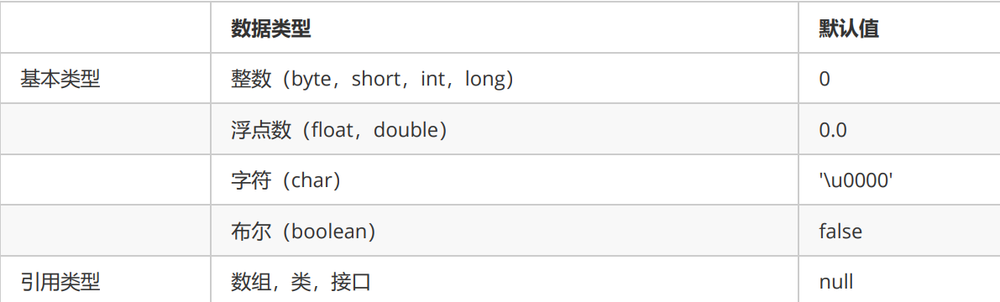
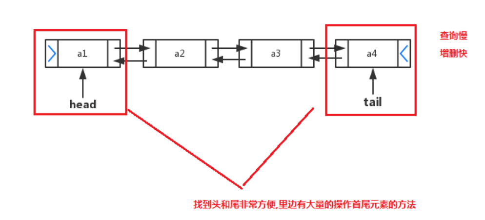
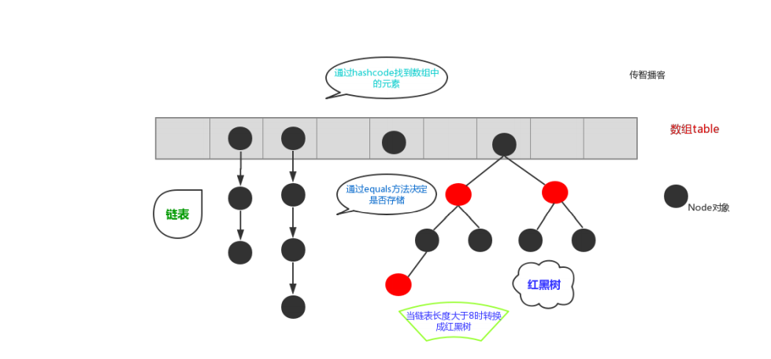
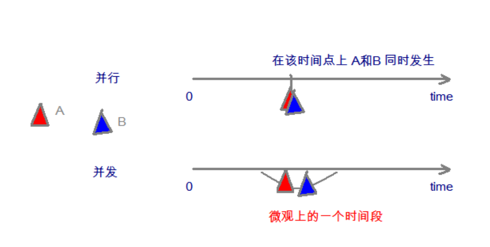
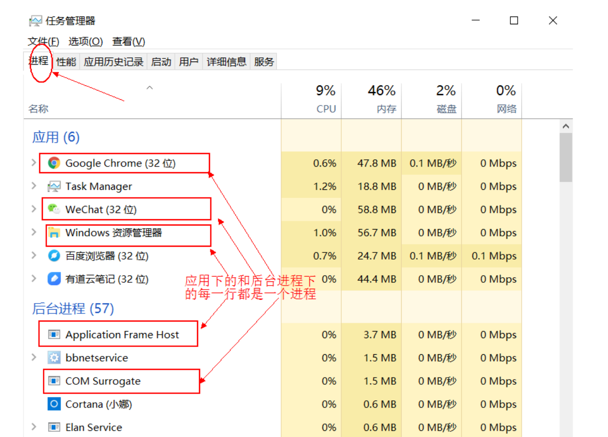

# 任

## 1. 内容介绍

## 2. java概述

## 3. 变量

### 3.1 java中的数据类型

Java是一个强类型语言，Java中的数据必须明确数据类型。在Java中的数据类型包括基本数据类型和引用数据类型
两种。
Java中的基本数据类型：


说明：
e+38表示是乘以10的38次方，同样，e-45表示乘以10的负45次方。
==在java中整数**默认**是int类型，浮点数**默认**是double类型。==

**==注意java的char是两个字节，而c/c++中是一个字节。==**

### 3.2 类型转换

在Java中，一些数据类型之间是可以相互转换的。分为两种情况：自动类型转换和强制类型转换。
自动类型转换：
把一个表示数据范围小的数值或者变量赋值给另一个表示数据范围大的变量。这种转换方式是自动的，直接书写即
可。例如：

```java
double num = 10;         // 将int类型的10直接赋值给double类型
System.out.println(num); // 输出10.0
```

强制类型转换：
把一个表示数据范围大的数值或者变量赋值给另一个表示数据范围小的变量。
强制类型转换格式：目标数据类型 变量名 = (目标数据类型)值或者变量;
例如：

```java
double num1 = 5.5;
int num2 = (int) num1; // 将double类型的num1强制转换为int类型
System.out.println(num2); // 输出5（小数位直接舍弃）
```


说明：

1. char类型的数据转换为int类型是按照码表中对应的int值进行计算的。比如在ASCII码表中，`'a'`对应`97`。

```java
int a = 'a';
System.out.println(a); // 将输出97
```

2. **==整数默认是int类型，byte、short和char类型数据参与运算均会自动转换为int类型。==**

```java
short b1 = 10;
short b2 = 20;
short b3 = b1 + b2;
// 第三行代码会报错，b1和b2会自动转换为int类型，计算结果为int，int赋值给short需要强制类型转换。

// 修改为:
int num = b1 + b2;
// 或者：
short b3 = (short) (b1 + b2);
```

3. **boolean类型不能与其他基本数据类型相互转换**。

## 4. 运算符

## 5. 程序控制结构

## 6. 数组，排序和查找

### 6.1 数组概念

数组概念： 数组就是存储数据长度固定的容器，保证多个数据的数据类型要一致。

### 6.2 数组定义

==**`java`中的数组必须初始化过后才能使用。**==

1. 方式一 动态初始化：**程序员只指定系统长度**，**==由系统为数组元素分配初始值==**。

   ```java
   int[] arr = new int[3];  //自动赋值为0
   ```

2. 方式二 静态初始化：程序员显示指定每个元素的初始值，**==由系统决定数组长度。==**

   ```java
   int[] arr = new int[]{1,2,3,4,5};
   ```

3. 方式三 **==静态初始化的简洁版==**

   ```java
   int[] arr = {1,2,3,4,5};
   ```

4. 方式四 属于静态初始化

   ```java
   Object objs[];   //Object []objs;
   objs=new Object[] {"ryy","syy"};
   ```

   

**==数组创建后，如果没有赋值，有默认值==**

`int 0，short 0, byte 0, long 0, float 0.0,double 0.0，char \u0000，boolean false，String null`

### 6.3 可变参数

==**可变参数的原理:**==
==**可变参数底层就是一个数组,根据传递参数个数不同,会创建不同长度的数组,来存储这些参数传递的参数个数,可以是0个(不传递),1,2...多个**==


在JDK1.5之后，**==如果我们定义一个方法需要接受多个参数，并且多个参数类型一致==**，我们可以对其简化成如下格
式：

```java
修饰符 返回值类型 方法名(参数类型... 形参名){ }
```

其实这个书写完全等价与

```java
修饰符 返回值类型 方法名(参数类型[] 形参名){ }
```

只是后面这种定义，在调用时必须传递数组，而前者可以直接传递数据即可。
JDK1.5以后。出现了简化操作。... 用在参数上，称之为可变参数。


同样是代表数组，但是在调用这个带有可变参数的方法时，不用创建数组(这就是简单之处)，直接将数组中的元素
作为实际参数进行传递，其实编译成的class文件，将这些元素先封装到一个数组中，在进行传递。这些动作都在编译`.class`文件时，自动完成了。


代码演示：

```java
public class ChangeArgs {
    public static void main(String[] args) {
        int[] arr = { 1, 4, 62, 431, 2 };
        int sum = getSum(arr);
        System.out.println(sum);
        // 6 7 2 12 2121
        // 求 这几个元素和 6 7 2 12 2121
        int sum2 = getSum(6, 7, 2, 12, 2121);
        System.out.println(sum2);
    }
    /*
    * 完成数组 所有元素的求和 原始写法
    public static int getSum(int[] arr){
    int sum = 0;
    for(int a : arr){
    	sum += a;
    }
    return sum;
    }
    */
    //可变参数写法
    public static int getSum(int... arr) {
        int sum = 0;
        for (int a : arr) {
            sum += a;
        }
        return sum;
    }
}
```

>tips: 上述add方法在同一个类中，只能存在一个。因为会发生调用的不确定性
>注意：==**1.如果在方法书写时，这个方法拥有多参数，参数中包含可变参数，可变参数一定要写在参数列表的末**====**尾位置。**==
>
>**==2.一个方法的参数列表，只能有一个可变参数。即使可变参数的类型不同，那也只能有一个可变参数。==**
>
>```java
>public void func(int...arr,String... str) //报错
>{
>    
>}
>```

## 7. 面向对象上

**==构造器是对对象进行初始化，而不是创建对象==**。

### 7.1 成员变量

#### 7.1.1 成员变量有默认值



**==c++的类成员变量没有默认值。或者说默认是随机值==**

#### 7.1.2 成员变量局部变量的区别

在类中的位置不同 重点
成员变量：类中，方法外
局部变量：方法中或者方法声明上(形式参数)


作用范围不一样 重点
成员变量：类中
局部变量：方法中


初始化值的不同 重点
==**成员变量：有默认值**==
局部变量：没有默认值。必须先定义，赋值，最后使用


在内存中的位置不同 了解 **c++中得看情况而定**
==**成员变量：堆内存**==
局部变量：栈内存


生命周期不同 了解
成员变量：随着对象的创建而存在，随着对象的消失而消失
局部变量：随着方法的调用而存在，随着方法的调用完毕而消失

### 7.2 构造方法

当一个对象被创建时候，构造方法用来初始化该对象，给对象的成员变量赋初始值。

> ==**小贴士：无论你与否自定义构造方法，所有的类都有构造方法，因为Java自动提供了一个无参数构造方法，**==
> ==**一旦自己定义了构造方法，Java自动提供的默认无参数构造方法就会失效。**==

构造方法的定义格式

```java
修饰符 构造方法名(参数列表){
// 方法体
}
```

构造方法的写法上，方法名与它所在的类名相同。它没有返回值，所以不需要返回值类型，甚至不需要void。使用
构造方法后，代码如下：

```java
public class Student 
{
	private String name;
	private int age;
	// 无参数构造方法
	public Student() {}
	// 有参数构造方法
	public Student(String name,int age) 
	{
		this.name = name;
		this.age = age;
	}
}
```

注意事项
1. **==如果你不提供构造方法，系统会给出无参数构造方法。==**
2. **==如果你提供了构造方法(无论是有参还是无参，注意：java中没有拷贝构造这一说)，系统将不再提供无参数构造方法。==**
3. 构造方法是可以重载的，既可以定义参数，也可以不定义参数。

### 7.3 标准代码——JavaBean

`JavaBean` 是 `Java`语言编写类的一种标准规范。符合 `JavaBean` 的类，要求类必须是具体的和公共的，**==并且具有无参数的构造方法==**，提供用来操作成员变量的 `set` 和 `get` 方法。

```java
public class ClassName{
	//成员变量
	//构造方法
	//无参构造方法【必须】
	//有参构造方法【建议】
	//成员方法
	//getXxx()
	//setXxx()
}

```

**==注意是必须显示的(即自实现)给定无参构造，这在c++和java中都是一个好习惯。==**

例子：

```java
public class Main
{
    public static void main(String[] args)
    {
        Person p=new Person(3);
        p.func();
        Person pp=new Person();
    }
}
class Person
{
    int a;
    Person(){}    //无参构造
    Person(int a)
    {
        this.a=a;
    }
    void func()
    {
        System.out.println(a);
    }
}
```

**==1.若提供了有参构造，那么系统不再提供无参构造，若你没有自定义一个无参构造函数的话，创建pp对象时将报错，因为找不到合适的构造函数，对于c++来说也是如此。==**

2.java中创建对象都是靠`new`，即使你不为构造函数传参(即调用无参构造)，那么也得加上那个小括号。

3.`p`是一个`Person`类型的局部(引用)变量(占据空间)，本质上还是一个局部指针变量，指向堆区中的一个`Person`对象(也要占据空间)。

4.来看看c++

```c++
class Person
{
public:
    int a;
    Person(){}    //无参构造
    Person(int a)
    {
        this.a=a;
    }
    void func()
    {
        cout<<a<<endl;
    }
}
int main()
{
    Person p1;  //等价于int a  即只是对象占用一份空间
    Person* p=new Person(3);  //占用两份空间 
}
```

`p`是一个`Person`类型的局部指针变量(占据空间)，指向堆区中的一个`Person`对象(也要占据空间)。

注意：`sizeof p1`可以测出对象的大小，`sizeof p`只能测出指针的大小为4个字节。

5.对于一个c++的数组也应该是如此，

```c++
int arr[3]={1,2,3};    //数组肯定是占据了空间，arr这个只读指针你说要不要占空间都是成立的，
                       //我更倾向于不占据空间，想象int a的内存图。最后结论，还是占的。
int *arr=new int[3];   //arr占空间，数组也占空间
```


### 7.4 this关键字

1) this 关键字可以用来访问本类的属性、方法、构造器

2) this 用于区分当前类的属性和局部变量

```java
public class Main
{
    public static void main(String[] args)
    {
        Person p=new Person(3);
        p.func();
    }
}
class Person
{
    int a;
    Person(int a)
    {
        this.a=a;
        //a=a;  //等价于this.a=this.a
        //如果你写成a=a;的话，那么最后的输出会是0.
    }
    void func()
    {
        System.out.println(a);
    }
}
```

如果你写成`a=a;`的话，那么最后的输出会是0。因为类的成员变量会有默认值0，相当于是将0再次赋值给了成员变量a，与形参没有关系。对于c++来说，也是如此。也许在c++中还会报错。

3) 访问成员方法的语法：this.方法名(参数列表); 

4) **==访问构造器语法：this(参数列表); 注意只能在构造器中使用(即只能在构造器中访问另外一个构造器, `必须放在第一条语句`)==**

5)this 不能在类定义的外部使用，只能在类定义的方法中使用。

### 7.5 super关键字

**父类空间优先于子类对象产生**。

在每次创建子类对象时，先初始化父类空间，再创建其子类对象本身。目的在于子类对象中包含了其对应的父类空
间，便可以包含其父类的成员，**如果父类成员非private修饰，则子类可以随意使用父类成员**。代**码体现在子类的构造方法调用时，一定先调用父类的构造方法**。理解图解如下：


super和this的含义
super ：代表父类的存储空间标识(可以理解为父亲的引用)。
this ： 代表当前对象的引用(谁调用就代表谁)。
super和this的用法

1. 访问成员

   ```JAVA
   this.成员变量 ‐‐ 本类的
   super.成员变量 ‐‐ 父类的
   this.成员方法名() ‐‐ 本类的
   super.成员方法名() ‐‐ 父类的
   ```

   用法演示，代码如下：

   ```JAVA
   class Animal {
       public void eat() {
           System.out.println("animal : eat");
       }
   }
   class Cat extends Animal {
       public void eat() {
           System.out.println("cat : eat");
       }
       public void eatTest() {
           this.eat(); // this 调用本类的方法
           super.eat(); // super 调用父类的方法
       }
   }
   public class ExtendsDemo08 {
       public static void main(String[] args) {
           Animal a = new Animal();
           a.eat();
           Cat c = new Cat();
           c.eatTest();
       }
   }
   输出结果为：
           animal : eat
           cat : eat
           animal : eat
   ```

2. 访问构造方法

   ```JAVA
   this(...) ‐‐ 本类的构造方法
   super(...) ‐‐ 父类的构造方法
   ```

   >==子类的每个构造方法中均有默认的super()，调用父类的空参构造。手动调用父类构造会覆盖默认的super()==。
   >==super() 和 this() 都必须是在构造方法的第一行，所以不能同时出现==。

### 7.6 static关键字

#### 7.6.1 概述

关于 `static` 关键字的使用，它可以用来修饰的成员变量和成员方法，**被修饰的成员(方法和变量)是属于类的**，**==而不是单单是属于某个对象的。也就是说，既然属于类，就可以不靠创建对象来调用了。==**

**==在类中的使用同c++,在c/c++语言中就代表空间一直一直存在呗。==**

#### 7.6.2 定义和使用格式

##### 7.6.2.1 **类变量**

==**当 `static` 修饰成员变量时，该变量称为类变量。该类的每个对象都`共享`同一个类变量的值。任何对象都可以更改该类变量的值，但也可以在不创建该类的对象的情况下对类变量进行操作。**==

* 类变量：使用 static关键字修饰的成员变量。

定义格式：

```java
static 数据类型 变量名；
```

举例：

```java
static int numberID；
```

##### 7.6.2.2 静态/类方法

当 static 修饰成员方法时，该方法称为类方法 。静态方法在声明中有 static ，建议使用类名来调用，而不需要创建类的对象。调用方式非常简单。

* **类方法：使用 static关键字修饰的成员方法，习惯称为静态方法。**

定义格式：

```java
修饰符 static 返回值类型 方法名 (参数列表){
// 执行语句
}
```

举例：在Student类中定义静态方法

```java
public static void showNum() {
	System.out.println("num:" + numberOfStudent);
}
```

静态方法调用的注意事项：

* 静态方法可以直接访问类变量和静态方法。
* **==静态方法不能直接访问普通成员变量或成员方法。反之，成员方法可以直接访问类变量或静态方法。==**
* **==静态方法中，不能使用this关键字。==**，**你的方法是属于类的，你没有对象**。

>小贴士：==静态方法只能访问静态成员(变量或方法)==。

##### 7.6.2.3 调用格式

被static修饰的成员可**以并且建议**通过类名直接访问。虽然也可以通过对象名访问静态成员，原因即多个对象均属
于一个类，共享使用同一个静态成员，但是不建议，会出现警告信息。
格式：

```java
// 访问类变量
类名.类变量名；
// 调用静态方法
类名.静态方法名(参数)；
```

例子：

```java
public class StuDemo2 {
public static void main(String[] args) {
		// 访问类变量
		System.out.println(Student.numberOfStudent);
		// 调用静态方法
		Student.showNum();
	}
}
```

#### 7.6.3 静态原理图解

static 修饰的内容：

* **==是随着类的加载而加载的，且只加载一次。==**
* 存储于一块固定的内存区域（静态区），所以，可以直接被类名调用。
* **==它优先于对象存在，所以，可以被所有对象共享。==**


#### 7.6.4 静态代码块

静态代码块：**定义在成员位置**，使用`static`修饰的代码块{ }。
位置：类中方法外。
执行：**==随着类的加载而执行且执行一次，优先于main方法和构造方法的执行。==**
格式：

```java
public class ClassName{
    static {
        // 执行语句
    }
}
```

作用：**==给类变量进行初始化赋值==**。用法演示，代码如下：

```java
public class Game {
    public static int number;
    public static ArrayList<String> list;
    static {
        // 给类变量赋值
        number = 2;
        list = new ArrayList<String>();
        // 添加元素到集合中
        list.add("张三");
        list.add("李四");
    }
}
```

>小贴士：
>static 关键字，**==可以修饰变量、方法和代码块==**。在使用的过程中，==**其主要目的还是想在不创建对象的情况**==
>==**下，去调用方法**==。下面将介绍两个工具类(Arrays,Math)，来体现static 方法的便利。

### 7.7 final关键字

#### 7.7.1 概述

学习了继承后，我们知道，子类可以在父类的基础上改写父类内容，比如，方法重写。那么我们能不能随意的继承
API中提供的类，改写其内容呢？显然这是不合适的。为了避免这种随意改写的情况，Java提供了 final 关键字，
用于修饰**不可改变**内容。

* final： 不可改变。可以用于修饰类、方法和变量。
  * 类：被修饰的类，不能被继承。
  * 方法：被修饰的方法，不能被重写。
  * 变量(成员变量，局部变量)：被修饰的变量，不能被重新赋值。

#### 7.7.2 使用方式

##### 7.7.2.1 修饰类

格式如下：

```java
final class 类名 {
}
```

使用`final`修饰的类，不能被继承。

查询API发现像 `public final class String` 、` public final class Math` 、 `public final class Scanner`等，很多我们学习过的类**==，都是被final修饰的，目的就是供我们使用，而不让我们所以改变其内容。==**

##### 7.7.2.2 修饰方法

格式如下：

```java
修饰符 final 返回值类型 方法名(参数列表){
    //方法体
}
```

重写被 `final` 修饰的方法，编译时就会报错。即`final`修饰的方法不可以被重写。

##### 7.7.2.3 修饰变量

1. 局部变量——基本类型

   基本类型的局部变量，被final修饰后，只能赋值一次，不能再更改。代码如下：

   ```java
   public class FinalDemo1 {
       public static void main(String[] args) {
           // 声明变量，使用final修饰
           final int a;
           // 第一次赋值
           a = 10;
           // 第二次赋值
           a = 20; // 报错,不可重新赋值
           // 声明变量，直接赋值，使用final修饰
           final int b = 10;
           // 第二次赋值
           b = 20; // 报错,不可重新赋值
       }
   }
   ```

   思考，如下两种写法，哪种可以通过编译？

   写法1：

   ```java
   final int c = 0;
   for (int i = 0; i < 10; i++) {
             c = i;
             System.out.println(c);
   }
   ```

   写法2：

   ```java
   for (int i = 0; i < 10; i++) {
   	final int c = i;
   	System.out.println(c);
   }
   ```

   根据 final 的定义，写法1报错！写法2，为什么通过编译呢？**==因为每次循环，都是一次新的变量c。这也是大家需要注意的地方。==**

2. 局部变量——引用类型

   引用类型的局部变量，被final修饰后，只能指向一个对象，地址不能再更改。但是不影响对象内部的成员变量值的修改，

   代码如下：

   ```java
   public class FinalDemo2 {
       public static void main(String[] args) {
           // 创建 User 对象
           final User u = new User();
           // 创建 另一个 User对象
           u = new User(); // 报错，指向了新的对象，地址值改变。
           // 调用setName方法
           u.setName("张三"); // 可以修改
       }
   }
   ```

3. 成员变量

   成员变量涉及到初始化的问题，初始化方式有两种，只能二选一：

   * 显示初始化；

     ```java
     public class User {
     	final String USERNAME = "张三";
     	private int age;
     }
     ```

   * 构造方法初始化。

     ```java
     public class User {
         final String USERNAME ;
         private int age;
         public User(String username, int age) {
             this.USERNAME = username;
             this.age = age;
         }
     }
     ```

   >**==被final修饰的常量名称，一般都有书写规范，所有字母都大写。==**

## 8. 面向对象中

### 8.1 访问修饰符

在Java中提供了四种访问权限，使用不同的访问权限修饰符修饰时，被修饰的内容会有不同的访问权限，

* public：公共的。
* protected：受保护的
* default：默认的 这个不是关键字，不写就是这个级别
* private：私有的

#### 8.1.2 不同权限的访问能力


**可见，public具有最大权限。private则是最小权限**。
编写代码时，如果没有特殊的考虑，建议这样使用权限：

* 成员变量使用 private ，隐藏细节。
* 构造方法使用 public ，方便创建对象。
* 成员方法使用 public ，方便调用方法。

>小贴士：**==不加权限修饰符，其访问能力与default修饰符相同==**

## 9. 面向对象下

### 9.1 抽象类

#### 9.1.1  概述

**由来**
**父类中的方法，被它的子类们重写，子类各自的实现都不尽相同。那么父类的方法声明和方法主体，==只有声明还有意义，而方法主体则没有存在的意义了==**。==**我们把没有方法主体的方法称为抽象方法。**==

==**Java语法规定，只要包含抽象方法的类就是抽象类。**==
**定义**
抽象方法 ： **==没有方法体的方法==。**
抽象类：    **包含抽象方法的类。**


在C++中，当类中有了纯虚函数，这个类也称为==抽象类==，析构函数也是函数，所以，拥有纯虚析构的类也是抽象类。**C++的抽象类和java的抽象类绝对是有天壤之别的**。**==共同点是都不能实例化对象，用做多态用==**。

**==类中的方法用abstract修饰，称为抽象方法。==**

==**类中的方法用virtual修饰，称为虚函数。**==

**当前，我们不对类中其它方法做对比，也没啥好对比的。**

#### 9.1.2 abstract使用格式

##### 9.1.2.1 **抽象方法**
使用 `abstract` 关键字修饰方法，该方法就成了抽象方法，**==抽象方法只包含一个方法名，而没有方法体。大括号换成分号即可==**
定义格式：

```java
修饰符 abstract 返回值类型 方法名 (参数列表)；
```

代码举例：

```java
public abstract void run()；
```

##### 9.1.2.2 抽象类

**==如果一个类包含抽象方法，那么该类必须是抽象类，意思就是`必须`在这个类上加上`abstract`关键字。==**
定义格式：

```java
abstract class 类名字 {
}
```

代码举例：

```java
public abstract class Animal {
    public abstract void run()；
}
```

##### 9.1.2.3 抽象的使用

**==继承抽象类的子类必须重写父类所有的抽象方法。否则，该子类也必须声明为抽象类==**。**最终，必须有子类实现该父**
**类的所有抽象方法，否则，从最初的父类到最终的子类都不能创建对象，失去意义**。


代码举例：

```java
public class Cat extends Animal {
    public void run (){
        System.out.println("小猫在墙头走~~~")；
    }
}
public class CatTest {
    public static void main(String[] args) {
        // 创建子类对象
        Cat c = new Cat();
        // 调用run方法
        c.run();
    }
}
输出结果：
        小猫在墙头走~~~
```

**此时的方法重写，是子类对父类抽象方法的完成实现**，我们将这种方法重写的操作，**==也叫做实现方法。==**

#### 9.1.3 注意事项

关于抽象类的使用，以下为语法上要注意的细节，虽然条目较多，但若理解了抽象的本质，无需死记硬背。
1. 抽象类不能创建对象，如果创建，编译无法通过而报错。只能创建其非抽象子类的对象。

  > 理解：**==假设创建了抽象类的对象，调用抽象的方法，而抽象方法没有具体的方法体，没有意义。(为抽象类创建对象干嘛呢？)==**

2. 抽象类中，可以有构造方法，是供子类创建对象时，初始化父类成员使用的。

  > 理解：**==子类的构造方法中，有默认的super()，需要访问父类构造方法。==**

3. 抽象类中，不一定包含抽象方法，但是有抽象方法的类必定是抽象类。

   > 理解：**未包含抽象方法的抽象类，目的就是不想让调用者创建该类对象，通常用于某些特殊的类结构设**
   > **计。**

4. 抽象类的子类，必须重写抽象父类中所有的抽象方法，否则，编译无法通过而报错。除非该子类也是抽象
    类。

  > 理解：==**假设不重写所有抽象方法，那么创建对象后，调用抽象的方法(没有具体的实现)，没有**====**意义**。==

5. **==抽象类的本质还是类，所以可以有类的各种成员(变量，方法，构造器)，不要和接口搞混了，`接口只有常量，没有构造器`==**

### 9.2 接口

#### 9.2.1 概述

接口，**==是Java语言中一种引用类型，是方法的集合==**，如果说类的内部封装了成员变量、构造方法和成员方法，那么
接口的内部主要就是封装了方法，包含**==抽象方法和常量==**（JDK 7及以前），**默认方法和静态方法**（JDK 8），**私有方法**
（JDK 9）。
==**接口的定义，它与定义类方式相似，但是使用 interface 关键字。它也会被编译成.class文件，但一定要明确它并不是类，而是另外一种引用数据类型。**==

> 引用数据类型：数组，类，接口。

==**接口的使用，它不能创建对象，但是可以被实现（ implements ，类似于被继承）。一个实现接口的类（可以看做**====**是接口的子类）**==，**==需要实现接口中所有的抽象方法，创建该类对象，就可以调用方法了，否则它必须是一个抽象类==**。

**==接口就是多个类的公共规范。==**


#### 9.2.2 接口使用步骤

1.．接口不能直接使用，必须有一个“实现类”来“实现”该接口。格式:

```java
public class 实现类名称 impLements 接口名称{
    // ...
}
```

2．接口的实现类必须覆盖重写（实现)接口中**所有的抽象方法**,**除非这个类自己也是抽象类**。实现:**==去掉abstract关键字，加上方法体大括号。==**
3．**==创建实现类的对象,进行使用。==**

#### 9.2.3 定义格式

```java
public interface 接口名称 {
    // 抽象方法
    // 默认方法
    // 静态方法
    // 私有方法
}
```

##### 9.2.3.1 含有抽象方法
抽象方法：使用 `abstract` 关键字修饰，可以省略，没有方法体。该方法供子类实现使用。
代码如下：

```java
public interface InterFaceName {
	public abstract void method(); 
}
```

注意：

1. 可以省略任意其中一个关键字，也可以两个都省略，该方法仍为抽象方法。
2. 只能用`public abstract`两个关键字修饰抽象方法。因为你要给实现这个接口的类使用，怎么可能是`private protected`等关键字呢？

##### 9.2.3.2 含有默认方法(一般是有方法体实现的)

**==接口的默认方法，可以解决接口升级的问题。==**


默认方法可以继承，可以重写，二选一，但是只能通过实现类的对象来调用。


默认方法：使用 `default` 修饰，不可省略，供子类**==调用==**或者子类**==重写==**。其前面的修饰符只能是public,可省略

示例：

```java
public interface P
{
    void f();  //抽象方法
    //现在要新增加一个抽象方法
    //public abstract void show();
    //改为默认方法
    public default void show()
    {
        do sth
    }
}
public class A implements P
{
	public void f()  //重写
	{
		do sth
	}
	@Override
	public void show()
	{
		do sth
	}
}
public class B implements P
{
	public void f()  //重写
	{
		do sth
	}
}
```

考虑上面一种情况，假设有很多类`A B C ...`都是实现了接口`P`。但是现在要为接口`P`新增一个抽象方法，那么实现了该接口的所有类都必然会报错，等待你去一一重写该抽象方法，有可能这些类当前情况正在使用，不能改动呢？

所以，我们可以将新增加的抽象方法声明为默认方法，这样子就不会报错了。并且子类重不重写该默认方法是可选的。如果该类中没有重写该默认方法，那么该类会去接口中寻找。

##### 9.2.3.3 含有静态方法(一般是有方法体实现的)

静态方法：使用 `static` 修饰，供接口直接调用。其前面的修饰符只能是public,可省略

静态与.class 文件相关，**只能使用接口名调用**，不可以通过实现类的类名或者实现类的对象调用

**==定义接口：==**

```java
public interface LiveAble {
    public static void run(){
        System.out.println("跑起来~~~");
    }
}
```

**==定义实现类：==**

```java
public class Animal implements LiveAble {
	// 无法重写静态方法
}
```

**==定义测试类：==**

```java
public class InterfaceDemo {
public static void main(String[] args) {
		// Animal.run(); // 【错误】无法继承方法,也无法调用
		LiveAble.run(); //
	}
}
输出结果：
跑起来~~~
```

##### 9.2.3.4 具有私有方法(一般是有方法体实现的)

* 私有方法：只有默认方法可以调用。这是显而易见的，
* 私有静态方法(感觉好奇怪呢)：默认方法和静态方法可以调用。

==**如果一个接口中有多个默认方法，并且方法中有重复的内容，那么可以抽取出来，封装到私有方法中，供默认方法**==
==**去调用**==。**==你可能觉得我们可以把重复的内容抽取出来再封装成默认方法，但是这样带来的弊端是实现类也可以调用到这个默认方法了，这是没有必要的，因为我们提取出来的初衷是为了让接口中的默认方法来调用的==**。从设计的角度讲，私有的方法是对默认方法和静态方法的辅助。同学们在已学技术的基础上，可以自行测试。

```java
从Java 9开始，接口当中允许定义私有方法。
1．普通私有方法，解决多个默认方法之间重复代码问题
格式;
private	返回值类型 方法名称(参数列表){
	方法体
}
2．静态私有方法，解决多个静态方法之间重复代码问题
格式:
private static 返回值类型 方法名称(参数列表){
	方法体
}
```

##### 9.2.3.5 具有常量

```java
public interface P
{
    public static final int num=10;
}
```

注意：

1. 默认是常量，` public static final`可省略其中的任意一个，两个，或全部省略。
2. 必须初始化，否则报错。(因为默认值是0，你不初始化的话就一直是0不可变，这没有任何意义。)
3. **==公共 跟对象没关系(即通过接口名直接调用) 不可变==**

##### 9.2.3.6 更多细节

使用接口的时候，需要注意:
1．接口是没有静态代码块或者构造方法的。
2.一个类的直接父类是唯一的，但是一个类可以同时实现多个接口。

格式:
`public class MyInterfaceImpl implLements MyInterfaceA，MyInterfaceB {
    //覆盖重写所有抽象方法
}`
3．如果实现类所实现的多个接口当中，存在重复的抽象方法，那么只需要覆盖重写一次即可。
4．如果实现类没有覆盖重写所有接口当中的所有抽象方法，那么实现类就必须是一个抽象类。

5. 如果实现类所实现的多个接口当中，存在重复的默认方法，那么实现类一定要对冲突的默认方法进行覆盖重写。
6. 一个类如果直接父类当中的方法，和接口当中的默认方法产生了冲突(重名)，优先用父类当中的方法。

**==接口中，无法定义成员变量，但是可以定义常量，其值不可以改变，默认使用public static final修饰。==**
==**接口中，没有构造方法，不能创建对象。**==
==**接口中，没有静态代码块。**==

##### 9.2.3.7 接口是可以多继承的

1．类与类之间是单继承的。直接父类只有一个。
2．类与接口之间是多实现的。一个类可以实现多个接口。

3．接口与接口之间是多继承的。
注意事项:
1.多个父接口当中的抽象方法如果重复，没关系(因为它连具体的实现都没有)。
2.多个父接口当中的默认方法如果重复，那么子接口必须进行默认方法的覆盖重写，**【而且带着default关键字】**

定义父接口：

```java
interface A {
    public default void method(){
        System.out.println("AAAAAAAAAAAAAAAAAAA");
    }
}
interface B {
    public default void method(){
        System.out.println("BBBBBBBBBBBBBBBBBBB");
    }
}
```

定义子接口：

```java
interface D extends A,B{
    @Override
    public default void method() {
        System.out.println("DDDDDDDDDDDDDD");
    }
}
```

>小贴士：
>==**子接口重写默认方法时，default关键字必须保留。**==
>==**子类重写默认方法时，default关键字不可以保留。**==


#### 9.2.4 小结

在Java 9+版本中，接口的内容可以有:
1．成员变量其实是常量，格式:
`[public] [static] [final]数据类型常量名称–数据值;`
注意:
常量必须进行赋值,而且一旦赋值不能改变。常量名称完全大写，用下划线进行分隔。
2．接口中最重要的就是抽象方法，格式:
`[public] [abstract] 返回值类型 方法名称(参数列表);`
注意:实现类必须覆盖重写接口所有的抽象方法，除非实现类是抽象类。
3．从Java 8开始，接口里允许定义默认方法，格式:
`[public ] default返回值类型方法名称(参数列表){ 方法体}`
注意:默认方法也可以被覆盖重写
4．从Java 8开始，接口里允许定义静态方法，格式:
`[public] static 返回值类型 方法名称(参数列表){方法体}`
注意:应该通过接口名称进行调用，不能通过实现类对象调用接口静态方法
5．从Java 9开始，接口里允许定义私有方法，格式:
普通私有方法: `private 返回值类型 方法名称(参数列表){方法体}`
静态私有方法: `private static 返回值类型 方法名称(参数列表){方法体}`
注意:private的方法只有接口自己才能调用，不能被实现类或别人使用。

### 9.3 多态

#### 9.3.1 概述

**==引入==**
多态是继封装、继承之后，面向对象的第三大特性。
生活中，比如跑的动作，小猫、小狗和大象，跑起来是不一样的。再比如飞的动作，昆虫、鸟类和飞机，飞起来也
是不一样的。可见，同一行为，通过不同的事物，可以体现出来的不同的形态。多态，描述的就是这样的状态。


**==就像动物都会叫，但是猫具体叫的特点是喵喵，狗具体叫的特点是嗷嗷。但是动物们都有叫这一种行为，也有自己独特的叫这一行为，我们当然是想每种动物都能独特的叫(活着要有点个性),当然不排除某些动物只会动物叫。==**


**==定义==**
多态： 是指同一行为，具有多个不同表现形式。


==**注意：**==

==**虽然实现多态的时候你的父类可以不是抽象类(或接口)，就是一个普通的类，里面没有抽象方法，但是只要你重写了方法，父类指针指向了子类对象，那也勉强可以称作是多态。**==

==**但是，建议还是用抽象类或接口来实现多态。这样更符合清理一些，因为引入多态就是要展现子类自己的个性，我们是不需要父类中有方法的具体实现的。**==


**==接口可以看作是比抽象类更加抽象的类。主要是为了解决C++繁琐的多继承而产生。因为java只能单继承，如果这个类还实现了接口就相当于是多继承了==**


**在多态的代码当中，成员方法的访问规则是:**
**==看new的是谁，就优先用谁，没有则向上找==。**


**口诀:编译看左边，运行看右边。**
**对比一下:**
**`成员变量`:==编译看左边，运行还看左边==。**

**成员方法:编译看左边,运行看右边。**

​	**父子都有，优先用子**
​	**子类没有，父类有，向上找到父类(这就是普通类实现多态的情况吧，或者抽象类的普通方法没有被重写)**

#### 9.3.2 多态实现的必要条件

1. **==继承==**(包括类的继承，接口的继承)或者==实现==(类实现接口)【二选一】
2. **==方法的重写【意义体现：不重写，无意义】==**。**要有自己的特点。**
3. **==父类引用指向子类对象【格式体现】==**

#### 9.3.3  多态的体现

多态体现的格式：

```java
父类类型 变量名 = new 子类对象；
变量名.方法名();
```

>父类类型：指子类对象继承的==父类类型==，或者实现的==父接口类型==。

代码如下：

```java
Fu f = new Zi();
f.method();
```

==**当使用多态方式调用方法时，首先检查父类中是否有该方法，如果没有，则编译错误；如果有，执行的是子类重写后方法。前提是这个父类必须是抽象类或接口，如果是一个普通类来实现的多态(这里说了一个普通的类是可以实现多态的)，子类是可以不重写该方法的，如果没有重写，直接调用父类中的该方法。当然，还有一种情况是抽象类中的普通方法，子类并没有重写，那么也是调用父类中的方法**==

代码如下：


定义父类：

```java
public abstract class Animal {
    public abstract void eat();
}
```

定义子类：

```java
class Cat extends Animal {
    public void eat() {
        System.out.println("吃鱼");
    }
}
class Dog extends Animal {
    public void eat() {
        System.out.println("吃骨头");
    }
}
```

定义测试类：

```java
public class Test {
    public static void main(String[] args) {
        // 多态形式，创建对象
        Animal a1 = new Cat();
        // 调用的是 Cat 的 eat
        a1.eat();
        // 多态形式，创建对象
        Animal a2 = new Dog();
        // 调用的是 Dog 的 eat
        a2.eat();
    }
}
```

#### 9.3.4 引用类型转换

多态的转型分为向上转型与向下转型两种：

##### 9.3.4.1 向上转型

* 向上转型：**多态本身是子类类型向父类类型向上转换的过程，==这个过程是默认的==**。

当父类引用指向一个子类对象时，便是向上转型。
使用格式：

```java
父类类型 变量名 = new 子类类型();
如：Animal a = new Cat();
```

##### 9.3.4.2 向下转型

* 向下转型：**父类类型向子类类型向下转换的过程，==这个过程是强制的==**。

一个已经向上转型的子类对象，将父类引用转为子类引用，可以使用强制类型转换的格式，便是向下转型。
使用格式：

```java
子类类型 变量名 = (子类类型) 父类变量名;
如:Cat c =(Cat) a;
```

##### 9.3.4.3 为什么要转型

**==当使用多态方式调用方法时，首先检查父类中是否有该方法==，如果没有，则编译错误(因为即使发生了多态，编译时还是父类类型的引用或对象，但是你这个方法是子类的，父类中没有，肯定报错啊)。==也就是说，不能调用子类拥有，而父类没有的方法==。编译都错误，更别说运行了。这也是多态给我们带来的一点"小麻烦"。所以，想要调用子类特有的方法，必须做向下转型。**

**值得注意的是，如果已经发生了多态，那么你想要去访问子类独有的变量(变量也没有多态这一说)是不可以的，必须向下转型**。


**==另外一种解决方案是把这个子类特有的方法也给它搞到父类里去做成抽象方法，这样大家就可以一起快乐的多态了==**


转型演示，代码如下：


定义类：

```java
abstract class Animal {
    abstract void eat();
}
class Cat extends Animal {
    public void eat() {
        System.out.println("吃鱼");
    }
    public void catchMouse() {
        System.out.println("抓老鼠");
    }
}
class Dog extends Animal {
    public void eat() {
        System.out.println("吃骨头");
    }
    public void watchHouse() {
        System.out.println("看家");
    }
}
```

定义测试类：

```java
public class Test {
    public static void main(String[] args) {
        // 向上转型
        Animal a = new Cat();
        a.eat(); // 调用的是 Cat 的 eat
        
        a.catchMouse(); //如果你直接调用Cat类特有的方法是会报错的。因为对象a的编译类型是Animal
                        //而Animal类中没有catchMouse()方法，你怎么可以把它.出来呢？
                        //对于变量来说也是如此。变量不存在多态一说，所以只有本类对象才能使用本类                         //的变量。当然了，你继承了一个类，也能使用那个类的变量。
        // 向下转型
        Cat c = (Cat)a;
        c.catchMouse(); // 调用的是 Cat 的 catchMouse
        ((Cat)a).b;  //你不能干巴巴的摆在这里，会报错的
        int b=  ((Cat)a).b;  //这样子就不会报错了
    }
}
```

注意：可以直接写`((Cat)a).catchMouse()`。**==注意是两个括号啊！！！不然报错。==**

**现在假设我们的猫类有一个变量**`int b`。会出什么错在上面的注释中。

##### 9.3.4.4 转型的异常(没有继承关系的两个类不能相互转换)

转型的过程中，一不小心就会遇到这样的问题，请看如下代码：

```java
public class Test {
    public static void main(String[] args) {
        // 向上转型
        Animal a = new Cat();
        a.eat(); // 调用的是 Cat 的 eat
        // 向下转型
        Dog d = (Dog)a;
        d.watchHouse(); // 调用的是 Dog 的 watchHouse 【运行报错】
    }
}
```

这段代码可以通过编译，但是运行时，却报出了 `ClassCastException` ，类型转换异常！这是因为，明明创建了
`Cat`类型对象，运行时，当然不能转换成`Dog`对象的。这两个类型并没有任何继承关系，不符合类型转换的定义。为了避免`ClassCastException`的发生，Java提供了 `instanceof `关键字，给引用变量做类型的校验，格式如下：

```java
变量名 instanceof 数据类型
如果变量属于该数据类型，返回true。
如果变量不属于该数据类型，返回false。
```

所以，转换前，我们最好先做一个判断，代码如下：

```java
public class Test {
    public static void main(String[] args) {
        // 向上转型
        Animal a = new Cat();
        a.eat(); // 调用的是 Cat 的 eat
        // 向下转型
        if (a instanceof Cat){
            Cat c = (Cat)a;
            c.catchMouse(); // 调用的是 Cat 的 catchMouse
        } else if (a instanceof Dog){
            Dog d = (Dog)a;
            d.watchHouse(); // 调用的是 Dog 的 watchHouse
        }
    }
}
```

#### 9.3.4.5 多态的好处和应用

多态数组：

数组的定义类型为父类类型，里面保存的实际元素类型为子类类型

 

 

应用实例:现有一个继承结构如下：要求创建 1 个 Person 对象、2 个 Student 对象和 2 个 Teacher 对象, 统一放在数组中，并调用每个对象

say 方法.

 

应用实例升级：如何调用子类特有的方法，比如

Teacher 有一个 teach , Student 有一个 study

怎么调用？ 

```java
public class PloyArray {
public static void main(String[] args) {
	//应用实例:现有一个继承结构如下：要求创建 1 个 Person 对象、
	// 2 个 Student 对象和 2 个 Teacher 对象, 统一放在数组中，并调用每个对象 say 方法
	Person[] persons = new Person[5]; 
    persons[0] = new Person("jack", 20); 
    persons[1] = new Student("mary", 18, 100);
	persons[2] = new Student("smith", 19, 30.1);
	persons[3] = new Teacher("scott", 30, 20000);
	persons[4] = new Teacher("king", 50, 25000);


	//循环遍历多态数组，调用 say
	for (int i = 0; i < persons.length; i++) {
		//老师提示: person[i] 编译类型是 Person ,运行类型是是根据实际情况有 JVM 来判断
		System.out.println(persons[i].say());//动态绑定机制
		//这里大家聪明. 使用 类型判断 + 向下转型.
		if(persons[i]	instanceof	Student) {//判断 person[i] 的运行类型是不是 Student Student 				student = (Student)persons[i]; //向下转型
			  student.study();  //你也可以选择将study一起多态。
			  //小伙伴也可以使用一条语句 ((Student)persons[i]).study();
		} 
        else if(persons[i] instanceof	Teacher) { 
              Teacher teacher = (Teacher)persons[i]; 
              teacher.teach();
            } 
        else if(persons[i] instanceof	Person){
			
			} else {
				System.out.println("你的类型有误, 请自己检查...");
				}
}
}
}
```


## 10. 枚举和注解

## 11. 异常

### 11.1 异常概念

异常，就是不正常的意思。在生活中:医生说,你的身体某个部位有异常,该部位和正常相比有点不同,该部位的功能将受影响.在程序中的意思就是：

* **==异常==** ：指的是程序在执行过程中，出现的非正常的情况，最终会导致JVM的非正常停止。

在Java等面向对象的编程语言中，异常本身是一个类，产生异常就是创建异常对象并抛出了一个异常对象。Java处
理异常的方式是中断处理。

> 异常指的并不是语法错误,语法错了,编译不通过,不会产生字节码文件,根本不能运行.

### 11.2 异常体系

异常机制其实是帮助我们找到程序中的问题，异常的根类是 `java.lang.Throwable` ，其下有两个子类：
`java.lang.Error` 与 `java.lang.Exception` ，平常所说的异常指 `java.lang.Exception` 。


**Throwable体系：**
**Error**:严重错误Error，无法通过处理的错误，只能事先避免，好比绝症。
**Exception**:表示异常，异常产生后程序员可以通过代码的方式纠正，使程序继续运行，是必须要处理的。好
比感冒、阑尾炎。


**Throwable中的常用方法：**

* **`public void printStackTrace()` :打印异常的详细信息。**
  **==包含了异常的类型,异常的原因,还包括异常出现的位置,在开发和调试阶段,都得使用printStackTrace。==**
* public String getMessage() :获取发生异常的原因。
  提示给用户的时候,就提示错误原因。
* public String toString() :获取异常的类型和异常描述信息(不用)。

**出现异常,不要紧张,把异常的简单类名,拷贝到API中去查。**


### 11.3 异常分类

我们平常说的异常就是指Exception，因为这类异常一旦出现，我们就要对代码进行更正，修复程序。


**异常(Exception)的分类:根据在编译时期还是运行时期去检查异常?**

* 编译时期异常:checked异常。在编译时期,就会检查,如果没有处理异常,则编译失败。(如日期格式化异常)
* 运行时期异常:runtime异常。在运行时期,检查异常.在编译时期,运行异常不会编译器检测(不报错)。(如数学异常)


### 11.4 异常的产生过程解析

先运行下面的程序，程序会产生一个数组索引越界异常ArrayIndexOfBoundsException。我们通过图解来解析下
异常产生的过程。

工具类：

```java
public class ArrayTools {
    // 对给定的数组通过给定的角标获取元素。
    public static int getElement(int[] arr, int index) {
        int element = arr[index];
        return element;
    }
}
```

测试类：

```java
public class ExceptionDemo {
    public static void main(String[] args) {
        int[] arr = { 34, 12, 67 };
        intnum = ArrayTools.getElement(arr, 4)
        System.out.println("num=" + num);
        System.out.println("over");
    }
}
```

上述程序执行过程图解：


### 11.5 异常的处理

`Java`异常处理的五个关键字：`try`、`catch`、`finally`、`throw`、`throws`

#### 11.5.1 抛出异常throw

在编写程序时，我们必须要考虑程序出现问题的情况。比如，在定义方法时，方法需要接受参数。那么，当调用方
法使用接受到的参数时，==**首先需要先对参数数据进行合法的判断，数据若不合法，就应该告诉调用者，传递合法的**==
==**数据进来。这时需要使用抛出异常的方式来告诉调用者。**==


在java中，提供了一个throw关键字，它用来抛出一个指定的异常对象。那么，抛出一个异常具体如何操作呢？

1. 创建一个异常对象。封装一些提示信息(信息可以自己编写)。
2. 需要将这个异常对象告知给调用者。怎么告知呢？怎么将这个异常对象传递到调用者处呢？通过关键字throw
就可以完成。throw 异常对象。
throw用在方法内，用来抛出一个异常对象，将这个异常对象传递到调用者处，并结束当前方法的执行。

使用格式：

```java
throw new 异常类名(参数);
```

例如：匿名对象。

```java
这下面两个类都是RuntimeException的子类。
throw new NullPointerException("要访问的arr数组不存在");
throw new ArrayIndexOutOfBoundsException("该索引在数组中不存在，已超出范围");
```

学习完抛出异常的格式后，我们通过下面程序演示下throw的使用。

```java
public class ThrowDemo {
    public static void main(String[] args) {
        //创建一个数组
        int[] arr = {2,4,52,2};
        //根据索引找对应的元素
        int index = 4;
        int element = getElement(arr, index);
        System.out.println(element);
        System.out.println("over");
    }
    /*
     * 根据 索引找到数组中对应的元素
     */
    public static int getElement(int[] arr,int index){
        //判断 索引是否越界
        if(index<0 || index>arr.length‐1){
        /*
        判断条件如果满足，当执行完throw抛出异常对象后，方法已经无法继续运算。
        这时就会结束当前方法的执行，并将异常告知给调用者。这时就需要通过异常来解决。
        */
            throw new ArrayIndexOutOfBoundsException("哥们，角标越界了~~~");
        }
        int element = arr[index];
        return element;
    }
}
```

>注意：如果产生了问题，我们就会throw将问题描述类即异常进行抛出，也就是将问题返回给该方法的调用
>者。
>那么对于调用者来说，该怎么处理呢？一种是进行捕获处理，另一种就是继续将问题声明出去，使用throws
>声明处理。

```java
throw关键字作用:
可以使用throw关键字在指定的方法中抛出指定的异常使用格式:
throw new XXXException("异常产生的原因");注意:
1.throw关键字必须写在方法的内部
2.throw关键字后边new的对象必须是Exception或者Exception的子类对象
3.throw关键字抛出指定的异常对象,我们就必须处理这个异常对象
throw关键字后边创建的是RuntimeException或者是RuntimeException的子类对象,我们可以不处理,默认交给JVM处理(打印异常对象,然后中断程序).运行期异常无需处理。
throw关键字后边创建的是编译异常(例如FileNotFoundException)(写代码的时候报错),我们就必须处理这个异常,要么throws(不会继续执行后面的代码逻辑),要么try...catch。
```

#### 11.5.2 Objects非空判断

还记得我们学习过一个类Objects吗，曾经提到过它由一些静态的实用方法组成，这些方法是null-save（空指针安
全的）或null-tolerant（容忍空指针的），那么在它的源码中，对对象为null的值进行了抛出异常操作。

* `public static  T requireNonNull(T obj)` :查看指定引用对象不是null。

查看源码发现这里对为null的进行了抛出异常操作：

```JAVA
public static <T> T requireNonNull(T obj) {
        if (obj == null)
       		 throw new NullPointerException();
        return obj;
}
```

####  11.5.3 声明异常throws(处理异常的第一种方式)

声明异常：将问题标识出来，报告给调用者。如果方法内通过throw抛出了编译时异常，而没有捕获处理（稍后讲
解该方式），那么必须通过throws进行声明，让调用者去处理。
==**关键字throws运用于方法声明之上,用于表示当前方法不处理异常,而是提醒该方法的调用者来处理异常(抛出异常).**==


**声明异常格式：**

```JAVA
修饰符 返回值类型 方法名(参数) throws 异常类名1,异常类名2…{ }
```

声明异常的代码演示：

```java
public class ThrowsDemo {
    public static void main(String[] args) throws FileNotFoundException {
        read("a.txt");
    }
    // 如果定义功能时有问题发生需要报告给调用者。可以通过在方法上使用throws关键字进行声明
    public static void read(String path) throws FileNotFoundException {
        if (!path.equals("a.txt")) {//如果不是 a.txt这个文件
            // 我假设 如果不是 a.txt 认为 该文件不存在 是一个错误 也就是异常 throw
            throw new FileNotFoundException("文件不存在");
        }
    }
}
```

throws用于进行异常类的声明，若该方法可能有多种异常情况产生，那么在throws后面可以写多个异常类，用逗
号隔开。

`IOException`是编译异常，必须处理。

```java
public class ThrowsDemo2 {   //FileNotFoundException是IOException的子类
    public static void main(String[] args) throws IOException { //不想处理这个编译异常，抛给JVM
                             //注意IOException不是运行异常，运行异常默认就是向上抛出不进行处理的
                             //编译异常必须显示处理。
        read("a.txt");                                          
    }
    public static void read(String path)throws FileNotFoundException, IOException {
        if (!path.equals("a.txt")) {//如果不是 a.txt这个文件
            // 我假设 如果不是 a.txt 认为 该文件不存在 是一个错误 也就是异常 throw
            throw new FileNotFoundException("文件不存在");
        }
        if (!path.equals("b.txt")) {
            throw new IOException();
        }
    }
}
```

```java
注意:
1.throws关键字必须写在方法声明处
2.throws关键字后边声明的异常必须是Exception或者是Exception的子类
3.方法内部如果抛出了多个异常对象,那么throws后边必须也声明多个异常
如果抛出的多个异常对象有子父类关系,那么直接声明父类异常即可
4.调用了一个声明抛出异常的方法,我们就必须的处理声明的异常
要么继续使用throws声明抛出,交给方法的调用者处理,最终交给JVM
要么try. ..catch自己处理异常
```

#### 11.5.4 捕获异常try…catch（处理异常的第二种方式）

**==如果异常出现的话,会立刻终止程序,所以我们得处理异常:==**

1. 该方法不处理,而是声明抛出,由该方法的调用者来处理(throws)。
2. 在方法中使用try-catch的语句块来处理异常。
try-catch的方式就是捕获异常。
捕获异常：Java中对异常有针对性的语句进行捕获，可以对出现的异常进行指定方式的处理。

**捕获异常语法如下：**

```java
try{
        编写可能会出现异常的代码
        }catch(异常类型 e){
        处理异常的代码
        //记录日志/打印异常信息/继续抛出异常
        }
```

* try：该代码块中编写可能产生异常的代码。
* catch：用来进行某种异常的捕获，实现对捕获到的异常进行处理。

> 注意:try和catch都不能单独使用,必须连用。

演示如下：

```java
public class TryCatchDemo {
    public static void main(String[] args) {
        try {// 当产生异常时，必须有处理方式。要么捕获，要么声明。
            read("b.txt");
        } catch (FileNotFoundException e) {// 括号中需要定义什么呢？
            //try中抛出的是什么异常，在括号中就定义什么异常类型
            System.out.println(e);
        }
        System.out.println("over");
    }
    /*
     *
     * 我们 当前的这个方法中 有异常 有编译期异常
     */
    public static void read(String path) throws FileNotFoundException {
        if (!path.equals("a.txt")) {//如果不是 a.txt这个文件
            // 我假设 如果不是 a.txt 认为 该文件不存在 是一个错误 也就是异常 throw
            throw new FileNotFoundException("文件不存在");
        }
    }
}
```

现在在`main`函数中调用时，我们用`try...catch`捕获可能出现的异常，而不是继续向上`throws`抛出给`JVM`。

**==注意:==**
1.try中可能会抛出多个异常对象,那么就可以使用多个catch来处理这些异常对象
2.如果try中产生了异常,那么就会执行catch中的异常处理逻辑,执行完毕catch中的处理逻辑,继续执行try...catch之后的代码如果try中没有产生异常,那么就不会执行catch中异常的处理逻辑,执行完try中的代码,继续执行try. ..catch之后的代码


如何获取异常信息：
Throwable类中定义了一些查看方法:

* public String getMessage() :获取异常的描述信息,原因(提示给用户的时候,就提示错误原因。
* public String toString() :获取异常的类型和异常描述信息(不用)。
* public void printStackTrace() :打印异常的跟踪栈信息并输出到控制台。

**==包含了异常的类型,异常的原因,还包括异常出现的位置,在开发和调试阶段,都得使用`printStackTrace`。==**

#### 11.5.5 finally 代码块

**finally：**有一些特定的代码无论异常是否发生，都需要执行。另外，因为异常会引发程序跳转，导致有些语句执行不到。而finally就是解决这个问题的，在finally代码块中存放的代码都是一定会被执行的。


什么时候的代码必须最终执行？
当我们在try语句块中打开了一些物理资源(磁盘文件/网络连接/数据库连接等),我们都得在使用完之后,最终关闭打开的资源。


**finally**的语法:
`try...catch....finally`:自身需要处理异常,最终还得关闭资源。

> **注意:finally不能单独使用**

==**比如在我们之后学习的IO流中，当打开了一个关联文件的资源，最后程序不管结果如何，都需要把这个资源关闭**==
==**掉。**==


finally代码参考如下：

```java
public class TryCatchDemo4 {
    public static void main(String[] args) {
        try {
            read("a.txt");
        } catch (FileNotFoundException e) {
            //抓取到的是编译期异常 抛出去的是运行期
            throw new RuntimeException(e);
        } finally {
            System.out.println("不管程序怎样，这里都将会被执行。");
        }
        System.out.println("over");
    }
    /*
     *
     * 我们 当前的这个方法中 有异常 有编译期异常
     */
    public static void read(String path) throws FileNotFoundException {
        if (!path.equals("a.txt")) {//如果不是 a.txt这个文件
        // 我假设 如果不是 a.txt 认为 该文件不存在 是一个错误 也就是异常 throw
            throw new FileNotFoundException("文件不存在");
        }
    }
}
```

> 当只有在try或者catch中调用退出JVM的相关方法,此时finally才不会执行,否则finally永远会执行。

#### 11.5.6 异常注意事项

多个异常使用捕获又该如何处理呢？
1. 多个异常分别处理。(一次try只捕获一个异常就进行一次catch)

2. 多个异常一次捕获，多次处理。

3. 多个异常一次捕获一次处理。

   ```java
   try{
       //异常1
       //异常2
       //...
   }
   catch(Exception e) //异常1到n都是Exception的子类，所以可以实现多个异常一次捕获一次处理。
   {
       
   }
   ```

   

一般我们是使用一次捕获多次处理方式，格式如下：

```java
try{
        编写可能会出现异常的代码
        }catch(异常类型A e){ 当try中出现A类型异常,就用该catch来捕获.
        处理异常的代码
        //记录日志/打印异常信息/继续抛出异常
        }catch(异常类型B e){ 当try中出现B类型异常,就用该catch来捕获.
        处理异常的代码
        //记录日志/打印异常信息/继续抛出异常
        }
```

>==**注意:这种异常处理方式，要求多个catch中的异常不能相同，并且若catch中的多个异常之间有子父类异**==
>==**常的关系，那么子类异常要求在上面的catch处理，父类异常在下面的catch处理。如果父类异常在上面，那么会发生多态，那么你写子类的意义是什么？根本就是一句废话，所以报错**==


* **运行时异常被抛出可以不处理。即==不捕获==也==不声明抛出==。**
* **如果finally有return语句,永远返回finally中的结果,避免该情况.**
* **如果父类抛出了多个异常,子类重写父类方法时,抛出和父类相同的异常或者是父类异常的子类或者不抛出异**
  **常。**
* ==**父类方法没有抛出异常，子类重写父类该方法时也不可抛出异常。此时子类产生该异常，只能捕获处理，不**==
  ==**能声明抛出**==
* 总之，跟父类一样或者比父类小总是不会错的。

### 11.6  自定义异常

#### 11.6.1 概述

为什么需要自定义异常类:
我们说了Java中不同的异常类,分别表示着某一种具体的异常情况,那么在开发中总是有些异常情况是SUN没有定义
好的,此时我们根据自己业务的异常情况来定义异常类。例如年龄负数问题,考试成绩负数问题等等。
在上述代码中，发现这些异常都是JDK内部定义好的，但是实际开发中也会出现很多异常,这些异常很可能在JDK中
没有定义过,例如年龄负数问题,考试成绩负数问题.那么能不能自己定义异常呢？


什么是自定义异常类:
在开发中根据自己业务的异常情况来定义异常类.
自定义一个业务逻辑异常: RegisterException。一个注册异常类。
异常类如何定义:

1. 自定义一个编译期异常: 自定义类 并继承于 java.lang.Exception 。
2. 自定义一个运行时期的异常类:自定义类 并继承于 java.lang.RuntimeException 。

#### 11.6.2 自定义异常的练习

要求：我们模拟注册操作，如果用户名已存在，则抛出异常并提示：亲，该用户名已经被注册。
首先定义一个登陆异常类RegisterException：

```java
// 业务逻辑异常
public class RegisterException extends Exception {
    /**
     * 空参构造
     */
    public RegisterException() {
    }
    /**
     *
     * @param message 表示异常提示信息的构造
     */
    public RegisterException(String message) {
        super(message);
    }
}
```

模拟登陆操作，使用数组模拟数据库中存储的数据，并提供当前注册账号是否存在方法用于判断。

```java
public class Demo {
    // 模拟数据库中已存在账号
    private static String[] names = {"bill","hill","jill"};
    public static void main(String[] args) {
        //调用方法
        try{
            // 可能出现异常的代码
            checkUsername("nill");
            System.out.println("注册成功");//如果没有异常就是注册成功
        }catch(RegisterException e){
            //处理异常
            e.printStackTrace();
        }
    }
    //判断当前注册账号是否存在
    //因为是编译期异常，又想调用者去处理 所以声明该异常
    public static boolean checkUsername(String uname) throws RegisterException{
        for (String name : names) {
            if(name.equals(uname)){//如果名字在这里面 就抛出登陆异常
                throw new RegisterException("亲"+name+"已经被注册了！");
            }
        }
        return true;
    }
}
```


## 12. 常用类

### 12.1 Random类

#### 12.1.1 什么是Random类

此类的实例用于生成伪随机数。
例如，以下代码使用户能够得到一个随机数：

```java
Random r = new Random();
int i = r.nextInt();
```

#### 12.1.2 Random使用步骤

**查看类**

* `java.util.Random` ：该类需要 `import`导入使后使用。
**查看构造方法**

* `public Random()` ：**==创建一个新的随机数生成器。==**

**查看成员方法**

* `public int nextInt(int n)` ：**返回一个伪随机数，范围在 0 （包括）和 指定值 n ==（不包括）==之间的**
  **int 值。**

使用Random类，完成生成3个10以内的随机整数的操作，代码如下：

```java
//1. 导包
import java.util.Random;
public class Main
{
    public static void main(String[] args)
    {
        //2. 创建键盘录入数据的对象
        Random r = new Random();
        for(int i = 0; i < 3; i++)
        {
            //3. 随机生成一个数据
            int number = r.nextInt(10);
            //4. 输出数据
            System.out.println("number:"+ number);
        }
    }
}

```

>备注：创建一个 Random 对象，每次调用 nextInt() 方法，都会生成一个随机数。

#### 12.1.3 练习

获取1-n之间的随机数，包含n，代码如下：

```java
// 导包
import java.util.Random;
public class Main {
    public static void main(String[] args) {
        int n = 50;
        // 创建对象
        Random r = new Random();
        // 获取随机数
        int number = r.nextInt(n) + 1;
        // 输出随机数
        System.out.println("number:" + number);
    }
}
```

### 12.2 ArrayList类

#### 12.2.1 引入——对象数组

使用学生数组，存储三个学生对象，代码如下：

```java
public class Student {
    private String name;
    private int age;
    public Student() {
    }
    public Student(String name, int age) {
        this.name = name;
        this.age = age;
    }
    public String getName() {
        return name;
    }
    publicvoid setName(String name) {
        this.name = name;
    }
    publicint getAge() {
        return age;
    }
    publicvoid setAge(int age) {
        this.age = age;
    }
}
public class Test01StudentArray {
    public static void main(String[] args) {
		//创建学生数组
        Student[] students = new Student[3];  //并不会调用构造函数
		//创建学生对象
        Student s1 = new Student("曹操",40);
        Student s2 = new Student("刘备",35);
        Student s3 = new Student("孙权",30);
		//把学生对象作为元素赋值给学生数组
        students[0] = s1;
        students[1] = s2;
        students[2] = s3;
		//遍历学生数组
        for(int x=0; x<students.length; x++) {
            Student s = students[x];
            System.out.println(s.getName()+"‐‐‐"+s.getAge());
        }
    }
}
```

到目前为止，我们想存储对象数据，选择的容器，只有对象数组。而数组的长度是固定的，无法适应数据变化的需
求。为了解决这个问题，Java提供了另一个容器 `java.util.ArrayList` 集合类,让我们可以更便捷的存储和操作对象数据。

#### 12.2.2 什么是ArrayList类

`java.util.ArrayList` 是大小可变的数组的实现，存储在内的数据称为元素。此类提供一些方法来操作内部存储
的元素。 `ArrayList` **==中可不断添加元素，其大小也自动增长。==**

#### 12.2.3 ArrayList使用步骤

**查看类**

* `java.util.ArrayList`  ：该类需要 `import`导入使后使用。

 `<E>`表示一种指定的数据类型，叫做泛型。 `E `，取自**Element（元素）**的首字母。==**在出现 E 的地方，我们使**==
==**用一种引用数据类型将其替换即可，表示我们将存储哪种引用类型的元素**==。代码如下：

```java
ArrayList<String>，ArrayList<Student>
```

**查看构造方法**

`public ArrayList()` ：构造一个内容为空的集合。

基本格式:

```java
ArrayList<String> list = new ArrayList<String>();
vector<int>* v = new vector<int>();  //c++
```

**==在JDK 7后,右侧泛型的尖括号之内可以留空，但是<>仍然要写==**。简化格式：

```java
ArrayList<String> list = new ArrayList<>();
```

**查看成员方法**

`public boolean add(E e)` ： 将指定的元素添加到此集合的尾部。
参数 `E e` ，在构造`ArrayList`对象时，  指定了什么数据类型，那么 `add(E e) `方法中，==**只能添加什么数据**==
==**类型的对象。**==

使用ArrayList类，存储三个字符串元素，代码如下：

```java
public class Test02StudentArrayList {
    public static void main(String[] args) {
		//创建学生数组
        ArrayList<String> list = new ArrayList<>();
		//创建学生对象
        String s1 = "曹操";
        String s2 = "刘备";
        String s3 = "孙权";
		//打印学生ArrayList集合
        System.out.println(list);
		//把学生对象作为元素添加到集合
        list.add(s1);
        list.add(s2);
        list.add(s3);
        //打印学生ArrayList集合
        System.out.println(list);
    }
}
```

运行结果：

```java
[]
[曹操, 刘备, 孙权]
```

#### 12.2.4 常用方法和遍历

对于元素的操作,基本体现在——增、删、查。常用的方法有：

* `public boolean add(E e)` ：将指定的元素添加到此集合的尾部。
* `public E remove(int index)` ：移除此集合中指定位置上的元素。**返回被删除的元素。**
* `public E get(int index)` ：返回此集合中指定位置上的元素。**返回获取的元素。**
* `public int size()` ：**返回此集合中的元素数**。遍历集合时，可以控制索引范围，防止越界。

这些都是最基本的方法，操作非常简单，代码如下:

```java
import java.util.ArrayList;

public class Demo01ArrayListMethod {
    public static void main(String[] args) {
        //创建集合对象
        ArrayList<String> list;
        list = new ArrayList<String>();
        //添加元素
        list.add("hello");
        list.add("world");
        list.add("java");
        //public E get(int index):返回指定索引处的元素
        System.out.println("get:"+list.get(0));
        System.out.println("get:"+list.get(1));
        System.out.println("get:"+list.get(2));
        //public int size():返回集合中的元素的个数
        System.out.println("size:"+list.size());
        //public E remove(int index):删除指定索引处的元素，返回被删除的元素
        System.out.println("remove:"+list.remove(0));
        //遍历输出
        for(int i = 0; i < list.size(); i++){
            System.out.println(list.get(i));
        }
    }
}
```

#### 12.2.5  如何存储基本数据类型

`ArrayList`==**对象不能存储基本类型，只能存储引用类型的数据**==。类似`<int>`不能写，**==但是存储基本数据类型对应的包装类型是可以的。所以，想要存储基本类型数据， `<>` 中的数据类型，必须转换后才能编写==，转换写法如下：**


我们发现，只有 `Integer` 和 `Character` 需要特殊记忆，其他基本类型只是首字母大写即可。那么存储基本类型数
据，代码如下：

```java
import java.util.ArrayList;

public class Demo02ArrayListMethod {
    public static void main(String[] args) {
        ArrayList<Integer> list = new ArrayList<Integer>();
        list.add(1);
        list.add(2);
        list.add(3);
        list.add(4);
        System.out.println(list);  //运行结果[1, 2, 3, 4]
    }
}
```

#### 12.2.6 ArrayList练习

##### 12.2.6.1 数值添加到集合

生成6个1~33之间的随机整数,添加到集合,并遍历

```java
import java.util.ArrayList;
import java.util.Random;

public class Main {
    public static void main(String[] args) {
        // 创建Random 对象
        Random random = new Random();
        // 创建ArrayList 对象
        ArrayList<Integer> list = new ArrayList<>();
        // 添加随机数到集合
        for (int i = 0; i < 6; i++) {
            int r = random.nextInt(33) + 1;
            list.add(r);
        }
        // 遍历集合输出
        for (int i = 0; i < list.size(); i++) {
            System.out.println(list.get(i));
        }
    }
}
```

##### 12.2.6.2 对象添加到集合

自定义4个学生对象,添加到集合,并遍历

```java
public class Test02ArrayList {
    public static void main(String[] args) {
        //创建集合对象
        ArrayList<Student> list = new ArrayList<Student>();
        //创建学生对象
        Student s1 = new Student("赵丽颖",18);
        Student s2 = new Student("唐嫣",20);
        Student s3 = new Student("景甜",25);
        Student s4 = new Student("柳岩",19);
        //把学生对象作为元素添加到集合中
        list.add(s1);
        list.add(s2);
        list.add(s3);
        list.add(s4);
        //遍历集合
        for(int x = 0; x < list.size(); x++) {
            Student s = list.get(x);
            System.out.println(s.getName()+"‐‐‐"+s.getAge());
        }
    }
}
```

##### 12.2.6.3 打印集合方法

定义以指定格式打印集合的方法**==(ArrayList类型作为参数)==**，使用{}扩起集合，使用@分隔每个元素。格式参照 {元素@元素@元素}。

```java
public static void printArrayList(ArrayList<String> list) {
}
```

##### 12.2.6.4 获取集合的方法

定义获取所有偶数元素集合的方法(ArrayList类型作为返回值)

```java
import java.util.ArrayList;
import java.util.Random;

public class Main {
    public static void main(String[] args) {
        // 创建Random 对象
        Random random = new Random();
        // 创建ArrayList 对象
        ArrayList<Integer> list = new ArrayList<>();
        // 添加随机数到集合
        for (int i = 0; i < 20; i++) {
            int r = random.nextInt(1000) + 1;
            list.add(r);
        }
        // 调用偶数集合的方法
        ArrayList<Integer> arrayList = getArrayList(list);
        System.out.println(arrayList);
    }
    public static ArrayList<Integer> getArrayList(ArrayList<Integer> list) {
        // 创建小集合,来保存偶数
        ArrayList<Integer> smallList = new ArrayList<>();
        // 遍历list
        for (int i = 0; i < list.size(); i++) {
            // 获取元素
            Integer num = list.get(i);
            // 判断为偶数,添加到小集合中
            if (num % 2 == 0){
                smallList.add(num);
            }
        }
        // 返回小集合
        return smallList;
    }
}
```

注意`getArrayList`为静态方法。**==其余的传入容器与返回容器与C++一致！！！==**

### 12.3 Arrays类

#### 12.3.1 概述

`java.util.Arrays` **==此类包含用来操作数组的各种方法==，比如排序和搜索等。==其所有方法均为静态方法，调用起来非常简单。==**

#### 12.3.2 操作数组的方法

* `public static String toString(int[] a)` ：返回指定数组内容的字符串表示形式。

* **==各大包装类也有这个`toString`静态方法，功能一致。==**

  ```java
  public static void main(String[] args) {
          // 定义int 数组
          int[] arr = {2,34,35,4,657,8,69,9};
          // 打印数组,输出地址值
          System.out.println(arr); // [I@2ac1fdc4
          // 数组内容转为字符串
          String s = Arrays.toString(arr);
          // 打印字符串,输出内容
          System.out.println(s); // [2, 34, 35, 4, 657, 8, 69, 9]
      	//这已经不是数字34了，而是字符3和4，里面[]和空格都是字符
  }
  ```

* `public static void sort(int[] a)` ：对指定的 int 型数组按数字升序进行排序。

  ```java
  public static void main(String[] args) {
          // 定义int 数组
          int[] arr = {24, 7, 5, 48, 4, 46, 35, 11, 6, 2};
          System.out.println("排序前:"+ Arrays.toString(arr)); // 排序前:[24, 7, 5, 48, 4, 46, 35, 11, 6,2]
          // 升序排序
          Arrays.sort(arr);
          System.out.println("排序后:"+ Arrays.toString(arr));// 排序后:[2, 4, 5, 6, 7, 11, 24, 35, 46,48]
          }
  
  ```

  **==数组是引用类型，当作参数传递后里面的内容被更改了很正常，这与c语言是一致的。==**

#### 12.3.3 练习

请使用 `Arrays` 相关的`API`，将一个随机字符串中的所有字符升序排列，并倒序打印。

```java
public class ArraysTest {
    public static void main(String[] args) {
        // 定义随机的字符串
        String line = "ysKUreaytWTRHsgFdSAoidq";
        // 转换为字符数组
        char[] chars = line.toCharArray();
        // 升序排序
        Arrays.sort(chars);
        // 反向遍历打印
        for (int i = chars.length‐1; i >= 0 ; i‐‐) {
            System.out.print(chars[i]+" "); // y y t s s r q o i g e d d a W U T S R K H F A
        }
    }
}
```

==**line.toCharArray();????**。转换为字符数组，见名知意啊！！！！一个字符串可以转换为字符数组哦，在C++中是line.c_str()。==

### 12.4 String类

#### 12.4.1 String类概述

**概述**
`java.lang.String` 类代表字符串(**==java.lang包是自动导入的==**)。J**ava程序中所有的字符串文字**（例如 `"abc"` ）**==都可以被看作是实现此类的实例。==**
**类 String 中包括用于检查各个字符串的方法，比如用于==比较字符串==，==搜索字符串==，==提取子字符串==以及==创建具有翻==**==**译为大写或小写的所有字符的字符串的副本。**==

**特点**

1. 字符串不变：字符串的值在创建后不能被更改。

   ```java
   String s1 = "abc";  //这是不可变的
   s1 += "d";
   System.out.println(s1); // "abcd"
   // 内存中有"abc"，"abcd"两个对象，s1从指向"abc"，改变指向，指向了"abcd"。
   ```

2. **==因为String对象是不可变的，所以它们可以被共享。==**

   ```java
   String s1 = "abc";
   String s2 = "abc";
   // 内存中只有一个"abc"对象被创建，同时被s1和s2共享。
   ```

3. `"abc"` 等效于 `char[] data={ 'a' , 'b' , 'c' }` 。

   ```java
   例如：
   String str = "abc";
   相当于：
   char data[] = {'a', 'b', 'c'};
   String str = new String(data);
   // String底层是靠字符数组实现的。
   ```

#### 12.4.2 使用步骤

**查看类**

- `java.lang.String` ：**==此类不需要导入==**。

**查看构造方法**

- `public String()` ：初始化新创建的 String对象，以使其表示空字符序列。
- `public String(char[] value)` ：通过当前参数中的字符数组来构造新的String。
- `public String(byte[] bytes)` ：通过使用平台的默认字符集解码当前参数中的字节数组来构造新的
  String。

构造举例，代码如下：

```java
// 无参构造
String str = new String（）；
// 通过字符数组构造
char chars[] = {'a', 'b', 'c'};
String str2 = new String(chars);  //传入数组名
// 通过字节数组构造
byte bytes[] = { 97, 98, 99 };   
String str3 = new String(bytes);  //传入数组名
```

**==byte只占用一个字节。是java中的最小类型，没有之一==**.错了，boolean也是一个字节。

#### 12.4.3 常用方法

##### 12.4.3.1 具有判断功能的方法

- `public boolean equals (Object anObject)` ：将此字符串与指定对象进行比较。**==很明显，这重写了Object类的euqals方法==**。
- `public boolean equalsIgnoreCase (String anotherString)` ：将此字符串与指定对象进行比较，忽略大小写。
- **==这两个方法都是比较的字符串的内容！！！==**
- C++使用compare。相等返回0，大于返回1，小于返回-1。

方法演示，代码如下：

```java
public class String_Demo01 {
    public static void main(String[] args) {
        // 创建字符串对象
        String s1 = "hello";
        String s2 = "hello";
        String s3 = "HELLO";
        // boolean equals(Object obj):比较字符串的内容是否相同
        System.out.println(s1.equals(s2)); // true
        System.out.println(s1.equals(s3)); // false
        System.out.println("‐‐‐‐‐‐‐‐‐‐‐");
        //boolean equalsIgnoreCase(String str):比较字符串的内容是否相同,忽略大小写
        System.out.println(s1.equalsIgnoreCase(s2)); // true
        System.out.println(s1.equalsIgnoreCase(s3)); // true
        System.out.println("‐‐‐‐‐‐‐‐‐‐‐");
    }
}
```

> **==Object 是” 对象”的意思，也是一种引用类型。作为参数类型，表示任意对象都可以传递到方法中(就是个void*呗)==**。

##### 12.4.3.2 具有获取功能的方法

* `public int length ()` ：**返回此字符串的长度。**
* `public String concat (String str)` ：将指定的字符串连接到该字符串的末尾。
* `public char charAt (int index)` ：返回指定索引处的 char值。**==注意不能用[]进行索引。==**
* `public int indexOf (String str)` ：返回指定子字符串**第一次出现**在该字符串内的索引,**没有则返回‐1。C++是find函数，返回值也是-1。**
* `public String substring (int beginIndex)` ：返回一个子字符串，从beginIndex开始截取字符串到字符
  串结尾。同C++。
* `public String substring (int beginIndex, int endIndex)` ：返回一个子字符串，从`beginIndex`到
  `endIndex`截取字符串。含`beginIndex`，不含`endIndex`。**==C++的第二个参数是个数。==**

方法演示，代码如下：

```java
public class String_Demo02 {
    public static void main(String[] args) {
        //创建字符串对象
        String s = "helloworld";
        // int length():获取字符串的长度，其实也就是字符个数
        System.out.println(s.length());
        System.out.println("‐‐‐‐‐‐‐‐");
        // String concat (String str):将将指定的字符串连接到该字符串的末尾.
        String s = "helloworld";
        String s2 = s.concat("**hello itheima");
        System.out.println(s2);// helloworld**hello itheima
        // char charAt(int index):获取指定索引处的字符
        System.out.println(s.charAt(0));
        System.out.println(s.charAt(1));
        System.out.println("‐‐‐‐‐‐‐‐");
        // int indexOf(String str):获取str在字符串对象中第一次出现的索引,没有返回‐1
        System.out.println(s.indexOf("l"));
        System.out.println(s.indexOf("owo"));
        System.out.println(s.indexOf("ak"));
        System.out.println("‐‐‐‐‐‐‐‐");
        // String substring(int start):从start开始截取字符串到字符串结尾
        System.out.println(s.substring(0));
        System.out.println(s.substring(5));
        System.out.println("‐‐‐‐‐‐‐‐");
        // String substring(int start,int end):从start到end截取字符串。含start，不含end。
        System.out.println(s.substring(0, s.length()));
        System.out.println(s.substring(3,8));
    }
}
```

##### 12.4.3.3 具有转换功能的方法

* `public char[] toCharArray ()` ：**==将此字符串转换为新的字符数组。==**
* `public byte[] getBytes ()` ：**==使用平台的默认字符集将该 String编码转换为新的字节数组。==**
* `public String replace (CharSequence target, CharSequence replacement)` ：**==将与target匹配的字符串使用replacement字符串替换。==**。**字符串常量是不可变的，所以都是返回一个新的(操作后的)字符串，这在c++,py中也适用。**
* **==就是把什么替换成什么，c++是将索引index开始的n个字符替换成什么。==**。

方法演示，代码如下：

```java
public class String_Demo03 {
    public static void main(String[] args) {
        //创建字符串对象
        String s = "abcde";
        // char[] toCharArray():把字符串转换为字符数组
        char[] chs = s.toCharArray();
        for(int x = 0; x < chs.length; x++) {
            System.out.println(chs[x]);
        }
        System.out.println("‐‐‐‐‐‐‐‐‐‐‐");
        // byte[] getBytes ():把字符串转换为字节数组
        byte[] bytes = s.getBytes();
        for(int x = 0; x < bytes.length; x++) {
            System.out.println(bytes[x]);
        }
        System.out.println("‐‐‐‐‐‐‐‐‐‐‐");
        // 替换字母it为大写IT
        String str = "itcast itheima";
        String replace = str.replace("it", "IT");  
        System.out.println(replace); // ITcast ITheima
        System.out.println("‐‐‐‐‐‐‐‐‐‐‐");
    }
}
```

>==**CharSequence 是一个接口，也是一种引用类型。作为参数类型，可以把String对象传递到方法中。**==

##### 12.4.3.4 具有分割功能的方法

* `public String[] split(String regex)` ：将此字符串按照给定的regex（规则）拆分为字符串数组。

方法演示，代码如下：

```java
public class String_Demo03 {
    public static void main(String[] args) {
        //创建字符串对象
        String s = "aa|bb|cc";
        String[] strArray = s.split("|"); // ["aa","bb","cc"]
        for(int x = 0; x < strArray.length; x++) {
            System.out.println(strArray[x]); // aa bb cc
        }
    }
}
```


### 12.5 Math类

#### 12.5.1 概述

`java.lang.Math` 类包含用于执行基本数学运算的方法，如初等指数、对数、平方根和三角函数。类似这样的工具类，**==其所有方法均为静态方法，并且不会创建对象==，调用起来非常简单。**

#### 12.5.2 基本运算的方法

* `public static double abs(double a)` ：返回 double 值的绝对值。

  ```java
  double d1 = Math.abs(‐5); //d1的值为5
  double d2 = Math.abs(5); //d2的值为5
  ```

* `public static double ceil(double a)` ：返回大于等于参数的最小的整数。(上取整)

  ```java
  double d1 = Math.ceil(3.3); //d1的值为 4.0
  double d2 = Math.ceil(‐3.3); //d2的值为 ‐3.0
  double d3 = Math.ceil(5.1); //d3的值为 6.0
  ```

* `public static double floor(double a)` ：返回小于等于参数最大的整数。(下取整)

  ```java
  double d1 = Math.floor(3.3); //d1的值为3.0
  double d2 = Math.floor(‐3.3); //d2的值为‐4.0
  double d3 = Math.floor(5.1); //d3的值为 5.0
  ```

* `public static long round(double a)` ：返回最接近参数的 long。(相当于四舍五入方法)

  ```java
  long d1 = Math.round(5.5); //d1的值为6.0
  long d2 = Math.round(5.4); //d2的值为5.0
  ```


### 12.6 Object类

#### 12.6.1 概述

`java.lang.Object`类**是Java语言中的根类，即所有类的父类。它中描述的所有方法子类都可以使用。在对象实例化的时候，最终找的父类就是Object**。

如果一个类没有特别指定父类，	**那么默认则继承自Object类**。例如：

```java
public class MyClass /*extends Object*/ {
  	// ...
}
```

根据JDK源代码及Object类的API文档，Object类当中包含的方法有11个。今天我们主要学习其中的2个：

- `public String toString()`：**==返回该对象的字符串表示。==**
- `public boolean equals(Object obj)`：指示其他某个对象是否与此对象“相等”。

#### 12.6.2 toString方法

**方法摘要**

- `public String toString()`：返回该对象的字符串表示。

**toString方法返回该对象的字符串表示，其实该字符串内容就是`对象的类型+@+内存地址值`。**

如果你直接使用输出语句打印某个对象，打印出来的不是该对象的地址值的话，那么该对象所属的类一定重写了`toString`方法。

```java
public class Main {
    public static void main(String[] args) {
        Cat cat=new Cat();
        System.out.println(cat.toString());
        System.out.println(cat);   //直接打印对象的名字，其实就是调用对象的toString方法
    }                              //cat=cat.toString
}
```

运行结果

```java
Cat@b4c966a  //因为这个类没有放到包下，所以类名前面没有包名
Cat@b4c966a
```


**==由于toString方法返回的结果是内存地址，而在开发中，经常需要按照对象的属性得到相应的字符串表现形式，因此也需要重写它。==**

**覆盖重写**

**==如果不希望使用toString方法的默认行为(`打印这个地址也没啥意义`)，则可以对它进行覆盖重写。例如自定义的Person类(打印属性的值)：==**

```java
public class Person {  
    private String name;
    private int age;

    @Override
    public String toString() {
        return "Person{" + "name='" + name + '\'' + ", age=" + age + '}';
    }

    // 省略构造器与Getter Setter
}
```

在IntelliJ IDEA中，可以点击`Code`菜单中的`Generate...`，也可以使用快捷键`alt+insert`，点击`toString()`选项。选择需要包含的成员变量并确定。

#### 12.6.3 equals方法

**方法摘要**

- `public boolean equals(Object obj)`：指示其他某个对象是否与此对象“相等”。

调用成员方法equals并指定参数为另一个对象，则可以判断这两个对象是否是相同的。这里的“相同”有默认和自定义两种方式。

**默认地址比较**

**==如果没有覆盖重写equals方法，那么Object类中默认进行\==运算符的对象地址比较，只要不是同一个对象，结果必然为false。==**


**对象内容比较**

**==如果希望进行对象的内容比较，即所有或指定的部分成员变量相同就判定两个对象相同==**，则可以覆盖重写equals方法。例如：

```java
import java.util.Objects;

public class Person {	
	private String name;
	private int age;
	
    @Override
    public boolean equals(Object obj) {
        // 如果对象地址一样，则认为相同
        if (this == obj)
            return true;
        // 如果参数为空，或者类型信息不一样，则认为不同
        if (obj == null || getClass() != obj.getClass())
            return false;  //反射技术判断是否为Person类型，等价于obj instanceof Person
        
        // 转换为当前类型
        Person person = (Person) obj;
        // 要求基本类型相等，并且将引用类型交给java.util.Objects类的equals静态方法取用结果
        return age == person.age && Objects.equals(name, person.name);
    }
}
```

这段代码充分考虑了对象为空、类型一致等问题，但方法内容并不唯一。大多数IDE都可以自动生成equals方法的代码内容。在IntelliJ IDEA中，可以使用`Code`菜单中的`Generate…`选项，也可以使用快捷键`alt+insert`，并选择`equals() and hashCode()`进行自动代码生成。


#### 12.6.4 Objects类(增加了安全检查)

在刚才IDEA自动重写equals代码中，使用到了`java.util.Objects`类，那么这个类是什么呢？

在**JDK7**添加了一个Objects工具类，它提供了一些方法来操作对象，**==它由一些静态的实用方法组成，这些方法是null-save（空指针安全的）或null-tolerant（容忍空指针的），用于计算对象的hashcode、返回对象的字符串表示形式、比较两个对象==**。

**在比较两个对象的时候，Object的equals方法容易抛出空指针异常，而Objects类中的equals方法就优化了这个问题**。方法如下：

- `public static boolean equals(Object a, Object b)`:判断两个对象是否相等。

我们可以查看一下源码，学习一下：

**==作用：比较两个对象是否相同,主要是避免了空指针异常。==**

```java
public static boolean equals(Object a, Object b) {  //多态
    return (a == b) || (a != null && a.equals(b));  
}
```

示例：

```java
import java.util.Objects;
public class Main {
    public static void main(String[] args) {
        String s1=null;
        String s2="sss";
        System.out.println(s1.equals(s2));  //引发空指针异常
        System.out.println(Objects.equals(s1,s2)); //不会引发空指针异常
    }
}
```

附上`String`类`equals`的源码

```java
 public boolean equals(Object anObject) {
        if (this == anObject) {
            return true;
        }
        if (anObject instanceof String) {
            String aString = (String)anObject;
            if (!COMPACT_STRINGS || this.coder == aString.coder) {
                return StringLatin1.equals(value, aString.value);
            }
        }
        return false;
    }
```

**==先比较是否为同一个对象，再比较内容是否相同。注意是两个if。不是if else==**。

### 12.7 System类

`java.lang.System`类中提供了大量的静态方法，可以获取与系统相关的信息或系统级操作，在System类的API文档中，常用的方法有：

- `public static long currentTimeMillis()`：**==返回以毫秒为单位的当前时间==**。
- `public static void arraycopy(Object src, int srcPos, Object dest, int destPos, int length)`：将数组中指定的数据拷贝到另一个数组中。

#### 12.7.1 currentTimeMillis方法

**==作用：用来测试程序执行的效率(时间)。==**

实际上，currentTimeMillis方法就是 获取当前系统时间与1970年01月01日00:00点之间的毫秒差值

```java
import java.util.Date;

public class SystemDemo {
    public static void main(String[] args) {
       	//获取当前时间毫秒值
        System.out.println(System.currentTimeMillis()); // 1516090531144
    }
}
```

##### 12.7.1.1 练习

验证for循环打印数字1-9999所需要使用的时间（毫秒）

```java
public class SystemTest1 {
    public static void main(String[] args) {
        long start = System.currentTimeMillis();
        for (int i = 0; i < 10000; i++) {
            System.out.println(i);
        }
        long end = System.currentTimeMillis();
        System.out.println("共耗时毫秒：" + (end - start));
    }
}
```

#### 12.7.2 arraycopy方法

- `public static void arraycopy(Object src, int srcPos, Object dest, int destPos, int length)`：将数组中指定的数据拷贝到另一个数组中。

数组的拷贝动作是系统级的，性能很高。System.arraycopy方法具有5个参数，含义分别为：

| 参数序号 | 参数名称 | 参数类型 | 参数含义             |
| -------- | -------- | -------- | -------------------- |
| 1        | src      | Object   | 源数组               |
| 2        | srcPos   | int      | 源数组索引起始位置   |
| 3        | dest     | Object   | 目标数组             |
| 4        | destPos  | int      | 目标数组索引起始位置 |
| 5        | length   | int      | 复制元素个数         |

##### 12.7.2.1 练习

将src数组中前3个元素，复制到dest数组的前3个位置上复制元素前：src数组元素[1,2,3,4,5]，dest数组元素[6,7,8,9,10]复制元素后：src数组元素[1,2,3,4,5]，dest数组元素[1,2,3,9,10]

```java
import java.util.Arrays;

public class Demo11SystemArrayCopy {
    public static void main(String[] args) {
        int[] src = new int[]{1,2,3,4,5};
        int[] dest = new int[]{6,7,8,9,10};
        System.arraycopy( src, 0, dest, 0, 3);
        /*代码运行后：两个数组中的元素发生了变化
         src数组元素[1,2,3,4,5]
         dest数组元素[1,2,3,9,10]
        */
    }
}
```

### 12.8 包装类

#### 12.8.1 概述

Java提供了两个类型系统，基本类型与引用类型，**==使用基本类型在于效率，然而很多情况，会创建对象使用，因为对象可以做更多的功能，如果想要我们的基本类型像对象一样操作，就可以使用基本类型对应的包装类==**，如下：

| 基本类型 | 对应的包装类（位于java.lang包中） |
| -------- | --------------------------------- |
| byte     | Byte                              |
| short    | Short                             |
| int      | **Integer**                       |
| long     | Long                              |
| float    | Float                             |
| double   | Double                            |
| char     | **Character**                     |
| boolean  | Boolean                           |

#### 12.8.2 装箱与拆箱

基本类型与对应的包装类对象之间，来回转换的过程称为”装箱“与”拆箱“：

- **装箱**：从基本类型转换为对应的包装类对象。
- **拆箱**：从包装类对象转换为对应的基本类型。

用Integer与 int为例：（看懂代码即可）

**基本数值---->包装对象**

1. 构造函数
2. **==静态方法==**`valueOf`

```java
Integer i = new Integer(4);//使用构造函数函数  
Integer iii = Integer.valueOf(4);//使用包装类中的valueOf方法
```

在IDEA中这个构造方法会打上横线，代表此种做法已经过时。

**包装对象---->基本数值**

记住这个对象的`intValue`方法即可

```java
int num = i.intValue();  intValue
```

#### 12.8.3 自动装箱与自动拆箱

于我们经常要做基本类型与包装类之间的转换，从Java 5（JDK 1.5）开始，基本类型与包装类的装箱、拆箱动作可以自动完成。例如：

```java
Integer i = 4;//自动装箱。相当于Integer i = Integer.valueOf(4);
i = i + 5;//等号右边：将i对象转成基本数值(自动拆箱) i.intValue() + 5;
          //加法运算完成后，再次装箱，把基本数值转成对象。 i=new Integer(i.intValue() + 5);
                                                      //or i=Integer.valueOf(i.intValue() + 5)
```

举一个自动拆箱装箱的典型例子：

```java
import java.util.ArrayList;

public class Demo02ArrayListMethod {
    public static void main(String[] args) {
        ArrayList<Integer> list = new ArrayList<Integer>();
        list.add(1);  //相当于list.add(new Integer(1))
        list.add(2);  //相当于list.add(new Integer(2))
        list.add(3);
        list.add(4);  
        int a=list.get(0);  //取出的过程则为自动拆箱 int a=list.get(0).intValue();
        System.out.println(list);  //运行结果[1, 2, 3, 4] 
    }
}
```


#### 12.8.4 基本类型与字符串之间的转换

##### 12.8.4.1 基本类型转换为String

基本类型转换String总共有三种方式，查看课后资料可以得知，这里只讲最简单的一种方式： 

1. 直接拼接

   ```java
   基本类型直接与""相连接即可；如：34+""
   ```

2. **==包装类的静态方法==**`toString`

   ```java
   String s=Integer.toString(100)
   ```

   

   通过这张图可以看到，这个静态方法`toString`是`String`类的静态方法，前面一个才是继承自Object类的`toString`方法。**==但是他们都能返回一个字符串==**，只是用法不同。**==一个属于类，一个属于对象。==**

   继承自Object类的`toString`方法用法如下：

   ```java
   public class Main {
       public static void main(String[] args) {
           Integer a=100;
           String s=a.toString();   
           System.out.println(s+200); //100200
       }
   }
   ```

3. String类的静态方法`valueOf`

   ```java
   String s=String.valueOf(100)
   ```

==**哪个类调用`valueOf`函数，最后返回的结果就是哪个类的对象！！！比如Interger类调用这个方法，就会返回一个Interger类的对象。**==


##### 12.8.4.2 String转换成对应的基本类型 

`parse`:从词法/语法上分析。

除了Character类之外，其他所有包装类都具有parseXxx静态方法可以将字符串参数转换为对应的基本类型：

- `public static byte parseByte(String s)`：将字符串参数转换为对应的byte基本类型。
- `public static short parseShort(String s)`：将字符串参数转换为对应的short基本类型。
- `public static int parseInt(String s)`：将字符串参数转换为对应的int基本类型。
- `public static long parseLong(String s)`：将字符串参数转换为对应的long基本类型。
- `public static float parseFloat(String s)`：将字符串参数转换为对应的float基本类型。
- `public static double parseDouble(String s)`：将字符串参数转换为对应的double基本类型。
- `public static boolean parseBoolean(String s)`：将字符串参数转换为对应的boolean基本类型。

代码使用（仅以Integer类的静态方法parseXxx为例）如：

```java
public class Demo18WrapperParse {
    public static void main(String[] args) {
        int num = Integer.parseInt("100");  //字符串必须符合标准
        int n   = Integer.parseInt("a");   //报错
    }
}
```

> 注意:如果字符串参数的内容无法正确转换为对应的基本类型，则会抛出`java.lang.NumberFormatException`异常。

### 12.9 File类

#### 12.9.1 概述

`java.io.File` 类是文件和目录路径名的抽象表示，主要用于**文件和目录**的创建、查找和删除等操作。

两个分隔符：静态变量

*  String pathSeparator = File.pathSeparator; //路径分隔符 windows:分号;  linux:冒号:
* tring separator = File.separator;           // 文件名称分隔符 windows:反斜杠\  linux:正斜杠/

```java
package com.itheima.demo01.File;

import java.io.File;

/*
    java.io.File类
    文件和目录路径名的抽象表示形式。
    java把电脑中的文件和文件夹(目录)封装为了一个File类,我们可以使用File类对文件和文件夹进行操作
    我们可以使用File类的方法
        创建一个文件/文件夹
        删除文件/文件夹
        获取文件/文件夹
        判断文件/文件夹是否存在
        对文件夹进行遍历
        获取文件的大小
    File类是一个与系统无关的类,任何的操作系统都可以使用这个类中的方法

    重点:记住这三个单词
        file:文件
        directory:文件夹/目录
        path:路径
 */
public class Demo01File {
    public static void main(String[] args) {
        /*
            static String pathSeparator 与系统有关的路径分隔符，为了方便，它被表示为一个字符串。
            static char pathSeparatorChar 与系统有关的路径分隔符。
            //这两个变量是没有区别的
            public static final String pathSeparator= "" + pathSeparatorChar; //源码
	
            static String separator 与系统有关的默认名称分隔符，为了方便，它被表示为一个字符串。
            static char separatorChar 与系统有关的默认名称分隔符。

            操作路径:路径不能写死了
            C:\develop\a\a.txt  windows
            C:/develop/a/a.txt  linux
            "C:"+File.separator+"develop"+File.separator+"a"+File.separator+"a.txt"
         */
        String pathSeparator = File.pathSeparator;
        System.out.println(pathSeparator);//路径分隔符 windows:分号;  linux:冒号:

        String separator = File.separator;
        System.out.println(separator);// 文件名称分隔符 windows:反斜杠\  linux:正斜杠/
    }

}
```


#### 12.9.2 构造方法

* public File(String pathname) ：通过将给定的路径名字符串转换为抽象路径名来创建新的 File实例。
* public File(String parent, String child) ：从父路径名字符串和子路径名字符串创建新的 File实例。
* public File(`File` parent, String child) ：从父抽象路径名和子路径名字符串创建新的 File实例。

```java
package com.itheima.demo01.File;

import java.io.File;

/*
    路径:
        绝对路径:是一个完整的路径
            以盘符(c:,D:)开始的路径
                c:\\a.txt
                C:\\Users\itcast\\IdeaProjects\\shungyuan\\123.txt
                D:\\demo\\b.txt
        相对路径:是一个简化的路径
            相对指的是相对于当前项目的根目录(C:\\Users\itcast\\IdeaProjects\\shungyuan)
            如果使用当前项目的根目录,路径可以简化书写
            C:\\Users\itcast\\IdeaProjects\\shungyuan\\123.txt-->简化为: 123.txt(可以省略项目的根目录)
        注意:
            1.路径是不区分大小写
            2.路径中的文件名称分隔符windows使用反斜杠,反斜杠是转义字符,两个反斜杠代表一个普通的反斜杠
 */
public class Demo02File {
    public static void main(String[] args) {
        /*
            File类的构造方法
         */
        //show02("c:\\","a.txt");//c:\a.txt
        //show02("d:\\","a.txt");//d:\a.txt
        show03();

        File f = new File("C:\\Users\\itcast\\IdeaProjects\\shungyuan");
        long length = f.length();
        System.out.println(length);
    }

    /*
        File(File parent, String child) 根据 parent 抽象路径名和 child 路径名字符串创建一个新 File 实例。
        参数:把路径分成了两部分
            File parent:父路径
            String child:子路径
        好处:
             父路径和子路径,可以单独书写,使用起来非常灵活;父路径和子路径都可以变化
             父路径是File类型,可以使用File的方法对路径进行一些操作,再使用路径创建对象
     */
    private static void show03() {
        File parent = new File("c:\\");
        File file = new File(parent,"hello.java");
        System.out.println(file);//c:\hello.java
    }

    /*
        File(String parent, String child) 根据 parent 路径名字符串和 child 路径名字符串创建一个新 File 实例。
        参数:把路径分成了两部分
            String parent:父路径
            String child:子路径
        好处:
            父路径和子路径,可以单独书写,使用起来非常灵活;父路径和子路径都可以变化
     */
    private static void show02(String parent, String child) {
        File file = new File(parent,child);
        System.out.println(file);//c:\a.txt
    }

    /*
        File(String pathname) 通过将给定路径名字符串转换为抽象路径名来创建一个新 File 实例。
        参数:
            String pathname:字符串的路径名称
            路径可以是以文件结尾,也可以是以文件夹结尾
            路径可以是相对路径,也可以是绝对路径
            路径可以是存在,也可以是不存在
            创建File对象,只是把字符串路径封装为File对象,不考虑路径的真假情况。所以传入一个不存在的到底创建了吗？
     */
    private static void show01() {
        File f1 = new File("C:\\Users\\itcast\\IdeaProjects\\shungyuan\\a.txt");
        System.out.println(f1);//重写了Object类的toString方法 C:\Users\itcast\IdeaProjects\shungyuan\a.txt

        File f2 = new File("C:\\Users\\itcast\\IdeaProjects\\shungyuan");
        System.out.println(f2);//C:\Users\itcast\IdeaProjects\shungyuan

        File f3 = new File("b.txt");
        System.out.println(f3);//b.txt
    }
}
```

#### 12.9.3 获取功能的方法

* `public String getAbsolutePath()` ：返回此File的绝对路径名字符串。

* `public String getPath()` ：将此File转换为路径名字符串。传入的是什么路径就返回什么路径。

  ​                            `toString`就是直接调用了这个方法。

* `public String getName()` ：返回由此File表示的文件或目录的名称。

* `public long length()` ：返回由此File表示的文件的长度。

```java
package com.itheima.demo01.File;

import java.io.File;

/*
    File类获取功能的方法
        - public String getAbsolutePath() ：返回此File的绝对路径名字符串。
        - public String getPath() ：将此File转换为路径名字符串。
        - public String getName()  ：返回由此File表示的文件或目录的名称。
        - public long length()  ：返回由此File表示的文件的长度。
 */
public class Demo03File {
    public static void main(String[] args) {
        show04();
    }

    /*
        public long length()  ：返回由此File表示的文件的长度。
        获取的是构造方法指定的文件的大小,以字节为单位
        注意:
            文件夹是没有大小概念的,不能获取文件夹的大小
            如果构造方法中给出的路径不存在,那么length方法返回0
     */
    private static void show04() {
        File f1 = new File("C:\\develop\\a\\1.jpg");
        long l1 = f1.length();
        System.out.println(l1);//780831字节

        File f2 = new File("C:\\develop\\a\\2.jpg");
        System.out.println(f2.length());//0

        File f3 = new File("C:\\develop\\a");
        System.out.println(f3.length());//0 文件夹没有大小概念的
    }

    /*
        public String getName()  ：返回由此File表示的文件或目录的名称。
        获取的就是构造方法传递路径的结尾部分(文件/文件夹)
     */
    private static void show03() {
        File f1 = new File("C:\\Users\\itcast\\IdeaProjects\\shungyuan\\a.txt");
        String name1 = f1.getName();
        System.out.println(name1);//a.txt

        File f2 = new File("C:\\Users\\itcast\\IdeaProjects\\shungyuan");
        String name2 = f2.getName();
        System.out.println(name2);//shungyuan
    }

    /*
        public String getPath() ：将此File转换为路径名字符串。
        获取的构造方法中传递的路径

        toString方法调用的就是getPath方法
        源码:
            public String toString() {
                return getPath();   
            }
     */
    private static void show02() {
        File f1 = new File("C:\\Users\\itcast\\IdeaProjects\\shungyuan\\a.txt");
        File f2 = new File("a.txt");
        String path1 = f1.getPath();
        System.out.println(path1);//C:\Users\itcast\IdeaProjects\shungyuan\a.txt
        String path2 = f2.getPath();
        System.out.println(path2);//a.txt

        System.out.println(f1);//C:\Users\itcast\IdeaProjects\shungyuan\a.txt
        System.out.println(f1.toString());//C:\Users\itcast\IdeaProjects\shungyuan\a.txt
    }

    /*
        public String getAbsolutePath() ：返回此File的绝对路径名字符串。
        获取的构造方法中传递的路径
        无论路径是绝对的还是相对的,getAbsolutePath方法返回的都是绝对路径
     */
    private static void show01() {
        File f1 = new File("C:\\Users\\itcast\\IdeaProjects\\shungyuan\\a.txt");
        String absolutePath1 = f1.getAbsolutePath();
        System.out.println(absolutePath1);//C:\Users\itcast\IdeaProjects\shungyuan\a.txt

        File f2 = new File("a.txt");
        String absolutePath2 = f2.getAbsolutePath();
        System.out.println(absolutePath2);//C:\Users\itcast\IdeaProjects\shungyuan\a.txt
    }
}
```

#### 12.9.4 判断功能的方法

* `public boolean exists()` ：此File表示的文件或目录是否实际存在。
* `public boolean isDirectory()` ：此File表示的是否为目录。
* `public boolean isFile()` ：此File表示的是否为文件。

```java
package com.itheima.demo01.File;

import java.io.File;

/*
    File类判断功能的方法
        - public boolean exists() ：此File表示的文件或目录是否实际存在。
        - public boolean isDirectory() ：此File表示的是否为目录。
        - public boolean isFile() ：此File表示的是否为文件。
 */
public class Demo04File {
    public static void main(String[] args) {
        show02();
    }

    /*
        public boolean isDirectory() ：此File表示的是否为目录。
            用于判断构造方法中给定的路径是否以文件夹结尾
                是:true
                否:false
        public boolean isFile() ：此File表示的是否为文件。
            用于判断构造方法中给定的路径是否以文件结尾
                是:true
                否:false
        注意:
            电脑的硬盘中只有文件/文件夹,两个方法是互斥
            这两个方法使用前提,路径必须是存在的,否则都返回false
     */
    private static void show02() {
        File f1 = new File("C:\\Users\\itcast\\IdeaProjects\\shung");

        //不存在,就没有必要获取
        if(f1.exists()){
            System.out.println(f1.isDirectory());
            System.out.println(f1.isFile());
        }

        File f2 = new File("C:\\Users\\itcast\\IdeaProjects\\shungyuan");
        if(f2.exists()){
            System.out.println(f2.isDirectory());//true
            System.out.println(f2.isFile());//false
        }

        File f3 = new File("C:\\Users\\itcast\\IdeaProjects\\shungyuan\\shungyuan.iml");
        if(f3.exists()){
            System.out.println(f3.isDirectory());//false
            System.out.println(f3.isFile());//true
        }
    }

    /*
        public boolean exists() ：此File表示的文件或目录是否实际存在。
        用于判断构造方法中的路径是否存在
            存在:true
            不存在:false
     */
    private static void show01() {
        File f1 = new File("C:\\Users\\itcast\\IdeaProjects\\shungyuan");
        System.out.println(f1.exists());//true

        File f2 = new File("C:\\Users\\itcast\\IdeaProjects\\shung");
        System.out.println(f2.exists());//false

        File f3 = new File("shungyuan.iml");//相对路径 C:\Users\itcast\IdeaProjects\shungyuan\shungyuan.iml
        System.out.println(f3.exists());//true

        File f4 = new File("a.txt");
        System.out.println(f4.exists());//false
    }
}
```

#### 12.9.5 创建删除功能的方法

* public boolean createNewFile() ：当且仅当具有该名称的文件尚不存在时，创建一个新的空文件。
* public boolean delete() ：删除由此File表示的文件或目录。
* public boolean mkdir() ：创建由此File表示的目录。
* public boolean mkdirs() ：创建由此File表示的目录，包括任何必需但不存在的父目录。

```java
package com.itheima.demo01.File;

import java.io.File;
import java.io.IOException;

/*
    File类创建删除功能的方法
        - public boolean createNewFile() ：当且仅当具有该名称的文件尚不存在时，创建一个新的空文件。
        - public boolean delete() ：删除由此File表示的文件或目录。
        - public boolean mkdir() ：创建由此File表示的目录。
        - public boolean mkdirs() ：创建由此File表示的目录，包括任何必需但不存在的父目录。
 */
public class Demo05File {
    public static void main(String[] args) throws IOException {
        show03();
    }

    /*
        public boolean delete() ：删除由此File表示的文件或目录。
        此方法,可以删除构造方法路径中给出的文件/文件夹
        返回值:布尔值
            true:文件/文件夹删除成功,返回true
            false:文件夹中有内容,不会删除返回false;构造方法中路径不存在false
        注意:
            delete方法是直接在硬盘删除文件/文件夹,不走回收站,删除要谨慎
     */
    private static void show03() {
        File f1 = new File("08_FileAndRecursion\\新建文件夹");
        boolean b1 = f1.delete();
        System.out.println("b1:"+b1);

        File f2 = new File("08_FileAndRecursion\\abc.txt");
        System.out.println(f2.delete());
    }

    /*
       public boolean mkdir() ：创建单级空文件夹
       public boolean mkdirs() ：既可以创建单级空文件夹,也可以创建多级文件夹
       创建文件夹的路径和名称在构造方法中给出(构造方法的参数)
        返回值:布尔值
            true:文件夹不存在,创建文件夹,返回true
            false:文件夹存在,不会创建,返回false;构造方法中给出的路径不存在返回false
        注意:
            1.此方法只能创建文件夹,不能创建文件
     */
    private static void show02() {
        File f1 = new File("08_FileAndRecursion\\aaa");
        boolean b1 = f1.mkdir();
        System.out.println("b1:"+b1);

        File f2 = new File("08_FileAndRecursion\\111\\222\\333\\444");
        boolean b2 = f2.mkdirs();
        System.out.println("b2:"+b2);

        File f3 = new File("08_FileAndRecursion\\abc.txt");
        boolean b3 = f3.mkdirs();//看类型,是一个文件
        System.out.println("b3:"+b3);

        File f4 = new File("08_F\\ccc");
        boolean b4 = f4.mkdirs();//不会抛出异常,路径不存在,不会创建
        System.out.println("b4:"+b4);
    }

    /*
        public boolean createNewFile() ：当且仅当具有该名称的文件尚不存在时，创建一个新的空文件。
        创建文件的路径和名称在构造方法中给出(构造方法的参数)
        返回值:布尔值
            true:文件不存在,创建文件,返回true
            false:文件存在,不会创建,返回false
        注意:
            1.此方法只能创建文件,不能创建文件夹
            2.创建文件的路径必须存在,否则会抛出异常

        public boolean createNewFile() throws IOException
        createNewFile声明抛出了IOException,我们调用这个方法,就必须的处理这个异常,要么throws,要么trycatch
     */
    private static void show01() throws IOException {
        File f1 = new File("C:\\Users\\itcast\\IdeaProjects\\shungyuan\\08_FileAndRecursion\\1.txt");
        boolean b1 = f1.createNewFile();
        System.out.println("b1:"+b1);

        File f2 = new File("08_FileAndRecursion\\2.txt");
        System.out.println(f2.createNewFile());

        File f3 = new File("08_FileAndRecursion\\新建文件夹");
        System.out.println(f3.createNewFile());//不要被名称迷糊,要看类型

        File f4 = new File("08_FileAndRecursi\\3.txt");
        System.out.println(f4.createNewFile());//路径不存在,抛出IOException
    }
}
```

#### 12.9.6 目录的遍历

* public String[] list() ：返回一个String数组，表示该File目录中的所有子文件或目录。
* public File[] listFiles() ：返回一个File数组，表示该File目录中的所有的子文件或目录。

```java
package com.itheima.demo01.File;

import java.io.File;

/*
    File类遍历(文件夹)目录功能
        - public String[] list() ：返回一个String数组，表示该File目录中的所有子文件或目录。
        - public File[] listFiles() ：返回一个File数组，表示该File目录中的所有的子文件或目录。

    注意:
        list方法和listFiles方法遍历的是构造方法中给出的目录
        如果构造方法中给出的目录的路径不存在,会抛出空指针异常
        如果构造方法中给出的路径不是一个目录,也会抛出空指针异常
 */
public class Demo06File {
    public static void main(String[] args) {
        show02();
    }

    /*
        public File[] listFiles() ：返回一个File数组，表示该File目录中的所有的子文件或目录。
        遍历构造方法中给出的目录,会获取目录中所有的文件/文件夹,把文件/文件夹封装为File对象,多个File对象存储到File数组中
     */
    private static void show02() {
        File file = new File("C:\\Users\\itcast\\IdeaProjects\\shungyuan\\08_FileAndRecursion");
        File[] files = file.listFiles();
        for (File f : files) {
            System.out.println(f);
        }
    }

    /*
        public String[] list() ：返回一个String数组，表示该File目录中的所有子文件或目录。
        遍历构造方法中给出的目录,会获取目录中所有文件/文件夹的名称,把获取到的多个名称存储到一个String类型的数组中
     */
    private static void show01() {
        //File file = new File("C:\\Users\\itcast\\IdeaProjects\\shungyuan\\08_FileAndRecursion\\1.txt");//NullPointerException
        //File file = new File("C:\\Users\\itcast\\IdeaProjects\\shungyuan\\08_Fi");//NullPointerException
        File file = new File("C:\\Users\\itcast\\IdeaProjects\\shungyuan\\08_FileAndRecursion");
        String[] arr = file.list();
        for (String fileName : arr) {
            System.out.println(fileName);
        }
    }
}
```


## 13. 集合

### 13.1 Collection集合

#### 13.1.1 集合概述

在前面基础班我们已经学习过并使用过集合ArrayList<E> ,那么集合到底是什么呢?

- **集合**：集合是java中提供的一种容器，可以用来存储多个数据。

集合和数组既然都是容器，它们有啥区别呢？

- **数组的长度是固定的。集合的长度是可变的。**
- **数组中存储的是同一类型的元素，可以存储基本数据类型值。==集合存储的都是对象(不能存储基本类型，只能存储引用类型)==。而且对象的类型可以不一致。在开发中一般当对象多的时候，使用集合进行存储。**

#### 13.1.2 集合框架

JAVASE提供了满足各种需求的API，在使用这些API前，先了解其继承与接口操作架构，才能了解何时采用哪个类，以及类之间如何彼此合作，从而达到灵活应用。

集合按照其存储结构可以分为两大类，分别是**==单列集合==**`java.util.Collection`和**==双列集合==**`java.util.Map`，今天我们主要学习`Collection`集合，在day04时讲解`Map`集合。

- **Collection**：**==单列集合类的根接口，用于存储一系列符合某种规则的元素，它有两个重要的子接口==**，分别是`java.util.List`和`java.util.Set`。其中，`List`的特点是元素有序、元素可重复。`Set`的特点是元素无序，而且不可重复。`List`接口的主要实现类有`java.util.ArrayList`和`java.util.LinkedList`，`Set`接口的主要实现类有`java.util.HashSet`和`java.util.TreeSet`。

从上面的描述可以看出JDK中提供了丰富的集合类库，为了便于初学者进行系统地学习，接下来通过一张图来描述整个集合类的继承体系。


其中，**==橙色框里填写的都是接口类型，而蓝色框里填写的都是具体的实现类==**。这几天将针对图中所列举的集合类进行逐一地讲解。

集合本身是一个工具，它存放在java.util包中。在`Collection`接口定义着单列集合框架中最最共性的内容。

1. 
2. 

#### 13.1.3 Collection 常用功能

Collection是所有单列集合的父接口，因此在Collection中定义了单列集合(List和Set)通用的一些方法，这些方法可用于操作所有的单列集合。方法如下：

- `public boolean add(E e)`：  把给定的对象添加到当前集合中 。
- `public void clear()` :清空集合中所有的元素。
- `public boolean remove(E e)`: 把给定的对象在当前集合中删除。
- `public boolean contains(E e)`: 判断当前集合中是否包含给定的对象。
- `public boolean isEmpty()`: 判断当前集合是否为空。空为真
- `public int size()`: 返回集合中元素的个数。
- `public Object[] toArray()`: 把集合中的元素，存储到数组中。

==没有`get`方法哦，那是`List`接口特有的。==

方法演示：

```java
import java.util.ArrayList;
import java.util.Collection;

public class Demo1Collection {
    public static void main(String[] args) {
		// 创建集合对象 
    	// 使用多态形式
    	Collection<String> coll = new ArrayList<String>();
    	// 使用方法
    	// 添加功能  boolean  add(String s)
    	coll.add("小李广");
    	coll.add("扫地僧");
    	coll.add("石破天");
    	System.out.println(coll);

    	// boolean contains(E e) 判断o是否在集合中存在
    	System.out.println("判断  扫地僧 是否在集合中"+coll.contains("扫地僧"));

    	//boolean remove(E e) 删除在集合中的o元素
    	System.out.println("删除石破天："+coll.remove("石破天"));
    	System.out.println("操作之后集合中元素:"+coll);
    	
    	// size() 集合中有几个元素
		System.out.println("集合中有"+coll.size()+"个元素");

		// Object[] toArray()转换成一个Object数组
    	Object[] objects = coll.toArray();
    	// 遍历数组
    	for (int i = 0; i < objects.length; i++) {
			System.out.println(objects[i]);
		}

		// void  clear() 清空集合
		coll.clear();
		System.out.println("集合中内容为："+coll);
		// boolean  isEmpty()  判断是否为空
		System.out.println(coll.isEmpty());  	
	}
}
```

> tips: 有关Collection中的方法可不止上面这些，其他方法可以自行查看API学习。

==多态：左边可以是父类类型的引用，也可以是父接口类型的引用(**可能描述不标准，但是只有这个类直接或间接实现了这个接口就行**)。==

`Collection<String> coll = new ArrayList<String>();`

==**最后调用的都是`ArrayList`重写了的方法，肯定是重写了的，因为必须重写。但是不能调用`ArrayList`特有的方法**==。==**而且，你指定了是`String`类型，这样子你还不能放入其它类型的数据，所以使用`Collection`是毫无必要的，当然，这里只是一个入门的演示程序而已。**==

==**你也可以写`ArrayList<String> coll = new ArrayList<String>();`，这样就能调用`ArrayList`特有的方法啦！**==


### 13.2 Iterator接口

#### 13.2.1 概述及基本使用

在程序开发中，经常需要遍历集合中的所有元素。**针对这种需求，JDK专门提供了一个==接口==**`java.util.Iterator`。`Iterator`接口也是Java集合中的一员，但它与`Collection`、`Map`接口有所不同，`Collection`接口与`Map`接口主要用于存储元素，而`Iterator`主要用于迭代访问（即遍历）`Collection`中的元素，因此`Iterator`对象也被称为迭代器。

想要遍历Collection集合，那么就要获取该集合迭代器完成迭代操作，下面介绍一下获取迭代器的方法：

- `public Iterator iterator()`: 获取集合对应的迭代器，用来遍历集合中的元素的。

下面介绍一下迭代的概念：

- **迭代**：**即Collection集合元素的通用获取方式。在取元素之前先要判断集合中有没有元素，如果有，就把这个元素取出来，继续在判断，如果还有就再取出出来。一直把集合中的所有元素全部取出。这种取出方式专业术语称为迭代。**

Iterator接口的常用方法如下：

- `public E next()`:返回迭代的下一个元素。
- `public boolean hasNext()`:如果仍有元素可以迭代，则返回 true。


**==Iterator迭代器,是一个接口,我们无法直接使用,需要使用Iterator接口的实现类的对象,获取实现类的方式比较特殊==**。**==collection接口中有一个方法,叫iterator(),这个方法返回的就是迭代器的实现类对象==**
**Iterator\<E> iterator(）返回在此collection 的元素上进行迭代的迭代器。**

接下来我们通过案例学习如何使用Iterator迭代集合中元素：

==**先通过这行代码`Iterator<String> it = coll.iterator();`拿到一个`Iterator`接口的实现类对象是前提哦!!!**==

```java
public class IteratorDemo {
  	public static void main(String[] args) {
        // 使用多态方式 创建对象
        Collection<String> coll = new ArrayList<String>();

        // 添加元素到集合
        coll.add("串串星人");
        coll.add("吐槽星人");
        coll.add("汪星人");
        //遍历
        //使用迭代器 遍历   每个集合对象都有自己的迭代器
        Iterator<String> it = coll.iterator();
        //  泛型指的是 迭代出 元素的数据类型
        while(it.hasNext()){ //判断是否有迭代元素
            String s = it.next();//获取迭代出的元素
            System.out.println(s);
        }
  	}
}
```

> tips:：在进行集合元素取出时，如果集合中已经没有元素了，还继续使用迭代器的next方法，将会发生java.util.NoSuchElementException没有集合元素的错误。

使用步骤：

迭代器的使用步骤(重点)∶
1.使用集合中的方法iterator()获取迭代器的实现类对象,**==使用Iterator接口接收(多态)==**。**==接口类型的变量指向实现该接口的类的对象不是多态是啥。==**

2.使用Iterator接口中的方法hasNext判断还有没有下一个元素
3.使用Iterator接口中的方法next取出集合中的下一个元素


`for`循环写法：

```java
for(Iterator<String> it = coll.iterator();it.hasNext())
{
    String s = it.next();//获取迭代出的元素
    System.out.println(s);
}
```


#### 13.2.2 迭代器的实现原理

我们在之前案例已经完成了Iterator遍历集合的整个过程。当遍历集合时，首先通过调用t集合的iterator()方法获得迭代器对象，然后使用hashNext()方法判断集合中是否存在下一个元素，如果存在，则调用next()方法将元素取出，否则说明已到达了集合末尾，停止遍历元素。

Iterator迭代器对象在遍历集合时，内部采用指针的方式来跟踪集合中的元素，为了让初学者能更好地理解迭代器的工作原理，接下来通过一个图例来演示Iterator对象迭代元素的过程：


**在调用Iterator的next方法之前，迭代器的索引位于第一个元素之前，不指向任何元素，当第一次调用迭代器的next(==自动后移，取出元素==)方法后，迭代器的索引会向后移动一位，指向第一个元素并将该元素返回**，当再次调用next方法时，迭代器的索引会指向第二个元素并将该元素返回，依此类推，直到hasNext方法返回false，表示到达了集合的末尾，终止对元素的遍历。

#### 13.2.3 增强for

增强for循环:底层使用的也是迭代器,使用for循环的格式,简化了迭代器的书写是JDK1.5之后出现的新特性
`collection<E>extends Iterable<E>:`所有的单列集合都可以使用增强for
`public interface Iterable<T>`实现这个接口允许对象成为“foreach”语句的目标。


增强for循环(也称for each循环)是**JDK1.5**以后出来的一个高级for循环，专门用来遍历数组和集合的。**它的内部原理其实是个Iterator迭代器，==所以在遍历的过程中，不能对集合中的元素进行增删操作。==**

格式：

```java
for(元素的数据类型  变量 : Collection集合or数组){ 
  	//写操作代码
}
```

**==它用于遍历Collection和数组。通常只进行遍历元素，不要在遍历的过程中对集合元素进行增删操作。==**

##### 12.2.3.1 练习1：遍历数组

```java
public class NBForDemo1 {
    public static void main(String[] args) {
		int[] arr = {3,5,6,87};
       	//使用增强for遍历数组
		for(int a : arr){//a代表数组中的每个元素
			System.out.println(a);
		}
	}
}
```

##### 12.2.3.2 练习2:遍历集合

```java
public class NBFor {
    public static void main(String[] args) {        
    	Collection<String> coll = new ArrayList<String>();
    	coll.add("小河神");
    	coll.add("老河神");
    	coll.add("神婆");
    	//使用增强for遍历
    	for(String s :coll){//接收变量s代表 代表被遍历到的集合元素
    		System.out.println(s);
    	}
	}
}
```

> tips: 新for循环必须有被遍历的目标。**==目标只能是Collection或者是数组。==**新式for仅仅作为遍历操作出现。

### 13.3 泛型

#### 13.3.1 泛型概述

在前面学习集合时，**==我们都知道集合中是可以存放任意对象的，只要把对象存储集合后，那么这时他们都会被提升成Object类型。当我们在取出每一个对象，并且进行相应的操作，这时必须采用类型转换。==**

大家观察下面代码：

```java
public class GenericDemo {
	public static void main(String[] args) {
		Collection coll = new ArrayList();    //不指定确定的类型
		coll.add("abc");
		coll.add("itcast");
		coll.add(5);//由于集合没有做任何限定，任何类型都可以给其中存放
		Iterator it = coll.iterator();
		while(it.hasNext()){
			//现在需要打印每个字符串的长度,就要把迭代出来的对象转成String类型
			String str = (String) it.next();  //多态之后需要向下转型才能使用子类特有的方法
                                              //但是集合中可以存放任何引用数据类型，现在有5这个 
                                              // Integer类型。所以运行时从 Integer转为String
                                              //抛出异常
			System.out.println(str.length()); 
		}
	}
}
```

程序在运行时发生了问题**`java.lang.ClassCastException`**。                                                                                             为什么会发生类型转换异常呢？                                                                                                                                       我们来分析下：**`由于集合中什么类型的元素都可以存储。导致取出时强转引发运行时 ClassCastException`。**                                                                                                                                                       怎么来解决这个问题呢？                                                                                                                                                           **==Collection虽然可以存储各种对象，但实际上通常Collection只存储同一类型对象。==例如都是存储字符串对象。因此在JDK5之后，新增了泛型(Generic)语法，让你在设计API时可以指定类或方法支持泛型，这样我们使用API的时候也变得更为简洁，==并得到了编译时期的语法检查==。**

- **泛型**：可以在类或方法中预支地使用未知的类型。

> tips:**==一般在创建对象时，将未知的类型确定具体的类型。当没有指定泛型时，默认类型为Object类型。==**

#### 13.3.2 使用泛型的好处

上一节只是讲解了泛型的引入，那么泛型带来了哪些好处呢？

- **将运行时期的ClassCastException，转移到了编译时期变成了编译失败。**
- **避免了类型强转的麻烦。**

弊端：

* **泛型是什么类型，就只能存储什么类型的数据。可以忽略这个弊端。**

通过我们如下代码体验一下：

```java
public class GenericDemo2 {
	public static void main(String[] args) {
        Collection<String> list = new ArrayList<String>();
        ArrayList<String> list = new ArrayList<String>();  //这样写更好些
        list.add("abc");
        list.add("itcast");
        // list.add(5);//当集合明确类型后，存放类型不一致就会编译报错
        // 集合已经明确具体存放的元素类型，那么在使用迭代器的时候，迭代器也同样会知道具体遍历元素类型
        Iterator<String> it = list.iterator();
        while(it.hasNext()){
            String str = it.next();
            //当使用Iterator<String>控制元素类型后，就不需要强转了。获取到的元素直接就是String类型
            System.out.println(str.length());
        }
	}
}
```

> **==tips:泛型是数据类型的一部分，我们将类名与泛型合并一起看做数据类型。==**

#### 13.2.3 泛型的定义与使用

我们在集合中会大量使用到泛型，这里来完整地学习泛型知识。

泛型，用来灵活地将数据类型应用到不同的类、方法、接口当中。将数据类型作为参数进行传递。

##### 13.2.3.1 定义和使用含有泛型的类

定义格式：

```
修饰符 class 类名<代表泛型的变量> {  }
```

例如，API中的ArrayList集合：

```java
class ArrayList<E>{ 
    public boolean add(E e){ }

    public E get(int index){ }
   	....
}
```

**使用泛型： 即什么时候确定泛型。**

**==在创建对象的时候确定泛型==**

 例如，`ArrayList<String> list = new ArrayList<String>();`

此时，变量E的值就是String类型,那么我们的类型就可以理解为：

```java 
class ArrayList<String>{ 
     public boolean add(String e){ }

     public String get(int index){  }
     ...
}
```

再例如，`ArrayList<Integer> list = new ArrayList<Integer>();`

此时，变量E的值就是Integer类型,那么我们的类型就可以理解为：

```java
class ArrayList<Integer> { 
     public boolean add(Integer e) { }

     public Integer get(int index) {  }
     ...
}
```

举例自定义泛型类:模拟`ArrayList`集合

泛型类：

```java
public class GenericClass <E>{
    private E name;

    public E getName() {
        return name;
    }

    public void setName(E name) {
        this.name = name;
    }
}
```

测试类：

```java
public class Main {
    public static void main(String[] args) {
        //不写泛型默认为Object类型
        GenericClass gc=new GenericClass();
        gc.setName("hero");       
        Object obj=gc.getName();  //不写泛型默认为Object类型 
                                  // Object类型的obj变量指向了一个字符串。发生了多态
        System.out.println(obj);//hero 运行时调用的就是String类重写了的toString方法，所以输出hero
                                                         //而不是输出地址(Object类的toString实现)
        //创建GenericClass对象，泛型使用Integer类型
        GenericClass<Integer> gc1=new GenericClass<>();
        gc1.setName(1);
        int n=gc1.getName();  //自动拆箱
        System.out.println(n);  //1

        //创建GenericClass对象，泛型使用String类型
        GenericClass<String> gc2=new GenericClass<>();
        gc2.setName("cocaine");
        String str=gc2.getName();
        System.out.println(str);   //cocaine
    }
}
```

因为不指明泛型默认为Object类型，所以`gc.setName("hero");`这里发生了多态，`Object name=String "hero"`


**定义一个含有泛型的类,模拟Arraylist集合**
**泛型是一个未知的数据类型,当我们不确定什么什么数据类型的时候,可以使用泛型泛型可以接收任意的数据类型,可以使用Integer,String, student. . .**
**创建对象的时候确定泛型的数据类型**

##### 13.2.3.2 含有泛型的方法

**==在调用方法的时候确定泛型的数据类型。==**

定义格式：

```
修饰符 <代表泛型的变量> 返回值类型 方法名(参数){  }
```

例如，

```java
public class MyGenericMethod {	  
    public <M> void show(M m) {
    	System.out.println(m);
    }
```

测试：

```java
public class GenericMethodDemo {
    public static void main(String[] args) {
        // 创建对象
        MyGenericMethod mm = new MyGenericMethod();
        // 演示看方法提示
        mm.show("aaa");
        mm.show(123);
        mm.show(12.45);
    }
}
```


##### 13.2.3.3 含有泛型的接口

定义格式：

```
修饰符 interface接口名<代表泛型的变量> {  }
```

例如，

```java
public interface MyGenericInterface<E>{
	public abstract void add(E e);
	
	public abstract E getE();  
}
```

使用格式：

**1、定义类时确定泛型的类型**

例如

```java
public class MyImp1 implements MyGenericInterface<String> {
	@Override
    public void add(String e) {
        // 省略...
    }

	@Override
	public String getE() {
		return null;
	}
}
```

此时，泛型E的值就是String类型。

 **2、始终不确定泛型的类型，直到创建对象时，确定泛型的类型**(**灵活性更大一些**)

 例如

```java
public class MyImp2<E> implements MyGenericInterface<E> {
	@Override
	public void add(E e) {
       	 // 省略...
	}

	@Override
	public E getE() {
		return null;
	}
}
```

确定泛型：

```java
/*
 * 使用
 */
public class GenericInterface {
    public static void main(String[] args) {
        MyImp2<String>  my = new MyImp2<String>();  
        my.add("aa");
    }
}
```

##### 13.2.3.4 泛型通配符

当使用泛型类或者接口时，传递的数据中，泛型类型不确定，可以通过通配符<?>表示。但是一旦使用泛型的通配符后，只能使用Object类中的共性方法，集合中元素自身方法无法使用。

通配符基本使用

泛型的通配符:**不知道使用什么类型来接收的时候,此时可以使用?,?表示未知通配符。**

此时只能接受数据,不能往该集合中存储数据。

举个例子大家理解使用即可：

```java
public static void main(String[] args) {
    Collection<Intger> list1 = new ArrayList<Integer>();
    getElement(list1);
    Collection<String> list2 = new ArrayList<String>();
    getElement(list2);
}
public static void getElement(Collection<?> coll){}
//？代表可以接收任意类型
```

> ==**tips:泛型不存在继承关系 Collection<Object> list = new ArrayList<String>();这种是错误的。==**

通配符高级使用----受限泛型

之前设置泛型的时候，实际上是可以任意设置的，只要是类就可以设置。但是在JAVA的泛型中可以指定一个泛型的**上限**和**下限**。

**泛型的上限**：

- **格式**： `类型名称 <? extends 类 > 对象名称`
- **意义**： `只能接收该类型及其子类`

**泛型的下限**：

- **格式**： `类型名称 <? super 类 > 对象名称`
- **意义**： `只能接收该类型及其父类型`

比如：现已知Object类，String 类，Number类，Integer类，其中Number是Integer的父类

```java
public static void main(String[] args) {
    Collection<Integer> list1 = new ArrayList<Integer>();
    Collection<String> list2 = new ArrayList<String>();
    Collection<Number> list3 = new ArrayList<Number>();
    Collection<Object> list4 = new ArrayList<Object>();
    
    getElement(list1);
    getElement(list2);//报错
    getElement(list3);
    getElement(list4);//报错
  
    getElement2(list1);//报错
    getElement2(list2);//报错
    getElement2(list3);
    getElement2(list4);
  
}
// 泛型的上限：此时的泛型?，必须是Number类型或者Number类型的子类
public static void getElement1(Collection<? extends Number> coll){}
// 泛型的下限：此时的泛型?，必须是Number类型或者Number类型的父类
public static void getElement2(Collection<? super Number> coll){}
```

#### 13.2.4 集合综合案例

##### 13.2.4.1 案例介绍

按照斗地主的规则，完成洗牌发牌的动作。
具体规则：

使用54张牌打乱顺序,三个玩家参与游戏，三人交替摸牌，每人17张牌，最后三张留作底牌。

##### 13.2.4.2 案例分析

- 准备牌：

  牌可以设计为一个ArrayList<String>,每个字符串为一张牌。
  每张牌由花色数字两部分组成，我们可以使用花色集合与数字集合嵌套迭代完成每张牌的组装。
  牌由Collections类的shuffle方法进行随机排序。

- 发牌

  将每个人以及底牌设计为ArrayList<String>,将最后3张牌直接存放于底牌，剩余牌通过对3取模依次发牌。

- 看牌

  直接打印每个集合。

##### 13.2.4.3 代码实现

```java
import java.util.ArrayList;
import java.util.Collections;

public class Poker {
    public static void main(String[] args) {
        /*
        * 1: 准备牌操作
        */
        //1.1 创建牌盒 将来存储牌面的 
        ArrayList<String> pokerBox = new ArrayList<String>();
        //1.2 创建花色集合
        ArrayList<String> colors = new ArrayList<String>();

        //1.3 创建数字集合
        ArrayList<String> numbers = new ArrayList<String>();

        //1.4 分别给花色 以及 数字集合添加元素
        colors.add("♥");
        colors.add("♦");
        colors.add("♠");
        colors.add("♣");

        for(int i = 2;i<=10;i++){
            numbers.add(i+"");
        }
        numbers.add("J");
        numbers.add("Q");
        numbers.add("K");
        numbers.add("A");
        //1.5 创造牌  拼接牌操作
        // 拿出每一个花色  然后跟每一个数字 进行结合  存储到牌盒中
        for (String color : colors) {
            //color每一个花色 
            //遍历数字集合
            for(String number : numbers){
                //结合
                String card = color+number;
                //存储到牌盒中
                pokerBox.add(card);
            }
        }
        //1.6大王小王
        pokerBox.add("小☺");
        pokerBox.add("大☠");	  
        // System.out.println(pokerBox);
        //洗牌 是不是就是将  牌盒中 牌的索引打乱 
        // Collections类  工具类  都是 静态方法
        // shuffer方法   
        /*
         * static void shuffle(List<?> list) 
         *     使用默认随机源对指定列表进行置换。 
         */
        //2:洗牌
        Collections.shuffle(pokerBox);
        //3 发牌
        //3.1 创建 三个 玩家集合  创建一个底牌集合
        ArrayList<String> player1 = new ArrayList<String>();
        ArrayList<String> player2 = new ArrayList<String>();
        ArrayList<String> player3 = new ArrayList<String>();
        ArrayList<String> dipai = new ArrayList<String>();	  

        //遍历 牌盒  必须知道索引   
        for(int i = 0;i<pokerBox.size();i++){
            //获取 牌面
            String card = pokerBox.get(i);
            //留出三张底牌 存到 底牌集合中
            if(i>=51){//存到底牌集合中
                dipai.add(card);
            } else {
                //玩家1   %3  ==0
                if(i%3==0){
                  	player1.add(card);
                }else if(i%3==1){//玩家2
                  	player2.add(card);
                }else{//玩家3
                  	player3.add(card);
                }
            }
        }
        //看看
        System.out.println("令狐冲："+player1);
        System.out.println("田伯光："+player2);
        System.out.println("绿竹翁："+player3);
        System.out.println("底牌："+dipai);  
	}
}
```

### 13.4 List接口

我们掌握了Collection接口的使用后，再来看看Collection接口中的子接口，他们都具备那些特性呢？
接下来，我们一起学习Collection中的常用几个子接口（ java.util.List 集合、 java.util.Set 集合）。

#### 13.4.1 List接口介绍

java.util.List 接口继承自 Collection 接口，是单列集合的一个重要分支，习惯性地会将实现了 List 接口的对象称为List集合。**在List集合中允许出现重复的元素，所有的元素是以一种线性方式进行存储的，在程序中可以通过索引来访问集合中的指定元素。另外，List集合还有一个特点就是元素有序，即元素的存入顺序和取出顺序一致。**
看完API，我们总结一下：
List接口特点：

1. 它是一个元素存取有序的集合。例如，存元素的顺序是11、22、33。那么集合中，元素的存储就是按照11、
    22、33的顺序完成的）。

2. 它是一个带有索引的集合，通过索引就可以精确的操作集合中的元素（与数组的索引是一个道理）。

3. **集合中可以有重复的元素，通过元素的equals方法，来比较是否为重复的元素。**

  >tips:我们在基础班的时候已经学习过List接口的子类java.util.ArrayList类，该类中的方法都是来自List中定义。

#### 13.4.2  List接口中常用方法

List作为Collection集合的子接口，不但继承了Collection接口中的全部方法，而且还增加了一些根据元素索引来操作集合的特有方法，如下：**(注意防止索引越界)**

* `public void add(int index, E element)` : 将指定的元素，添加到该集合中的指定位置上。
* `public E get(int index)` :返回集合中指定位置的元素。
* `public E remove(int index)` : 移除列表中指定位置的元素, 返回的是被移除的元素。
* `public E set(int index, E element)` :用指定元素替换集合中指定位置的元素,返回值的更新前的元素。

**==List集合特有的方法都是跟索引相关，我们在基础班都学习过==**，那么我们再来复习一遍吧：

```java
public class ListDemo {
    public static void main(String[] args) {
        // 创建List集合对象
        List<String> list = new ArrayList<String>();
        // 往 尾部添加 指定元素
        list.add("图图");
        list.add("小美");
        list.add("不高兴");
        System.out.println(list);
        // add(int index,String s) 往指定位置添加
        list.add(1,"没头脑");
        System.out.println(list);
        // String remove(int index) 删除指定位置元素 返回被删除元素
        // 删除索引位置为2的元素
        System.out.println("删除索引位置为2的元素");
        System.out.println(list.remove(2));
        System.out.println(list);
        // String set(int index,String s)
        // 在指定位置 进行 元素替代（改）
        // 修改指定位置元素
        list.set(0, "三毛");
        System.out.println(list);
        // String get(int index) 获取指定位置元素
        // 跟size() 方法一起用 来 遍历的
        for(int i = 0;i<list.size();i++){
            System.out.println(list.get(i));
        }
        //还可以使用增强for
        for (String string : list) {
            System.out.println(string);
        }
        //迭代器
        Iterator<String> it=list.iterator();
        while (it.hasNext())
        {
            String str=it.next();
            System.out.println(str);
        }
    }
}
```

#### 13.4.3  List的子类

##### 13.4.3.1 ArrayList集合

`java.util.ArrayList` 集合数据存储的结构是数组结构。元素增删慢，查找快，由于日常开发中使用最多的功能为查询数据、遍历数据，所以 `ArrayList` 是最常用的集合。
许多程序员开发时非常随意地使用`ArrayList`完成任何需求，并不严谨，这种用法是不提倡的。

##### 13.4.3.2 LinkedList集合

java.util.LinkedList 集合数据存储的结构是链表结构。方便元素添加、删除的集合。

> LinkedList是一个双向链表，那么双向链表是什么样子的呢，我们用个图了解下



实际开发中对一个集合元素的添加与删除经常涉及到首尾操作，而LinkedList提供了大量首尾操作的方法。这些方
法我们作为了解即可：

* public void addFirst(E e) :将指定元素插入此列表的开头。
* public void addLast(E e) :将指定元素添加到此列表的结尾。
* public E getFirst() :返回此列表的第一个元素。
* public E getLast() :返回此列表的最后一个元素。
* public E removeFirst() :移除并返回此列表的第一个元素。
* public E removeLast() :移除并返回此列表的最后一个元素。
* public E pop() :从此列表所表示的堆栈处弹出一个元素。
* public void push(E e) :将元素推入此列表所表示的堆栈。
* public boolean isEmpty() ：如果列表不包含元素，则返回true。

LinkedList是List的子类，List中的方法LinkedList都是可以使用，这里就不做详细介绍，我们只需要了解LinkedList的特有方法即可。在开发时，LinkedList集合也可以作为堆栈，队列的结构使用。（了解即可）
方法演示：

```java
public class LinkedListDemo {
    public static void main(String[] args) {
        LinkedList<String> link = new LinkedList<String>();
        //添加元素
        link.addFirst("abc1");
        link.addFirst("abc2");
        link.addFirst("abc3");
        System.out.println(link);
        // 获取元素
        System.out.println(link.getFirst());
        System.out.println(link.getLast());
        // 删除元素
        System.out.println(link.removeFirst());
        System.out.println(link.removeLast());
        while (!link.isEmpty()) { //判断集合是否为空
            System.out.println(link.pop()); //弹出集合中的栈顶元素
        }
        System.out.println(link);
    }
}
```

### 13.5 Set接口

java.util.Set 接口和 java.util.List 接口一样，同样继承自 Collection 接口，它与 Collection 接口中的方
法基本一致，并没有对 Collection 接口进行功能上的扩充，只是比 Collection 接口更加严格了。与 List 接口不同的是， **==Set 接口中元素无序，并且都会以某种规则保证存入的元素不出现重复。==**
Set 集合有多个子类，这里我们介绍其中的 `java.util.HashSet` 、 `java.util.LinkedHashSet` 这两个集合。

> tips:Set集合取出元素的方式可以采用：迭代器、增强for。

#### 13.5.1  HashSet集合介绍

java.util.HashSet 是 Set 接口的一个实现类，它所存储的元素是不可重复的，并且元素都是无序的(即存取顺序
不一致)。 java.util.HashSet 底层的实现其实是一个 java.util.HashMap 支持，由于我们暂时还未学习，先做了解。
HashSet 是根据对象的哈希值来确定元素在集合中的存储位置，因此具有良好的存取和查找性能。保证元素唯一性
的方式依赖于： hashCode 与 equals 方法。


我们先来使用一下Set集合存储，看下现象，再进行原理的讲解:

```java
public class HashSetDemo {
    public static void main(String[] args) {
        //创建 Set集合
        HashSet<String> set = new HashSet<String>();
        //添加元素
        set.add(new String("cba"));
        set.add("abc");
        set.add("bac");
        set.add("cba");
        //遍历
        for (String name : set) {
            System.out.println(name);
        }
    }
}
```

输出结果如下，说明集合中不能存储重复元素：

```markdown
cba
abc
bac
```

> tips:根据结果我们发现字符串"cba"只存储了一个，也就是说重复的元素set集合不存储。

#### 13.5.2 HashSet集合存储数据的结构（哈希表）

什么是哈希表呢？
==**在JDK1.8之前，哈希表底层采用数组+链表实现，即使用链表处理冲突，同一hash值的链表都存储在一个链表里。**==
==**但是当位于一个桶中的元素较多，即hash值相等的元素较多时，通过key值依次查找的效率较低。而JDK1.8中，哈**==
==**希表存储采用数组+链表+红黑树实现，当链表长度超过阈值（8）时，将链表转换为红黑树，这样大大减少了查找**==
==**时间。**==
==**简单的来说，哈希表是由数组+链表+红黑树（JDK1.8增加了红黑树部分）实现的，如下图所示。**==



看到这张图就有人要问了，这个是怎么存储的呢？
为了方便大家的理解我们结合一个存储流程图来说明一下：


总而言之，JDK1.8引入红黑树大程度优化了HashMap的性能，那么对于我们来讲保证HashSet集合元素的唯一，
其实就是根据对象的hashCode和equals方法来决定的。如果我们往集合中存放自定义的对象，那么保证其唯一，
就必须复写hashCode和equals方法建立属于当前对象的比较方式。


**示例："重地"和"通话的"hashCode是一样的。**


#### 13.5.3 HashSet存储自定义类型元素

给HashSet中存放自定义类型元素时，**==需要重写对象中的hashCode和equals方法==**，建立自己的比较方式，才能保
证HashSet集合中的对象唯一


创建自定义Student类

```java
public class Student {
    private String name;
    private int age;
    public Student() {
    }
    public Student(String name, int age) {
        this.name = name;
        this.age = age;
    }
    public String getName() {
        return name;
    }
    public void setName(String name) {
        this.name = name;
    }
    public int getAge() {
        return age;
    }
    public void setAge(int age) {
        this.age = age;
    }
    @Override
    public boolean equals(Object o) {
        if (this == o)
            return true;
        if (o == null || getClass() != o.getClass())
            return false;
        Student student = (Student) o;
        return age == student.age &&
                Objects.equals(name, student.name);
    }
    @Override
    public int hashCode() {
        return Objects.hash(name, age);
    }
}
```

```java
public class HashSetDemo2 {
    public static void main(String[] args) {
        //创建集合对象 该集合中存储 Student类型对象
        HashSet<Student> stuSet = new HashSet<Student>();
        //存储
        Student stu = new Student("于谦", 43);
        stuSet.add(stu);
        stuSet.add(new Student("郭德纲", 44));
        stuSet.add(new Student("于谦", 43));
        stuSet.add(new Student("郭麒麟", 23));
        stuSet.add(stu);
        for (Student stu2 : stuSet) {
            System.out.println(stu2);
        }
    }
}
执行结果：
        Student [name=郭德纲, age=44]
        Student [name=于谦, age=43]
        Student [name=郭麒麟, age=23]
```

#### 13.5.4 LinkedHashSet

**==我们知道HashSet保证元素唯一，可是元素存放进去是没有顺序的，那么我们要保证有序，怎么办呢？==**
在HashSet下面有一个子类 java.util.LinkedHashSet ，它是链表(新增这个链表来记录存储顺序)和哈希表组合的一个数据存储结构。


演示代码如下:

```java
public class LinkedHashSetDemo {
    public static void main(String[] args) {
        Set<String> set = new LinkedHashSet<String>();
        set.add("bbb");
        set.add("aaa");
        set.add("abc");
        set.add("bbc");
        Iterator<String> it = set.iterator();
        while (it.hasNext()) {
            System.out.println(it.next());
        }
    }
}
结果：
        bbb
        aaa
        abc
        bbc

```

### 13.6 Map集合

#### 13.6.1 概述

现实生活中，我们常会看到这样的一种集合：IP地址与主机名，身份证号与个人，系统用户名与系统用户对象等，
这种一一对应的关系，就叫做映射。Java提供了专门的集合类用来存放这种对象关系的对象，即 java.util.Map 接口。


我们通过查看 Map 接口描述，发现 `Map` 接口下的集合与 `Collection` 接口下的集合(**==两个顶层接口==**)，它们存储数据的形式不同，如下图。


* Collection 中的集合，元素是孤立存在的（理解为单身），向集合中存储元素采用一个个元素的方式存储。
* Map 中的集合，元素是成对存在的(理解为夫妻)。每个元素由键与值两部分组成，通过键可以找对所对应的
  值。
* Collection 中的集合称为单列集合， Map 中的集合称为双列集合。
* 需要注意的是， Map 中的集合不能包含重复的键，值可以重复；每个键只能对应一个值。

#### 13.6.2 Map常用子类(实现类)

通过查看Map接口描述，看到Map有多个子类，这里我们主要讲解常用的`HashMap`集合、`LinkedHashMap`集合。
`HashMap`：存储数据采用的哈希表结构，元素的存取顺序不能保证一致。由于要保证键的唯一、不重复，需
要重写键的`hashCode()`方法、`equals()`方法。
`LinkedHashMap`：`HashMap`下有个子类`LinkedHashMap`，存储数据采用的哈希表结构+链表结构。通过链
表结构可以保证元素的存取顺序一致；通过哈希表结构可以保证的键的唯一、不重复，需要重写键的
`hashCode()`方法、`equals()`方法。

> tips：Map接口中的集合都有两个泛型变量,在使用时，要为两个泛型变量赋予数据类型。两个泛型变量的数
> 据类型可以相同，也可以不同。

#### 13.6.3 Map接口中的常用方法

Map接口中定义了很多方法，常用的如下：

* `public V put(K key, V value)` : **==把指定的键与指定的值添加到Map集合中。若该键不存在，则返回null。若该键存在，则返回以前的`value`值。==**
* `public V remove(Object key)` : **==把指定的键==**所对应的**键值对元素在Map集合中删除，返回被删除元素的**
  **值(value)。**
* `public V get(Object key)` **==根据指定的键==**，**返回在Map集合中获取对应的值**。
* `public Set keySet()` : 获取Map集合中所有的键，存储到Set集合中。
* `public Set<Map.Entry<K,V>> entrySet()` : 获取到Map集合中所有的键值对对象的集合(Set集合)。

Map接口的方法演示

```java
public class MapDemo {
    public static void main(String[] args) {
        //创建 map对象
        HashMap<String, String> map = new HashMap<String, String>();
        //添加元素到集合
        map.put("黄晓明", "杨颖");
        map.put("文章", "马伊琍");
        map.put("邓超", "孙俪");
        System.out.println(map);
        //String remove(String key)
        System.out.println(map.remove("邓超"));
        System.out.println(map);
        // 想要查看 黄晓明的媳妇 是谁
        System.out.println(map.get("黄晓明"));
        System.out.println(map.get("邓超"));
    }
}
```

>tips:
>==**使用put方法时，若指定的键(key)在集合中没有，则没有这个键对应的值，返回null，并把指定的键值添加到集合中；若指定的键(key)在集合中存在，则返回值为集合中键对应的值（该值为替换前的值），并把指定键所对应的值，替换成指定的新值。**==

#### 13.6.4 Map集合遍历键找值方式

键找值方式：即通过元素中的键，获取键所对应的值
分析步骤：
1. 获取Map中所有的键，由于键是唯一的，所以返回一个Set集合存储所有的键。方法提示: keyset()
2. 遍历键的Set集合，得到每一个键。
3. 根据键，获取键所对应的值。方法提示: get(K key)

代码演示：

```java
public class MapDemo01 {
    public static void main(String[] args) {
        //创建Map集合对象
        HashMap<String, String> map = new HashMap<String,String>();
        //添加元素到集合
        map.put("胡歌", "霍建华");
        map.put("郭德纲", "于谦");
        map.put("薛之谦", "大张伟");
        //获取所有的键 获取键集
        Set<String> keys = map.keySet();
        // 遍历键集 得到 每一个键
        for (String key : keys) {
            //key 就是键
            //获取对应值
            String value = map.get(key);
            System.out.println(key+"的CP是："+value);
        }
    }
}
```

遍历图解：


#### 13.6.5 Entry键值对对象

我们已经知道， Map 中存放的是两种对象，一种称为key(键)，一种称为value(值)，它们在在 Map 中是一一对应关系，**==这一对对象又称做 Map 中的一个 Entry(项)==** 。 `Entry` 将键值对的对应关系封装成了对象。即键值对对象，这样我们在遍历 Map 集合时，就可以从每一个键值对（ `Entry` ）对象中获取对应的键与对应的值。
既然Entry表示了一对键和值，那么也同样提供了获取对应键和对应值得方法：


* public K getKey() ：获取Entry对象中的键。
* public V getValue() ：获取Entry对象中的值。

在Map集合中也提供了获取所有Entry对象的方法：

* public Set> entrySet() : 获取到Map集合中所有的键值对对象的集合(Set集合)。

#### 13.6.6 Map集合遍历键值对方式

键值对方式：即通过集合中每个键值对(Entry)对象，获取键值对(Entry)对象中的键与值。
操作步骤与图解：
1. 获取Map集合中，所有的键值对(Entry)对象，以Set集合形式返回。方法提示: entrySet() 。
2. 遍历包含键值对(Entry)对象的Set集合，得到每一个键值对(Entry)对象。
3. 通过键值对(Entry)对象，获取Entry对象中的键与值。 方法提示: getkey() getValue()

```java
public class MapDemo02 {
    public static void main(String[] args) {
        // 创建Map集合对象
        HashMap<String, String> map = new HashMap<String,String>();
        // 添加元素到集合
        map.put("胡歌", "霍建华");
        map.put("郭德纲", "于谦");
        map.put("薛之谦", "大张伟");
        // 获取 所有的 entry对象 entrySet
        Set<Entry<String,String>> entrySet = map.entrySet();
        // 遍历得到每一个entry对象
        for (Entry<String, String> entry : entrySet) {
            // 解析
            String key = entry.getKey();
            String value = entry.getValue();
            System.out.println(key+"的CP是:"+value);
        }
    }
}
```

遍历图解：


> tips：Map集合不能直接使用迭代器或者foreach进行遍历。但是转成Set之后就可以使用了。

#### 13.6.7 HashMap存储自定义类型键值

练习：每位学生（姓名，年龄）都有自己的家庭住址。那么，既然有对应关系，则将学生对象和家庭住址存储到
map集合中。学生作为键, 家庭住址作为值。

> 注意，学生姓名相同并且年龄相同视为同一名学生。

编写学生类：

```java
public class Student {
    private String name;
    private int age;
    public Student() {
    }
    public Student(String name, int age) {
        this.name = name;
        this.age = age;
    }
    public String getName() {
        return name;
    }
    public void setName(String name) {
        this.name = name;
    }
    public int getAge() {
        return age;
    }
    public void setAge(int age) {
        this.age = age;
    }
    @Override
    public boolean equals(Object o) {
        if (this == o)
            return true;
        if (o == null || getClass() != o.getClass())
            return false;
        Student student = (Student) o;
        return age == student.age && Objects.equals(name, student.name);
    }
    @Override
    public int hashCode() {
        return Objects.hash(name, age);
    }
}

```

编写测试类：

```java
public class HashMapTest {
    public static void main(String[] args) {
        //1,创建Hashmap集合对象。
        Map<Student,String>map = new HashMap<Student,String>();
        //2,添加元素。
        map.put(newStudent("lisi",28), "上海");
        map.put(newStudent("wangwu",22), "北京");
        map.put(newStudent("zhaoliu",24), "成都");
        map.put(newStudent("zhouqi",25), "广州");
        map.put(newStudent("wangwu",22), "南京");
        //3,取出元素。键找值方式
        Set<Student>keySet = map.keySet();
        for(Student key: keySet){
            Stringvalue = map.get(key);
            System.out.println(key.toString()+"....."+value);
        }
    }
}
```

* 当给HashMap中存放自定义对象时，如果自定义对象作为key存在，这时要保证对象唯一，必须复写对象的
  hashCode和equals方法(如果忘记，请回顾HashSet存放自定义对象)。
* 如果要保证map中存放的key和取出的顺序一致，可以使用 java.util.LinkedHashMap 集合来存放。

#### 13.6.8 LinkedHashMap

我们知道`HashMap`保证成对元素唯一，并且查询速度很快，==**可是成对元素存放进去是没有顺序的，那么我们要保**==
==**证有序，还要速度快怎么办呢？**==


在`HashMap`下面有一个子类`LinkedHashMap`，它是链表和哈希表组合的一个数据存储结构。

```java
public class LinkedHashMapDemo {
    public static void main(String[] args) {
        LinkedHashMap<String, String> map = new LinkedHashMap<String, String>();
        map.put("邓超", "孙俪");
        map.put("李晨", "范冰冰");
        map.put("刘德华", "朱丽倩");
        Set<Entry<String, String>> entrySet = map.entrySet();
        for (Entry<String, String> entry : entrySet) {
            System.out.println(entry.getKey() + " " + entry.getValue());
        }
    }
}
```

结果：

```java
邓超 孙俪
李晨 范冰冰
刘德华 朱丽倩
```

#### 13.6.9 Map集合练习

需求：
计算一个字符串中每个字符出现次数。
分析：
1. 获取一个字符串对象
2. 创建一个Map集合，键代表字符，值代表次数。

3. 遍历字符串得到每个字符。
4. 判断Map中是否有该键。
5. 如果没有，第一次出现，存储次数为1；如果有，则说明已经出现过，获取到对应的值进行++，再次存储。
6. 打印最终结果

```java
public class MapTest {
    public static void main(String[] args) {
        //友情提示
        System.out.println("请录入一个字符串:");
        String line = new Scanner(System.in).nextLine();
        // 定义 每个字符出现次数的方法
        findChar(line);
    }
    private static void findChar(String line) {
        //1:创建一个集合 存储 字符 以及其出现的次数
        HashMap<Character, Integer> map = new HashMap<Character, Integer>();
        //2:遍历字符串
        for (int i = 0; i < line.length(); i++) {
            char c = line.charAt(i);
            //判断 该字符 是否在键集中
            if (!map.containsKey(c)) {//说明这个字符没有出现过
                //那就是第一次
                map.put(c, 1);
            } else {
                //先获取之前的次数
                Integer count = map.get(c);
                //count++;
                //再次存入 更新
                map.put(c, ++count);
            }
        }
        System.out.println(map);
    }
}
```

#### 13.6.10  JDK9对集合添加的优化

通常，我们在代码中创建一个集合（例如，List 或 Set ），并直接用一些元素填充它。 实例化集合，几个 add方法调用，使得代码重复。

```java
public class Demo01 {
    public static void main(String[] args) {
        List<String> list = new ArrayList<>();
        list.add("abc");
        list.add("def");
        list.add("ghi");
        System.out.println(list);
    }
}
```

Java 9，添加了几种集合工厂方法,更方便创建少量元素的集合、map实例。新的List、Set、Map的静态工厂方法可
以更方便地创建集合的不可变实例。


例子：

```java
public class HelloJDK9 {
    public static void main(String[] args) {
        Set<String> str1=Set.of("a","b","c");
        //str1.add("c");这里编译的时候不会错，但是执行的时候会报错，因为是不可变的集合
        System.out.println(str1);
        Map<String,Integer> str2=Map.of("a",1,"b",2);
        System.out.println(str2);
        List<String> str3=List.of("a","b");
        System.out.println(str3);
    }
}
```

需要注意以下两点：

>1:of()方法只是Map，List，Set这三个接口的静态方法，其父类接口和子类实现并没有这类方法，比如
>HashSet，ArrayList等等；
>2:返回的集合是不可变的；
>
>**==3:返回的必然是一个实现类对象，即发生了多态。我猜的==**

## 14. 输入与输出

### 14.1 Scanner类

Scanner类是一个可以解析基本类型和字符串的简单文本扫描器。 例如，以下代码使用户能够从 System.in 中读取一个数：

```java
Scanner sc = new Scanner(System.in);
int i = sc.nextInt();
```

>**==备注：System.in 系统输入指的是通过键盘录入数据。==**

### 14.2 Scanner使用步骤

查看类
`java.util.Scanner` ：该类需要`import`导入后使用。
查看构造方法
`public Scanner(InputStream source)` : 构造一个新的 `Scanner` ，它生成的值是从指定的输入流扫描的。
查看成员方法
`public int nextInt()` ：将输入信息的下一个标记扫描为一个 int 值。
使用Scanner类，完成接收键盘录入数据的操作，代码如下：

```java
//1. 导包
import java.util.Scanner;
public class Demo01_Scanner 
{
	public static void main(String[] args) 
	{
		//2. 创建键盘录入数据的对象
		Scanner sc = new Scanner(System.in);
		//3. 接收数据
		System.out.println("请录入一个整数：");
		int i = sc.nextInt();
		//4. 输出数据
		System.out.println("i:"+i);
	}
}
```

## 15. 多线程

我们在之前，学习的程序在没有跳转语句的前提下，都是由上至下依次执行，那现在想要设计一个程序，边打游戏
边听歌，怎么设计？
要解决上述问题,咱们得使用多进程或者多线程来解决.

### 15.1 并发与并行

并发：指两个或多个事件在同一个时间段内发生。
并行：指两个或多个事件在同一时刻发生（同时发生）。



在操作系统中，安装了多个程序，并发指的是在一段时间内宏观上有多个程序同时运行，这在单 CPU 系统中，每
一时刻只能有一道程序执行，即微观上这些程序是分时的交替运行，只不过是给人的感觉是同时运行，那是因为分
时交替运行的时间是非常短的。
而在多个 CPU 系统中，则这些可以并发执行的程序便可以分配到多个处理器上（CPU），实现多任务并行执行，
即利用每个处理器来处理一个可以并发执行的程序，这样多个程序便可以同时执行。目前电脑市场上说的多核
CPU，便是多核处理器，核 越多，并行处理的程序越多，能大大的提高电脑运行的效率。

>注意：单核处理器的计算机肯定是不能并行的处理多个任务的，只能是多个任务在单个CPU上并发运行。同
>理,线程也是一样的，从宏观角度上理解线程是并行运行的，但是从微观角度上分析却是串行运行的，即一个
>线程一个线程的去运行，当系统只有一个CPU时，线程会以某种顺序执行多个线程，我们把这种情况称之为
>线程调度。

### 15.2 线程与进程

* 进程：是指一个内存中运行的应用程序，每个进程都有一个独立的内存空间，一个应用程序可以同时运行多
  个进程；进程也是程序的一次执行过程，是系统运行程序的基本单位；系统运行一个程序即是一个进程从创
  建、运行到消亡的过程。
* 线程：线程是进程中的一个执行单元，负责当前进程中程序的执行，一个进程中至少有一个线程。一个进程
  中是可以有多个线程的，这个应用程序也可以称之为多线程程序。
  简而言之：一个程序运行后至少有一个进程，一个进程中可以包含多个线程

我们可以再电脑底部任务栏，右键----->打开任务管理器,可以查看当前任务的进程：


进程:




线程:


线程调度:

* 分时调度
  所有线程轮流使用 CPU 的使用权，平均分配每个线程占用 CPU 的时间。

* 抢占式调度
  优先让优先级高的线程使用 CPU，如果线程的优先级相同，那么会随机选择一个(线程随机性)，Java使用的为
  抢占式调度。

  * 设置线程的优先级

    

  * 抢占式调度详解

    大部分操作系统都支持多进程并发运行，现在的操作系统几乎都支持同时运行多个程序。比如：现在我
    们上课一边使用编辑器，一边使用录屏软件，同时还开着画图板，dos窗口等软件。此时，这些程序是
    在同时运行，”感觉这些软件好像在同一时刻运行着“。
    实际上，CPU(中央处理器)使用抢占式调度模式在多个线程间进行着高速的切换。对于CPU的一个核而
    言，某个时刻，只能执行一个线程，而 CPU的在多个线程间切换速度相对我们的感觉要快，看上去就是
    在同一时刻运行。 其实，多线程程序并不能提高程序的运行速度，但能够提高程序运行效率，让CPU的
    使用率更高

    

### 15.3 创建线程类

Java使用 java.lang.Thread 类**==代表线程==**，所有的线程对象都必须是Thread类或其子类的实例。每个线程的作用是
完成一定的任务，实际上就是执行一段程序流即一段顺序执行的代码。Java使用线程执行体来代表这段程序流。
Java中通过继承Thread类来创建并启动多线程的步骤如下：

1. 定义Thread类的子类，并重写该类的run()方法，该run()方法的方法体就代表了线程需要完成的任务,因此把
run()方法称为线程执行体。
2. 创建Thread子类的实例，即创建了线程对象
3. 调用线程对象的start()方法来启动该线程

```java
public class Main {
    public static void main(String[] args) {
        //创建自定义线程对象
        MyThread mt = new MyThread();
        //开启新线程
        mt.start();
        //在主方法中执行for循环
        for (int i = 0; i < 10; i++) {
            System.out.println("main"+i);
        }
    }
}
class MyThread extends Thread {
    /*
    //定义指定线程名称的构造方法
    public MyThread(String name) {
    //调用父类的String参数的构造方法，指定线程的名称
        super(name);
    }
    */

    /**
     * 重写run方法，完成该线程执行的逻辑
     */
    @Override
    public void run() {
        for (int i = 0; i < 10; i++) {
            System.out.println("run" + i);
        }
    }
}
```

运行结果：

```text
run0
main0
run1
main1
run2
main2
run3
main3
run4
main4
run5
main5
run6
main6
run7
run8
run9
main7
main8
main9
```


### 15.4 多线程的内存图解

程序启动运行main时候，java虚拟机启动一个进程，主线程main在main()调用时候被创建。随着调用`mt`的对象的
`start`方法，另外一个新的线程也启动了，这样，整个应用就在多线程下运行。
通过这张图我们可以很清晰的看到多线程的执行流程，那么为什么可以完成并发执行呢？我们再来讲一讲原理。
**多线程执行时，到底在内存中是如何运行的呢**？以上个程序为例，进行图解说明：
**==多线程执行时，在栈内存中，其实每一个执行线程都有一片自己所属的栈内存空间==。进行方法的压栈和弹栈。**


当有了多个线程，CPU便有了选择执行哪一个线程的权力。

**当执行线程的任务结束了，线程自动在栈内存中释放了。但是当所有的执行线程都结束了，那么进程就结束了。**

### 15.5 Thread类

在上一天内容中我们已经可以完成最基本的线程开启，那么在我们完成操作过程中用到了 java.lang.Thread 类，
API中该类中定义了有关线程的一些方法，具体如下：

**构造方法：**

* `public Thread()` :分配一个新的线程对象。
* `public Thread(String name)` :**==分配一个指定名字的新的线程对象==**。
* `public Thread(Runnable target)` :**==分配一个带有指定目标新的线程对象==**。
* `public Thread(Runnable target,String name)` :分配一个带有指定目标新的线程对象并指定名字。

**常用方法：**

* `public String getName()` :获取当前线程名称。
* `public void start()` :**导致此线程开始执行; Java虚拟机调用此线程的run方法。**
* `public void run()` :**此线程要执行的任务在此处定义代码。**
* `public static void sleep(long millis)` :**使当前正在执行的线程以==指定的毫秒数==暂停（暂时停止执行）。==静态方法==**
* `public static Thread currentThread()` :**返回对当前正在执行的线程对象的引用，==静态方法==。**

#### 15.5.1 获取线程的名称

MyThread类：

```java
/*
    获取线程的名称:
        1.使用Thread类中的方法getName()
            String getName() 返回该线程的名称。
        2.可以先获取到当前正在执行的线程,使用线程中的方法getName()获取线程的名称
            static Thread currentThread() 返回对当前正在执行的线程对象的引用。
 */
// 定义一个Thread类的子类
public class MyThread extends Thread{
    //重写Thread类中的run方法,设置线程任务
    @Override
    public void run() {
        //获取线程名称
        //String name = getName();
        //System.out.println(name);

        //Thread t = Thread.currentThread();
        //System.out.println(t); //结果为Thread[Thread-0,5,main]
        
        //String name = t.getName();
        //System.out.println(name);

        //链式编程
        System.out.println(Thread.currentThread().getName());
    }
}
```

测试类：

```java
package com.itheima.demo01.getName;
/*
    线程的名称:
        主线程: main
        新线程: Thread-0,Thread-1,Thread-2
 */
public class Demo01GetThreadName {
    public static void main(String[] args) {
        //创建Thread类的子类对象
        MyThread mt = new MyThread();
        //调用start方法,开启新线程,执行run方法
        mt.start();

        new MyThread().start();
        new MyThread().start();

        //链式编程
        System.out.println(Thread.currentThread().getName());
    }
}
```

注意：获取主线程的名称只能是` System.out.println(Thread.currentThread().getName());`，因为主线程没有继承`Thread`类，所以不能通过`getName`直接获取。

#### 15.5.2 设置线程的名称

设置线程的名称:(了解)
    1.使用Thread类中的方法setName(名字)
        `void setName(String name)` 改变线程名称，使之与参数 `name` 相同。
    2.创建一个带参数的构造方法,参数传递线程的名称;调用父类的带参构造方法,把线程名称传递给父类,让父类

​       (Thread)给子线程起一个名字

​        `Thread(String name)` 分配新的 `Thread` 对象。

```java
/*
    设置线程的名称:(了解)
        1.使用Thread类中的方法setName(名字)
            void setName(String name) 改变线程名称，使之与参数 name 相同。
        2.创建一个带参数的构造方法,参数传递线程的名称;调用父类的带参构造方法,把线程名称传递给父类,让父类(Thread)给子线程起一个名字
            Thread(String name) 分配新的 Thread 对象。
 */
public class MyThread extends Thread{

    public MyThread(){}

    public MyThread(String name){
        super(name);//把线程名称传递给父类,让父类(Thread)给子线程起一个名字
    }

    @Override
    public void run() {
        //获取线程的名称
        System.out.println(Thread.currentThread().getName());
    }
}

```

测试类：

```java
package com.itheima.demo02.setName;
public class Demo01SetThreadName {
    public static void main(String[] args) {
        //开启多线程
        MyThread mt = new MyThread();
        mt.setName("小强");   //重新设置线程名
        mt.start();
        //开启多线程
        new MyThread("旺财").start();
    }
}
```

### 15.6 实现Runnable接口方式创建线程

翻阅API后得知创建线程的方式总共有两种，一种是继承Thread类方式，一种是实现Runnable接口方式，方式一我
们上一天已经完成，接下来讲解方式二实现的方式。


采用 `java.lang.Runnable` 也是非常常见的一种，==**我们只需要重写`run`方法即可。**==
步骤如下：

1. 定义`Runnable`接口的实现类，并重写该接口的`run()方法`，该`run()`方法的方法体同样是该线程的线程执行体。
2. 创建`Runnable`实现类的实例，==**并以此实例作为`Thread`的`target`来创建`Thread`对象，该`Thread`对象才是真正的线程对象。**==
3. ==**调用线程对象的`start()`方法来启动线程。**==

实现类：

```java
package com.itheima.demo04.Runnable;
//1.创建一个Runnable接口的实现类
public class RunnableImpl implements Runnable{
    //2.在实现类中重写Runnable接口的run方法,设置线程任务
    @Override
    public void run() {
        for (int i = 0; i <20 ; i++) {
            System.out.println(Thread.currentThread().getName()+"-->"+i);
        }
    }
}
```

测试类：

```java
package com.itheima.demo04.Runnable;
/*
    创建多线程程序的第二种方式:实现Runnable接口
    java.lang.Runnable
        Runnable 接口应该由那些打算通过某一线程执行其实例的类来实现。类必须定义一个称为 run 的无参数方法。
    java.lang.Thread类的构造方法
        Thread(Runnable target) 分配新的 Thread 对象。
        Thread(Runnable target, String name) 分配新的 Thread 对象。

    实现步骤:
        1.创建一个Runnable接口的实现类
        2.在实现类中重写Runnable接口的run方法,设置线程任务
        3.创建一个Runnable接口的实现类对象
        4.创建Thread类对象,构造方法中传递Runnable接口的实现类对象
        5.调用Thread类中的start方法,开启新的线程执行run方法

    实现Runnable接口创建多线程程序的好处:
        1.避免了单继承的局限性
            一个类只能继承一个类(一个人只能有一个亲爹),类继承了Thread类就不能继承其他的类
            实现了Runnable接口,还可以继承其他的类,实现其他的接口
        2.增强了程序的扩展性,降低了程序的耦合性(解耦)
            实现Runnable接口的方式,把设置线程任务和开启新线程进行了分离(解耦)
            实现类中,重写了run方法:用来设置线程任务
            创建Thread类对象,调用start方法:用来开启新线程
 */
public class Demo01Runnable {
    public static void main(String[] args) {
        //3.创建一个Runnable接口的实现类对象
        RunnableImpl run = new RunnableImpl();
        //4.创建Thread类对象,构造方法中传递Runnable接口的实现类对象
        //Thread t = new Thread(run);//打印线程名称
        Thread t = new Thread(new RunnableImpl2());//打印HelloWorld 传入别的实现类对象
        //5.调用Thread类中的start方法,开启新的线程执行run方法
        t.start();

        for (int i = 0; i <20 ; i++) {
            System.out.println(Thread.currentThread().getName()+"-->"+i);
        }
    }
}
```

我们可以在创建`Thread`类的对象时，传入不同的`Runnable`接口的实现类对象，达到执行不同任务的目的。


实现Runnable接口创建多线程程序的好处:

1. **==避免了单继承的局限性==**

* **==一个类只能继承一个类(一个人只能有一个亲爹),类继承了Thread类就不能继承其他的类==**
* **==实现了Runnable接口,还可以继承其他的类,实现其他的接口==**

2. 增强了程序的扩展性,降低了程序的耦合性(解耦)

* 实现Runnable接口的方式,把设置线程任务(重写`Runnable`接口的run方法)和开启新线程(`Thread`类的

   `start`方法)进行了分离(解耦)

* 实现类中,重写了run方法:用来设置线程任务
* 创建Thread类对象,调用start方法:用来开启新线程

3. 适合多个相同的程序代码的线程去共享同一个资源。
4. 线程池只能放入实现Runable或Callable类线程，不能直接放入继承Thread的类。

> 扩充：==**在java中，每次程序运行至少启动2个线程。一个是main线程，一个是垃圾收集线程。因为每当使用**==
> ==**java命令执行一个类的时候，实际上都会启动一个JVM，每一个JVM其实在就是在操作系统中启动了一个进**==
> ==**程。**==

**==实际上所有的多线程代码都是通过运行`Thread`的`start()`方法来运行的==**。**因此，不管是继承Thread类还是实现**
**Runnable接口来实现多线程，==最终还是通过Thread的对象的API来控制线程的==，熟悉Thread类的API是进行多线程**
**编程的基础。**

> tips:Runnable对象仅仅作为Thread对象的target，Runnable实现类里包含的run()方法仅作为线程执行体。
> ==**而实际的线程对象依然是Thread实例，只是该Thread线程负责执行其target的run()方法。**==

### 15.7 匿名内部类方式实现线程的创建

使用线程的内匿名内部类方式，可以方便的实现每个线程执行不同的线程任务操作。


匿名内部类作用:简化代码
    **把子类继承父类,重写父类的方法,创建子类对象合一步完成**
    **或把实现类实现类接口,重写接口中的方法,创建实现类对象合成一步完成**
==**匿名内部类的最终产物:子类/实现类的对象。注意：而这个类没有名字**==


格式:**==就是这么个格式，记住就行。==**

```java
new 父类/接口(){
        重复父类/接口中的方法
    };
```


```java
package com.itheima.demo05.InnerClassThread;
/*
    匿名内部类方式实现线程的创建

    匿名:没有名字
    内部类:写在其他类内部的类

    匿名内部类作用:简化代码
        把子类继承父类,重写父类的方法,创建子类对象合一步完成
        把实现类实现类接口,重写接口中的方法,创建实现类对象合成一步完成
    匿名内部类的最终产物:子类/实现类对象,而这个类没有名字

    格式:
        new 父类/接口(){
            重复父类/接口中的方法
        };
 */
public class Demo01InnerClassThread {
    public static void main(String[] args) {
        //线程的父类是Thread
        // new MyThread().start();
        new Thread(){
            //重写run方法,设置线程任务
            @Override
            public void run() {
                for (int i = 0; i <20 ; i++) {
                    System.out.println(Thread.currentThread().getName()+"-->"+"黑马");
                }
            }
        }.start();  //new了一个对象，然后调用start方法

        //线程的接口Runnable
        //Runnable(接口类型) r(变量) = new RunnableImpl()（实现类对象）;//多态
        Runnable r = new Runnable(){   //多态
            //重写run方法,设置线程任务
            @Override
            public void run() {
                for (int i = 0; i <20 ; i++) {
                    System.out.println(Thread.currentThread().getName()+"-->"+"程序员");
                }
            }
        };
        new Thread(r).start();

        //简化接口的方式
        new Thread(new Runnable(){  //直接把那坨传进来就行
            //重写run方法,设置线程任务
            @Override
            public void run() {
                for (int i = 0; i <20 ; i++) {
                    System.out.println(Thread.currentThread().getName()+"-->"+"传智播客");
                }
            }
        }).start();
    }
}

```

### 15.8 线程安全

#### 15.8.1 线程安全

如果有多个线程在同时运行，而这些线程可能会同时运行这段代码。程序每次运行结果和单线程运行的结果是一样
的，而且其他的变量的值也和预期的是一样的，就是线程安全的。
我们通过一个案例，演示线程的安全问题：
电影院要卖票，我们模拟电影院的卖票过程。假设要播放的电影是 “葫芦娃大战奥特曼”，本次电影的座位共100个
(本场电影只能卖100张票)。
我们来模拟电影院的售票窗口，实现多个窗口同时卖 “葫芦娃大战奥特曼”这场电影票(多个窗口一起卖这100张票)
需要窗口，采用线程对象来模拟；需要票，Runnable接口子类来模拟


模拟票：

```java
public class Ticket implements Runnable {
    private int ticket = 100;
    /*
     * 执行卖票操作
     */
    @Override
    public void run() {
        //每个窗口卖票的操作
        //窗口 永远开启
        while (true) {
            if (ticket > 0) {//有票 可以卖
            //出票操作
            //使用sleep模拟一下出票时间
                try {
                    Thread.sleep(100);
                } catch (InterruptedException e) {
                    e.printStackTrace();
                }
               //获取当前线程对象的名字
                String name = Thread.currentThread().getName();
                System.out.println(name + "正在卖:" + ticket‐‐);
            }
        }
    }
}
```

测试类：

```java
public class Demo {
    public static void main(String[] args) {
        //创建线程任务对象
        Ticket ticket = new Ticket();
        //创建三个窗口对象
        Thread t1 = new Thread(ticket, "窗口1");
        Thread t2 = new Thread(ticket, "窗口2");
        Thread t3 = new Thread(ticket, "窗口3");
        //同时卖票
        t1.start();
        t2.start();
        t3.start();
    }
}
```

**==注意：我们是只创建一个实现类对象，然后创建三个线程类的对象，然后把这个实现类对象当作参数传入线程类对象的构造函数。可不是创建三个实现类对象，然后创建三个线程类的对象，然后把这个三个实现类对象当作参数传入线程类对象的构造函数，你要是这样做的话不就成了三百张票(三个实现类对象)了吗，而且每个线程卖100张互不干扰。==**

结果中有一部分这样现象：


发现程序出现了两个问题：

1. 相同的票数,比如5这张票被卖了两回。
2. 不存在的票，比如0票与-1票，是不存在的。

这种问题，几个窗口(线程)票数不同步了，这种问题称为线程不安全。

>线程安全问题都是由全局变量及静态变量引起的。若每个线程中对全局变量、静态变量只有读操作，而无写
>操作，一般来说，这个全局变量是线程安全的；若有多个线程同时执行写操作，一般都需要考虑线程同步，
>否则的话就可能影响线程安全。

#### 15.8.2 线程同步

当我们使用多个线程访问同一资源的时候，且多个线程中对资源有写的操作，就容易出现线程安全问题。
要解决上述多线程并发访问一个资源的安全性问题:也就是解决重复票与不存在票问题，Java中提供了同步机制
`(synchronized)`来解决。

根据案例简述：

```java
窗口1线程进入操作的时候，窗口2和窗口3线程只能在外等着，窗口1操作结束，窗口1和窗口2和窗口3才有机会进入代码
去执行。也就是说在某个线程修改共享资源的时候，其他线程不能修改该资源，等待修改完毕同步之后，才能去抢夺CPU
资源，完成对应的操作，保证了数据的同步性，解决了线程不安全的现象。
```

**为了保证每个线程都能==正常执行原子操作==,Java引入了线程同步机制。**
那么怎么去使用呢？有三种方式完成同步操作：

1. **同步代码块。**
2. **同步方法。**
3. **锁机制。**

##### 15.8.2.1 同步代码块

* **同步代码块**： synchronized 关键字可以用于方法中的某个区块中，表示只对这个区块的资源实行互斥访问。

  格式:

  ```java
  synchronized(同步锁) {
  	需要同步操作的代码
  }
  ```

  同步锁:

  **对象的同步锁只是一个概念,可以想象为在对象上标记了一个锁。**

  1. 锁对象 可以是任意类型。
  2. 多个线程对象 要使用同一把锁。

  >注意:在任何时候,最多允许一个线程拥有同步锁,谁拿到锁就进入代码块,其他的线程只能在外等着
  >(BLOCKED)。

  使用同步代码块解决代码：

  ```java
  public class Ticket implements Runnable{
      private int ticket = 100;
      Object lock = new Object();
      /*
       * 执行卖票操作
       */
      @Override
      public void run() {
          //每个窗口卖票的操作
          //窗口 永远开启
          while(true){
              synchronized (lock) {
                  if(ticket>0){//有票 可以卖
                  //出票操作
                  //使用sleep模拟一下出票时间
                      try {
                          Thread.sleep(50);
                      } catch (InterruptedException e) {
                          e.printStackTrace();
                      }
                      //获取当前线程对象的名字
                      String name = Thread.currentThread().getName();
                      System.out.println(name+"正在卖:"+ticket‐‐);
                  }
              }
          }
      }
  }
  
  ```

  采用了`Object lock = new Object();`对象作为同步锁。

  当使用了同步代码块后，上述的线程的安全问题，解决了。

##### 15.8.2.2 同步方法

* **同步方法**:使用synchronized修饰的方法,就叫做同步方法,保证A线程执行该方法的时候,其他线程只能在方法外等着。**==就是把临界区代码封装成函数而已。==**

  格式：

  ```java
  public synchronized void method() {
  	可能会产生线程安全问题的代码
  }
  ```

  >同步锁是谁?
  >==**对于非static方法,同步锁就是this。**==
  >==**对于static方法,我们使用当前方法所在类的字节码对象(类名.class)。讲反射的时候再细说**==

  使用同步方法代码如下：

  ```java
  package com.itheima.demo08.Synchronized;
  /*
      卖票案例出现了线程安全问题
      卖出了不存在的票和重复的票
  
      解决线程安全问题的二种方案:使用同步方法
      使用步骤:
          1.把访问了共享数据的代码抽取出来,放到一个方法中
          2.在方法上添加synchronized修饰符
  
      格式:定义方法的格式
      修饰符 synchronized 返回值类型 方法名(参数列表){
          可能会出现线程安全问题的代码(访问了共享数据的代码)
      }
   */
  public class RunnableImpl implements Runnable{
      //定义一个多个线程共享的票源
      private static int ticket = 100;
  
  
      //设置线程任务:卖票
      @Override
      public void run() {
          System.out.println("this:"+this);//this:com.itheima.demo08.Synchronized.RunnableImpl@58ceff1
          //使用死循环,让卖票操作重复执行
          while(true){
              payTicketStatic();
          }
      }
  
      /*
          静态的同步方法
          锁对象是谁?
          不能是this
          this是创建对象之后产生的,静态方法优先于对象
          静态方法的锁对象是本类的class属性-->class文件对象(反射)
       */
      public static /*synchronized*/ void payTicketStatic(){
          synchronized (RunnableImpl.class){ //synchronized (RunnableImpl.class){ }
              //先判断票是否存在             等同于在void前面加上synchronized关键字
              if(ticket>0){
                  //提高安全问题出现的概率,让程序睡眠
                  try {
                      Thread.sleep(10);
                  } catch (InterruptedException e) {
                      e.printStackTrace();
                  }
  
                  //票存在,卖票 ticket--
                  System.out.println(Thread.currentThread().getName()+"-->正在卖第"+ticket+"张票");
                  ticket--;
              }
          }
  
      }
  
      /*
          定义一个同步方法
          同步方法也会把方法内部的代码锁住
          只让一个线程执行
          同步方法的锁对象是谁?
          就是实现类对象 new RunnableImpl()
          也是就是this
       */
      public /*synchronized*/ void payTicket(){
          synchronized (this){
              //先判断票是否存在
              if(ticket>0){
                  //提高安全问题出现的概率,让程序睡眠
                  try {
                      Thread.sleep(10);
                  } catch (InterruptedException e) {
                      e.printStackTrace();
                  }
  
                  //票存在,卖票 ticket--
                  System.out.println(Thread.currentThread().getName()+"-->正在卖第"+ticket+"张票");
                  ticket--;
              }
          }
  
      }
  }
  ```

##### 15.8.2.3  Lock锁

`java.util.concurrent.locks.Lock` 机制提供了比`synchronized`代码块和`synchronized`方法更广泛的锁定操作,同步代码块/同步方法具有的功能Lock都有,除此之外更强大,更体现面向对象。


`Lock`锁也称同步锁，加锁与释放锁方法化了，如下：

* `public void lock()` :加同步锁。
* `public void unlock()` :释放同步锁。

使用如下：

```java
package com.itheima.demo09.Lock;

import java.util.concurrent.locks.Lock;
import java.util.concurrent.locks.ReentrantLock;

/*
    卖票案例出现了线程安全问题
    卖出了不存在的票和重复的票

    解决线程安全问题的三种方案:使用Lock锁
    java.util.concurrent.locks.Lock接口
    Lock 实现提供了比使用 synchronized 方法和语句可获得的更广泛的锁定操作。
    Lock接口中的方法:
        void lock()获取锁。
        void unlock()  释放锁。
    java.util.concurrent.locks.ReentrantLock implements Lock接口


    使用步骤:
        1.在成员位置创建一个ReentrantLock对象
        2.在可能会出现安全问题的代码前调用Lock接口中的方法lock获取锁
        3.在可能会出现安全问题的代码后调用Lock接口中的方法unlock释放锁
 */
public class RunnableImpl implements Runnable{
    //定义一个多个线程共享的票源
    private  int ticket = 100;

    //1.在成员位置创建一个ReentrantLock对象
    Lock l = new ReentrantLock();

    //设置线程任务:卖票
    @Override
    public void run() {
        //使用死循环,让卖票操作重复执行
        while(true){
            //2.在可能会出现安全问题的代码前调用Lock接口中的方法lock获取锁
            l.lock();

            //先判断票是否存在
            if(ticket>0){
                //提高安全问题出现的概率,让程序睡眠
                try {
                    Thread.sleep(10);
                    //票存在,卖票 ticket--
                    System.out.println(Thread.currentThread().getName()+"-->正在卖第"+ticket+"张票");
                    ticket--;
                } catch (InterruptedException e) {
                    e.printStackTrace();
                }finally {
                    //3.在可能会出现安全问题的代码后调用Lock接口中的方法unlock释放锁
                    l.unlock();//无论程序是否异常,都会把锁释放
                }
            }
        }
    }

    /*//设置线程任务:卖票
    @Override
    public void run() {
        //使用死循环,让卖票操作重复执行
        while(true){
           //2.在可能会出现安全问题的代码前调用Lock接口中的方法lock获取锁
           l.lock();

            //先判断票是否存在
            if(ticket>0){
                //提高安全问题出现的概率,让程序睡眠
                try {
                    Thread.sleep(10);
                } catch (InterruptedException e) {
                    e.printStackTrace();
                }

                //票存在,卖票 ticket--
                System.out.println(Thread.currentThread().getName()+"-->正在卖第"+ticket+"张票");
                ticket--;
            }

            //3.在可能会出现安全问题的代码后调用Lock接口中的方法unlock释放锁
            l.unlock();
        }
    }*/
}
```

==**注意这里`finally`的好处就体现了。**==

==**还要注意一点就是这个`sleep`可能出现异常，因为父类(Thread类)的`run`方法没有抛出异常，所以我们也不能向上抛出，只能`tyr ... catch`进行处理。**==

### 15.9 等待唤醒机制

#### 15.9.1 线程间通信

**概念**：多个线程在处理同一个资源，但是处理的动作（线程的任务）却不相同。
比如：线程A用来生成包子的，线程B用来吃包子的，包子可以理解为同一资源，线程A与线程B处理的动作，一个
是生产，一个是消费，那么线程A与线程B之间就存在线程通信问题。


**为什么要处理线程间通信：**
多个线程并发执行时, 在默认情况下CPU是随机切换线程的，当我们需要多个线程来共同完成一件任务，并且我们
希望他们有规律的执行, 那么多线程之间需要一些协调通信，以此来帮我们达到多线程共同操作一份数据。


**如何保证线程间通信有效利用资源：**
多个线程在处理同一个资源，并且任务不同时，需要线程通信来帮助解决线程之间对同一个变量的使用或操作。 就
是多个线程在操作同一份数据时， 避免对同一共享变量的争夺。也就是我们需要通过一定的手段使各个线程能有效的利用资源。而这种手段即—— **等待唤醒机制。**

#### 15.9.2 等待唤醒机制

**什么是等待唤醒机制**
这是多个线程间的一种协作机制。谈到线程我们经常想到的是线程间的竞争（race），比如去争夺锁，但这并不是
故事的全部，线程间也会有协作机制。就好比在公司里你和你的同事们，你们可能存在在晋升时的竞争，但更多时
候你们更多是一起合作以完成某些任务。


就是在一个线程进行了规定操作后，就进入等待状态`（wait()）`， 等待其他线程执行完他们的指定代码过后 再将其唤醒`（notify()）`;在有多个线程进行等待时， 如果需要，可以使用 `notifyAll()`来唤醒所有的等待线程。

`wait/notify` 就是线程间的一种协作机制。


**等待唤醒中的方法**

**等待唤醒机制就是用于解决线程间通信的问题的**，使用到的3个方法的含义如下：

1. `wait`：线程不再活动，不再参与调度，进入 `wait set`(等待集合/队列) 中，因此不会浪费 CPU 资源，也不会去竞争锁了，这时的线程状态即是 `WAITING`。它还要等着别的线程执行一个特别的动作，也即是“通知`（notify）`”在这个对象上等待的线程从`wait set` 中释放出来，重新进入到调度队列`（ready queue）`中
2. `notify`：则选取所通知对象的 `wait set` 中的一个线程释放；例如，餐馆有空位置后，等候就餐最久的顾客最先入座。
3. `notifyAll`：则释放所通知对象的 wait set 上的全部线程。

>注意：
>==**哪怕只通知了一个等待的线程，被通知线程也不能立即恢复执行，因为它当初中断的地方是在同步块内，而**==
>==**此刻它已经不持有锁，所以她需要再次尝试去获取锁（很可能面临其它线程的竞争），成功后才能在当初调**==
>==**用 wait 方法之后的地方恢复执行。**==
>总结如下：
>
>* 如果能获取锁，线程就从 `WAITING` 状态变成 `RUNNABLE` 状态；
>* 否则，从 `wait set` 出来，又进入 `entry set`，线程就从 `WAITING` 状态又变成 `BLOCKED` 状态


**调用wait和notify方法需要注意的细节:**

1. wait方法与notify方法必须要由同一个锁对象调用。因为：对应的锁对象可以通过notify唤醒使用同一个锁对
象调用的wait方法后的线程。
2. **wait方法与notify方法是属于Object类的方法的。因为：锁对象可以是任意对象，而任意对象的所属类都是继**
**承了Object类的。**
3. **wait方法与notify方法必须要在==同步代码块==或者是==同步函数==中使用。因为：必须要通过锁对象调用这2个方**
**法。**

#### 15.9.3 生产者与消费者问题

等待唤醒机制其实就是经典的“生产者与消费者”的问题。
就拿生产包子消费包子来说等待唤醒机制如何有效利用资源：

```text
包子铺线程生产包子，吃货线程消费包子。当包子没有时（包子状态为false），吃货线程等待，包子铺线程生产包子（即包子状态为true），并通知吃货线程（解除吃货的等待状态）,因为已经有包子了，那么包子铺线程进入等待状态。
接下来，吃货线程能否进一步执行则取决于锁的获取情况。如果吃货获取到锁，那么就执行吃包子动作，包子吃完（包
子状态为false），并通知包子铺线程（解除包子铺的等待状态）,吃货线程进入等待。包子铺线程能否进一步执行则取决于锁的获取情况。
```

**代码演示：**

包子资源类：

```java
package com.itheima.demo01.WaitAndNotify;
/*
    资源类:包子类
	设置包子的属性
		皮
		陷
		包子的状态: 有 true,没有 false
 */
public class BaoZi {
    //皮
    String pi;
    //陷
    String xian;
    //包子的状态: 有 true,没有 false,设置初始值为false没有包子
    boolean flag = false;
}
```

包子铺线程类：

```java
package com.itheima.demo01.WaitAndNotify;
/*
    生产者(包子铺)类:是一个线程类,可以继承Thread
	设置线程任务(run):生产包子
	对包子的状态进行判断
	true:有包子
		包子铺调用wait方法进入等待状态
	false:没有包子
		包子铺生产包子
		增加一些趣味性:交替生产两种包子
			有两种状态(i%2==0)
		包子铺生产好了包子
		修改包子的状态为true有
		唤醒吃货线程,让吃货线程吃包子

	注意:
	    包子铺线程和包子线程关系-->通信(互斥)
	    必须同时同步技术保证两个线程只能有一个在执行
	    锁对象必须保证唯一,可以使用包子对象作为锁对象
	    包子铺类和吃货的类就需要把包子对象作为参数传递进来
	        1.需要在成员位置创建一个包子变量
	        2.使用带参数构造方法,为这个包子变量赋值
 */
public class BaoZiPu extends Thread{
    //1.需要在成员位置创建一个包子变量
    private BaoZi bz;

    //2.使用带参数构造方法,为这个包子变量赋值
    public BaoZiPu(BaoZi bz) {
        this.bz = bz;
    }

    //设置线程任务(run):生产包子
    @Override
    public void run() {
        //定义一个变量
        int count = 0;
        //让包子铺一直生产包子
        while(true){
            //必须同时同步技术保证两个线程只能有一个在执行
            synchronized (bz){
                //对包子的状态进行判断
                if(bz.flag==true){
                    //包子铺调用wait方法进入等待状态
                    try {
                        bz.wait();
                    } catch (InterruptedException e) {
                        e.printStackTrace();
                    }
                }

                //被唤醒之后执行,包子铺生产包子
                //增加一些趣味性:交替生产两种包子
                if(count%2==0){
                    //生产 薄皮三鲜馅包子
                    bz.pi = "薄皮";
                    bz.xian = "三鲜馅";
                }else{
                    //生产 冰皮 牛肉大葱陷
                    bz.pi = "冰皮";
                    bz.xian = "牛肉大葱陷";

                }
                count++;
                System.out.println("包子铺正在生产:"+bz.pi+bz.xian+"包子");
                //生产包子需要3秒钟
                try {
                    Thread.sleep(3000);
                } catch (InterruptedException e) {
                    e.printStackTrace();
                }
                //包子铺生产好了包子
                //修改包子的状态为true有
                bz.flag = true;
                //唤醒吃货线程,让吃货线程吃包子
                bz.notify();
                System.out.println("包子铺已经生产好了:"+bz.pi+bz.xian+"包子,吃货可以开始吃了");
            }
        }
    }
}
```

吃货线程类：

```java
package com.itheima.demo01.WaitAndNotify;
/*
    消费者(吃货)类:是一个线程类,可以继承Thread
	设置线程任务(run):吃包子
	对包子的状态进行判断
	false:没有包子
		吃货调用wait方法进入等待状态
	true:有包子
		吃货吃包子
		吃货吃完包子
		修改包子的状态为false没有
		吃货唤醒包子铺线程,生产包子
 */
public class ChiHuo extends Thread{
    //1.需要在成员位置创建一个包子变量
    private BaoZi bz;

    //2.使用带参数构造方法,为这个包子变量赋值
    public ChiHuo(BaoZi bz) {
        this.bz = bz;
    }
    //设置线程任务(run):吃包子
    @Override
    public void run() {
        //使用死循环,让吃货一直吃包子
        while (true){
            //必须同时同步技术保证两个线程只能有一个在执行
             
                //对包子的状态进行判断
                if(bz.flag==false){
                    //吃货调用wait方法进入等待状态
                    try {
                        bz.wait();
                    } catch (InterruptedException e) {
                        e.printStackTrace();
                    }
                }

                //被唤醒之后执行的代码,吃包子
                System.out.println("吃货正在吃:"+bz.pi+bz.xian+"的包子");
                //吃货吃完包子
                //修改包子的状态为false没有
                bz.flag = false;
                //吃货唤醒包子铺线程,生产包子
                bz.notify();
                System.out.println("吃货已经把:"+bz.pi+bz.xian+"的包子吃完了,包子铺开始生产包子");
                System.out.println("----------------------------------------------------");
            }
        }
    }
}
```

测试类：

```java
package com.itheima.demo01.WaitAndNotify;
/*
    测试类:
	包含main方法,程序执行的入口,启动程序
	创建包子对象;
	创建包子铺线程,开启,生产包子;
	创建吃货线程,开启,吃包子;
 */
public class Demo {
    public static void main(String[] args) {
        //创建包子对象;
        BaoZi bz =new BaoZi();
        //创建包子铺线程,开启,生产包子;
        new BaoZiPu(bz).start();
        //创建吃货线程,开启,吃包子;
        new ChiHuo(bz).start();
    }
}
```

这个代码有时间了再好好想想。能够先加锁再判断然后`wait`吗。似乎即使是多条线程来执行也不会产生问题(因为一开始为false)？但是我可以断定，如果是一开始为true的话，必定死锁，不管是单线程还是多线程。暂时不研究这个。

### 15.10 线程状态

### 15.11 线程池

#### 15.11.1 线程池思想概述


我们使用线程的时候就去创建一个线程，这样实现起来非常简便，但是就会有一个问题：
如果并发的线程数量很多，并且每个线程都是执行一个时间很短的任务就结束了，这样频繁创建线程就会大大降低
系统的效率，因为频繁创建线程和销毁线程需要时间。
那么有没有一种办法使得线程可以复用，就是执行完一个任务，并不被销毁，而是可以继续执行其他的任务？
在Java中可以通过线程池来达到这样的效果。今天我们就来详细讲解一下Java的线程池。


#### 15.11.2  线程池概念

* **线程池**：==**其实就是一个容纳多个线程的容器，其中的线程可以反复使用，省去了频繁创建线程对象的操作，**==
  ==**无需反复创建线程而消耗过多资源。**==

由于线程池中有很多操作都是与优化资源相关的，我们在这里就不多赘述。我们通过一张图来了解线程池的工作原
理：


合理利用线程池能够带来三个好处：

1. 降低资源消耗。减少了创建和销毁线程的次数，每个工作线程都可以被重复利用，可执行多个任务。
2. 提高响应速度。当任务到达时，任务可以不需要的等到线程创建就能立即执行。
3. 提高线程的可管理性。可以根据系统的承受能力，调整线程池中工作线线程的数目，防止因为消耗过多的内
存，而把服务器累趴下(每个线程需要大约1MB内存，线程开的越多，消耗的内存也就越大，最后死机)。

#### 15.11.3 线程池的使用

JDK1.5之后内置线程池。Java里面线程池的顶级接口是 `java.util.concurrent.Executor` ，但是严格意义上讲 `Executor` 并不是一个线程池，而只是一个执行线程的工具。真正的线程池接口是 `java.util.concurrent.ExecutorService` 。


要配置一个线程池是比较复杂的，尤其是对于线程池的原理不是很清楚的情况下，很有可能配置的线程池不是较优
的，因此在 `java.util.concurrent.Executors` 线程工厂类里面提供了一些静态工厂，生成一些常用的线程池。官方建议使用`Executors`工程类来创建线程池对象。


Executors类中有个创建线程池的方法如下：

* `public static ExecutorService newFixedThreadPool(int nThreads)` ：返回线程池对象。(创建的是有界线程池,也就是池中的线程个数可以指定最大数量)

获取到了一个线程池ExecutorService 对象，那么怎么使用呢，在这里定义了一个使用线程池对象的方法如下：

* `public Future submit(Runnable task)` :获取线程池中的某一个线程对象，并执行

  > Future接口：用来记录线程任务执行完毕后产生的结果。线程池创建与使用。

使用线程池中线程对象的步骤：
1. **创建线程池对象。**
2. **创建Runnable接口子类对象。(即task)**

3. 提交Runnable接口子类对象。(take task)
4. 关闭线程池(一般不做)。

Runnable实现类代码：

```java
package com.itheima.demo02.ThreadPool;
/*
    2.创建一个类,实现Runnable接口,重写run方法,设置线程任务
 */
public class RunnableImpl implements Runnable{
    @Override
    public void run() {
        System.out.println(Thread.currentThread().getName()+"创建了一个新的线程执行");
    }
}
```

线程池测试类：

```java
package com.itheima.demo02.ThreadPool;

import java.util.concurrent.ExecutorService;
import java.util.concurrent.Executors;

/*
    线程池:JDK1.5之后提供的
    java.util.concurrent.Executors:线程池的工厂类,用来生成线程池
    Executors类中的静态方法:
        static ExecutorService newFixedThreadPool(int nThreads) 创建一个可重用固定线程数的线程池
        参数:
            int nThreads:创建线程池中包含的线程数量
        返回值:
            ExecutorService接口,返回的是ExecutorService接口的实现类对象,我们可以使用ExecutorService接口接收(面向接口编程)
    java.util.concurrent.ExecutorService:线程池接口
        用来从线程池中获取线程,调用start方法,执行线程任务
            submit(Runnable task) 提交一个 Runnable 任务用于执行
        关闭/销毁线程池的方法
            void shutdown()
    线程池的使用步骤:
        1.使用线程池的工厂类Executors里边提供的静态方法newFixedThreadPool生产一个指定线程数量的线程池
        2.创建一个类,实现Runnable接口,重写run方法,设置线程任务
        3.调用ExecutorService中的方法submit,传递线程任务(实现类),开启线程,执行run方法
        4.调用ExecutorService中的方法shutdown销毁线程池(不建议执行)
 */
public class Demo01ThreadPool {
    public static void main(String[] args) {
        //1.使用线程池的工厂类Executors里边提供的静态方法newFixedThreadPool生产一个指定线程数量的线程池
        ExecutorService es = Executors.newFixedThreadPool(2);  //返回一个实现类对象
        //3.调用ExecutorService中的方法submit,传递线程任务(实现类),开启线程,执行run方法
        es.submit(new RunnableImpl());//pool-1-thread-1创建了一个新的线程执行
        //线程池会一直开启,使用完了线程,会自动把线程归还给线程池,线程可以继续使用
        es.submit(new RunnableImpl());//pool-1-thread-1创建了一个新的线程执行
        es.submit(new RunnableImpl());//pool-1-thread-2创建了一个新的线程执行

        //4.调用ExecutorService中的方法shutdown销毁线程池(不建议执行)
        es.shutdown();

        es.submit(new RunnableImpl());//抛异常,线程池都没有了,就不能获取线程了
    }
}
```

结果：


**==线程池1有两条线程交替执行。==**

### 15.12 Lambda表达式

#### 15.12.1 函数式编程思想概述


在数学中，**函数**就是有输入量、输出量的一套计算方案，也就是“拿什么东西做什么事情”。相对而言，面向对象过
分强调“必须通过对象的形式来做事情”，而函数式思想则尽量忽略面向对象的复杂语法——**强调做什么，而不是以**
**什么形式做。**
面向对象的思想:
做一件事情,**==找==**一个能解决这个事情的**==对象==**,**调用对象的方法,完成事情.**
函数式编程思想:
==**只要能获取到结果,谁去做的,怎么做的都不重要,重视的是结果,不重视过程.**==

#### 15.12.2  冗余的Runnable代码

传统写法：

当需要启动一个线程去完成任务时，通常会通过 `java.lang.Runnable` 接口来定义任务内容，并使用
`java.lang.Thread` 类来启动该线程。代码如下：

```java
package com.itheima.demo03.Lambda;
/*
    使用实现Runnable接口的方式实现多线程程序
 */
public class Demo01Runnable {
    public static void main(String[] args) {
        //创建Runnable接口的实现类对象
        RunnableImpl run = new RunnableImpl();
        //创建Thread类对象,构造方法中传递Runnable接口的实现类
        Thread t = new Thread(run);
        //调用start方法开启新线程,执行run方法
        t.start();

        //简化代码,使用匿名内部类,实现多线程程序
        Runnable r = new Runnable(){
            @Override
            public void run() {
                System.out.println(Thread.currentThread().getName()+" 新线程创建了");
            }
        };
        new Thread(r).start();

        //简化代码
        new Thread(new Runnable(){
            @Override
            public void run() {
                System.out.println(Thread.currentThread().getName()+" 新线程创建了");
            }
        }).start();
    }
}
```

本着“一切皆对象”的思想，这种做法是无可厚非的：首先创建一个 `Runnable` 接口的匿名内部类对象来指定任务内容，再将其交给一个线程来启动。

**代码分析**:

对于 `Runnable` 的匿名内部类用法，可以分析出几点内容：

* `Thread` 类需要 `Runnable` 接口作为参数，其中的抽象 `run` 方法是用来指定线程任务内容的核心；
* 为了指定 run 的方法体，不得不需要 Runnable 接口的实现类；
* 为了省去定义一个 RunnableImpl 实现类的麻烦，不得不使用匿名内部类；
* 必须覆盖重写抽象 run 方法，所以方法名称、方法参数、方法返回值不得不再写一遍，且不能写错；
* **==而实际上，似乎只有方法体才是关键所在。==**

#### 15.12.3 编程思想转换

**==做什么，而不是怎么做==**

我们真的希望创建一个匿名内部类对象吗？不。我们只是为了做这件事情而**不得不**创建一个对象。我们真正希望做
的事情是：将 run 方法体内的代码传递给 Thread 类知晓。
传递一段代码——这才是我们真正的目的。而创建对象只是**==受限于面向对象==**语法而不得不采取的一种手段方式。
那，有没有更加简单的办法？如果我们将关注点从“怎么做”回归到“做什么”的本质上，就会发现只要能够更好地达
到目的，过程与形式其实并不重要。


生活举例


当我们需要从北京到上海时，可以选择高铁、汽车、骑行或是徒步。我们的真正目的是到达上海，而如何才能到达
上海的形式并不重要，所以我们一直在探索有没有比高铁更好的方式——搭乘飞机。


==**而现在这种飞机（甚至是飞船）已经诞生：2014年3月Oracle所发布的Java 8（JDK 1.8）中，加入了Lambda表达**==
==**式的重量级新特性，为我们打开了新世界的大门。**==

#### 15.12.4 体验Lambda的更优写法

借助`Java 8`的全新语法，上述 `Runnable` 接口的匿名内部类写法可以通过更简单的Lambda表达式达到等效：

```java
//使用Lambda表达式,实现多线程
 new Thread(()->{
                System.out.println(Thread.currentThread().getName()+" 新线程创建了");
            }
        ).start();
```

这段代码和刚才的执行效果是完全一样的，可以在1.8或更高的编译级别下通过。从代码的语义中可以看出：==**我们**==
==**启动了一个线程，而线程任务的内容以一种更加简洁的形式被指定。**==


**==不再有“不得不创建接口对象”的束缚，不再有“抽象方法覆盖重写”的负担，就是这么简单！==**

#### 15.12.5 回顾匿名内部类

Lambda是怎样击败面向对象的？在上例中，核心代码其实只是如下所示的内容：

```java
() ‐> System.out.println(Thread.currentThread().getName()+" 新线程创建了");
```

为了理解Lambda的语义，我们需要从传统的代码起步。

**使用实现类**:

要启动一个线程，需要创建一个 `Thread` 类的对象并调用 `start` 方法。而为了指定线程执行的内容，需要调用Thread 类的构造方法：

* `public Thread(Runnable target)`

为了获取 Runnable 接口的实现对象，可以为该接口定义一个实现类 RunnableImpl ：

```java
public class RunnableImpl implements Runnable{
    @Override
    public void run() {
        System.out.println(Thread.currentThread().getName()+" 新线程创建了");
    }
}
```

然后创建该实现类的对象作为 Thread 类的构造参数：`main`函数中。

```java
//创建Runnable接口的实现类对象
 RunnableImpl run = new RunnableImpl();
 //创建Thread类对象,构造方法中传递Runnable接口的实现类
 new Thread(run).start(); 
```


**使用匿名内部类：**

这个 RunnableImpl 类只是为了实现 Runnable 接口而存在的，而且仅被使用了唯一一次，所以使用匿名内部类的
语法即可省去该类的单独定义，即匿名内部类：

```java
new Thread(new Runnable(){
            @Override
            public void run() {
                System.out.println(Thread.currentThread().getName()+" 新线程创建了");
            }
        }).start();
```

**匿名内部类的好处与弊端**：

一方面，匿名内部类可以帮我们**省去实现类的定义**；另一方面，匿名内部类的**语法——确实太复杂了**！

**语义分析：**

仔细分析该代码中的语义， `Runnable` 接口只有一个 `run` 方法的定义：

* `public abstract void run();`

即制定了一种做事情的方案（其实就是一个函数）：

* 无参数：不需要任何条件即可执行该方案。
* 无返回值：该方案不产生任何结果。
* 代码块（方法体）：该方案的具体执行步骤。

同样的语义体现在 `Lambda` 语法中，要更加简单：

```java
()->{ System.out.println(Thread.currentThread().getName()+" 新线程创建了"); }
```

* **前面的一对小括号即 run 方法的参数（无），代表不需要任何条件；**
* **中间的一个箭头代表将前面的参数传递给后面的代码；**
* **后面的输出语句即业务逻辑代码。**

#### 15.12.6 练习：使用Lambda标准格式（无参无返回）

**题目：**

给定一个厨子 `Cook` 接口，内含唯一的抽象方法 `makeFood` ，且无参数、无返回值。如下：

```java
package com.itheima.demo04.Lambda;
/*
    定一个厨子Cook接口，内含唯一的抽象方法makeFood
 */
public interface Cook {
    //定义无参数无返回值的方法makeFood
    public abstract void makeFood();
}
```

在下面的代码中，请使用Lambda的标准格式调用 invokeCook 方法，打印输出“吃饭啦！”字样：

```java
package com.itheima.demo04.Lambda;
/*
    需求:
        给定一个厨子Cook接口，内含唯一的抽象方法makeFood，且无参数、无返回值。
        使用Lambda的标准格式调用invokeCook方法，打印输出“吃饭啦！”字样
 */
public class Demo01Cook {
    public static void main(String[] args) {
        //调用invokeCook方法,参数是Cook接口,传递Cook接口的匿名内部类对象
        invokeCook(new Cook() {
            @Override
            public void makeFood() {
                System.out.println("吃饭了");
            }
        });

        //使用Lambda表达式,简化匿名内部类的书写
        invokeCook(()->{
            System.out.println("吃饭了");
        });

        //优化省略Lambda
        invokeCook(()-> System.out.println("吃饭了"));
    }

    //定义一个方法,参数传递Cook接口,方法内部调用Cook接口中的方法makeFood
    public static void invokeCook(Cook cook){
        cook.makeFood();
    }
}
```

#### 15.12.7 Lambda的参数和返回值

```text
需求:
使用数组存储多个Person对象
对数组中的Person对象使用Arrays的sort方法通过年龄进行升序排序
```

下面举例演示 `java.util.Comparator` 接口的使用场景代码，其中的抽象方法定义为：

* `public abstract int compare(T o1, T o2);`

当需要对一个对象数组进行排序时， `Arrays.sort` 方法需要一个 `Comparator` 接口实例来指定排序的规则。假设有一个 `Person` 类，含有 `String name` 和 `int age` 两个成员变量：

```java
package com.itheima.demo05.Lambda;

public class Person {
    private String name;
    private int age;

    public Person() {
    }

    public Person(String name, int age) {
        this.name = name;
        this.age = age;
    }

    @Override
    public String toString() {
        return "Person{" +
                "name='" + name + '\'' +
                ", age=" + age +
                '}';
    }

    public String getName() {
        return name;
    }

    public void setName(String name) {
        this.name = name;
    }

    public int getAge() {
        return age;
    }

    public void setAge(int age) {
        this.age = age;
    }
}
```

测试类：

```java
package com.itheima.demo05.Lambda;

import java.util.Arrays;

/*
    Lambda表达式有参数有返回值的练习
    需求:
        使用数组存储多个Person对象
        对数组中的Person对象使用Arrays的sort方法通过年龄进行升序排序
 */
public class Demo01Arrays {
    public static void main(String[] args) {
        //使用数组存储多个Person对象
        Person[] arr = {
                new Person("柳岩",38),
                new Person("迪丽热巴",18),
                new Person("古力娜扎",19)
        };

        //对数组中的Person对象使用Arrays的sort方法通过年龄进行升序(前边-后边)排序
        /*Arrays.sort(arr, new Comparator<Person>() {
            @Override
            public int compare(Person o1, Person o2) {
                return o1.getAge()-o2.getAge();
            }
        });*/

        //使用Lambda表达式,简化匿名内部类
        Arrays.sort(arr,(Person o1, Person o2)->{
            return o1.getAge()-o2.getAge();
        });

        //优化省略Lambda
        Arrays.sort(arr,(o1, o2)->o1.getAge()-o2.getAge());

        //遍历数组
        for (Person p : arr) {
            System.out.println(p);
        }
    }
}
```

下面我们来搞清楚上述代码真正要做什么事情。

* 为了排序， Arrays.sort 方法需要排序规则，即 Comparator 接口的实例，抽象方法 compare 是关键；
* 为了指定 compare 的方法体，不得不需要 Comparator 接口的实现类；
* 为了省去定义一个 ComparatorImpl 实现类的麻烦，不得不使用匿名内部类；这个匿名内部类跟函数对象是一个意思。
* 必须覆盖重写抽象 compare 方法，所以方法名称、方法参数、方法返回值不得不再写一遍，且不能写错；
* **==实际上，只有参数和方法体才是关键。==**

#### 15.12.8 ：使用Lambda标准格式（有参有返回）

**题目：**

给定一个计算器 Calculator 接口，内含抽象方法 calc 可以将两个int数字相加得到和值：

```java
public interface Calculator {
	int calc(int a, int b);
}
```

在下面的代码中，请使用**Lambda的标准格式**调用 invokeCalc 方法，完成120和130的相加计算：

```java
public class Demo08InvokeCalc {
public static void main(String[] args) {
	// TODO 请在此使用Lambda【标准格式】调用invokeCalc方法来计算120+130的结果ß
	}
		private static void invokeCalc(int a, int b, Calculator calculator) {
		int result = calculator.calc(a, b);
		System.out.println("结果是：" + result);
    }
}
```

**解答**：

```java
public static void main(String[] args) {
        invokeCalc(120, 130, (int a, int b) ‐> {
        	return a + b;
        });
        }
```

> 备注：小括号代表 Calculator 接口 calc 抽象方法的参数，大括号代表 calc 的方法体。

#### 15.12.9 Lambda省略格式

**可推导即可省略**：

`Lambda`强调的是“做什么”而不是“怎么做”，所以凡是可以根据上下文推导得知的信息，都可以省略。例如上例还可以使用`Lambda`的省略写法：

```java
package com.itheima.demo07.Lambda;

import java.util.ArrayList;

/*
    Lambda表达式:是可推导,可以省略
    凡是根据上下文推导出来的内容,都可以省略书写
    可以省略的内容:
        1.(参数列表):括号中参数列表的数据类型,可以省略不写
        2.(参数列表):括号中的参数如果只有一个,那么类型和()都可以省略
        3.{一些代码}:如果{}中的代码只有一行,无论是否有返回值,都可以省略({},return,分号)
            注意:要省略{},return,分号必须一起省略
 */
public class Demo01ArrayList {
    public static void main(String[] args) {
        //JDK1.7版本之前,创建集合对象必须把前后的泛型都写上
        ArrayList<String> list01 = new ArrayList<String>();

        //JDK1.7版本之后,=号后边的泛型可以省略,后边的泛型可以根据前边的泛型推导出来
        ArrayList<String> list02 = new ArrayList<>();
    }
}
```

**==省略规则==**

在Lambda标准格式的基础上，使用省略写法的规则为：

1. 小括号内参数的类型可以省略；
2. 如果小括号内有且仅有一个参，则小括号可以省略；
3. 如果大括号内有且仅有一个语句，则无论是否有返回值，都可以省略大括号、return关键字及语句分号。

> 备注：掌握这些省略规则后，请对应地回顾本章开头的多线程案例。

#### 15.12.10 Lambda的使用前提

Lambda的语法非常简洁，完全没有面向对象复杂的束缚。但是使用时有几个问题需要特别注意：
1. **==使用Lambda必须具有接口，且要求接口中有且仅有一个抽象方法。==**
无论是JDK内置的 Runnable 、 Comparator 接口还是自定义的接口，只有当接口中的抽象方法存在且唯一
时，才可以使用Lambda。
2. 使用Lambda必须具有上下文推断。
也就是方法的参数或局部变量类型必须为Lambda对应的接口类型，才能使用Lambda作为该接口的实例。

> **==备注：有且仅有一个抽象方法的接口，称为“函数式接口”。==**

## 16. IO字节流

### 16.1 IO概述

#### 16.1.1 什么是IO

生活中，你肯定经历过这样的场景。当你编辑一个文本文件，忘记了 ctrl+s ，可能文件就白白编辑了。当你电脑
上插入一个U盘，可以把一个视频，拷贝到你的电脑硬盘里。那么数据都是在哪些设备上的呢？键盘、内存、硬
盘、外接设备等等。
我们把这种数据的传输，可以看做是一种数据的流动，**按照流动的方向，以内存为基准，分为 输入input 和 输出**
**output ，即流向内存是输入流，流出内存的输出流。**
Java中`I/O`操作主要是指使用 `java.io` 包下的内容，进行输入、输出操作。**输入也叫做读取数据，输出也叫做作写出数据。**

#### 16.1.2 IO的分类

根据数据的流向分为：输入流和输出流。

* 输入流 ：把数据从 其他设备 上读取到 内存 中的流。
* 输出流 ：把数据从 内存 中写出到 其他设备 上的流。

格局数据的类型分为：字节流和字符流。

* 字节流 ：以**==字节==**为单位，读写数据的流。
* 字符流 ：以**==字符==**为单位，读写数据的流。

#### 16.1.3 IO的流向说明图解


#### 16.1.4 顶级父类们


### 16.2 字节流

#### 16.2.1 一切皆为字节

一切文件数据(文本、图片、视频等)在存储时，都是以二进制数字的形式保存，都一个一个的字节，那么传输时一
样如此。所以，字节流可以传输任意文件数据。在操作流的时候，我们要时刻明确，无论使用什么样的流对象，底
层传输的始终为二进制数据。

#### 16.2.2 字节输出流`OutputStream`

`java.io.OutputStream` 抽象类是表示**==字节输出流的所有类的超类==**，**==将指定的`字节`信息写出到目的地==**。它定义了字节输出流的基本共性功能方法。

* `public void close()` ：关闭此输出流并释放与此流相关联的任何系统资源。
* `public void flush()` ：刷新此输出流并强制任何缓冲的输出字节被写出。
* `public void write(byte[] b)` ：将 `b.length`字节从指定的字节数组写入此输出流。
* `public void write(byte[] b, int off, int len)` ：从指定的字节数组写入 `len`字节，从偏移量(数组下标) `off`开始输出到此输出流。
* `public abstract void write(int b)` ：将指定的字节输出流。

>小贴士：
>==**close方法，当完成流的操作时，必须调用此方法，释放系统资源。**==

##### 16.2.2.1 FileOutputStream类

`OutputStream` 有很多子类，我们从最简单的一个子类开始。
`java.io.FileOutputStream` **==类是文件输出流，用于将数据写出到文件==**。

**构造方法**:

* `public FileOutputStream(File file)` ：创建文件输出流以写入由指定的 File对象表示的文件。**==文件。==**
* `public FileOutputStream(String name)` ： 创建文件输出流以指定的名称写入文件。**==文件路径。==**
* 不止这两种，这两种是常用的。

        构造方法的作用:
            1.创建一个FileOutputStream对象
            2.会根据构造方法中传递的文件/文件路径,创建一个空的文件
            3.会把FileOutputStream对象指向创建好的文件
```text
 字节输出流的使用步骤(重点):
        1.创建一个FileOutputStream对象,构造方法中传递写入数据的目的地
        2.调用FileOutputStream对象中的方法write,把数据写入到文件中
        3.释放资源(流使用会占用一定的内存,使用完毕要把内存清空,提供程序的效率)
```


当你创建一个流对象时，必须传入一个文件路径。**该路径下，如果没有这个文件，会创建该文件**。==**如果有这个文**==
==**件，会清空这个文件的数据。**==


构造举例，代码如下：

一次写一个字节：

```java
package com.itheima.demo01.OutputStream;

import java.io.FileOutputStream;
import java.io.IOException;

/*
    java.io.OutputStream:字节输出流
        此抽象类是表示输出字节流的所有类的超类。

    定义了一些子类共性的成员方法:
        - public void close() ：关闭此输出流并释放与此流相关联的任何系统资源。
        - public void flush() ：刷新此输出流并强制任何缓冲的输出字节被写出。
        - public void write(byte[] b)：将 b.length字节从指定的字节数组写入此输出流。
        - public void write(byte[] b, int off, int len) ：从指定的字节数组写入 len字节，从偏移量 off开始输出到此输出流。
        - public abstract void write(int b) ：将指定的字节输出流。

    java.io.FileOutputStream extends OutputStream
    FileOutputStream:文件字节输出流
    作用:把内存中的数据写入到硬盘的文件中

    构造方法:
        FileOutputStream(String name)创建一个向具有指定名称的文件中写入数据的输出文件流。
        FileOutputStream(File file) 创建一个向指定 File 对象表示的文件中写入数据的文件输出流。
        参数:写入数据的目的
            String name:目的地是一个文件的路径
            File file:目的地是一个文件
        构造方法的作用:
            1.创建一个FileOutputStream对象
            2.会根据构造方法中传递的文件/文件路径,创建一个空的文件
            3.会把FileOutputStream对象指向创建好的文件

    写入数据的原理(内存-->硬盘)
        java程序-->JVM(java虚拟机)-->OS(操作系统)-->OS调用写数据的方法-->把数据写入到文件中

    字节输出流的使用步骤(重点):
        1.创建一个FileOutputStream对象,构造方法中传递写入数据的目的地
        2.调用FileOutputStream对象中的方法write,把数据写入到文件中
        3.释放资源(流使用会占用一定的内存,使用完毕要把内存清空,提供程序的效率)
 */
public class Demo01OutputStream {
    public static void main(String[] args) throws IOException {
        //1.创建一个FileOutputStream对象,构造方法中传递写入数据的目的地
        FileOutputStream fos = new FileOutputStream("09_IOAndProperties\\a.txt");
        //2.调用FileOutputStream对象中的方法write,把数据写入到文件中
        //public abstract void write(int b) ：将指定的字节输出流。
        fos.write(97);
        //3.释放资源(流使用会占用一定的内存,使用完毕要把内存清空,提供程序的效率)
        fos.close();
    }
}
```

现在我们写入了一个字节(int)`97`，其二进制是`01100001`。对于记事本来说，`0~127`的数会被以`ascii`码的形式转义。所以最后通过记事本打开的结果是`a`。

> 注意：上述三个方法都有异常，我们抛出它们最大的一个异常(IOException)即可。


一次写多个字节：

```java
package com.itheima.demo01.OutputStream;

import java.io.File;
import java.io.FileOutputStream;
import java.io.IOException;
import java.util.Arrays;

/*
    一次写多个字节的方法:
        - public void write(byte[] b)：将 b.length字节从指定的字节数组写入此输出流。
        - public void write(byte[] b, int off, int len) ：从指定的字节数组写入 len字节，从偏移量 off开始输出到此输出流。
 */
public class Demo02OutputStream {
    public static void main(String[] args) throws IOException {
        //创建FileOutputStream对象,构造方法中绑定要写入数据的目的地
        FileOutputStream fos = new FileOutputStream(new File("09_IOAndProperties\\b.txt"));
        //调用FileOutputStream对象中的方法write,把数据写入到文件中
        //在文件中显示100,写个字节
        fos.write(49);  //ascii码为1
        fos.write(48);  //ascii码为0
        fos.write(48);  //ascii码为0

        /*
            public void write(byte[] b)：将 b.length字节从指定的字节数组写入此输出流。
            一次写多个字节:
                如果写的第一个字节是正数(0-127),那么显示的时候会查询ASCII表
                如果写的第一个字节是负数,那第一个字节会和第二个字节,两个字节组成一个中文显示,查询系统默认码表(GBK)
         */
        byte[] bytes = {65,66,67,68,69};//ABCDE
        //byte[] bytes = {-65,-66,-67,68,69};//烤紻E
        fos.write(bytes);

        /*
            public void write(byte[] b, int off, int len) ：把字节数组的一部分写入到文件中
                int off:数组的开始索引
                int len:写几个字节
         */
        fos.write(bytes,1,2);//BC

        /*
            写入字符的方法:可以使用String类中的方法把字符串,转换为字节数组
                byte[] getBytes()  把字符串转换为字节数组
         */
        byte[] bytes2 = "你好".getBytes();
        System.out.println(Arrays.toString(bytes2));//[-28, -67, -96, -27, -91, -67]
        fos.write(bytes2);

        //释放资源
        fos.close();
    }
}
```

注：` System.out.println(Arrays.toString(bytes2));//[-28, -67, -96, -27, -91, -67]`

我们说：如果写的第一个字节是负数,那第一个字节会和第二个字节,两个字节组成一个中文显示,查询系统默认码表(GBK)。那么为什么你好两个字成了6个字节？？？别忘了，我们是在`IDEA`里面打印的这个结果，`IDEA`使用的是`UTF-8`编码，三个字节代表一个汉字。

##### 16.2.2.2 数据追加续写

经过以上的演示，每次程序运行，创建输出流对象，都会清空目标文件中的数据。如何保留目标文件中数据，还能
继续添加新数据呢？

* `public FileOutputStream(File file, boolean append)` ： 创建文件输出流以写入由指定的 File对象表示的
  文件。
* `public FileOutputStream(String name, boolean append)` ： 创建文件输出流以指定的名称写入文件。

这两个构造方法，参数中都需要传入一个boolean类型的值， **true 表示追加数据， false 表示清空原有数据**。
这样创建的输出流对象，就可以指定是否追加续写了，代码使用演示：

```java
package com.itheima.demo01.OutputStream;

import java.io.FileOutputStream;
import java.io.IOException;

/*
    追加写/续写:使用两个参数的构造方法
        FileOutputStream(String name, boolean append)创建一个向具有指定 name 的文件中写入数据的输出文件流。
        FileOutputStream(File file, boolean append) 创建一个向指定 File 对象表示的文件中写入数据的文件输出流。
        参数:
           String name,File file:写入数据的目的地
           boolean append:追加写开关
            true:创建对象不会覆盖源文件,继续在文件的末尾追加写数据
            false:创建一个新文件,覆盖源文件
    写换行:写换行符号
        windows:\r\n
        linux:/n
        mac:/r
 */
public class Demo03OutputStream {
    public static void main(String[] args) throws IOException {
        FileOutputStream fos = new FileOutputStream("09_IOAndProperties\\c.txt",true);
        for (int i = 1; i <=10 ; i++) {
            fos.write("你好".getBytes());
            fos.write("\r\n".getBytes());  //换行
        }

        fos.close();
    }
}
```

>回车符 \r 和换行符 \n ：
>回车符：回到一行的开头（return）。
>换行符：下一行（newline）。
>系统中的换行：
>Windows系统里，每行结尾是 回车+换行 ，即 \r\n ；
>Unix系统里，每行结尾只有 换行 ，即 \n ；
>Mac系统里，每行结尾是 回车 ，即 \r 。从 Mac OS X开始与Linux统一。

#### 16.2.3 字节输入流`InputStream`

`java.io.InputStream` 抽象类是表示字节输入流的所有类的超类，可以读取字节信息到内存中。它定义了字节输入流的基本共性功能方法。

* public void close() ：关闭此输入流并释放与此流相关联的任何系统资源。
* public abstract int read() ： 从输入流读取数据的下一个字节。
* public int read(byte[] b) ： 从输入流中读取一些字节数，并将它们存储到字节数组 b中 。

>小贴士：
>close方法，当完成流的操作时，必须调用此方法，释放系统资源。

##### 16.2.3.1 FileInputStream类

`java.io.FileInputStream` 类是文件输入流，从文件中读取字节。

**构造方法**:

* `FileInputStream(File file)` ： 通过打开与实际文件的连接来创建一个 FileInputStream ，该文件由文件系统中的 File对象 file命名。
* `FileInputStream(String name)` ： 通过打开与实际文件的连接来创建一个 FileInputStream ，该文件由文件系统中的路径名 name命名。

当你创建一个流对象时，必须传入一个文件路径。该路径下，如果没有该文件,会抛出 FileNotFoundException 。

构造举例，代码如下：

```java
package com.itheima.demo02.InputStream;

import java.io.FileInputStream;
import java.io.IOException;

/*
    java.io.InputStream:字节输入流
    此抽象类是表示字节输入流的所有类的超类。

    定义了所有子类共性的方法:
         int read()从输入流中读取数据的下一个字节。
         int read(byte[] b) 从输入流中读取一定数量的字节，并将其存储在缓冲区数组 b 中。
         void close() 关闭此输入流并释放与该流关联的所有系统资源。

    java.io.FileInputStream extends InputStream
    FileInputStream:文件字节输入流
    作用:把硬盘文件中的数据,读取到内存中使用

    构造方法:
        FileInputStream(String name)
        FileInputStream(File file)
        参数:读取文件的数据源
            String name:文件的路径
            File file:文件
        构造方法的作用:
            1.会创建一个FileInputStream对象
            2.会把FileInputStream对象指定构造方法中要读取的文件

    读取数据的原理(硬盘-->内存)
        java程序-->JVM-->OS-->OS读取数据的方法-->读取文件

    字节输入流的使用步骤(重点):
        1.创建FileInputStream对象,构造方法中绑定要读取的数据源
        2.使用FileInputStream对象中的方法read,读取文件
        3.释放资源
 */
public class Demo01InputStream {
    public static void main(String[] args) throws IOException {
        //1.创建FileInputStream对象,构造方法中绑定要读取的数据源
        FileInputStream fis = new FileInputStream("09_IOAndProperties\\c.txt");
        //2.使用FileInputStream对象中的方法read,读取文件
        //int read()读取文件中的一个字节并返回,读取到文件的末尾返回-1
        /*int len = fis.read();
        System.out.println(len);//输出的是97   a

        len = fis.read();       //下一次读的时候哪个文件指针自动移动了。
        System.out.println(len);// 输出的是98  b

        len = fis.read();
        System.out.println(len);//输出的是99   c

        len = fis.read();
        System.out.println(len);//-1

        len = fis.read();
        System.out.println(len);//-1*/

        /*
            发现以上读取文件是一个重复的过程,所以可以使用循环优化
            不知道文件中有多少字节,使用while循环
            while循环结束条件,读取到-1的时候结束

            布尔表达式(len = fis.read())!=-1
                1.fis.read():读取一个字节
                2.len = fis.read():把读取到的字节赋值给变量len
                3.(len = fis.read())!=-1:判断变量len是否不等于-1
         */
        int len = 0; //记录读取到的字节
        while((len = fis.read())!=-1){
            System.out.print(len);//abc
        }

        //3.释放资源
        fis.close();
    }
}
```

注意：你不能把那段代码写成下面这样子：

```java
while(fis.read()!=-1){
            System.out.print(fis.read());//98-1
```

如果你这样写会输出98-1。为什么会这样稍微想一下就知道了。因为一个read了四次，两次判断，两次输出。

## 17. IDEA常用快捷键

### 17.1 查看类(包含了所以类方法)的源码

双击要选取的类，`CTRL+b`弹出源码。