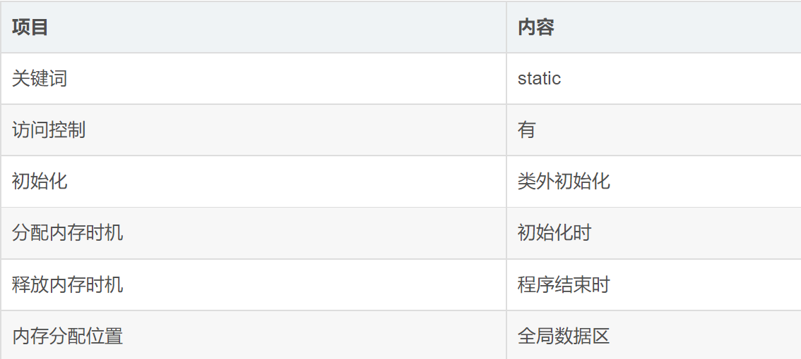

#                                                C++核心编程

本阶段主要针对C++==面向对象==编程技术做详细讲解，探讨C++中的核心和精髓。

https://www.eecis.udel.edu/~saunders/progteam/  stl

## 1 内存分区模型

C++程序在执行时，将内存大方向划分为**4个区域**

- 代码区：存放函数体的二进制代码，由操作系统进行管理的
- 全局区：存放全局变量和静态变量以及常量
- 栈区：由编译器自动分配释放, 存放函数的参数值,局部变量等
- 堆区：由程序员分配和释放,若程序员不释放,程序结束时由操作系统回收


```c++
// 可以引⼊的库和版本相关请参考 “环境说明”

#include <vector>
#include <unordered_set>
#include <unordered_map>

using namespace std;

vector<vector<int>> solution(const vector<int>& vec, int target) {
  vector<vector<int>> res;
  unordered_set<int> hash;
  unordered_map<int,int> cnt;
  for(const auto& x:vec) cnt[x]++;
  sort(vec.begin(), vec.end());
  auto it = unique(vec.begin(), vec.end());
  vec.erase(it, vec.end());
  for(auto x:vec)
    {
      int a=target-x;
      if(hash.count(a))
      {
        if(cnt[x]>=2)
        {
          if(x==a) res.push_back({x,a});
        }
        else res.push_back({x,a});
      }
      hash.insert(x);
    }
  return res;
}

int main()
{
  vector<int> vec = {1, 3, 1, 3, 2, 2, 4, 5};
  int target = 4;
  solution(vec, 4);
  
  return 0;
}

```


**内存四区意义：**

不同区域存放的数据，赋予不同的生命周期, 给我们更大的灵活编程


### 1.1 程序运行前

​	在程序编译后，生成了exe可执行程序，**未执行该程序前**分为两个区域

​	**代码区：**

​		存放 CPU 执行的机器指令

​		代码区是**共享**的，共享的目的是对于频繁被执行的程序，只需要在内存中有一份代码即可

​		代码区是**只读**的，使其只读的原因是防止程序意外地修改了它的指令

​	**全局区：**

​		全局变量和静态变量存放在此.

​		全局区还包含了常量区, 字符串常量和其他常量也存放在此.

​		==该区域的数据在程序结束后由操作系统释放==.


**示例：**

```c++
//全局变量
int g_a = 10;
int g_b = 10;

//全局常量
const int c_g_a = 10;
const int c_g_b = 10;

int main() {

	//局部变量
	int a = 10;
	int b = 10;

	//打印地址
	cout << "局部变量a地址为： " << (int)&a << endl;
	cout << "局部变量b地址为： " << (int)&b << endl;

	cout << "全局变量g_a地址为： " <<  (int)&g_a << endl;
	cout << "全局变量g_b地址为： " <<  (int)&g_b << endl;

	//静态变量
	static int s_a = 10;
	static int s_b = 10;

	cout << "静态变量s_a地址为： " << (int)&s_a << endl;
	cout << "静态变量s_b地址为： " << (int)&s_b << endl;

	cout << "字符串常量地址为： " << (int)&"hello world" << endl;
	cout << "字符串常量地址为： " << (int)&"hello world1" << endl;

	cout << "全局常量c_g_a地址为： " << (int)&c_g_a << endl;
	cout << "全局常量c_g_b地址为： " << (int)&c_g_b << endl;

	const int c_l_a = 10;
	const int c_l_b = 10;
	cout << "局部常量c_l_a地址为： " << (int)&c_l_a << endl;
	cout << "局部常量c_l_b地址为： " << (int)&c_l_b << endl;

	system("pause");

	return 0;
}
```

打印结果：


总结：

* C++中在程序运行前分为全局区和代码区
* 代码区特点是共享和只读
* 全局区中存放全局变量、静态变量、常量
* 常量区中存放 const修饰的全局常量  和 字符串常量


### 1.2 程序运行后


​	**栈区：**

​		由编译器自动分配释放, 存放函数的参数值,局部变量等

​		注意事项：不要返回局部变量的地址，栈区开辟的数据由编译器自动释放


**示例：**

```c++
int * func()
{
	int a = 10;
	return &a;
}

int main() {

	int *p = func();

	cout << *p << endl;
	cout << *p << endl;

	system("pause");

	return 0;
}
```


​	**堆区：**

​		由程序员分配释放,若程序员不释放,程序结束时由操作系统回收

​		在C++中主要利用new在堆区开辟内存

**示例：**

```c++
int* func()
{
	int* a = new int(10);
	return a;
}

int main() {

	int *p = func();

	cout << *p << endl;
	cout << *p << endl;
    
	system("pause");

	return 0;
}
```


**总结：**

堆区数据由程序员管理开辟和释放

堆区数据利用new关键字进行开辟内存


### 1.3 new操作符


​	C++中利用==new==操作符在堆区开辟数据

​	堆区开辟的数据，由程序员手动开辟，手动释放，释放利用操作符 ==delete==

​	语法：` new 数据类型`     返回值是new出来的类型

​	利用new创建的数据，会返回该数据对应的类型的指针


**示例1： 基本语法**

```c++
int* func()
{
	int* a = new int(10);    //一种初始化的方式
	return a;
}

int main() {

	int *p = func();

	cout << *p << endl;
	cout << *p << endl;

	//利用delete释放堆区数据
	delete p;

	//cout << *p << endl; //报错，释放的空间不可访问
                          //不可重复释放
	system("pause");

	return 0;
}
```


**示例2：开辟数组**

```c++
//堆区开辟数组
int main() {

	int* arr = new int[10];

	for (int i = 0; i < 10; i++)
	{
		arr[i] = i + 100;
	}

	for (int i = 0; i < 10; i++)
	{
		cout << arr[i] << endl;
	}
	//释放数组 delete 后加 []
	delete[] arr;

	system("pause");

	return 0;
}

```


## 2 引用

### 2.1 引用的基本使用

**作用： **给变量起别名

**语法：** `数据类型 &别名 = 原名`


**示例：**

```C++
int main() {

	int a = 10;
	int &b = a;

	cout << "a = " << a << endl;
	cout << "b = " << b << endl;

	b = 100;

	cout << "a = " << a << endl;
	cout << "b = " << b << endl;

	system("pause");

	return 0;
}
```


### 2.2 引用注意事项

* 引用必须初始化
* 引用在初始化后，不可以改变

示例：

```C++
int main() {

	int a = 10;
	int b = 20;
	//int &c; //错误，引用必须初始化。不初始化是野指针
	int &c = a; //一旦初始化后，就不可以更改
	c = b; //这是赋值操作，不是更改引用(c已经指向a)
    //将b的值赋给c。而c又等于a。所以三个输出都为20。
	cout << "a = " << a << endl;
	cout << "b = " << b << endl;
	cout << "c = " << c << endl;

	system("pause");

	return 0;
}
```


### 2.3 引用做函数参数

**作用：**函数传参时，可以利用引用的技术让形参修饰实参

**优点：**可以简化指针修改实参


**示例：**

```C++
//1. 值传递
void mySwap01(int a, int b) {
	int temp = a;
	a = b;
	b = temp;
}

//2. 地址传递
void mySwap02(int* a, int* b) {   //指针变量作为函数形参，函数调用结束后，释放的是存储指针变量的空间
	int temp = *a;                //而不是指针指向的空间。指针只是一个变量啊，切记！！！
	*a = *b;
	*b = temp;
}

//3. 引用传递
void mySwap03(int& a, int& b) {
	int temp = a;
	a = b;
	b = temp;
}

int main() {

	int a = 10;
	int b = 20;

	mySwap01(a, b);
	cout << "a:" << a << " b:" << b << endl;

	mySwap02(&a, &b);
	cout << "a:" << a << " b:" << b << endl;

	mySwap03(a, b);
	cout << "a:" << a << " b:" << b << endl;

	system("pause");

	return 0;
}

```


> 总结：通过引用参数产生的效果同按地址传递是一样的。引用的语法更清楚简单


### 2.4 引用做函数返回值


作用：引用是可以作为函数的返回值存在的


注意：1.**不要返回局部变量引用**

​            2.**函数的调用可以作为左值**

用法：函数调用作为左值


**示例：**

```C++
//返回局部变量引用
int& test01() {
	int a = 10; //局部变量，在栈区。函数调用结束后空间消失
	return a;   //如果这样做的话返回的是一块已经消失的空间
}

//返回静态变量引用
int& test02() {
	static int a = 20;   //全局区，生命周期长，由系统释放
	return a;
}

int main() {

	//不能返回局部变量的引用
	int& ref = test01();
	cout << "ref = " << ref << endl;//第一次输出为10.结果正确，因为编译器做了保留。
	cout << "ref = " << ref << endl; //第二次输出不确定的值。因为a的内存已经释放。
  
    
	//如果函数做左值，那么必须返回引用
	int& ref2 = test02();
	cout << "ref2 = " << ref2 << endl;  //输出20
	cout << "ref2 = " << ref2 << endl;  //输出20

	test02() = 1000;//相当于Test02()在返回a的时候创建了一个临时的引用变量x，test02()=x=a。所以x当然可以被赋值，也可以赋值给其他变量。ref2是x的别名，当然和x一样是1000

	cout << "ref2 = " << ref2 << endl;  //输出1000
	cout << "ref2 = " << ref2 << endl;  //输出1000

	system("pause");

	return 0;
}
```


​	


### 2.5 引用的本质

本质：**引用的本质在c++内部实现是一个指针常量.**

p=&a后便不可再改为p=&x。也就是p从一而终的指向同一块空间。

一点也不渣。也就是引用不可更改的原因

讲解示例：

```C++
//发现是引用，转换为 int* const ref = &a;      &=const *
void func(int& ref){
	ref = 100; // ref是引用，转换为*ref = 100
}
int main(){
	int a = 10;
    
    //自动转换为 int* const ref = &a; 指针常量是指针指向不可改，也说明为什么引用不可更改
	int& ref = a; //自动转换为指针常量。自动解引用
	ref = 20; //内部发现ref是引用，自动帮我们转换为: *ref = 20;
    
	cout << "a:" << a << endl;
	cout << "ref:" << ref << endl;
    
	func(a);
	return 0;
}
```

结论：C++推荐用引用技术，因为语法方便，引用本质是指针常量，但是所有的指针操作编译器都帮我们做了


### 2.6 常量引用


**作用：**常量引用主要用来修饰形参，防止误操作


在函数形参列表中，可以加==const修饰形参==，防止形参改变实参


**示例：**


```C++
//引用使用的场景，通常用来修饰形参
void showValue(const int& v) {  //其实说白了就是const int * const v。v自身是只读的(也就是说v指向的空间是不可以更改的)，v指向的空间的数据也是只读的。
	//v += 10;   //有了const,这行不再起作用，会报错。
                 //若没有const，我这个函数只想打印a的值。却不下心将a的值改为了20.
                 //使用const可以避免这个error。
	cout << v << endl;
}

int main() {

	//int& ref = 10;  引用本身需要一个合法的内存空间，因此这行错误
	//加入const就可以了，编译器优化代码，int temp = 10; const int& ref = temp;
	const int& ref = 10;

	//ref = 100;  //加入const后不可以修改变量
	cout << ref << endl;

	//函数中利用常量引用防止误操作修改实参
	int a = 10;
	showValue(a);

	system("pause");

	return 0;
}
```


## 3 函数提高

### 3.1 函数默认参数


在C++中，函数的形参列表中的形参是可以有默认值的。

语法：` 返回值类型  函数名 （参数= 默认值）{}`


**示例：**

```C++
int func(int a, int b = 10, int c = 10) {
	return a + b + c;
}
//1.如果我们自己传入了数据，就用自己的。如果没有，就用默认的。
//2.如果某个位置参数有默认值，那么从这个位置往后，从左向右，必须都要有默认值
//3.如果函数声明有默认值，函数实现的时候就不能有默认参数。
//4.声明和实现只能有一个默认参数
int func2(int a = 10, int b = 10);
int func2(int a, int b) {
	return a + b;
}

int main() {

	cout << "ret = " << func(20, 20) << endl;
	cout << "ret = " << func(100) << endl;

	system("pause");

	return 0;
}
```


### 3.2 函数占位参数


C++中函数的形参列表里可以有占位参数，用来做占位，调用函数时必须填补该位置

//相当于放书包占位置

**语法：** `返回值类型 函数名 (数据类型){}`


在现阶段函数的占位参数存在意义不大，但是后面的课程中会用到该技术


**示例：**

```C++
//函数占位参数 ，占位参数也可以有默认参数
void func(int a, int) {
	cout << "this is func" << endl;
}

int main() {

	func(10,10); //占位参数必须填补。10就是相当于我的书包

	system("pause");

	return 0;
}
```


### 3.3 函数重载

#### 3.3.1 函数重载概述


**作用：**函数名可以相同，提高复用性


**函数重载满足条件：**

* **==同一个作用域下==**
* 函数名称相同
* 函数参数**类型不同**  或者 **个数不同** 或者 **==顺序不同==**。**有不同即可**
* 与返回值无关，返回值可同可不同


**注意:**  函数的返回值不可以作为函数重载的条件


**示例：**

```C++
//函数重载需要函数都在同一个作用域下
void func()
{
	cout << "func 的调用！" << endl;
}
void func(int a)
{
	cout << "func (int a) 的调用！" << endl;
}
void func(double a)
{
	cout << "func (double a)的调用！" << endl;
}
void func(int a ,double b)
{
	cout << "func (int a ,double b) 的调用！" << endl;
}
void func(double a ,int b)
{
	cout << "func (double a ,int b)的调用！" << endl;
}

//函数返回值不可以作为函数重载条件
//int func(double a, int b)
//{
//	cout << "func (double a ,int b)的调用！" << endl;
//}


int main() {

	func();
	func(10);
	func(3.14);
	func(10,3.14);
	func(3.14 , 10);
	
	system("pause");

	return 0;
}
```


#### 3.3.2 函数重载注意事项


* **引用作为重载条件**
* 函数重载碰到函数默认参数


**示例：**

```C++
//函数重载注意事项
//1、引用作为重载条件

void func(int &a)   //int & a=10不合法
{
	cout << "func (int &a) 调用 " << endl;
}

void func(int a)    //语法不通过，与int & a产生歧义。
{
	cout << "func (int a) 调用 " << endl;
}

void func(const int &a)  //const int & a=10合法
{
	cout << "func (const int &a) 调用 " << endl;
}


//2、函数重载碰到函数默认参数

void func2(int a, int b = 10)
{
	cout << "func2(int a, int b = 10) 调用" << endl;
}

void func2(int a)
{
	cout << "func2(int a) 调用" << endl;
}

int main() {
	
	int a = 10;
	func(a); //调用无const。理解为变量喜欢自由，所以选择无const的。这个理由真牵强，变量不走const，这是理所当然的。
	func(10);//调用有const


	//func2(10); //碰到默认参数产生歧义，需要避免。
    //如果有默认参数。重载的语法是没有问题的，不会报错。
    //但是数据10传入，两个函数都可以进入。编译器不知道走哪个。
    //编译器：我可能不是人，但你是真的狗。所以函数重载时避免有默认参数

	system("pause");

	return 0;
}
```


## **4** 类和对象


C++面向对象的三大特性为：==封装、继承、多态==


C++认为==万事万物都皆为对象==，对象上有其属性和行为


**例如：**

​	人可以作为对象，属性有姓名、年龄、身高、体重...，行为有走、跑、跳、吃饭、唱歌...

​	车也可以作为对象，属性有轮胎、方向盘、车灯...,行为有载人、放音乐、放空调...

​	具有相同性质的==对象==，我们可以抽象称为==类==，人属于人类，车属于车类

### 4.1 封装

#### 4.1.1  封装的意义

封装是C++面向对象三大特性之一

封装的意义：

* 将属性和行为作为一个整体，表现生活中的事物
* 将属性和行为加以权限控制


**封装意义一：**

​	在设计类的时候，属性和行为写在一起，表现事物

**语法：** `class 类名{   访问权限： 属性  / 行为  };`


**示例1：**设计一个圆类，求圆的周长

**示例代码：**

```C++
//圆周率
const double PI = 3.14;

//1、封装的意义
//将属性和行为作为一个整体，用来表现生活中的事物

//封装一个圆类，求圆的周长
//class代表设计一个类，后面跟着的是类名
class Circle
{
public:  //访问权限  公共的权限

	//属性
	int m_r;//半径

	//行为
	//获取到圆的周长
	double calculateZC()
	{
		//2 * pi  * r
		//获取圆的周长
		return  2 * PI * m_r;
	}
};

int main() {

	//通过圆类，创建圆的对象
	// c1就是一个具体的圆
	Circle c1;
	c1.m_r = 10; //给圆对象的半径 进行赋值操作

	//2 * pi * 10 = = 62.8
	cout << "圆的周长为： " << c1.calculateZC() << endl;

	system("pause");

	return 0;
}
```


**示例2：**设计一个学生类，属性有姓名和学号，可以给姓名和学号赋值，可以显示学生的姓名和学号


**示例2代码：**

```C++
//学生类
class Student {
public:
	void setName(string name) {
		m_name = name;
	}
	void setID(int id) {
		m_id = id;
	}

	void showStudent() {
		cout << "name:" << m_name << " ID:" << m_id << endl;
	}
public:
	string m_name;
	int m_id;
};

int main() {

	Student stu;
	stu.setName("德玛西亚");
	stu.setID(250);
	stu.showStudent();

	system("pause");

	return 0;
}

```


**封装意义二：**

类在设计时，可以把属性和行为放在不同的权限下，加以控制

访问权限有三种：


1. public        公共权限  
2. protected 保护权限
3. private      私有权限


**示例：**

```C++
//三种权限
//公共权限  public     类内可以访问  类外可以访问
//保护权限  protected  类内可以访问  类外不可以访问
//私有权限  private    类内可以访问  类外不可以访问

class Person
{
	//姓名  公共权限
public:
	string m_Name;

	//汽车  保护权限
protected:
	string m_Car;

	//银行卡密码  私有权限
private:
	int m_Password;

public:
	void func()
	{
		m_Name = "张三";
		m_Car = "拖拉机";
		m_Password = 123456;
	}
};

int main() {

	Person p;
	p.m_Name = "李四";
	//p.m_Car = "奔驰";  //保护权限类外访问不到
	//p.m_Password = 123; //私有权限类外访问不到

	system("pause");

	return 0;
}
```


#### 4.1.2 struct和class区别


在C++中 struct和class唯一的**区别**就在于 **默认的访问权限不同**

区别：

* struct 默认权限为公共
* class   默认权限为私有


```C++
class C1
{
	int  m_A; //默认是私有权限
};

struct C2
{
	int m_A;  //默认是公共权限
};

int main() {

	C1 c1;
	c1.m_A = 10; //错误，访问权限是私有

	C2 c2;
	c2.m_A = 10; //正确，访问权限是公共

	system("pause");

	return 0;
}
```


#### 4.1.3 成员属性设置为私有


**优点1：**将所有成员属性设置为私有，可以自己控制读写权限

**优点2：**对于写权限，我们可以检测数据的有效性


**示例：**

```C++
class Person {
public:

	//姓名设置可读可写
	void setName(string name) {
		m_Name = name;
	}
	string getName()
	{
		return m_Name;
	}


	//获取年龄 
	int getAge() {
		return m_Age;
	}
	//设置年龄
	void setAge(int age) {
		if (age < 0 || age > 150) {
			cout << "你个老妖精!" << endl;
			return;
		}
		m_Age = age;
	}

	//情人设置为只写
	void setLover(string lover) {
		m_Lover = lover;
	}

private:
	string m_Name; //可读可写  姓名
	
	int m_Age; //只读  年龄

	string m_Lover; //只写  情人
};


int main() {

	Person p;
	//姓名设置
	p.setName("张三");
	cout << "姓名： " << p.getName() << endl;

	//年龄设置
	p.setAge(50);
	cout << "年龄： " << p.getAge() << endl;

	//情人设置
	p.setLover("苍井");
	//cout << "情人： " << p.m_Lover << endl;  //只写属性，不可以读取

	system("pause");

	return 0;
}
```


**练习案例1：设计立方体类**

设计立方体类(Cube)

求出立方体的面积和体积

分别用全局函数和成员函数判断两个立方体是否相等。


**练习案例2：点和圆的关系**

设计一个圆形类（Circle），和一个点类（Point），计算点和圆的关系。


### 4.2 对象的初始化和清理

类中普通成员变量在对象创建之时分配内存，对象消失之时被释放！！！！！！

*  生活中我们买的电子产品都基本会有出厂设置，在某一天我们不用时候也会删除一些自己信息数据保证安全
*  C++中的面向对象来源于生活，每个对象也都会有初始设置以及 对象销毁前的清理数据的设置。


#### 4.2.1 构造函数和析构函数

对象的**初始化和清理**也是两个非常重要的安全问题

​	一个对象或者变量没有初始状态，对其使用后果是未知

​	同样的使用完一个对象或变量，没有及时清理，也会造成一定的安全问题


c++利用了**构造函数**和**析构函数**解决上述问题，这两个函数将会被编译器自动调用，完成对象初始化和清理工作。

对象的初始化和清理工作是编译器强制要我们做的事情，因此如果**我们不提供构造和析构，编译器会提供**

**编译器提供的构造函数和析构函数是空实现。**


* 构造函数：主要作用在于创建对象时为对象的成员属性赋值，构造函数由编译器自动调用，无须手动调用。
* 析构函数：主要作用在于对象**销毁前**系统自动调用，执行一些清理工作。


**构造函数语法：**`类名(){}`

1. 构造函数，没有返回值也不写void
2. 函数名称与类名相同
3. 构造函数可以有参数，因此可以发生重载
4. 程序在调用对象时候会自动调用构造，无须手动调用,而且只会调用一次


**析构函数语法：** `~类名(){}`

1. **析构函数，没有返回值也不写void**
2. 函数名称与类名相同,在名称前加上符号  ~
3. **==析构函数不可以有参数，因此不可以发生重载==**
4. **程序在对象销毁前会自动调用析构，无须手动调用,而且只会调用一次**


```C++
class Person
{
public:
	//构造函数
	Person()
	{
		cout << "Person的构造函数调用" << endl;
	}
	//析构函数
	~Person()
	{
		cout << "Person的析构函数调用" << endl;
	}

};

void test01()
{
	Person p;   //局部变量，在栈上的对象，test01()调用完毕后，调用析构函数释放这个对象
}

int main() {
	
	test01();
    //Person p;   //一开始输出端看不到析构函数的调用，等到system("pause")执行完毕会看到析构函数的调用一闪而过。

	system("pause");
    //在这里调用析构函数，程序结束之前，return 0之前
	return 0;
}
```


#### 4.2.2 构造函数的分类及调用

两种分类方式：

​	按参数分为： 有参构造和无参构造

​	按类型分为： 普通构造和拷贝构造

三种调用方式：

* 括号法  常用

- 显示法

- ==隐式转换法==

**示例：**

```C++
//1、构造函数分类
// 按照参数分类分为 有参和无参构造   //无参又称为默认构造函数
// 按照类型分类分为 普通构造和拷贝构造   拷贝/复制构造函数以外的都叫做普通构造


//也可以先生成一个对象p(调用无参构造函数)，再进行p.age=10。
class Person {
public:
	//无参（默认）构造函数
	Person() {
		cout << "无参构造函数!" << endl;
	}
	//有参构造函数
	Person(int a) {
		age = a;
		cout << "有参构造函数!" << endl;
	}
	//拷贝构造函数  
	Person(const Person& p) {//拷贝张三不可以改变张三这个人的值。同时，拷贝张三就别去拷贝李四，得专一
		age = p.age;
		cout << "拷贝构造函数!" << endl;
	}
	//析构函数
	~Person() {
		cout << "析构函数!" << endl;
	}
public:
	int age;
};

//2、构造函数的调用
//调用无参构造函数
void test01() {
	Person p; //调用无参构造函数
}

//调用有参的构造函数
void test02() {

	//2.1  括号法，常用
  	Person p1;       //默认构造
	Person p2(10);   //有参构造
  	Person p3(p2);   //拷贝构造
	//注意1：调用无参构造函数不能加括号，如果加了编译器认为这是一个函数声明
	//Person p2();   //Person是类型，p2是函数名，没有参数。编译器太傻了

	//2.2 显式法
  	Person p1=Person();    //可以吗???? 完全可以这样做
	Person p2 = Person(10);//创建了一个对象但是没有名字，我们给他起了名字叫做p2。以至于不会被系统回收。此处错误，根本没有创建临时对象，直接构造了p2。
    //Person(10)单独写就是匿名对象  当前行结束之后，马上析构。
    
	Person p3 = Person(p2); //拷贝构造
    //只调用了一次拷贝构造，即没有生成临时对象，直接调用拷贝构造函数构造了对象p3。
    
  
    //注意2：不能利用 拷贝构造函数 初始化匿名对象 编译器认为是对象声明
    //Person(p3);    //相当于Person p3,造成了重定义。
    //这里传入p3，造成了拷贝构造。得到的整体Person(p3)是一个匿名对象(这不过这是你臆想的！！！)
    //这里是说，你不能写
  	//Person p3 = Person(p2); 
    //Person(p3); 
    //这样两条连续的语句。
    
	//2.3 隐式转换法 这就是有隐式构造，好像只对单参数的构造函数有用？有时间试试。
                             //单参数没有指定值，但是后面可以有很多参数指定默认值,也算单参数
    
	Person p4 = 10; // Person p4 = Person(10);  //能够这样做的前提是在类中提供了一个
    //只调用一次有参构造                                         //单参数的构造函数 
    
    
    //Person p4 = Person(10);    //我断点调试追进去确实是没有调用什么拷贝构造的，更别提
    //只调用一次有参构造                     //=运算符重载了。就是单纯的走了有参构造。
 
    //只调用一次拷贝构造。
	Person p5 = p4; // Person p5 = Person(p4);  //拷贝构造
    //Person p5 = p4;等价于Person p5 = Person(p4);
    //表示调用了一次拷贝构造得到了一个匿名对象，然后给这个匿名对象起了一个名字叫p5(不是的，是直接构造了对象p5)。
    //然后使用了重载的运算符(=)完成了一次拷贝(构造)。 你放屁呢
    //所以这玩意进行了二次拷贝。                      你放屁呢
    //根本没有使用什么重载的运算符又完成了一次拷贝。
    //重载的=运算符的使用时机是两个对象都已经存在的情况下，如p1=p2。而且有属性在堆区时最适合用。
    //这两个对象都必须被创建出来后，才可以使用。你这里这个p5都还没有存在了嘛，
    //纯粹就是先用p4拷贝出一个匿名对象(不是的，是直接构造了对象p5)，然后给这个匿名对象起了一个名字叫p5。(p5指向temp)
    //真是越学越傻逼了。  !!!!!根本就没有生成过匿名对象，直接构造了对象p5。
                          //等价于于Person p5 = Person(p4);
}

int main() {

	test01();
	//test02();

	system("pause");

	return 0;
}
```


所以现在我们就能够解释为什么`string s5="ryy"`是拷贝构造(初始化)了。

因为执行了构造函数`string temp=string("ryy")`(有参构造)，然后再执行`string s5=temp`(使用了重载的运算符(=)完成了一次拷贝构造，放你妈屁，赋值运算符重载是你这样用的？)。所以总的来说`string s5="ryy"`==**只进行了一次拷贝构造(错误)**==，所以它是拷贝构造。(错误的结论！！！)。


**==所以这玩意压根就没有拷贝呀，就是用有参构造搞了一个匿名对象出来，然后让s5指向它(起名s5)==**。

**所以为什么C++ Primer这个傻逼书要说它拷贝了。要称他拷贝初始化？但是按它的解释`string s5=temp`又确实是执行了拷贝构造。它的意思就是string s5=string(temp)造成了拷贝呗，那么string(temp)不就又新形成了一个temp了，这样就无限拷贝下去了。傻逼书！**


所以我们也能解释为什么`string str='c'`报错了。**==因为`string`类没有提供一个能够传入一个字符`c`的构造函数==**。即没有`string temp=string('c')`这样的操作。所以就无法进行接下来的`string s5=temp`了。这段是解释正确的。


所以为什么`string str;`，`str='c'`是对的呢？(我们称这个操作为赋值。)

**因为前面是空参构造，后面是`str.operator=('c')`。所以这是对的**。

`string& operator=(char c);`               //字符赋值给当前的字符串。返回了一个引用。

这段是解释正确的。


**所以我们以后直接称这个显示法和隐式转换法为拷贝初始化(`=`)**。`=`符号右边的得到的匿名对象有可能是拷贝构造(如果这样成立，那么显然进行了两次拷贝)，也有可能是无参构造或有参构造(这样会有一次拷贝初始化带来的拷贝)。**这个结论是错误的！**


**==总结：你看有没有发生拷贝构造，只要看传递的参数是不是一个对象就行了。==**

如：`Person p5 = p4; // 等价Person p5 = Person(p4);  //拷贝构造`

#### 4.2.3 拷贝构造函数调用时机


C++中拷贝构造函数调用时机通常有三种情况

* **使用一个已经创建完毕的对象来初始化一个新对象**
* **==值传递的方式给`函数参数`传值==**
* **==以值方式返回局部对象==**

**==因为构造函数的作用就是用已有的对象来拷贝出一个对象啊，这三种操作都涉及到对象的拷贝==**。


**示例：**

```C++
class Person {
public:
	Person() {
		cout << "无参构造函数!" << endl;
		mAge = 0;
	}
	Person(int age) {
		cout << "有参构造函数!" << endl;
		mAge = age;
	}
	Person(const Person& p) {   // const Person& p 是形参。调用函数时会为形参分配空间
		cout << "拷贝构造函数!" << endl;     
		mAge = p.mAge;
	}
	//析构函数在释放内存之前调用
	~Person() {
		cout << "析构函数!" << endl;
	}
public:
	int mAge;
};

//1. 使用一个已经创建完毕的对象来初始化一个新对象（这是很显然的）
void test01() {

	Person man(100); //p对象已经创建完毕
	Person newman(man); //调用拷贝构造函数
	Person newman2 = man; //拷贝构造

	//Person newman3;
	//newman3 = man; //不是调用拷贝构造函数，赋值操作
}

//2. 值传递的方式给函数参数传值
//相当于Person p1 = p;
void doWork(Person p1) {}    //副本机制，会为形参分配空间
void test02() {              //也就是生成了一块名为p1的空间，也就是临时创建了p1这个对象
	Person p; //无参构造函数   //函数结束后空间自动释放，对象p1消失
	doWork(p);
}

//3. 以值方式返回局部对象
Person doWork2()
{
	Person p1;  //无参构造函数!(p1)
                //拷贝构造函数!(temp=p1)
                //析构函数!(p1)
                //析构函数!(临时对象temp)
	return p1;
    
    //如果是下面这样子：那么不会调用拷贝构造，而只会调用一次临时对象的构造函数
    return Person();   //返回值优化技术 只构造一次，只析构一次
                       //无参构造函数!(temp)
                       //析构函数!(temp)
    
    //如果是这样子
    return *(new Person);
    //无参构造函数!(堆区对象的)
    //拷贝构造函数!(temp)
    //析构函数!(temp的)
    //因为是在堆区的对象。还有一次析构函数在main函数结束后才会打出来。
    //不是这样的！！！根本不会得到释放。类是没办法管理这个对象的。
}

void test03()
{
	Person p = doWork2();
	cout << (int *)&p << endl;
}


int main() {

	//test01();
	//test02();
	test03();

	system("pause");

	return 0;
}
```


#### 4.2.4 构造函数调用规则

默认情况下，c++编译器至少给一个类添加3个函数

1．默认构造函数(无参，函数体为空)（空实现）

2．默认析构函数(无参，函数体为空)（空实现）

3．默认拷贝构造函数，对属性进行值拷贝。（值拷贝）


构造函数调用规则如下：

* **==如果用户定义有参构造函数，c++不在提供默认无参构造，但是会提供默认拷贝构造==**


* 如果用户定义拷贝构造函数，c++不会再提供其他构造函数


示例：

```C++
class Person {
public:
	//无参（默认）构造函数
	Person() {
		cout << "无参构造函数!" << endl;
	}
	//有参构造函数
	Person(int a) {
		age = a;
		cout << "有参构造函数!" << endl;
	}
	//拷贝构造函数
	Person(const Person& p) {
		age = p.age;
		cout << "拷贝构造函数!" << endl;
	}
	//析构函数
	~Person() {
		cout << "析构函数!" << endl;
	}
public:
	int age;
};

void test01()
{
	Person p1(18);
	//如果不写拷贝构造，编译器会自动添加拷贝构造，并且做浅拷贝操作
	Person p2(p1);//如果不写拷贝构造，编译器会自动添加拷贝构造，并且做浅拷贝操作

	cout << "p2的年龄为： " << p2.age << endl; //你不写拷贝构造函数也会给你拷贝一个18
}

void test02()
{
	//如果用户提供有参构造，编译器不会提供默认构造，会提供拷贝构造
	Person p1; //此时如果用户自己没有提供默认构造，会出错
	Person p2(10); //用户提供的有参
	Person p3(p2); //此时如果用户没有提供拷贝构造，编译器会提供

	//如果用户提供拷贝构造，编译器不会提供其他构造函数
	Person p4; //此时如果用户自己没有提供默认构造，会出错
	Person p5(10); //此时如果用户自己没有提供有参，会出错
	Person p6(p5); //用户自己提供拷贝构造
}

int main() {

	test01();

	system("pause");

	return 0;
}

//错误示范

#include<iostream>
using namespace std;
#include <string>
//1、函数对象在使用时，可以像普通函数那样调用, 可以有参数，可以有返回值
class MyAdd
{
public:
	//MyAdd() {  }
	MyAdd(int v1, int v2)
	{
		//int c = v1 + v2;
		cout << 11 << endl;
	}
	int operator()(int v1, int v2)
	{
		return v1 + v2;
	}
};
void test01()       //写了有参构造，但是我们创建了一个单纯的对象（利用无参/默认构造）
{                     //因为写了有参构造，编译器不会提供默认构造。
	MyAdd myAdd;      //但是你又用默认构造创建了一个对象，所以你得手动提供一个默认构造
	cout << myAdd(10, 10) << endl;
}

```


#### 4.2.5 深拷贝与浅拷贝


深浅拷贝是面试经典问题，也是常见的一个坑


浅拷贝：简单的赋值拷贝操作


深拷贝：在堆区重新申请空间，进行拷贝操作


**示例：**

```C++
class Person {
public:
	//无参（默认）构造函数
	Person() {
		cout << "无参构造函数!" << endl;
	}
	//有参构造函数
	Person(int age ,int height) {
		
		cout << "有参构造函数!" << endl;

		m_age = age;
		m_height = new int(height);
		
	}
	//拷贝构造函数  
	Person(const Person& p) {
		cout << "拷贝构造函数!" << endl;
		//如果不利用深拷贝在堆区创建新内存，会导致浅拷贝带来的重复释放堆区问题
		m_age = p.m_age;
       // m_height=p.m_height   //编译器默认实现的。会导致出错
		m_height = new int(*p.m_height);  //得自己在堆区再开辟一块不同的空间
		
	}
 
	//析构函数  若使用了默认拷贝构造函数，p1和p2都是局部变量/对象。在栈区（先进后出），所以会先调用p2的析构函数释放一次空间
    //再调用p1的析构函数释放一次相同的空间。（二次释放不可取）
	~Person() {
		cout << "析构函数!" << endl;
		if (m_height != NULL)     //尽管p2已经将m_height=NULL;
		{                         //但是p1仍然保存着这片空间的地址，没有更改过
                             //所以p1.m_height != NULL成立，造成了二次释放（释放了不存在的空间）
			delete m_height;
            m_height=NULL;
		}
	}
public:
	int m_age;
	int* m_height;
};

void test01()
{
	Person p1(18, 180);

	Person p2(p1);

	cout << "p1的年龄： " << p1.m_age << " 身高： " << *p1.m_height << endl;

	cout << "p2的年龄： " << p2.m_age << " 身高： " << *p2.m_height << endl;
}

int main() {

	test01();

	system("pause");

	return 0;
}
```

> 总结：如果属性有在堆区开辟的，一定要自己提供拷贝构造函数，防止浅拷贝带来的问题


#### 4.2.6 初始化列表


**作用：**

**C++提供了初始化列表语法，用来初始化属性**


**语法：**`构造函数()：属性1(值1),属性2（值2）... {}`


**示例：**

```C++
class Person {
public:

	////传统方式初始化
	//Person(int a, int b, int c) {
	//	m_A = a;
	//	m_B = b;
	//	m_C = c;
	//}

	//初始化列表方式初始化
	Person(int a, int b, int c) :m_A(a), m_B(b), m_C(c) {}
	void PrintPerson() {
		cout << "mA:" << m_A << endl;
		cout << "mB:" << m_B << endl;
		cout << "mC:" << m_C << endl;
	}
private:
	int m_A;
	int m_B;
	int m_C;
};

int main() {

	Person p(1, 2, 3);
	p.PrintPerson();


	system("pause");

	return 0;
}
```


#### 4.2.7 ==类对象作为类成员==


C++类中的成员可以是另一个类的对象，我们称该成员为 对象成员

**==初始化列表可以告诉编译器调用哪一个构造函数==**.

例如：

```C++
class A {}  //既然已经定义好了这种类型，那么我在类B中使用这种类型是没有一点问题的。
class B     //就像我在B中使用已有的int类型，有任何问题吗？
{
    A a；
}
```


B类中有对象A作为成员，A为对象成员


那么当创建B对象时，A与B的构造和析构的顺序是谁先谁后？


**示例：**

```C++
class Phone
{
public:
	Phone(string name)
	{
		m_PhoneName = name;
		cout << "Phone构造" << endl;
	}

	~Phone()
	{
		cout << "Phone析构" << endl;
	}

	string m_PhoneName;

};


class Person
{
public:
     
	//初始化列表可以告诉编译器调用哪一个构造函数
    //Phone m_Phone=pName      //隐式转换法 相当于Phone m_Phone(pName)
    //而我们在Phone类中定义了这个构造函数Phone(pName)，所以可行
	Person(string name, string pName) :m_Name(name), m_Phone(pName)
	{
		cout << "Person构造" << endl;
	}

	~Person()
	{
		cout << "Person析构" << endl;
	}

	void playGame()
	{
		cout << m_Name << " 使用" << m_Phone.m_PhoneName << " 牌手机! " << endl;
	}

	string m_Name;
	Phone m_Phone;

};
void test01()
{
	//当类中成员是其他类对象时，我们称该成员为 对象成员
	//构造的顺序是 ：先调用对象成员的构造，再调用本类构造
	//析构顺序与构造相反
	Person p("张三" , "苹果X");
	p.playGame();

}


int main() {

	test01();

	system("pause");

	return 0;
}
```

只要Phone类的成员(函数和变量)是公共的，我们就可以在Person类中使用Phone类的对象来访问Phone类的成员

#### 4.2.8 静态成员

静态成员就是在成员变量和成员函数前加上关键字static，称为静态成员

静态成员分为：



*  静态成员变量
   * 所有对象共享同一份数据
   
   * **==在编译阶段分配内存。这里ta错了，是在初始化时分配内存，我已验证。==**
   
   * **~~类内声明，类外初始化(==这是必须的，不能在定义时直接初始化，除非加上了const关键字==)~~**
   
     为什么必须在类外进行，因为它的存储位置是全局区，且无对象就可以使用，不在类外在哪里，难道在构造函数中吗？别忘了，它比对象出生更早。
   
   * **static 成员变量是在初始化时分配内存的，程序结束时释放内存。**
   
   *  **==这是初始化数据，不是定义，更不是访问。所以不管什么访问权限都可以类外初始化静态成员变量。但是访问肯定是要遵守权限的==**。
   
*  静态成员函数
   *  **所有对象共享同一个函数**
   *  **==静态成员函数只能访问静态成员变量==**
   *  不实例化对象就可以调用(如单例模式)


- ~~因为这两者不属于某个具体的对象。而是属于这个类，所以可以通过类名来调用~~


**示例1 ：**静态成员变量

```C++
class Person
{
	
public:

	static int m_A; //静态成员变量  static int m_A=1; //error
	static int m_C; //静态成员变量
	//静态成员变量特点：
	//1 在初始化时分配内存
	//2 类内声明，类外初始化或类外定义
	//3 所有对象共享同一份数据

private:
	static int m_B; //静态成员变量也是有访问权限的
};
int Person::m_A = 10;
int Person::m_B = 10;     //这是初始化数据，不是定义，更不是访问。所以不管什么访问权限都可以类外初始化
类型 类名::变量名=值;（注意不必再加static）
    
void test01()
{
	//静态成员变量两种访问方式

	//1、通过对象
	Person p1;
	p1.m_A = 100;
	cout << "p1.m_A = " << p1.m_A << endl;

	Person p2;
	p2.m_A = 200;
    
    Person p3;
	p3.m_C = 200;
    
	cout << "p1.m_A = " << p1.m_A << endl; //共享同一份数据
	cout << "p2.m_A = " << p2.m_A << endl;
    
	cout << "p2.m_C = " << p2.m_C << endl;  //error 未初始化，即未分配内存
	//2、通过类名
	cout << "m_A = " << Person::m_A << endl;
	cout << "m_C = " << Person::m_C << endl; //error 未初始化，即未分配内存

	//cout << "m_B = " <<	 Person::m_B << endl; //私有权限在类外访问不到
}

int main() {

	test01();

	system("pause");

	return 0;
}
```


**在普通函数中初始化时可以赋初值，也可以不赋值。如果不赋值，那么会被默认初始化为 0**。**==全局数据区的变量都有默认的初始值 0==**，**而动态数据区（堆区、栈区）变量的默认值是不确定的，一般认为是垃圾值**。

```c
void f()
{
    static int a;
    cout << a << endl;  //0 默认初始化为0
}
```


加上const关键字(会带来极大的改变)：

```c++
class P
{
public:
    void f()
    { 
        cout << a << endl;   //ok 成员函数调用static变量
    }
    
    static const int a=9; //ok  但在类内初始化了就不要在类外再进行一次，否则是重复定义。
    static const int a;   //error 无法解析的外部符号(就是未分配内存啦),它可没有0这个默认值
    static const int c;
};
const int P::c = 5; //ok 必须要有const
```

只是让这个变量变为常量而已(**不可再更改其值**)，其它的不会有什么改变(**==当然还有可以在类内直接初始化了==**)。

**==这个本质是将数据存储到只读区了，属于编译时初始化，主要static const带来的特殊性==**。它太特殊了。


**示例2：**静态成员函数

```C++
class Person
{

public:

	//静态成员函数特点：
	//1 程序共享一个函数
	//2 静态成员函数只能访问静态成员变量
	
	static void func()
	{
		cout << "func调用" << endl;
		m_A = 100;
		//m_B = 100; //错误，不可以访问非静态成员变量。无法区分他属于哪一个对象
	}

	static int m_A; //静态成员变量
	int m_B; // 
private:

	//静态成员函数也是有访问权限的
	static void func2()
	{
		cout << "func2调用" << endl;
	}
};
int Person::m_A = 10;


void test01()
{
	//静态成员变量两种访问方式

	//1、通过对象
	Person p1;
	p1.func();

	//2、通过类名
	Person::func();


	//Person::func2(); //私有权限访问不到
}

int main() {

	test01();

	system("pause");

	return 0;
}
```

**==静态成员函数只能访问静态成员变量，不可以访问非静态成员变量，因为无法区分他属于哪一个对象==**。

#### 4.2.8 常量成员

**常量成员必须初始化。因为它以后是不可变的，你定义时不初始化，打算啥时候初始化呢**？

方式一：直接初始化。

```c++
#include <iostream>
#include <cstring>
#include <vector>
using namespace std;
#include <algorithm>
#include <stdlib.h>


class Person
{
public:     
    const int a=5;
    void show() {cout<<a<<endl;}

};

void test01()
{	
    Person p;
    p.show();
}


int main() {
	test01();
	system("pause");
	return 0;
}
```

方式二：初始化列表

```c++
#include <iostream>
#include <cstring>
#include <vector>
using namespace std;
#include <algorithm>
#include <stdlib.h>

class Person
{
public:     
    const int a;
    Person(int aa):a(aa){}
   void show() {cout<<a<<endl;}

};

void test01()
{	
    Person p(5);
    p.show();
}

int main() {
	test01();
	system("pause");
	return 0;
}
```


#### 4.2.9 c语言静态变量

在程序中使用static。

##### 4.2.9.1 变量

(1) 局部变量

普通局部变量是再熟悉不过的变量了，在任何一个函数内部定义的变量（不加static修饰符）都属于这个范畴。编译器一般不对普通局部变量进行初始化，也就是说它的值在初始时是不确定的，除非对其显式赋值。

普通局部变量存储于进程栈空间，使用完毕会立即释放。

**==静态局部变量使用static修饰符定义，即使在声明时未赋初值，编译器也会把它初始化为0==**。且静态局部变量存储于进程的全局数据区，即使函数返回，它的值也会保持不变。

**变量在全局数据区分配内存空间；编译器自动对其初始化，main函数执行之前就分配内存了**
其作用域为局部作用域，当定义它的函数结束时，其作用域随之结束

(2) 全局变量

**全局变量定义在函数体外部，在全局数据区分配存储空间，且编译器会自动对其初始化**。

**普通全局变量对整个工程可见，其他文件可以使用extern外部声明后直接使用。==也就是说其他文件不能再定义一个与其相同名字的全局变量了（否则编译器会认为它们是同一个变量）(其他文件还是可以再定义名字相同的局部变量的)==**。

**==静态全局变量仅对当前文件可见==，其他文件不可访问，其他文件可以定义与其同名的变量，两者互不影响**。

所以全局变量加上static只是把它变为当前文件可见，存储性质无论是以前就是在全局区，不会发生变化。如果再加上const，那么该全局变量就是当前文件内只读的了(什么方式都不可以更改)。

```c
const static int a=5; //什么方式都不可以更改它的值
```

如果只是

```c
const int a=5;  //它不是常量，是只读变量。现在规定，常量不可更改，而只读变量可以根据地址来修改。
```

这样的全局变量，是可以通过地址修改的。

**==在定义不需要与其他文件共享的全局变量时，加上static关键字能够有效地降低程序模块之间的耦合，避免不同文件同名变量的冲突，且不会误使用==**。

****

**在C语言中，static变量如果初始化，==那么初始化发生在任何代码执行之前，属于编译期初始化==。全局变量、static全局变量、static局部变量，此三者的生命周期、初始化方法完全一致，只是可见范围不同**。

而在C++中我们引入了对象，这给全局变量的管理带领新的麻烦。C++的对象必须由构造函数生成，并最终执行析构操作。由于构造和析构并非分配内存那么简单，可以说相当复杂，因此何时执行全局或静态对象的构造和析构呢？这需要执行相关代码，无法在编译期完成。因此不同的static变量，在不同的时间被初始化，我们需要分情况来讨论。

先给一个总结：

```c
初始化指分配内存并赋值的时机。
c++：
编译时初始化：静态全局变量的初始化，即用常量给它初始化。
加载时初始化：静态全局变量的初始化，即用变量(变量的类型是任意的)给它初始化。  //饿汉式
运行时初始化：静态局部变量的初始化，即用变量或常量为它初始化。不赋值默认初始化为0，或调用构造函数(类类型)                                                                     //懒汉式
    
c:静态全局(或局部)变量都是编译时初始化，发生在main函数之前，仅能用常量进行初始化。
```


编译时初始化(编译时分配内存)：

如果静态变量本身是基本数据类型(POD)，且初始化值是常量,那么这个初始化过程是在编译期间完成的。

```c
static int val = 10;
static char strArray[] = "hello world !";
```

加载时初始化(加载时分配内存)：

**程序被加载时立即进行的初始化。==这个初始化发生在main函数之前==。即使程序任何地方都没访问过该变量, 仍然会进行初始化，因此形象地称之为"饿汉式初始化"**。

1. 静态变量是一个基本数据类型，但是初始值非常量

   ```c
   static int *p = new int[1024];
   
   int x = 3;
   int y = 4;
   static int z = x + y;  //c++中加载时初始化，c语言报错不可以用变量初始化
   ```

2. 静态变量是一个类对象，这种情况下即使是使用常量初始化，也是加载时初始化，而不是编译时初始化。

   ```c
   static std::string str = "Hello world !";
   
   class MyClass {
   public:	
   	MyClass();    
   	MyClass(int a, int b);
   };
   
   static MyClass* MyClass1 = new MyClass();
   static MyClass MyClass2;  //c++中加载时初始化，c语言报错不可以用变量初始化
   ```


**==运行时初始化(运行时分配内存)(指的就是静态局部变量，无论是普通类型还是类类型)==**：

这个初始化发生在变量第一次被引用。
**也就是说，从程序执行模型角度看，程序所在进程空间中，哪个线程先访问了这个变量，就是哪个线程来初始化这个变量**。**因此，相对于加载初始化来说，这种初始化是把真正的初始化动作推迟到第一次被访问时，因而形象地称为"懒汉式初始化"**。

```c
int myfunc()
{     	
    static std::string msg = "hello world !";    //运行时初始化
}
```

static 初始化的原理：

```c
例1：
int main()
{
    for(int x = 5; x < 10; x++)
    {
        static int y = x;	//第一次被引用时初始化，并且只初始化一次
        cout << "x = " << x << ", y = " << y << endl;
    }
    return 0;
}

输出结果：
x = 5, y = 5
x = 6, y = 5
x = 7, y = 5
x = 8, y = 5
x = 9, y = 5
```

```c
例2：
int main()
{
    for(int x = 5; x < 10; x++)
    {
        static int y = x;
        cout << "x = " << x << ", y = " << y << endl;

        int *p = &y;
        p++;
        *p = 0;  //后四字节清零，代表没有初始化过
    }
    return 0;
}

输出结果：
x = 5, y = 5  //所以y表现出递增的状态
x = 6, y = 6
x = 7, y = 7
x = 8, y = 8
x = 9, y = 9
    
这里再提一下：
int main()
{
    for(int x = 5; x < 10; x++)
    {
        static int y ; //局部变量y
    }
    return 0;
}
直接这样写执行的也是运行时初始化。普通类型初始化为0，类类型调用默认构造初始化(我猜的，因为此时已经进入了main函数，类的定义完全是可见的)。
其实这种未显示赋初值的，我也不确定是编译时初始化还是运行时初始化，按照前面的理解，应该是运行时初始化，但是普通类型初始化为0，类类型调用默认构造初始化这个是没错的。
当然，在c语言中，肯定是编译时初始化。
```

通过两个例子的结果我们可以知道，**==静态变量的初始化就是通过静态变量后面的一个32位内存位来做记录，以标识这个静态变量是否已经初始化。每次运行到当前位置，会先去判断这个地址==**：
**如果不是1，就给它赋值1，然后给变量赋值**；
**如果是1，直接跳过赋值代码块这样它就做到了只赋值一次的效果**；

在例2中我们每次都将这个值赋值为0，所以程序就一直认为变量一直没有被初始化过，并每次都初始化。**该操作并非一个原子操作，因此从代码逻辑角度来说，(懒汉式)static变量并不具有“线程安全”性能**。


**==对于c语言，编译器怎么知道这个变量是否被初始化了呢？因为.c文件(c语言)是编译时初始化静态变量(全局和局部)，所以执行时，它直接会跳过这行初始化代码==**。

**在C中，初始化发生在代码执行之前**，编译阶段分配好内存之后，就会进行初始化，所以我们看到在C语言中无法使用变量对静态变量(无论是局部还是全局的)进行初始化。

比如把上面的代码改成.c。那么

```c
static int y = x;
```

将会报错。


**总结：**
**如果是编译时和加载时初始化，是不会存在线程安全这个问题的。因为这两种初始化一定发生在Main函数执行之前，这个时候尚未进入程序运行空间，而这些初始化一定是在单线程环境下操作的**。
**==如果是运行时初始化，因为无法保证访问这个静态变量一定只会从某个特定的线程中被访问，因此会存在"线程安全"的问题==**。

****

**再扯一段话吧，意思和上面差不多。主要是知道atexit来善后就行**。

```c
本次上传主要是关于静态局部变量的初始化问题。

首先，静态局部变量和全局变量一样，数据都存放在全局区域，所以在主程序之前，编译器已经为其分配好了内存，但在C和C++中静态局部变量的初始化节点又有点不太一样。在C中，初始化发生在代码执行之前，编译阶段分配好内存之后，就会进行初始化，所以我们看到在C语言中无法使用变量对静态局部和全局变量进行初始化，在程序运行结束，变量所处的全局内存会被全部回收。而在C++中，初始化时在执行相关代码时才会进行初始化，主要是由于C++引入对象后，要进行初始化必须执行相应构造函数和析构函数，在构造函数或析构函数中经常会需要进行某些程序中需要进行的特定操作，并非简单地分配内存。所以C++标准定为全局或静态对象是有首次用到时(指加载时，在main函数之前)才会进行构造，并通过atexit()来管理。在程序结束，按照构造顺序反方向进行逐个析构。所以在C++中是可以使用变量对静态变量进行初始化的。
全局变量、文件域的静态变量和类的静态成员变量在main执行之前的静态初始化过程中分配内存并初始化；局部静态变量（一般为函数内的静态变量）在第一次使用时分配内存并初始化。这里的变量包含内置数据类型和自定义类型的对象。
```


##### 4.2.9.2 函数

(1) 全局函数(默认带有extern属性)

事实上全局函数与全局变量差异不大，如果我们在`test.cc`中定义了`f`这个函数，并且在`main.cc`中又定义了这个函数。那么就会造成函数的重定义，这与全局变量是无异的。

例子：

main.cc

```cpp
#include<stdio.h>
#include "test.h"
void f()
{
        printf("f in main\n");
}
int main()
{
        f();
}
```

test.cc

```cpp
#include "test.h"
void f()
{
        printf("f in test\n");
}
```

test.h

```c
#include <stdio.h>
extern void f();  //最前面默认就有extern
```

尝试编译后的运行结果：


(2) 静态函数

函数的使用方式与全局变量类似，在函数的返回类型前加上static，就是静态函数，否则就是全局函数呗。其特性如下：

静态函数只能在声明它的文件中可见，其他文件不能引用该函数。

* **不同的文件可以使用相同名字的静态函数，互不影响**
* **非静态函数(全局函数)可以在另一个文件中直接引用，==甚至不必使用extern声明==**。

有了以上的理解，我们可以将一个test.cc中的函数f改为static的。这样就避免了函数的重定义.

test.cc

```c
#include "test.h"
static void f()
{
        printf("f in test\n");
}
```

尝试编译后的运行结果：


它的意思是说我在`test.h`声明了这个函数，因为我们在.h文件中声明的函数都是extern属性的，现在我们又在test.cc中声明函数f是static的，造成了冲突。

解决方法：当一个函数是static的的时候，不要在对应的.h文件中去声明它，否则就会造成extern和static两个关键字的冲突。

test.h

```c
#include <stdio.h>
```

运行结果：


#### 4.3.0 单例模式

```c
class Singleton {
public:
    ~Singleton() {
        cout << "Singleton() destruct" << endl;
    }
    Singleton* CreateObject() {
        return new Singleton();
    }
private:
    Singleton() {
        cout << "Singleton() construct" << endl;
    }
};
```

调用函数来返回一个指向对象的指针，但是存在的问题是这个函数需要对象来调用。但是如果我们创建一个对象来调用，就有两个对象了，非单例。


在这个函数前面加上static后，变为静态函数，就不需要创建对象来调用了。

```c
class Singleton {
public:
    ~Singleton() {
        cout << "Singleton() destruct" << endl;
    }
    static Singleton* CreateObject() {
        return new Singleton();
    }
private:
    Singleton() {
        cout << "Singleton() construct" << endl;
    }
};
int main(int argc, char** argv) {
    Singleton* s1 = Singleton::CreateObject();
    Singleton* s2 = Singleton::CreateObject();
    return 0;
}
```

发现每调用一次，就会调用一次new，返回的是新的对象地址。但是我们只需要一个对象。


那么我们新建一个静态指针变量，让指针的初始值为nullptr；然后如果没创建过对象，就给他new一个地址，然后赋值给这个变量；**如果之前已经创建过了，就直接返回即可**。

```c
class Singleton {
public:
    static Singleton* CreateObject() {
        if (m_pObject == nullptr) {  //前一个线程进入，还没创建出对象，有可能只进行到了分配内存，
                                     //还未生成对象，反正大概是这个意思
            m_pObject = new Singleton();//这时候后一个线程判断条件成立得以进入。
        }
        return m_pObject;
    }
private:
    Singleton() {
        cout << "Singleton() construct" << endl;
    }
    static Singleton* m_pObject;
};
Singleton* Singleton::m_pObject = nullptr;

int main(int argc, char** argv) {
    Singleton* s1 = Singleton::CreateObject();
    Singleton* s2 = Singleton::CreateObject();
    return 0;
}
```

这是懒汉式(参照上面类的静态成员初始化，是运行时初始化)，同时出现一个重大的问题就是出现了内存泄漏，不会调用类的析构函数(你没有手动delete)。

在主函数中，用完以后还需要将这个对象指针手动释放掉。

而且还处在线程安全问题。

那么应该怎么写

在函数中，创建一个静态的对象，然后将他的地址返回。

```c
class Singleton {
public:
    ~Singleton() {
        cout << "Singleton() destruct" << endl;
    }
    static Singleton* CreateObject() {
        static Singleton obj;
        return &obj;
    }
private:
    Singleton() {
        cout << "Singleton() construct" << endl;
    }
};
int main(int argc, char** argv) {
    Singleton* s1 = Singleton::CreateObject();
    Singleton* s2 = Singleton::CreateObject();
    return 0;
}
```

但是用指针还存在一个问题，如果用户在主函数中delete 这个指针，就会出错。因为这个对象不是在堆中构建的。

那么我们应该怎么做？

那就不返回指针，而是返回引用。

```c
class Singleton {
public:
    ~Singleton() {
        cout << "Singleton() destruct" << endl;
    }
    static Singleton& CreateObject() {
        static Singleton obj;
        return obj;
    }
private:
    Singleton() {
        cout << "Singleton() construct" << endl;
    }
};
int main(int argc, char** argv) {
    Singleton& s1 = Singleton::CreateObject();
    Singleton& s2 = Singleton::CreateObject();
    return 0;
}
```

但是，如果此时主函数中返回的类型不是引用类型，那就存在了复制构造的过程,引用赋值给了其他对象。

```c
Singleton s2 = Singleton::CreateObject();
```

说明还需要限制赋值构造函数。

可以将类的拷贝构造函数私有。就是在私有属性中添加拷贝构造函数

```c
    Singleton(Singleton& obj) {
        cout << "Singleton(Singleton& obj) construct" << endl;
    }
```

此时上面那个存在赋值构造的方法就无法编译通过(你私有拷贝构造，来说赋值构造？)。

另一个不用私有的方法，把拷贝构造禁用。使用=delete方法

```c
//单例--只有一个实例
class Singleton {
public:
    ~Singleton() {
        cout << "Singleton() destruct" << endl;
    }
    static Singleton& CreateObject() {
        static Singleton obj;
        return obj;
    }
    //不允许产生拷贝构造
    Singleton(Singleton& obj) = delete;
    //默认的赋值运算符重载
    Singleton* operator=(Singleton& obj) = delete;
private:
    Singleton() {
        cout << "Singleton() construct" << endl;
    }
};
int main(int argc, char** argv) {
    Singleton& s1=Singleton::CreateObject();
    return 0;
}
```

这篇文章漏洞百出，但是指出的问题和解决方式是可取的。

****

懒汉式(来自Effective C++)，想到懒汉式就想到静态局部变量。

```c
class Singleton
{
private:  //各种能生成对方的方法私有化是必须的
    Singleton() { };
    Singleton(int a) { this->a=a; }; //对象都有this指针
    ~Singleton() { };
    Singleton(const Singleton&);
    Singleton& operator=(const Singleton&);
public:
    static Singleton& getInstance() {  //返回引用哦
        //static Singleton instance; //调用默认构造
         //当然，你也可以指定一个构造函数。就像int a和int a=10，都可以的
        
        static Singleton instance(3); //这是是在构造对象，当然可以指定构造函数了。
                                      //static只是把它(构造好的对象)放到全局区去
        return instance;                
    }   
    int a;
};
int main()
{
    Singleton& a=Singleton::getInstance();
    cout<<a.a<<endl;  //3
}                      
```

这样实现的懒汉式没有是否为空的判断，没有线程安全，也没有内存泄漏。优雅至极。

饿汉式，想到饿汉式就想到类的静态变量类外初始化。

```c
class Singleton
{
private:
	static Singleton instance;  //静态成员
private:
	Singleton();
	~Singleton();
	Singleton(const Singleton&);
	Singleton& operator=(const Singleton&);
public:
	static Singleton& getInstance() {
		return instance;
	}
}

// initialize defaultly
Singleton Singleton::instance;  //调用默认构造初始化
```

#### 4.3.2 ==内部类==

如果将类A定义在类C的内部，那么类A就是一个内部类(嵌套类)。

内部类的特点：

* 支持public,protected,private三种权限。

  **本来一个类定义在一个头文件中，你只要包含这个头文件就可以使用这个类定义对象了，但是如果这个类你永远不想让别人看见，那么你就可以定义为内部类，访问权限至少是protected即可**。

* **==成员函数可以直接访问其外部类的对象的所有成员(反过来则不行)==**。

  **外部类的成员函数仅可以访问内部类对象的public成员，因为内部类不会影响外部类的内存布局，就相当于是独立的两个类**。

  ```c++
  #include <iostream>
  #include <cstring>
  #include <vector>
  using namespace std;
  #include <algorithm>
  #include <stdlib.h>
  
  class Person
  {
  public:
      void test()
      {
          Car car;
          //car.m_price = 15; 
          // error: ‘int Person::Car::m_price’ is private within this context
          car.run();        // ok
      }
      class Car
      {
      private:
          int m_price;
  
      public:
          void run()
          {
              Person p;
              p.m_age = 10;  // ok
              p.myfunc();
          }
      };
  
  private:
      int m_age;
      void myfunc() { cout << "myfunc" << endl; }
  };
  
  void test01()
  {
  
      Person::Car car;
      car.run();
      Person p;
      p.test();
  }
  
  int main()
  {
  
      test01();
  
      return 0;
  }
  
  ```

  运行结果：

  ```bash
  [root@hero serializable]# ./a.out 
  myfunc
  myfunc
  ```

* 成员函数可以**直接不带类名，对象名**访问其外部类的static成员(static成员在内存中只有一份，当成自己的用就好)。

  ```c++
  class Person
  {
  public:
      class Car
      {
      public:
          void run()
          {
  			Person::m_age=10;
              Person::myfunc();
              
              Person p;
              p.m_age=10;
              p.myfunc();
              
              //m_age=10;
              //myfunc();
          }
      };
  
  private:
      static int m_age;
      static void myfunc() { cout << "myfunc" << endl; }
  };
  ```

  

* 不会影响外部类的内存布局，对于外部类来说就像内部类不存在一样。就是你把Car这个类写在Person类里面，跟写在外面是一样的，**只是内部类可以控制访问权限**。

* 可以在外部类内部进行声明，在外部类外面进行定义。

  ```c++
  //error
  class Person
  {
  public:
      class Car
      {
      public:
          void outer();
      };
      void Car::outer()   // error: cannot define member function ‘Person::Car::outer’ within ‘Person’
      {
          cout << "outer" << endl;
      }
  };
  
  //one
  class Person
  {
  public:
      class Car
      {
      public:
          void outer();
      };
  };
  void Person::Car::outer()
  {
      cout<<"outer"<<endl;
  }
  
  //two
  class Person
  {
  public:
      class Car;
  };
  class Person::Car
  {
      void outer()
      {
          cout<<"outer"<<endl;
  	}
  };
  
  //three
  class Person
  {
  public:
      class Car;
  };
  class Person::Car
  {
      void outer();
  };
  void Person::Car::outer()
  {
      cout<<"outer"<<endl;
  }
  ```


综合例子：

```c++
class LRUCache {
public:
    struct Node
    {
        int key,val;
        Node* left;
        Node* right;
        Node(int _key,int _val):key(_key),val(_val),left(NULL),right(NULL) { }
    }*L,*R;

    unordered_map<int,Node*> hash;
    int n;

public:
    LRUCache(int capacity) {   //构造函数
        this->n=capacity;
        L=new Node(-1,-1),R=new Node(-1,-1);
        L->right=R,R->left=L;
    }
    
    int get(int key) {
        if(hash.count(key)==0) return -1;
        Node* p=hash[key];
        remove(p);      //从该位置删除
        insert(p);      //将暂存的放到队头(只是改变指向，并不删除该节点)。使其成为最活跃的结点
        return p->val;  //返回value。p是哈希表的value，p->val是我们实际要的value。
                        //查找肯定是查询哈希表啊，怎么可能去查找双向链表呢？
    }
    void remove(Node* p)
    {
        p->right->left=p->left;
        p->left->right=p->right;
    }
    void insert(Node* p)
    {
        p->right=L->right;
        p->left=L;
        L->right->left=p;  //这行和下面行别颠倒
        L->right=p;
    }
    void put(int key, int value) {
        if(hash.count(key)) //已存在则更新
        {
            auto p=hash[key]; //暂存
            p->val=value;  //更改
            remove(p);   //从该位置删除
            insert(p);   //将暂存的放到队头(只是改变指向，并不删除该节点)。使其成为最活跃的结点
        }
        else
        {
            if(hash.size()==n)   //判断缓存是否已满
            {
                auto p=R->left; //满足LRU的节点   //这里还会再用到R
                remove(p);      //逻辑删除(断开指针)
                hash.erase(p->key);  //记得从哈希表中也删除
                delete p;   //物理删除
            }
            auto p=new Node(key,value);  //打包好这个结点
            hash[key]=p;   //插入哈希表
            insert(p);     //插入双向(LRU)链表
        }
    }
};

/**
 * Your LRUCache object will be instantiated and called as such:
 * LRUCache* obj = new LRUCache(capacity);
 * int param_1 = obj->get(key);
 * obj->put(key,value);
 */
```

我们有一个内部类Node，

**==我们可以==**定义`Node *L,*R;`作为外部类的成员变量，那么在我们外部类的构造函数中，我们也需要为L,R这两个成员变量赋合适的初值，这就需要Node这个内部类提供了合适的构造函数(当然也可以是默认构造)。

**==我们也可以==**在外部类的成员函数中中定义Node类的对象，这时候也会调用Node类的构造函数。

**你外部类要想使用内部类的成员，那么内部类的成员肯定是公共的，否则用不了的**。


也可以直接把这个结构体放外面的：

```c++
struct Node
{
    int key, val;
    Node *left;
    Node *right;
    Node(int _key, int _val) : key(_key), val(_val), left(NULL), right(NULL) {}
};
class LRUCache
{
public:
    Node *L, *R;  //就是简单的定义变量啊，Node这个类型存在，我定义它的变量有问题吗

    unordered_map<int, Node *> hash;
    int n;

public:
    LRUCache(int capacity)
    { // 构造函数
        this->n = capacity;
        L = new Node(-1, -1), R = new Node(-1, -1);
        L->right = R, R->left = L;
    }

    int get(int key)
    {
        if (hash.count(key) == 0)
            return -1;
        auto p = hash[key];
        remove(p);
        insert(p);
        return p->val;
    }
    void remove(Node *p)
    {
        p->right->left = p->left;
        p->left->right = p->right;
    }
    void insert(Node *p)
    {
        p->right = L->right;
        p->left = L;
        L->right->left = p; // 这行和下面行别颠倒
        L->right = p;
    }
    void put(int key, int value)
    {
        if (hash.count(key)) // 已存在则更新
        {
            auto p = hash[key]; // 暂存
            p->val = value;     // 更改
            remove(p);          // 从该位置删除
            insert(p);          // 将暂存的放到队头(只是改变指向，并不删除该节点)
        }
        else
        {
            if (hash.size() == n) // 判断缓存是否已满
            {
                auto p = R->left;   // 满足LRU的节点
                remove(p);          // 逻辑删除(断开指针)
                hash.erase(p->key); // 记得从哈希表中也删除
                delete p;           // 物理删除
            }
            auto p = new Node(key, value);
            hash[key] = p; // 插入
            insert(p);
        }
    }
};

/**
 * Your LRUCache object will be instantiated and called as such:
 * LRUCache* obj = new LRUCache(capacity);
 * int param_1 = obj->get(key);
 * obj->put(key,value);
 */
```


#### 4.3.3 局部类

在一个函数内部定义的类，称为局部类。

局部类的特点：

* 作用域仅限于所在函数内部

* 其所有成员必须定义在类内部，成员函数实现也必须在类内部。不允许定义static成员变量，因为这个必须在类外部初始化，与其所有成员必须定义在类内部矛盾。

* 成员函数不能访问函数的局部变量。(static变量除外,这相当于是访问全局变量了)

  这是因为类定义在函数内部，可能需求是它只为这个函数服务或者与内部类一样只是与访问权限有关。事实上，它对函数的内存布局没有一点影响，也就是和函数内的局部变量在不同的空间，要怎么去访问呢?

### 4.3 C++对象模型和this指针


#### 4.3.1 成员变量和成员函数分开存储


在C++中，类内的成员变量和成员函数分开存储

**==只有非静态成员变量(就是普通变量)才属于类的对象上==**


```C++
class Person {
public:
	Person() {
		mA = 0;
	}
	//非静态成员变量占对象空间
	int mA;
	//静态成员变量不占对象空间
	static int mB; 
    //静态成员变量不占对象空间(说了只有非静态，关你是不是常量什么事？)
    const static int mC=8;
	//函数也不占对象空间，所有函数共享一个函数实例
	void func() {
		cout << "mA:" << this->mA << endl;
	}
	//静态成员函数也不占对象空间
	static void sfunc() {
	}
};

int main() {

	cout << sizeof(Person) << endl;   //若有一个整形变量mA在类中，则对象p的大小是4个字节，
                                      //这也证明了非静态成员变量属于类的对象上。
                                      //加上静态变量mB和函数之后，p的大小仍然是4个字节
                                      //这证明了静态变量mB和函数不占对象空间。
    //若是一个空对象，占一个字节大小
    //这样做的目的是若存在多个空对象，我们得知道每个空对象在内存中的位置

	system("pause");

	return 0;
}
```


#### 4.3.2 this指针概念  本质：类名 * const this=&对象

通过4.3.1我们知道在C++中成员变量和成员函数是分开存储的

每一个非静态成员函数只会诞生一份函数实例，也就是说多个同类型的对象会共用一块代码

那么问题是：这一块代码是如何区分哪个对象调用自己的呢？


c++通过提供特殊的对象指针，this指针，解决上述问题。**this指针指向被调用的成员函数所属的对象**

**this指针是一个指针变量，如果有对象p1调用了它所属的成员函数，那么这个指针就指向对象p1.**

**若是p2调用的，它就指向p2。****（我喜欢理解为this指针是这个对象的别名）**

***也就是 this指针取得了这个对象的地址，我们要使用这个对象只需要解引用***

this指针是隐含每一个非静态成员函数内的一种指针

this指针不需要定义，直接使用即可


this指针的用途：

*  当形参和成员变量同名时，可用this指针来区分(解决名称冲突)
*  在类的非静态成员函数中返回对象本身，可使用return *this

```C++
class Person
{
public:

	Person(int age)
	{
		//1、当形参和成员变量同名时，可用this指针来区分
		this->age = age;
	}
                           // 这里传不传引用都可。不传的话就是函数的副本机制（实参复制一份给形参）
	Person& PersonAddPerson(Person p)  //如果这里返回的不是引用Person &，而是单纯的Person。
	{                                  //将不能实现函数的链式调用。因为会调用拷贝构造函数生成一个
		this->age += p.age;            //不同于p2的对象。而返回引用不会有这个问题，因为它是p2的别名
		//返回对象本身
		return *this;  //返回的是(* this)(即p2)这个对象，它是test01()中的局部对象/变量。
	}                  //所以在这里返回完全没有问题。p2的空间要test01()调用完才结束

	int age;
};

void test01()
{
	Person p1(10);
	cout << "p1.age = " << p1.age << endl;

	Person p2(10);
	p2.PersonAddPerson(p1).PersonAddPerson(p1).PersonAddPerson(p1);  //链式编程
	cout << "p2.age = " << p2.age << endl;
}

int main() {

	test01();

	system("pause");

	return 0;
}
```


#### 4.3.3 空指针访问成员函数


C++中空指针也是可以调用成员函数的，但是也要注意有没有用到this指针


如果用到this指针，需要加以判断保证代码的健壮性


**示例：**

```C++
//空指针访问成员函数
class Person {
public:

	void ShowClassName() {
		cout << "我是Person类!" << endl;
	}

	void ShowPerson() {
		if (this == NULL) {  //解决方法
			return;
		}
		cout << mAge << endl;   //相当于是this->mAge。而this=NULL。所以不行。
	}

public:
	int mAge;
};

void test01()
{
	Person * p = NULL;
	p->ShowClassName(); //空指针，可以调用成员函数
	p->ShowPerson();  //但是如果成员函数中用到了this指针，就不可以了
}

int main() {

	test01();

	system("pause");

	return 0;
}
```


#### 4.3.4 const修饰成员函数


**常函数：**

* 成员函数后加const后我们称为这个函数为**常函数**
* 常函数内不可以修改成员属性
* 成员属性声明时加关键字mutable后，在常函数中依然可以修改


**常对象：**

* 声明对象前加const称该对象为常对象
* 常对象只能调用常函数


**示例：**

```C++
class Person {
public:
	Person() {
		m_A = 0;
		m_B = 0;
	}

	//this指针的本质是一个指针常量，指针的指向不可修改
	//如果想让指针指向的值也不可以修改，需要声明常函数
	void ShowPerson() const {   // 本质: const Type* const pointer;
		//this = NULL; //不能修改指针的指向 Person* const this;
		//this->mA = 100; //但是this指针指向的对象的数据是可以修改的

		//const修饰成员函数，表示指针指向的内存空间的数据不能修改，除了mutable修饰的变量
		this->m_B = 100;
	}

	void MyFunc()  {
		//mA = 10000;
	}

public:
	int m_A;
	mutable int m_B; //可修改 可变的
};


//const修饰对象  常对象
void test01() {

	const Person person; //常量对象  
	cout << person.m_A << endl;
	//person.mA = 100; //常对象不能修改成员变量的值,但是可以访问
	person.m_B = 100; //但是常对象可以修改mutable修饰成员变量

	//常对象访问成员函数
	person.MyFunc(); //常对象不能调用没有const的函数。如果能，那么与常对象的理念是相违背的，因为非常函数可以修改对象属性的值。

}

int main() {

	test01();

	system("pause");

	return 0;
}
```


### 4.4 友元


生活中你的家有客厅(Public)，有你的卧室(Private)

客厅所有来的客人都可以进去，但是你的卧室是私有的，也就是说只有你能进去

但是呢，你也可以允许你的好闺蜜好基友进去。


在程序里，有些私有属性 也想让类外特殊的一些函数或者类进行访问，就需要用到友元的技术


友元的目的就是让一个函数或者类 访问另一个类中私有成员


友元的关键字为  ==friend==


友元的三种实现

* 全局函数做友元
* 类做友元
* 成员函数做友元


#### 4.4.1 全局函数做友元

```C++
class Building
{
	//告诉编译器 goodGay全局函数 是 Building类的好朋友，可以访问类中的私有内容
	friend void goodGay(Building * building);   //声明

public:

	Building()
	{
		this->m_SittingRoom = "客厅";
		this->m_BedRoom = "卧室";
	}


public:
	string m_SittingRoom; //客厅

private:
	string m_BedRoom; //卧室
};


void goodGay(Building * building)
{
	cout << "好基友正在访问： " << building->m_SittingRoom << endl;
	cout << "好基友正在访问： " << building->m_BedRoom << endl;
}


void test01()
{
	Building b;
	goodGay(&b);
}

int main(){

	test01();

	system("pause");
	return 0;
}
```


#### 4.4.2 类做友元


```C++
class Building;    //lei'd
class goodGay
{
public:

	goodGay();
	void visit();

private:
	Building *building;
};


class Building
{
	//告诉编译器 goodGay类是Building类的好朋友，可以访问到Building类中私有内容
	friend class goodGay;

public:
	Building();

public:
	string m_SittingRoom; //客厅
private:
	string m_BedRoom;//卧室
};

Building::Building()
{
	this->m_SittingRoom = "客厅";
	this->m_BedRoom = "卧室";
}

goodGay::goodGay()
{
	building = new Building;
}

void goodGay::visit()
{
	cout << "好基友正在访问" << building->m_SittingRoom << endl;
	cout << "好基友正在访问" << building->m_BedRoom << endl;
}

void test01()
{
	goodGay gg;
	gg.visit();

}

int main(){

	test01();

	system("pause");
	return 0;
}
```


#### 4.4.3 成员函数做友元


```C++

class Building;
class goodGay
{
public:

	goodGay();
	void visit(); //只让visit函数作为Building的好朋友，可以发访问Building中私有内容
	void visit2(); 

private:
	Building *building;
};


class Building
{
	//告诉编译器  goodGay类中的visit成员函数 是Building好朋友，可以访问私有内容
	friend void goodGay::visit();

public:
	Building();

public:
	string m_SittingRoom; //客厅
private:
	string m_BedRoom;//卧室
};

Building::Building()
{
	this->m_SittingRoom = "客厅";
	this->m_BedRoom = "卧室";
}

goodGay::goodGay()
{
	building = new Building;
}

void goodGay::visit()
{
	cout << "好基友正在访问" << building->m_SittingRoom << endl;
	cout << "好基友正在访问" << building->m_BedRoom << endl;
}

void goodGay::visit2()
{
	cout << "好基友正在访问" << building->m_SittingRoom << endl;
	//cout << "好基友正在访问" << building->m_BedRoom << endl;
}

void test01()
{
	goodGay  gg;
	gg.visit();

}

int main(){
    
	test01();

	system("pause");
	return 0;
}
```


### 4.5 运算符重载


运算符重载概念：对已有的运算符重新进行定义，赋予其另一种功能，以适应不同的数据类型

实际上真的很简单，想要重载运算符x就直接operator`x`即可。

#### 4.5.1 加号运算符重载

**类型(如Person)  ==函数名(operator+)== 参数列表**  **operator+就是C++定义的函数名。**

**调用时可以省略operator只写加号**

作用：实现两个自定义数据类型相加的运算（比如对象的加减）

```C++
class Person {
public:
	Person() {};
	Person(int a, int b)
	{
		this->m_A = a;
		this->m_B = b;
	}
	//成员函数实现 + 号运算符重载
	Person operator+(const Person& p) {
		Person temp;
		temp.m_A = this->m_A + p.m_A;
		temp.m_B = this->m_B + p.m_B;
		return temp;
	}


public:
	int m_A;
	int m_B;
};

//全局函数实现 + 号运算符重载
//Person operator+(const Person& p1, const Person& p2) {
//	Person temp(0, 0);
//	temp.m_A = p1.m_A + p2.m_A;
//	temp.m_B = p1.m_B + p2.m_B;
//	return temp;
//}

//运算符重载 可以发生函数重载 
Person operator+(const Person& p2, int val)  
{
	Person temp;
	temp.m_A = p2.m_A + val;
	temp.m_B = p2.m_B + val;
	return temp;
}

void test() {

	Person p1(10, 10);
	Person p2(20, 20);

	//成员函数方式
	Person p3 = p2 + p1;  //相当于 p2.operaor+(p1)
	cout << "mA:" << p3.m_A << " mB:" << p3.m_B << endl;


	Person p4 = p3 + 10; //相当于 Person p4 =operator+(p3,10)
	cout << "mA:" << p4.m_A << " mB:" << p4.m_B << endl;

}

int main() {

	test();

	system("pause");

	return 0;
}
```


> 总结1：对于内置的数据类型的表达式的的运算符是不可能改变的

> 总结2：不要滥用运算符重载


总结：

* 对于类内实现的运算符重载，一般都是`p2.operator+（p1）`的形式。然后我们省略`operator`，就得到了`p2+p1`的形式。这就能够解释为什么左移运算符的重载必须是类外实现了，因为类内实现的运算符重载，其前必然存在一个`p2.operator运算符`(**==当然，`++myInt`比较特殊==**),即本类的对象。那么就只能做到`p << cout`，而做不到我们想要的`cout<<p`。

  **==注：()的重载非常灵活，不在我们的讨论范围之类==**。

* 对于类外实现的运算符重载，一般都是`operator+(p3,p4)`的形式。**==然后我们改变一下形式(p3前移)==，再省略`operator`，那么就得到了`p3+p4`情况**。
* 对于类外实现的运算符重载，一般都是`operator<<(cout,p4)`的形式。**==然后我们改变一下形式(cout前移)==，再省略`operator`，那么就得到了`cout<<p4`情况**。


#### 4.5.2 左移运算符重载(只可在全局函数中实现)


作用：可以输出自定义数据类型

**//cout也是一个对象**


```C++
class Person {
	friend ostream& operator<<(ostream& out, Person& p);

public:

	Person(int a, int b)
	{
		this->m_A = a;
		this->m_B = b;
	}

	//成员函数 实现不了  p << cout(即p.operator(cout)) 不是我们想要的效果。要的是cout<<p
	//void operator<<(Person& p){
	//}

private:
	int m_A;
	int m_B;
};

//全局函数实现左移重载 
//ostream对象只能有一个  //out指向的cout一直都存在，没有问题
ostream& operator<<(ostream& out, Person& p) {  //返回ostream&实现链式重载
	out << "a:" << p.m_A << " b:" << p.m_B;
	return out;
}

void test() {

	Person p1(10, 20);  //函数有返回值，虽然我们没有把这个返回值赋值给另外一个变量，但是也可以
     			//直接使用这个返回值，这难道不是最基础的吗？？？这都给忘记了！！！！！
    ////相当于 ostream cout =operator<<(cout,p1)
	cout << p1 << "hello world" << endl; //链式编程
}           //这里返回了out(cout的别名)，再用out和"hello world"进行重载
            //使用的不是我们这个程序写的重载函数，而是命名空间中的重载函数。切记！！！
int main() {

	test();

	system("pause");

	return 0;
}
```


> 总结：重载左移运算符配合友元可以实现输出自定义数据类型


#### 4.5.3 递增运算符重载


作用： 通过重载递增运算符，实现自己的整型数据


```C++

class MyInteger {

	friend ostream& operator<<(ostream& out, MyInteger myint);

public:
	MyInteger() {
		m_Num = 0;
	}
	//前置++
	MyInteger& operator++() {
		//先++
		m_Num++;
		//再返回
		return *this;
	}

	//后置++
	MyInteger operator++(int) {  //int 代表占位参数，用于区分前置递增和后置递增 
		//先返回
		MyInteger temp = *this; //记录当前本身的值，然后让本身的值加1，但是返回的是以前的值，达到先返回后++；
		m_Num++;
		return temp;
	}

private:
	int m_Num;
};


ostream& operator<<(ostream& out, MyInteger myint) {
	out << myint.m_Num;
	return out;
}


//前置++ 先++ 再返回
void test01() {
	MyInteger myInt;
	cout << ++myInt << endl;
	cout << myInt << endl;
}

//后置++ 先返回 再++
void test02() {

	MyInteger myInt;
	cout << myInt++ << endl;
	cout << myInt << endl;
}

int main() {

	test01();
	//test02();

	system("pause");

	return 0;
}
```


> 总结： 前置递增返回引用，后置递增返回值


#### 4.5.4 赋值运算符重载(返回自己(引用))


c++编译器至少给一个类添加4个函数

1. 默认构造函数(无参，函数体为空)
2. 默认析构函数(无参，函数体为空)
3. 默认拷贝构造函数，对属性进行值拷贝
4. 赋值运算符 operator=, 对属性进行值拷贝


**如果类中有属性指向堆区，做赋值操作时也会出现深浅拷贝问题**


**示例：**

```C++
class Person
{
public:

	Person(int age)
	{
		//将年龄数据开辟到堆区
		m_Age = new int(age);
	}

	//重载赋值运算符 
	Person& operator=(Person &p)
	{
      //应先判断堆区是否有属性，如果有，先释放干净。 
      //如果本来P2的m_Age就指着一块new出来的空间。然后我们直接再开辟一块空间。
      //让P2的m_Age指向这块空间，那么上一块空间就一直存在，没有被释放。
      //所以应先判断堆区是否有属性，如果有，先释放干净。 
		if (m_Age != NULL)   
		{
			delete m_Age;
			m_Age = NULL;
		}
		//编译器提供的代码是浅拷贝
		//m_Age = p.m_Age;

		//提供深拷贝 解决浅拷贝的问题
		m_Age = new int(*p.m_Age);

		//返回自身
		return *this;
	}


	~Person()
	{
		if (m_Age != NULL)
		{
			delete m_Age;
			m_Age = NULL;
		}
	}

	//年龄的指针
	int *m_Age;

};


void test01()
{
	Person p1(18);

	Person p2(20);

	Person p3(30);

	p3 = p2 = p1; //赋值操作  //返回引用才可以实现 // p2=p2.operator=(p1);

	cout << "p1的年龄为：" << *p1.m_Age << endl;

	cout << "p2的年龄为：" << *p2.m_Age << endl;

	cout << "p3的年龄为：" << *p3.m_Age << endl;
}

int main() {

	test01();

	//int a = 10;
	//int b = 20;
	//int c = 30;

	//c = b = a;
	//cout << "a = " << a << endl;
	//cout << "b = " << b << endl;
	//cout << "c = " << c << endl;

	system("pause");

	return 0;
}
```


#### 4.5.5 关系运算符重载


**作用：**重载关系运算符，可以让两个自定义类型对象进行对比操作


**示例：**

```C++
class Person
{
public:
	Person(string name, int age)
	{
		this->m_Name = name;
		this->m_Age = age;
	};

	bool operator==(Person & p)
	{
		if (this->m_Name == p.m_Name && this->m_Age == p.m_Age)
		{
			return true;
		}
		else
		{
			return false;
		}
	}

	bool operator!=(Person & p)
	{
		if (this->m_Name == p.m_Name && this->m_Age == p.m_Age)
		{
			return false;
		}
		else
		{
			return true;
		}
	}

	string m_Name;
	int m_Age;
};

void test01()
{
	//int a = 0;
	//int b = 0;

	Person a("孙悟空", 18);
	Person b("孙悟空", 18);

	if (a == b)
	{
		cout << "a和b相等" << endl;
	}
	else
	{
		cout << "a和b不相等" << endl;
	}

	if (a != b)
	{
		cout << "a和b不相等" << endl;
	}
	else
	{
		cout << "a和b相等" << endl;
	}
}


int main() {

	test01();

	system("pause");

	return 0;
}
```


#### 4.5.6 函数调用运算符重载


* 函数调用运算符 ()  也可以重载   //**函数可传参，也可不传**
* **==由于重载后使用的方式非常像函数的调用，因此称为仿函数==**
* **仿函数没有固定写法，非常灵活**


**示例：**

```C++
class MyPrint
{
public:
    void operator()()
	{
		cout << "无参仿函数" << endl;
	}
	void operator()(string text)  //可重载
	{
		cout << text << endl;
	}

};
void test01()
{
	//重载的（）操作符 也称为仿函数
	MyPrint myFunc;
	myFunc("hello world");
}


class MyAdd
{
public:
	int operator()(int v1, int v2) 
	{
		return v1 + v2;
	}
};

void test02()
{
	MyAdd add;
	int ret = add(10, 10);
	cout << "ret = " << ret << endl;

	//匿名函数对象调用    //匿名对象:MyAdd()
	cout << "MyAdd()(100,100) = " << MyAdd()(100, 100) << endl;
}                                    //先构造出对象，才能调用仿函数

int main() {

	test01();
	test02();

	system("pause");

	return 0;
}
```

**这个与构造函数没有关系，我们需要先构造出对象，才能使用仿函数。**。

```c
MyAdd add();  //构造函数

//仿函数
MyAdd add;
int ret = add(10, 10);
or
MyAdd()(100, 100)
```

#### 4.5.7 中括号运算符重载

在数组这个类中，如何重载 [] 运算符，使这个**数组类**看起来“更像一个数组”。

* 首先要承认运算符重载实质就是函数调用。

* 承认operator[] 就是函数名。

* 将参数列表补齐，比如`a[i]`, 那么i 就是参数；==> `operator[](int i)`;

* 根据情况填写返回值。这一点需要强调（在下面的例子中注释部分也有体现）。需要强调的是：

  运算符重载函数体其实可以有 三种返回值的 写法，分别为：

  ```c++
  void Array :: operator[](int i) 
  ```

  返回void， 那么cout << a1[i] <<" ";  这句代码将无法实现，所以这种写法pass。

  ```c++
  int Array :: operator[](int i) 
  ```

  返回整形的一个数值，那么cout << a1[i] <<" ";这句话就可以正常实现了，但是例子中还有这样一句代码，

   a1[i] = i; 也就是说在给数组元素赋值时，[ ] 重载函数的**返回值作为左值被赋值为 i**。但是

  `int Array :: operator[](int i)`返回一个整型数值，相当于常量给常量赋值，会出现左值无效的错误，而第三种返回值写法正好克服了这一点。

  ```c++
  int & Array :: operator[](int i) 
  ```

  **返回引用，这样就可以实现赋值操作了，这就是需要强调的点，函数返回值当左值需要返回一个引用**。

  ```c++
  // Array.h
   
  #pragma once
   
  #include "iostream"
  using namespace std;
   
  class Array
  {
  private:
  	int m_length;
  	int *m_space;
   
  public:
  	Array(int length);
  	~Array();
  	Array(Array const &obj);
  	int length();
  	int getArray(int index);
  	void setArray(int index, int value);
  	int &operator[](int i);
  };
  
  // Array.cpp
   
  #include "Array.h"
   
  Array :: Array(int length)
  {
  	if (length < 0)   //容错处理
  	{
  		length = 0;
  		m_space = new int[m_length];
  	}
   
  	m_length = length;
  	m_space = new int[m_length];
  }
  Array :: ~Array()
  {
  	if (m_space != NULL)
  	{
  		delete[] m_space;
  		m_length = 0;
  	}
  }
  Array::Array(Array const &obj)
  {
  	int num;
  	m_length = obj.m_length;
  	m_space = new int[m_length];
  	for (num = 0; num < m_length; num++)
  	{
  		m_space[num] = obj.m_space[num];
  	}
  }
  int Array::length()
  {
  	return m_length;
  }
  int Array :: getArray(int index)
  {
  	return m_space[index];
  }
  void Array :: setArray(int index, int value)
  {
  	m_space[index] = value;
  }
   
  int &Array :: operator[](int i)
  {
  	return m_space[i];
  }
  
  // TestArray.cpp
   
  #include "iostream"
  using namespace std;
   
  #include "Array.h"
   
  void main()
  {
  	Array a1(10);       //设置长度为10
  	
  	int i;
  	for (i = 0; i < a1.length(); i++)
  	{
  	//	a1.setArray(i, i);
  		a1[i] = i;                      //运算符重载  int &Array :: operator[](int i)  返回int & ，  所以可以当左值。
  		                                   //函数返回值当左值，必须返回一个引用
  	}
   
  	for (i = 0; i < a1.length(); i++)
  	{
  	//	cout << a1.getArray(i) << " ";
      	cout << a1[i] <<" ";
   
  	}
  	cout << endl;
   
  	Array a2 = a1;
   
  	for (i = 0; i < a2.length(); i++)
  	{
  		cout << a2.getArray(i) << " ";
  	}
  	cout << endl;
   
  	system("pause");
  }
  ```

#### 4.5.8 ==类型转换运算符==

**operator int()** 是类型转换运算符。下面是一个例子。

```c++
#include<iostream>
using namespace std;
class Json
{
public:
    enum Type
    {
        json_null = 0,  ///< 'null' value
        json_bool,      ///< bool value
        json_int,       ///< integer value
        json_double,    ///< double value
        json_string,    ///< UTF-8 string value
        json_array,     ///< array value (ordered list)
        json_object     ///< object value (collection of name/value pairs).
    };
    Type type;
    int a;
    operator int()
    {
        if (type != json_int)
        {
            throw std::logic_error("function Json::operator (int) requires int value");
        }
        return a;
    }
    Json(int _a):type(json_int),a(_a){}
};
int main()
{
    Json j = 3;

    int a = int(j); 
    int a=j;   // 与上面种写法是等价的
    cout << j << endl;  // 3
}
```

该函数的返回值类型就是函数名，所以不用显式地表示出。那么什么叫返回类型就是函数名？

返回类型是int，函数名也是int，就是说不写成 `int operator int() const { return value; }`，返回类型被省去了。

operator int() is a conversion operator, which allows this class to be used in place of an int. If an object of this type is used in a place where an int (or other numerical type) is expected, then this code will be used to get a value of the correct type.


### 4.6  继承

**继承是面向对象三大特性之一**

有些类与类之间存在特殊的关系，例如下图中：


我们发现，定义这些类时，下级别的成员除了拥有上一级的共性，还有自己的特性。

这个时候我们就可以考虑利用继承的技术，减少重复代码


关于父类的成员变量：哪个类继承了这个类，哪个类就会拥有一份这些成员变量(如果父类的成员变量有初始值，那么这个值也会一并被继承，当然，你可以通过父类的构造函数改变这个初始值，或者通过父类提供的接口改变这个初始值)，多个类继承同一个类是互不干扰的。

**==示例：类中成员未显示初始化的话，值是未定义的(不确定的)。==**

```c++
#include<iostream>
using namespace std;  
#include<cstring>
class Person
{
public:
	int a=30;
	int b=40;
	Person(int a,int b):a(a),b(b)  //这里可以这样写
	{
		//this->a=a;  //如果这里必须加上this,否则可能报错，或者不是想要的结果
	}
};
class A:public Person
{
public:
	int c=50;
	A():Person(100,200)
	{
		
	}
};
class B:public Person
{
public:
	int c=500;
	B():Person(1000,2000)
	{
		
	}
};
int main() 
{
	A pa;
	cout<<pa.a<<endl;
	cout<<pa.b<<endl;
	cout<<pa.c<<endl;
	B pb;
	cout<<pb.a<<endl;
	cout<<pb.b<<endl;
	cout<<pb.c<<endl;
} 
```


关于父类的成员函数：如果子类有需要，那么它就可以重写父类的方法，如果没需要，那就不重写，直接调用父类的。

规则：如果子类有和父类同名的成员函数，当子类与父类拥有同名的成员函数，子类会隐藏父类中所有版本的同名成员函数。如果想访问父类中被隐藏的同名成员函数，需要加父类的作用域。


**==注意：如果子类中的这个和父类同名的成员函数和父类的这个同名的成员函数函数返回值和形参都一样，只是内部实现不一样，那么属于子类重写父类的方法。==**但是调用仍然符合上述的规则。

**==当然，对于多态来说，不重写是毫无意义的。==**

#### 4.6.1 继承的基本语法


例如我们看到很多网站中，都有公共的头部，公共的底部，甚至公共的左侧列表，只有中心内容不同

接下来我们分别利用普通写法和继承的写法来实现网页中的内容，看一下继承存在的意义以及好处


**普通实现：**

```C++
//Java页面
class Java 
{
public:
	void header()
	{
		cout << "首页、公开课、登录、注册...（公共头部）" << endl;
	}
	void footer()
	{
		cout << "帮助中心、交流合作、站内地图...(公共底部)" << endl;
	}
	void left()
	{
		cout << "Java,Python,C++...(公共分类列表)" << endl;
	}
	void content()
	{
		cout << "JAVA学科视频" << endl;
	}
};
//Python页面
class Python
{
public:
	void header()
	{
		cout << "首页、公开课、登录、注册...（公共头部）" << endl;
	}
	void footer()
	{
		cout << "帮助中心、交流合作、站内地图...(公共底部)" << endl;
	}
	void left()
	{
		cout << "Java,Python,C++...(公共分类列表)" << endl;
	}
	void content()
	{
		cout << "Python学科视频" << endl;
	}
};
//C++页面
class CPP 
{
public:
	void header()
	{
		cout << "首页、公开课、登录、注册...（公共头部）" << endl;
	}
	void footer()
	{
		cout << "帮助中心、交流合作、站内地图...(公共底部)" << endl;
	}
	void left()
	{
		cout << "Java,Python,C++...(公共分类列表)" << endl;
	}
	void content()
	{
		cout << "C++学科视频" << endl;
	}
};

void test01()
{
	//Java页面
	cout << "Java下载视频页面如下： " << endl;
	Java ja;
	ja.header();
	ja.footer();
	ja.left();
	ja.content();
	cout << "--------------------" << endl;

	//Python页面
	cout << "Python下载视频页面如下： " << endl;
	Python py;
	py.header();
	py.footer();
	py.left();
	py.content();
	cout << "--------------------" << endl;

	//C++页面
	cout << "C++下载视频页面如下： " << endl;
	CPP cp;
	cp.header();
	cp.footer();
	cp.left();
	cp.content();

}

int main() {

	test01();

	system("pause");

	return 0;
}
```


**继承实现：**

```C++
//公共页面
class BasePage  
{
public:
	void header()
	{
		cout << "首页、公开课、登录、注册...（公共头部）" << endl;
	}

	void footer()
	{
		cout << "帮助中心、交流合作、站内地图...(公共底部)" << endl;
	}
	void left()
	{
		cout << "Java,Python,C++...(公共分类列表)" << endl;
	}

};

//Java页面
class Java : public BasePage
{
public:
	void content()
	{
		cout << "JAVA学科视频" << endl;
	}
};
//Python页面
class Python : public BasePage
{
public:
	void content()
	{
		cout << "Python学科视频" << endl;
	}
};
//C++页面
class CPP : public BasePage
{
public:
	void content()
	{
		cout << "C++学科视频" << endl;
	}
};

void test01()
{
	//Java页面
	cout << "Java下载视频页面如下： " << endl;
	Java ja;
	ja.header();
	ja.footer();
	ja.left();
	ja.content();
	cout << "--------------------" << endl;

	//Python页面
	cout << "Python下载视频页面如下： " << endl;
	Python py;
	py.header();
	py.footer();
	py.left();
	py.content();
	cout << "--------------------" << endl;

	//C++页面
	cout << "C++下载视频页面如下： " << endl;
	CPP cp;
	cp.header();
	cp.footer();
	cp.left();
	cp.content();


}

int main() {

	test01();

	system("pause");

	return 0;
}
```


***

例：继承

```c
class A
{
public:
	void f()
	{
		cout << "AAAAA" << endl;
	}
};
class B :public A
{

};
int main()
{
	B b;
	b.f();  //AAAAA
	system("pause");
	return 0;
}
```

例：重写

```c
class A
{
public:
	void f()
	{
		cout << "AAAAA" << endl;
	}
};
class B :public A
{
public:
	void f()
	{
		cout << "BBBBB" << endl;
	}
};
int main()
{
	B b;
	b.f();  //BBBBB
	system("pause");
	return 0;
}
```


**总结：**

继承的好处：==可以减少重复的代码==

class A : public B; 

A 类称为子类 或 派生类

B 类称为父类 或 基类


**派生类中的成员，包含两大部分**：

一类是从基类继承过来的，一类是自己增加的成员。

从基类继承过过来的表现其共性，而新增的成员体现了其个性。


**==继承：父类提取公共的，子类实现特有的。==**

**==多态：父类同一接口，子类不同实现==**。猫都吃饭，但是不同猫会吃不同种的饭。

#### 4.6.2 继承方式


继承的语法：`class 子类 : 继承方式  父类`


**继承方式一共有三种：**

* 公共继承
* 保护继承
* 私有继承


**示例：**

```C++
class Base1
{
public: 
	int m_A;
protected:
	int m_B;
private:
	int m_C;
};

//公共继承
class Son1 :public Base1
{
public:
	void func()
	{
		m_A; //可访问 public权限
		m_B; //可访问 protected权限
		//m_C; //不可访问
	}
};

void myClass()
{
	Son1 s1;
	s1.m_A; //其他类只能访问到公共权限
}

//保护继承
class Base2
{
public:
	int m_A;
protected:
	int m_B;
private:
	int m_C;
};
class Son2:protected Base2
{
public:
	void func()
	{
		m_A; //可访问 protected权限
		m_B; //可访问 protected权限
		//m_C; //不可访问
	}
};
void myClass2()
{
	Son2 s;
	//s.m_A; //不可访问
}

//私有继承
class Base3
{
public:
	int m_A;
protected:
	int m_B;
private:
	int m_C;
};
class Son3:private Base3
{
public:
	void func()
	{
		m_A; //可访问 private权限
		m_B; //可访问 private权限
		//m_C; //不可访问
	}
};
class GrandSon3 :public Son3
{
public:
	void func()
	{
		//Son3是私有继承，所以继承Son3的属性在GrandSon3中都无法访问到
		//m_A;
		//m_B;
		//m_C;
	}
};

总结： 1.爹的私有，不管你用何种方式继承，你都访问不到，无论是在儿子的类内还是类外
                 简言之，父亲的私有不让儿子和陌生人看。
      2.公有继承：所有父类中属性不会变化。父类中的公有元素在子类的类内类外都可以访问
                                    父类中的保护元素在子类的类内可以访问，类外不可以访问
                                    父类中的私有元素在子类的类内类外都不可以访问
      3.保护继承：父类中的公有属性变为保护，其余规则同1，2
      4.私有继承：父类中的所有属性继承下来都是私有。子类在类外都不能访问到。但是在父类中的公有
                 和保护在子类中可以访问到。当然，父类的私有在子类中照常访问不到。
```


#### 4.6.3 继承中的对象模型


**问题：**从父类继承过来的成员，哪些属于子类对象中？


**示例：**

```C++
class Base
{
public:
	int m_A;
protected:
	int m_B;
private:
	int m_C; //私有成员只是被隐藏了，但是还是会继承下去
};

//公共继承
class Son :public Base
{
public:
	int m_D;
};

void test01()
{
	cout << "sizeof Son = " << sizeof(Son) << endl;    //输出为16
}

int main() {

	test01();

	system("pause");

	return 0;
}
```


利用工具查看：


打开工具窗口后，定位到当前CPP文件的盘符

然后输入： cl /d1 reportSingleClassLayout查看的类名   所属文件名


效果如下图：


> 结论： 父类中私有成员也是被子类继承下去了，只是由编译器给隐藏后访问不到


#### 4.6.4 继承中构造和析构顺序


子类继承父类后，当创建子类对象，也会调用父类的构造函数


问题：父类和子类的构造和析构顺序是谁先谁后？


**示例：**

```C++
class Base 
{
public:
	Base()
	{
		cout << "Base构造函数!" << endl;
	}
	~Base()
	{
		cout << "Base析构函数!" << endl;
	}
};

class Son : public Base
{
public:
	Son()
	{
		cout << "Son构造函数!" << endl;
	}
	~Son()
	{
		cout << "Son析构函数!" << endl;
	}

};


void test01()
{
	//继承中 先调用父类构造函数，再调用子类构造函数，析构顺序与构造相反
	Son s;
}

int main() {

	test01();

	system("pause");

	return 0;
}
```


> 总结：继承中 先调用父类构造函数，再调用子类构造函数，析构顺序与构造相反

​                这个是亲爹，先有爹后有儿子，并且儿子先死。当然，别的类的对象也是爹！！！


#### 4.6.5 继承同名成员处理方式


问题：**==当子类与父类出现同名的成员==**，如何通过子类对象，访问到子类或父类中同名的数据呢？


* **访问子类同名成员   直接访问即可**
* 访问父类同名成员   需要加作用域


**示例：**

```C++
class Base {
public:
	Base()
	{
		m_A = 100;
	}

	void func()
	{
		cout << "Base - func()调用" << endl;
	}

	void func(int a)
	{
		cout << "Base - func(int a)调用" << endl;
	}

public:
	int m_A;
};


class Son : public Base {
public:
	Son()
	{
		m_A = 200;
	}

	//当子类与父类拥有同名的成员函数，子类会隐藏父类中所有版本的同名成员函数
	//如果想访问父类中被隐藏的同名成员函数，需要加父类的作用域
	void func()
	{
		cout << "Son - func()调用" << endl;
	}
public:
	int m_A;
};

void test01()
{
	Son s;

	cout << "Son下的m_A = " << s.m_A << endl;
	cout << "Base下的m_A = " << s.Base::m_A << endl;

	s.func();
	s.Base::func();
	s.Base::func(10);

}
int main() {

	test01();

	system("pause");
	return EXIT_SUCCESS;
}
```

总结：

1. 子类对象可以直接访问到子类中同名成员
2. 子类对象加作用域可以访问到父类同名成员
3. ==**当子类与父类拥有同名的成员函数，子类会隐藏父类中所有同名成员函数，加作用域可以访问到父类中同名函数**==。**那么继承后正常的重写肯定也是会隐藏的，如果是虚函数重写，那么隐藏与否都不重要了，因为我们也不会去调用父类中的这个成员函数了**。


#### 4.6.6 继承同名静态成员处理方式


问题：继承中同名的静态成员在子类对象上如何进行访问？


静态成员和非静态成员出现同名，处理方式一致


- 访问子类同名成员   直接访问即可
- 访问父类同名成员   需要加作用域


**示例：**

```C++
class Base {
public:
	static void func()
	{
		cout << "Base - static void func()" << endl;
	}
	static void func(int a)
	{
		cout << "Base - static void func(int a)" << endl;
	}

	static int m_A;
};

int Base::m_A = 100;

class Son : public Base {
public:
	static void func()
	{
		cout << "Son - static void func()" << endl;
	}
	static int m_A;
};

int Son::m_A = 200;

//同名成员属性
void test01()
{
	//通过对象访问
	cout << "通过对象访问： " << endl;
	Son s;
	cout << "Son  下 m_A = " << s.m_A << endl;
	cout << "Base 下 m_A = " << s.Base::m_A << endl;

	//通过类名访问
	cout << "通过类名访问： " << endl;
	cout << "Son  下 m_A = " << Son::m_A << endl;
	cout << "Base 下 m_A = " << Son::Base::m_A << endl;
}                               //通过子类访问父类的成员

//同名成员函数
void test02()
{
	//通过对象访问
	cout << "通过对象访问： " << endl;
	Son s;
	s.func();
	s.Base::func();

	cout << "通过类名访问： " << endl;
	Son::func();
	Son::Base::func();
	//出现同名，子类会隐藏掉父类中所有同名成员函数，需要加作作用域访问
	Son::Base::func(100);
}
int main() {

	//test01();
	test02();

	system("pause");

	return 0;
}
```

> 总结：同名静态成员处理方式和非静态处理方式一样，只不过有两种访问的方式（通过对象 和 通过类名）


#### 4.6.7 多继承语法


C++允许**一个类继承多个类**（**一个儿子多个爹**）


语法：` class 子类 ：继承方式 父类1 ， 继承方式 父类2...`


多继承可能会引发父类中有同名成员出现，需要加作用域区分


**C++实际开发中不建议用多继承**


**示例：**

```C++
class Base1 {
public:
	Base1()
	{
		m_A = 100;
	}
public:
	int m_A;
};

class Base2 {
public:
	Base2()
	{
		m_A = 200;  //开始是m_B 不会出问题，但是改为mA就会出现不明确
	}
public:
	int m_A;
};

//语法：class 子类：继承方式 父类1 ，继承方式 父类2 
class Son : public Base2, public Base1 
{
public:
	Son()
	{
		m_C = 300;
		m_D = 400;
	}
public:
	int m_C;
	int m_D;
};


//多继承容易产生成员同名的情况
//通过使用类名作用域可以区分调用哪一个基类的成员
void test01()
{
	Son s;
	cout << "sizeof Son = " << sizeof(s) << endl;    //输出为16
	cout << s.Base1::m_A << endl;
	cout << s.Base2::m_A << endl;
}

int main() {

	test01();

	system("pause");

	return 0;
}
```


> 总结： **==多继承中如果父类中出现了同名情况，子类使用时候要加作用域==**


#### 4.6.8 菱形继承


**菱形继承概念：**

​	两个派生类继承同一个基类

​	又有某个类同时继承者两个派生类

​	这种继承被称为菱形继承，或者钻石继承


**典型的菱形继承案例：**


**菱形继承问题：**


1.     **羊继承了动物的数据，驼同样继承了动物的数据，当草泥马使用数据时，就会产生二义性**。

2.     **==草泥马继承自动物的数据继承了两份，其实我们应该清楚，这份数据我们只需要一份就可以==**。


**示例：**

```C++
class Animal
{
public:
	int m_Age;
};

//继承前加virtual关键字后，变为虚继承
//此时公共的父类Animal称为虚基类
//变为虚继承后所有类共享一份数据。所以不在需要加作用域区分
class Sheep : virtual public Animal {};
class Tuo   : virtual public Animal {};
class SheepTuo : public Sheep, public Tuo {};

void test01()
{
	SheepTuo st;
	st.Sheep::m_Age = 100;
	st.Tuo::m_Age = 200; //虚继承之后是共享数据
    //有两个m_Age存在。如果直接输出的话（报错）。存在二义性，不知道应该输出哪一个。所以加作用域
	cout << "st.Sheep::m_Age = " << st.Sheep::m_Age << endl; //200
	cout << "st.Tuo::m_Age = " <<  st.Tuo::m_Age << endl;    //200
	cout << "st.m_Age = " << st.m_Age << endl;               //200
}


int main() {

	test01();

	system("pause");

	return 0;
}
```


总结：

* 菱形继承带来的主要问题是子类继承两份相同的数据，导致资源浪费以及毫无意义
* **==利用虚继承可以解决菱形继承问题==**

#### 4.6.9 继承的补充

**一，继承的基本概念**

**1.类与类之间的关系**

- has-A，包含关系，用以描述一个类由多个“部件类”构成，**==实现has-A关系用类的成员属性表示，即一个类的成员属性是另一个已经定义好的类(时间类是日期类的成员变量)==**。
- use-A，一个类使用另一个类，通过类之间的成员函数相互联系，定义友元或者通过传递参数的方式来实现。
- is-A（就是和父类A一样），即继承关系，关系具有传递性。

**2.继承的相关概念**

　　万事万物皆有继承这个现象，所谓的继承就是一个类继承了另一个类的属性和方法，这个新的类包含了上一个类的属性和方法，被称为子类或者派生类，被继承的类称为父类或者基类。

**3.继承的特点**

- 子类拥有父类的所有属性和方法（除了构造函数和析构函数）。
- 子类可以拥有父类没有的属性和方法。
- 子类是一种特殊的父类，可以用子类来代替父类。
- 子类对象可以当做父类对象使用。

**4.继承的语法**


 **二，继承中的访问控制**

**1.继承的访问控制方式**

　　我们在一个类中可以对成员变量和成员函数进行访问控制，通过C++提供的三种权限修饰符实现。在子类继承父类时，C++提供的三种权限修饰符也可以在继承的时候使用，分别为公有继承，保护继承和私有继承。这三种不同的继承方式会改变子类对父类属性和方法的访问。

**2.三种继承方式对子类访问的影响**

- public继承：父类成员在子类中保持原有的访问级别（子类可以访问public和protected）。
- private继承：父类成员在子类中变为private成员（虽然此时父类的成员在子类中体现为private修饰，但是父类的public和protected是允许访问的，因为是继承后改为private）。
- protected继承
  - 父类中的public成员会变为protected级别。
  - 父类中的protected成员依然为protected级别。
  - 父类中的private成员依然为private级别。
- 注意：父类中的private成员依然存在于子类中，但是却无法访问到。不论何种方式继承父类，子类都无法直接使用父类中的private成员。

**3.父类如何设置子类的访问**

- 需要被外界访问的成员设置为public。
- 只能在当前类中访问设置为private。
- 只能在当前类和子类中访问，设置为protected。

**三，继承中的构造和析构函数**

**1.父类的构造和析构**

　　当创建一个对象和销毁一个对象时，对象的构造函数和析构函数会相应的被C++编译器调用。当在继承中，父类的构造和析构函数是如何在子类中进行调用的呢，C++规定我们在子类对象构造时，需要调用父类的构造函数完成对对继承而来的成员进行初始化，同理，在析构子类对象时，需要调用父类的析构函数对其继承而来的成员进行析构。

**2.父类中的构造和析构执行顺序**

- 子类对象在创建时，会先调用父类的构造函数，如果父类还存在父类，则先调用父类的父类的构造函数，依次往上推理即可。
- 父类构造函数执行结束后，执行子类的构造函数。
- 当父类的构造函数不是C++默认提供的，则需要在子类的每一个构造函数上使用初始化列表的方式调用父类的构造函数。
- 析构函数的调用顺序和构造函数的顺序相反。

**3.继承中的构造函数示例**

```c++
# include<iostream>
using namespace std;

class Parent
{
protected:
    char * str;
public:
    Parent(char * str)
    {
        if (str != NULL)
        {
            this->str = new char[strlen(str) + 1];
            strcpy(this->str, str);
        }
        else {
            this->str = NULL;
        }
        cout << "父类构造函数..." << endl;  //必定输出
    }
    ~Parent()
    {
        if (this->str != NULL)
        {
            delete[] this->str;
            this->str = NULL;
        }
        cout << "父类析构函数..." << endl;
    }
};

class Child:public Parent
{
private:
    char * name;
    int age;
public:
    /* 在构造子类对象时，调用父类的构造函数 */
    Child():Parent(NULL)  //子类的无参构造
    {
        this->name = NULL;
        this->age = 0;
        cout << "子类无参构造函数..." << endl;
    }
    /* 在构造子类对象时，调用父类的构造函数 */
    Child(char * name,int age):Parent(name)
    {
        this->name = new char[strlen(name) + 1];
        strcpy(this->name, name);
        cout << "子类有参构造函数..." << endl;
    }
    ~Child()
    {
        if (this->name != NULL)
        {
            delete[] this->name;
            this->name = NULL;
        }
        cout << "子类析构函数..." << endl;
    }
};

int main()
{
    Child c1;
    Child c2("王刚",22);

    return 0;
}
```


**4.继承与组合情况混搭下的构造析构函数调用顺序**

- 构造函数：先调用父类的构造函数，再调用成员变量(即某个类的对象)的构造函数，最后调用自己的构造函数。
- 析构函数：先调用自己的析构函数，再调用成员变量的析构函数，最后调用父类的析构函数。

**5.继承和组合情况混搭情况下的代码演示**

```c++
# include<iostream>
using namespace std;
/* 定义父类 */
class Parent
{
protected:
    char * str;
public:
    Parent(char * str)
    {
        if (str != NULL)
        {
            this->str = new char[strlen(str) + 1];
            strcpy(this->str, str);
        }
        else {
            this->str = NULL;
        }
        cout << "父类构造函数..." << endl;
    }
    ~Parent()
    {
        if (this->str != NULL)
        {
            delete[] this->str;
            this->str = NULL;
        }
        cout << "父类析构函数..." << endl;
    }
};
/* 定义Object类 */
class Object
{
private:
    int i;
public:
    Object(int i)
    {
        this->i = i;
        cout << "Object的构造函数..." << endl;
    }
    ~Object()
    {
        cout << "Object的析构函数..." << endl;
    }
};
/* 定义子类 */
class Child:public Parent
{
private:
    /* 定义类成员变量 */
    Object obj;
    char * name;
    int age;
public:
    /* 在构造子类对象时，调用父类的构造函数和调用成员变量的构造函数 */
    Child():Parent(NULL),obj(10)
    {
        this->name = NULL;
        this->age = 0;
        cout << "子类无参构造函数..." << endl;
    }
    /* 在构造子类对象时，调用父类的构造函数和调用成员变量的构造函数 */
    Child(char * name,int age):Parent(name),obj(age)
    {
        this->name = new char[strlen(name) + 1];
        strcpy(this->name, name);
        cout << "子类有参构造函数..." << endl;
    }
    ~Child()
    {
        if (this->name != NULL)
        {
            delete[] this->name;
            this->name = NULL;
        }
        cout << "子类析构函数..." << endl;
    }
};

int main()
{
    Child c1;
    Child c2("王刚",22);

    return 0;
}
```

输出结果：


**四，继承中的类型兼容性原则**

**1.继承中的同名成员**

　　当在继承中，如果父类的成员和子类的成员属性名称相同，我们可以通过作用域操作符来显式的使用父类的成员，如果我们不使用作用域操作符，默认使用的是子类的成员属性。

**2.继承中的同名成员演示**

```c++
# include<iostream>
using namespace std;

class PP
{
public:
    int i;
};
class CC:public PP
{
public:
    int i;
public:
    void test()
    {
        /* 使用父类的同名成员 */
        PP::i = 10;
        /* 使用子类的同名成员 */
        i = 100;
    }
    void print()
    {
        cout << "父类:" << PP::i << "," << "子类:" << i << endl;
    }
};

int main()
{
    CC cc;
    cc.test();
    cc.print();
    return 0;
}
```

**3.类型兼容性原则**

　　类型兼容性原则是指在需要父类对象的所有地方，都可以用公有继承的子类对象来替代。通过公有继承，子类获得了父类除构造和析构之外的所有属性和方法，这样子类就具有了父类的所有功能，凡是父类可以解决的问题，子类也一定可以解决。

**4.类型兼容性原则可以替代的情况**

- 子类对象可以当做父类对象来使用。
- 子类对象可以直接赋值给父类对象。
- 子类对象可以直接初始化父类对象。
- 父类指针可以直接指向子类对象。
- 父类引用可以直接引用子类对象。

**5.类型兼容性原则示例**

```c++
# include<iostream>
using namespace std;
/* 创建父类 */
class MyParent
{
protected:
    char * name;
public:
    MyParent()
    {
        name = "HelloWorld";
    }
    void print()
    {

        cout << "name = " << name << endl;
    }
};
/* 创建子类 */
class MyChild:public MyParent
{
protected:
    int i;
public:
    MyChild()
    {
        i = 100;
        name = "I am Child";
    }
};

void main()
{
    /* 定义子类对象 */
    MyChild c;
    /* 用子类对象当做父类对象使用 */
    c.print();
    /* 用子类对象初始化父类对象 */
    MyParent p1 = c;
    p1.print();
    /* 父类指针直接指向子类对象 */
    MyParent * p2 = &c;
    p2->print();
    /* 父类对象直接引用子类对象 */
    MyParent& p3 = c;
    p3.print();
}
```

**6.继承中的static**

- 继承中的static也遵循三种继承的基本访问控制原则。
- 继承中的static可以通过类名和域作用符的方式访问，也可以通过对象点的方式访问。

**7.继承中的static演示**(是否是子类共享的？？？)

```c++
# include<iostream>

using namespace std;
/* 父类 */
class MyP
{
public:
    static int i;
};
/* 初始化静态成员 */
int MyP::i = 10;
/* 子类 */
class MyC:public MyP
{
public:
    void test()
    {
        /* 直接访问 */
        cout << "i = " << i << endl;
        /* 通过父类访问 */
        cout << "Myp::i = " << MyP::i << endl;
        /* 通过子类访问 */
        cout << "MyC::i = " << MyC::i << endl;
    }
    void add()
    {
        i++;
    }
};
int main()
{
    MyC c;
    c.add();
    c.test();

    MyC c1;
    c1.add();
    c1.test();
    /* 通过子类对象访问 */
    c1.i = 100;
    c1.test();

    return 0;
}
```

**五，多继承**

**1.C++中的多继承**

　　**==所谓的多继承就是指一个子类可以继承多个父类，子类可以获取多个父类的属性和方法。这种继承方式是不被推荐的，但是C++还是添加了，事实证明，多继承增加了代码的复杂度，而且任何可以通过多继承解决的问题都可以通过单继承的方式解决。多继承和单继承的基本知识是相同的==**。不需要再阐述，主要讲解下面的不同的地方。

**2，多继承中的构造和析构**

　　和单继承类似，还是首先执行父类的构造函数，此时有多个构造函数，则按照继承时的父类顺序来执行相应父类的构造函数，析构函数与此相反。

**3.多继承中的二义性**

　　一个类A，它有两个子类B1和B2，然后类C多继承自B1和B2，此时如果我们使用类A里面的属性，则根据上面的多继承的构造和析构，发现此时的类A会被创造两个对象，一个是B1一个是B2，此时使用A里面的属性则会出现编译器无法知道是使用B1的还是B2的。因此C++为我们提供了虚继承这个概念，即B1和B2虚继承自A，则在构造A对象的时候，只创建一个A的对象。

**4.多继承的二义性代码示例**

　　此时如果去除virtual关键字，尝试一下会报错。

```c++
# include<iostream>
using namespace std;
/* 类B */
class B
{
public:
    int a;
};
/* 虚继承自类B */
class B1 :virtual public B
{

};
/* 虚继承自类B */
class B2 :virtual public B
{

};
/* 继承自B1,B2 */
class C :public B1, public B2
{
};

void main()
{
    C c;
    c.B::a = 100;

    cout << c.B::a << endl;
    cout << c.B1::a << endl;
    cout << c.B2::a << endl;
}
```


### 4.7  多态

#### 4.7.1 多态的基本概念


**==多态：一个接口多种实现==**。


**多态是C++面向对象三大特性之一**

多态分为两类

* 静态多态: ==函数重载 和 运算符重载属于静态多态==，复用函数名
  
  * ==特别的，子类重写父类函数，但是没有父类指针(引用)指向子类对象，就是单纯的重写，那么也是静态多态。==**即继承中的同名成员处理方式**。
  
* 动态多态: ==派生类和虚函数实现运行时多态==

* 函数名有多种形态来表现出来，运算符可以有多种意义

* **属性根本没有多态的概念，编译时是哪个类型，就调用哪个类的这个同名属性(属性不能用virtual修饰。)。**

  **这点（属性根本没有多态的概念）与java一致。**


静态多态和动态多态区别：

* 静态多态的函数地址早绑定  -  编译阶段确定函数地址
* 动态多态的函数地址晚绑定  -  运行阶段确定函数地址

重点：继承旨在各个子类都会使用一套公用的模板（用爹的财产）

​			多态旨在继承一个公用的接口，并用这个接口在自己的类中大放异彩

​          （ 用爹的一点点小东西，然后展现自己的特点）

下面通过案例进行讲解多态


```C++
class Animal
{
public:
	//speak函数就是虚函数
	//函数前面加上virtual关键字，变成虚函数，那么编译器在编译的时候就不能确定函数调用了。
    //也就是传猫猫说话，传狗狗说话
	virtual void speak()   //不加virtual传猫或者传狗都是动物在说话
	{
		cout << "动物在说话" << endl;
	}
};

class Cat :public Animal
{
public:
	void speak()
	{
		cout << "小猫在说话" << endl;
	}
};

class Dog :public Animal
{
public:

	void speak()
	{
		cout << "小狗在说话" << endl;
	}

};
//我们希望传入什么对象，那么就调用什么对象的函数
//如果函数地址在编译阶段就能确定，那么静态联编
//如果函数地址在运行阶段才能确定，就是动态联编

void DoSpeak(Animal & animal)
{
	animal.speak();
}
//
//多态满足条件： 
//1、有继承关系
//2、子类重写父类中的虚函数
//多态使用：
//父类指针或引用指向子类对象

void test01()
{
	Cat cat;
	DoSpeak(cat);
    //变为了多态不是一开始编译阶段就确定动物在说话。
    //现在是传猫，猫说话。传狗，狗说话。是在运行时确定的
	Dog dog;
	DoSpeak(dog);
}


int main() {

	test01();

	system("pause");

	return 0;
}
```

总结：

多态满足条件

* 有继承关系
* 子类**重写**父类中的虚函数

多态使用条件

* 父类指针或引用指向子类对象（**不需要将子类对象的地址~~强制转换~~为父类类型的地址**，也许c++内部做了吧）

重写：函数返回值类型  函数名 参数列表 完全一致称为重写.==virtual可加可不加==


#### 4.7.2 多态案例一-计算器类


案例描述：

分别利用普通写法和多态技术，设计实现两个操作数进行运算的计算器类


多态的优点：

* 代码组织结构清晰
* 可读性强
* 利于前期和后期的扩展以及维护


**示例：**

```C++
//普通实现
class Calculator {
public:
	int getResult(string oper)
	{
		if (oper == "+") {
			return m_Num1 + m_Num2;
		}
		else if (oper == "-") {
			return m_Num1 - m_Num2;
		}
		else if (oper == "*") {
			return m_Num1 * m_Num2;
		}
		//如果要提供新的运算，需要修改源码
      //在真实开发中，提倡开闭原则
      //开闭原则：对扩展进行开放，对修改进行关闭
	}
public:
	int m_Num1;
	int m_Num2;
};

void test01()
{
	//普通实现测试
	Calculator c;
	c.m_Num1 = 10;
	c.m_Num2 = 10;
	cout << c.m_Num1 << " + " << c.m_Num2 << " = " << c.getResult("+") << endl;

	cout << c.m_Num1 << " - " << c.m_Num2 << " = " << c.getResult("-") << endl;

	cout << c.m_Num1 << " * " << c.m_Num2 << " = " << c.getResult("*") << endl;
}


//多态实现
//抽象计算器类
//多态优点：代码组织结构清晰，可读性强，利于前期和后期的扩展以及维护
class AbstractCalculator     //添加，修改功能时不会修改到此代码
{
public :

	virtual int getResult()
	{
		return 0;
	}

	int m_Num1;
	int m_Num2;
};

//加法计算器
class AddCalculator :public AbstractCalculator     //加法出问题时一眼就可以找到然后调试
{
public:
	int getResult()
	{
		return m_Num1 + m_Num2;
	}
};

//减法计算器
class SubCalculator :public AbstractCalculator
{
public:
	int getResult()
	{
		return m_Num1 - m_Num2;
	}
};

//乘法计算器
class MulCalculator :public AbstractCalculator
{
public:
	int getResult()
	{
		return m_Num1 * m_Num2;
	}
};


void test02()
{
	//创建加法计算器
	AbstractCalculator *abc = new AddCalculator;
	abc->m_Num1 = 10;
	abc->m_Num2 = 10;
	cout << abc->m_Num1 << " + " << abc->m_Num2 << " = " << abc->getResult() << endl;
	delete abc;  //用完了记得销毁

	//创建减法计算器
	abc = new SubCalculator;
	abc->m_Num1 = 10;
	abc->m_Num2 = 10;
	cout << abc->m_Num1 << " - " << abc->m_Num2 << " = " << abc->getResult() << endl;
	delete abc;  

	//创建乘法计算器
	abc = new MulCalculator;
	abc->m_Num1 = 10;
	abc->m_Num2 = 10;
	cout << abc->m_Num1 << " * " << abc->m_Num2 << " = " << abc->getResult() << endl;
	delete abc;
}

int main() {

	//test01();

	test02();

	system("pause");

	return 0;
}
```

> 总结：C++开发提倡利用多态设计程序架构，因为多态优点很多


#### 4.7.3 纯虚函数和抽象类     (抽象类就是一个接口。相当于水源，而其下可以接很多不同的水龙头)


**==在多态中==**，**通常父类中虚函数的实现是毫无意义的，主要都是调用子类重写的内容**


因此可以将虚函数改为**纯虚函数**


纯虚函数语法：`virtual 返回值类型 函数名 （参数列表）= 0 ;`


**当类中有了纯虚函数，这个类也称为==抽象类==**


**抽象类特点**：

 * **无法实例化对象//栈区，堆区都不可以**
 * **子类必须重写抽象类中的纯虚函数，否则也属于抽象类**       //多态的目的就是想要子类重写父类的虚函数


​                                                                                                      //否则多态毫无意义

**示例：**

```C++
class Base
{
public:
	//纯虚函数
	//类中只要有一个纯虚函数就称为抽象类
	//抽象类无法实例化对象
	//子类必须重写父类中的纯虚函数，否则也属于抽象类
	virtual void func() = 0;
};

class Son :public Base
{
public:
	virtual void func() 
	{
		cout << "func调用" << endl;
	};
};

void test01()
{
	Base * base = NULL;
	//base = new Base; // 错误，抽象类无法实例化对象
    //Base b;    // 错误，抽象类无法实例化对象
	base = new Son;
	base->func();
	delete base;//记得销毁
}

int main() {

	test01();

	system("pause");

	return 0;
}
```


* **实现多态肯定是要定义父类指针的**，就是要通过父类指针，传入**不同子类**的对象，然后实现不同的功能。

* ==**c++的抽象类是要包含纯虚函数的，而`java`的抽象类是用`abstract`关键字修饰的。**==

  


#### 4.7.4 多态案例二-制作饮品

**案例描述：**

制作饮品的大致流程为：煮水 -  冲泡 - 倒入杯中 - 加入辅料


利用多态技术实现本案例，提供抽象制作饮品基类，提供子类制作咖啡和茶叶


**示例：**

```C++
//抽象制作饮品
class AbstractDrinking {
public:
	//烧水
	virtual void Boil() = 0;
	//冲泡
	virtual void Brew() = 0;
	//倒入杯中
	virtual void PourInCup() = 0;
	//加入辅料
	virtual void PutSomething() = 0;
	//规定流程
	void MakeDrink() {
		Boil();
		Brew();
		PourInCup();
		PutSomething();
	}
};

//制作咖啡
class Coffee : public AbstractDrinking {
public:
	//烧水
	virtual void Boil() {
		cout << "煮农夫山泉!" << endl;
	}
	//冲泡
	virtual void Brew() {
		cout << "冲泡咖啡!" << endl;
	}
	//倒入杯中
	virtual void PourInCup() {
		cout << "将咖啡倒入杯中!" << endl;
	}
	//加入辅料
	virtual void PutSomething() {
		cout << "加入牛奶!" << endl;
	}
};

//制作茶水
class Tea : public AbstractDrinking {
public:
	//烧水
	virtual void Boil() {
		cout << "煮自来水!" << endl;
	}
	//冲泡
	virtual void Brew() {
		cout << "冲泡茶叶!" << endl;
	}
	//倒入杯中
	virtual void PourInCup() {
		cout << "将茶水倒入杯中!" << endl;
	}
	//加入辅料
	virtual void PutSomething() {
		cout << "加入枸杞!" << endl;
	}
};

//业务函数
void DoWork(AbstractDrinking* drink) {
	drink->MakeDrink();
	delete drink;
}

void test01() {
	DoWork(new Coffee);
	cout << "--------------" << endl;
	DoWork(new Tea);
}


int main() {

	test01();

	system("pause");

	return 0;
}
```


#### 4.7.5 虚析构和纯虚析构


**多态使用时，==如果子类中有属性开辟到堆区，`那么父类指针在释放时无法调用到子类的析构代码`==**。


* **==如果一个类在以后可能会被继承，那么它的析构函数至少得是一个虚析构。因为我们不清楚什么时候子类就在堆区开辟了一块内存。很明显，每个类都可能会被继承。所以，你最好都写成虚析构。==**
* **==如果你明确了这个类就是要仅被继承，那么你直接使用纯虚析构使之变成抽象类即可。==**


解决方式：将父类中的析构函数改为**虚析构**或者**纯虚析构**


**==虚析构和纯虚析构共性：==**

* **==都可以解决父类指针释放子类对象==**
* **==都需要有具体的函数实现(注意啊！！！)==**

虚析构和纯虚析构区别：

* **==如果是纯虚析构，该类属于抽象类，无法实例化对象==**


虚析构语法：

`virtual ~类名(){}`

纯虚析构语法：

` virtual ~类名() = 0;`

`类名::~类名(){}`


**示例：**

```C++
class Animal {
public:

	Animal()
	{
		cout << "Animal 构造函数调用！" << endl;
	}
	virtual void Speak() = 0;

	//析构函数加上virtual关键字，变成虚析构函数
	//virtual ~Animal()
	//{
	//	cout << "Animal虚析构函数调用！" << endl;  //一定要有具体的代码实现。
                                                   //不知道写什么就写一个分号
	//}


	virtual ~Animal() = 0;      //纯虚析构也需要有具体的代码实现
};

Animal::~Animal()
{
	cout << "Animal 纯虚析构函数调用！" << endl;
}

//和包含普通纯虚函数的类一样，包含了纯虚析构函数的类也是一个抽象类。不能够被实例化。

class Cat : public Animal {
public:
	Cat(string name)
	{
		cout << "Cat构造函数调用！" << endl;
		m_Name = new string(name);
	}
	virtual void Speak()
	{
		cout << *m_Name <<  "小猫在说话!" << endl;
	}
	~Cat()
	{
		cout << "Cat析构函数调用!" << endl;
		if (this->m_Name != NULL) {
			delete m_Name;
			m_Name = NULL;
		}
	}

public:
	string *m_Name;
};

void test01()
{
	Animal *animal = new Cat("Tom");
	animal->Speak();

	//通过父类指针去释放，会导致子类对象可能清理不干净，造成内存泄漏
	//怎么解决？给基类增加一个虚析构函数
	//虚析构函数就是用来解决通过父类指针释放子类对象
	delete animal;  //本来这条语句只会调用父类的析构函数。
}                   //但是当父类的析构函数声明为纯虚析构以后，会先调用子类中的析构函数，再
                    //调用父类中的析构函数
int main() {

	test01();

	system("pause");

	return 0;
}
```


总结：

​	1. 虚析构或纯虚析构就是用来解决通过父类指针释放子类对象

​	2. **==如果子类中没有堆区数据，可以不写为虚析构或纯虚析构==**

​	3. 拥有纯虚析构函数的类也属于抽象类


#### 4.7.6 多态案例三-电脑组装


**案例描述：**


电脑主要组成部件为 CPU（用于计算），显卡（用于显示），内存条（用于存储）

将每个零件封装出抽象基类，并且提供不同的厂商生产不同的零件，例如Intel厂商和Lenovo厂商

创建电脑类提供让电脑工作的函数，并且调用每个零件工作的接口

测试时组装三台不同的电脑进行工作


**示例：**

```C++
#include<iostream>
using namespace std;

//抽象CPU类
class CPU
{
public:
	//抽象的计算函数
	virtual void calculate() = 0;
};

//抽象显卡类
class VideoCard
{
public:
	//抽象的显示函数
	virtual void display() = 0;
};

//抽象内存条类
class Memory
{
public:
	//抽象的存储函数
	virtual void storage() = 0;
};

//电脑类
class Computer
{
public:
	Computer(CPU * cpu, VideoCard * vc, Memory * mem)
	{
		m_cpu = cpu;
		m_vc = vc;
		m_mem = mem;
	}

	//提供工作的函数
	void work()
	{
		//让零件工作起来，调用接口
		m_cpu->calculate();

		m_vc->display();

		m_mem->storage();
	}

	//提供析构函数 释放3个电脑零件
	~Computer()
	{

		//释放CPU零件
		if (m_cpu != NULL)
		{
			delete m_cpu;
			m_cpu = NULL;
		}

		//释放显卡零件
		if (m_vc != NULL)
		{
			delete m_vc;
			m_vc = NULL;
		}

		//释放内存条零件
		if (m_mem != NULL)
		{
			delete m_mem;
			m_mem = NULL;
		}
	}

private:

	CPU * m_cpu; //CPU的零件指针
	VideoCard * m_vc; //显卡零件指针
	Memory * m_mem; //内存条零件指针
};

//具体厂商
//Intel厂商
class IntelCPU :public CPU
{
public:
	virtual void calculate()
	{
		cout << "Intel的CPU开始计算了！" << endl;
	}
};

class IntelVideoCard :public VideoCard
{
public:
	virtual void display()
	{
		cout << "Intel的显卡开始显示了！" << endl;
	}
};

class IntelMemory :public Memory
{
public:
	virtual void storage()
	{
		cout << "Intel的内存条开始存储了！" << endl;
	}
};

//Lenovo厂商
class LenovoCPU :public CPU
{
public:
	virtual void calculate()
	{
		cout << "Lenovo的CPU开始计算了！" << endl;
	}
};

class LenovoVideoCard :public VideoCard
{
public:
	virtual void display()
	{
		cout << "Lenovo的显卡开始显示了！" << endl;
	}
};

class LenovoMemory :public Memory
{
public:
	virtual void storage()
	{
		cout << "Lenovo的内存条开始存储了！" << endl;
	}
};


void test01()
{
	//第一台电脑零件
	CPU * intelCpu = new IntelCPU;
	VideoCard * intelCard = new IntelVideoCard;
	Memory * intelMem = new IntelMemory;

	cout << "第一台电脑开始工作：" << endl;
	//创建第一台电脑
	Computer * computer1 = new Computer(intelCpu, intelCard, intelMem);
	computer1->work();
	delete computer1;

	cout << "-----------------------" << endl;
	cout << "第二台电脑开始工作：" << endl;
	//第二台电脑组装
	Computer * computer2 = new Computer(new LenovoCPU, new LenovoVideoCard, new LenovoMemory);;
	computer2->work();
	delete computer2;

	cout << "-----------------------" << endl;
	cout << "第三台电脑开始工作：" << endl;
	//第三台电脑组装
	Computer * computer3 = new Computer(new LenovoCPU, new IntelVideoCard, new LenovoMemory);;
	computer3->work();
	delete computer3;

}
```


## 5 文件操作


程序运行时产生的数据都属于临时数据，程序一旦运行结束都会被释放

通过**文件可以将数据持久化**

C++中对文件操作需要包含头文件 ==&lt; fstream &gt;==  **文件流**。


文件类型分为两种：

1. **文本文件**     -  文件以文本的**ASCII码**形式存储在计算机中
2. **二进制文件** -  文件以文本的**二进制**形式存储在计算机中，用户一般不能直接读懂它们


操作文件的三大类:

1. o**fstream**：写操作   output写出到文件。
2. i**fstream**： 读操作    input读取文件。从文件输入。
3. fstream ： 读写操作


### 5.1文本文件

#### 5.1.1写文件

   写文件步骤如下：

1. 包含头文件   

     \#include <fstream\>

2. 创建流对象  

   ofstream ofs;

3. 打开文件

   ofs.open("文件路径",打开方式);

4. 写数据

   **ofs << "写入的数据"**; cout<<"222";

5. 关闭文件

   ofs.close();


文件打开方式：

| 打开方式         | 解释                       |
| ---------------- | -------------------------- |
| ios::in          | 为读文件而打开文件         |
| **==ios::out==** | **为写文件而打开文件**     |
| ios::ate         | 初始位置：文件尾           |
| ios::app         | 追加方式写文件             |
| ios::trunc       | 如果文件存在先删除，再创建 |
| ios::binary      | 二进制方式                 |

**注意：** 文件打开方式可以配合使用，利用|操作符

**例如：**用二进制方式写文件 `ios::binary |  ios:: out`


**示例：**

```C++
#include <fstream>

void test01()
{
	ofstream ofs;
	ofs.open("test.txt", ios::out);

	ofs << "姓名：张三" << endl;
	ofs << "性别：男" << endl;
	ofs << "年龄：18" << endl;

	ofs.close();  
}

int main() {

	test01();

	system("pause");

	return 0;
}
```

总结：

* 文件操作必须包含头文件 fstream
* **读文件可以利用 `ofstream`  ，或者`fstream`类**
* 打开文件时候需要指定操作文件的路径，以及打开方式
* **==利用<<可以向文件中写数据==**
* 操作完毕，要关闭文件

#### 5.1.2读文件


读文件与写文件步骤相似，但是读取方式相对于比较多


读文件步骤如下：

1. 包含头文件   

     \#include <fstream\>

2. 创建流对象  

   ifstream ifs;

3. 打开文件并判断文件是否打开成功

   ifs.open("文件路径",打开方式);

4. 读数据

   四种方式读取

5. 关闭文件

   ifs.close();


**示例：**

```C++
#include <fstream>
#include <string>
void test01()
{
	ifstream ifs;
	ifs.open("test.txt", ios::in);

	if (!ifs.is_open())
	{
		cout << "文件打开失败" << endl;
		return;
	}

	//第一种方式
	//char buf[1024] = { 0 };
	//while (ifs >> buf)
	//{
	//	cout << buf << strlen(buf) << endl;
	//}

	//第二种
	//char buf[1024] = { 0 };
	//while (ifs.getline(buf,sizeof(buf)))
	//{
	//	cout << buf << strlen(buf) << endl;
	//}

	//第三种
	//string buf;
	//while (getline(ifs, buf))  // 全局的getline函数，需要一个输入流对象作为参数
	//{
	//	cout << buf << buf.size() << endl;
	//}

	char c;
    int i=0;
	while ((c = ifs.get()) != EOF)
	{
        i++;
		cout << c;
	}
	cout<<i<<endl;
	ifs.close();


}

int main() {

	test01();

	system("pause");

	return 0;
}
```

总结：

- 读文件可以利用 ifstream  ，或者fstream类
- 利用is_open函数可以判断文件是否打开成功
- close 关闭文件 

第一种读取方法：

```c++
11   1  中间是3个空格
22   2
33   3
    
	char buf[1024] = { 0 };
	while (ifs >> buf)
	{
		cout << buf << strlen(buf) << endl;
    }
```

运行结果：

```c
112
11
222
21
332
31
```

说明遇到回车或空格会将回车或空格转换为'\0'，并结束读取。这不就是cin吗，差不多。

第二种读取方法：与第三种读取方法运行结果一样的。

运行结果：

```c
11   16
22   26
33   36
```

**这才是正宗的按行读取，空格也会读到**。

第四种读取方法：

运行结果：

```c
11   1
22   2
33   320
```

说明读了所有的空格，加上前面两行的两个回车。最后一行肯定没有回车呀，都到文件尾了。

```bash
-rw-r--r--. 1 root root    20 2月  18 14:05 test.txt
```

文件大小也是20字节。

### 5.2 二进制文件

以二进制的方式对文件进行读写操作

打开方式要指定为 ==ios::binary==


#### 5.2.1 写文件

二进制方式写文件主要利用流对象调用成员函数write

函数原型 ：`ostream& write(const char * buffer,int len);`  **==可以操作对象==**。

参数解释：**==字符指针buffer指向内存中一段存储空间。len是读写的字节数==**


**示例：**

```C++
#include <fstream>
#include <string>

class Person   
{
public:
	char m_Name[64];  // 你最好别用string
	int m_Age;
};

//二进制文件  写文件
void test01()
{
	//1、包含头文件

	//2、创建输出流对象
	ofstream ofs("person.txt", ios::out | ios::binary);
	
	//3、打开文件
	//ofs.open("person.txt", ios::out | ios::binary);

	Person p = {"张三"  , 18};

	//4、写文件
	ofs.write((const char *)&p, sizeof(p));

	//5、关闭文件
	ofs.close();
}

int main() {

	test01();

	system("pause");

	return 0;
}
```

总结：

* 文件输出流对象 可以通过write函数，以二进制方式写数据

#### 5.2.2 读文件

二进制方式读文件主要利用流对象调用成员函数read

函数原型：`istream& read(char *buffer,int len);`

参数解释：字符指针buffer指向内存中一段存储空间。len是读写的字节数

示例：

```C++
#include <fstream>
#include <string>

class Person
{
public:
	char m_Name[64];
	int m_Age;
};

void test01()
{
	ifstream ifs("person.txt", ios::in | ios::binary);
	if (!ifs.is_open())
	{
		cout << "文件打开失败" << endl;
	}

	Person p;
	ifs.read((char *)&p, sizeof(p));

	cout << "姓名： " << p.m_Name << " 年龄： " << p.m_Age << endl;
}

int main() {

	test01();

	system("pause");

	return 0;
}
```


- 文件输入流对象 可以通过read函数，以二进制方式读数据

## 6 输入与输出

### 6.1 sstream

[Stringstream (udel.edu)](https://www.eecis.udel.edu/~saunders/progteam/stringstream.html)

https://www.eecis.udel.edu/~saunders/progteam/stringstream.html


```c++
// swapping ostringstream objects
#include <string> // std::string
#include <iostream> // std::cout
#include <sstream> // std::stringstream

int main () { 
  std::stringstream ss;
  ss << 100 << ' ' << 200;  //数据输出到流(cout)
  int foo,bar;
  ss >> foo >> bar;         //数据输入到变量(相当于cin)
  std::cout << "foo: " << foo << '\n';
  std::cout << "bar: " << bar << '\n';
  return 0;
}
```

运行结果：

```c
[root@hero test]# ./a.out 
foo: 100
bar: 200
```


```c++
int main()
{
    string s;
    stringstream ss;
    int a, b, c;
    getline(cin, s);
    ss.clear();
    ss.str(s);   //用string构造一个stringstream对象。
    ss >> a >> b >> c;
    cout<<a<<b<<c<<endl;
    return 0;
}
```

运行结果：

```bash
[root@hero test]# ./a.out 
1 2 3 
123
```

从这两个例子可以看出，内部会对空格有很好的处理。与cin是一样的。

#### **使用stringstream对象简化类型转换**

C++标准库中的<sstream>提供了比ANSI C的<stdio.h>更高级的一些功能，即单纯性、类型安全和可扩展性。在本文中，我将展示怎样使用这些库来实现**安全和自动的**类型转换。

**为什么要学习**

如果你已习惯了<stdio.h>风格的转换，也许你首先会问：为什么要花额外的精力来学习基于<sstream>的类型转换呢？也许对下面一个简单的例子的回顾能够说服你。假设你想用sprintf()函数将一个变量从int类型转换到字符串类型。为了正确地完成这个任务，**==你必须确保证目标缓冲区有足够大空间以容纳转换完的字符串==**。此外，**==还必须使用正确的格式化符==**。如果使用了不正确的格式化符，会导致非预知的后果。下面是一个例子：

```c++
// swapping ostringstream objects
#include <string>   // std::string
#include <iostream> // std::cout
#include <sstream>  // std::stringstream
using namespace std;
int main()
{
    int n = 10000;
    char s[10];
    sprintf(s,"%d", n); // s中的内容为“10000”
    cout<<s<<endl;
    // 到目前为止看起来还不错。但是，对上面代码的一个微小的改变就会使程序崩溃：

    int n = 10000;
    char s[10];
    sprintf(s,"%f", n); // 看！错误的格式化符
    cout<<s<<endl;
}
```

运行结果：

```bash
[root@hero test]# ./a.out 
10000
0.000000
```

在这种情况下，程序员错误地使用了%f格式化符来替代了%d。因此，s在调用完sprintf()后包含了一个不确定的字符串。要是能**自动**推导出正确的类型，那不是更好吗？**由于n和s的类型在编译期就确定了，所以编译器拥有足够的信息来判断需要哪些转换**。< sstream>库中声明的标准类就利用了这一点，自动选择所必需的转换。**==而且，转换结果保存在stringstream对象的内部缓冲中。你不必担心缓冲区溢出，因为这些对象会根据需要自动分配存储空间==**。

< sstream>库定义了三种类：istringstream、ostringstream和stringstream，分别用来进行流的输入、输出和输入输出操作。另外，每个类都有一个对应的宽字符集版本。简单起见，我主要以stringstream为中心，因为每个转换都要涉及到输入和输出操作。

> < sstream>使用string对象来代替字符数组。这样可以避免缓冲区溢出的危险。而且，传入参数和目标对象的类型被自动推导出来，即使使用了不正确的格式化符也没有危险。

#### string到int的转换

```c++
string result=”10000”;
int n=0;
stream<<result;
stream>>n;//n等于10000
```

#### 重复利用stringstream对象

如果你打算在多次转换中使用同一个stringstream对象，记住再每次转换前要使用clear()方法；在多次转换中重复使用同一个stringstream（而不是每次都创建一个新的对象）对象最大的好处在于效率。stringstream对象的构造和析构函数通常是非常耗费CPU时间的。

#### 在类型转换中使用模板

你可以轻松地定义函数模板**来将一个任意的类型**转换到特定的目标类型。例如，需要将各种数字值，如int、long、double等等转换成字符串，要使用以一个string类型和一个任意值t为参数的to_string()函数。to_string()函数将t转换为字符串并写入result中。使用str()成员函数来获取流内部缓冲的一份拷贝：

```c++
template<class T>
void to_string(string & result,const T& t)
{
	stringstream oss;//创建一个流
	oss<<t;//把值传递入流中
	result=oss.str();//获取转换后的字符转并将其写入result
}
```

这样，你就可以轻松地将多种数值转换成字符串了：

```c++
to_string(s1,10.5);//double到string
to_string(s2,123);//int到string
to_string(s3,true);//bool到string
```

可以更进一步定义一个通用的转换模板，用于任意类型之间的转换。函数模板convert()含有两个模板参数out_type和in_value，功能是将in_value值转换成out_type类型：

```c++
template<class out_type,class in_value>
out_type convert(const in_value & t)
{
	stringstream stream;
	stream<<t;//向流中传值
	out_type result;//这里存储转换结果
	stream>>result;//向result中写入值
	return result;
}
```

这样使用convert()：

```c++
double d;
string salary;
string s=”12.56”;
d=convert<double>(s);//d等于12.56
salary=convert<string>(9000.0);//salary等于”9000”
```

在过去留下来的程序代码和纯粹的C程序中，传统的<stdio.h>形式的转换伴随了我们很长的一段时间。但是，如文中所述，基于stringstream的转换拥有类型安全和不会溢出这样抢眼的特性，使我们有充足得理由抛弃<stdio.h>而使用。库还提供了另外一个特性—可扩展性。你可以通过重载来支持自定义类型间的转换。相比C库的转换，它更加安全，自动和直接。

#### 从string对象str中读取字符。遇空格结束

```c++
#include <iostream>
#include <sstream>

using namespace std;

int main()
{ 
   
	string str = "hello world";
	cout << str << endl;
	
	stringstream ss(str); //将str复制到ss
	string abc;
	while(ss >> abc) //相当于输入一个个的单词
	{ 
		cout << abc <<endl;
	}
	return 0;
}
```


例子一：基本数据类型转换例子 int转string

```c++
#include <string>
#include <sstream>
#include <iostream> 

int main()
{
    std::stringstream stream;
    std::string result;
    int i = 1000;
    stream << i; //将int输入流
    stream >> result; //从stream中抽取前面插入的int值
    std::cout << result << std::endl; // print the string "1000"
} 
```

例子二：除了基本类型的转换，也支持char *的转换。

```c++
#include <sstream>
#include <iostream> 

int main()
{
    std::stringstream stream;
    char result[8] ;
    stream << 8888; //向stream中插入8888
    stream >> result; //抽取stream中的值到result(会自动补0)
    std::cout << result << std::endl; // 屏幕显示 "8888"
} 
```

例子三：多个字符串拼接，实现多个字符串拼接的目的（其实完全可以使用 string 类实现）。

```c++
#include <string>
#include <sstream>
#include <iostream>
 
using namespace std;
 
int main()
{
    stringstream sstream;
 
    // 将多个字符串放入 sstream 中
    sstream << "first" << " " << "string,";
    sstream << " second string";
    cout << "strResult is: " << sstream.str() << endl;
 
    // 清空 sstream
    sstream.str("");
    sstream << "third string";  //再次放入
    cout << "After clear, strResult is: " << sstream.str() << endl;
 
    return 0;
}
```

结果：

```bash
[root@hero test]# ./a.out 
strResult is: first string, second string
After clear, strResult is: third string
```

**例子四：再进行多次转换的时候，必须调用stringstream的成员函数clear().**

> 意思是第二次转换是不同的类型时需要清空？

```c++
#include <sstream>
#include <iostream>
int main()
{
    std::stringstream stream;
    int first, second;
    stream<< "456"; //插入字符串
    stream >> first; //转换成int
    std::cout << first << std::endl;
    stream.clear(); //在进行多次转换前，必须清除stream
    stream << true; //插入bool值
    stream >> second; //提取出int
    std::cout << second << std::endl;
} 
```


综合实例：

```c++
输入的第一行有一个数字 N 代表接下来有 N 行输入，每一行又不定个数的整书(最多 20行，每行最大 200个数字)，请你写程序将每行的总和打印出来。
样例输入：
3
1 2 3
20 17 23 54 77 60
111 222 333 444 555 666 777 888 999
样例输出：
6
251
4995
    
/**Includes*********************************************************************/
#include<iostream>
#include<string>
#include<stdio.h>
#include <sstream>

/**namespace********************************************************************/
using namespace std;

int main(int argc, char *argv[])
{
	string s;
	stringstream ss;
	int n, i, sum, a;
	cin >> n;
	getline(cin, s);   // 这里应该是读掉回车
	for (i=0; i<n; i++)
	{
	    getline(cin, s);
	    ss.clear();
	    ss.str(s);
	    sum=0;
	    while (1)
	    {
	        ss >> a;
	        if ( ss.fail() ) break;
	        sum+=a;
	    }
	    cout << sum << endl;
	}

	return 0;
}
```

