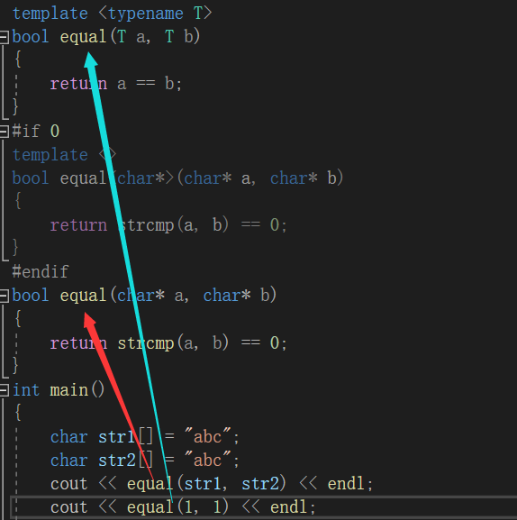
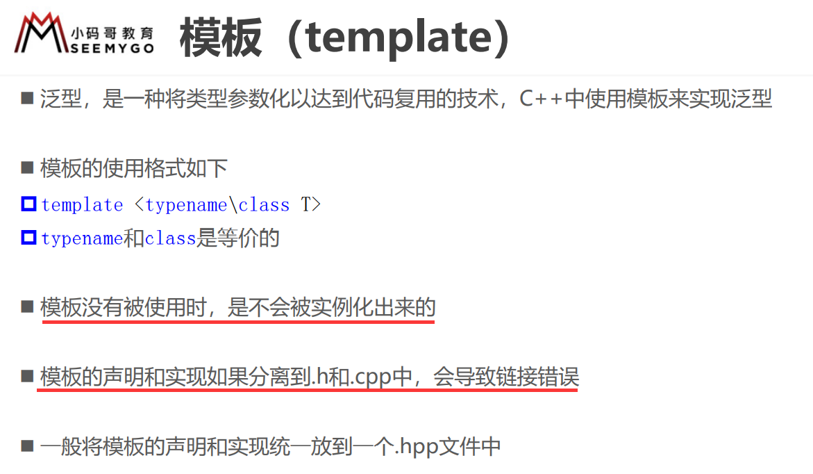

# hero

## 1. 非类型模板参数

模板参数有两种：1. 类型形参 2. 非类型形参。

1. 类型形参：**出现在模板参数列表中，跟在class或者typename之后的参数**。
2. 非类型形参：**用一个常量作为类(函数)模板的一个参数，在==类(函数)模板中可将该参数当成常量==来使用**。


比如类中需要开辟一个静态数组，但是大小未知，此时就可以使用非类型形参：

```c++
template <typename T, size_t n>  //可以加const
class P
{
public:
	T arr[n] = { 1,2,3,4,5 };
	int size() { return n; }
};
int main()
{
	P<int, 5> p;
	cout << p.size() << endl;
	for (auto i : p.arr) cout << i << ' ';
	system("pause");
}
```

运行结果：

```c++
5
1 2 3 4 5
```

***

另外模板参数也可以写为缺省参数：

```c++
#include<iostream>
using namespace std;
template <typename T, const size_t n=5>  //缺省参数
class P
{
public:
	T arr[n] = { 1,2,3,4,5 };
	int size() { return n; }
};
int main()
{
	P<int> p;
	cout << p.size() << endl;
	for (auto i : p.arr) cout << i << ' ';
	system("pause");
}
```


**注意**：

1. **`浮点数`、`类对象`以及`字符串`是不允许作为非类型模板参数的**(即只允许整形家族：int、long、long long、char)
2. **`非类型模板参数必须在编译期就能确认结果`，因为==编译器在编译阶段需要根据传入的非类型模板参数`实例化出对应的类`或`函数`==**。


## 2. 模板的特化

**模板虽然不对类型进行限制，但是并不是所有类型都能得到我们想要的结果，比如这样的函数模板就无法实现我们比较字符串的目的**：

```c++
#include<iostream>
using namespace std;
template <typename T>
bool equal(T a, T b)
{
	return a == b;
}
int main()
{
	char str1[] = "abc";
	char str2[] = "abc";
	cout << equal(str1, str2) << endl;
	system("pause");
}
```

运行结果：

```c++
0   //这是一个错误的结果
```

**==这时候就需要对模板进行特化==**，即**在原模板的基础上，针对特殊类型所进行特殊化的实现方式**，模板特化中分为**函数模板特化**与**类模板特化**。

### 2.1 函数模板特化

函数模板的特化步骤：

**首先必须要有一个基础的函数模板**。
**关键字template后面接一对==空的尖括号<>==**。
**函数名后跟一对尖括号，尖括号中指定需要特化的类型**。
**函数形参表必须要和模板函数的基础参数类型完全相同，否则不同的编译器可能会报一些奇怪的错误**。

***

现在我们将上面的函数模板进行特化。

```c++
#include<iostream>
using namespace std;

template <typename T>  //首先必须要有一个基础的函数模板
bool equal(T a, T b)
{
	return a == b;
}
template <>           //关键字template后面接一对空的尖括号<>
bool equal<char*>(char* a, char* b)  //函数名后跟一对尖括号，尖括号中指定需要特化的类型
{                                    //a b 的类型必须是char*
	return strcmp(a, b) == 0;
}
int main()
{
	char str1[] = "abc";
	char str2[] = "abc";
	cout << equal(str1, str2) << endl;
	system("pause");
}
```

运行结果：

```c++
1
```

**==你可能会诧异为什么要这样做，我不要模板，直接写一个普通的字符串比较函数不好吗==**？

因为我们想要实现的是通用类型的比较，只有一个普通的字符串比较函数不能实现比较其它类型。只有普通的模板不能比较这种`char *`类型。所以需要对`char*`类型进行特化。

***

**==另外，当函数模板和类型匹配的函数同时存在时，编译器会优先调用类型匹配的函数，而不会再根据函数模板实例化出对应的函数==，因此可以直接将该函数直接给出，而不是进行特化**：



```c++
#include<iostream>
using namespace std;
template <typename T>
bool equal(T a, T b)
{
	return a == b;
}
#if 0
template <>
bool equal<char*>(char* a, char* b)
{
	return strcmp(a, b) == 0;
}
#endif
bool equal(char* a, char* b)
{
	return strcmp(a, b) == 0;
}
int main()
{
	char str1[] = "abc";
	char str2[] = "abc";
	cout << equal(str1, str2) << endl;
	cout << equal(1, 1) << endl;
	system("pause");
}
```


### 2.2 类模板化

#### 2.2.1 全特化

全特化即是将模板参数列表中所有的参数都确定化。


```c++
#include<iostream>
using namespace std;
template <typename T1,typename T2>
class P
{
public:
	P() { cout << "P<T1,T2>" << endl; }
private:
	T1 t1;
	T2 t2;
};
template<>
//对T1是char,T2是int时进行特化
class P<char, int>  //这个又没有形参列表，所以直接写出想要特化的类型就可以了
{
public:
	P() { cout << "P<char,int>" << endl; }
private:
	char t1;
	int t2;
};
int main()
{
	P<int,int> p1;
	P<char, int> p2;
	system("pause");
}
```

#### 2.2.2 偏特化

**偏特化就是特化部分参数，或者将参数指定为指针，引用等**：


```c++
#include<iostream>
using namespace std;
template <typename T1,typename T2>
class P
{
public:
	P() { cout << "P<T1,T2>" << endl; }
private:
	T1 t1;
	T2 t2;
};
template<class T>
//对T1是char,T2是T时进行特化
class P<char, T>
{
public:
	P() { cout << "P<char,T>" << endl; }
private:
	char t1;
	T t2;
};
int main()
{
	P<int,int> p1;
	P<char, int> p2;
	system("pause");
}
```

***

将参数指定为指针，引用：

```c++
#include<iostream>
using namespace std;
template <typename T1,typename T2>
class P
{
public:
	P() { cout << "P<T1,T2>" << endl; }
private:
	T1 t1;
	T2 t2;
};
template<class T1,class T2>
//对T2是指针时进行特化
class P<T1, T2*>
{
public:
	P() { cout << "P<T1, T2*>" << endl; }
private:
	T1 t1;
	T2* t2;
};
//对T1是引用时进行特化
template<class T1, class T2>
//对T2是指针时进行特化
class P<T1&, T2>
{
public:
	P() { cout << "P<T1&, T2>" << endl; }
private:
	T1 t1;  //不要写T1& t1; 引用引用必须初始化。从一而终指向一个变量
	T2 t2;
};
int main()
{
	P<int,int> p1;
	P<char, int*> p2;
	P<char&, int> p3;
	system("pause");
}
```

运行结果：

```c++
P<T1,T2>
P<T1, T2*>
P<T1&, T2>
```

****

当然，如果存在两个特化的模板都匹配的情况，那就会报错：


解决方式

```c++
#include<iostream>
using namespace std;
template <typename T1,typename T2>
class P
{
public:
	P() { cout << "P<T1,T2>" << endl; }
private:
	T1 t1;
	T2 t2;
};
template<class T1, class T2>
//对T1是引用，T2是指针时进行特化
class P<T1&, T2*>
{
public:
	P() { cout << "P<T1&, T2*>" << endl; }
private:
	T1 t1;
	T2* t2;
};
int main()
{

	P<char&, int*> p3;
	system("pause");
}
```

**对T1是引用或对T2是指针时进行特化有没有都无所谓，但是对对T1是引用，T2是指针时进行特化必须有**。

***


**不特化是不行的**。

## 3. 模板分离编译

一个程序由若干个源文件共同实现，每个源文件单独生成.o目标文件，最后将所有的目标文件，链接起来生成可执行文件的过程称之为分离编译模式。比如将函数声明写在.h头文件中，函数定义写在.cpp文件中，在主文件中包含这个头文件就可以使用其中的函数。

分离编译有以下优点：

1. 能够提高编译速度，比如修改了众多文件中的其中一个文件，分离编译只需要单独编译修改后的文件即可，大大节省了编译时间。

   

2. 方便管理和阅读代码

   一个整体的文件，阅读起来和管理起来都是比较麻烦的，当文件分为一个个小模块之后，阅读感更好，管理也比较方便。

### 3.1 模板为什么不支持分离编译



程序要运行起来一般要经历以下四个步骤：

预处理： 头文件展开、去注释、宏替换、条件编译等。
编译： 检查代码的规范性、是否有语法错误等，确定代码实际要做的工作，在检查无误后，将代码翻译成汇编语言。注意：头文件不参与编译，编译器对工程中的多个源文件是分离开单独编译的。
汇编： 将编译后的汇编文件翻译成二进制目标文件。
链接： 将生成的各个目标文件进行链接，生成可执行文件。


总结起来就是，**定义的地方没有实例化(即指定确定的类型)，需要实例化的地方只有声明没有定义，最终导致链接错误。**

解决办法：

1. 将声明和定义放到同一个`.h`文件之中。
2. 模板定义的位置显示实例化(不推荐，因为需要自己手动显示实例化一个函数，这样便丧失了模板存在的意义)。

### 3.2 模板的优缺点

优点：

模板增强了代码的复用性、节省资源、更快的迭代开发，C++的标准模板库(STL)也因此而产生，C++98才出现的模板，有了模板之后才出现的STL库
增强了代码的灵活性
相同的函数接口，只是传入的参数类型不一样，只需要传入不同的参数，即可以实例化不同的模板代码。比如排序问题，可以给int 数据排序和char类型数据排序，没有引入模板，就需要编写两次排序函数，**而引入模板之后，就可以在实例化的时候，根据不同的数据类型实例化排序方法**。
缺点：

**有些C++编译器还不支持模板，当使用这些编译器编译含有模板的代码时就会发生不兼容问题。**

**==不支持分离编译，所有用基于模板算法的实现必须包含在整个设计的头文件中==**。
————————————————
版权声明：本文为CSDN博主「精致的灰(&gt;_&lt;)」的原创文章，遵循CC 4.0 BY-SA版权协议，转载请附上原文出处链接及本声明。
原文链接：https://blog.csdn.net/qq_52670477/article/details/121307738