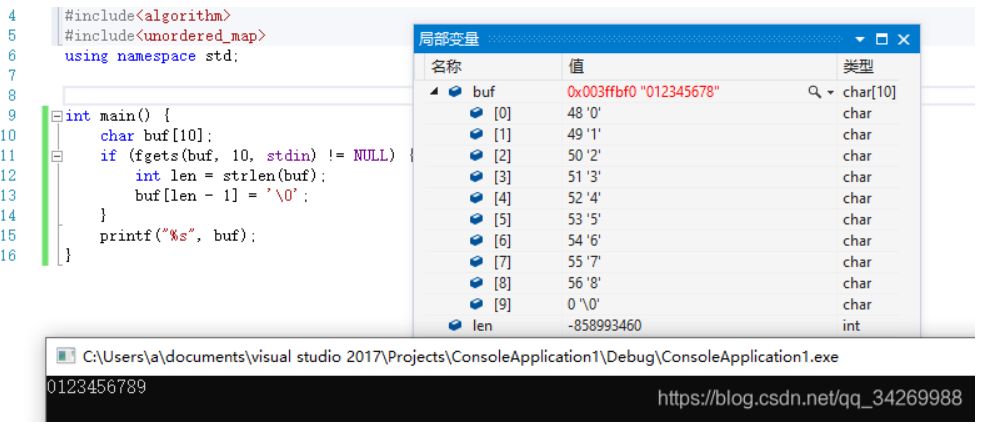
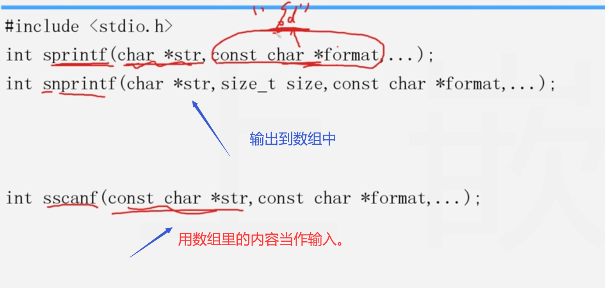
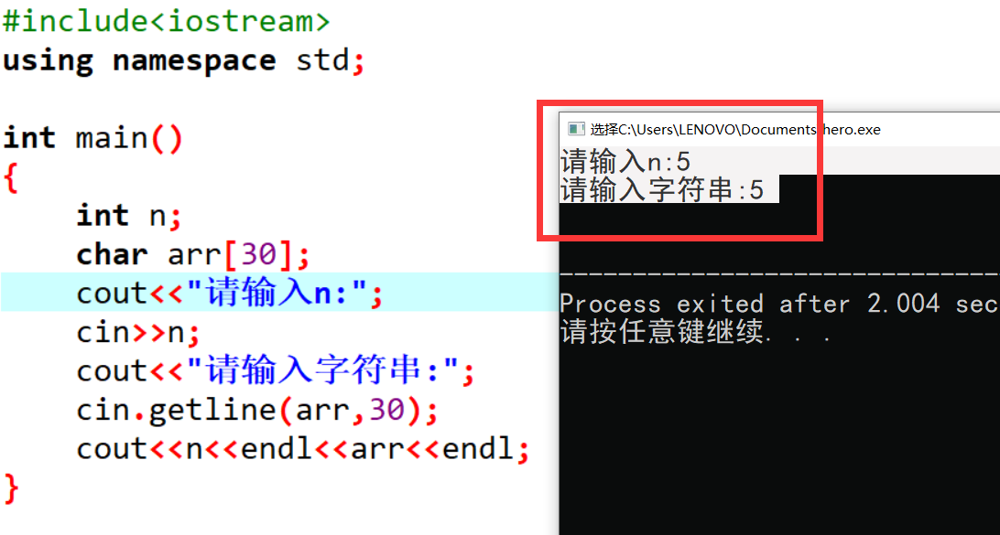
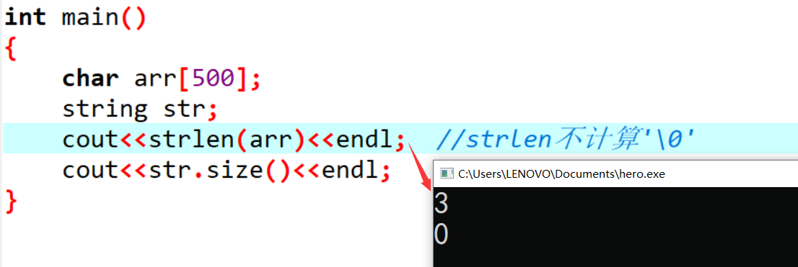
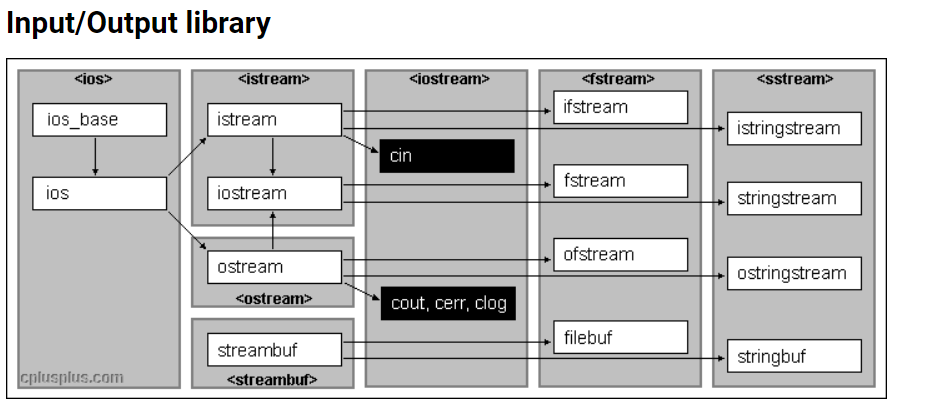

#                                                 c/c++输入输出的注意事项

## c:

* 1.函数返回值类型不写默认为整形，而不是空类型。
  2.puts自动将\0转换为换行符
  3.gets接受空格，以回车作为字符串结束标志。
  4.scanf回车和空格就是字符串结束标志。(3和4都不会吞掉回车符)
  4.fgets(字符数组名，n，文件指针)。常见的fgets(arr,n,stdin)，此时的文件是键盘。最多读取n－1个字符，可读入空格。在读入的最后一个后加上串结束标志\0(**就是不管第n个字符是什么我们都不读了，因为只能读n-1个，第n个位置我们需要为'\0'留着。所以如果你的字符串长度刚好是n，且最后一个字符是回车，那么此时就不会有回车被读取的问题了**)。**如果你不到n－1个字符就结束了读入。那么回车将被读取，并且在回车之后加上\0**。    关于fputs就是(字符串，fp或者stdout)。
  
  在写网络编程时候遇到一个问题：通过fgets读取到了一行输入到缓冲区中，总是要通过strlen()来查下缓冲区中的长度，然后替换。
  
  一开始没懂这个操作，后来查了下资料，原来fgets在读取输入流的时候，会读取你最后的那个回车，也就是'\n'。
  
  比如你现在输入:abcde
  
  实际上保存到缓存区中的是：abcde\n
  
  然而fgets()会自动再补一个‘\0’，也就是说保存到缓冲区send_line中的是`abcde\n\0`，但是其实我们就没想要这个'\n'这势必会造成数据的不准确，所以我们就要自己来进行一个替换，把最后的'\n'给换成'\0'。
  
  ```c++
  fgets(char *s, int size, FILE *stream) 
  //s 缓冲区
  //size 最大读取长度
  //文件流 如 stdin
   
   
  while (fgets(send_line, MAXLINE, stdin) != NULL) {
          int i = strlen(send_line);
          if (send_line[i - 1] == '\n') {
              send_line[i - 1] = 0;
          }
          ...
  }
  ```
  
  这里还有个疑问，既然都会保存'\n'，那为什么要判断呢？直接把最后一个'\n'进行替换不就好了吗？
  
  我试着输入超过给定size大小的字符串，比如：
  
  
  
  **==就发现，当你输入超过size的时候，其实不会再保存那个'\n'换行符了，自己就保存成了'\0'==**。
  
  所以还是记住这种写法！
  
  5.c语言中函数声明可省略形参，c++也可以。
  6.函数间的数据传递通过参数，返回值和全局变量来实现。其中参数传递方式又可分为值传递方式和地址传递方式(传值和传址)
  7.当全局变量和局部变量同名时，局部变量会被优先使用。即作用域小的优先。
  8.对于结构体:struct Student
  {
     int a;
     char c;
  }
  stu;Student是结构体名,可省略。只有当变量stu定义后才会为其分配空间。
  9.设p是该结构体的指针，p=&stu。则调用数据的方法有两种:1解引用法，(相当于用原名调用，所以当然是点。就是你对stu取了地址，再解引用，当然就是stu这个变量本身。)即，(*p).a；
  2指针法,p->a；
  10.设有一个结构体数组stu[3]。
  p是该结构数组的指针。p=stu。那么使用该结构体数组的数据的方法有1,(stu+i)->a或者(p+i)->a。2，p[i].a(意是就是理解为p是stu的别名)
  11.对于strcpy(第一个参数只能是数组名，第二个参数可以是数组名也可是字符串常量)。第一个数组一定要足够大，可以容纳复制过来的字符串。


******

* 

* 示例

  ```c
  
  ```

  

## c++:

* #### cin

  * 使用空白(空格，制表符和换行符，**==不读取这三种字符，把它们留在缓冲区中==**)来确定字符串结束的位置。这意味着cin在获取字符数组输入时只读取一个单词。读取该单词后，**cin将该字符串放到数组中，==并自动在结尾添加空字符==**。意思就是如果输入(aabb ccdd)，有时候你想将这一串包括空格也读入到字符数组中。但是cin只会读取到aabb并把它末尾**自动加上'\0'**放入字符数组中。**存在的另外一个问题是，输入的连续字符串比字符数组长，cin不能防止这种错误情况发生**。
  * 当cin>>从缓冲区中读取数据时，**==若缓冲区中第一个字符是空格、tab或换行这些分隔符时==**，cin>>会将其**==忽略并清除==**，继续读取下一个字符，若缓冲区为空，则继续等待。**但是如果读取成功，字符后面的分隔符是残留在缓冲区的**，cin>>不做处理。

  所以cin可以读取一行的多个数字，

  ```c++
  int main()
  {
      int n;
      while(cin>>n)
      {
          if(cin.getchar()=='\n') break;
  	}
  }
  ```

  当你输完一个数字会有空格，cin不读空格，我们可以用getchar读掉。为了下一个数字的输入做了准备，当然就是你不清楚这个空格，cin下一次读的时候也会忽略并清除，主要是为了读取'\n'判断输入结束。

* scanf

  * scanf同cin的两条规则。下面是一个例子。

    ```c++
    Description
    输入字符序列，若字符序列的格式形如："序列1"&"序列2"。其中序列1和序列2中都不含字符"&"，判断序列2是否为序列1的逆序列。 如果是逆序则输出“YES”,否则输出“NO”。
    
    输入字符序列数组数
    
    Sample Input
    3
    
    a+b&b+a
    
    Heisaworker&rekrowasieh
    
    cdeaf&faedc
    
    Sample Output
    YES
    
    NO
    
    YES
    ```

    ```c++
    #include <iostream>
    #include <cstring>
    #include <cstdio>
    #include <algorithm>
    using namespace std;
    const int N= 10000;
    char s[N];
    int n;
    int main()
    {
        scanf("%d", &n);
        for (int i = 0; i < n; i ++ )
        {
            //memset(s, 0, sizeof s);
            scanf("%s",s);  我们连续输入多个字符串，scanf会在每个字符串的末尾自动补上'\0'。
            int j=-1;
            int k=-1;
            for(int d=0;s[d];d++) 
            {
                if(s[d]=='&') 
                {
                    j=d-1;
                    k=d+1;
                    break;
                }
            }
            while(j>=0&&k<strlen(s))
            {
                if(s[j]==s[k]) ;
                else 
                {
                    puts("NO");
                    break;
                }
                j--;
                k++;
            }
            if(j==-1) puts("YES");
        }
        puts("");
    }
    ```

    

* #### 面向行的输入(  cin.getline()和cin.get()  )

  * **背景**：每次读取一个单词通常不是最好的选择。例如，假设程序要求用户输入城市名，用户输入New York或Sao paulo。你希望读取完整的城市名，而不仅仅是New或Sao。要将整条短语而不是一个单词作为字符串输入，需要采取另一种读取方法。也就是，需要采用面向行输入而不是面向单词的方法。

  * **面向行的输入**：cin.getline()和cin.get()。这两个函数都读取一行输入，直到到达换行符。然而，随后getline()将读取并丢弃换行符(**==意思就是读取了，然后自动转换为空字符==**)，而get()将换行符保留在输入序列中(缓冲区)。

    * **getline()**：**见名知意，得到一行嘛，==肯定会吃掉换行符==最终将其转换为'\0'啊。**
      第一个参数是用来存储输入行的数组的名称，第二个参数是要读取的字符数。如果这个参数为20，则函数最多读入19个字符，余下的空间用于存储自动在结尾处添加的空字符。getline()成员函数在读取指定数目的字符或遇到换行符(**==自动把换行符转换为空字符==**)时就停止读取。

      (若有多余的输入（即超出了指定输入的大小），那么它们会被滞留在缓冲区中。

      cin.getline()和cin.get() 都是如此)

      ```c++
      char arr[20];
      cin.getline(arr,20);
      ```

      数组的大小为20。这样最多读入19个字符(多输入的仍旧保留在缓冲区中)，最后一个字节用来保存空字符('\0')。但是如果你这样做：

      ```c++
      cin.getline(arr,25);
      ```

      则最多可以读取24个字符，最后一个字节用来保存空字符('\0')。

      但是这样已经发生了一个隐含的错误：数组越界。

      ```c++
      char name[20];
          cout << "请输入name：\n";
      cin.getline(name, 25);
          cout << "打印name\n";
          cout << name << endl;
      ```
      
  
  
      
    * **get()**：
    
      首先说明:这个函数有几种重载版本，其中一种变体的工作方式与getline()类似，它们接受的参数相同，解释参数的方式也相同，并且都读取当行尾。但是，get()并不再读取并丢弃换行符，**==而是将其留在输入队列中(缓冲区)==**，余下的空间（一个字节）用于存储**==自动在结尾处添加的空字符==**。假设我们连续调用两次get():
    
      ```c++
      cin.get(name,20);
      cin.get(arr,20);  //a problem
      ```
    
      
      
      由于第一次调用后，换行符将留在输入队列中，因此第二次调用时看到的第一个字符便是换行符。因此get()认为已经到达了行尾(会把换行符丢弃在缓冲区中，并在arr中自动补上`'\0'`)，而没有发现任何可读取的内容。**==如果不借助任何帮助，get()不能跨过该换行符。==**
      
      ```c++
      char name[20];
          char arr[20]{'a'};       //用字符a进行测试
          cout << "请输入name：\n";
          cin.get(name, 20);
          cout << "请输入arr：\n";
         // cin.get(arr, 20);     //此时不对arr进行输入
          cout << "打印name\n";
          cout << name << endl;
          cout << "打印arr:\n";
          cout << arr << endl;
          printf("%d", arr[0]);
      
      ```
      
      
      
      可以看到，不对arr进行输入时，一切正常。
      
      ```c++
      char name[20];
          char arr[20]{'a'};
          cout << "请输入name：\n";
          cin.get(name, 20);
          cout << "请输入arr：\n";
          cin.get(arr, 20);          //此时对arr进行输入
          cout << "打印name\n";
          cout << name << endl;
          cout << "打印arr:\n";
          cout << arr << endl;
          printf("打印arr第一个元素的ascii码\n");
          printf("%d", arr[0]);
      ```
      
      
      
      现在对arr进行输入，输入19个字符加一个回车(共20个)。回车被留在缓冲区，
      
      ```c
      cin.get(arr, 20); 
      ```
      
      接下来执行上面那条语句。由于缓冲区中第一个字符就是回车，但是cin.get()不读取回车，
      
      于是我们什么也没有读到。但是根据cin.get()会丢弃回车(丢在缓冲区中)并自动在结尾处添加一个
      
      空字符的原理。所以，我们的arr[0]会被赋值为'\0'。所以最后打出来的ascii码值也是'\0'。
      
      可以看到：我们根本就没有对arr进行输入的机会，
      
      (如果该段程序后面还有特别多类似
      
      cin.get(arr, 20);  
      
      **==这样的语句的话，我们也无法对它们进行读入，因为该死的换行符一直存在于缓冲区中，每次使用cin.get()去读内容的时候，遇到的第一个字符都是换行符)==**
      
      就是因为换行符残留在缓冲区中加上cin.get()的特性造成的。
      
      ```c++
          char name[20];
          char arr[20]{'a'};
          cout << "请输入name：\n";
          cin.get(name, 20);
          cout << "请输入arr：\n";
      
          cin.get();    // 用cin.get()读走回车 或cin.get(ch)
      
          cin.get(arr, 20);
          cout << "打印name\n";
          cout << name << endl;
          cout << "打印arr:\n";
          cout << arr << endl;
          printf("打印arr第一个元素的ascii码\n");
          printf("%d", arr[0]);
      ```
      
      
      
      可以看到，将万恶的回车符读走之后一切正常了。
      
  
* **==混合输入数字和字符可能会引发的问题==**：**这个很重要，具体见层序遍历创建二叉树(混合输入字符和字符串造成了问题)。**

  ```c++
  int main()
  {
      int n;
      char arr[30];
      cout<<"请输入n:";
      cin>>n;
      cout<<"请输入字符串:";
      cin.getline(arr,30);
      cout<<n<<endl<<arr<<endl;
  }
  ```

  结果：

  

  可以看到，用户根本没有输入字符串的机会，因为我们输入了`n`以后，将回车键生成的换行符留在了输入队列(缓冲区)中。后面的`cin.geiline()`看到换行符后，将认为这是一个空行，于是会将一个空字符串(只包含`\0`的字符串)赋值给`arr`数组。

  **==解决方法是：先读取并丢弃缓冲区中的换行符。==**

  ```c++
  int main()
  {
      int n;
      char arr[30];
      cout<<"请输入n:";
      cin>>n;
      cin.get();  //or cin.get(ch)
      cout<<"请输入字符串:";
      cin.getline(arr,30);
      cout<<n<<endl<<arr<<endl;
  }
  ```

  ****

  ```c++
  int main()
  {
      int n;
      char arr[30];
      cout<<"请输入n:";
      (cin>>n).get();  //or (cin>>n).get(ch);
      cout<<"请输入字符串:";
      cin.getline(arr,30);
      cout<<n<<endl<<arr<<endl;
  }
  ```

* string类I/O

  与普通数组相比读行时会有区别。

  ```c++
  string str;
  getline(cin,str);
  ```

  下面是将一行输入读取到数组中的代码:`cin.getline(charr，20);`
  这种句点表示法表明，函数`getline()`是 `istream`类的一个类方法(还记得吗,`cin`是一个 `istream`对象)正如前面指出的，第一个参数是目标数组;第二个参数数组长度,`getline()`使用它来避免超越数组的边界
  下面是将一行输入读取到`string`对象中的代码:**==读行==**
  `getline (cin ,str);`
  这里没有使用句点表示法，==**这表明这个 `getline()`不是类方法。它将`cin `作为参数，指出到哪里去查找输入。另外，也没有指出字符串长度的参数，因为`string`对象将根据字符串的长度自动调整自己的大小。**==
  那么，为何一个`getline( )`是 `istream` 的类方法，而另一个不是呢?在引入`string`类之前很久，C++就有`istream`类。因此 `istream`的设计考虑到了诸如 `double`和 `int`等基本C++数据类型，但没有考虑`string` 类型,所以 `istream`类中，**有处理`double`、`int`和其他基本类型的类方法，但没有处理 `string`对象的类方法。**
  由于 istream类中没有处理string对象的类方法，因此您可能会问，下述代码为何可行呢?
  cin >> str;l / read a word into the str string object  **==//友元==**
  像下面这样的代码使用istream类的一个成员函数:
  cin >>x;1/ read a 'value into a basic C++ type
  ==**但前面处理string对象的代码使用string类的一个友元函数**==。有关友元函数及这种技术为何可行，将在第11章介绍。另外，您可以将cin和 cout用于string对象，而不用考虑其内部工作原理。

* strlen函数

  ```c++
  int main()
  {
      char arr[20];
      string str;
      cout<<strlen(arr)<<endl; //strlen不计算'\0'
      cout<<str.size()<<endl;
  }
  ```

  结果：

  

  对于未初始化的数据，第一个空字符出现的位置是随机的。所以`strlen`得到的结果是多少都不奇怪。

## sstream

https://blog.51cto.com/bruceou/5171407

https://cloud.tencent.com/developer/article/2077554

https://www.cnblogs.com/leijiangtao/p/12046541.html


https://cloud.tencent.com/developer/article/2089224

https://developer.aliyun.com/article/621220

https://www.eecis.udel.edu/~saunders/progteam/stringstream.html


