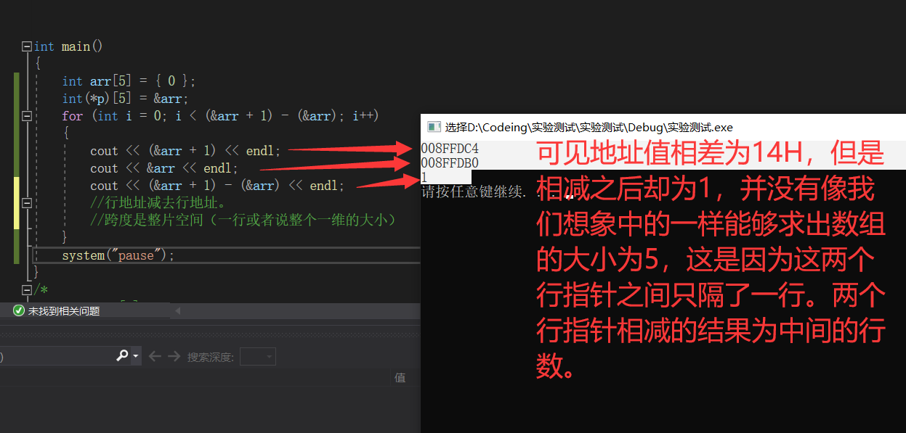
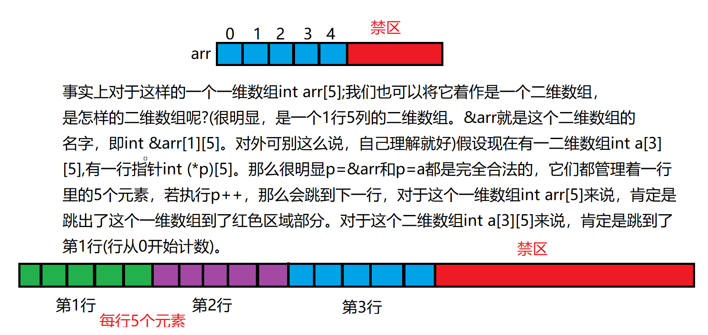
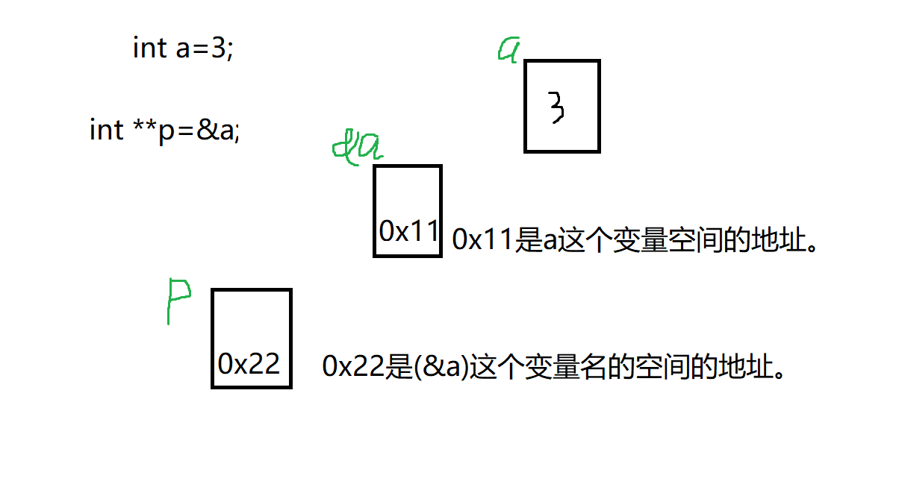
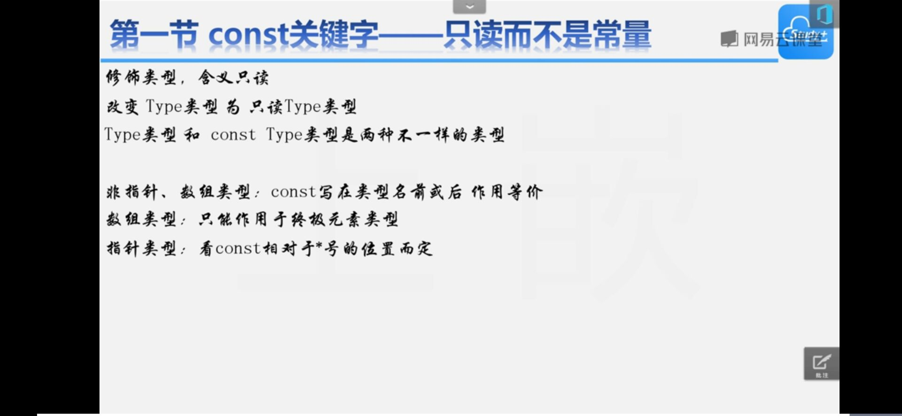
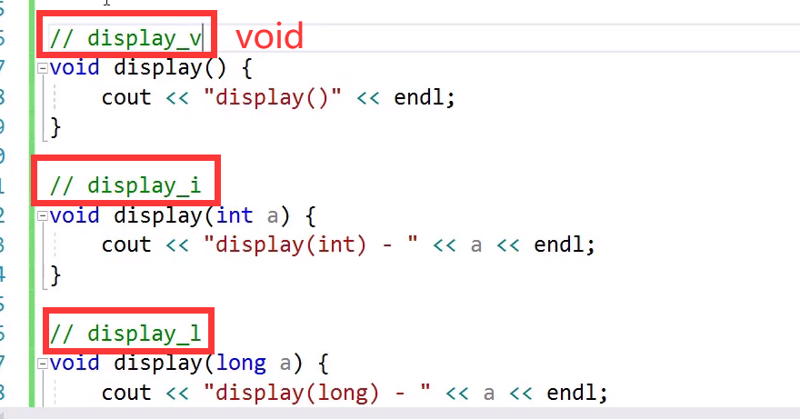
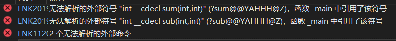
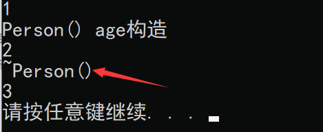
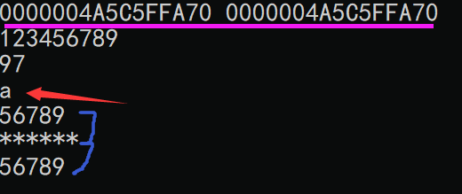
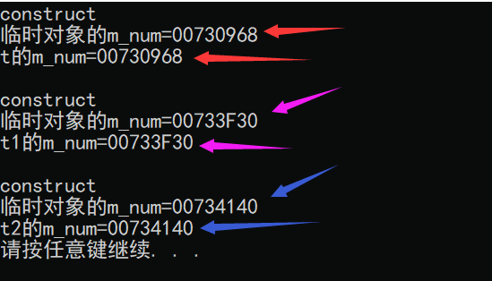

# 清醒的人最荒唐

```c
why will produce memory fragments  with malloc frequently 

Memory fragmentation occurs when the free memory space on a system becomes fragmented into small pieces due to the allocation and deallocation of memory blocks of varying sizes. This can lead to a situation where a program is unable to allocate a sufficiently large contiguous block of memory, even though the total amount of free memory is sufficient.

One reason why memory fragmentation can occur frequently when using malloc is that malloc allocates memory dynamically, and the size of the memory block allocated is not necessarily the same as the size requested. This can result in small gaps or "holes" in the memory space that are not large enough to be reused for future memory allocations. Over time, these holes can accumulate and cause memory fragmentation.

Another reason is that malloc relies on the operating system's memory allocation mechanism to provide memory blocks, and the behavior of the operating system's allocator can vary depending on the specific system and usage patterns. For example, some operating systems may be more likely to fragment memory than others, and the frequency and size of allocations and deallocations can also affect the likelihood of fragmentation.

To mitigate memory fragmentation when using malloc, it is important to carefully manage memory usage and to free memory blocks when they are no longer needed. Additionally, memory pooling and other techniques can be used to reduce fragmentation by reusing memory blocks instead of constantly allocating and deallocating new ones. Alternatively, using a garbage collector or a memory-safe language that automatically manages memory allocation and deallocation can also eliminate many of the issues associated with memory fragmentation.


tuotao1999@gmail.com
用中文再回答一下
当使用 malloc 动态分配内存时，由于分配和释放大小不同的内存块，可能会导致内存碎片问题。这会使系统的可用内存变得不连续，存在许多小块的内存空间，导致程序无法分配足够大的连续内存块，即使总的空闲内存量是足够的。

频繁使用 malloc 导致内存碎片的原因之一是，malloc 动态分配内存，分配的内存块大小不一定与所请求的大小相同，这可能导致内存空间中存在一些小的间隙或“空洞”，无法被重新利用进行后续的内存分配。随着时间的推移，这些空洞会累积并导致内存碎片。

另一个原因是，malloc 依赖操作系统的内存分配机制来提供内存块，操作系统的分配器行为因特定的系统和使用模式而异。例如，某些操作系统可能更容易产生内存碎片，而分配和释放的频率和大小也会影响内存碎片的发生。

为了减少使用 malloc 时的内存碎片问题，需要仔细管理内存使用，并在不再需要内存块时及时释放。此外，可以使用内存池等技术来减少内存碎片，通过重用内存块而不是不断分配和释放新的内存块。或者，使用垃圾回收器或内存安全的语言来自动管理内存分配和释放，也可以消除许多与内存碎片相关的问题。
```


****

```shell
Zlibrary复活攻略
Zlibrary最新网址：（亲测可用）
https://1lib.education/
https://1lib.limited/
https://book4you.org/
https://zh.book4you.org/
点击链接就可以直接跳转，进入官网后可以直接搜索。
```


```shell
"""""新文件标题
""""""""""""""""""""""""""""""""""""""""""""""""""""""""""""""""""""""""""""""""""""""""""""""""
"新建.c,.h,.sh,.java文件，自动插入文件头 
autocmd BufNewFile *.cpp,*.[ch],*.sh,*.java exec ":call SetTitle()" 
""定义函数SetTitle，自动插入文件头 
func SetTitle() 
	"如果文件类型为.sh文件 
	if &filetype == 'sh' 
		call setline(1, "##########################################################################") 
		call append(line("."), "# File Name: ".expand("%")) 
		call append(line(".")+1, "# Author: amoscykl") 
		call append(line(".")+2, "# mail: amoscykl980629@163.com") 
		call append(line(".")+3, "# Created Time: ".strftime("%c")) 
		call append(line(".")+4, "#########################################################################") 
		call append(line(".")+5, "#!/bin/zsh")
		call append(line(".")+6, "PATH=/home/edison/bin:/home/edison/.local/bin:/usr/local/sbin:/usr/local/bin:/usr/sbin:/usr/bin:/sbin:/bin:/usr/games:/usr/local/games:/snap/bin:/work/tools/gcc-3.4.5-glibc-2.3.6/bin")
		call append(line(".")+7, "export PATH")
		call append(line(".")+8, "")
	else 
		call setline(1, "/*************************************************************************") 
		call append(line("."), "	> File Name: ".expand("%")) 
		call append(line(".")+1, "	> Author: hero") 
		call append(line(".")+2, "	> Mail: @hero ") 
		call append(line(".")+3, "	> Created Time: ".strftime("%c")) 
		call append(line(".")+4, " ************************************************************************/") 
		call append(line(".")+5, "")
	endif
	if &filetype == 'cpp'
		call append(line(".")+6, "#include<iostream>")
		call append(line(".")+7, "#include<algorithm>")
		call append(line(".")+8, "#include<cstring>")
    	call append(line(".")+9, "using namespace std;")
		call append(line(".")+10, "")
	endif
	if &filetype == 'c'
		call append(line(".")+6, "#include<stdio.h>")
		call append(line(".")+7, "")
	endif
	"	if &filetype == 'java'
	"		call append(line(".")+6,"public class ".expand("%"))
	"		call append(line(".")+7,"")
	"	endif
	"新建文件后，自动定位到文件末尾
	autocmd BufNewFile * normal G
endfunc 
""""""""""""""""""""""""""""""""""""""""""""""""""""""""""""""""""""""""""""""""""""""""""""""""""""""
"键盘命令
""""""""""""""""""""""""""""""""""""""""""""""""""""""""""""""""""""""""""""""""""""""""""""""""""""""
 
nmap <leader>w :w!<cr>
nmap <leader>f :find<cr>
 
" 映射全选+复制 ctrl+a
map <C-A> ggVGY
map! <C-A> <Esc>ggVGY
map <F12> gg=G
" 选中状态下 Ctrl+c 复制
vmap <C-c> "+y
 
 
 
""""""""""""""""""""""""""""""""""""""""""""""""""""""""""""""""""""""""""""""""""""""""""""""""""""""
""实用设置
"""""""""""""""""""""""""""""""""""""""""""""""""""""""""""""""""""""""""""""""""""""""""""""""""""""
" 设置当文件被改动时自动载入
set autoread
" quickfix模式
autocmd FileType c,cpp map <buffer> <leader><space> :w<cr>:make<cr>
"代码补全 
set completeopt=preview,menu 
"允许插件  
filetype plugin on
"共享剪贴板  
set clipboard=unnamed 
"从不备份  
set nobackup
"make 运行
:set makeprg=g++\ -Wall\ \ %
"自动保存
set autowrite
set ruler                   " 打开状态栏标尺
set cursorline              " 突出显示当前行
set magic                   " 设置魔术
set guioptions-=T           " 隐藏工具栏
set guioptions-=m           " 隐藏菜单栏
"set statusline=\ %<%F[%1*%M%*%n%R%H]%=\ %y\ %0(%{&fileformat}\ %{&encoding}\ %c:%l/%L%)\
" 设置在状态行显示的信息
set foldcolumn=0
set foldmethod=indent 
set foldlevel=3 
set foldenable              " 开始折叠
" 不要使用vi的键盘模式，而是vim自己的
set nocompatible
" 语法高亮
set syntax=on
" 去掉输入错误的提示声音
set noeb
" 在处理未保存或只读文件的时候，弹出确认
set confirm
" 自动缩进
set autoindent
set cindent
" Tab键的宽度
set tabstop=4
" 统一缩进为4
set softtabstop=4
set shiftwidth=4
" 不要用空格代替制表符
set noexpandtab
" 在行和段开始处使用制表符
set smarttab
" 显示行号
set number
" 历史记录数
set history=1000
"禁止生成临时文件
set nobackup
set noswapfile
"搜索忽略大小写
set ignorecase
"搜索逐字符高亮
set hlsearch
set incsearch
"行内替换
set gdefault
"编码设置
set enc=utf-8
set fencs=utf-8,ucs-bom,shift-jis,gb18030,gbk,gb2312,cp936
"语言设置
set langmenu=zh_CN.UTF-8
set helplang=cn
" 我的状态行显示的内容（包括文件类型和解码）
set statusline=%F%m%r%h%w\ [FORMAT=%{&ff}]\ [TYPE=%Y]\ [POS=%l,%v][%p%%]\ %{strftime(\"%d/%m/%y\ -\ %H:%M\")}
set statusline=[%F]%y%r%m%*%=[Line:%l/%L,Column:%c][%p%%]
" 总是显示状态行
set laststatus=2
" 命令行（在状态行下）的高度，默认为1，这里是2
set cmdheight=2
" 侦测文件类型
filetype on
" 载入文件类型插件
filetype plugin on
" 为特定文件类型载入相关缩进文件
filetype indent on
" 保存全局变量
set viminfo+=!
" 带有如下符号的单词不要被换行分割
set iskeyword+=_,$,@,%,#,-
" 字符间插入的像素行数目
set linespace=0
" 增强模式中的命令行自动完成操作
set wildmenu
" 使回格键（backspace）正常处理indent, eol, start等
set backspace=2
" 允许backspace和光标键跨越行边界
set whichwrap+=<,>,h,l
" 可以在buffer的任何地方使用鼠标（类似office中在工作区双击鼠标定位）
set selection=exclusive
set selectmode=mouse,key
" 通过使用: commands命令，告诉我们文件的哪一行被改变过
set report=0
" 在被分割的窗口间显示空白，便于阅读
set fillchars=vert:\ ,stl:\ ,stlnc:\
" 高亮显示匹配的括号
set showmatch
" 匹配括号高亮的时间（单位是十分之一秒）
set matchtime=1
" 光标移动到buffer的顶部和底部时保持3行距离
set scrolloff=3
" 为C程序提供自动缩进
set smartindent
" 高亮显示普通txt文件（需要txt.vim脚本）
 au BufRead,BufNewFile *  setfiletype txt
"自动补全
:inoremap ( ()<ESC>i
:inoremap ) <c-r>=ClosePair(')')<CR>
":inoremap { {<CR>}<ESC>O
":inoremap } <c-r>=ClosePair('}')<CR>
:inoremap [ []<ESC>i
:inoremap ] <c-r>=ClosePair(']')<CR>
:inoremap " ""<ESC>i
:inoremap ' ''<ESC>i
function! ClosePair(char)
	if getline('.')[col('.') - 1] == a:char
		return "\<Right>"
	else
		return a:char
	endif
endfunction
filetype plugin indent on 
"打开文件类型检测, 加了这句才可以用智能补全
set completeopt=longest,menu
"""""""""""""""""""""""""""""""""""""""

```

****


## 1. c++函数式编程

* 前言
  Java8在Java中通过lambda表达式、Stream API引入了函数式编程，那么C++中是否也支持函数式编程呢？答案是肯定的。目前关于C++进行函数式编程的语法探究的相关博客、文章并不多，本篇博客的目的就是阐述利用C++进行函数式编程的几种方法。
  为了避免本博客篇幅过大，本博客中只涉及C++函数式编程的语法，不对函数式编程的相关思想和关键概念进行详细阐述，但本博客的最后会给出笔者认为比较好的关于函数式编程的相关参考书籍。如有问题或发现本博客中涉及的bug可以在评论区中提出，谢谢！

  阅读完本博客你将会理解和掌握：

  * 函数式编程简化代码、复用已有函数、降低编码复杂度的优点
  
* 函数指针的声明和使用方法
  
  * lambda表达式的形式和用法
  
* 利用函数指针和lambda表达式实现C++的函数式编程
  
  * 函数式编程简化代码、复用已有函数、降低编码复杂度的优点
  * 函数指针的声明和使用方法
  
* `lambda`表达式的形式和用法
  * 利用函数指针和`lambda`表达式实现C++的函数式编程
  
  * 利用`fuction<T>`模板的声明和用法，并用`fuction<T>`模板替代函数指针
  * `functional`头文件中的函数对象和用法
  * 利用函数式编程对已有代码进行重构
  
* 一个简单的编程问题
    我想大家在刚刚开始接触编程的时候应该都遇到过这样一个简单的编程问题：
    给出3个int型整数a、b、c，当：

    * c为0时，求出`a+b`；
    
    * c为1时，求出`a-b`；
    
    * c为2时，求出`a*b`；
    
  * c为3时，求出`a/b`；
  
  看到这个问题，你会想到怎么实现呢？如果有了想法快去自己实现一下呀(～￣▽￣)～
  我们的第一想法（好吧，只是我的第一想法）应该是用一个map将c值和对应的计算方式建立映射关系，显然这个方法目前不可行，因为C++中不支持定义**==“函数类型”==**。我们只能退而求其次，使用if-else语句或者switch-case-break语句来完成该程序，代码清单1如下：
  
  ```c++
  //代码清单1
  #include<iostream>
  using namespace std;
  int Plus(int a,int b){//加法
      return a+b;
  }
  int Minus(int a,int b){//减法
      return a-b;
  }
  int Multiplies(int a,int b){//乘法
      return a*b;
  }
  int Divides(int a,int b){//除法
      return a/b;
  }
  int main(){
      int a,b,c;
      cin>>a>>b>>c;
      if(c==0)
          cout<<Plus(a,b)<<endl;
      else if(c==1)
          cout<<Minus(a,b)<<endl;
      else if(c==2)
          cout<<Multiplies(a,b)<<endl;
      else if(c==3)
          cout<<Divides(a,b)<<endl;
      return 0;
  }
  ```
  
  ==显然这样的代码过于臃肿，不够简洁，如果我们可以用`map`将`c`值和对应的计算方式建立起映射关系，输入`c`，直接调用对应的函数，代码会简洁很多，那么我们有什么办法去实现这样的`map`吗？==（当然有！不然我写这篇博客干啥︿(￣︶￣)︿）
  
  ## 函数指针
  
  C++中没有`函数类型`，但是有`函数指针`的概念，**函数指针指向的是函数**而非对象。**和其他指针一样，函数指针也具有类型**，**其类型**由**==指向函数的形参类型和返回类型==**共同决定。函数指针(类型的变量)声明方式是`函数返回类型 (*函数指针名) (形参类型列表)`，我们可以按照下面的声明方式声明一个函数指针：
  
  ```c++
  //定义指向包含两个int形参，返回类型为int的函数的函数指针
  int (*f)(int,int)=nullptr;//当前该函数指针没有指向任何一个函数
  int (*)(int,int) //类型
  f                //变量
  nullptr          //值
  ```
  
* 值得注意的是：`函数返回类型 (*函数指针名) (形参类型列表)`。你可以把函数指针当成是一种类型（貌似函数指针就是一种类型，根据这个作者的描述），可以用这种类型来定义变量，定义出来的变量p(or f)是函数指针类型的指针变量，可以将这个变量指向一个函数。
  
*****

  当我们把函数名作为一个值使用时，该函数名自动转换成指针，例如，我们可以这样让`f`指针指向我们上一个程序中定义的`Plus`函数（注意函数指针与函数的类型必须匹配）：

```c++
  f=Plus;//f指向名为Plus的函数
  f=&Plus;//等价的赋值语句，取地址符是可选的
```

   

  我们可以直接使用函数指针调用一个函数，无须解引用：

  ```c++
  int t1=Plus(1,2);//调用Plus函数
  int t2=f(1,2);//等价的调用语句
  ```

  **虽然我们不能将多个函数存放到一个数组中**，==但我们可以将多个函数指针存放在一个数组中==，语法是`函数返回类型 (*函数指针名[数组维度]) (形参类型列表)`，我们可以按照下面的声明方式声明一个4维的函数指针数组：

  ```c++
  int(*v[4])(int,int);  //一个函数指针类型（返回值是int,形参是(int,int)）的数组，数组大小为4。
                        //当然也可以写成vectorla           
  ```

  ==如何==使用标准库中的容器，例如`vector`、`map`，可以按照下面的声明方式声明一个存放函数指针类型的`vector`以及存  放`int->函数指针`键值对的`map`：

  ```c++
  vector<int(*)(int,int)>v;    //一个容器v,类型是函数指针
  map<int,int(*)(int,int)>m;   
  ```

  ==哇，好复杂的声明，难道我需要定义函数指针的地方，都要这么声明吗？当然不是，我们可以利用C++中的类型别名机制`using`来简化声明：==

  ```c++
  using pf=int(*)(int,int); //pf是该函数指针类型的一个别名。 此时作者自己说了函数指针是一种类型
  vector<pf>v; //存放函数指针的vector
  map<int,pf>m;//存放 `int->函数指针` 键值对的`map`
  
  pf f[4];//函数指针数组   int (*f[4]) (int,int) 比起这种形式简洁得多
                  //这两种定义数组的方式是完全等价的。
  ```

  因此我们可以利用下面的代码清单2解决刚刚提出的加、减、乘、除的编程问题：

  ```c++
  //代码清单2
  #include<iostream>
  #include<map>
  using namespace std;
  int Plus(int a,int b){//加法
      return a+b;
  }
  int Minus(int a,int b){//减法
      return a-b;
  }
  int Multiplies(int a,int b){//乘法
      return a*b;
  }
  int Divides(int a,int b){//除法
      return a/b;
  }
  int main(){
      int a,b,c;
      cin>>a>>b>>c;
      using pf=int(*)(int,int);//pf是该函数指针类型的一个别名
      map<int,pf>m={
          {0,Plus},{1,Minus},{2,Multiplies},{3,Divides}
      };
      cout<<m[c](a,b)<<endl;  //mc是拿到函数名，(a,b)是给函数传参
      return 0;
  }
  ```

  ==哇，我们实现了按照c值直接调用相应的函数==，你已经掌握了很多码农没有掌握的实现方法！快给自己鼓个掌！ㄟ(≧◇≦)ㄏ
  兴奋完我们冷静一下，还要学习。**我们继续看代码清单2，虽然它实现了按照c值直接调用相应的函数，但是如果需要增加一个新的计算方式，例如求余运算，还是需要预先定义一个新函数，再在主函数中调用它，这显然很不方便，而且定义新函数容易引发命名冲突**。**==有没有什么不需要预先定义函数，而是按需要在main函数体内“定义函数”的即需即用的方法吗？==**（想知道吗？想知道快往下看，不许开小差(๑╹◡╹)ﾉ"""）

* 上一段引出lambda表达式

  ## lambda表达式（匿名函数）

  C++11中引入了lambda表达式的概念。一个lambda表达式标识一个可调用的代码单元，我们可以将其理解为一个未命名的内联函数。你可能会问内联是啥？自己查书，别问我，这篇博客不负责解释这个问题，我奏是这么傲娇(へ´*)ノ。
  一个lambda表达式具有如下形式：
  `[捕获列表](参数列表)->返回类型{函数体}`
  ==我们可以忽略参数列表、箭头和返回类型，但必须永远包含捕获列表和函数体==。我们可以按照下面的方式定义一个实现两个数加法的lambda表达式：

  ```c++
  int(*f)(int,int)=[](int a,int b){return a+b;};//lambda表达式的类型是函数指针类型
  ```

  * 通常一个表达式，如3+4。我们可以定义`int a=3+4`，那么可以认为右边表达式的类型是int。意思是可以在表达式的右边指定一个类型来接收一个表达式，那么这个表达式就是属于此类型的。而lambda表达式的类型就是函数指针，只能用函数指针类型来接收它，不可以是别的类型（我的意思是double a=3+4也是完全没问题的，但是你定义一个double类型的变量来接收lambda表达式必定是不可以的）。

  我们可以使用`auto`关键字进行**类型自动推导**，

  ```c++
  auto f=[](int a,int b){return a+b;};//与上面lambda表达式的声明是等价的
  cout<<f(1,2)<<endl;//输出3
  ```

  因此我们可以利用下面的代码清单3解决加、减、乘、除的编程问题：

  ```c++
  //代码清单3
  #include<iostream>
  #include<map>
  using namespace std;
  int main(){
      int a,b,c;
      cin>>a>>b>>c;
      using pf=int(*)(int,int);//f是该函数指针类型的一个别名
      map<int,pf>m={
          {0,[](int a,int b){return a+b;}},
          {1,[](int a,int b){return a-b;}},
          {2,[](int a,int b){return a*b;}},
          {3,[](int a,int b){return a/b;}}
      };
      m.insert({4,[](int a,int b){return a%b;}});//假设增加了一个求余运算
      cout<<m[c](a,b)<<endl;
      return 0;
  }
  ```

  显然，这份代码就显得简洁多了。==我们通过用户指定的不同的c值触发了不同的计算行为==。相比于代码清单2，**使用了lambda表达式的代码清单3做到了即需即用，即我什么时候需要一个函数，我就可以在main函数体内临时定义它，而不是需要预先定义在main函数体外，这是lambda表达式的一个非常重要的优势。**
  事实上，我们在这里才真正接触到函数式编程的思想。什么是函数式编程？简而言之，==**函数式编程就是把函数当作普通的数值一样使用**。就像刚才，我们把一个函数（lambda表达式）赋值给了一个变量f，也把一个函数当作参数传递给了map的insert函数，从而插入到了map的键值对中==。**将一个函数行为当作参数传递给另一个函数的方式，在函数式编程的思想中有一个专门术语，称为行为参数化（behavior parameterization）**。**函数式编程往往都是通过lambda表达式来实现的，这不仅仅局限于C++语言**，在Java、Scala等等已经引入函数式编程思想的语言中，都是如此。

  这东西的弊端也是很明显的：比如参数的一致性？？？

  ————————————————
    版权声明：本文为CSDN博主「日沉云起」的原创文章，遵循CC 4.0 BY-SA版权协议，转载请附上原文出处链接及本声明。
    原文链接：https://blog.csdn.net/richenyunqi/article/details/89530589


## 变量

### sizeof运算符

* sizeof 用来获取某个数据类型或变量所占用的字节数，**如果后面跟的是变量名称，那么可以省略`( )`，如果跟的是数据类型，就必须带上`( )`。**

  需要注意的是，sizeof 是C语言中的操作符，不是函数，所以可以不带`( )`，后面会详细讲解。 
### int a

* 现实生活中我们会找一个小箱子来存放物品，一来显得不那么凌乱，二来方便以后找到。计算机也是这个道理，我们需要先在内存中找一块区域，规定用它来存放整数，并起一个好记的名字，方便以后查找。这块区域就是“小箱子”，我们可以把整数放进去了。
  C语言中这样在内存中找一块区域：

  ```c
  int a;
  ```

  

  这个语句的意思是：**在内存中找一块区域，命名为 a，用它来存放整数**。不过仅仅是在内存中找了一块可以保存整数的区域，那么如何将 123、100、999 这样的数字放进去呢？

  ```
  a=123;
  ```

  `=`是一个新符号，它在数学中叫“等于号”，例如 1+2=3，但在C语言中，这个过程叫做赋值（Assign）。赋值是指把数据放到内存的过程。

  ```c
  int a;
  a=123;
  ```

  

  把上面的两个语句连起来：**就把 123 放到了一块叫做 a 的内存区域**。你也可以写成一个语句：

  ```c
  int a=123;   //第一次赋值叫做初始化
  ```

  

  a 中的整数不是一成不变的，只要我们需要，随时可以更改。更改的方式就是再次赋值，例如：

  ```c
  int a=123;
  a=1000;
  a=9999;
  ```

  

  **第二次赋值，会把第一次的数据覆盖（擦除）掉，也就是说，a 中最后的值是9999，123、1000 已经不存在了，再也找不回来了。和python差异巨大，python是基于值的管理方式。**

    因为 a 的值可以改变，所以我们给它起了一个形象的名字，叫做变量（Variable）。

  `int a;`

  创造了一个变量 a，我们把这个过程叫做变量定义。

  `a=123;`

  把 123 交给了变量 a，我们把这个过程叫做给变量赋值；**又因为是第一次赋值，也称变量的初始化，或者赋初值。**

  你可以先定义变量，再初始化，例如：  

  ```c
  int abc;
  abc=999;
  ```

  也可以在定义的同时进行初始化，例如：

  ```c
  int abc=999;
  ```

  这两种方式是等价的。

### 瞎bb

* 变量放在哪?
  上面我说，定义一个变量实际就是向计算机申请了一块内存来存放。
  那如果我们要想知道变量到底放在哪了呢?
  ==可以通过运算符&来取得变量实际的地址，这个值就是变量所占内存块的起始地址。==
  (==PS:实际上这个地址是虚拟地址，并不是真正物理内存上的地址==
  我们可以把这个地址打印出来:

  ```c
  printf("%p\n",&a);
  ```

  大概会是这样的一串数字：`0xhjkd5552`

* 指针本质
    上面说，我们可以通过&符号获取变量的内存地址，那获取之后如何来表示这是一个地址，而不是一个普通的  值呢?
    也就是在C语言中如何表示地址这个概念呢?
    对，就是指针，你可以这样:
    
    `int *p=&a`
    
    p中存储的就是变量a的地址，也叫做指向a的指针。
    在这里我想谈几个看起来有点无聊的话题:
    为什么我们需要指针?直接用变量名不行吗?
    当然可以，但是变量名是有局限的。

* 变量名的本质是什么?
      ==是变量地址的符号化==，变量是为了让我们编程时更加方便，对人友好，可计算机可不认识什么变量a ，它只知道地址和指令。
      ==所以当你去查看C语言编译后的汇编代码，就会发现变量名消失了，取而代之的是一串串抽象的地址。==
      **你可以认为，编译器会自动维护一个映射，将我们程序中的变量名转换为变量所对应的地址，然后再对这个地址去进行读写。**
      **也就是有这样一个映射表存在，将变量名自动转化为地址:**
  
  ```c++
  a | 0x7ffcad3b8f3c
  c | 0x7ffcad3b8f2c
  h | 0x7ffcad3b8f4c
  ...
  ```
  
  (这里大家也不要被误导，**实际上有些是直接转化为了基地址＋偏移量这种形式，而不是一个确定的地址。**

#### 4.关于移位

* 算术移位：==针对有符号数==（就是带负号的，那么肯定会略微复杂）
  * 算术左移（与逻辑左移规则没区别）
  * ==算术右移（算术右移最高位不是补0，而是保持不变。意思就是将符号位复制一份再放到最高位）==
  * 同样，**算术右移指令也可以完成有符号操作数除以2^i^的运算。**
* 逻辑移位：**针对无符号数**
  * 逻辑左移（与算术左移规则没区别）
  * 逻辑右移（既然是针对无符号数，那么肯定规则简单，就是一般的右移规则而已）
* x左移i位，就是x乘以2^i^。
* x右移i位，就是x除以2^i^。

### bool

在C++中，bool类型的变量取值只有0和1，给一个bool变量赋值，除了0以外的任何值都为真。

### ++a与a++

```c
int main()
{
        int a=2,b=3;
        if(++a==b)
            printf("Yes\n");
    	else printf("No\n");
}
```

执行

```
Yes
```

```c
int main()
{
        int a=2,b=3;
        if(a++==b)
            printf("Yes\n");
        else printf("No\n");
}
```

执行

```c
No
```


## 数组

### 初始化数组

在 C 中，您可以逐个初始化数组，也可以使用一个初始化语句，如下所示：

```c
double balance[5] = {1000.0, 2.0, 3.4, }; //未初始化的元素自动初始化为0
```

大括号 { } 之间的值的数目不能大于我们在数组声明时在方括号 [ ] 中指定的元素数目。

**如果您省略掉了数组的大小，数组的大小则为初始化时元素的个数**。因此，如果：

```c
double balance[] = {1000.0, 2.0, 3.4, 7.0, 50.0};
```

我们也可以指定数组下标的形式进行初始化：
```c
int arr[]={[2]=2,[3]=3};  
```

该数组大小为4，因为我们给定的最大下标是3，下标0和1的元素自动被初始化为0。

这样，我们可以配合枚举，达到见名知意的效果。

```c
 // TODO: not sure this is any better than just doing an if/else tree with
    // strcmp's...
    enum {
        R_MMAP_OLDBASE = 0,
        R_MAXBYTES,
        R_CHUNK_SIZE,
        R_ITEM_SIZE_MAX,
        R_SLAB_CHUNK_SIZE_MAX,
        R_SLAB_PAGE_SIZE,
        R_SLAB_CONFIG,
        R_USE_CAS,
    };

    const char *opts[] = {
        [R_MMAP_OLDBASE] = "mmap_oldbase",
        [R_MAXBYTES] = "maxbytes",
        [R_CHUNK_SIZE] = "chunk_size",
        [R_ITEM_SIZE_MAX] = "item_size_max",
        [R_SLAB_CHUNK_SIZE_MAX] = "slab_chunk_size_max",
        [R_SLAB_PAGE_SIZE] = "slab_page_size",
        [R_SLAB_CONFIG] = "slab_config",
        [R_USE_CAS] = "use_cas",
        NULL
    };
```

多维数组可以通过在括号内为每行指定值来进行初始化。下面是一个带有 3 行 4 列的数组。

```c
int a[3][4] = {  
 {0, 1, 2, 3} ,   /*  初始化索引号为 0 的行 */
 {4, 5, 6, 7} ,   /*  初始化索引号为 1 的行 */
 {8, 9, 10, 11}   /*  初始化索引号为 2 的行 */
};
```

内部嵌套的括号是可选的，下面的初始化与上面是等同的

```c
int a[3][4] = {0,1,2,3,4,5,6,7,8,9,10,11};
```

二维数组存放字符串，使用时当一维数组使用。比如：

```c
include<stdio.h>
int main(){
  int i;
  char names[6][50]={"马超","关平","赵云","张飞","关羽","刘备"};
  for(i=0;i<6;i++)  {
      printf("悍将名称：%s\n",names[i]);
  }
  return 0;
}
```

### 指针和数组

* 1. 
  2. 

事实上，数组名arr就是`int * const arr=&arr[0]`。

#### 2.2 关于数组查找的算法

* 常规版

  ```c++
  for(int i=0;i<n;i++)  //比较
  {
      if(x==arr[i]) break;  //比较
  }
  ```

  需要进行两次比较，能不能更快？

* 哨兵法

  ```c++
  arr[n]=x;
  for(int i=0;x!=arr[i];i++)  //最后依据i的位置来判断是否找到
  {                           //找不到的话i==n成立
      
  }
  ```

  

## 字符串

1. 
2. 
3. 
4. 

* 能够用strlen(str)测出字符串长度的原因是因为有'\0'的存在，所以在函数传参时可以不用传入字符串长度。
* 而对于普通类型的数组(int,double...)有多少个元素必须作为参数传递进去，因为没有'\0'可以帮他作为结束标志。
* 在你从键盘往数组里输入数据的时候，**==你输入的==**`0`是**==字符==**`'0'`，**==不是数字0==**，跟字符串的结尾标志`'\0'(数值上等于0)`，**==一点关系都没有！==**

## 函数

### 用数组作函数参数

数组是一系列数据的集合，无法通过参数将它们一次性传递到函数内部，如果希望在函数内部操作数组，必须传递数组指针。下面的例子定义了一个函数 max()，用来查找数组中值最大的元素：

```c
#include <stdio.h>
int max(int *intArr, int len){
    int i, maxValue = intArr[0];  //假设第0个元素是最大值
    for(i=1; i<len; i++){
        if(maxValue < intArr[i]){
            maxValue = intArr[i];
        }
    }
   
    return maxValue;
}
int main(){
    int nums[6], i;
    int len = sizeof(nums)/sizeof(int);
    //读取用户输入的数据并赋值给数组元素
    for(i=0; i<len; i++){
        scanf("%d", nums+i);
    }
    printf("Max value is %d!\n", max(nums, len));
    return 0;
}
```

  运行结果：
12 55 30 8 93 27↙
Max value is 93!

参数 intArr 仅仅是一个数组指针，在函数内部无法通过这个指针获得数组长度，必须将数组长度作为函数参数传递到函数内部。数组 nums 的每个元素都是整数，scanf() 在读取用户输入的整数时，要求给出存储它的内存的地址，`nums+i`就是第 i 个数组元素的地址。

用数组做函数参数时，参数也能够以“真正”的数组形式给出。例如对于上面的 max() 函数，它的参数可以写成下面的形式：  

```c
int max(int intArr[6], int len){
    int i, maxValue = intArr[0];  //假设第0个元素是最大值
    for(i=1; i<len; i++){
        if(maxValue < intArr[i]){
            maxValue = intArr[i];
        }
    }
    return maxValue;
}
```

  `int intArr[6]`好像定义了一个拥有 6 个元素的数组，调用 max() 时可以将数组的所有元素==“一股脑”==传递进来。

读者也可以省略数组长度，把形参简写为下面的形式：  

```c
int max(int intArr[], int len){
    int i, maxValue = intArr[0];  //假设第0个元素是最大值
    for(i=1; i<len; i++){
        if(maxValue < intArr[i]){
            maxValue = intArr[i];
        }
    }
    return maxValue;
}
```

`int intArr[]`虽然定义了一个数组，但没有指定数组长度，好像可以接受任意长度的数组。

**实际上这两种形式的数组定义都是假象**，不管是`int intArr[6]`还是`int intArr[]`**都不会创建一个数组出来**，**编译器也不会为它们分配内存，实际的数组是不存在的**，**它们最终还是会转换为`int *intArr`这样的指针**。这就意味着，两种形式都不能将数组的所有元素“一股脑”传递进来，大家还得规规矩矩使用数组指针。

`int intArr[6]`**这种形式只能说明函数期望用户传递的数组有 6 个元素，~~并不意味着数组只能有 6 个元素，真正传递的数组可以有少于或多于 6 个的元素。~~**

**需要强调的是，不管使用哪种方式传递数组，都不能在函数内部求得数组长度，因为 intArr 仅仅是一个指针，而不是真正的数组，所以必须要额外增加一个参数来传递数组长度。**

C语言为什么不允许直接传递数组的所有元素，而必须传递数组指针呢？

参数的传递本质上是一次赋值的过程，赋值就是对内存进行拷贝。所谓内存拷贝，是指将一块内存上的数据复制到另一块内存上。

对于像 int、float、char 等基本类型的数据，它们占用的内存往往只有几个字节，对它们进行内存拷贝非常快速。**而数组是一系列数据的集合，数据的数量没有限制，可能很少，也可能成千上万，对它们进行内存拷贝有可能是一个漫长的过程，会严重拖慢程序的效率，为了防止技艺不佳的程序员写出低效的代码，C语言没有从语法上支持数据集合的直接赋值。**

除了C语言，[C++](http://c.biancheng.net/cplus/)、[Java](http://c.biancheng.net/java/)、[Python](http://c.biancheng.net/python/) 等其它语言也禁止对大块内存进行拷贝，在底层都使用类似指针的方式来实现。

### 函数的返回值

- **通常我们希望通过函数调用使主调函数能得到一个确定的值，这就是函数的返回值**
- 函数的返回值类型是在定义函数时指定的。==return 语句中表达式的类型应与定义函数时指定的返回值类型一致。如果不一致，则以函数定义时的返回值类型为准，对 return 语句中表达式的类型自动进行转换，然后再将它返回给主调函数使用。==但是建议初学者在编程的时候，务必要保持它们两个类型一致。

​      如果函数有返回值，那么 return 语句后面的括号可以不要，比如`“return（z）；”`等价于`“return z；”`。

​      若不需要返回值则可以不要 return 语句。

- 我们知道，被调函数运行结束后才会返回主调函数，但是被调函数运行结束后系统为被调函数中的局部变量    分配的内存空间就会被释放。也就是说，==return 返回的那个值在被调函数运行一结束就被释放掉了==，那么它是怎么返回给主调函数的呢？

- **这也是为什么当 return 语句中表达式的类型和函数返回值类型不一致时，将 return 的类型转换成函数返回值类型的原因**。==return 语句实际上就是将其后的值赋给**临时变量**，所以它要**以临时变量的类型为准**，即函数返回值的类型。==

- 通俗点就是：

  ```c++
  T temp=f();  //这条语句是隐式实现的
  T res=temp;
  ```

### 指针作为函数返回值类型

**这就是指针函数**。


**==确保返回的地址值所代表的内存空间在函数返回后仍然存在==**，几种可能：

1. 返回动态分配的内存空间的首地址
2. 返回全局数据区的内存空间的首地址（如全局变量或static局部变量)
3. 形参指向的空间
4. 以上三种情况空间的地址参与表达式计算所得的地址值
5. 切记，不可以返回**本函数普通局部变量**和**函数形参**的内存空间首地址(说的是不能返回形参的地址，没说不能返回形参指向的地址(第三条))

解释一下：

```c++
struct node* head_insert(struct node* head, int n, int arr[])
{
    //struct node n;
    //return &n;      //错误
    //return &head;  二级指针了，必错
    return head;
}
```

==**你在这里写`return head`是没有错的，因为`head`指向的空间在这个函数返回之后仍然存在。`head`指向的空间是在main函数中创建了然后传进来的。对应第3条**==

### 函数指针

```c
 // *代表指针，p是指针名，void (int,int)是函数类型。
void (*p)(int,int);             int a;
void (*p)(int,int)=nullptr;     int a=0;
void (*p)(int,int)=func;        int a=b;
```

为函数类型起别名：

```c
typedef void (*Hero)(int,int);  //Hero就是void (int,int)这种类型的函数的别名了
```

### 指针间实参与形参的对应

​                  实参                                                              形参(即所匹配的参数形式)

二维数组：`char c[8][10]`                                        char (*c)[10]      数组指针

指针数组：`char* c[15]`                                            char** c             指针的指针(二级指针)

数组指针(行指针)：`char (*c)[64]`                          char (*c)[64]      不改变

指针的指针(二级指针)：`char** c`                             char** c             不改变

其中第二条规则非常重要，也比较难以理解，它说明了：

```c
char** c等价于指针数组char* c[]。 
```

为什么传递`char* c[15]`时需要用`char** c `来接收？

我们知道

```c
int f(char* c)
{
    
}
int main()
{
    char a[]={"1","2","3"};
    f(a);
    //char* const a=&a[0];  //我们知道数组名a相当于是这样一个指针a。
}
```

那么

```c
int f(char** c)
{
    
}
int main()
{
    char* a[]={"11","22","33"};
    f(a);
    //char** const a=&a[0];  //同样的，我们知道数组名a相当于是这样一个指针a。
    因为&a[0]得到的结果还是一个地址(一个指针，它指向"11"这个字符串)。
    所以在形参接收a时需要使用二级指针来接收。
}
```

你之所以能够在main函数中看到char** argv这样的参数，是因为argv是个指针数组(即`char* argv[]`)。

## 结构体

C 数组允许定义可存储相同类型数据项的变量，**结构**是 C 编程中另一种用户自定义的可用的数据类型，它允许您存储不同类型的数据项。

结构用于表示一条记录，假设您想要跟踪图书馆中书本的动态，您可能需要跟踪每本书的下列属性：

- Title
- Author
- Subject
- Book ID

### 定义结构

为了定义结构，您必须使用 **struct** 语句。struct 语句定义了一个包含多个成员的新的数据类型，struct 语句的格式如下：

```c
struct tag { 
    member-list
    member-list 
    member-list  
    ...
} variable-list ;
```

**tag** 是结构体标签。

**member-list** 是标准的变量定义，比如 int i; 或者 float f，或者其他有效的变量定义。

**variable-list** 结构变量，定义在结构的末尾，最后一个分号之前，**您可以指定一个或多个结构变量**。下面是声明 Book 结构的方式：

```c
struct Books
{
   char  title[50];
   char  author[50];
   char  subject[100];
   int   book_id;
} book1,book2;  //声明了两个struct Books类型的变量
```

在一般情况下，**tag、member-list、variable-list** 这 3 部分至少要出现 2 个。以下为实例：

```c
//此声明声明了拥有3个成员的结构体，分别为整型的a，字符型的b和双精度的c
//同时又声明了结构体变量s1
//这个结构体并没有标明其标签(缺点是无法再定义该结构类型的其他变量)
struct 
{
    int a;
    char b;
    double c;
} s1;
 
//此声明声明了拥有3个成员的结构体，分别为整型的a，字符型的b和双精度的c
//结构体的标签被命名为SIMPLE,没有声明变量
struct SIMPLE
{
    int a;
    char b;
    double c;
};
//用SIMPLE标签的结构体，另外声明了变量t1、数组t2、指针t3
struct SIMPLE t1, t2[20], *t3;


//此声明声明了拥有3个成员的结构体，分别为整型的a，字符型的b和双精度的c
//结构体的标签被命名为Stu,且声明了变量s
struct Stu
{
    int a;
    char b;
    double c;
}s;

//也可以用typedef创建新类型
typedef struct
{
    int a;
    char b;
    double c; 
} Simple2;
or
typedef struct Simple
{
    int a;
    char b;
    double c; 
} Simple2;   
//现在可以用Simple2作为类型声明新的结构体变量
Simple2 u1, u2[20], *u3;
```

在上面的声明中，**第一个和第二声明被编译器当作两个完全不同的类型，即使他们的成员列表是一样的**，如果令 t3=&s1，则是非法的。

结构体的成员可以包含其他结构体，也可以包含指向自己结构体类型的指针，而通常这种指针的应用是为了实现一些更高级的数据结构如链表和树等。

```c
//此结构体的声明包含了其他的结构体
struct COMPLEX
{
    char string[100];
    struct SIMPLE a;
};
 
//此结构体的声明包含了指向自己类型的指针
struct NODE
{
    char string[100];
    struct NODE *next_node;
};
```

如果两个结构体互相包含，则需要对其中一个结构体进行不完整声明，如下所示：

```c
struct B;    //对结构体B进行不完整声明
 
//结构体A中包含指向结构体B的指针
struct A
{
    struct B *partner;
    //other members;
};
 
//结构体B中包含指向结构体A的指针，在A声明完后，B也随之进行声明
struct B
{
    struct A *partner;
    //other members;
};
```

### 结构体变量的初始化

和其它类型变量一样，对结构体变量可以在定义时指定初始值。

```c
#include <stdio.h>
 
struct Books
{
   char  title[50];
   char  author[50];
   char  subject[100];
   int   book_id;
} book = {"C 语言", "RUNOOB", "编程语言", 123456};
 
int main()
{
    printf("title : %s\nauthor: %s\nsubject: %s\nbook_id: %d\n", book.title, book.author, book.subject, book.book_id);
}
```

### 结构体数组的初始化

与其它类型数组一样，对结构体数组可以初始化如：

```c
struct student
{
    int mum;
    char name[20];
    char sex;
    int age;
    float score;
    char addr[30];
}stu[3] = {{10101,"Li Lin", 'M', 18, 87.5, "103 Beijing Road"},
            {10101,"Li Lin", 'M', 18, 87.5, "103 Beijing Road"},
            {10101,"Li Lin", 'M', 18, 87.5, "103 Beijing Road"}};
```

定义数组 stu 时，元素个数可以不指定，即写成以下形式：

```c
stu[] = {{...},{...},{...}};
```

编译时，系统会根据给出初值的结构体常量的个数来确定数组元素的个数。

当然，数组的初始化也可以用以下形式：

```c
struct student
{
    int num;
    ...
};
struct student stu[] = {{...},{...},{...}};
```

即先声明结构体类型，然后定义数组为该结构体类型，在定义数组时初始化。

从以上可以看到，结构体数组初始化的一般形式是在定义数组的后面加上。

## 共用体

与结构体定义及形式都是一样的，只是多个成员公用同一块地址空间，所以共用体的sizeof是所有成员中最大的那个sizeof。

```c
#include <stdio.h>
int main()
{
    int a = 0x12345678;
    unsigned char *p = (unsigned char *)&a;
    printf("0x%x\n", *p);
    printf("0x%x\n", *(p+1));
    printf("0x%x\n", *(p+2));
    printf("0x%x\n", *(p+3));
}
```

运行结果：证明是小端字节序。

```c
0x78
0x56
0x34
0x12    
```


## 指针

#### 6.1 普通指针

```c++
int* p,q;  //注意p才是指针，q是变量。*运算符具有右结合性
int *p,q;  //尽管这种形式更加能够体现p指针，q是变量。但我仍然更喜欢第一种写法
```

***

我们很容易的能够知道`int a[i]`的等价形式是`*(a+i)`。那么我们就能够根据这个很容易的写出`int p[i][j]`的等价形式：

1. 先将`p[i]`视为一维数组名，那么我们可以得到`*(p[i]+j)`。
2. 然后将`p[i]`展开即可得到`*(*(p+i)+j)`。

#### 6.2 一维数组的指针(来自灯笼大佬)

我们现在想在一个函数中把`p`指针指向的元素`arr[i]`换成指向`arr[i+1]`。由于函数形参的副本机制，我们直接写`p=&arr[i+1]`，不能成功改变`main`函数中指针p的指向。有两种解决方法：

1. `return p`
2. `int **p=&p`

```c++
#include<stdio.h>

void move_p(int* p, int arr[])
{
	p = &arr[1];    //这里p指向了数组中第二个元素。但是这个指针变量是main函数中指针变量的副本，这个函数执行完毕后这个指针变量的空间
	                //被销毁。所以main函数中的指针仍旧指向数组中的第一个元素。
	                //解决方法一：将这个指针作为返回值返回。见代码   move_p1


					//解决方法二：二级指针pointer指向main函数中的一级指针p的地址(&p)，那么*pointer就是p。只需*pointer=&arr[1]即可(p=&arr[1])。
	                //这样函数结束后pointer的空间被销毁，对别的没有影响。
	                //见代码   move_p2


	// (*p)+=10;   //对数组中第二个元素进行操作了
}

int* move_p1(int* p, int arr[])
{
	p = &arr[1];    
	return p;
}


void move_p2(int** pointer, int arr[])
{
	*pointer = &arr[1];
	
}

int main()
{

	int arr[] = { 5,6,7,8,9 };
	int* p = &arr[0];
	move_p(p, arr);

	//解决方法一：
	//p= move_p1(p, arr);

	//解决方法二：
	move_p2(&p, arr);    //二级指针当然应该取一级指针的地址
	printf("%d\n", *p);
	//printf("%d\n", *(++p));
	return 0;
}

```


#### 6.3 数组指针

* 指针数组：`int* arr[]` 数组的类型是指针(数组中每个元素的类型也是指针)！！！

* 数组指针（==也称行指针==）：`int (*p)[10]`，p即为指向数组的指针，又称数组指针。==数组指针只是一个指针变量==，**似乎是c语言里专门用来指向二维数组的。**

  * 定义 `int (*p)[n];`
    ()优先级高，首先说明p是一个指针，==指向一个整型的一维数组，这个一维数组的长度是n==，也可以说是p的步长。也就是说执行p+1时，p要跨过n个整型数据的长度。如要将二维数组赋给一指针，应这样赋值：
    `int a[3][4];`
    `int (*p)[4]; `//该语句是定义一个数组指针，指向含4个元素的一维数组。
    
    显然，这个指针也可以指向二维数组的某一行，只要这行的大小是4即可。假设我们现在有一个二维数组
    

`int arr[3][4]={1,2,3,4,5,6,7,8,9,10,11,12};`。我们完全可以使`p=arr[2]`，即让这个指针指向该二维数组的第三行。然后`cout<<*p[2]<<endl;`。嗯，如果你是这样做的话就错得离谱了。一个列指针怎么可以赋值给一个行指针呢？？？
正确的做法应该是`p=&arr[2]`。我们取一维数组名的地址使其成为行指针即可。

测试代码如下：

```c++
int main()
{
	int a[3][4] = { {1,2,3,4},{5,6,7,8},{9,10,11,12} };
	int(&r)[4] = a[2];  //直接为这个列指针(一维数组名)起别名
	int(*p)[4] = &a[2];
	cout << r[2] << endl;     //正确输出了11
	cout << (*p)[2] << endl;  //不加括号会输出1 正确输出了11
	system("pause");
	return 0;
}
//cout << *p[2] << endl;  会输出1
//解释：首先必须明确这个1并不是来源于数组中的第一个元素。
  p[2]=*(p+2)  //即跨越两行(每行4个元素)，注意此时已经越界，再解引用成为列指针。
               //所以你cout<<p[2]得到的是一个地址值。
  //再 *p[2]将这个列指针解引用，得到了元素值为1。
```

 `p=a;` //将该二维数组的首地址赋给p，也就是`a[0]或&a[0][0]`
 `​p++;` //该语句执行过后，也就是`p=p+1;`p跨过行`a[0][]指向了行a[1][]`

  ​       所以数组指针也称指向一维数组的指针，亦称行指针。

  * **==二维数组名就是行指针，一维数组名就是列指针！对列指针取地址就能得到行指针！==**
  
  * **扯了这么多，这个数组指针（也称行指针）不过是一个数组类型的指针变量而已，仅仅是个变量而已。**
  
    ```c++
    int (*p)[5]=NULL;  //也是完全合法的
    ```
  
    ***

  ```c++
  using Ptr=int (*)[20];  //为数组指针类型起别名
  ```

  

  * 所以：（a是数组首元素的地址，&a是整个数组的首地址）
  
    ```c++
    int *p=NULL;
    int a[5]={1,2,3};
    p=a;  
    p++;   //是访问数组中的下一个元素。（跨越4个字节，步长为4个字节）
    
    int (*p)[5]=&a;
    ```

*****

* 图示

  * 

    * 测试代码

      ```c++
      int main()
      {
      	int arr[5] = { 0 }; 
      	int(*p)[5] = &arr;   //这里中括号里必须写5，不然会出现p指针
      	//数组指针           //管理的内存大小跟数组的内存大小不一致的情况
      	p++;
      	cout << &arr <<' '<< p << endl;
      	system("pause");
      	return 0;
      }
      ```

      

  * 

  * >这里对上面那张图片补充一些内容：因为`int *p=NULL;`中的指针变量能够管理4个字节大小的空间，而arr又记录着一维数组中首元素arr[0]的地址(&arr[0])（人们通常说arr是数组的首地址，这是等价的），因为元素arr[0]的大小是4个字节，所以`int *p=arr；`这条语句才能成立，因为他们都管理着4个字节大小的空间。`p++`会跳到这一行的下一个元素，(arr+1)也是同样的功能，所以p和arr才被称为列指针。
  > 假设现在有一二维数组`int arr[3][4]`，那么arr为行指针，arr[0],arr[1],arr[2]为列指针，因为arr[0],arr[1],arr[2]都是一维数组名，管理着三个不同的一维数组。
  
  >所以有结论：==一维数组名都是列指针，二维数组名都是行指针。==
    >
  >对于一维数组`int arr[5];`&arr代表行指针，一行大写为5。
    >
  >
    >
    >对于二维数组`int arr[3][4];` &arr也代表行指针,只不过它是包含整个二维数组这片空间的行指针.
    >
    >详情见最后一张图。对于更高维度的数组，以此类推即可。
    >
    >值得一提的是，既然&arr是包含整个二维数组这片空间的行指针，那我们用怎么样的指针变量来接收它呢？？？
    >
    >答案：`int (*p)[3][4]=&arr;` p是一个行指针，指向一个整型的二维数组，这个二维数组的长度是3*4。
  
  * 
  
    * 测试代码
  
    ```c++
      int main()
    {
      	int arr[5] = { 0 };
    	int(*p)[5] = &arr;
      	for (int i = 0; i < *(&arr+1)-arr; i++)
      	{
      	   cout << "&arr+1的地址值是：" << (&arr + 1) << endl;
      	   cout<< "*(&arr+1)的地址值是：" << *(&arr + 1)<<endl;
      	   cout << "arr的地址值是：" << arr << endl;
      	   cout << *(&arr + 1) - arr << endl << endl; //列地址减去列地址。跨度是元素个数
      	}                                               //跨度是有多少列
      	system("pause");
      	return 0;
      }
    ```
  
  * 
  
    * 测试代码
  
    ```c++
      int main()
      {
      	int arr[5] = { 0 };
      	int(*p)[5] = &arr;
      	for (int i = 0; i < (&arr + 1) - (&arr); i++)
      	{
      		cout << (&arr + 1) << endl;
      		cout << &arr << endl;
      		cout << (&arr + 1) - (&arr) << endl; 
      		//行地址减去行地址。
      	    //跨度是整片空间（一行或者说整个一维的大小）
      	}
      	system("pause");
      }
    ```
  
  * 
  
  * 
  
  * 
  
    * 测试程序
  
      ```c++
      int main()
      {
      	int arr[3][5] = { 0 };
      	int* q = &arr[0][0];    //列指针。该二维数组总共15列
      	//int* q = arr;  //错误 管理的内存大小不匹配
      	int(*p)[3][5] = &arr;
      	cout << (*(p + 1)) - arr << endl;//输出为3
      	cout<<*(*(p + 1)) - *arr<<endl;  //输出为15
      	//cout << *(*(p + 1)) - **(&arr) << endl;  //输出为15
      	for (int i = 0; i < *(*(p + 1)) - *arr; i++)
      	{
      		cout << *q++<<' ';
      	}
      	system("pause");
      }
      ```
  
  * 
  
  * 
  
    * 测试代码
  
      ```c++
      int main()
      {
      	int arr[3][5] = { 0 };
      	int* q = &arr[0][0];    //列指针。该二维数组总共15列
      	//int* q = arr;  //错误 管理的内存大小不匹配
      	int(*p)[5] = arr;
      	cout << *(p + 3) - *arr << endl;  //输出为15
      	//cout << *(*(p + 1)) - **(&arr) << endl;  //这行根本就是错的，我当时想干嘛我忘了
      	for (int i = 0; i < (*(p + 3)) - *arr; i++)
      	{
      		cout << *q++<<' ';
      	}
      	system("pause");
      }
      ```
  
      

## 内存

#### 7.1 c语言的内存四区

如图：


流程说明
1、操作系统把物理硬盘代码load到内存
2、操作系统把c代码分成四个区
3、操作系统找到main函数入口执行

- 内存四区：

  一个由c/C++编译的程序占用的内存分为以下几个部分
  1、`栈区（stack）`：由编译器自动分配释放 ，存放函数的参数值，局部变量的值等。其操作方

  式类似于数据结构中的栈。auto
  2、`堆区（heap`： 一般由程序员分配释放， 若程序员不释放，程序结束时可能由OS回收 。

  注意它与数据结构中的堆是两回事，分配方式倒是类似于链表。

  3、`全局区`：主要包括`静态(全局)区`和`常量区`，如果要站在汇编角度细分的话还可以分为很多小的区。

> ​		全局区（静态区）（static）：全局变量和静态变量的存储是放在一块的，初始化的全局变

> ​		==**量和静态变量在一块区域**==， 未初始化的全局变量和未初始化的静态变量在相邻的另一块区域。 
>
> ​        **程序结束后有系统释放**
> ​		==常量区 ：常量字符串就是放在这里的。 程序结束后由系统释放==

​		4、`代码区`：存放函数体的二进制代码。

******

c语言的字符串常量绝不是向java一样在内存中只有一份的。

```c
const char* a="123";
const char* b="123";
cout<<&a<<' '<<&b<<endl;  //输出是不同的，代表起始不同，即在内存中存在两份
const char** p=&a; 
cout<<&p<<endl;           //这样输出的是a的内存地址
```


#### 7.2 一些内存相关的函数

##### 7.2.1 memset

前段项目中发现一个问题，程序总是在某个dynamic_cast进行动态转换时出异常，查了半天才发现问题原来是出在memset的使用上，虽然问题本身显而易见，但当处于几十万行代码量级中时，就变得不太那么容易定位了。
本文归纳了下使用memset几个需要注意的地方，虽然内容很简单，但也希望对大家有所帮助。

**==memset是以字节为单位，初始化内存块。==**

当初始化一个字节单位的数组时，可以用memset把每个数组单元初始化成任何你想要的值，比如，

```c
char data[10];
memset(data, 1, sizeof(data));    // error
memset(data, 0, sizeof(data));    // right
memset(data, 97, sizeof(data));    // ok,全是'a'
```

而在初始化其他基础类型时，则需要注意，比如,

```c
int data[10];
memset(data, 0, sizeof(data));    // right
memset(data, -1, sizeof(data));    // right
memset(data, 1, sizeof(data));    // wrong, data[x] would be 0x01010101(16843009) instead of 1
//一个字节占8位，即2位16进制数(0x01),即二进制的0b00000001。
//int是4个字节，那么就是4个字节里面每个字节都是0x01,组合起来就是0x01010101。即10进制的16843009
//所以想通过这样的方式把数组全初始化为1是完全不现实的。
```

当结构体类型中包含指针时，在使用memset初始化时需要小心。

比如如下代码中，

```c
struct Parameters {
          int x;
          int* p_x;
};
Parameters par;
par.p_x = new int[10];
memset(&par, 0, sizeof(par));
```

**当memset初始化时，并不会初始化p_x指向的int数组单元的值，而会把已经分配过内存的p_x指针本身设置为0，造成内存泄漏**。同理，对std::vector等数据类型，显而易见也是不应该使用memset来初始化的。


当结构体或类的本身或其基类中存在虚函数时，也需要谨慎使用memset。

这个问题就是在开头项目中发现的问题，如下代码中，

```c
class BaseParameters
{
public:
    virtual void reset() {}
};
 
class MyParameters : public BaseParameters
{
public: 
    int data[3];
    int buf[3];
};
 
MyParameters my_pars;
memset(&my_pars, 0, sizeof(my_pars));
BaseParameters* pars = &my_pars;
 
//......
 
MyParameters* my = dynamic_cast<MyParameters*>(pars);
```

程序运行到dynamic_cast时发生异常。原因其实也很容易发现，我们的目的是为了初始化数据结构MyParameters里的data和buf，正常来说需要初始化的内存空间是sizeof(int) * 3 * 2 = 24字节，但是使用memset直接初始化MyParameters类型的数据结构时，sizeof(my_pars)却是28字节，因为为了实现多态机制，C++对有虚函数的对象会包含一个指向虚函数表(V-Table)的指针，当使用memset时，会把该虚函数表的指针也初始化为0，而dynamic_cast也使用RTTI技术，运行时会使用到V-Table，可此时由于与V-Table的链接已经被破坏，导致程序发生异常。
————————————————
版权声明：本文为CSDN博主「MU_SZ」的原创文章，遵循CC 4.0 BY-SA版权协议，转载请附上原文出处链接及本声明。
原文链接：https://blog.csdn.net/my_business/article/details/40537653

##### 7.2.2 memcpy

函数原型：`void *memcpy(void*dest, const void *src, size_t n);`

功能：由src指向地址为起始地址的连续n个字节的数据复制到以destin指向地址为起始地址的空间内。

返回值：函数返回一个指向dest的指针。


**说明**：1.`source`和`destin`所指内存区域不能重叠，函数返回指向`destin`的指针。

　  　2.==**与`strcpy`相比，`memcpy`并不是遇到`'\0'`就结束，而是一定会拷贝完n个字节。**==

​      3.**==数据长度（第三个参数）的单位是字节（1byte = 8bit）。==**

```c++
memcpy用来做内存拷贝，你可以拿它拷贝任何数据类型的对象，可以指定拷贝的数据长度；

例：

　  char a[100], b[50];

　　memcpy(b, a,sizeof(b)); //注意如用sizeof(a)，会造成b的内存地址溢出。

　　strcpy就只能拷贝字符串了，它遇到'\0'就结束拷贝；例：

　　char a[100], b[50];

    strcpy(a,b);
```

**使用memcpy函数时，特别要注意数据长度。如果复制的数据类型是`char`，那么数据长度就等于元素的个数`n`。而如果数据类型是其他（如int, double, 自定义结构体等），就要特别注意数据长度的值。**
**好的习惯是，无论拷贝何种数据类型，都用 `n * sizeof(type_name)`的写法。**

**那你直接写`sizeof(arr)`不就得了？也不一定，也许我只需要拷贝数组中的少部分字节。**


##### 7.2.3 malloc

**malloc时动态内存分配函数，用于申请一块连续的指定大小的内存块区域以void\*类型返回分配的内存区域地址**

函数原型：`void *malloc(size_t size);`

意为分配长度为size字节的内存块，以字节为单位。

返回值：如果分配成功则返回指向被分配内存的指针，否则返回空指针NULL。

```c
int *p=(int*) malloc(sizeof(int)*10);  //开辟一个大小为10的数组
```

##### 7.2.4 calloc

```c
void *calloc(size_t nmemb, size_t size);
struct test *ptr=calloc(sizeof(struct test),10);

calloc will set the memory is zero pointed by ptr.
    
The calloc() function allocates memory for an array of nmemb elements of  size  bytes each and  returns  a  pointer  to the allocated memory.  The memory is set to zero.  If nmemb or size is 0, then calloc() returns either NULL, or a unique pointer value that can later  be successfully passed to free(). 
```

##### 7.2.5 relloc

```c
void *realloc(void *ptr, size_t size);
char* p=(char*)realloc(NULL,20) equivalent char* p=(char*)malloc(20)
realloc(ptr,0) equivalent free(ptr)
    
    
The  realloc()  function  changes  the  size  of the memory block pointed to by ptr to size bytes.  The contents will be unchanged in the range from the start of the region up to  the minimum  of  the old and new sizes.  If the new size is larger than the old size, the added memory will not be initialized.  If ptr is NULL,  then  the  call  is equivalent  to  malloc(size),  for all values of size; if size is equal to zero, and ptr is not NULL, then the call is equivalent to free(ptr).  Unless ptr is NULL, it must have been returned by an earlier  call  to  malloc(),  calloc()  or  realloc(). If  the area pointed to was moved, a free(ptr) is done.
    
The  realloc()  function returns a pointer to the newly allocated memory, which is suitably aligned for any kind of variable and may be different from ptr,  or  NULL  if the  request fails.  If size was equal to 0, either NULL or a pointer suitable to be passed to free() is returned.  If realloc() fails the original block is left untouched; it  is  not  freed  or moved.
```

如果能开辟，接着原空间开辟。

如果不能，内部调用malloc重新开辟，并拷贝原空间的内容，然后释放掉原空间。

暂不讨论缩容情况。


## 条件编译

决定哪些语句需要编译哪些语句不需要编译。没有被编译的语句相当于被注释，程序执行时不可能被执行到。

### #ifdef #ifndef #endif


**==宏体为空的宏，被称为开关宏或宏开关。(注意这个啊！！！)==**

```c
#define N 10  // 宏体不为空
#define N     // 宏体为空
```


所以条件编译有两种使用形式：

* #ifdef和#ifndef：主要判断有没有定义宏。**多用于避免头文件重复包含**。

* #if：主要判断整型常量表达式是否为真。

其结尾都有`#endif`。


### 条件编译防止头文件重复包含

#### 头文件重复包含带来的问题

头文件重复包含会导致编译错误，因为头文件中可能包含一些声明和定义，如函数(定义)、变量(定义)、类(定义)、结构体(定义)等，如果这些声明或定义被重复包含多次，编译器就会遇到多个相同的定义，从而导致编译错误。

> 如果头文件中只有函数声明不会带来问题，因为声明只是告诉编译器该函数的存在和签名，不会产生重复定义的错误。当头文件中只包含函数声明时，确实不需要使用头文件保护指令来避免重复定义错误。但是，如果头文件中还包含其他内容，如类、结构体、变量等，就需要使用头文件保护指令来避免重复定义错误。

下面是一个示例，假设您的头文件 `myheader.h` 包含一个函数声明和一个结构体声明：

```c++
#ifndef MY_HEADER_H
#define MY_HEADER_H

void print_hello();
int a;  // 声明
int a=9; // 定义       // 这个a不会报重定义吗
struct person {
    char name[20];
    int age;
};

#endif /* MY_HEADER_H */
```

在另一个源文件中，如果您多次包含该头文件，就会出现重复定义错误。例如：

```c++
#include "myheader.h"
#include "myheader.h" // 重复包含头文件

int main() {
    return 0;
}
```

编译器将会提示类似以下的错误信息：

```c
myheader.h:3:8: note: previous definition of ‘struct person’
    3 | struct person {
      |  
```

通过使用头文件保护指令，您可以确保该头文件只被编译一次，从而避免重复定义错误。


`#include`文件的一个不利之处在于一个头文件可能会被多次包含，为了说明这种错误，考虑下面的代码:

`#include "x.h"`
`#include "x.h"`

**显然，这里文件`x.h`被包含了两次，==没有人会故意编写这样的代码==。但是在`include "c.h"`中存在如下代码**：
`#include "a.h"`
`#include "b.h"`

然后源文件`c.c`中`include "c.h"`。

看上去没什么问题。但是如果`a.h`和`b.h`都包含了一个头文件`x.h`。那么`x.h`在`c.c`也同样被包含了两次，只不过它的形式不是那么明显而已。

#### 第一种解决方法

多重包含在绝大多数情况下出现在大型程序中，它往往需要使用很多头文件，因此要发现重复包含并不容易。要解决这个问题，我们可以使用条件编译。如果所有的头文件都像下面这样编写:

```c
#ifndef _HEADERNAME_H
#define _HEADERNAME_H


...//(头文件内容)


#endif
```

那么多重包含的危险就被消除了。

当头文件第一次被包含时，它被正常处理，符号`_HEADERNAME_H`被定义为1。如果头文件被再次包含，通过条件编译，它的内容被忽略。符号`_HEADERNAME_H`按照被包含头文件的文件名进行取名，以避免由于其他头文件使用相同的符号而引起的冲突。

**==但是，你必须记住预处理器仍将整个头文件读入，即使这个头文件所有内容将被忽略。由于这种处理将托慢编译速度，所以如果可能，应该避免出现多重包含==**。

#### 第二种解决方法

在windows平台下，有一个很方便的宏：` #pragma once`

#### 两种方法的区别与联系

总结一下，除了`#pragma once`是微软编译器所特有的之外，用宏和`#pragma once`的办法来避免重复包含头文件，主要区别在于宏处理的方法会多次打开同一头文件，**而`#pragma once`则不会重复打开**，从而`#pragma once`能够更快速。

用更确切的语言总结一下就是：`#pragma once`**指定当前文件在构建时只被包含(或打开)一次,这样就可以减少构建的时间**,因为加入`#pragma once`后,编译器在打开或读取第一个`#include` 模块后,就不会再打开或读取随后出现的相同`#include` 模块。

## 回调函数

我想，无论是函数的形参类型还是类的成员类型，只要它们的类型是函数指针类型，那么对应的就可以变量就可以存储一个函数，以等待某条件满足的适合调用该存储的函数。这就是回调函数的概念了。

## 文件读写

### 数据流和缓冲区是什么？文件类型和文件存取方式都有啥？

* 数据流
  就C程序而言，从程序移进，移出字节，这种字节流就叫做流。程序与数据的交互是以流的形式进行的。进行C语言文件的读写时，都会先进行“打开文件”操作，这个操作就是在打开数据流，而“关闭文件”操作就是关闭数据流。
* 缓冲区
  **在程序执行时，所提供的额外内存，可用来暂时存放准备执行的数据。它的设置是为了提高存取效率，因为内存的存取速度比磁盘驱动器快得多**。
  当使用标准I/O函数(包含在头文件stdio.h中)时，**系统会自动设置缓冲区**，并通过数据流来读写文件。当进行文件读取时，是先打开数据流，将磁盘上的文件信息拷贝到缓冲区内，然后程序再从缓冲区中读取所需数据。**==事实上，当写入文件时，并不会马上写入磁盘中，而是先写入缓冲区，只有在缓冲区已满或“关闭文件”时，才会将数据写入磁盘(所以当你写入大量数据时，需要手动刷新缓冲区，否则数据写不到磁盘上why)==**。
* 文件类型
  文本文件和二进制文件：
  文本文件是以字符编码的方式进行保存的。
  二进制文件将内存中的数据原封不动的进行保存，适用于非字符为主的数据。**其实，所有的数据都可以算是二进制文件。二进制文件的优点在于存取速度快，占用空间小**。
* 文件存取方式
  **顺序存取方式**和**随机存取方式**：
  顺序存取就是从上往下，一笔一笔读取文件的内容。写入数据时，将数据附加在文件的末尾。这种存取方式常用于文本文件。
  **随机存取方式多半以二进制文件为主。它会以一个完整的单位来进行数据的读取和写入，通常以结构为单位**。

### 什么是文件

文件是一段数据的集合，这些数据可以是有规则的，也可以是无序的集合。在stdio.h有一个非常重要的东西，**文件指针**，**==每个文件都会在内存中开辟一块空间，用于存放文件的相关信息，这些信息保存在一个结构体中==**：

```c
struct _iobuf {
	char *_ptr; //指向buffer中第一个未读的字节
	int _cnt; //记录剩余的未读字节的个数
	char *_base;//文件的缓冲
	int _flag;//打开文件的属性
	int _file;//获取文件描述
	int _charbuf;//单字节的缓冲，即缓冲大小仅为1个字节
	int _bufsiz;//记录这个缓冲大小
	char *_tmpfname;//临时文件名
};
typedef struct _iobuf FILE;

#include <stdio.h>
extern FILE *stdin;
extern FILE *stdout;
extern FILE *stderr;
```

**==FILE是一个数据结构，用于访问一个流==**。每个流都会对应一个FILE结构体。

### C语言文件操作函数

C语言中没有输入输出语句，所有的输入输出功能都用 ANSI C提供的一组标准库函数来实现。文件操作标准库函数有：

```c
文件的打开
fopen()：打开文件
文件的关闭
fclose()：关闭文件
    
文件的读写
fgetc()：读取一个字符
fputc()：写入一个字符
    
fgets()：读取一个字符串
fputs()：写入一个字符串
    
fprintf()：写入格式化数据
fscanf()：格式化读取数据
    
fread()：读取数据
fwrite()：写入数据
    
文件状态检查
feof()：文件是否结束
ferror()：文件读/写是否出错
clearerr()：清除文件错误标志
    
文件指针定位
rewind()：把文件指针移到开始处
fseek()：重定位文件指针
ftell()：文件指针的当前位置
```

**参数解释：**

“r”：以只读的形式打开文本文件(**不存在则出错**)
“w”：以只写的形式打开文本文件(**若不存在则新建，==反之，则从文件起始位置写，覆盖原内容==**)
“a”：以追加的形式打开文本文件(若不存在，则新建；反之，在原文件后追加)
“r+”：**==以读写的形式打开文本文件(读时，从头开始；写时，新数据只覆盖所占的空间)==**
“wb”：以只写的形式打开二进制文件
“rb”：以只读的形式打开二进制文件
“ab”：以追加的形式打开一个二进制文件
“rb+”：以读写的形式打开二进制文件。
“w+”：首先建立一个新文件，进行写操作，然后从头开始读(若文件存在，原内容将全部消失)
“a+”：功能与”a”相同。只是在文件尾部追加数据后，可以从头开始读
“wb+”：功能与”w+”相同。只是在读写时，可以由位置函数设置读和写的起始位置
“ab+”：功能与”a+”相同。只是在文件尾部追加数据之后，可以由位置函数设置开始读的起始位置

#### **打开文件**

```c
FILE *fopen( const char *filename, const char *mode );
```

- filename：文件的路径
- mode：打开模式

**eg：**

```c
int main()
{
    FILE* f;
    f = fopen("file.txt", "w");
    if (f != NULL)
    {
        fputs("fopen example", f);
        fclose(f);
        f=NULL;
    }
    return 0;
}
```

#### **关闭文件**
函数原型：int fclose( FILE* stream );

**eg：**

```c
if(fclose(f)!=0) 
{
	printf("File cannot be closed/n"); 
	exit(1); 
} 
else
{
    printf("File is now closed/n"); 
}
```

#### **写入字符**
int fputc( int c, FILE *stream );

return：

fputc(),  putc()  and putchar() return the character written as **an unsigned char cast to an int** or EOF on error.

**例：**

```c
char ch;
FILE* pf = fopen("file.txt", "w");
if (pf == NULL)
{
	perror("error opening file");
	exit(0);
}
ch = getchar();
while (ch != '$')
{
	fputc(ch, pf);
	ch = getchar();
}
fclose(pf);
```

注：这个你在写入的时候，按回车键就是换行符。实现换行的效果。


==虽然putc()与fputc()作用相同, 但putc()为宏定义, 非真正的函数调用。==

==putchar()非真正函数, 而是putc(c, stdout)宏定义==。

```c
#include <stdio.h>

int fputc(int c, FILE *stream);

int fputs(const char *s, FILE *stream);

int putc(int c, FILE *stream);

int putchar(int c);

int puts(const char *s);

DESCRIPTION
    
fputc() writes the character c, cast to an unsigned char, to stream. 注意这里

fputs() writes the string s to stream, without its terminating null byte ('\0').

putc()  is  equivalent  to fputc() except that it may be implemented as a macro which
evaluates stream more than once.

putchar(c); is equivalent to putc(c,stdout).

puts() writes the string s and a trailing newline to stdout.

RETURN VALUE
fputc(),  putc()  and putchar() return the character written as an unsigned char cast to an int or EOF on error.
    
puts() and fputs() return a nonnegative number on success, or EOF on error.
```


#### **读取字符**

int fgetc ( FILE* stream );

`getchar() is equivalent to getc(stdin).`

**例：**http://c.biancheng.net/view/345.html

```c
#include <stdio.h>
int main ()
{
  FILE * pFile;
  int c;
  int n = 0;
  pFile = fopen ("myfile.txt", "r");
  if (pFile == NULL) perror ("Error opening file"); // 打开失败
  else
  {
    while (c != EOF)
    {
      c = fgetc (pFile); // 获取一个字符
      if (c == 'y') n++; // 统计美元符号 'y' 在文件中出现的次数
    }
    fclose (pFile); // 一定记得要关闭文件
    printf ("The file contains %d dollar sign characters (y).\n",n);
  }
  return 0;
}
```

#### getc

`int getc(FILE *stream);`

func：

getc() is equivalent to fgetc() except that it may be implemented as  a  macro  which evaluates stream more than once.

**==return==**：

fgetc(),  getc()  and getchar() return the character read **as an unsigned char ==cast== to an int** or EOF on end of file or error.

#### getchar

getchar() is equivalent to getc(stdin).getchar()非真正函数, 而是getc(stdin)宏定义。

#### **写入字符串**

int fputs( const char *string, FILE *stream);

**例：**

```c
char buf[10] = { 0 };
FILE *pf = fopen("file.txt", "a+");
if (pf == NULL)
{
	perror("open file for reading");
	exit(0);
}
fgets(buf, 9, stdin);  //可以多输入，但是只会存储8个字符
fputs(buf, pf);
fclose(pf);
```


#### **读取字符串**

char *fgets(char *s, int size, FILE *stream);

说明：

fgets()用来从参数stream所指的文件内读入字符并存到参数s所指的内存空间, 直到出现换行字符、读到文件尾或是已读了size-1个字符为止,  **==最后会加上NULL(即0)作为字符串结束==**。

```c
fgets()  reads  in  at most one less than size characters from stream and stores them
into the buffer pointed to by s.  Reading stops after an EOF or a newline.  If a new‐
line is read, it is stored into the buffer.  A terminating null byte ('\0') is stored
after the last character in the buffer.
```

返回值

gets() and fgets() **return s** on success, and NULL on error or when end of file  occurs while no characters have been read.

**例：** **==todo：如何一行一行的读取==**？？

```c
char buf[10] = { 0 };
FILE *pf = fopen("file.txt", "r");
if (pf == NULL)
{
	perror("open file for reading");
	exit(0);
}
fgets(buf, 9, pf);  //最多读8个字符
printf("%s", buf);
fclose(pf);

#include<stdio.h>
main()
{
	char s[80];
	fputs(fgets(s,80,stdin),stdout);
}

#include <stdio.h>
int main()
{
        char buf[10];
        while(fgets(buf, 10, stdin)!=NULL)
        {
                printf("%s", buf);
        }  //最多读9个字符
}
```

#### **fwrite**

`size_t fwrite(const void *ptr, size_t size, size_t nmemb, FILE *stream);`

func：

The function fwrite() writes nmemb elements of data, each size  bytes  long,  to  the stream pointed to by stream, obtaining them from the location given by ptr.

return：

On  success,  fread()  and fwrite() return the number of items read or written.  This number equals the number of bytes transferred only when  size  is  1.   If  an  error occurs, or the end of the file is reached, the return value is a short item count (or zero).

==note：==

fread / fwrite 函数 既可以操作 二进制文件 , 又可以操作 文本文件 ;

getc / putc 函数 , fscanf / fprintf 函数 , fgets / fgets 函数 , 只能用于操作 文本文件 ;

eg：

```c
#include <stdio.h>
int main()
{
    // 使用 "wb" 二进制写的方式打开文件
    FILE *p = fopen("a.txt", "wb");

    // 用于写出数据的缓冲区
    char buffer[1024] = {0};

    // 设置缓冲区数值
    buffer[0] = 'H';
    buffer[1] = 'e';
    buffer[2] = 'l';
    buffer[3] = 'l';
    buffer[4] = 'o';

    // buffer : 将指针对应的内存的写出到文件中
    // sizeof(char) : 写出的基本单元字节长度
    // sizeof(buffer) : 写出的基本单元个数,
    //       写出字节个数是 sizeof(buffer) * sizeof(char)
    // p : 文件指针
    // 返回值 : fwrite 函数返回值表示写出到的 基本单元 的个数
                                  每个多大       多少个
    size_t count = fwrite(buffer, sizeof(char), 5, p);

    // 打印写出的内容和写出的 基本单元个数
    printf("fread : buffer = %s , write count = %u\n", buffer, count);
    return 0;
}
```

执行：

```c
[root@hadoop100 ~]# od -c a.txt 
0000000   H   e   l   l   o
0000005
[root@hadoop100 ~]# ll a.txt
-rw-r--r--. 1 root root 5 11月 29 15:13 a.txt
[root@hadoop100 ~]# du -sh a.txt
4.0K	a.txt
```

如果你把5改为20，那么会多写入15个'\0'，这是显然的。

eg：(write a integer)

```c
#include <stdio.h>
int main()
{
    FILE *p = fopen("a.txt", "wb");
    int number = 0x12345678;
    size_t count = fwrite(&number, sizeof(int), 1, p);
}
```

#### fread

`size_t fread(void *ptr, size_t size, size_t nmemb, FILE *stream);`

func：

 The  function  fread()  reads  **n**memb elements of data, **each size bytes long（每一个memb的大小是size）**, from the stream pointed to by stream, storing them at the location given by ptr.

**==return==**：

**==fread() does not distinguish between end-of-file and  error==,  and  callers  must  use feof(3) and ferror(3) to determine which occurred**.

**例：**

```c
#include <stdio.h>
#include <string.h>
 
int main()
{
    FILE *pFile = fopen("file.txt", "rb");
    if (pFile == NULL) 
    {
        perror ("Error opening file");
        return 0;
    }
    char buf[100] = { 0 };
    while (!feof(pFile)) //没有到文件末尾
    {
        memset(buf, 0, sizeof(buf));
        size_t len = fread(buf, sizeof(char), sizeof(buf), pFile);  //一次读100字节 换行符也会被当成一个字节计算进去
        printf("buf: %s, len: %d\n", buf, len);
    }
    fclose(pFile);
}
```

注：换行符也会被当成一个字节计算进去，最后一行有没有换行符估计要看情况。

#### fseek
`int fseek(FILE *stream, long offset, int whence);`

* stream：流
* offset：相对应 origin 位置处的偏移量，单位为字节
* whence：指针的位置
* #define SEEK_CUR 1 // 当前位置
* #define SEEK_END 2 // 末尾
* #define SEEK_SET 0 // 开头

#### ftell

`long ftell(FILE* stream);`

**func：**

The ftell() function obtains the current value of the file position indicator for the stream pointed to by stream.

ftell()用来取得文件流目前的读写位置。参数stream为已打开的文件指针。

**return：**

ftell() returns the current offset.   Otherwise,  -1 is returned and errno is set to indicate the error.

例：获取文件大小。

```c
long n;
fseek(pf,0,SEEK_END);
n=ftell(pf);  若fread一次读完所有内容，那么它的返回值(理论上)等于n
```

#### rewind
`void rewind( FILE *stream);`

**func：**

The rewind() function sets the file position indicator for the stream pointed  to  by stream to the beginning of the file.  It is equivalent to:

```c
(void) fseek(stream, 0L, SEEK_SET)
```

rewind()用来把文件流的读写位置移至文件开头。此函数相当于调用fseek(stream,0,SEEK_SET)。

#### EOF
EOF 是 End Of File 的缩写，在 C 语言标准库中的定义如下：

```c
#define  EOF  (-1)
```

迄今为止，关于 EOF 作用的观点各异。大多数程序员认为“文件中有一个 EOF 字符，用于表示文件的结尾”。但实际上，这个观点并不正确（或者说并不完整），在文件所包含的数据中，并没有什么文件结束符。从 EOF 宏的定义中可以看出，EOF 宏的值为 -1，属于 int 类型的数据，在 32 位系统中，可以表示为 0xFFFFFFFF。**由此可见，EOF 并不是一个字符，也不是文件中实际存在的内容**。那么，为什么会有这样的观点存在呢？

其实原因很简单，因为对一些数据读取函数（如 fgetc 与 getc 与 getchar 函数）而言，如果读到文件末尾（也可以理解为“如果不能从文件中读取”，即文件已经读完或者文件读取出错），则返回一个整数（-1），这就是所谓的 EOF。**==因此，EOF 宏不但能够表示读文件到了结尾这一状态（这种状态可以用 feof() 来检测），还能表示 I/O 操作中的读、写错误（通常可以用 ferror() 来检测）以及其他一些关联操作的错误状态==**。

看下面这段示例代码：

```c
int main(void)
{
    FILE *fp=NULL;
    int c;
    fp=fopen("myfile.txt","r");
    if(fp == NULL)
    {
        printf("不能够访问该文件.\n");
        exit(1);
    }
    while((c=fgetc(fp)) != EOF)
    {
        printf("%x\n", c);
    }
    fclose(fp);
    fp=NULL;
}
```

对于 fgetc（或者 getc）函数，它返回一个 int 类型的数据。在正常情况下，fgetc（或者 getc）函数**以 unsigned char 的方式读取文件流，==并扩张为一个整数返回==**。换言之，fgetc（或 getc）函数从文件流中读取一个字节，并加上 24 个 0，成为一个小于 256 的整数(最大255)，然后返回。

对于上面的示例代码，在正常读取的情况下，fgetc 函数返回的整数均小于256（即 0x0~0xFF）。因此，就算读到了字符 0xFF(255)，**由于变量 c 被定义为 int 型，实际上这里的 c 等于 0x000000FF(两个16进制数就是一个字节，这里的0是16进制的)，而不是等于 EOF（即 0xFFFFFFFF），当然也不会误判为文件结尾**。也就是说，即使是上面的示例代码遇到字符 0xFF，while 循环也不会结束，因为 0xFF 会被转化 0x000000FF，

而不是 0xFFFFFFFF（EOF）。

既然如此，如果这里把**接收值** c 定义为 char 类型，那么其结果又将会怎样呢？如下面的示例代码所示：

```c
char c;  //here
fp=fopen("myfile.txt","r");
if(fp == NULL)
{
    printf("不能够访问该文件.\n");
    exit(1);
}
while((c=fgetc(fp)) != EOF)
{
    printf("%x\n", c);
}
```

因为文本文件中存储的是 ASCII 码，而 ASCII 码中 FF 代表空值（blank），所以如果读文件返回了 0xFF，也就说明已经到了文本文件的结尾处。也就是说，在语句“while((c=fgetc(fp))!=EOF)”中，当读取的字符为 0xFF 时，子语句“c=fgetc(fp)”中的“fgetc(fp)”的值由 0x000000FF 转换为 char 类型（即 c 等于 0xFF）；而在执行子语句“c！=EOF”时，字符与整数比较，c 被转换为 0xFFFFFFFF，条件成立，遇到空格字符时就退出。**==由此可见，如果是二进制文件，其中可能会包含许多 0xFF，因此不能把读到 EOF 作为文件结束的条件，而此时只能使用 feof() 函数==**。这个东西fread的返回值有提到/。


再假如，这里又将 c 定义为 unsigned char 类型，结果会与上面的 char 类型相同吗？如下面的示例代码所示：

```c
unsigned char c;
fp=fopen("myfile.txt","r");
if(fp == NULL)
{
    printf("不能够访问该文件.\n");
    exit(1);
}
while((c=fgetc(fp))!= EOF)
{
    printf("%x\n", c);
}
```

在上面的“while((c=fgetc(fp))!=EOF)”语句中，就算是语句“fgetc(fp)”返回的结果为 -1（即 0xFFFFFFFF），但通过语句“c=fgetc(fp)”对其强制转换 unsigned char 类型，即 c 等于 0xFF。而在执行子语句“c!=EOF”时，c 被转换成 0x000000FF，永远也不可能等于 0xFFFFFFFF，因此表达式“c!=EOF”将永远成立。

由此可见，只有将 c 定义成 int 类型的变量，才能够与 fgetc 函数返回类型一致。


#### fileno

`int fileno(FILE * stream);`

eg：获取打开的文件fp所对应的fd。

```c
#include<stdio.h>
main()
{
	FILE* fp;
	int fd;
	fp=fopen("/etc/passwd","r");
	fd=fileno(fp);
	printf("fd=%d\n",fd);
	fclose(fp);
}
```


**读取数据块**
size_t fread ( void * ptr, size_t size, size_t count, FILE * stream );

参数：

- ptr：目标内存块
- size：**一次读取的字节大小**
- count：**一次读取多少个 size**。所以一次读取的是count*size个字节。
- stream：流

返回值：返回值为实际读取到的字节数。


**清除文件错误标志**
void clearerr( FILE *stream );

* stream：流

**文件流是否读到了文件尾**
int feof( FILE *stream );

* stream：流

**重命名文件**
int rename ( const char * oldname, const char * newname );

* oldname：原名
* newname：新名

**删除文件**
int remove ( const char * filename );

- filename：文件的路径

### 完整例子

```c
static char *nsd_open_file(char *path) {
    FILE *pfile;
    char *data;
    int length;

    pfile = fopen(path, "rb"); //二进制读
    fprintf(stderr, "open file:[%s] ", path);
    if (!pfile) {
        fprintf(stderr, "fail\n");
        return NULL;
    }
    fprintf(stderr, "success\n");

    fseek(pfile, 0, SEEK_END);  
    length = ftell(pfile);     //这两行代码获取文件大小
    data = (char *)malloc((length + 1) * sizeof(char)); //多分配一个存储`\0`
    rewind(pfile);  //文件指针移到开始处
    length = fread(data, 1, length, pfile);  //将数据全部读取到data中(二进制读)
    data[length] = '\0';  //变成字符串
    fclose(pfile);
    return data;  //返回读取到的数据
}
```

## 输入输出

```c
#include <stdio.h>
       int printf(const char *format, ...); //输出到标准输出
       int fprintf(FILE *stream, const char *format, ...); //输出到文件
       int sprintf(char *str, const char *format, ...); //输出到字符串str中
       int snprintf(char *str, size_t size, const char *format, ...); //按size大小输出到字符串str中

以下函数功能与上面的一一对应相同，只是在函数调用时，把上面的...对应的一个个变量用va_list调用所替代。
在函数调用前ap要通过va_start()宏来动态获取。
#include <stdarg.h>
       int vprintf(const char *format, va_list ap);
       int vfprintf(FILE *stream, const char *format, va_list ap);
       int vsprintf(char *str, const char *format, va_list ap);
       int vsnprintf(char *str, size_t size, const char *format, va_list ap);
```

==以下函数功能与上面的一一对应相同，只是在函数调用时，把上面的...对应的一个个变量用va_list调用所替代==。


可变参数列表va_list宏说明：

```c
void va_start(va_list ap, last);
void va_end(va_list ap);
```

1. va_start与va_end是成对被调用的，
2. 开始的时候被调用va_start，获得各输出变量地址
3. 结束的时候被调用va_end，释放相应的资源

例，通过vsnprintf()实现snprintf()功能：（更多详情可参阅linux man va_start手册）

```c
#include <stdio.h>
#include <stdarg.h>
//该自定义函数，与系统提供的snprintf()函数相同。
int my_snprintf(char *s, int size, const char *fmt, ...) 
{
    va_list ap;
    int n=0;
    va_start(ap, fmt); //获得可变参数列表
    n=vsnprintf (s, size, fmt, ap); //写入字符串s
    va_end(ap); //释放资源
    return n; //返回写入的字符个数
}
int main() {
    char str[1024];
    my_snprintf( str, sizeof(str), "%d,%d,%d,%d",5,6,7,8);
    printf("%s\n",str);
    return 0;
}
```


**DESCRIPTION**

The  functions  in  the  printf()  family  produce  output  according  to a format as described below.  The functions `printf() and vprintf()	`**write output  to  stdout,  the standard  output  stream**;  `fprintf()`  and `vfprintf()` **write output to the given output stream(被用户给定的输出流)**; `sprintf()`, `snprintf()`, `vsprintf()` and  `vsnprintf()`  **write  to  the  character string str**.

The functions **snprintf() and vsnprintf()** **==write at most size bytes==** (including the terminating null byte ('\0')) to str.

The functions vprintf(), vfprintf(), vsprintf(), vsnprintf() are  equivalent  to  the functions  printf(), fprintf(), sprintf(), snprintf(), respectively, except that they are called with a va_list instead of a variable number of arguments.  These functions do  not call the va_end macro.  Because they invoke the va_arg macro, the value of ap is undefined after the call.  See stdarg(3).

These eight functions write the output **under the control  of  a  format  string**  that **specifies  how  subsequent  arguments**  (or arguments accessed via the variable-length argument facilities of stdarg(3)) are converted for output.

### printf

| 格式化占位符 | 用途                                                   |
| ------------ | ------------------------------------------------------ |
| `%d`         | 以带符号十进制形式输出整数（int 类型）                 |
| `%ld`        | 以带符号十进制形式输出长整数（long int 类型）          |
| `%u`         | 以无符号十进制形式输出整数（unsigned int 类型）        |
| `%lu`        | 以无符号十进制形式输出长整数（unsigned long int 类型） |
| `%f`         | 以十进制形式输出浮点数（float 类型）                   |
| `%lf`        | 以十进制形式输出双精度浮点数（double 类型）            |
| `%e` 或 `%E` | 以指数形式输出浮点数                                   |
| `%g` 或 `%G` | 以十进制或指数形式输出浮点数，视数值大小和精度自动选择 |
| `%c`         | 输出字符                                               |
| `%s`         | 输出字符串                                             |
| `%p`         | **输出指针的地址**                                     |
| `%x` 或 `%X` | 以十六进制形式输出整数，小写或大写字母表示             |
| `%o`         | 以八进制形式输出整数                                   |
| `%%`         | 输出一个百分号（%）                                    |

在使用格式化占位符时，还可以在占位符前面加上一些修饰符，以指定输出的宽度、精度等。例如：

| 修饰符 | 用途                                   |
| ------ | -------------------------------------- |
| `n`    | 宽度或精度(可同时)的代表               |
| `-`    | 左对齐                                 |
| `0`    | 数值位数不足时用零填充                 |
| `.`    | 精度，用于浮点数或字符串输出(四舍五入) |
| `*`    | 宽度或精度通过参数传递                 |

注：默认情况下，输出是右对齐的。也就是说，如果指定输出的字段宽度大于实际输出内容的宽度，则会在输出内容左侧用空格进行填充，以达到右对齐的效果。

例如，以下是一些使用修饰符的例子：

```c
printf("%10d", 123);  // 输出 "       123"
printf("%-10d", 123); // 输出 "123       "
printf("%+d", 123);   // 输出 "+123"   直接用printf("+%d", 123);
printf("%010d", 123); // 输出 "0000000123"
printf("%.2f", 3.14559); // 输出 "3.15"
printf("%.*f", 2, 3.14159); // 输出 "3.14"
printf("%*s", 10, "hello"); // 输出 "     hello"
sprintf(s, "%*.*f", 10, 2, 3.1415926);  // 输出"      3.14″ 
```

注：

* `宽度.精度`，没有`.`单独是一个数字就是代表的宽度。
* '\r'：回车符，可定位到本行行首。
* '\n'：换行符，可定位到下一行行首。

### sprintf

在将各种类型的数据构造成[字符串](https://so.csdn.net/so/search?q=字符串&spm=1001.2101.3001.7020)时，sprintf 的强大功能很少会让你失望。

由于 **sprintf** 跟 printf 在用法上几乎一样，只是打印的目的地不同而已，**sprintf是打印到字符串中**，printf则直接在[命令行](https://so.csdn.net/so/search?q=命令行&spm=1001.2101.3001.7020)上输出。这也导致 sprintf 比 printf 有用得多。所以本文着重介绍 sprintf，有时也穿插着用用 pritnf。

ssacnf：从字符串中输入。

sprintf：输出到字符串中。


sprintf是个变参函数，定义如下：

```c
int sprintf(char *str, const char *format, ...);
```

除了前两个参数类型固定外，后面可以接任意多个任意类型的参数。

**==而它的精华，显然就在第二个参数：格式化字符串上==**。

printf 和 sprintf 都使用格式化字符串来指定串的格式，在格式串内部使用一些以“%”开头的格式说明符（format specifications）来占据一个位置，**在后边的变参列表中提供相应的变量，最终函数就会用相应位置的变量来替代那个说明符，产生一个调用者想要的字符串**。


1、格式化数字成为字符串

**==sprintf最常见的应用之一莫过于把整数打印到字符串中，所以，spritnf 在大多数场合可以替代itoa（把一个整数转换为字符串）==**。如：

把整数123打印成一个字符串保存在s中。

```c
sprintf(s, "%d", 123); // 产生"123"
```

可以指定宽度，不足的左边补空格：

```c
sprintf(s, "%8d%8d", 123, 4567); // 产生："    123    4567"
```

当然也可以左对齐(不足的右边补空格)：

```c
sprintf(s, "%-8d%8d", 123, 4567); //    产生："123         4567"
sprintf(s, "%-8d%-8d", 123, 4567);   // 产生："123     4567    "
```

也可以按照16进制打印：

```c
sprintf(s, "%8x", 4567); // x代表小写16进制，宽度占8个位置，右对齐   "    11d7"

sprintf(s, "%-8X", 4568); // X代表大写16进制，宽度占8个位置，左对齐  "11D8    "
```

**这样，一个整数的16进制字符串就很容易得到，但我们在打印16进制内容时，==通常想要一种左边补0的等宽格式，那该怎么做呢？很简单，在表示宽度的数字前面加个0就可以了==**。

```c
sprintf(s, "%08X", 4567); // 产生："000011D7"
```

**==上面以 "%d" 进行的10进制打印同样也可以使用这种左边补0的方式==**。

这里要注意一个符号扩展的问题(以后再看)：比如，假如我们想打印短整数（short）-1的内存16进制表示形式，在Win32平台上，一个 short 型占2个字节，所以我们自然希望用4个16进制数字(**一个16进制数可以表示4位**)来打印它：

```c
short si = -1;

sprintf(s, "%04X", si);
```

产生 "FFFFFFFF"，怎么回事？因为 spritnf 是个变参函数，除了前面两个参数之外，后面的参数都不是类型安全的，函数更没有办法仅仅通过一个“%X”就能得知当初函数调用前参数压栈时 **==被压进来的到底是个4字节的整数还是个2字节的短整数，所以采取了统一4字节的处理方式，导致参数压栈时做了符号扩展，扩展成了32位的整数-1，打印时 4个位置不够了，就把32位整数-1的8位16进制都打印出来了==**。如果你想看si的本来面目，**那么就应该让编译器做0扩展而不是符号扩展**（扩展时二进制左边补0而不是补符号位）：

```c
sprintf(s, "%04X", (unsigned short)si);
```

就可以了。或者：

```c
unsigned short si = -1;

sprintf(s, "%04X", si);
```

sprintf 和 printf 还可以按8进制打印整数字符串，使用“%o”。注意8进制和16进制都不会打印出负数，都是无符号的，实际上也就是变量的内部编码的直接的16进制或8进制表示。

2、控制浮点数打印格式

浮点数的打印和格式控制是 sprintf 的又一大常用功能，浮点数使用格式符“%f”控制，**默认保留小数点后6位数字**，比如：

```c
sprintf(s, "%f", 3.1415926); // 产生 "3.141593"
```

**但有时我们希望自己控制打印的==宽度==和小数位数，这时就应该使用：“%m.nf”格式，其中m表示打印的宽度，n表示小数点后的位数**。比如：

```c
sprintf(s, "%10.3f", 3.1415626);    // 产生："     3.142″  //共10位

sprintf(s, "%-10.3f", 3.1415626);   // 产生："3.142     "  //左对齐

sprintf(s, "%.3f", 3.1415626);      // 不指定总宽度，产生："3.142"
```

注意一个问题，你猜

```c
int i = 100;

sprintf(s, "%.2f", i);
```

会打出什么东东来？“100.00”？对吗？自己试试就知道了，同时也试试下面这个：

```c
sprintf(s, "%.2f", (double)i);
```

第一个打出来的肯定不是正确结果，原因跟前面提到的一样，参数压栈时调用者并不知道跟i相对应的格式控制符是个“%f”。而函数执行时函数本身则并不知道当年被压入栈里的是个整数，于是可怜的保存整数i的那4个字节就被不由分说地强行作为浮点数格式来解释了，整个乱套了。

不过，如果有人有兴趣使用手工编码一个浮点数，那么倒可以使用这种方法来检验一下你手工编排的结果是否正确。

字符/Ascii码对照

我们知道，在C/C++语言中，char也是一种普通 的scalable类型，除了字长之外，它与short，int，long这些类型没有本质区别，只不过被大家习惯用来表示字符和字符串而已。

（或许当年 该把这个类型叫做“byte”，然后现在就可以根据实际情况，使用 byte 或 short 来把 char 通过 typedef 定义出来，这样更合适些）

于是，使用“%d”或者“%x”打印一个字符，便能得 出它的10进制或16进制的ASCII码；反过来，使用“%c”打印一个整数，便可以看到它所对应的ASCII字符。以下程序段把所有可见字符的 ASCII码对照表打印到屏幕上（这里采用printf，注意“#”与“%X”合用时自动为16进制数增加“0X”前缀）：

```c
for (int i = 32; i < 127; i++)
{
    printf("[ %c ]: %3d 0x%#04X/n", i, i, i);
}
```

3、连接字符串

**sprintf的格式控制串中既然可以插入各种东西，并最终把它们“连成一串”，自然也就能够连接字符串，从而在许多场合可以替代 strcat，==但 sprintf 能够一次连接多个字符串==（自然也可以同时在它们中间插入别的内容，总之非常灵活）**。比如：

```c
char *who = "I";
char *whom = "52PHP";
sprintf(s, "%s love %s.", who, whom); // 产生："I love 52PHP. "
```

strcat 只能连接字符串（一段以 '\0' 结尾的字符数组或叫做字符缓冲，null-terminated-string），但有时我们有两段字符缓冲区，他们并不是以 '\0' 结尾。**比如许多从第三方库函数中返回的字符数组，从硬件或者网络传输中读进来的字符流，它们未必每一段字符序列后面都有个相应的 '\0' 来结尾**。**==如果直接连接，不管是 sprintf 还是 strcat 肯定会导致非法内存操作，而 strncat 也至少要求第一个参数是个 null-terminated-string，那该怎么办呢？我们 自然会想起前面介绍打印整数和浮点数时可以指定宽度，字符串也一样的==**。比如：

```c
char a1[] = {'A', 'B', 'C', 'D', 'E', 'F', 'G'};
char a2[] = {'H', 'I', 'J', 'K', 'L', 'M', 'N'};
```

如果：

```c
sprintf(s, "%s%s", a1, a2); // Don’t do that!
```

十有八九要出问题了。是否可以改成：

```c
sprintf(s, "%7s%7s", a1, a2);
```

也没好到哪儿去，正确的应该是：

```c
sprintf(s, "%.7s%.7s", a1, a2); // 产生："ABCDEFGHIJKLMN"
```

**这可以类比打印浮点数的“==%m.nf==”，在“%m.ns”中，m表示占用宽度（字符串长度不足时补空格，==超出了则按照实际宽度打印==），==n才表示从相应的字符串中最多取用的字符数==。通常在打印字符串时m没什么大用，还是点号后面的n用的多。==自然，也可以前后都只取部分字符==**：

```c
sprintf(s, "%.6s%.5s", a1, a2); // 产生："ABCDEFHIJKL"
```

**在许多时候，我们或许还希望这些格式控制符中用以指定 长度信息的数字是动态的，而不是静态指定的，因为许多时候，程序要到运行时才会清楚到底需要取字符数组中的几个字符**，这种动态的宽度/精度设置功能在 sprintf 的实现中也被考虑到了，**sprintf 采用“*”来占用一个本来需要一个指定宽度或精度的常数数字的位置**，**==同样，而实际的宽度或精度就可以 和其它被打印的变量一样被提供出来==**，于是，上面的例子可以变成：

```c
sprintf(s, "%.*s%.*s", 7, a1, 7, a2);
```

或者：

```c
sprintf(s, "%.*s%.*s", sizeof(a1), a1, sizeof(a2), a2);
```

实际上，前面介绍的打印字符、整数、浮点数等都可以动态指定那些常量值，比如：

```c
sprintf(s, "%-*d", 4, 'A');             // 产生 "65 "

sprintf(s, "%#0*X", 8, 128);            // 产生 "0X000080″，"#"产生0X

sprintf(s, "%*.*f", 10, 2, 3.1415926);  // 产生"      3.14″  这个好
```

4、打印地址信息

有时调试程序时，我们可能想查看某些变量或者成员的地址，由于地址或者指针也不过是个32位的数，你完全可以使用打印无符号整数的“%u”把他们打印出来：

```c
sprintf(s, "%u", &i);
```

不过通常人们还是喜欢使用16进制而不是10进制来显示一个地址：

```c
sprintf(s, "%08X", &i);
```

然而，这些都是间接的方法，对于地址打印，sprintf 提供了专门的“%p”：

```c
sprintf(s, "%p", &i);
```

我觉得它实际上就相当于：

```c
	
sprintf(s, "%0*x", 2 * sizeof(void *), &i);
```

5、利用sprintf的返回值

**较少有人注意 printf/sprintf 函数的返回值，但有时它却是有用的，spritnf 返回了本次函数调用最终打印到字符缓冲区中的字符数目。==也就是说每当一次 sprinf 调用结束以后，你无须再调用一次strlen 便已经知道了结果字符串的长度==**。如：

```c
int len = sprintf(s, "%d", i);
int len=sprintf(s,"%s","123"); // len=3，没有把'\0'也弄进s里去。
```

**==对于正整数来说，len便等于整数i的10进制位数==**。

下面的是个完整的例子，产生10个[0, 100)之间的随机数，并将他们打印到一个字符数组s中，以逗号分隔开。

```c
#include <stdio.h>
#include <stdlib.h>
#include <time.h>

int main(int argc, char **argv)
{
    srand(time(0));
    char s[64];
    int offset = 0;
    for (int i = 0; i < 10; i++)
    {
        offset += sprintf(s + offset, "%d, ", rand() % 100);
    }
    s[offset - 1] = '\n'; // 将最后一个逗号换成换行符。
    printf(s);
    return 0;
}
```

**==设想当你从数据库中取出一条记录，然后希望把他们的各个字段按照某种规则连接成一个字符串时，就可以使用这种方法，从理论上讲，他应该比不断的 strcat 效率高，因为 strcat 每次调用都需要先找到最后 的那个 '\0' 的位置，而在上面给出的例子中，我们每次都利用 sprintf 返回值把这个位置直接记下来了==**。

 6、使用 sprintf 的常见问题

sprintf是个变参函数，使用时经常出问题，而且只要出问题通常就是能导致程序崩溃的内存访问错误，但好在由sprintf误用导致的问题虽然严重，却很容易找出，无非就是那么几种情况，通常用眼睛再把出错的代码多看几眼就看出来了。

?? 缓冲区溢出

第一个参数的长度太短了，没的说，给个大点的地方吧。当然也可能是后面的参数的问题，建议变参对应一定要细心，**==而打印字符串时，尽量使用“%.ns”的形式指定最大字符数==**。

?? 忘记了第一个参数

**低级得不能再低级问题，用 printf 用得太惯了(没有默认的终端了，需要自己指定一个容器哦)**。// 偶就常犯。

?? 变参对应出问题

通常是忘记了提供对应某个格式符的变参，导致以后的参数统统错位，检查检查吧。尤其是对应“*”的那些参数，都提供了吗？**==不要把一个整数对应一个“%s”，编译器会觉得你欺她太甚了==**。


### snprintf

函数原型：

```c
int snprintf(char *str, size_t size, const char *format, ...); 
```

函数说明：**最多从源串中拷贝 n－1 个字符到目标串中，然后再在后面加一个 '\0'**。

函数返回值：若成功则返回欲写入的字符串长度，若出错则返回负值。

```c
#include<stdio.h>
#include <string.h>
#include<stdlib.h>
#include<time.h>
int main()
{
        char buffer[20];
        int value = 42;                    
        int len = snprintf(buffer, sizeof(buffer), "The answer is %d", value);
        printf("%s\n",buffer); //The answer is 42
        printf("%d\n",len); //16
}
```

返回值是欲写入的字符串的长度，即"The answer is 42"的长度为16。

buffer大小为20，最多写入19个字符，末尾自动补0。


所以假设我们不知道一条日志长度是多少而不好开辟空间进行存储的话，我们可以先用这个函数测出日志长度len，再malloc(len+1)进行存储。

```c
void f()
{
        int len = 0;
        const char * fmt = "%s %s %s:%d ";
        len = snprintf(NULL, 0, fmt, timestamp, s_level[level], file, line);
        if (len > 0)
        {
                char * buffer = new char[len + 1];
                snprintf(buffer, len + 1, fmt, timestamp, s_level[level], file, line);
                buffer[len] = 0;  // 没必要，会自动补
                m_fout << buffer;
                delete [] buffer;
                m_len += len;
        }
}
```

`timestamp, s_level[level], file, line`这些是你要传给`...`这个形参的，所以这里用`snprintf`。

### vsnprintf

函数原型：

```c
int vsnprintf(char *str, size_t size, const char *format, va_list ap);
```

函数说明：**最多从源串中拷贝 n－1 个字符到目标串中，然后再在后面加一个 '\0'**。

函数返回值：若成功则返回欲写入的字符串长度，若出错则返回负值。

所以我们一样可以写出与snprintf类似的代码：

```c
void Logger::log(Level level, const char* file, int line, const char* format, ...)
{
    va_list arg_ptr;
    va_start(arg_ptr, format);
    len = vsnprintf(NULL, 0, format, arg_ptr);
    va_end(arg_ptr);
    if (len > 0)
    {
        char * content = new char[len + 1];
        va_start(arg_ptr, format);
        vsnprintf(content, len + 1, format, arg_ptr);
        va_end(arg_ptr);
        content[len] = 0;  // no need
        m_fout << content;
        delete [] content;
        m_len += len;
    }
}

#define debug(format, ...) \
    Logger::instance()->log(Logger::DEBUG, __FILE__, __LINE__, format, ##__VA_ARGS__)
```

这里的调用可能是

```c
Logger::instance()->open("./main.log");
debug("name=%s age=%d", "jack", 18);
```

`...`这个形参是被外部确认的，所以只能用`vsnprintf`。


**就是你传任意类型任意数量的参数(可变参数)，别人需要用`...`作为形参来接收**。

**别人传给你(format和)`...`，你就需要使用`va_list ap`来进行接收**。

### __VA_ARGS__和##__VA_ARGS__

`__VA_ARGS__` 是 C/C++ 预处理器中的一个特殊宏，用于在宏定义中处理可变参数列表。**它表示一个省略号（...）占位符，允许宏定义接受不定数量的参数**。而 `##__VA_ARGS__` 则是用于处理可变参数列表中第一个参数和宏定义中其它部分之间的连接操作符。

```c++
#include <iostream>
 
#define LOG(...)  printf(__VA_ARGS__);
 
int main()
{
    LOG("score is %d\n",96);
    getchar();
    return 0;
}
```

**==在宏定义中==**，使用 `__VA_ARGS__` 可以接受可变参数，**而且这些参数可以是==任意类型、任意数量==，可以传递到另一个宏或函数中进行处理**。例如，一个简单的宏定义如下：

```c
#define PRINTF(fmt, ...) printf(fmt, ##__VA_ARGS__)
```

这个宏定义可以用于打印格式化字符串，其中 `...` 表示可变参数列表，`##` 表示连接操作符，将 `__VA_ARGS__` 参数连接到前面的字符串 `fmt` 中。

> `fmt, ##__VA_ARGS__`意思是，将格式化控制符和传入的参数连接起来，这样就又是等同于`__VA_ARGS__`了。
>
> `fmt, ##__VA_ARGS__`适用于fmt和参数分别传递的情况，而`__VA_ARGS__`适用于fmt和参数整体传递的情况
>
> ```c  
> debug("name=%s age=%d", "jack", 18);    // 调用
>            fmt        参数    参数
> define debug(format, ...) 
> 	Logger::instance()->log(format, ##__VA_ARGS__)
> // 相当于format, ##__VA_ARGS__整体是__VA_ARGS__。
> // 反正你就用这种吧，因为这种内部方便使用vsnprintf
> 
> // 你也可以
> define debug(format, ...) 
> 	do {LOG_BASE(format, ##__VA_ARGS__)} while(0);
> 
> #define LOG_BASE(format, ...) \
>     do {\
>         Log* log = Log::Instance();\
>         if (log->IsOpen() && log->GetLevel() <= level) {\
>             log->write(format, ##__VA_ARGS__); \
>             log->flush();\
>         }\
>     } while(0);
> // 这就是用宏函数来接收一个另一个宏函数的参数，前面是用log函数来接收format, ##__VA_ARGS__
> 
> 
> LOG("score is %d\n",96);               // 调用
> #define debug(...)  
> 	printf(__VA_ARGS__);
> ```

应用场景方面，`__VA_ARGS__` **==可以用于编写可变参数宏==**，例如 `printf` 函数就是一个带有可变参数的函数，因此我们可以使用类似于上述宏定义的方式来编写自己的可变参数宏。

`##__VA_ARGS__` 则用于在可变参数列表的第一个参数和宏定义中其它部分之间进行连接操作，例如将参数列表中的参数与字符串连接起来，或者将多个参数连接成一个字符串。这种连接操作在一些实用的宏定义中非常常见。

### 缓冲区刷新

缓冲区刷新条件：

* 使用换行符
* 缓冲区满(全缓存)，例如向磁盘文件中写入。
* 程序运行结束
* fflush函数强制刷新

示例1：该程序会3秒之后再输出hello，原因是**printf并不直接打印到屏幕上 ,而是打印到用户缓冲区中 !**

```c
int main(){
	printf("hello");
	sleep(3);
	return 0;
}
```

示例2：该程序会先输出hello再睡眠3秒。原因是write是系统调用，直接将hello写入系统缓冲区，进而刷新(打印)到屏幕上。

```c
int main(){
	write(1,"hello",5);
	sleep(3);
	return 0;
}
```

示例3：该程序会先输出hello再睡眠3秒。原因是调用fflush函数进行了强制刷新用户缓冲区。

```c
int main(){
	printf("hello");
    fflush(stdout);
	sleep(3);
	return 0;
}
```

### 屏幕打印

**屏幕可以被看作是分成了一个一个的小格子** , **打印的实质就是在屏幕上填充这些小格子** , 然后用户就能看到屏幕上的字符图案了。


示例：使用回车符。

```c
int main(){
        printf("hello\r");
        fflush(stdout);
        printf("world");
}
```

运行结果：

```bash
[root@hero ~]# ./a.out 
world[root@hero ~]#
```

示例：实现进度条。

```c
#include<stdio.h>
#include<unistd.h>
int main(){
#define NUM 100
  char buffer[NUM+1] = {0};//存储进度条字符
  char arr[5] = {"-/|\\"};//存储基本的变化字幕
  for(int i = 0;i<NUM ;++i){
    buffer[i] = '#';
    printf("[%-100s][%d%%][%c]\r",buffer,i+1,arr[i%4]);
    fflush(stdout);  // 强制刷新
    usleep(60000);   // 稍微慢一点
  }
  printf("\n");
  return 0;
}
```

解释格式化串：

```c
printf("[%-100s][%d%%][%c]\r",buffer,i+1,arr[i%4]);
    左对齐宽度100 int%  char
```

示例：实现加载界面。这个程序有很多不清楚的地方，以后再看吧。

```c
int main(){
        while(1){
                printf("< loading\r");
                //fflush(stdout);
                //usleep(6);  加这个就不对
                printf("> loading\r");
                //fflush(stdout);
        }
}
```

## 宏

编译一个C语言程序的第一步骤就是预处理阶段，这一阶段就是宏发挥作用的阶段。C预处理器在源代码编译之前对其进行一些文本性质的操作，主要任务包括删除注释、插入被#include进来的文件内容、定义和替换由#define 定义的符号以及确定代码部分内容是否根据条件编译（#if )来进行编译。”文本性质”的操作，就是指一段文本替换成另外一段文本，而不考虑其中任何的语义内容。宏仅仅是在C预处理阶段的一种文本替换工具，编译完之后对二进制代码不可见。

### 宏常量

我们最常使用到的#define的用法就是用#define来定义一个符号常量，而要修改时,只需修改#define这条语句就行了,不必每处代码都修改。

```c
#include"stdio.h"
#define PI 3.14
#define STR "圆周率约等于"
int main()
{
	printf("%s %f",STR,PI); //预处理时会被替换为 printf("%s %f","圆周率约等于",3.14);
	return 0;
}
```

### 宏语句

我们还可以用宏定义一条或多条语句。

```c
#include"stdio.h"
#define Print printf("hello world!")
int main()
{
	Print;  //预处理时会被替换为 printf("hello world!");
	return 0;
}
```

### 宏函数

我还可以用宏来定义函数,**因为宏定义也可以带参数**。

```c
#include"stdio.h"
#define Print(str) printf("%s",str)
int main()
{
	Print("这是一个只有一条语句的宏函数!");
    //预处理时会被替换为 printf("%s","这是一个只有一条语句的宏函数!")
	return 0;
}
```

### 其它

**1.#undef 是用来撤销宏定义的，用法如下：**

```c
#define PI 3.141592654
 
…
 
// code
#undef PI
//下面开始 PI 就失效了
```

2.使用ifndef防止头文件被重复包含和编译

  这是宏定义的一种，它可以根据是否已经定义了一个变量来进行分支选择，一般用于调试等等.实际上确切的说这应该是预处理功能中三种（宏定义，文件包含和条件编译）中的一种----条件编译。 C语言在对程序进行编译时，会先根据预处理命令进行“预处理”。C语言编译系统包括预处理，编译和链接等部分。
```c
#ifndef x //先测试x是否被宏定义过
#define x //如果没有宏定义下面就宏定义x并编译下面的语句
...
...
...
#endif //如果已经定义了则编译#endif后面的语句
```

条件指示符#ifndef检查预编译常量在前面是否已经被宏定义。如果在前面没有被宏定义,则条件指示符的值为真，于是从#ifndef到#endif之间的所有语句都被包含进来进行编译处理。相反，如果#ifndef指示符的值为假，则它与#endif指示符之间的行将被忽略。条件指示符#ifndef 的最主要目的是防止头文件的重复包含和编译。
　　千万不要忽略了头件的中的#ifndef，这是一个很关键的东西。比如你有两个C文件，这两个C文件都include了同一个头文件。而编译时，这两个C文件要一同编译成一个可运行文件，于是问题来了，大量的声明冲突。

所以还是把头文件的内容都放在#ifndef和#endif中吧。不管你的头文件会不会被多个文件引用，你都要加上这个。一般格式是这样的：
```c
　　#ifndef <标识>

　　#define <标识>

　　......

　　#endif

```

<标识>在理论上来说可以是自由命名的，但每个头文件的这个“标识”都应该是唯一的。标识的命名规则一般是头文件名全大写，前后加下划线，并把文件名中的“.”也变成下划线，如：stdio.h

```c

　　#ifndef _STDIO_H_

　　#define _STDIO_H_

　　......

    #endif
```

\#ifndef xxx //如果没有定义xxx
\#define xxx //定义xxx
\#endif //结束如果
这个用法主要是在头文件中，主要是为了防止类重复的include，所以在类的头文件之前加上前面两个，用类名替代xxx，在最后加上最后一句

### 宏定义相关作用符

#### 换行符 `"\"`

我们定义宏语句或者宏函数时不可能总是一条语句呀,那要是有很多条语句时怎么办?都写在一行吗?这样显然代码就不美观,可读性不好,所以有多条语句时,我们就在每行末尾(除了最后一行)加上`"\"`,代表换行的意思

```c
#include<stdio.h>
#define Print   printf("这是第1条语句\n");\
 		    	printf("这是第2条语句\n");\
 		    	printf("这是第3条语句\n")
 		    	
#define Show(str1,str2,str3)\   //带参宏函数用括号包裹，尽量写上do while(0)
{\
	printf("%s\n",str1);\
	printf("%s\n",str2);\
	printf("%s\n",str3);\	//注意。这些\后面不要有注释
}
int main()
{
	Print;  //无参数宏函数 刚好补上一个分号
	Show("first","second","third"); //带参数宏函数
	return 0;
}
```

#### 字符串化符 "#"

**"#"是“字符串化”的意思**，它将出现在自己后面的宏参数转换成一个字符串。

```c
#include"stdio.h"
#define Print(str)\
{\
	printf(#str"的值是%d",str);\	
}
int main()
{
	int x=3,y=4;
	Print(x+y); //此处等价于printf("x+y""的值是%d",x+y);
	            //#str等价于"x+y",所以#str不需要再用双引号引起来 
	return 0;
}
```

#### 片段连接符"##"
**==“##”是一种分隔连接方式，它的作用是先分隔，然后进行强制连接==**。在普通的宏定义中，预处理器一般把空格解释成分段标志，对于每一段和前面比较，相同的就被替换。但是这样做的结果是，被替换段之间存在一些空格。如果我们不希望出现这些空格，就可以通过添加一些##来替代空格。
例:

```c
#include"stdio.h"
#define Add(n,value)\
{\
	num##n+=value;\
 } 
int main()
{
	int num1=1;
	int num2=10;
	Add(2,10); //等价于num2+=10; 这里把num和2连接成了num2 
	printf(" num1=%d\n num2=%d",num1,num2); //1 20
	return 0;
}
```

### **宏函数的巧用**

①类型传递(实用)

**我们知道函数虽然可以传递参数,但是却不能把类型作为参数传递,有时我们为了实现函数的复用性,就要使用STL模板,但是我们这个时候还有另外一种选择,就是写成宏函数**
例:一个开辟内存的函数

```c
#define Malloc(type,size) (type*)malloc(sizeof(type)*size)
```

这个时候,我们只有把类型,容量作为参数传递进行,就可以开辟各种类型的内存了

```c
int *p=Malloc(int,100); //开辟int类型的内存
char *q=Malloc(char,100); //开辟字符类型的内存
```

②传递数组
由数组作为函数参数传递时,会失去其数组特性,也就是无法使用sizeof()函数计算出数组的大小,比如我们写一个排序函数,排序时我们不仅需要知道数组的首地址,还需要知道数组的大小,但是仅仅把数组名作为参数传递时,无法得知其数组大小,这时我们的函数就需要传递第二个参数,也就是数组的大小,于是函数就要写成Sort(int *a,int size).但宏函数就可以解决这个问题
例:下面用宏函数写一个插入排序算法

```c
#include"stdio.h"
#define InsertSort(list)\
{\
	int s=sizeof(list)/4;\
	int i,j;\
	for(i=2;i<=s;i++)\
	{\
		list[0]=list[i];\
		for(j=i-1;list[j]>list[0];j--)\
				list[j+1]=list[j];\	
		list[j+1]=list[0];\		
	}\ 
}
int main()
{
	int num[]={0,2,5,7,3,1,8,0,8,22,57,56,74,18,99,34,31,55,41,12,9,4};
	InsertSort(num);
	for(int i=1;i<sizeof(num)/4;i++)	
		printf("%d ",num[i]);
	return 0;
} 
```

### 注意事项

#### 运算符优先级问题

```c
#define MULTIPLY(x, y) x * y
```

这是一个很简单的乘法函数,当计算MULTIPLY(10, 10),结果是100,这个大家都知道。但是当你计算MULTIPLY(5+5, 10)时,你以为结果还是100吗?当然不是,MULTIPLY(5+5, 10)=5+5*10=55,所以结果是55,所以我们写宏函数时要特别注意运算符的优先级,这里稳妥一点的写法应该这样写
```c
#define MULTIPLY(x, y) ((x)*(y))
```

**==x和y都可能是运算，我们要先让他们算出来==**。

#### 宏参数重复调用

```c
#define MAX(a,b) ((a)>(b)?(a):(b))
int a=0;
int b =1;
int c =MAX(++a,++b); //c=3 a=1 b=3
```

这里很多人都以为是c=MAX(1,2)=2;而实际上上面代码等价于

```c
int c =((++a)>(++b)?(++a):(++b));  //原模原样带入
```

#### 分号吞噬问题

```c
#include"stdio.h"
#define FUN(n)\
{\
	while(n>0)\
	{\
		if(n==3)\
			break;\	
	}\	
}
int main()
{
	int num=10;
	if(num>0)
		FUN(num);
	else
		num=-num;
	return 0;
}

```

看似代码没有问题,但是一编译就报错,编译器显示"error: ‘else’ without a previous ‘if’",原来是因为FUN函数是一个代码块,然后if(num>0) FUN(num); 就等价于if(num>0) {…}; 这不就是在大括号后面打分号了吗(隔开了if和else)。这样else当然就缺少if了
==这个时候我们可以用do{…}while(0)来解决这个问题,写成如下就没问题了,因为while()后面正好需要一个分号==。

```c
#define FUN(n)\ 
do\
{\
	while(n>0)\
	{\
		if(n==3)\
			break;\	
	}\	
}while(0)

```

#### 递归调用问题

```c
#define NUM (4 + NUM)  //基本没有实用性
```

按前面的理解，(4 + NUM)会展开成(4 + (4 + NUM))，然后一直展开下去，直至内存耗尽。但是，预处理器采取的策略是只展开一次。也就是说，NUM只会展开成(4 + NUM)，而展开之后NUM的含义就要根据上下文来确定了。

### 宏参数预处理

宏参数中若包含另外的宏，那么宏参数在被代入到宏体之前会做一次完全的展开，除非宏体中含有#或##。

```c
#define A(y) X_##y
#define B(y) A(y)
#define SIZE 1024
#define S SIZE
```

A(S)会被展开成X_S。**因为宏体中含有##，==宏参数直接代入宏体==**。
**B(S)会被展开成X_1024。因为B(S)的宏体是A(S)，并没有#或##，所以S在代入前会被完全展开成1024，然后才代入宏体，变成X_1024**。

## 关键字

### typedef

**#define** 是 C 指令，用于为各种数据类型定义别名，与 **typedef** 类似，但是它们有以下几点不同：

- **typedef** 仅限于为类型定义符号名称，**#define** 不仅可以为类型定义别名，也能为数值定义别名，比如您可以定义 1 为 ONE。
- **typedef** 是由编译器执行解释的，**#define** 语句是由预处理器进行处理的。

1、`#define`可以使用其他类型说明符对宏类型名进行扩展，但对 typedef 所定义的类型名却不能这样做。

```c
#define INTERGE int;
unsigned INTERGE n;  //没问题
typedef int INTERGE;
unsigned INTERGE n;  //错误，不能在 INTERGE 前面添加 unsigned
```

2、在连续定义几个变量的时候，typedef 能够保证定义的所有变量均为同一类型，而 #define 则无法保证。

``` c
#define PTR_INT int *
PTR_INT p1, p2;        //p1、p2 类型不相同，宏展开后变为int *p1, p2;
typedef int * PTR_INT
PTR_INT p1, p2;        //p1、p2 类型相同，它们都是指向 int 类型的指针。
```


用 **typedef** 为数组取别名：

```c
typedef int A[6];
```

表示用 **A** 代替 **int [6]**。即：**A a={1,2,3};** 等于 **int a[6]={1,2,3};**

### const

英文释义const：常数，不变的，常量。但是在c语言中我们不可以把它理解为**常量**，它是代表**只读的**意思。

**==static修饰变量，而const修饰类型==**。

这个关键字可以和其他类型组合。比如原先有个T类型，那么和const一组和就变为const T类型。const T类型的变量是不可以通过变量名直接更改其值的，只读的。


当const与非指针类型进行组合时，该关键字出现在该类型左右都是等价的。

比如const int和int const等价。

**==只读仅仅意味着我们不能通过变量名去修改它的值。但是我们可以绕过变量名通过地址去修改它的值，但是不建议这样做，这会让const失去它的意义==**。

```c
int main()
{
    const int a=10;  //const 类型的局部变量，最好进行初始化，否则是一个无意义的值
                     //以后也不太好更改这个无意义的值           
	int* p=(int*)&a; //注意这里，a的类型是const int，而p的类型是int，所以需要做转换。
	*p=11;
}
const int a;
//对于const类型的全局变量也是同理的。只是可以不用进行初始化，因为全局变量默认初始化为0
```

但是当我们给const int a=10;加上static关键性以后，通过任何手段都不能够更改a的值了。

```c
int main()
{
    static const int a=10;  //const 类型的局部变量，最好进行初始化
	int* p=(int*)&a; 
	*p=11;  //error
}
static const int a;
```

**==因为加上static之后，const便位于数据区中的只读区域，任何手段都不能再更改它了==**。

注：static变量和全局变量都位于数据区。

**针对数组时，只能修饰元素类型，也就是只能const int arr[5]={==初始化==}。注意不初始化是没有意义的**。

针对指针类型时：有三种情况

```c
int* p;
const int * p;
int const * p;   //p指向的空间是只读的(前面一个去掉const和它是没有区别的) 变量只读

int * const p;   //p的指向是不可变的(即自身的指向是只读的)，而指向的空间不是只读的
const int * const p;  //二者都只读

//int* const p->int * p        主要指数组  后面部分是指函数形参
//int* const p->const int* p   主要指数组
//int* p->const int* p         主要指变量
//所以我们不对前三种做区分(这也是理所当然的，int* const p和int*没有啥区别)

const int* p->int* p;  //in c warning  in c++ error
//顺便说一下
char* s="sss";         //in c right    in c++ warning or error
const char* s="sss";   //in c++
```

**我们可以考虑将类型名去掉以进行区分。可以发现前两种写法是等价的**。

进一步，我们考虑二级指针：

```c
int** p;
const int ** p; //变量只读
int * const * p; //一级指针自身是只读的(即一级指针不可以改变指向)
int ** const p;  //p指针自身是只读的(即二级指针p的指向不可改变)
const int * const * p; //变量只读，一级指针不可以改变指向
const int ** const p;  //p只读，变量只读
int * const * const p; //一级指针只读，p只读
const int * const * const p;  //都只读
```

这个我们可以想象出3个小房间来理解。p指针自己一个小房间，一级指针一个小房间，变量一个小房间。层层剖析const所在的位置即可。

例子：

```c
const char *tunable_listen_address; //指向的字符串内容不可更改
static struct parseconf_str_setting
{
	const char *p_setting_name;
	const char **p_variable;
}
parseconf_str_array[] =
{   //保存以及指针的地址，以方便改变一级指针存储的内容，也就是改变tunable_listen_address的指向。
	{ "listen_address", &tunable_listen_address }, 
	{ NULL, NULL }
};

//数组只读
const struct parseconf_str_setting *p_str_setting = parseconf_str_array;
while (p_str_setting->p_setting_name != NULL)
{
	if (strcmp(key, p_str_setting->p_setting_name) == 0)
	{
        //保存p_str_setting->p_variable中的内容，也就是&tunable_listen_address
        //使用const char **与const char **p_variable;相对应
		const char **p_cur_setting = p_str_setting->p_variable; 
		if (*p_cur_setting)
			free((char*)*p_cur_setting);
        *p_cur_setting = strdup(value);  // tunable_listen_address=strdup(value);
		return;                          // 即改变tunable_listen_address的指向
	}
    p_str_setting++; //判断下一个数组元素
}
```


const的一大作用就是作为函数形参修饰指针。

```c
int find_c(const int* arr,int c)  //假定传给arr是是一个数组
```

**一方面：告诉用户，我们不会在该函数中修改数组arr的内容**。

**另一方面：如果我们在数组中修改了arr的内容，编译器会报错**。

注：这里不要狭隘的认为，只是数组的第一个元素是只读的。总而言之，整个数组的元素都是只读的。


**const 和 define**：

define是预编译指令，而const是普通变量的定义。define定义的宏是在预处理阶段展开的，而const定义的只读变量是在编译运行阶段使用的。
**const定义的是变量，而define定义的是常量。**define定义的宏在编译后就不存在了，它不占用内存，因为它不是变量，系统只会给变量分配内存。**==但const定义的常变量本质上仍然是一个变量==**，具有变量的基本属性，有类型、占用存储单元。
**const定义的是变量，而宏定义的是常量，所以const定义的对象有数据类型，而宏定义的对象没有数据类型。**所以编译器可以对前者进行类型安全检查，而对后者只是机械地进行字符替换，没有类型安全检查。这样就很容易出问题，即“边际问题”或者说是“括号问题”。


在c语言中，不要使用const修饰的全局变量来定义全局数组。

```c
const int N=10;
int arr[N];
//error:Variably modified array at file scope 
//      文件域中的动态可变的‘arr’
//即使加上static也是不可以的

//其他情况，只要你能够想到的组合，包括去掉const，那个数组都是可以定义成功的。
```

注：我猜测这个error的原因是下面说的const声明的对象是一个运行时对象，而全局数组还没运行时就需要分配内存，所以报错。但是内存不是编译器就分配了吗？。。。。不管了。


**在C语言中，const不是一个真真正正的常量，其代表的含义仅仅是只读**。使用const声明的对象是一个**==运行时对象==**，无法使用其作为某个量的初值、数组的长度、case的值或在类型的情形中使用。以上是全局的情况，那么仅在一个块中定义的情况呢？下例中const所限定的值超出其生命周期后可被修改这很容易理解不必多作解释。 

```c
1 for(i = 0; i < 6; ++i) {
2     const int j = i; // 试试 const int j = rand();
3     printf("%d", j); // Output: 012345
4 }
//还没试
```

如果要在C中定义编译时常量，也就是一个真正的常量，可以使用#define宏定义，**==但是#define的问题在于它是直接替换源代码中的所有匹配字符串，容易造成误替换==**，因此对于像int型这样的情况可以耍点小把戏，就像这样：

```c
enum {length = 256};  // Or: #define length 256
int a[length];
```

值得注意的是，在C++中可用const修饰的变量作为数组的长度。


**const在c和c++中的区别：**

**==在c++中，一个const不必创建内存空间，而在c中，一个const总是需要一块内存空间==。**

c++中用const定义了一个常量后，将其写入**符号表(symbol table)**,这使得它成为一个编译期间的常量，没有给变量分配内存，也没有了存储与读内存的操作，使得它的效率也很高。

```cpp
int main(){
    const int a  = 2;
    int* p = (int*)(&a);
    *p = 30; // 直接修改const常量对应的内存空间中的值
    cout<<&a<<endl; 
    cout<<p<<endl;  
    cout<<a<<endl;
    cout<<*p<<endl;
}
```

运行结果：

```cpp
0x7fffc7920804
0x7fffc7920804
2
30
```

通过指针修改const常量对应的内存空间中的值，这种修改不会影响到常量本身的值，因为编译器根本不会去进行内存空间的读取。这就是c++的常量折叠（constant folding）,即将const常量放在符号表中，而并不给其分配内存。编译器直接进行替换优化。

**==除非需要用到const常量的存储空间，编译器迫不得已才会分配一个空间，但之后const常量的值仍旧从符号表中读取，所以不会影响const常量的值==**。

而在C语言中
```c
int main()
{
    const int a  = 2;
    int* p = (int*)(&a);
    *p = 30;
    printf("%x\n",&a);
    printf("%x\n",p);
    printf("%i\n",a);
    printf("%i\n",*p);
    return 0;
}
```

运行结果

```c
18b1c0e4
18b1c0e4
30
30
```

c语言通过指针引用可以修改const修饰变量的值。

**c 与 c++ 的 const 异同总结**

* c语言**全局**const会被存储到只读数据段。c++中全局const当声明extern或者对变量取地址时，编译器会分配存储地址，变量存储在只读数据段。**两个都受到了只读数据段的保护，不可修改**。
* c语言中局部const存储在堆栈区，只是不能通过变量直接修改const只读变量的值，但是可以跳过编译器的检查，通过指针间接修改const值。而c++则是:
  * 对于基础数据类型，把它放到符号表中，不分配内存，当对其取地址时，会分配内存。
  * **对于基础数据类型，如果用一个已经初始化的变量初始化const变量，会分配内存**。
  * **==对于自定数据类型，比如类对象，那么也会分配内存==**。
* c中const默认为外部连接，**c++中const默认为内部连接**。当c语言两个文件中都有const int a的时候，编译器会报重定义的错误。**而在c++中，则不会，因为c++中的const默认是内部连接的**。

### extern

**extern表明变量或者函数是定义在其他源文件中的。**

例如：`extern int a;`

显式的说明了a的存储空间是在程序的其他地方分配的，在其他源文件中寻找a这个变量。

用法：

* 一个c文件需要调用**另一个c文件里的变量或者函数**，**==而不能从.h文件中调用变量==**。
* **==extern int a = 5==**与int a = 5意义是一样的，**都是定义**，**但extern int a = 5会产生一条警告**。**==而extern int a;是声明，没有=符号的extern就是声明==**！！！
* 对于函数而言，和引用变量是一样的，如果需要调用其他.c文件中的函数，**在该.c文件中的函数声明前加extern即可，不加extern而直接声明函数也可以，因为声明全局函数默认前面带有extern**。
* 如果不想让其他.c文件引用本文件中的变量，加上static即可。


hero.h：

```c
#ifndef _TUNABLE_H_
#define _TUNABLE_H_
// 这里的extern可以省略吗？
// 绝对不可以。否则main.c中报错变量未定义
extern int tunable_pasv_enable;
extern int tunable_port_enable;
extern unsigned int tunable_listen_port;
extern unsigned int tunable_max_clients;

// 这里的extern可以省略吗？
// 当然可以，这是函数的默认属性。main.c包含hero.h与否都可以，只要链接时能够找到这些函数的定义。
// 在c++中更为严格，必须包含hero.h。
extern void str_trim_crlf(char *str); 
extern void str_split(const char *str , char *left, char *right, char c);

#endif /* _TUNABLE_H_ */
```

hero.c：

```c++
#include "hero.h"
#include <string.h>  // for NULL and strchr

// 下面的变量定义可以加上extern吗？
// 当然可以，加上与不加一样是定义，只是编译时会产生一条警告，我们确实也没有必要加。
int tunable_pasv_enable = 1;
int tunable_port_enable = 1;
unsigned int tunable_listen_port = 21;
unsigned int tunable_max_clients = 2000;

// 下面的函数定义(实现)可以加上extern吗？
// 当然可以，加上与不加一样是定义，编译时也不会有警告，我们确实也没有必要加，因为extern是函数的默认属性，
// 天然就可以被其他源文件使用。
void str_trim_crlf(char *str)
{
	char *p = &str[strlen(str)-1];
	while (*p == '\r' || *p == '\n')
		*p-- = '\0';

}

void str_split(const char *str , char *left, char *right, char c)
{
	char *p = strchr(str, c);
	if (p == NULL)
		strcpy(left, str);
	else
	{
		strncpy(left, str, p-str);
		strcpy(right, p+1);
	}
}
```

main.c：

```c++
#include <stdio.h>

#include "hero.h" 
//#include "hero.h" 等价于
/*
#ifndef _TUNABLE_H_
#define _TUNABLE_H_

//以下都是声明
extern int tunable_pasv_enable;
extern int tunable_port_enable;
extern unsigned int tunable_listen_port;
extern unsigned int tunable_max_clients;

extern void str_trim_crlf(char *str);
extern void str_split(const char *str , char *left, char *right, char c);

#endif /* _TUNABLE_H_ */
*/
    
int main()
{
    char s[10]={"abc\\r\\r\\n"};
    str_trim_crlf(s);
    printf("tunable_max_clients=%d\n",tunable_max_clients);
    return 0;
}
```

所有的extern都表明函数或变量的定义都来自于其他源文件(如hero.c)。

特别地，不要在头文件在定义变量(包括类和结构体)和函数，非常容易带来变量和函数重复定义的问题(头文件重复包含时)。

总结：

* 函数写不写extern都行(在源文件和头文件)。
* 变量如果需要被main.c使用，在hero.h中必须有extern，否则main.c中报错变量未定义。在hero.c不要加extern，否则会产生一条警告。
* extern对于变量和函数在源文件和头文件)都是可以同时加的。

如下图


问题1：可不可以在`a.c`中定义fun这个函数时就加上`extern`？(声明中的extern仍然存在)

答案：**可以，并且不会有任何警告**。就相当于extern int a = 5一样是定义，但是它会有警告。

**可以是理所当然的，函数在定义时默认的属性就是extern，如果你不想它为外界所用，你可以手动改为static**。


(6) extern "C"的主要作用就是为了能够正确实现C++代码调用其他C语言代码。加上extern "C"后，会指示编译器这部分代码按C语言的进行编译，而不是C++的。

```c
#ifndef __pub_h__
#define __pub_h__
 
#include "type.h"
 
#ifdef __cplusplus
extern "C"{
#endif
 
void fun(int p);
 
#ifdef __cplusplus
	}
#endif
 
 
#endif
```


重要的：extern作用于数组。

在一个源文件里定义了一个数组：char a[6];
　　在另外一个源文件里用下列语句进行了声明：[extern char *a](https://www.zhihu.com/search?q=extern+char+*a&search_source=Entity&hybrid_search_source=Entity&hybrid_search_extra={"sourceType"%3A"article"%2C"sourceId"%3A"72332566"})；

　　答案与分析：
　　1)、不可以，程序运行时会告诉你非法访问。原因在于，指向类型T的指针并不等价于类型T的数组。extern char *a声明的是一个指针变量而不是字符数组，因此与实际的定义不同，从而造成运行时非法访问。应该将声明改为[extern char a](https://www.zhihu.com/search?q=extern+char+a&search_source=Entity&hybrid_search_source=Entity&hybrid_search_extra={"sourceType"%3A"article"%2C"sourceId"%3A"72332566"})[ ]。

## 枚举

**枚举是一种类型，==一种程序员自己可以决定取值范围的整型，同时可以给这个整形常量指定一个名字==**。

```c
enum 枚举名
{
    整形常量名1,
    整形常量名2,
    ...
    整形常量名n
};
```

其实这种类型可有可无，为了提高程序可读性而已。

第一个常量名的值默认为0，后续常量名默认为前一个常量名对应整型值+1。当然你也可以自己指定值啦。

```c
enum 枚举名
{
    n1=5,   //只是为5这个常量取了个名字n1 #define n1 5
    n2=9,
    n3  //10
};
```


注：**==是让你不要用枚举的方式定义出一个变量来用，不是不让你用枚举==**。

**当然memcached的很多返回值类型是枚举，==它返回的是已定义好的常量值，而不是一个枚举变量==**。

### 枚举变量的定义

前面我们只是声明了枚举类型，接下来我们看看如何定义枚举变量。

我们可以通过以下三种方式来定义枚举变量

**1、先定义枚举类型，再定义枚举变量**

```c
enum DAY
{
      MON=1, TUE, WED, THU, FRI, SAT, SUN
};
enum DAY day;
```

**2、定义枚举类型的同时定义枚举变量**

```c
enum DAY
{
      MON=1, TUE, WED, THU, FRI, SAT, SUN
} day;
```

**3、==省略枚举名称，直接定义枚举变量==**

这意味着你不可以定义枚举变量。

```
enum
{
      MON=1, TUE, WED, THU, FRI, SAT, SUN
} day;
```

```c
#include <stdio.h>
 
enum DAY
{
      MON=1, TUE, WED, THU, FRI, SAT, SUN
};
 
int main()
{
    enum DAY day;
    day = WED;         // 这里可以赋任意值。不一定要是你定义的枚举值。比如赋值-1完全没问题
    printf("%d",day);  // 3
    
    char c=WED;        //也可以将枚举值直接赋值给char和bool类型，不超范围就行。有自动类型转换。
    return 0;
}
```

在C++中的类中，可以这样做：

```c++
class Json
{
public:
    enum Type
    {
        json_null = 0,  ///< 'null' value
        json_bool,      ///< bool value
        json_int,       ///< integer value
        json_double,    ///< double value
        json_string,    ///< UTF-8 string value
        json_array,     ///< array value (ordered list)
        json_object     ///< object value (collection of name/value pairs).
    };
    Type type; // 省略enum  // type是一个变量
};
```


在C 语言中，枚举类型是被当做 int 或者 unsigned int 类型来处理的，所以按照 C 语言规范是没有办法遍历枚举类型的。

**不过在一些特殊的情况下，枚举类型必须连续是可以实现有条件的遍历**。

以下实例使用 for 来遍历枚举的元素：

```c
#include <stdio.h>
 
enum DAY
{
      MON=1, TUE, WED, THU, FRI, SAT, SUN
} day;
int main()
{
    // 遍历枚举元素  这也不叫作遍历吧，只是给枚举变量赋值而已
    for (day = MON; day <= SUN; day++) {
        printf("枚举元素：%d \n", day);
    }
}
```

以下枚举类型值不连续，这种枚举无法遍历。 这个也是可以遍历的哈，纠结这个也没啥意思。

```c
enum
{
    ENUM_0,
    ENUM_10 = 10,
    ENUM_11
};
```

### 枚举在 switch 中的使用：

```c
#include <stdio.h>
#include <stdlib.h>
int main()
{
 
    enum color { red=1, green, blue };
 
    enum  color favorite_color;
 
    /* 用户输入数字来选择颜色 */
    printf("请输入你喜欢的颜色: (1. red, 2. green, 3. blue): ");
    scanf("%u", &favorite_color);
 
    /* 输出结果 */
    switch (favorite_color)
    {
    case red:
        printf("你喜欢的颜色是红色");
        break;
    case green:
        printf("你喜欢的颜色是绿色");
        break;
    case blue:
        printf("你喜欢的颜色是蓝色");
        break;
    default:
        printf("你没有选择你喜欢的颜色");
    }
 
    return 0;
}
```

### 将整数转换为枚举

```c
#include <stdio.h>
#include <stdlib.h>
 
int main()
{
 
    enum day
    {
        saturday,
        sunday,
        monday,
        tuesday,
        wednesday,
        thursday,
        friday
    } workday;
 
    int a = 1;
    enum day weekend;
    weekend = ( enum day ) a;  //类型转换
    //weekend = a; //错误   这个他说报错。但是事实上并没有哈linux平台
    printf("weekend:%d",weekend);
    return 0;
}
```

### 枚举类型作为函数返回值

```c
enum try_read_result {
    READ_DATA_RECEIVED,
    READ_NO_DATA_RECEIVED,
    READ_ERROR,            /** an error occurred (on the socket) (or client closed connection) */
    READ_MEMORY_ERROR      /** failed to allocate more memory */
};
static enum try_read_result try_read_network(conn *c) {
    pass;
}
```

这个就是见名知意了，当然与赋值一样，我们可以返回任意值，不一定是定义好的枚举值，当然没有这样做的必要，只想说明枚举就是一种整形而已。当`unsigned int`用就行。

## 声明与链接

现在有main.c和test.c两个文件：

main.c

```c
#include<stdio.h>
int main()
{
        f();
}
```

test.c

```c
void f()  //甚至没有#include<stdio.h>
{
        printf("hero\n");
}
```
makefile

```makefile
.PNONY:all clean
target=hero
all:$(target)  # 可不要在这里写clean,它会把你才编译好的东西给清掉的。
obj=main.o test.o  # 当然你可以把$(target)和clean交换个位置，但是每一次都做一次
$(target):$(obj)   # clean干嘛？
        $(CC) $^ -o $@
%s.o:%s.c
        $(CC) $< -c
clean:
        rm -rf *.o $(target)
```

这样就能够编译通过，因为链接的时候，`main.o`模块能够找到`test.o`模块。不需要啥函数声明。当然你也可以直接在main.c中声明这个函数，或者写一个test.h，然后在main.c中#include "test.h"。

**当然，有声明是一个好习惯。此处只是想表明链接与声明无关，只需要链接时找得到定义即可**.

当我把.c改为.cc后，那么就必须要声明了。

main.cc

```cpp
#include<stdio.h>
#include "test.h"  //必须有
int main()
{
        f();
}
```

test.cc

```cpp
#include "test.h"
void f()
{
        printf("hero\n");
}
```

test.h

```cpp
#include<stdio.h>  //必须有
void f();
```

没有声明的话会报错：

```cpp
test.cc: 在函数‘void f()’中:
test.cc:4:17: 错误：‘printf’在此作用域中尚未声明
  printf("hero\n");


main.cc: 在函数‘int main()’中:
main.cc:4:4: 错误：‘f’在此作用域中尚未声明
  f();
```

**==这样看来，c++更为严格==**。

hash.h：

```c
#ifndef _HASH_H_
#define _HASH_H_

typedef struct hash hash_t;
typedef unsigned int (*hashfunc_t)(unsigned int, void*);

hash_t* hash_alloc(unsigned int buckets, hashfunc_t hash_func);
void* hash_lookup_entry(hash_t *hash, void* key, unsigned int key_size);
void hash_add_entry(hash_t *hash, void *key, unsigned int key_size,
        void *value, unsigned int value_size);
void hash_free_entry(hash_t *hash, void *key, unsigned int key_size);


#endif /* _HASH_H_ */
```

hash.c：

```c
#include "hash.h"
#include "common.h"
#include <assert.h>

typedef struct hash_node
{       
        void *key;
        void *value;
        struct hash_node *prev;
        struct hash_node *next;
} hash_node_t;


struct hash
{
        unsigned int buckets;
        hashfunc_t hash_func;
        hash_node_t **nodes;
};

hash_node_t** hash_get_bucket(hash_t *hash, void *key);
hash_node_t* hash_get_node_by_key(hash_t *hash, void *key, unsigned int key_size);
```

hash这个结构体我们不暴露给外界使用，但是头文件中暴露的接口又需要这个类型，所以我们定义一个类型别名.

它可以定义出`hash_t* h`类型的指针，但是定义`hash_t h`类型的变量就会报错，你连这个类型的完整定义都看不到，怎么可能定义出它的变量呢？

## 3. c++

### 基本语法

#### 0.使用const

* static修饰变量，const修饰类型。const:只读。

* 1. 

  * 你也可以把类型int去掉再看。
  * const int * p;  p指向的空间是只读的
  * int * const p;  p自身的空间是只读的，即p的指向不可变。

  2. 

  * 看着下面这三个空间分析即可，不难。
  * 

  3. 
  4. 
  5. 
  6. 

  7. 

  * 这里指的是用const修饰指针形参以保证主函数里的变量值不被修改。

### 1.引用

引用就是别名，不占用内存空间(底层应该是占一个指针的大小)。

```c++
void f(vector<int>& w)
{
	cout << &w << endl;
}
int main()
{
	vector<int> v(10, 5);
    cout << &v << endl;
	f(v);
}
```

运行结果：

```c
000000F49295F908
000000F49295F908
```

**==可以看到，v和w保存地址是一样的，指向同一个对象==**。


* （1） **==引用必须定义时初始化==，不能像指针一样仅int *a;这样定义，必须int & b=a;**

  （2） int & const r = a;这样写错误，**因为引用本身就不能改变指向，添加const多此一举。**

  （3） 指针可以有多级但引用只能有一级。有`int **`,但是没有`int &&`.

  （4） **指针的++，--代表下一个数据，引用的++，--代表数据本身的加减。**

  （5） **==不要返回局部变量的引用==**

  ****

  **==引用必须使用变量来初始化，而不能使用常量来初始化。常引用才可以使用常量来初始化。==**

  ```c++
  int &a=10;  //错误
  const int &a=10;
  ```
  
  **==所以，我们不能将一个匿名对象传递给一个引用。==**
  
  ```c++
  void fun(Derive& b)
  {
  	cout << 11 << endl;
  }
  int main()
  {
  	//fun(Derive());       //错误
      Derive d = Derive();
  	fun(d);                //正确
  	system("pause");
  	return 0;
  }
  ```
  
  **==大概是C++将匿名对象视为常量(也可以说，临时对象都是右值，左值引用只能用变量来初始化)。更有说服力的原因是：==**
  
  ==**匿名对象的空间在这行代码结束后就会消失，你用一个指针指向一片已经消失了的空间，肯定是报错的。**==
  
  你也不能说new一个匿名对象给它，`fun(new Derive());`返回的是一个`Derive*`类型的指针，但是你的形参确是`Derive&`类型，肯定也报错。我想，能够被new出来的对象一定不是匿名对象，匿名对象过来它所在的语句就消失了，new出来的对象可不会消失。
  
  **==当然，要想使用匿名对象当作参数传递给引用类型也并非不可，只需要使用常引用即可解决此问题==**。
  
  ```c++
  void fun(const Derive& b)
  {
  	cout << 11 << endl;
  }
  int main()
  {
  	fun(Derive());       //正确 
      Derive d = Derive();
  	fun(d);                //正确
  }
  ```
  
  例如在qt中创建矩形的构造函数就是这样做的。
  
  
  
  ```c++
  QRect rect(QPoint(100,200),QPoint(200,300)); //这样子传递匿名对象就不会带来错误
  ```
  ***
  
  **==这样完全是可以的，只是需要拷贝构造罢了==**。
  
  ```c++
  #include <iostream>
  using namespace std;
  #include<memory>
  class Q
  {
  public:
      int m_a = 8;
  };
  
  class P
  {
  public:
      void f(Q q)   //拷贝构造 一般没有会这样做，开销巨大，都是常引用
      {
          cout << m_b << endl;
          cout << q.m_a << endl;
      }
      int m_b = 9;
  };
  
  int main()
  {
      P p;
      p.f(Q());    //匿名对象。
      system("pause");
      return 0;
  }
  ```
  
  **==注意P类型已经知道了Q类型的存在，所以P类型的成员变量(别的类对象作为类成员)和成员函数中当然是可以使用Q类型的变量的，不知道你为啥会对这个有疑问==**？？？
  
  ****
  
  **不能把常量指针赋值给非常量指针，反过来可以**。
  
  ```c++
  const int* p1;
  int* p2;
  p2=p1;     //将常量指针赋值给非常量指针 error
  p1=p2;     //将指针赋值给常量指针，没问题
  ```
  
  **为什么不行呢？因为我们的初衷是`p1`指针的空间的内容是不可更改的，但是如果你把`p1`(里面装着的地址值)给了`p2`(里面去装着)。那么p2是可以改变那个地址值空间里的内容的，与我们的本意是相悖的**。
  
  所以接下来的这段代码会报错：
  
  ```c++
  void _func(const char * p)
  {
      strcpy(p,"ryy");   //error
  }
  ```
  
  **因为strcpy接受的第一个形参是`char *`类型，而你的p是`const char *`类型，不能把常量指针赋值给非常量指针！！！**
  
  
  
  * 题外话：
  
  ​       引用的本质就是指针，它的出现是为了书写方便，不要动不动有*，int a=10;
  
  ​       `int &b=a;` 这里`&a,&b`取址相同，**并不代表引用b不占用内存，而是系统==自动==将&b转换成对b中    内容的读取，而b里面保存的是a的地址，即`&a=&b`**。后台实际运行时`int *b=&a; b=12`就是`*b=12`。 
  
  * 
  
* 谈一下**编译器默认重载的等于(=)运算符的实现**。（**就是对数据做了简单的赋值，如果有数据存储在堆区，这是非常危险的**）

  

  * `if(this!=&obj)`避免了自己给自己赋值，this指针当然是指向对象本身的咯。obj是一个引用类型的变量，但是`&obj`代表的是取实参对象的地址，==这个对引用类型的变量取地址就是取的原变量的地址==，与普通的变量取地址相异（普通变量取地址就是取的变量自己的地址），你记住就行。
  * 返回值为引用除了可以进行连续赋值，另外一个好处是**避免了拷贝构造函数的调用**（就是避免了生成一个临时对象）。

* 其它错误

  ```c++
  void f(int& a,int& c)
  {
  	if (a == 2) return;
  	f(a + 1, c + 1);   //这样不可以 报错信息：非常量引用的初始值必须为左值
  	f(a, c);           //这样可以
  }
  
  void f(const int& a,const int& c)  //这有啥意义？？
  {
  	if (a == 2) return;
  	f(a + 1, c + 1);   //起码不报错了
  	f(a, c);           //这样可以
  }
  
  void f(int& a,int& c)  //这有啥意义？？
  {
  	if (a == 2) return;
      int c=a+1,int d=c+1;
  	f(c,d);             //起码不报错了
  	f(a, c);           //这样可以
  }
  ```


### 2.函数重载

* 1. 

* c++为什么支持函数重载？

* 2. 
  3. 

  * 底层可能对被重载的函数做了如下修改函数名的操作。这也是为什么一定要形参不一样的原因。

  3. 

* 1. 
  2. 

  * ==Debug模式:很多调试信息，生成的可执行文件比较臃肿==
    ==Release模式:去除调试信息，生成的可执行文件比较精简、高效==

### 3.默认参数

* C++允许函数设置默认参数，在调用时可以根据情况省略实参。规则如下:

  * **默认参数只能按照右到左的顺序**
  * ==如果函数同时有声明、实现，默认参数只能放在函数声明中==
  * 默认参数的值可以是常量、全局符号（全局变量、==函数名==)
  * 如果函数的实参经常是同一个值,可以考虑使用默认参数

* 

* 讨论一下默认参数的传参问题

  1. 
  2. 

  * 蓝色的不同是因为每行代码所在的内存地址不同，这是理所当然的。

  * 为什么会有个97和A3的不同呢？这大概是函数返回值所在的位置造成的（具体看白皮书）

  * ==我们需要关注的是白色部分，无论是写`sum(1)`还是`sum(1,4)`。都push了1,4(push是汇编传参的主流方式)。所以默认参数进行的也是直接传参（在写`sum(1)`这种情况的时候），而不是==后期赋值

    ```c++
    int sum(int v1,int v2)
    {
        v2=4;  //而不是后期赋值
        return v1+v2;
    }
    ```

  * ==紫色的E8代表函数调用。==

* 不可能做到直接给第二个默认参数传参。

  ```c++
  int sum(int v1=1,int v2=2)
  {
      return v1+v2;
  }
  int main()
  {
      sum(3);  //这个3是不可能跳过第一个参数传递给第二个参数的
  }
  ```


### 5.内联函数

* 

*****

* 内联函数(inline function)
  使用inline修饰函数的==声明====或者实现==，可以使其变成内联函数。
* 建议声明和实现都增加inline修饰
  特点：
  * 编译器==会将函数调用直接展开为函数体代码可以减少函数调用的开销==（调用函数是有代价的，开辟栈空间，消耗时间等）
  * 会增大代码体积
  * 尽量不要内联超过10行代码的函数
  * ==有些函数即使声明为inline，也不一定会被编译器内联，比如递归函数。我们只是建议编译器进行内联，具体还得看编译器的心情。==
* 什么时候使用内联？？？
  * 代码体积不大
  * 频繁调用

*****

* 瞎BB
  * 在VS的debug模式下，即使你加了inline,它还是不会给你内联。
  * 至少你得在release模式下，即使你不加inline，编译器觉得可以内联的函数就自动会给你内联了（编译器会给你做到极致的优化，比inline优化的更多）。
  * 如果你想看到inline带来的效果，需要改变release模式下的优化力度。

****

* 内联函数与宏：

* 

* 简述上图中代码的区别

  ```c++
  #define add(x) x+x
  inline int sum(int x) {return x+x;}
  int main()
  {
      int a=10;
      int c=add(++a);  //结果为24（这是对宏加括号也解决不的）
      //直接展开为++a + ++a
      int c=sum(++a);  //结果为22（符合预期）
  }
  ```

  **所以，建议把宏换成内联（在想要减少函数调用开销的时候）。**
  
* 表达式赋值

  

### 6.lambda表达式（重点）

* 

* 捕获列表 []: 捕获一定范围内的变量

  * []      不捕捉任何变量
  * [&]    捕获外部作用域中所有变量，==并作为引用在函数体内使用 (按引用or地址捕获)==
  * [=]    **捕获外部作用域中所有变量，并作为副本在函数体内使用 (按值捕获)（函数的副本机制）**，拷贝的==副本==在匿名函数体内部是==只读==的
  * [=, &foo]  按值捕获外部作用域中所有变量，并按照引用捕获外部变量 foo
  * [bar]      按值捕获 bar 变量，同时不捕获其他变量
  * [&bar]   按引用捕获 bar 变量，同时不捕获其他变量
  * [this]     捕获当前类中的 this 指针
  * 让 lambda 表达式拥有和当前类成员函数同样的访问权限
    如果已经使用了 & 或者 =, 默认添加此选项

*******

* 参数列表 (): **和普通函数的参数列表一样，如果没有参数参数列表可以省略不写**。

  ```c++
  auto f = [](){return 1;}	// 没有参数, 参数列表为空
  auto f = []  {return 1;}		// 没有参数, 参数列表省略不写
  ```

  **很多时候，lambda 表达式的返回值是非常明显的，因此在 C++11 中允许省略 lambda 表达式的返回值**。

  ```c++
  // 完整的lambda表达式定义
  auto f = [](int a) -> int
  {
      return a+10;  
  };
  
  // 忽略返回值的lambda表达式定义
  auto f = [](int a)
  {
      return a+10;  
  };
  ```

  一般情况下，不指定 lambda 表达式的返回值，编译器会根据 return 语句自动推导返回值的类型，==但需要注意的是 labmda表达式不能通过列表初始化自动推导出返回值类型。==

  ```c++
  // ok，可以自动推导出返回值类型
  auto f = [](int i)
  {
      return i;
  }
  
  // error，不能推导出返回值类型
  auto f1 = []()
  {
      return {1, 2};	// 基于列表初始化推导返回值，错误
  }                   // 因为列表初始化可以用于初始化非常多东西(比如一个这可能是一个map)
  ```
  
* 函数本质

使用 lambda 表达式捕获列表捕获外部变量，如果希望去修改按值捕获的外部变量，那么应该如何处理呢？这就需要使用 mutable 选项，==被mutable修改是lambda表达式就算没有参数也要写明参数列表==，并且可以去掉按值捕获的外部变量的只读（const）属性。

```c++
int a = 0;
auto f1 = [=] {return a++; };              // error, 按值捕获外部变量, a是只读的
auto f2 = [=]()mutable {return a++; };     // ok 但不会改变外面a的值，因为函数的副本机制
```

最后再剖析一下为什么通过值拷贝的方式捕获的外部变量是只读的:

1. **lambda表达式的类型在C++11中会被看做是一个带operator()的类，即仿函数(仿函数被转换为函数指针本身就是一件很牵强的事)**。
2. **==按照C++标准，lambda表达式的operator()默认是const的，一个const成员函数是无法修改成员变量值的==**。
   mutable 选项的作用就在于取消 operator () 的 const 属性。==这就又回到了初学指针的时候，传地址(引用捕获是不受mutable影响的)==

**因为 lambda 表达式在 C++ 中会被看做是一个仿函数，因此可以使用std::function和std::bind来存储和操作lambda表达式**：

```c++
#include <iostream>
#include <functional>
using namespace std;

int main(void)
{
    // 包装可调用函数
    std::function<int(int)> f1 = [](int a) {return a; };
    // 绑定可调用函数
    std::function<int(int)> f2 = bind([](int a) {return a; }, placeholders::_1);

    // 函数调用
    cout << f1(100) << endl;
    cout << f2(200) << endl;
    return 0;
}
```

==对于`没有捕获任何变量的` lambda 表达式，还可以转换成一个普通的函数指针：====（非常重要）==

```c++
using func_ptr = int(*)(int);
// 没有捕获任何外部变量的匿名函数
func_ptr f = [](int a)
{
    return a;  
};
// 函数调用
f(1314);

作者: 苏丙榅
链接: https://subingwen.cn/cpp/lambda/#4-%E5%87%BD%E6%95%B0%E6%9C%AC%E8%B4%A8
来源: 爱编程的大丙
著作权归作者所有。商业转载请联系作者获得授权，非商业转载请注明出处。
```

* auto的强大之处：

  ```c++
  #include<iostream>
  #include<windows.h>
  using namespace std;
  
  int main()
  {
  	using ptr = void (*) (int);
  	auto p2 = [=](int x) {cout << x << endl; cout << x << endl; };    //ok   我只能说auto太强大了
  	//ptr  p2 = [=](int x) {cout << x << endl; cout << x << endl; };  //error
  	p2(5);
  	int a = 0;
  	auto f2 = [&]()mutable {return a++; };
  	f2();
  	cout << a << endl;
  	system("pause");
  }
  
  
  #include<iostream>
  #include<windows.h>
  using namespace std;
  
  int main()
  {
  	int count;
  	auto f=[&](int a) {count = 3; return a; };  //函数指针是接不了的。因为捕获了值
  	f(1);
  	cout << count;
  	system("pause");
  }
  ```

  

*******

* 一个最简单的lambda表达式

* ==标志性的东西就是这个捕获列表，即[]。==

  ```c++
  [] { cout << "hello lambda" << endl; } //捕获列表[]是绝不能没有的
  ```

  怎么调用它呢？其实很简单

  ==用一对小括号包起来，再在外侧加上一对小括号==

  中括号相当于是替换了函数名，[capture list]  //捕获列表

  ```c++
  ([] { cout << "hello lambda" << endl; })() 
  ```

  但是这样调用非常之不方便，我们我可以用一个**函数指针类型的变量**将它的函数地址存下来。如：

  ```c++
  void (* p)()=[] { cout << "hello lambda" << endl; }; //别忘记了外面还有个分号
  p();  //调用
  //或者
  auto p=[] { cout << "hello lambda" << endl; };  //可以推导出是函数指针类型
  p();  //调用                                     
  ```

****

* 现在我们利用lambda表达式来实现一个简单的a+b的函数：

  * **典型的返回值类型后置**

  ```
  [](int a,int b)->int{return a+b;}
  ```

### 7.再谈引用

* 1. 
  2. 
  3. 
  4. 
  5. 

  ****

  6. 
  7. 
  
  ****
  
  8. 
  
  ### 常引用
  
  * 这个常引用的作用大概就是对于对象这样占据空间比较大的变量,我们不希望进行大量数据的复制。
  
    但是又要确保数据的安全传输。所以使用了引用。`const int & p`跟`const int * const p`是没区别的。
  
  * 事实上，这样的写法毫无意义：`const int & const p`,p底层本来就是只读的，你大概是想显示的告诉编译器p是只读的吧。
  
  * `const int & p`等价于`int const & p`。就像`const int * p`等价于`int const * p`一样。
  
  * 
  
* ==**常引用与普通引用的区别**==

  ==**const QString& title ---- const 引用**==
  ==**Qstring& title ----普通引用**==
  ==**两者区别**==
  ==**普通引用不能使用常量来初始化，而const引用是可以使用常量来初始化(非常重要)**==

### 8. 右值引用(非常非常重要)

1. 

****

2. 

* 在C++中其实有两种值，一种是对象本身的普通值，一种是指向对象的指针值。
* 那么，自然的，对于这两种值，它们的赋值操作就会有不同的意义。

3. 

* 其实C++中所有晦涩难懂的语法的来源就是这里。

* **==这一点(指的是指针值)在链表中就有明显的体现。==**

  我们先来看一段最简单的代码：

  ```c++
  int a=3;
  int b=a;   //结果是b也等于3
  ```

  

  ==**我们做的`int b=a`这个操作实际上是把`a`这个盒子里的内容`3`放到`b`这个盒子里了。**==

  ```c++
  int main()
  {
  	struct Node* head = (struct Node*)malloc(sizeof(Node));
  	head->next = NULL;  //空头不用管数据域
      int arr[3] = { 3,2,1 };
      int len=3;
  	head_insert(head, len, arr);
  }
  struct Node* head_insert(struct Node* head, int n, int arr[])  //有空头链表的头插
  {
  	struct Node* p = head;
  	for (int i = 0; i < n; i++)
  	{
  		struct Node* node = (struct Node*)malloc(sizeof(Node));
  		node->data = arr[i];
  		node->next = p->next;    //注意顺序别反
  		p->next = node;
  	}
  	return p;
  }
  ```

  

  **我们在堆中创建了一个结点，它的地址假设是`0x11`。那么`struct Node* head = (struct Node*)malloc(sizeof(Node));`这行代码的作用就是让`head`变量的空间里面装入`0x11`这个地址值。**

  **然后形参`head`=主函数中的`head`，就是让形参`head`变量的盒子中装入实参`head`这个盒子中的内容，即`0x11`这个(地址)值。然后`struct Node* p = head;`这行代码就是让`p`这个盒子抓入形参`head`这个盒子中的内容，即`0x11`这个(地址)值。==所以最后的结果就是三个变量指向了同一个地址空间`0x11`(相当于这三个变量都是这块堆空间的名字)==，任何一个变量对这块空间的改动，对于其它两个变量来说都是同步的。所以这也是链表能够随便链的原因！**

  

4. 

* Q:既然指针值这么好用？为什么不都用指针？
* A:没有GC呀！

5. 进入正题：来看一段代码。

   ```c++
   #include<iostream>
   #include<string>
   using namespace std;
   
   class Buffer
   {
   
   };
   
   Buffer getBuffer()
   {
   	Buffer buf;
   	return buf;
   }
   
   void setBuffer(Buffer& buf)
   {
   
   }
   int main()
   {
   	Buffer buf = getBuffer();
   	setBuffer(buf);
   	system("pause");
   	return 0;
   }
   ```

   Q:`Buffer buf = getBuffer();`这行代码执行结束进行了几次对象的拷贝呢？(我们不考虑返回值优化)

   A:2次。`Buffer temp=return buf`;`Buffer buf = getBuffer() or temp;`

   此時聪明的你肯定会想，我直接让这个temp传入`setBuffer`，不就可以减少一次拷贝了吗(`Buffer buf = getBuffer() or temp;`这个buf对象或多或少有一点多余。)。就像下面这段代码一样：
   
   ```c++
   Buffer getBuffer()
   {
   	Buffer buf;
   	return buf;
   }
   
   void setBuffer(Buffer& buf)
   {
   
   }
   int main()
   {
   	setBuffer(getBuffer());  //error  //这个getBuffer()对象的作用域就在getBuffer这个函数之内
   	system("pause");                  //我们将其称为将亡值
   	return 0;
   }
   ```
   
   但是这样做就报错了，只能向引用类型传递变量(或者说不能将一个临时对象传递给引用(匿名对象也不行))。
   
   此时精通`C++`的你肯定想到了，我们可以让常引用指向一个常量。于是有了以下的代码：图中识字应该去掉.
   
   
   
   ```c++
   Buffer getBuffer()
   {
   	Buffer buf;
   	return buf;
   }
   
   void setBuffer(const Buffer& buf)  //常引用
   {
   
   }
   int main()
   {
   	setBuffer(getBuffer());       //传递常量
   	system("pause");
   	return 0;
   }
   ```
   
   太完美了不报错了不是吗(我们达到了减少一次拷贝的目的)？但是这个函数的名字可是叫做`setBuffer`啊！加个`const`之后`buf`指向的这个空间就变成只读的了，那么还`set`个屁？
   
   ```c++
   #include<iostream>
   #include<string>
   using namespace std;
   
   class Buffer
   {
   public:
   
   
   	char* m= nullptr;
   };
   
   Buffer getBuffer()
   {
   	Buffer buf;
   	return buf;
   }
   
   
   void setBuffer(const Buffer& buf)
   {
   	cout << "const Buffer & buf" << endl;
   }
   void setBuffer(Buffer&& buf)  //右值引用 移动构造函数 
   {
   	cout << "Buffer&& buf" << endl;
   }
   int main()
   {
   	setBuffer(getBuffer());
   	Buffer buf = getBuffer();
   	setBuffer(buf);
   	system("pause");
   	return 0;
   }
   ```
   
   在C++中，将亡值就是右值引用。

### 9. extrn "C"

**==在.cpp文件中==**，被extern "C"修饰的代码会按照C语言的方式去编译(c语言的编译规则)。

```c++
#include<iostream>
using namespace std;
extern "C" void func()
{

}
extern "C" void func(int v)
{

}

//或者整体包起来
extern "C"
{
    void func() {}
    void func(int v) {}
}

int main()
{

	system("pause");
}
```

当然，任意去掉一个extern "C"就不会报错了，因为两个函数采用了不同的编译规则去编译啊，那么编译出来的名字肯定是不一样的(name mangling)。

***

**==如果函数同时有声明和实现，要让函数声明被extern "C"修饰，函数实现可以不修饰(也可以修饰)==**。

***

为什么需要exten "C"这种东西，因为别人写的第三方库可能是纯c语言写的，但是你的C++需要调用它的第三库，所以在你的.cpp文件中，就需要使用c语言的编译规则去编译它的库。

test.c

```c
int sum(int a,int b) { return a + b; }
int sub(int a,int b) { return a - b; }
```

main.cpp

```c++
#include<iostream>
using namespace std;
int sum(int a, int b);
int sub(int a, int b);
int main()
{
	sum(10, 20);
	sub(10, 20);
	system("pause");
}
```

即使你声明了这两个函数的存在，但是在编译时，由于C++有name mangling，那么它去寻找的函数可能是`sum_i_i`，`sub_i_i`，而不是.c文件中的`_sum`，`_sub`。所以会报错，如下图所示。



**==使用一个函数，你一定要声明它的存在。头文件的作用就是声明，如果没有头文件，那你就得手动声明。至于实现在哪里不是很重要。当然了，你要是放在了链接器器链接不到的地方，那就会报错==**。

```c++
#include<iostream>
using namespace std;
extern "C"
{
	int sum(int a, int b);
	int sub(int a, int b);
}
int main()
{
	sum(10, 20);
	sub(10, 20);
	system("pause");
}
```

此时你用extern "C"告诉.cpp文件，这个东西要用c语言的编译方式去编译。那就不会有错误。

****

如果我此时还有一个`hero.cpp`文件，也想要计算加减法，那么我又需要写

```c++
extern "C"
{
	int sum(int a, int b);
	int sub(int a, int b);
}
sum(10, 20);
sub(10, 20);
```

每个.cpp文件想要使用加减法，都得这样写，未免过于麻烦。于是我们可以将`test.c`中声明跟实现分离，一个`test.h`,一个`test.c`。

然后在使用时，我们只需要在.cpp文件中，`extern "C" #include "test.h"`。可是别人在使用时，怎么知道要不要以.c文件方式去编译呢？万一这个文件是.cpp文件对应的头文件呢？

当然，你可以直接在test.h中，

```c
extern "C"
{
	int sum(int a, int b);
	int sub(int a, int b);
}
```

**然后在其余的.cpp文件中，你就可以只`#include "test.h"`了(这是我们的目标)**。

但是这样子又会引出新的问题，这个库是c语言写的，现在我有一个.c文件，也想调用这个库，即`#include "test.h"`，那么就会直接报错，因为.c文件根本就不认识`extern "C"`。当然，你可以把它去掉，那么在.cpp文件中又会出现问题。


现在我希望达到的目标是:在.cpp文件中自动加上`extern "C"`，在.c文件中自动去掉`extern "C"`。

其实，只要是c++环境，那么环境中默认有一个宏`__cplusplus`。


即在main.cpp中的第一行(也不一定是第一行，反正是在最前面)实际上是隐形的`#define __cplusplus`。

 

所以现在我们就可以在`test.h`中这样做：

```c
#ifdef __cplusplus
extern "C"
{
#endif
	int sum(int a, int b);
	int sub(int a, int b);
#ifdef __cplusplus
}
#endif
```

这样一来，如果是在.c环境，那么`extern "C" { }`就不会再参与编译，因为没有定义过`__cplusplus`这个宏。

### 10. 异常

错误:编程过程中的常见错误类型

1. 语法错误
2. 逻辑错误
3. 异常
4. ...

异常是一种在程序运行过程中可能会发生的错误（比如内存不够。

异常没有被处理，会导致程序终止。

***

```c++
#include<iostream>
using namespace std;
int main()
{
	cout << 1 << endl;
	for (int i = 0; i < 999; i++)
	{
		int* p = new int[999999];
	}
	cout << 2 << endl;
	system("pause");
}
```


比如这个例子，编译器会主动抛出`std::bad_alloc`异常。

```c++
#include<iostream>
using namespace std;
int main()
{
	cout << 1 << endl;
	for (int i = 0; i < 999; i++)
	{
		try
		{
			int* p = new int[999999];
		}
		catch (...)
		{
			cout << "memrory distributed failed."<<endl;
			break;
		}
	}
	cout << 2 << endl;
	system("pause");
}
```

> `...`**代表捕获任何类型的异常**。

运行结果：

```c++
1
memrory distributed failed.
2
```

***

**但并不是所有程序运行过程中的错误，编译器都会主动的抛出异常。比如整数除0**。

```c++
#include<iostream>
using namespace std;
int _divide(int a, int b)
{
	return a / b;
}
int main()
{
	cout << 1 << endl;
	int a, b;
	cin >> a >> b;
	cout<< _divide(a, b)<<endl;
	cout << 2 << endl;
	system("pause");
}
```


额，这个也抛出了，可能我的vs是2022版吧。老师是2017版。

### 11. 可变参数模板(variadic template)

**==作用是接收任意数量任意类型的参数==**。

```c++
template <typename T>
void show_list0(T value) 
{
    //pass
}
template <typename... Args>  //Args is a template parameter pack
void show_list1(Args... args)  //args is a funcion parameter pack
{
	//pass
}
```

**其中，Args是一个模板参数包，而args是一个函数参数包。Args和T的差别在于，而Args与任意数量(==包括零==)的类型匹配**。

这样，对于下列调用都是合法的。

```c++
show_list1();
show_list1(22);
show_list1(22.5,"cat");
show_list1(1,2,3,4,"who am i",std::string("hero"));
```

对于最后一个函数调用，模板参数包Args包含类型int ,int ,int ,int ,const char*和std::string。而函数参数包args包含值1 2 3 4 "who am i"和std::string("hero")。


****

****

```c++
#include <iostream>
#include <thread>
using namespace std;

void show_list3(){}  //definition for 0 parameters for terminating call.

template <typename T,typename... Args>
void show_list3(T value, Args... args)
{
	cout << value << endl;
	show_list3(args...);
}
int main()
{
	int n = 14;
	double x = 2.71828;
	string mr = "hello";
	show_list3(n, x);
	system("pause");
}
```

其中`show_list`是当args为空时会被调用的函数。

以上代码存在两个缺点：

1. 输出结尾存在一个逗号。改进方式是再提供处理一项的模板，并让其与通用模板稍有不同。
2. 按值传递数据。改进方式是传递引用。

```c++
#include <iostream>
#include <thread>
using namespace std;
//void show_list(){} //definition for 0 parameters for terminating call.
template <typename T>
void show_list(const T& value) //for one parameter inorder to slove a problem about comma
{
	cout << value << '\n';  //由于没有递归调用show_list，所以这也是一个出口。因此可以省略不接受任何参数的show_list。
}
template <typename T,typename... Args>
void show_list(const T& value, const Args&... args) //引用不能放到...之后
{
	cout << value << ',';
	show_list(args...);
}
int main()
{
	int n = 14;
	double x = 2.71828;
	string mr = "hello";
	show_list(n, x, mr);
	system("pause");
}
```

运行结果：

```c++
14,2.71828,hello
请按任意键继续. . .
```

### 12. 右值引用

#### 12.1 **什么是左值、右值**

首先不考虑引用以减少干扰，可以从2个角度判断：左值**可以取地址、位于等号左边**；而右值**没法取地址，位于等号右边**。

```c++
int a = 5;
```

- a可以通过 & 取地址，位于等号左边，所以a是左值。
- 5位于等号右边，5没法通过 & 取地址，所以5是个右值。

再举个例子：

```c++
struct A {
    A(int a = 0) {
        a_ = a;
    }
 
    int a_;
};
 
A a = A();
```

- **同样的，a可以通过 & 取地址，位于等号左边，所以a是左值**。
- **A()是个临时值，没法通过 & 取地址，位于等号右边，所以A()是个右值**。

**==可见左右值的概念很清晰，有地址的变量就是左值，没有地址的`字面值`、`临时值`就是右值==**。

#### 12.2 **什么是左值引用、右值引用**

**==引用本质是别名==**，可以通过引用修改变量的值，传参时传引用可以避免拷贝，其实现原理和指针类似。 个人认为，**引用出现的本意是为了降低C语言指针的使用难度，但现在指针+左右值引用共同存在，反而大大增加了学习和理解成本**。

##### 12.2.1 **左值引用**

左值引用大家都很熟悉，**==能指向左值，不能指向右值的就是左值引用==**：

```c++
int a = 5;
int &ref_a = a; // 左值引用指向左值，编译通过
int &ref_a = 5; // 左值引用指向了右值，会编译失败
```

**引用是变量的别名，==由于右值没有地址==，没法被修改，所以左值引用无法指向右值。**

但是，const左值引用是可以指向右值的(这玩意是万能的)：

```c++
const int &ref_a = 5;  // 编译通过
```

**==const左值引用不会修改指向值，因此可以指向右值(终于找到了一个适合的原因)==**，这也是为什么要使用`const &`作为函数参数的原因之一，如`std::vector`的`push_back`：

```c++
void push_back (const value_type& val);
```

**==如果没有`const`，`vec.push_back(5)`这样的代码就无法编译通过了==**。

##### 12.2.2 **右值引用**

再看下右值引用，右值引用的标志是`&&`，顾名思义，右值引用专门为右值而生，**==可以指向右值，不能指向左值==**：

```c++
int &&ref_a_right = 5; // ok
 
int a = 5;
int &&ref_a_left = a; // 编译不过，右值引用不可以指向左值
 
ref_a_right = 6; // 右值引用的用途：可以修改右值 注意可以修改哦！！！
```

#### 12.3 **对左右值引用本质的讨论**

下边的论述比较复杂，也是本文的核心，对理解这些概念非常重要。

##### 12.3.1 **右值引用有办法指向左值吗？**

有办法，`std::move`：

```c++
int a = 5; // a是个左值
int &ref_a_left = a; // 左值引用指向左值
int &&ref_a_right = std::move(a); // 通过std::move将左值强制转化为右值，可以被右值引用指向
 
cout << a; // 打印结果：5
```

**在上边的代码里，看上去是左值a通过std::move==移动到了右值ref_a_right中，那是不是a里边就没有值了？并不是，打印出a的值仍然是5==**。

`std::move`**==是一个非常有迷惑性的函数(我希望你以后都翻译为`转移`)==**，不理解左右值概念的人们往往以为它能把一个变量里的内容移动到另一个变量，**==但事实上std::move移动不了什么，唯一的功能是把左值强制转化为右值==**，让右值引用可以指向左值。其实现等同于一个类型转换：`static_cast<T&&>(lvalue)`。 所以，**==单纯的std::move(xxx)不会有性能提升==**，std::move的使用场景在第三章会讲。


同样的，右值引用能指向右值，**本质上也是把右值提升为一个左值，并定义一个右值引用通过std::move指向该左值**：(这里好迷惑，这样以后不是又创建临时对象了吗？)

```c++
int &&ref_a = 5;
ref_a = 77; 
 
等同于以下代码：
 
int main()
{
	int temp = 5;
	int&& ref_a = std::move(temp);
	ref_a = 77;
	cout << ref_a << endl;  //77
	cout << temp << endl;   //77
}
```

##### 12.3.2 **左值引用、右值引用本身是左值还是右值？**

**==被声明出来的左、右值引用都是左值==**。 因为被声明出的左右值引用是有地址的，也位于等号左边。仔细看下边代码：

```c++
// 形参是个右值引用
void change(int&& right_value) {
    right_value = 8;
}
 
int main() {
    int a = 5; // a是个左值
    int &ref_a_left = a; // ref_a_left是个左值引用
    int &&ref_a_right = std::move(a); // ref_a_right是个右值引用
 
    change(a); // 编译不过，a是左值，change参数要求右值
    change(ref_a_left); // 编译不过，左值引用ref_a_left本身也是个左值
    change(ref_a_right); // 编译不过，右值引用ref_a_right本身也是个左值 右值引用不能指向左值
     
    change(std::move(a)); // 编译通过
    change(std::move(ref_a_right)); // 编译通过
    change(std::move(ref_a_left)); // 编译通过
 
    change(5); // 当然可以直接接右值，编译通过
     
    cout << &a << ' ';
    cout << &ref_a_left << ' ';
    cout << &ref_a_right;
    // 打印这三个左值的地址，都是一样的 注：证明了引用就是别名
    // 改变一个所有的就都改变了
}
```

看完后你可能有个问题，**==std::move会返回一个右值引用`int &&`，它是左值还是右值呢==？ 从表达式`int &&ref = std::move(a)`来看，右值引用`ref`指向的必须是右值，所以move返回的`int &&`是个右值。所以右值引用既可能是左值，又可能是右值吗？ 确实如此**：**==右值引用既可以是左值也可以是右值，如果有名称则为左值，否则是右值(这里很重要)==**。

或者说：**==作为函数返回值的 && 是右值，直接声明出来的 && 是左值==**。 这同样也符合第一章对左值，右值的判定方式：**其实引用和普通变量是一样的，`int &&ref = std::move(a)`和 `int a = 5`没有什么区别，==等号左边就是左值，右边就是右值==**。

最后，从上述分析中我们得到如下结论：

1. **`从性能上讲，左右值引用没有区别`，传参使用左右值引用(别名)都可以避免拷贝。**

   ```c++
   int main()
   {
   	int a = 4;
   	int&& b = move(a);
   	b+=1;
   	cout << b << endl;  //5
   	cout << a << endl;  //5
   	system("pause");
   }
   ```

2. **右值引用可以直接指向右值，也可以通过std::move指向左值；==而左值引用只能指向左值==(const左值引用也能指向右值)。**

3. **==作为函数形参时，右值引用更灵活。虽然const左值引用也可以做到左右值都接受，但它无法修改，有一定局限性。==**

```c++
void f(const int& n) {  //没有const，那么不能接收5这也的常量，有了const不能改变a这样的变量
    n += 1; // 编译失败，const左值引用不能修改指向变量
}

void f2(int && n) {
    n += 1; // ok
}

int main() {
    f(5);
    f2(5);
}
```

***

```c++
int&& a=5;
int&& b=a;   //a是左值
```

**现在我们就很容易解释为什么上面这段代码编译不过了，因为a是左值，右值引用b不能指向左值(这是以前留下的疑问)**。

#### 12.4 **右值引用和std::move的应用场景**

**==按上文分析，`std::move`只是类型转换工具，不会对性能有好处==**；**右值引用在作为函数形参时更具灵活性，看上去还是挺鸡肋的**。他们有什么实际应用场景吗？

##### 12.4.1 **实现移动语义**

在实际场景中，右值引用和std::move被广泛用于在STL和自定义类中**==实现移动语义，避免拷贝(指堆区内存的拷贝)，从而提升程序性能==**。 在没有右值引用之前，一个简单的数组类通常实现如下，有`构造函数`、`拷贝构造函数`、`赋值运算符重载`、`析构函数`等。深拷贝/浅拷贝在此不做讲解。

```c++
class Array {
public:
    Array(int size) : size_(size) {
        data = new int[size_];
    }
     
    // 深拷贝构造
    Array(const Array& temp_array) {
        size_ = temp_array.size_;
        data_ = new int[size_];
        for (int i = 0; i < size_; i ++) {
            data_[i] = temp_array.data_[i];
        }
    }
     
    // 深拷贝赋值
    Array& operator=(const Array& temp_array) {
        delete[] data_;
 
        size_ = temp_array.size_;
        data_ = new int[size_];
        for (int i = 0; i < size_; i ++) {
            data_[i] = temp_array.data_[i];
        }
    }
 
    ~Array() {
        delete[] data_;
    }
 
public:
    int *data_;
    int size_;
};
```

**该类的拷贝构造函数、赋值运算符重载函数已经通过使用左值引用传参来避免一次多余拷贝了，==但是内部实现要深拷贝，无法避免==**。 这时，有人提出一个想法：是不是可以提供一个`移动构造函数`，**把被拷贝者的数据移动过来，==被拷贝者后边就不要了，这样就可以避免深拷贝了==**，如：

```c++
class Array {
public:
    Array(int size) : size_(size) {
        data = new int[size_];
    }
     
    // 深拷贝构造
    Array(const Array& temp_array) {
        ...
    }
     
    // 深拷贝赋值
    Array& operator=(const Array& temp_array) {
        ...
    }
 
    // 移动构造函数，可以浅拷贝
    Array(const Array& temp_array, bool move) {
        data_ = temp_array.data_;
        size_ = temp_array.size_;
        // 为防止temp_array析构时delete data，提前置空其data_      
        temp_array.data_ = nullptr;  //hh压根编译不过
    }
     
 
    ~Array() {
        delete [] data_;
    }
 
public:
    int *data_;
    int size_;
};
```

这么做有2个问题：

- 不优雅，表示移动语义还需要一个额外的参数(或者其他方式)。注：**因为是通过重载构造函数的方式来实现(移动构造函数)，所以需要一个额外的bool参数来表名我们调用的(拷贝)构造函数是移动构造函数，尽管我们在内部并没有使用这个参数**。
- **==无法实现==**！`temp_array`**是个const左值引用，无法被修改，所以`temp_array.data_ = nullptr;`这行会编译不过。==当然函数参数可以改成非const：`Array(Array& temp_array, bool move){...}`，这样也有问题，由于左值引用不能接右值，`Array a = Array(Array(), true);`这种调用方式就没法用了==**。

可以发现左值引用真是用的很不爽，**右值引用的出现解决了这个问题**，**在STL的很多容器中，都实现了**以**右值引用为参数**的`移动构造函数`和`移动赋值重载函数`，或者其他函数，最常见的如std::vector的`push_back`和`emplace_back`。**==参数为左值引用意味着拷贝，为右值引用意味着移动(我想右移引用意味着转移对象的所有权，这样表述更好)==**。

```c++
class Array {
public:
    ......
 
    // 优雅
    Array(Array&& temp_array) {
        data_ = temp_array.data_;
        size_ = temp_array.size_;
        // 为防止temp_array析构时delete data，提前置空其data_      
        temp_array.data_ = nullptr;
    }
     
 
public:
    int *data_;
    int size_;
};
```

如何使用：

```c++
// 例1：Array用法
int main(){
    Array a;
 
    // 做一些操作
    .....
     
    // 左值a，用std::move转化为右值
    Array b(std::move(a));  //a不再被需要了，它是成员指针已经从指向堆区变为指向空。无法有效使用了
}
```

##### 12.4.2 **实例：vector::push_back使用std::move提高性能**

```cpp
// 例2：std::vector和std::string的实际例子
int main() {
    std::string str1 = "aacasxs";
    std::vector<std::string> vec;
     
    vec.push_back(str1); // 传统方法，copy
    vec.push_back(std::move(str1)); // 调用移动语义的push_back方法，避免拷贝，str1会失去原有值，变成空字符串
    cout << str1 << endl;  //无输出
    cout << str1.size() << endl; //0
    vec.emplace_back(std::move(str1)); // emplace_back效果相同，str1会失去原有值，变成空串
    vec.emplace_back("axcsddcas"); // 当然可以直接接右值
}
 
// std::vector方法定义
void push_back (const value_type& val);  //会深拷贝(堆区数据)
void push_back (value_type&& val);       //无任何拷贝 //重载
 
void emplace_back (Args&&... args);     //无任何拷贝 

对于堆区有数据的对象，不会再造成深拷贝了。对于堆区没有数据的，左右引用都是一样的。
```

在vector和string这个场景，**==加个`std::move`会调用到移动语义函数，避免了深拷贝==**。

除非设计不允许移动，STL类大都支持移动语义函数，即`可移动(转移更好)的`。 另外，编译器会**默认**在用户自定义的`class`和`struct`中生成移动语义函数，但前提是用户没有主动定义该类的`拷贝构造`等函数(具体规则自行百度哈)。 **因此，可移动对象在<==需要拷贝且被拷贝者之后不再被需要==>的场景，建议使用**==`std::move`**触发移动语义，提升性能**==。

```c++
moveable_objecta = moveable_objectb; 
改为： 
moveable_objecta = std::move(moveable_objectb);
```

还有些STL类是`move-only`的，比如`unique_ptr`，这种类只有移动构造函数，**==因此只能移动(转移内部对象所有权，或者叫浅拷贝)，不能拷贝(深拷贝)==**:

```c++
std::unique_ptr<A> ptr_a = std::make_unique<A>();

std::unique_ptr<A> ptr_b = std::move(ptr_a); // unique_ptr只有‘移动赋值重载函数‘，参数是&& ，只能接右值，因此必须用std::move转换类型

std::unique_ptr<A> ptr_b = ptr_a; // 编译不通过
```

**==std::move本身只做类型转换，对性能无影响。==** **我们可以在自己的类中实现移动语义，避免深拷贝，充分利用右值引用和std::move的语言特性。**

#### 12.5 **完美转发 std::forward**

**==和`std::move`一样，它的兄弟`std::forward`也充满了迷惑性，虽然名字含义是转发，但他并不会做转发，同样也是做类型转换==**.

**与move相比，forward更强大，move只能转出来右值，forward都可以**。

> std::forward<T>(u)有两个参数：T与 u。
>
> a. **==当T为左值引用类型时==**，u将被转换为**T类型的**`左值`； 
>
> b. 否则u将被转换为**T类型的**`右值`。

举个例子，有main，A，B三个函数，调用关系为：`main->A->B`，建议先看懂*2.3节对左右值引用本身是左值还是右值的讨论*再看这里：

```c++
void B(int&& ref_r) {
    ref_r = 1;
}
 
// A、B的入参是右值引用
// 有名字的右值引用是左值，因此ref_r是左值
void A(int&& ref_r) {
    B(ref_r);  // 错误，B的入参是右值引用，需要接右值，ref_r是左值，编译失败
     
    B(std::move(ref_r)); // ok，std::move把左值转为右值，编译通过
    B(std::forward<int>(ref_r));  // ok，std::forward的T是int类型，属于条件b，因此会把ref_r转为右值
    B(std::forward<int&&>(ref_r)); //这样也可。但是ref_r是int类型吗
}
 
int main() {
    int a = 5;
    A(std::move(a));
}
```

例2：

```cpp
void change2(int&& ref_r) {
    ref_r = 1;
}
 
void change3(int& ref_l) {
    ref_l = 1;
}
 
// change的入参是右值引用
// 有名字的右值引用是 左值，因此ref_r是左值
void change(int&& ref_r) {
    change2(ref_r);  // 错误，change2的入参是右值引用，需要接右值，ref_r是左值，编译失败
     
    change2(std::move(ref_r)); // ok，std::move把左值转为右值，编译通过
    change2(std::forward<int &&>(ref_r));  // ok，std::forward的T是右值引用类型(int &&)，符合条件b，因此u(ref_r)会被转换为右值，编译通过
     
    change3(ref_r); // ok，change3的入参是左值引用，需要接左值，ref_r是左值，编译通过
    change3(std::forward<int &>(ref_r)); // ok，std::forward的T是左值引用类型(int &)，符合条件a，因此u(ref_r)会被转换为左值，编译通过
    // 可见，forward可以把值转换为左值或者右值
}
 
int main() {
    int a = 5;
    change(std::move(a));
}
```

上边的示例在日常编程中基本不会用到，`std::forward`==**最主要运于模版编程的参数转发中**==，想深入了解需要学习`万能引用(T &&)`和`引用折叠(eg:& && → ?)`等知识，本文就不详细介绍这些了。

如有错误，请指正！

## 4. class

* 关于static

  ```c++
  bool operator() (const P &a,const P &b) const
  {
      return a.x<b.x;
  }
  ```

  我想最后多加一个const的原因是连静态成员变量也不可以修改，因为const P &a中的const已经保证了对象的属性不可以修改了。

* c++类中的**属性本来就是全局变量**(相对这个类而言)，只要对象存在它就会一直存在,在类的某个方法里面也可以改变它的值。**我觉得static关键字声明的属性不应该被叫做静态变量，而是多个对象可以共享的变量(全局变量)。**


* ```c++
  class P
  {
  public:
      int a;
      P p;  //报错：不允许使用不完整的类型
  };
  ```

* **在本类中定义本类的对象在c++中是不被允许的，但是在java中是可以的。**


* 如果基类中有有参构造函数，并且显示的指定了无参构造函数，那么在创建子类对象时可以不为基类的有参构造函数传参。如果基类中有有参构造函数，并且没有显示的指定无参构造函数，那么在子类的构造函数（有参，无参都可以，取决于子类的需求）的后面必须用列表初始化的方式为父类的有参构造函数传参。

  ```c++
  class P
  {
      public:
          int a;
      P(int b):a(b){}
  }
  class S:public P
  {
  public:
      //S(int a):P(3) {}  //传常数
  	S(int a):P(a) {}  //传变量
  }
  int main()
  {
      int a;
      S s(a);  //a这个变量用于给父类P的有参构造函数进行初始化
  }
  ```


### 4.0 父类成员的初始化方式

**==我们可以通过初始化列表为父类成员进行初始化==**。

```c++
#include <iostream>
#include <thread>
using namespace std;
class P
{
public:
	P(int d,int e,int f):a(d),b(e),c(f){ }
private:
	int a, b, c;
};
```

如上，先定义了一个P类，并且定义了有一个整型实参的构造函数`P(int d,int e,int f):a(d),b(e),c(f){ }`

```c++
class Q :public P
{
public:
	Q(int y):x(y){ }
private:
	int x;
};
int main()
{
	Q q(1);
	system("pause");
}
```

上面的代码尝试创建一个Q类的对象q，但是编译器会报如下错误。


因为父类P提供了有参构造函数，所以P类没有默认的构造函数存在，但是C++的继承机制又要求先调用父类构造函数。我们有两种办法解决这一错误：

1. **显式的调用父类的有参构造函数，这一操作通过==初始化列表==实现**。

   ```c++
   class Q :public P
   {
   public:
   	Q(int y):P(2,3,4),x(y){ }  //指定父类构造函数形参所需的值
   	Q(int a,int b,int c,int y):P(a,b,c),x(y){ } //重载一下。给父类传参，这样子更加灵活。
   private:
   	int x;
   };
   int main()
   {
   	Q q(1);
       Q q1(1,2,3,4);
   	system("pause");
   }
   ```

2. **==将父类构造函数形参指定缺省值。这样子相当于既提供了无参构造，也提供了有参构造(特别是当我们编写一个类的对象做另一个类的成员的时候，通过指定缺省值的方式，免得显式的为这个类提供一个无参构造。因为在一般情况下，假设我们在N类定义了一个M类的对象m，但是在M类中，我们只提供了有参构造函数，于是系统不再为M类提供无参构造，那么定义`M m`这条语句就会出错，因为`M`类找不到合适的默认构造函数可用。)==**。不失为一种好的解决方式。当然，这样做以后，也可以将方法1加入进来。

   ```c++
   #include <iostream>
   #include <thread>
   using namespace std;
   class P
   {
   public:
   	P(int d = 0, int e = 0, int f = 0) :a(d), b(e), c(f) { }
   private:
   	int a, b, c;
   };
   class Q :public P
   {
   public:
   	Q(int y) :x(y) { }
   private:
   	int x;
   };
   int main()
   {
   	Q q(1);
   	system("pause");
   }
   ```

**最后，总结一下初始化列表吧：**

**1 ==因为初始化列表中无法直接初始化基类的数据成员，`所以你需要在列表中指定基类的构造函数`，如果不指定，编译器则会调用基类的默认构造函数==。**


**2 推荐使用初始化列表，它会比在函数体内初始化派生类成员更快，这是因为在分配内存后，在函数体内又多进行了一次赋值操作。**


**3 初始化列表并不能指定初始化的顺序，正确的顺序是，==首先初始化基类，其次根据派生类成员声明次序依次初始化==。**

### 4.1 继承同名成员处理方式

* 问题：当子类与父类出现同名的成员，如何通过子类对象，访问到子类或父类中同名的数据呢？

* 答案：

  - 访问子类同名成员   直接访问即可
  - 访问父类同名成员   需要加作用域

  总结：

  1. 子类对象可以直接访问到子类中同名成员
  2. 子类对象加作用域可以访问到父类同名成员
  3. ==当子类与父类拥有同名的成员函数，子类会`隐藏父类中所有同名成员函数`，加作用域可以访问到父类中同名函数==
  4. 我想，这个同名就只是单纯的同名，不必联想到多态。**当然，对于函数而言，多态必然同名。对于函数而言，重载也必定同名**。

### 4.2 继承同名静态成员处理方式

* 问题：继承中同名的静态成员在子类对象上如何进行访问？

* 答案：静态成员和非静态成员出现同名，处理方式一致

  - 访问子类同名成员   直接访问即可
  - 访问父类同名成员   需要加作用域

* ```c++
  Son::func();
  Son::Base::func();  //因为是静态的，所以可以通过类名来访问
  ```

**总结：同名静态成员处理方式和非静态处理方式一样，只不过有两种访问的方式**（通过对象 和 **通过类名**）

  ```c++
//同名成员属性
void test01()
{
	//通过对象访问
	cout << "通过对象访问： " << endl;
	Son s;
	cout << "Son  下 m_A = " << s.m_A << endl;
	cout << "Base 下 m_A = " << s.Base::m_A << endl;

	//通过类名访问
	cout << "通过类名访问： " << endl;
	cout << "Son  下 m_A = " << Son::m_A << endl;
	cout << "Base 下 m_A = " << Son::Base::m_A << endl;
}                               //通过子类访问父类的成员

//同名成员函数
void test02()
{
	//通过对象访问
	cout << "通过对象访问： " << endl;
	Son s;
	s.func();
	s.Base::func();

	cout << "通过类名访问： " << endl;
	Son::func();
	Son::Base::func();
	//出现同名，子类会隐藏掉父类中所有同名成员函数，需要加作作用域访问
	Son::Base::func(100);
}
  ```

### 4.3 多态

**多态是C++面向对象三大特性之一**

多态分为两类

- 静态多态: **函数重载** 和 **运算符重载**属于**静态多态**，复用函数名

- 动态多态: **派生类和虚函数实现运行时多态**

- 函数名有多种形态来表现出来，运算符可以有多种意义

- 所谓的编译阶段确定函数地址，以此代码为例`void DoSpeak(Animal & animal);`指针变量animal的类型是

  `Animal *`(注意：事实上不是Animal *而是Animal，说是Animal *只是因为我喜欢，就像是没有int *型的指针而只有int型的指针一样)。此时这个DoSpeak函数不是虚函数，它的形参是`Animal *`类型，所以无论你传递的实参是猫还是狗（对象），它都只会调用Animal类的动物在说话（==因为在编译阶段就已经确定了会调用动物类的DoSpeak函数==）。要想传猫说猫话，传狗说狗话，那么

  `virtual void DoSpeak(Animal & animal);`这个说话函数必须为虚函数。**这样在运行程序时，如果发现传递的实参是猫**，那么就调用猫类的DoSpeak函数(实现小猫在说话)，**如果发现传递的实参是狗，那么就调用狗类的DoSpeak函数(实现小狗在说话)。**


静态多态和动态多态区别：

- 静态多态的函数地址早绑定  -  **编译阶段确定函数地址**
- 动态多态的函数地址晚绑定  -  **运行阶段确定函数地址**

**重点（自己理解的）**：继承旨在各个子类都会使用一套公用的模板（用爹的财产）

​			多态旨在继承一个公用的接口，并用这个接口在自己的类中大放异彩

​          （ 用爹的一点点小东西，然后展现自己的特点）

* 代码：

```C++
class Animal
{
public:
	//speak函数就是虚函数
	//函数前面加上virtual关键字，变成虚函数，那么编译器在编译的时候就不能确定函数调用了。
    //也就是传猫猫说话，传狗狗说话
	virtual void speak()   //不加virtual传猫或者传狗都是动物在说话
	{
		cout << "动物在说话" << endl;
	}
};

class Cat :public Animal
{
public:
	void speak()
	{
		cout << "小猫在说话" << endl;
	}
};

class Dog :public Animal
{
public:

	void speak()
	{
		cout << "小狗在说话" << endl;
	}

};
//我们希望传入什么对象，那么就调用什么对象的函数
//如果函数地址在编译阶段就能确定，那么静态联编
//如果函数地址在运行阶段才能确定，就是动态联编

void DoSpeak(Animal & animal)
{
	animal.speak();
}
//
//多态满足条件： 
//1、有继承关系
//2、子类重写父类中的虚函数
//多态使用：
//父类指针或引用指向子类对象

void test01()
{
	Cat cat;
	DoSpeak(cat);
    //变为了多态不是一开始编译阶段就确定动物在说话。
    //现在是传猫，猫说话。传狗，狗说话。是在运行时确定的
	Dog dog;
	DoSpeak(dog);
}


int main() {

	test01();

	system("pause");

	return 0;
}
```

总结：

多态满足条件

- 有继承关系
- 子类**==重写==**父类中的**==虚函数==**（==如果不重写父类中的虚函数或者不用父类指针指向子类对象，那么谈多态是毫无意义的==）

多态使用条件

- 父类指针或引用指向子类对象（**不需要将子类对象的地址~~强制转换~~为父类类型的地址**，也许c++内部做了吧）

==重写：函数返回值类型  函数名 参数列表 完全一致称为重写.virtual可加可不加==

### 4.4 多态的原理剖析

* 图示
  1. 
  2. 

### 4.5 多态带来的好处

* 多态的优点：
  * 代码组织结构清晰
  * 可读性强
  * 利于前期和后期的扩展以及维护

* 在实际开发中，提倡开闭原则：对扩展进行开放，对修改进行关闭（不是禁止修改，而是不要滥修改）。

### 4.6 纯虚函数和抽象类


**==在多态中==**，**==通常父类中虚函数的实现是毫无意义的，主要都是调用子类中重写的内容==**


因此可以将虚函数改为**纯虚函数**


纯虚函数语法：`virtual 返回值类型 函数名 （参数列表）= 0 ;`


**==当类中有了纯虚函数==，这个类也称为==抽象类==**


**抽象类特点**：

- ==无法实例化对象    //栈区，堆区都不可以==
- ==子类必须重写抽象类中的纯虚函数，否则也属于抽象类==       
-   //==多态的目的就是想要子类重写父类的虚函数，否则多态毫无意义==
- **所以c++通过如果子类不重写父类中的纯虚函数子类就无法实例化对象的方法来==强制程序猿重写父类的虚函数==**


### 4.7 虚析构和纯虚析构

**多态使用时，如果子类中有属性开辟到堆区，那么父类指针在释放时无法调用到子类的析构代码**


==解决方式：将父类中的析构函数改为**虚析构**或者纯虚析构==


虚析构和纯虚析构共性：

- 可以解决父类指针释放子类对象
- 都需要有具体的函数实现（**都可以是空实现，但是你必须得实现**）

虚析构和纯虚析构区别：

- ==**如果是纯虚析构，该类属于抽象类，无法实例化对象**==


虚析构语法：

`virtual ~类名(){}`

纯虚析构语法：

声明：` virtual ~类名() = 0;`

**实现**（**在类外部实现**）：`类名::~类名(){}`   

* 实现时一定不可以有`virtual 类名::~类名(){}`

  报错信息：**类声明外部的说明符无效**


### 4.8 关于构造函数

* 

  ```c++
  class P
  {
  public:
  	P() {
  		printf("构造\n");
  	}
  };
  int main()
  {
  
  	//P p[3];
  	P* p = new P[3];
  	system("pause");
  	return 0;
  }
  ```

* 从图中可以看出，创建了一个对象数组，大小为3，然后调用了3个构造器。反正只要创建对象，就会调用它的构造器。但是在java中并非如此。

****

* java

  ```java
  class Person
  {
      Person()
      {
          System.out.println("33");
      }
  }
  public class Hello {
      public static void main(String args[]) {
          //P p=new P();  会输出33
          Person[] p=new Person[3];
          //此时这个p数组里面每一个元素的类型都是Person类型，
          //其值都为NULL,所以不会调用构造器
          //我们需要创建对象，然后让数组元素指向这个对象。(也可以说把这个对象放到数组中)
          //例如：
          Person p1=new Person(); //这里就会调用一次构造器。输出33
          p[1]=p1;
      }
  ```

  * 看图：

  

*****

返回值的优化问题：

```c++
#include <iostream>
using namespace std;
class Test
{
public:
    Test()
    {
        cout << "construct: my name is jerry" << endl;
    }
    Test(const Test& a)
    {
        cout << "copy construct: my name is tom" << endl;
    }
    ~Test()
    {
        cout << "delete" << endl;
    }
};

Test getObj()
{
    return Test();
}
void test()
{
    Test t = getObj();
}
int main()
{
    test();   //等价于Test t=Test();
    system("pause");
    return 0;
}
```

这段代码只调用了一次构造函数和一次析构函数。甚至没有一次拷贝构造。

****

```c++
#include <iostream>
using namespace std;
class Test
{
public:
    Test()
    {
        cout << "construct: my name is jerry" << endl;
    }
    Test(const Test& a)
    {
        cout << "copy construct: my name is tom" << endl;
    }
    ~Test()
    {
        cout << "delete" << endl;
    }
};

Test getObj()
{
    return Test();
}
int main()
{
    Test t = getObj();  //等价于Test t=Test();
    system("pause");
    return 0;
}
```

这段代码只能见到构造函数被调用一次。看不到对应的析构，因为`main`函数还没有执行完。

****

```c++
Test getObj()
{
    Test t;
    return t;
}
int main()
{
    Test t = getObj();  
    system("pause");
    return 0;
}
```

调用一次构造函数，一次拷贝构造函数。

按常理来说，应该是调用两次拷贝构造的(`t`(`getObj`中)拷贝到`temp`,`temp`拷贝到t(`main`函数中))，被优化了一次。

### 4.9 再谈多态

* ==c++中的多态是需要virtual修饰的，**而且，我们不对成员变量谈多态**。==

* 现在需要解决如下一个问题

  ```c++
  #include<iostream>
  using namespace std;
  class A
  {
  public:
  	int c=10;
  	virtual void f(int x) 
  	{
  		cout << "父类的f函数" << endl;
  	}
  };
  class B :public A
  {
  public:
  	int c = 20;
  	void f(int x) 
  	{
  		cout << "子类的f函数" << endl;
  	}
  	void special()
  	{
  		cout << "子类特有的函数" << endl;
  	}
  };
  
  int main()
  {
  	//A& a=B b();     //这样写为什么不对？？？
                        //这样写相当于int& a=int b; 你是傻逼吧！！！
      
  	A* a = new B();   //A* a = (B*)new B(); //这样写a的编译时类型是什么?运行时类型是什么？
  	a->f(20);
  	((B*)a)->special(); //(B*)a->special()这样报错，必须加上外面那个括号
  	system("pause");
  }
  ```
  
  

### 4.10 智能指针

◼ 传统指针存在的问题 

**需要手动管理内存** 

**容易发生内存泄露（忘记释放、出现异常等）** 

**释放之后产生野指针** 

◼ 智能指针就是为了解决传统指针存在的问题 

auto_ptr：属于C++98标准，在C++11中已经不推荐使用（有缺陷，比如不能用于数组） 

shared_ptr：属于C++11标准 

unique_ptr：属于C++11标准

* 内存泄露

  ```c++
  void test()
  {
      throw 666;
  }
  int main()
  {
      try 
      {
          int *p = new int();
          test();    //若抛出异常内存不能被释放
          delete p;
      }
      catch (...) 
      {
      }
      getchar();
      return 0;
  }
  ```

* 野指针

  ```c++
  int main()
  {
    
          int *p = new int();
          delete p;    
          //忘记把p指空
  }
  ```

三个不带引用计数的智能指针:`auto_ptr`，`scoped_ptr`，`unique_ptr`。

因为`scoped_ptr`删除了这两个函数，所以用途很少。

```c++
scoped_ptr(const scoped_ptr<T>& )=delete;
scoped_ptr<T>& operator=(const scoped_ptr<T>&)=delete;
```

**==尽管unique_ptr也做了这样的操作，但是它提供了右值引用形式的这两个函数。所以推荐使用==**。

```c++
unique_ptr(unique_ptr<T>&& )=delete;
unique_ptr<T>& operator=(unique_ptr<T>&&)=delete;
```

使用示例：

```c++
unique_ptr<int> p1(new int);
unique_ptr<int> p2(std::move(p1));
```

尽管也是最后一个`unique_ptr`对象来管理资源的所有权，但是好歹显示的使用了move，以至于你知道是最后一个`unique_ptr`对象来管理资源的所有权。前一个`unique_ptr`对象已经启用。

***

要想拿到智能指针对象自己的成员用.。拿到被管理资源的成员用->。拿到被管理资源的本体用*(解引用)。


智能指针是一个类的对象，所以它的初始化方式只有一种，就是使用构造(默认，拷贝，移动...)函数，而不是

```c++
unique_ptr<int> p1(new int);  //ok
unique_ptr<int> p2=p1;        //ok

shared_ptr<P> p = new P();    //error
```

这叫什么事？一个地址赋值给一个对象，而且类型还不相同。可别再写出这样的代码了，你这是普通指针用多了吧

#### 4.10.1 auto_ptr基本使用(已弃用)

##### 4.10.1.1 示例

```c++
#include<iostream>
using namespace std;   
	
class Person
{
	int _age;
public:
	Person()
	{
		cout << "Person()" << endl;
	}
	Person(int age):_age(age)
	{
		cout << "Person() age构造" << endl;
	}
	~Person()
	{
		cout << "~Person()" << endl;
	}
	void run()
	{
		cout << "run" << _age << endl;
	}
};

void test()
{
	//可以理解为：智能指针指向了堆空间的Person对象
	//auto_ptr<Person>已经等价于int* 了。不要去写什么auto_ptr<Person>* 多此一举且是错的
#if 0
	auto_ptr<Person> p(new Person(30));
	p->run();

	Person pp(20);  //这两种方式都是让对象随着函数结束而结束。意义上没啥区别
	pp.run();       //但是有些时候对象就是必须放在堆上（比如qt中很常见）
#else
	cout << 1 << endl;
	{
		Person person(30);
		auto_ptr<Person> p(new Person(30));
		//auto_ptr<Person> p(&person);   //永远不要使用智能指针去指向栈上的内存，会造成double 
                                           //free(你的程序会崩溃的)
		                               //再说了，栈上的内存本来就会自动释放
		p->run();
	}
	cout << 2 << endl;  //2输出之前对象就已经挂掉了

#if 0
	运行结果：
		1
		Person() age构造
		run30
		~Person()   //出了作用域自动析构
		2 
#endif

#endif
}
int main()   
{
	//Person* p = new Person();  //传统写法
	//p->...;
	//p->...;
	//delete p;    //只有不使用了才能删除p
	test();
	system("pause");
}
```

* 基本使用方式：`auto_ptr<Person> p(new Person(30));`
* 可以理解为：智能指针指向了堆空间的Person对象

##### 4.10.1.2 `auto_ptr`存在的问题

不能作用于数组，从下面的自实现也能够看得出来。

```c++
auto_ptr<Person> p(new Person[10]);
```

结果：


**==可以看到，确实是调用了10次构造，但是只调用了一次析构程序便崩溃掉了==**。我觉得这不是主要的问题。

****

```c++
auto_ptr<int> p1(new int(5));
auto_ptr<int> p2(ptr1);
cout<<*p2<<endl;
cout<<*p1<<endl;  //error 已经被置空
```

Q:为什么会error?

A:

```c++
template <class _Ty>
class auto_ptr
{
public:
    auto_ptr(auto_ptr& _Right) noexcept : _Myptr(_Right.release()) {} //拷贝构造
    _Ty* release() noexcept {
        _Ty* _Tmp = _Myptr;
        _Myptr    = nullptr;  //将前一个对象的_Myptr置空
        return _Tmp;
 }
private:
    _Ty* _Myptr; // the wrapped object pointer
};
```

**==所以是`auto_ptr`的实现机理是永远由最后一个`auto_ptr`对象来管理资源的所有权，但是我们总会不经意的用到以前的`auto_ptr`对象造成错误，所以不推荐使用==**。

****

```c++
vector<auto_ptr<int>> v1;
vector<auto_ptr<int>> v2(v1); //v1中所有指针变为空指针，可怕
```


##### 4.10.1.3 自实现

**智能指针实际上是一个智能指针类的对象，==核心是该类重载了->运算符==**。

于是我们就理解为智能指针类的对象p指向了别的类在堆空间中的对象，于是p就可以理解为一个指针，**==实际上它是一个智能指针类的对象。这个栈上的对象在结束时会调用自己的析构函数释放别的类在堆中创建的对象==**。

```c++
#include<iostream>
using namespace std;   
	
class Person
{
	int _age;
public:
	Person()
	{
		cout << "Person()" << endl;
	}
	Person(int age):_age(age)
	{
		cout << "Person() age构造" << endl;
	}
	~Person()
	{
		cout << "~Person()" << endl;
	}
	void run()
	{
		cout << "run" << _age << endl;
	}
};

template <typename T>
class SmartPointer
{
private:
	T* m_obj;    //定义一个指针用于指向堆空间中的对象
public :
	SmartPointer(T* obj):m_obj(obj){ }  //构造
	T* operator->()   //重载->运算符是核心
	{
		return m_obj;
	}
	~SmartPointer()  // SmartPointer的析构函数
	{
		if (m_obj == nullptr) return;
	    delete m_obj; 
	}
};
void test()
{
	//Person person(30);
	SmartPointer<Person> p(new Person(30));
	p->run();   //智能指针实际上是一个对象，它重载了->运算符
    //就返回了你new出来的那个对象
}
int main()   
{
	//Person* p = new Person();  //传统写法
	//p->...;
	//p->...;
	//delete p;    //只有不使用了才能删除p
	test();
	system("pause");
}
```

核心：**==将别的类的对象的地址(在堆区的)当作自己的成员变量，自己在析构时，就能够析构别的类的对象==**。

##### 4.10.1.4 自实现带引用计数的智能指针

**带引用计数：多个智能指针可以管理同一个对象(主要是堆区资源)，当智能指针发现资源的引用计数已经为0时，便会释放资源**。

```c++
#include <iostream>
using namespace std;
#include<memory>

//对资源进行引用计数的类
template<typename T>
class RefCnt
{
public:
    RefCnt(T* ptr = nullptr) :mptr(ptr)
    {
        if (mptr != nullptr)
        {
            mcount = 1;
        }
        else
        {
            mcount = 0;
        }
    }
    void addRef() { mcount++; }
    int delRef() { return --mcount; }
    int showRef() { return mcount; }
private:
    T* mptr;
    int mcount;
};
template<typename T>
class CSmartPtr
{
public:
    CSmartPtr(T* ptr = nullptr) :mptr(ptr)
    {
        mpRefCnt = new RefCnt<T>(mptr);  //指向第一个资源，引用计数初始化为1
    }
    CSmartPtr(const CSmartPtr<T>& src)
        :mptr(src.mptr), mpRefCnt(src.mpRefCnt) //并不像对象(这里是智能指针哦)的深拷贝一样，指向另一片空间，还是指向的同一资源
    {
        if (mptr != nullptr) mpRefCnt->addRef(); //拷贝构造时添加引用
    }
    CSmartPtr<T>& operator=(const CSmartPtr<T>& src)
    {  //这里必须返回CSmartPtr<T>&,而不是CSmartPtr&，因为外面接收返回值时所用的类型是CSmartPtr<T>&
        if (this == &src) return *this;  //防止自赋值
        if (0 == mpRefCnt->delRef())  //将要指向别人，原先资源的引用计数减1
        {
            delete mptr;  //mptr成为野指针(千万不用置空，否则后面不能用了)
        }
        this->mptr = src.mptr; //再次指向正确的地方
        this->mpRefCnt = src.mpRefCnt;
        mpRefCnt->addRef();
        return *this;
    }
    ~CSmartPtr()
    {
        if (0 == mpRefCnt->delRef()) //析构时，自己的引用计数要减1，
                                     //所以先将自己的减1，然后判断一下，
                                     //自己减1之后如果为0了，那么就应该释放资源了
        {
            delete mptr;
            mptr = nullptr;
        }
    }
    T& operator*() { return *mptr; }  //必须返回引用，否则解引用修改值，修改的就不是原值了。
    T* operator->() { return mptr; }
    
    //本来应该是private，但是我下面为了方面测试，所以public了
    T* mptr; //指向资源的指针
    RefCnt<T>* mpRefCnt; //指向该资源引用计数对象的指针
};
int main()
{
    CSmartPtr<int> p1(new int);
    CSmartPtr<int> p2(p1);
    cout << p2.mpRefCnt->showRef() << endl;  //2
    CSmartPtr<int> p3;
    p3 = p2;

    cout << p2.mpRefCnt->showRef() << endl; //3
    cout << p3.mpRefCnt->showRef() << endl; //3
    cout << p1.mpRefCnt->showRef() << endl; //3
    *p1 = *p2 = *p3 = 20;
    cout << *p1 <<*p2<<*p3<< endl;  //202020
    system("pause");
    return 0;
}
```

这里提出一个问题：当a对象使引用计数变化的时候，b对象是如何知晓的？？？

**答案：我们在拷贝构造或者是赋值重载的时候，都是进行的`RefCnt<T>*`指针类型的赋值，即两个智能指针对象a和b内部管理引用计数的是`RefCnt<T>*`类型的指针，于是两个对象的内部的相同类型的不同指针变量都是指向的同一块内存，所以发生变化时所以对象都是知道的。这相当于是一种共享内存的技术，你发生了变化，就是我发生了变化**。

#### 4.10.2 shared_ptr(强智能指针)

`shared_ptr`可以解决`auto_ptr`不能应用于(对象)数组(或容器)的缺点。

##### 4.10.2.1 示例

```c++
int main()
{
	cout << 1 << endl;
	{
		shared_ptr<Person[]> p(new Person[5]);
	}                    //不写[]程序会崩掉，只能执行一次析构
	cout << 2 << endl;
	system("pause");
}
```

运行结果：正确的执行了5次析构。


***

当然，你如果偏要只写`Person`也可以，但是这时需要使用`lamba`来指明你想要以怎样的方式析构。但是这完全是多此一举。下面给出一个示例：

```c++
int main()
{
	cout << 1 << endl;
	{
		shared_ptr<Person> p(new Person[5], [](Person* person) {delete[] person; });
	}                                                  //可以写p,它是形参。跟外面的p重名也不影响
	cout << 2 << endl;
	system("pause");
}
```

该示例可以得到与上图同样的运行结果。

##### 4.10.2.2 shared_ptr的设计理念。

1. 多个`shared_ptr`可以指向同一个对象，==**当最后一个`shared_ptr`在作用域范围内结束时，对象才会被自动释放。**==
2. **可以通过一个已存在的智能指针初始化一个新的智能指针**。

```c++
int main()
{
    cout << 1 << endl;
    {
    	shared_ptr<Person> p4;
        {
            shared_ptr<Person> p1(new Person(10));
            shared_ptr<Person> p2 = p1;
            shared_ptr<Person> p3 = p2;
            p4 = p3;
        }  //这行执行完p1,p2,p3销毁
        cout << 2 << endl;
    }  //这行执行完p4销毁
    cout << 3 <<endl;
}
```

运行结果：




3. 一个`shared_ptr`会对一个对象**产生强引用**（strong reference）
4. 每个对象都有个与之对应的强引用计数，记录着当前对象被多少个shared_ptr强引用着
5. 可以通过shared_ptr的**use_count函数**获得强引用计数
6. **当有一个新的shared_ptr指向对象时，对象的强引用计数就会+1**
7. **当有一个shared_ptr销毁时（比如作用域结束），对象的强引用计数就会-1** 
8. **==当一个对象的强引用计数为0时（没有任何shared_ptr指向对象时），对象就会自动销毁（析构）==**

```c++
int main()
{
    shared_ptr<Person> p4;
	{
		shared_ptr<Person> p1(new Person(10));
		cout << p1.use_count() << endl;  1  
		shared_ptr<Person> p2 = p1;
	    cout << p2.use_count() << endl;2//p2可以写成p1,因为Per对象没有释放,且栈上的p1生存空间存在
		shared_ptr<Person> p3 = p2;
		cout << p3.use_count() << endl;  3
		p4 = p3;
		cout << p4.use_count() << endl;  4
	}
	cout << p4.use_count() << endl;      1
}
```

* `use_count() `记录着有多少个强引用计数指向了`Person`对象。

##### 4.10.2.3 shared_ptr存在doublefree的问题

```c++
int main()
{
    Person *p=new Person(); //Person()

	{
    	shared_ptr<Pesron> p1(p);
	}  //~Person()  //出作用域即析构
    
	{
    	shared_ptr<Pesron> p2(p);
	} //~Person()
}
```

**原因是不同作用域的两个Person指针指向了同一个**`Person`**对象**。


##### 4.10.2.4 shared_ptr存在循环引用的问题

先来看一下正常的情况：

```c++
#include<iostream>
using namespace std;   
class Person;  //声明Person的存在
class Car
{
public:
	//Person* m_person;                        传统指针
	shared_ptr<Person> m_person;  //车有主人 //采用智能指针而非传统指针
	Car()
	{
		cout << "Car()" << endl;
	}
	~Car()
	{
		cout << "~Car()" << endl;
	}
};
class Person
{
public:
	shared_ptr<Car> m_car;   //人有车
	Person()
	{
		cout << "Person()" << endl;
	}
	~Person()
	{
		cout << "~Person()" << endl;
	}
};
int main()
{
	{
		shared_ptr<Person> person(new Person());
		shared_ptr<Car> car(new Car());
		//person->m_car = car;      //人记录拥有的车
		//car->m_person = person;   //车记录主人
	}
	system("pause");
}
```

此时`person->m_car = car;`，`car->m_person = person;`注释掉了。运行结果如下：


可以看到`Person`对象和`Car`对象正常释放。


现在我们取消注释，可以得到如下的运行结果：


可以看到堆空间的`Person`对象和`Car`对象并没有得到释放，原因是`shared_prt`是强引用计数的，造成了循环引用。


图示：


**栈空间的智能指针类的对象`person`和`car`这两个智能指针确实会消失，但是还有`m_car`和`m_person`两个智能指针分别指着堆空间的`Car`对象`Person`对象,大家的引用计数都为1。所以造成了空间没有释放**。


解决方法：**==将其中一个类的强引用更改为弱引用(智能指针)==**`weak_ptr`。

​          这里我们以将`Car类`的`shared_ptr`改为`weak_ptr`为例：

```c++
#include<iostream>
using namespace std;   
class Person;  //声明Person的存在
class Car
{
public:
	//Person* m_person;                        传统指针
	weak_ptr<Person> m_person;  //车有主人 //采用智能指针而非传统指针
	Car()
	{
		cout << "Car()" << endl;
	}
	~Car()
	{
		cout << "~Car()" << endl;
	}
};
class Person
{
public:
	shared_ptr<Car> m_car;   //人有车
	Person()
	{
		cout << "Person()" << endl;
	}
	~Person()
	{
		cout << "~Person()" << endl;
	}
};
int main()
{
	{
		shared_ptr<Person> person(new Person());
		shared_ptr<Car> car(new Car());
		person->m_car = car;   //拷贝构造
		car->m_person = person;
	}
	system("pause");
}
```

运行结果：正常析构


过程说明：


由于`m_person`是弱引用(它只有一个引用计数)，所以`Person`对象会先析构，`m_car`(**==栈上的对象随着类消失==**)强引用也随之消失，于是Car对象析构。**==但是推荐类内的智能指针都用weak_ptr==**。

总结：定义对象的时候，使用强智能指针。引用对象的时候，使用强智能指针。

****

#### 4.10.3 weak_ptr(弱智能指针)

注：`shared_ptr`和`weak_ptr`都是线程安全的。


`weak_ptr`只是**==一个观察者的作用，它不会改变资源的引用计数，也没有提供*和->运算符的重载==**。所以假设现在我的Person类有一个show函数，我的Car类有`weak_ptr<Person> m_person; `这个Person类的对象，我现在调用`Car`类的`func`函数也是不会成功的。因为弱智能指针智能观察资源，并不持有资源，自然不能访问资源。**所以不能访问它的show函数。这样看来弱智能指针的作用是不大的，但是我们可以在必要时使用它的lock将其提示为强智指针**。但是要注意：这个提升不是一定百分百成功的哦！

```c++
#include<iostream>
using namespace std;   
class Person;  //声明Person的存在
class Car
{
public:
	//Person* m_person;                        传统指针
	weak_ptr<Person> m_person;  //车有主人 //采用智能指针而非传统指针
	cout << "~Car()" << endl;
	}
    void func()
    {
        //m_person->show(); //error
        shared_ptr<Person> _person=m_person.lock(); //提升方法
        if(_person!=nullptr) //这个提升不是一定百分百成功的哦
        {
            _person->show();
        }
    }
};
class Person
{
public:
	shared_ptr<Car> m_car;   //人有车
    void show()
    {
        cout<<"一个show函数"<endl;
    }
};
int main()
{
	{
		shared_ptr<Person> person(new Person());
		shared_ptr<Car> car(new Car());
		person->m_car = car;   //拷贝构造
		car->m_person = person;
	}
	system("pause");
}
```

#### 4.10.4 多线程访问共享对象的线程安全问题

**==多线程都已经访问共享对象了，你怎么知道这个对象是不是已经在某个线程中被析构了==**。

```c++
#include <iostream>
using namespace std;
#include<memory>
#include<thread>

class P
{
public:
    P() { cout << "P()" << endl; }
    ~P() { cout << "~P()" << endl; }
    void show() { cout << "show P" << endl; }
};
void test(P* q)
{
    std::this_thread::sleep_for(std::chrono::seconds(2));
    q->show();
}
int main()
{
    P* p = new P();
    thread t(test, p);
    delete p;
    t.join();
    system("pause");
    return 0;
}
```

运行结果：


这种情况，主线程都已经`delete p`了，你仍旧在test线程中访问`p`的方法，尽管运行没有报错，但是这是隐患无穷的。

解放方法是：**访问该共享对象的资源的时候，先检测一下该对象是否仍是存活的。使用强弱智能指针可以做到**。

```c++
#include <iostream>
using namespace std;
#include<memory>
#include<thread>
class P
{
public:
    P() { cout << "P()" << endl; }
    ~P() { cout << "~P()" << endl; }
    void show() { cout << "show P" << endl; }
};
void test(weak_ptr<P> q)
{
    std::this_thread::sleep_for(std::chrono::seconds(2));
    shared_ptr<P> p = q.lock();
    if (p != nullptr)
    {
        p->show();
    }
    else
    {
        cout << "p对象已经析构" << endl;
    }
}
int main()
{
    //shared_ptr<P> p = new P();  //错误定义语句
    {
        shared_ptr<P> p(new P());
        thread t(test, weak_ptr<P>(p)); //不改变引用计数，管你构造的是不是临时对象
        
        t.detach();
        //std::this_thread::sleep_for(std::chrono::seconds(2));
    }
    std::this_thread::sleep_for(std::chrono::seconds(10)); //必须等着。
    system("pause");
    return 0;
}
```

睡眠两秒放在子线程中运行结果：


**==因为弱智能指针不改变引用计数，所以在子线程睡两秒的过程中，主线程已经析构了p对象，所以再想提升为强智能指针时失败，因为对象已经死亡==**。

睡眠两秒放在主线程中运行结果：


#### 4.10.5 自定义智能指针删除器

像`shared_ptr`和`unique_ptr`这两个智能指针都是有自己默认的删除器(一个类模板)的(就是简单的

delete ptr)，在特定的情况下，这是满足不了我们的要求的。比如需要删除数组，或者是文件指针。所以我们需要自定义删除器。

```c++
#define _CRT_SECURE_NO_WARNINGS
#include <iostream>
using namespace std;
#include<memory>

#if 0
template <class _Ty, class _Dx /* = default_delete<_Ty> */>
class unique_ptr { // non-copyable pointer to an object
};
#endif

template <class T>
class delete_arr
{
public:
    void operator()(T* p)
    {
        cout << "数组默认删除器" << endl;
        delete[] p;
    }
};
template <class T>
class delete_file
{
public:
    void operator()(T* p)
    {
        cout << "文件默认删除器" << endl;
        fclose(p);
    }
};
void test()
{
    unique_ptr<int, delete_arr<int>> p(new int[3]{ 1,2,3 });
    unique_ptr<FILE, delete_file<FILE>> p1(fopen("index.txt", "r")); //这个文件要提前存在，
    //否则打开失败，返回空指针，unique_ptr不会delete NULL，所以不会有输出。
}
int main()
{
    test();
    system("pause");
    return 0;
}
```

运行结果：

```c
文件默认删除器    //后进先出，所以p1这个对象先析构
数组默认删除器
请按任意键继续. . .
```


但是这样做带来的后果是：存在多种类型的仿函数，但是它们只会被用到一次，若是这样的仿函数再增加，毫无疑问会造成代码冗余。


所以我们可以使用lambda表达式取代仿函数，进行定制删除器。

```c++
#define _CRT_SECURE_NO_WARNINGS
#include <iostream>
using namespace std;
#include<memory>
#include<thread>
#include<functional>

void test()
{
    unique_ptr<int, function<void(int*)>> p(new int[3]{ 1,2,3 }, 
        [](int* p)->void
        {
            cout << "lambda release array" << endl;
            delete[] p;
        });
    unique_ptr<FILE, function<void (FILE*)> > p1(fopen("index.txt", "r"),
        [](FILE* p)->void
        {
            cout << "lambda release FILE" << endl;
            fclose(p);
        }); //这个文件要提前存在，
}
int main()
{
    test();
    system("pause");
    return 0;
}
```

运行结果：

```c
lambda release FILE
lambda release array
请按任意键继续. . .
```


#### 4.10.6 unique_ptr(了解即可)

1.`unique_ptr`也会对一个对象产生强引用，它**==可以确保同一时间只有1个指针指向对象==**

2.当`unique_ptr`销毁时（作用域结束时），其指向的对象也就自动销毁了

3.可以使用`std::move`函数转移`unique_ptr`的所有权

```c++
int main()
{
	{
		unique_ptr<Person> p0;
		{
			unique_ptr<Person> person(new Person());
			//unique_ptr<Person> p1 = person; //error
			//unique_ptr<Person> p2(person);    //error
			p0 = std::move(person);
		}
	}
	system("pause");
}
```

### 4.11 关于类中成员的未初始化问题

```c++
#include<iostream>
using namespace std;
#include<string>

struct Person
{
	int n;
	char c;
	Person* q;
};
int main()
{
	Person p;
	cout << p.n << endl;
	cout << p.c << endl;
	cout << p.q << endl;
	system("pause");
	return 0;
}
```

这段代码在`vs`运行报错：使用了未初始化的内存(局部变量)`p`。若去掉三条输出语句，则不报错。

在`codeblocks`:


在devc++:


***

在给定了一个显示的无参构造之后：

```c++
#include<iostream>
using namespace std;
#include<string>

struct Person
{
	int n;
	char c;
	Person* q;
	Person(){}
};
int main() 
{
	Person p;
	cout << p.n << endl;
	cout << p.c << endl;
	cout << p.q << endl;
	system("pause");
	return 0;
}
```

vs2019运行结果：


更滑稽的：

```c++
#include<iostream>
using namespace std;
#include<string>

struct Person
{
	int n;
	char c;
	Person* q;
	Person(){
		cout << this->n << endl;
		cout << this->c << endl;
		cout << this->q << endl;
	}
};
int main() {

	Person p;

	cout << p.n << endl;
	cout << p.c << endl;
	cout << p.q << endl;
	system("pause");

	return 0;
}
```

运行结果：


所以编译器会默认提供一个无参构造对于vs2019来说纯属无稽之谈。对`devc++`和`codeblocks`来说成立。

**==总之无论如何，以后如果有成员变量存在，希望你正确的为它进行初始化。==**

### 4.12 类中成员初始化问题

```c
#include<iostream>
using namespace std;

class A
{
public:
	//const int N = 10; //你虽然这么写，但是它其实本质上是在构造函数中初始化的，所以N需要有对象了才能确定
	static const int N = 10; //不一样，他优于对象之前确定值。所以可以
	//static int N ;  //这样也不行，即使你在外面初始化了，但是你分配内存是在加载时，而静态数组需要在编译时就确定大小。
    
	int arr[N];   //它在编译时确定大小，因为它属于对象，所以初始化是由构造函数来进行。
};
int A::N = 10;
int main()
{
	int n = 5;
	int a[n];
}
```


C++的编译器在某些特定的情况下，才会给类自动生成无参的构造函数。

```c
class A
{
public:  
};
int main()
{
    A a;  //编译器绝不会为其生成构造函数，因为生成出来什么也做不了。
}
```

* 有成员变量在声明的同时进行了初始化

  ```c
  class A
  {
  public: 
      int a=5;   //编译器默认生成了构造函数
  };
  int main()
  {
      A a;  //编译器绝不会为其生成构造函数，因为生成出来什么也做不了。
  }
  
  
  //以上代码完全等价于：
  class A
  {
  public: 
      A()
      {
          a=5
      }
      int a;   
  };
  int main()
  {
      A a;  
  }
  ```

* 有定义虚函数(需要调用构造函数为虚函数指针初始化虚函数表地址)

* 虚继承了其他类(也是涉及到虚表)

* 包含了对象类型的成员，且这个成员有构造函数(编译器生成或自定义的都行，只要这个对象所处的类有构造函数)

* 父类有构造函数(编译器生成或自定义)。

  注：上面两种情况是一样的，以最后一种情况来说，父类有构造函数，那么子类构造函数中一定会先去调用父类的构造函数。此时，如果你没有为子类定义构造函数，那么编译器肯定会去做这件事情。

  ```c
  #include<iostream>
  using namespace std;
  class A
  {
  public: 
  	A(){}   
  };
  class B :public A
  {
       /*      
      编译器生成
      B()
      {
         A();   //紧接着调用
      }
      */
  };
  int main()
  {
  	B b;
  }
  ```

### 4.13 explicit关键字的作用

==**仅含一个参数的构造函数和除了第一个参数外其余参数都有默认值的多参构造函数承担了两个角色。**== 

==**\1. 是个构造函数；2 .是个默认且隐含的类型转换操作符。**==


1、**==C++中的关键字`explicit`(明确的，易于理解的)主要是用来修饰类的构造函数，被修饰的构造函数的类，不能发生相应的隐式类型转换，只能以显示的方式进行类型转换==**。**`类构造函数默认情况下声明为隐式的即implicit(不言明的)`**。**隐式转换即是可以由单个实参来调用的构造函数定义了一个从形参类型到该类类型的隐式转换。编译器在试图编译某一条语句时，如果某一函数的参数类型不匹配，编译器就会尝试进行隐式转换，如果隐式转换后能正确编译，编译器就会继续执行编译过程，否则报错**。

2、**`explicit`关键字==只能用于类内部的构造函数声明上，而不能用在类外部的函数定义(函数实现)上，它的作用是不能进行隐式转换==；==`explicit`关键字作用于单个参数的构造函数，如果构造函数有多个参数，但是从第二个参数开始(这是必须condition，但是你也可以从第一个参数开始。)，`如果各参数均有默认赋值，也可以应用explicit`关键字。==**

3、 **==当构造函数只有一个参数时，会进行自动隐式转换，当构造函数参数个数超过或等于两个时自动取消隐式转换，当只有一个必须输入的参数，其余的为有默认值的参数时使用explicit也起作用。`反正你就得保证单参数。`==**

4、**==一般只将有单个参数的构造函数声明为explicit，而拷贝构造函数不要声明为explicit。explicit关键字只能对用户自己定义的对象起作用，不对默认构造函数起作用==。==此关键只能够修饰构造函数==。无参数的构造函数和多参数的构造函数总是显示调用，这种情况在构造函数前加explicit无意义。**

5、**当不希望进行自动类型转换时用explicit，==标准库的许多构造函数都是explicit的==。**

总结：哪些构造函数可以理解为属于单参数的构造函数？

1. A(int i)
2. A(int i = 5 )
3. A(int i = 5，int j=6)
4. A(int i = 5，int j=6,...)

对于这些形式，我们都应该假设`explicit`关键字。

我们通过例子来直观的说明：

```c++
#include <iostream>
using namespace std;
 
class A
{
public:
    A(int i = 5)
    {
        m_a = i;
     }
private:
    int m_a;
};
 
int main()
{
    A s;
    //我们会发现,我们没有重载'='运算符,但是却可以把内置的int类型赋值给了对象A.
    s = 10;
    //实际上,10被隐式转换成了下面的形式,所以才能这样.
    //s = A temp(10);
 
    system("pause");
    return 0;
}
```

****

看看我们在类A的构造函数前加上explicit关键字会发生什么。

```c++
#include <iostream>
using namespace std;
 
class A
{
public:
    //这里用explicit关键词来修饰类构造函数.
    explicit A(int i = 5, int j = 10)
    {
        m_a = i;
        m_b = j;
    }
private:
    int m_a;
    int m_b;
};
 
int main()
{
    A s;
    //这样直接赋值,会被提示错误,因为explicit抑制隐式转换的进行
    s = 10;//这样会报错!!!   去掉explicit关键词就不会报错了
    //当然显示转换(构造)还是可以的.
    s = A(20);
 
    system("pause");
    return 0;
}

```

再来看一个例子。

```c++
#include <iostream>
using namespace std;
class Test1
{
public :
	Test1(int num):n(num){}
private:
	int n;
};
class Test2
{
public :
	explicit Test2(int num):n(num){}
private:
	int n;
};
 
int main()
{
	Test1 t1 = 12;
	Test2 t2(13);
	Test2 t3 = 14;
		
	return 0;
}
```

编译时t3那一行会报错：提示：无法从“int”转化为“Test2”。注释掉t3那一行，t1能编译通过，调试时发现t1中的成员变量n已被赋值成功。

**==通过以上两个例子我们可得：对于仅有一个参数或除第一个参数外其余参数均有默认值的类构造函数，尽可能使用explicit关键字修饰。==**
**另注意：当类的构造函数的声明和定义分别在两个文件里时，explicit只能写在构造函数的声明中，不能写在定义中。**

如有错误或不足欢迎评论指出！创作不易，转载请注明出处。如有帮助，记得点赞关注哦(⊙o⊙)
————————————————
版权声明：本文为CSDN博主「大胡子的艾娃」的原创文章，遵循CC 4.0 BY-SA版权协议，转载请附上原文出处链接及本声明。
原文链接：https://blog.csdn.net/qq_43148810/article/details/104197271


### 4.14 再谈继承

```c++
#include <iostream>
using namespace std;

class A
{
public:
     A(int i = 5, int j = 10)
    {
        m_a = i;
        m_b = j;
    }
    virtual void func() = 0;

    int m_a;
    int m_b;
};

class B :public A
{
public:
    int c;
    
    B():A(100,200),c(300)
    {

    }
    void func() override
    {
        cout << "子类重写了纯虚函数" << endl;
    }
};

int main()
{
  
    cout << sizeof(A) << endl;  //12
    cout << sizeof(B) << endl;  //16
    B b;
    cout << b.m_a<<' ' << b.m_b <<' ' << b.c << endl;
    b.func();
    system("pause");
    return 0;
}
```

运行结果：


Q:为什么A类大小为12？

A:因为存在4字节大小的虚函数指针。


* 变量就是直接继承了，与什么多态，什么抽象类，没有任何关系。

* **使用初始化列表可以对基类的属性进行初始化(调用基类的构造函数)。因为子类继承了基类，所以相当于是给子类的属性进行了初始化**。就是说，因为是子类继承来的，所以父类和子类都有一份，所以就是把子类和父类都有的那一份给初始化了。不知道这么简单的东西，我为什么要说的这么复杂。

* **==这玩意叫初始化列表，和列表初始化区分开来。究竟是哪个傻x这样起名字的==**？？？？

* 我们可以在构造函数上直接传递常量值给父类构造函数的形参，也可以直接通过初始化列表的方式给自己的属性指定一个常量值。

  ```c++
   B():A(100,200),c(300)
   {
  
   }
  //等价于
   B():A(100,200)
   {
  	c=300;  //这么简单的东西为什么觉得复杂？？？
   }
  ```

* 也可以通过构造函数的形参

  ```c++
   B(int i,int j,int k):A(i,j),c(k)
   {
  
   }
  ```

* **==在初始化列表上调用基类的构造函数值，依据传入的参数个数的不同，调用不同的基类构造函数。==**

* **==若基类没有提供构造函数。==**

  ```c++
  #include <iostream>
  using namespace std;
  
  class A
  {
  public:
  
      virtual void func() = 0;
  
      int m_a;
      int m_b;
  };
  
  class B :public A
  {
  public:
      int c;
      
      B():c(300)
      {
  
      }
      void func() override
      {
          cout << "子类重写了纯虚函数" << endl;
      }
  };
  
  int main()
  {
      cout << sizeof(A) << endl;  
      cout << sizeof(B) << endl; 
      B b;
      cout << b.m_a<<' ' << b.m_b <<' ' << b.c << endl;
      b.func();
      system("pause");
      return 0;
  }
  ```

  运行结果：

  

  **==所以，无论如何，我们应该为一个类提供恰当的构造函数。==**

### 4.15 静态绑定和动态绑定和虚函数

```c++
#include<iostream>
using namespace std;
#include<string>

#include<typeinfo>

class Base
{
public:
	Base(int data=10):ma(data){ }
	void show() { cout << "Base::show()" << endl; }
	void show(int) { cout << "Base::show(int)" << endl; }
protected:
	int ma;
};

class Derive:public Base
{
public:
	Derive(int data = 20) :Base(data),mb(data){ }
	void show() { cout << "Derive::show()" << endl; }
protected:
	int mb;
};
int main()
{
	Derive d(50);
	Base* pb = &d;
	pb->show();   //静态(编译时期)的绑定(函数的调用)  call        Base::show (0ED1037h)
	pb->show(10); //静态(编译时期)的绑定(函数的调用)  call        Base::show(0ED12F3h)
	cout << sizeof Base << endl;     //4
	cout << sizeof Derive << endl;   //8
	cout << typeid(pb).name() << endl;  //class Base*   pb的类型是Base*
	cout << typeid(*pb).name() << endl; //class Base    *pb的类型是Base
	system("pause");
	return 0;
}
```

运行结果：


运行结果：

```c
int main()
{
	Derive d(50);
	Derive* pb = &d;
	pb->show();   //show不是虚函数，但是子类重写了，调用子类的show。
    
    //子类没有重写这个函数，
	//pb->show(10); //这个函数必须要注释掉，否则报错
	cout << sizeof Base << endl;     //4
	cout << sizeof Derive << endl;   //8
	cout << typeid(pb).name() << endl;  //class Derive*   pb的类型是Derive*
	cout << typeid(*pb).name() << endl; //class Derive    *pb的类型是Derive
	system("pause");
	return 0;
}

运行结果：
Derive::show()
4
8
class Derive *
class Derive
请按任意键继续. . .
```

`Base* pb = &d;`中`pb`是父类类型的指针，此时父类中的`show`函数没有`virtual`关键字。所以调用还是的父类中的`show`函数(静态绑定`call Base::show (0ED1037h)`)，**而不管这个指针指向的是子类对象，还是本类对象**。当然，若是这个`pb`的类型是`Derive*`，那么肯定是调用子类的`show`函数。因为此时发生了重写。

重写：**==如果派生类中的方法，和基类中的某个方法，返回值，函数名，参数列表都相同，称之为重写。重写纯粹是觉得父类的功能自己不够用，于是加上某些特性==**。

覆盖：**==如果派生类中的方法，和基类中的某个方法，返回值，函数名，参数列表都相同，并且基类中的该函数是虚函数，那么派生类的方法就自动处理成虚函数，称之为覆盖(体现为虚函数表中的覆盖)==**。


在`java`中的多态：

1. 有继承
2. 重写
3. 父类引用(接口)指向子类对象(实现类对象)

在`C++`中这样是不行的：

1. 有继承
2. 覆盖(我在这里写覆盖是想表明，`c++`中的(动态)多态必须要有虚函数！！！)
3. 父类指针(引用)指向子类对象


上面的代码：

```c
#include<iostream>
using namespace std;
#include<string>

class Base
{
public:
	Base(int data = 10) :ma(data) { }
	void show() { cout << "Base::show()" << endl; }
	void show(int) { cout << "Base::show(int)" << endl; }
protected:
	int ma;
};

class Derive :public Base
{
public:
	Derive(int data = 20) :Base(data), mb(data) { }
	void show() { cout << "Derive::show()" << endl; }
protected:
	int mb;
};
int main()
{
	Derive d(50);
	Derive* pb = &d;
	pb->show();   //show不是虚函数，但是子类重写了，调用子类的show。

	//子类没有重写这个函数，
	pb->show(10); //这个函数必须要注释掉，否则报错，按理来说是继承下来了的，子类没有重写，就调用父类的，但是报错说参数数量太多。可能是因为子类重写了show，然后子类调用show的时候默认调用子类重写的那个无参数的。解决办法：要么子类再重写一下show(int)，要么子类不要重写show，要么这行调用代码注释掉。要么加上父类作用域来调用，这样写就行pb->Base::show(10);

	system("pause");
	return 0;
}
```

原因找到了：当子类与父类拥有**==同名(同名就隐藏，无论参数与返回值)==**的成员函数，子类会隐藏父类中**所有版本(只要是这个名字就隐藏)**的同名成员函数。

****
一个类添加了虚函数，对这个类有什么影响？？？

总结一：
一个类里面定义了虚函数，那么编译阶段，编译器给这个类类型产生一个唯一的vftable虚函数表，每个类只对应一张虚函数表。虚函数表中主要存储的内容就是RTTI指针和虚函数的地址。**==当程序运行时，每一张虚函数表都会加载到内存的.rodata区==**。
总结二：
一个类里面定义了虚函数，那么这个类定义的对象，其运行时，内存中开始部分(前4字节)，多存储一个
vfptr虚函数指针(相当于数组名)，指向相应类型的虚函数表vftable。一个类型定义的n个对象，它们的vfptr指向的都是同一张虚函数表。**==每个类仅有唯一的一张虚函数表==**。
总结三：
**==一个类里面的虚函数个数，不影响对象内存大小(vfptr)，影响的是虚函数表的大小==**。

总结四：

如果派生类中的方法，和基类中的某个方法，返回值，函数名，参数列表都相同，
**并且基类的方法是virtual虚函数，那么派生类的这个方法，自动处理成虚函数(子类中virtual可加可不加)**。

*****

图示：

1. 

* RTTI:`run-time type information`。运行时类型信息。

2. 

* 因为子类中的show函数重写了父类的`virtual show`函数，所以它们构成了覆盖关系，子类的`show`函数被自动处理成虚函数，所以子类也有了虚函数表和虚函数指针，其实是从父类继承下来的。

  但是我们有覆盖，所以子类的`show`要覆盖父类的`show`。因为父类的`show(int)`我们没有重写，所以它不会被覆盖。

3. 

* 最后的结果如图所示。

4. 

   事实上，派生类重写的这个`show`函数是放在基类这个`show(int)`的下面的。而基类的`show`直接被删掉(覆盖)了。而不是上图那样排列的，不过这并不影响分析。

5. 

* 基类的两个`show`和`show(int)`。


```c++
#include<iostream>
using namespace std;
#include<string>

#include<typeinfo>
/*
虚函数，静态绑定和动态绑定
总结一：
一个类里面定义了虚函数，那么编译阶段，编译器给这个类类型产生一个唯一的vftable虚函数表，
虚函数表中主要存储的内容就是RTTI指针和虚函数的地址。当程序运行时，每一张虚函数表都会加载到内存的.rodata区
总结二：
一个类里面定义了虚函数，那么这个类定义的对象，其运行时，内存中开始部分，多存储一个
vfptr虚函数指针，指向相应类型的虚函数表vftable。一个类型定义的n个对象，它们的vfptr指向的都是同一张虚函数表。
总结三：
一个类里面的虚函数个数，不影响对象内存大小(vfptr)，影响的是虚函数表的大小。
*/
class Base
{
public:
	Base(int data=10):ma(data){ }
	virtual void show() { cout << "Base::show()" << endl; }
	virtual void show(int) { cout << "Base::show(int)" << endl; }
protected:
	int ma;
};

class Derive:public Base
{
public:
	Derive(int data = 20) :Base(data),mb(data){ }
	/*总结四：
	         如果派生类中的方法，和基类中的某个方法，返回值，函数名，参数列表都相同，
			 并且基类的方法是virtual虚函数，那么派生类的这个方法，自动处理成虚函数(子类中virtual可加可不加)。
	*/
	virtual void show() { cout << "Derive::show()" << endl; }
protected:
	int mb;
};
int main()
{
	Derive d(50);
	Base* pb = &d; //在有虚函数且继承的情况下，这行代码就代表发生了多态。
    //一旦发生了多态，编译类型看左边，运行类型看右边。
    //所以编译类型是Base*，运行类型是Derive*。
    //想要通过编译，调用的函数必须是编译时类型所在的类拥有的。否则编译报错。
    
    //即使你这样写，后面的代码保持不变，执行的也是动态绑定
    //Base* pb = new Base();

	/*
	   在编译阶段：
	   pb->Base Base::show 如果发现show是普通函数，就进行静态绑定(call Base::show (0ED1037h))。
	   pb->Base Base::show 如果发现show是虚函数，就进行动态绑定了。
	   mov eax,dword ptr[pb]
	   mov ecx,dword ptr[eax]
	   call ecx (虚函数的地址) 动态(运行时期)的绑定(函数的调用) //我们call的是一个寄存器，而不是一个具体的函数
	*/
	pb->show();  
	pb->show(10); 
	cout << sizeof Base << endl;     //4 8   16(x64)
	cout << sizeof Derive << endl;   //8 12  24(x64)
    /*
    对于pb，因为声明了为Base*，所以无论何时都为Base*。
    */
	cout << typeid(pb).name() << endl;  //class Base*   pb的类型是Base*
	/*
	*pb的类型：Base类 ----->有虚函数吗？？？
	如果Base没有虚函数，*pb识别的就是编译时期的类型 *pb<=>Base类型
	如果Base有虚函数，  *pb识别的就是运行时期的类型   RTTI类型
	pb->d(vfptr)->Derive vftable    class Derive  
	d(vfptr):指的是访问对象d的虚函数表的前四个字节，前四个字节的内容是RTTI。
	*/
	cout << typeid(*pb).name() << endl; //class Derive    *pb的类型是Derive
	system("pause");
	return 0;
}
```

运行结果：

```c
Derive::show()   //虚函数，调子类的
Base::show(int)  //不是虚函数且子类没有重写，因为是Base*类型的指针，所以调用父类的。
8
12
class Base *
class Derive
请按任意键继续. . .
```

我们理解简单一点：只要类中有虚函数，那么这个虚函数执行的就是动态绑定。

此时有三种情况：（==前提是继承关系已经存在==）

1. **==父类指针指向了子类对象==**

   1. **==如果子类重写(覆盖)了父类的这个虚函数，那么肯定调用子类重写的这个虚函数。(只有这个是多态)==**
   2. 如果子类没有重写父类的这个虚函数，那么肯定调用父类中的这个虚函数。

2. **==父类指针指向的是父类对象，那么动态绑定仍旧发生==**，只是最后肯定调用的是父类中的这个虚函数。

   此时重写不重写都不重要了。

3. 子类指针指向的是子类对象。

   1. 若重写了，调用子类的。
   2. **==若没重写，调用父类的，因为虚函数指针和虚函数表都是一起继承下来的。==**


**==至于抽象类：抽象类的所有`纯虚函数`都得重写，抽象类不能实例化对象，分析起来省事多了！！！==**

**==当然，抽象类是肯定可以包含普通函数和虚函数和成员变量的。==**

示例：

```c++
#include<iostream>
using namespace std;
#include<string>
class Base   //抽象类
{
public:
	Base(int data=10):ma(data){ }
	virtual void show() = 0;   //纯虚函数
	virtual void show(int) { cout << "抽象类可以有虚函数并且不一定要被重写" << endl; }
	void print() { cout << "抽象类可以有普通函数" << endl; }
protected:
	int ma;
};

class Derive:public Base
{
public:
	Derive(int data = 20) :Base(data),mb(data){ }
	void show() { cout << "抽象类的纯虚函数必须被重写" << endl; }
protected:
	int mb;
};
int main()
{
	Derive d(50);
	Base* pb = &d;
	pb->show();  
	pb->show(10); 
	pb->print();
	cout << sizeof Base << endl;     //4 8
	cout << sizeof Derive << endl;   //8 12
	system("pause");
	return 0;
}
```

运行结果：


### 4.16 理清类的内存布局

首先，我们在Visual Studio 2022中


然后右键选择属性：


然后在其他选项这里写上`/d1 reportAllClassLayout`，它可以看到所有相关类的内存布局，如果写上`/d1 reportSingleClassLayoutXXX（XXX为类名）`，则只会打出指定类XXX的内存布局。近期的VS版本都支持这样配置。

例子：


这段代码能够通过编译，不需要引入任何头文件。当然了，main函数是必要的，因为做完main函数之前的动作，程序需要调用main函数。

然后我们点击生成解决方案，我们就能够看到类的内存布局。当然还有较少的冗余信息，这就是为什么不引入头文件的原因，那样会大量生成不想要的无关类信息。


可以看到A，B类都没有任何变量，所以大小为1，即使B类继承了A类，因为没有虚这个字的影响，所以大小也是为1。

***

先引入一些基础知识：

成员函数的地址，在编译期或运行时(指虚函数)确定，静态或动态地绑定在对象上。
**非虚函数，是静态绑定的，==可以通过this指针访问到其在代码段中的地址==，故不需要在对象的内存中存储非虚函数的地址**；
**虚函数，是通过虚表动态绑定的，对象内存中有虚表地址，故也不需要在对象内存中保存虚函数地址**。


1. 虚函数表属于类，类的所有对象共享这个类的虚函数表。
2. 虚函数表由编译器在编译时生成并依据虚函数的个数来确定其大小，保存在.rodata只读数据段，很显然，它是一个数组。

**只要包含虚函数的类就会有一个虚函数表，当这个类是基类时，它的派生类也会有相应的虚函数表。当一个类有多个对象的时候，这些对象共享一个虚函数表。**


虚函数的一种使用是通过虚函数表实现的，所以不可避免的在内存与速度方面都会有影响：

每个对象的大小都会增大一个存储地址的空间，用来存放隐藏成员代表指向的地址。
对于每个含有虚函数的类，编译器都会创建一个虚函数表；
每次调用虚函数，都需要经历一次寻址过程，到虚函数表中寻找虚函数地址，耗费了时间。


**关于虚函数使用总结：
构造函数不能是虚函数。==当初始化派生类对象的时候，将调用派生类的构造函数，之后派生类的构造函数又会调用基类中的构造函数(先执行的还是基类构造函数)==，这种顺序不同于==继承机制(先调用子类中的函数，如果子类重写了的话)==，所以派生类不能继承基类的构造函数，因此将构造函数声明称虚函数没有用。**

析构函数应该声明为虚函数(还是得看情况，否则会引发虚函数指针带来内存的浪费)。前文讲过，不再赘述。
友元不能是虚函数，因为虚函数必须是成员函数，而友元不是成员类。但是友元函数可以使用虚函数。


下面可以定义一个最基础的类，像下面这样：

```c
class Base
{
    int a;
    int b;
public:
    void CommonFunction();
};
int main()
{
    return 0;
}
```

内存布局：

```c
1>class Base	size(8):
1>	+---
1> 0	| a
1> 4	| b   //a占4字节，所以b的开始是4，一共8。
1>	+---
```

从这里可以看到普通类的排布方式，成员变量依据声明的顺序进行排列（类内偏移为0开始），成员函数不占内存空间。


再看下继承，往后面添加如下代码：

```c
class Base
{
    int a;
    int b;
public:
    void CommonFunction();
};
class DerivedClass : public Base
{
    int c;
public:
    void DerivedCommonFunction();
};
int main()
{
    return 0;
}
```

内存布局：

```c
1>class Base	size(8):   //父类肯定不会发生变化噻
1>	+---
1> 0	| a
1> 4	| b
1>	+---
1>class DerivedClass	size(12):
1>	+---
1> 0	| +--- (base class Base)
1> 0	| | a
1> 4	| | b     
1>	| +---                //子类先继承父类的
1> 8	| c
1>	+---
```

可以看到子类继承了父类的成员变量，在内存排布上，先是排布了父类的成员变量，接着排布子类的成员变量，同样，成员函数不占字节。


下面给基类加上[虚函数](https://so.csdn.net/so/search?q=虚函数&spm=1001.2101.3001.7020)，暂时注释掉DerivedClass，看一下这时的内存排布：

```c
class Base
{
    int a;
    int b;
public:
    void CommonFunction();
    void virtual VirtualFunction();
};
#if 0
class DerivedClass : public Base
{
    int c;
public:
    void DerivedCommonFunction();
};
#endif
int main()
{
    return 0;
}
```

内存布局(此时压根没有子类)：

```c
1>class Base	size(12):
1>	+---
1> 0	| {vfptr}
1> 4	| a
1> 8	| b
1>	+---
1>Base::$vftable@:   //虚函数表开始
1>	| &Base_meta
1>	|  0
1> 0	| &Base::VirtualFunction
1>Base::VirtualFunction this adjustor: 0
```

这个内存结构图分成了两个部分，上面是内存分布，下面是虚表，我们逐个看。VS所带编译器是把虚表指针放在了内存的开始处（0地址偏移，这样编译器找到虚表最容易），然后再是成员变量；

下面生成了虚表，紧跟在`&Base_meta`后面的0表示，这张虚表对应的虚指针在内存中的分布。下面列出了虚函数，**左侧的0是这个虚函数的序号，这里只有一个虚函数，所以只有一项，如果有多个虚函数，会有序号为1，为2的虚函数列出来**。

编译器是在构造函数创建这个虚表指针以及虚表的。

***那么编译器是如何利用虚表指针与虚表来实现多态的呢？***是这样的，**当创建一个含有虚函数的父类对象时，==编译器在构造函数里==将虚表指针指向虚表中父类的虚函数地址；当子类重写父类的虚函数，创建子类的对象时，==编译器在构造函数里==将虚表指针（子类的虚表指针，继承自父类），指向虚表中子类的虚函数地址**。

所以，如果是调用`Base* p = new Derived();`生成的是子类的对象，**==在构造时，子类对象的虚指针指向的是子类的虚表，接着由Derived到Base的转换并没有改变虚表指针==**，所以这时候`p->VirtualFunction`，实际上是`p->vfptr->VirtualFunction`，**==它在构造的时候就已经指向了子类的VirtualFunction，所以调用的是子类的虚函数，这就是多态了==**。

 简单说多态是一个接口不同实现,具体原理如上。


**下面加上子类，并在子类中添加虚函数**，像下面这样：

```c
class Base
{
    int a;
    int b;
public:
    void CommonFunction();
    void virtual VirtualFunction();
};
class DerivedClass : public Base
{
    int c;
public:
    void DerivedCommonFunction();
    void virtual VirtualFunction();  //子类覆写
};
int main()
{
    return 0;
}
```

内存布局：

```c
1>class Base	size(12):
1>	+---
1> 0	| {vfptr}
1> 4	| a
1> 8	| b
1>	+---
1>Base::$vftable@:
1>	| &Base_meta
1>	|  0
1> 0	| &Base::VirtualFunction
1>Base::VirtualFunction this adjustor: 0
1>class DerivedClass	size(16):  //注意看子类
1>	+---
1> 0	| +--- (base class Base)
1> 0	| | {vfptr}   //继承自父类的虚函数指针变量
1> 4	| | a
1> 8	| | b
1>	| +---
1>12	| c
1>	+---
1>DerivedClass::$vftable@:
1>	| &DerivedClass_meta
1>	|  0
1> 0	| &DerivedClass::VirtualFunction   //子类覆写，前面的DerivedClass说明了是子类的虚函数
1>DerivedClass::VirtualFunction this adjustor: 0
```

上**半部是内存分布，可以看到，虚表指针被继承了，且仍位于内存排布的起始处，下面是父类的成员变量a和b，最后是子类的成员变量c，注意虚表指针只有一个，子类并没有再生成虚表指针了**；下半部的虚表情况与父类是一样的。


我们把子类换个代码，像这样：

```c
class Base
{
    int a;
    int b;
public:
    void CommonFunction();
    void virtual VirtualFunction();
};
class DerivedClass : public Base
{
    int c;
public:
    void DerivedCommonFunction();
    void virtual VirtualFunction2(); //子类新增虚函数
};
int main()
{
    return 0;
}
```

内存布局：

```c
1>class Base	size(12):
1>	+---
1> 0	| {vfptr}
1> 4	| a
1> 8	| b
1>	+---
1>Base::$vftable@:
1>	| &Base_meta
1>	|  0
1> 0	| &Base::VirtualFunction
1>Base::VirtualFunction this adjustor: 0
1>class DerivedClass	size(16):
1>	+---
1> 0	| +--- (base class Base)
1> 0	| | {vfptr}
1> 4	| | a
1> 8	| | b
1>	| +---
1>12	| c
1>	+---
1>DerivedClass::$vftable@:
1>	| &DerivedClass_meta
1>	|  0
1> 0	| &Base::VirtualFunction  //没有覆写，前面的Base说明了是父类的虚函数
1> 1	| &DerivedClass::VirtualFunction2  //新增，肯定是子类的虚函数
1>DerivedClass::VirtualFunction2 this adjustor: 0
```

还是只有一个虚表指针，但是下方虚表的内容变化了，**虚表的0号是父类的VirtualFunction，而1号放的是子类的VirtualFunction2**。**==也就是说，如果定义了DerivedClass的对象，那么在构造时，虚表指针就会指向这个虚表==，以后如果调用的是VirtualFunction，那么会从父类中寻找对应的虚函数，如果调用的是VirtualFunction2，那么会从子类中寻找对应的虚函数**。


我们再改造一下子类，像这样：

```c
class DerivedClass : public Base
{
    int c;
public:
    void DerivedCommonFunction();
    void virtual VirtualFunction();  //子类覆写虚函数
    void virtual VirtualFunction2(); //子类新增虚函数
};
```

我们既覆写父类的虚函数，也有新添的虚函数，那么可以料想的到，是下面的这种内存分布：

```c
1>class Base	size(12):
1>	+---
1> 0	| {vfptr}
1> 4	| a
1> 8	| b
1>	+---
1>Base::$vftable@:
1>	| &Base_meta
1>	|  0
1> 0	| &Base::VirtualFunction
1>Base::VirtualFunction this adjustor: 0
1>class DerivedClass	size(16):
1>	+---
1> 0	| +--- (base class Base)
1> 0	| | {vfptr}
1> 4	| | a
1> 8	| | b
1>	| +---
1>12	| c
1>	+---
1>DerivedClass::$vftable@:
1>	| &DerivedClass_meta
1>	|  0
1> 0	| &DerivedClass::VirtualFunction    //子类覆写，前面的DerivedClass说明了是子类的虚函数
1> 1	| &DerivedClass::VirtualFunction2   //新增，肯定是子类的虚函数
1>DerivedClass::VirtualFunction this adjustor: 0   //从这里可以看出，子类覆写或新增都是产生了变化
1>DerivedClass::VirtualFunction2 this adjustor: 0  //变化会被记录
```

子类覆写或新增都是产生了变化。


下面来讨论多重继承(这里也是菱形继承)，代码如下：

```cpp
class Base
{
    int a;
    int b;
public:
    void CommonFunction();
    void virtual VirtualFunction();
};


class DerivedClass1 : public Base
{
    int c;
public:
    void DerivedCommonFunction();
    void virtual VirtualFunction();
};

class DerivedClass2 : public Base
{
    int d;
public:
    void DerivedCommonFunction();
    void virtual VirtualFunction();
};

class DerivedDerivedClass : public DerivedClass1, public DerivedClass2
{
    int e;
public:
    void DerivedDerivedCommonFunction();
    void virtual VirtualFunction();
};

int main()
{
    return 0;
}
```

内存布局：

```c
1>class Base	size(12):
1>	+---
1> 0	| {vfptr}
1> 4	| a
1> 8	| b
1>	+---
1>Base::$vftable@:
1>	| &Base_meta
1>	|  0
1> 0	| &Base::VirtualFunction
1>Base::VirtualFunction this adjustor: 0
    
1>class DerivedClass1	size(16):
1>	+---
1> 0	| +--- (base class Base)
1> 0	| | {vfptr}
1> 4	| | a
1> 8	| | b
1>	| +---
1>12	| c
1>	+---
1>DerivedClass1::$vftable@:
1>	| &DerivedClass1_meta
1>	|  0
1> 0	| &DerivedClass1::VirtualFunction   //子类覆写
1>DerivedClass1::VirtualFunction this adjustor: 0
    
1>class DerivedClass2	size(16):  //布局与DerivedClass1类似
1>	+---
1> 0	| +--- (base class Base)
1> 0	| | {vfptr}
1> 4	| | a
1> 8	| | b
1>	| +---
1>12	| d
1>	+---
1>DerivedClass2::$vftable@:
1>	| &DerivedClass2_meta
1>	|  0
1> 0	| &DerivedClass2::VirtualFunction
1>DerivedClass2::VirtualFunction this adjustor: 0  //子类覆写
    
//以下是重点
1>class DerivedDerivedClass	size(36):
1>	+---
1> 0	| +--- (base class DerivedClass1)
1> 0	| | +--- (base class Base)
1> 0	| | | {vfptr}     //这里继承的Base的虚函数指针
1> 4	| | | a
1> 8	| | | b           //到这里都是Base的
1>	| | +---
1>12	| | c             //DerivedDerivedClass1的
1>	| +---
1>16	| +--- (base class DerivedClass2)
1>16	| | +--- (base class Base)
1>16	| | | {vfptr}   //这里偏移了DerivedClass1的大小为16。继承的也是Base的虚函数指针
1>20	| | | a
1>24	| | | b  //到这里都是Base的
1>	| | +---
1>28	| | d    //DerivedDerivedClass2的
    
1>	| +---
1>32	| e     //自己的
1>	+---
    
1>DerivedDerivedClass::$vftable@DerivedClass1@:  //虚表1
1>	| &DerivedDerivedClass_meta
1>	|  0
1> 0	| &DerivedDerivedClass::VirtualFunction
    
1>DerivedDerivedClass::$vftable@DerivedClass2@:  //虚表2
1>	| -16
1> 0	| &thunk: this-=16; goto DerivedDerivedClass::VirtualFunction
1>DerivedDerivedClass::VirtualFunction this adjustor: 0
//虽然有两个虚表，但终归是用了自己覆写的虚函数。那么选择的时候到底选哪一个虚表？
    
//以上是我为了观察手动分出了一些空行。
```

上面我们重点看看这个类`DerivedDerivedClass`，由外向内看，它并列地排布着继承而来的两个父类`DerivedClass1`与`DerivedClass2`，还有自身的成员变量`e`。`DerivedClass1`包含了它的成员变量c，以及`Base`，`Base`有一个0地址偏移的虚表指针，然后是成员变量a和b；`DerivedClass2`**的内存排布类似于DerivedClass1，注意到DerivedClass2里面竟然也有一份Base**。

这里有两份虚表了，分别针对DerivedClass1与DerivedClass2，在&DerivedDericedClass_meta下方的数字是首地址偏移量，靠下面的虚表的那个-16表示指向这个虚表的虚指针的内存偏移，这正是DerivedClass2中的{vfptr}在DerivedDerivedClass的内存偏移，因为DerivedClass1的大小为16。


如果采用虚继承，像下面这样：

```c
class Base
{
    int a;
    int b;
public:
    void CommonFunction();
    void virtual VirtualFunction();
};
class DerivedClass1 : virtual public Base
{
    int c;
public:
    void DerivedCommonFunction();
    void virtual VirtualFunction();
};

class DerivedClass2 : virtual public Base
{
    int d;
public:
    void DerivedCommonFunction();
    void virtual VirtualFunction();
};

class DerivedDerivedClass : public DerivedClass1, public DerivedClass2
{
    int e;
public:
    void DerivedDerivedCommonFunction();
    void virtual VirtualFunction();
};

int main()
{
    return 0;
}
```

内存布局：

```c
1>class Base	size(12):
1>	+---
1> 0	| {vfptr}
1> 4	| a
1> 8	| b
1>	+---
1>Base::$vftable@:
1>	| &Base_meta
1>	|  0
1> 0	| &Base::VirtualFunction
1>Base::VirtualFunction this adjustor: 0
   
    
1>class DerivedClass1	size(20):
1>	+---
1> 0	| {vbptr}
1> 4	| c
1>	+---
1>	+--- (virtual base Base)
1> 8	| {vfptr}
1>12	| a
1>16	| b
1>	+---
1>DerivedClass1::$vbtable@:
1> 0	| 0
1> 1	| 8 (DerivedClass1d(DerivedClass1+0)Base)
1>DerivedClass1::$vftable@:
1>	| -8
1> 0	| &DerivedClass1::VirtualFunction
1>DerivedClass1::VirtualFunction this adjustor: 8
1>vbi:	   class  offset o.vbptr  o.vbte fVtorDisp
1>            Base       8       0       4 0
   
    
1>class DerivedClass2	size(20):
1>	+---
1> 0	| {vbptr}
1> 4	| d
1>	+---
1>	+--- (virtual base Base)
1> 8	| {vfptr}
1>12	| a
1>16	| b
1>	+---
1>DerivedClass2::$vbtable@:
1> 0	| 0
1> 1	| 8 (DerivedClass2d(DerivedClass2+0)Base)
1>DerivedClass2::$vftable@:
1>	| -8
1> 0	| &DerivedClass2::VirtualFunction
1>DerivedClass2::VirtualFunction this adjustor: 8
1>vbi:	   class  offset o.vbptr  o.vbte fVtorDisp
1>            Base       8       0       4 0
  
    
1>class DerivedDerivedClass	size(32):
1>	+---
1> 0	| +--- (base class DerivedClass1)
1> 0	| | {vbptr}
1> 4	| | c
1>	| +---
1> 8	| +--- (base class DerivedClass2)
1> 8	| | {vbptr}
1>12	| | d
1>	| +---
1>16	| e
1>	+---
1>	+--- (virtual base Base)
1>20	| {vfptr}
1>24	| a
1>28	| b
1>	+---
1>DerivedDerivedClass::$vbtable@DerivedClass1@:
1> 0	| 0
1> 1	| 20 (DerivedDerivedClassd(DerivedClass1+0)Base)
1>DerivedDerivedClass::$vbtable@DerivedClass2@:
1> 0	| 0
1> 1	| 12 (DerivedDerivedClassd(DerivedClass2+0)Base)
1>DerivedDerivedClass::$vftable@:
1>	| -20
1> 0	| &DerivedDerivedClass::VirtualFunction
1>DerivedDerivedClass::VirtualFunction this adjustor: 20
1>vbi:	   class  offset o.vbptr  o.vbte fVtorDisp
1>            Base      20       0       4 0
```

Base类没有变化，但往下看。

DerivedClass1就已经有变化了，原来是先排虚表指针与Base成员变量，vfptr位于0地址偏移处；但现在有两个虚表指针了，一个是vbptr，另一个是vfptr。vbptr是这个DerivedClass1对应的虚表指针，它指向DerivedClass1的虚表vbtable，另一个vfptr是虚基类表对应的虚指针，它指向vftable。

**下面列出了两张虚表，第一张表是vbptr指向的表，8表示{vbptr}与{vfptr}的偏移；第二张表是vfptr指向的表，-8指明了这张表所对应的虚指针位于内存的偏移量**。

DerivedClass2的内存分布类似于DerivedClass1，同样会有两个虚指针，分别指向两张虚表（第二张是虚基类表）。

**下面来仔细看一下DerivedDerivedClass的内存分布，这里面有三个虚指针了**，但base却只有一份。第一张虚表是内含DerivedClass1的，20表示它的虚指针{vbptr}离虚基表指针{vfptr}的距离，第二张虚表是内含DerivedClass2的，12表示它的虚指针{vbptr}离虚基表指针{vfptr}的距离，最后一张表是虚基表，-20指明了它对应的虚指针{vfptr}在内存中的偏移。


虚继承的作用是**减少了对基类的重复，代价是增加了更多的虚表指针**。

补充：**菱形继承**


```c
class Base
{
	int a;
};

class DerivedClass1 : public Base
{
	int b;
};

class DerivedClass2 : public Base
{
	int c;
};

class DerivedDerivedClass : public DerivedClass1, public DerivedClass2
{
	int d;
};

int main()
{
	DerivedDerivedClass d;
	return 0;
}
```

内存布局：

```c
1>class Base	size(4):
1>	+---
1> 0	| a
1>	+---
1>class DerivedClass1	size(8):
1>	+---
1> 0	| +--- (base class Base)
1> 0	| | a
1>	| +---
1> 4	| b
1>	+---
1>class DerivedClass2	size(8):
1>	+---
1> 0	| +--- (base class Base)
1> 0	| | a
1>	| +---
1> 4	| c
1>	+---
1>class DerivedDerivedClass	size(20):
1>	+---
1> 0	| +--- (base class DerivedClass1)
1> 0	| | +--- (base class Base)
1> 0	| | | a
1>	| | +---
1> 4	| | b
1>	| +---
1> 8	| +--- (base class DerivedClass2)
1> 8	| | +--- (base class Base)
1> 8	| | | a
1>	| | +---
1>12	| | c
1>	| +---
1>16	| d
1>	+---
```

首先排布DerivedClass1和DerivedClass2父类，最后排布子类的字段d。


下面总结一下（当基类有虚函数时）：

***1. 每个类都有虚指针和虚表；\***

***2. 如果不是虚继承，那么子类将父类的虚指针继承下来，并指向自身的虚表（发生在对象构造时）。有多少个虚函数，虚表里面的项就会有多少。多重继承时，可能存在多个的基类虚表与虚指针；\***

***3. 如果是虚继承，那么子类会有两份虚指针，一份指向自己的虚表，另一份指向虚基表，多重继承时虚基表与虚基表指针有且只有一份。\***

###  4.17 类的一些问题

重写：是[子类](https://so.csdn.net/so/search?q=子类&spm=1001.2101.3001.7020)对父类的允许访问的方法的实现过程进行重新编写, **==返回值和形参都不能改变==**。**即外壳不变，核心重写！**

现在我做出一个约定，若子类重新实现了父类的函数，且该父类函数不是虚函数，那么我称之为重写。

​                                       若子类重新实现了父类的函数，且该父类函数是虚函数，那么我称之为覆写。

无论是重写还是覆写，返回值和形参都是不能改变的，我只想借这两个名字区分子类重新实现的函数是否为虚函数

另，若子类重新实现了父类的该函数(无论是重写还是覆写)，会隐藏父类中的所有同名的函数。若此时父类的存在重载的函数，子类并未重新实现该重载的函数，然后你又去调用这个重载了的函数，那么会编译错误，其中一个解决办法是加上父类作用域来调用。

无多态：

```c
#include<iostream>
#include<algorithm>
#include<cstring>
using namespace std;

class A
{
public:
	void f()
	{
		cout << "AAA" << endl;
	}
};
class B //这里写上:public A(加上就算继承重写) //运行结果是一样的
{
public:
	void f()
	{
		cout << "BBB" << endl;
	}
};

int main()
{
	B b1;
	A* a1 = (A*) & b1;  //必须强转(没有多态)
	A* a2 = (A*)444;    //这样也没有任何问题，就很神奇
	B* b2 = (B*)a1;     //必须强转 //没有多态一说，b2是哪个类就调用哪个类的
    
	a1->f();
	a2->f();
    (&b1)->f();
	b2->f();
}
```

运行结果：

```c
AAA
AAA
BBB
BBB
```


多态覆写：

```c
#include<iostream>
#include<algorithm>
#include<cstring>
using namespace std;

class A
{
public:
	virtual void f()
	{
		cout << "AAA" << endl;
	}
};
class B:public A
{
public:
	void f()
	{
		cout << "BBB" << endl;
	}
};

int main()
{
	B b1;
	A* a1 = &b1;    //自然多态，不用类型转换
	B* b2 = (B*)a1; //没有多态一说，b2是哪个类就调用哪个类的
	a1->f();        //子类覆写，调用子类的
	b2->f();        //没有多态一说，b2是哪个类就调用哪个类的
}
```

运行结果：

```c
BBB
BBB
```


多态子类不覆写：

```c
#include<iostream>
#include<algorithm>
#include<cstring>
using namespace std;

class A
{
public:
	virtual void f()
	{
		cout << "AAA" << endl;
	}
};
class B:public A
{
};

int main()
{
	B b1;
	A* a1 = &b1;   //发生多态，自然的向上转型
	B* b2 = (B*)a1; //必须强制向下转型
	a1->f();   //多态子类不覆写，调用父类的
	b2->f();   //没有多态一说，b2是哪个类就调用哪个类的
}
```

运行结果：

```c
AAA
AAA
```


多态调用子类特有函数：

```c
#include<iostream>
#include<algorithm>
#include<cstring>
using namespace std;

class A
{
public:
	virtual void f()
	{
		cout << "AAA" << endl;
	}
};
class B:public A
{
public:
	void t()
	{
		cout << "TTT" << endl;
	}
};

int main()
{
	B b1;
	A* a1 = &b1;  
	B* b2 = (B*)a1;  //必须强制向下转型
	((B*)a1)->t();   //必须强制向下转型
	b2->t();
}
```

运行结果：

```c
TTT
TTT
```

总结：

1. 两个类无继承关系，无论你怎么转换，最后调用的函数，都是看左边的类型(编译时类型)。

2. 两个类有继承关系，无论你怎么转换，最后调用的函数，都是看左边的类型(编译时类型)。

3. 两个类有继承关系且有虚函数，发生了多态(A* a=&b)，子类覆写了吗？

   没有，调用父类虚函数

   覆写，调用子类虚函数

4. 两个类有继承关系且有虚函数，发生了多态(A* a=&b)，但是父类没有函数t，子类中有(无论是不是虚的)。此时`a->t()`报错，因为编译时，a的类型是A*(运行时类型是`B*`)，在类A中找不到此函数。解决方法是强制转换为(`B*`)，这样编译时类型就是(`B*`)了，这样才能通过编译。

   另一种解决方法是，把这个t函数也在父类中声明为虚函数，但是说了它是该子类特有的，不太合适。想一想，如果其他子类来继承该基类，看到一个无关的函数t,它会思考这是不是自己的亲爹。

   注：**==想要通过编译，调用的函数必须是编译时类型所在的类拥有的。否则编译报错==**。

## 6. STL

### 0. string

```c++
	string s;
	s[0] = 'c';
	s[2] = 'b';
	cout << s[0] << endl;   //c          //c  
	cout << s[2] << endl;   //b          //b  //崩溃
	cout << s.size()<< endl;  //0        //0
	cout << s.capacity() << endl;  //15  //0
```

这段代码在`cd`跑出来的结果是这样的。dev。vs。

```c++
    string s;
	s[0] = 'c';
	cout << s[0] << endl;  //c
	cout << s.size()<< endl; //0
	cout << s.capacity() << endl;  //15
```

这段代码在vs不会崩掉。


所以虽然使用`	string s;s[0] = 'c';`这种东西有可能不会报错。但是你最好别碰。

对于vector,`vector<int> v;v[0]=1;`，立马报错。不可以这样整！！！v是一个空`vector`，不包含任何元素。自然不能通过下标去访问。

### 1.pair

* pair对组有三种创建方式

  1. 构造函数(参数1，参数2)
  2. make_pair(参数1，参数2)
  3. {参数1，参数2}

  * 单独写的话都是匿名的pair对象。创建完之后完全可以用make_pair和{}这两种方法来修改pair对象的值。

    ==属性（参数1，参数2）当然是可以被后期修改的。==

```c++
//对组创建
void test01()
{
	pair<string, int> p(string("Tom"), 20);
	//pair<string, int> p = { string("Tom"), 20 };  这样写也完全ok

	p = make_pair("Jerr20", 23);   //完全可以改变
	p = { "huajili",20 };
	cout << "姓名： " << p.first << " 年龄： " << p.second << endl;

	pair<string, int> p2 = make_pair("Jerry", 10);
	p2=make_pair("Jerr20",23);  //完全可以改变
	p2 = { "huajili",20 };
	cout << "姓名： " << p2.first << " 年龄： " << p2.second << endl;
}

int main() {

	test01();

	system("pause");

	return 0;
}
```

***

pair的实现：

```c++
namespace std
{
template<class T1, class T2>
struct pair
{
    typedef T1 first_type;
    typedef T2 second_type;
    T1 first;
    T2 second;
    pair() :first(T1()), second(T2()) {}
    template<class U, class V>
    pair(const pair<U, V>& p) : first(p.first), second(p.second) //堆区没有数据，直接做浅拷贝
    {
    }
};
template<class T1, class T2>
bool operator == (const pair<T1, T2>&, const pair<T1, T2>&);
    
template<class T1, class T2>
bool operator< (const pair<T1, T2>&, const pair<T1, T2>&);
    
template<class T1,class T2>
pair<T1, T2> make_pair(const T1&, const T2&);
    
template<class T1,class T2>
bool  operator==(const pair<T1, T2>& x, const pair<T1, T2>& y)
{
    return x.first == y.first && x.second == y.second;
}


template <class T1, class T2>
bool operator<(const pair<T1, T2> & x, const pair<T1, T2>& y) //先按first升序，再按second升序
{
    return x.first < y.first || (!(y.first < x.first) && x.second < y.second);
}

template<class T1, class T2>
pair<T1, T2> make_pair(const T1& X, const T2& y)
{
    return pair<T1, T2>(x, y);  //返回了一个匿名对象
}
```


### 2.set

* 集合set不能包含重复元素，如果你插入了重复元素，不会报错，但是只会保留这个元素的一个值。set会默认按照元素大小升序排列。在set中插入元素只有s.insert(num)这一种方式。
  s.find(num)用于在集合中查找某个元素，若能找到，则返回该元素的迭代器，找不到则返回s.end()，所以可以用返回得到的迭代器和s.end()进行比较。若等于s.end()，那么肯定是集合中没有该元素了。值得一提的是，字符串中的str.find(s)若找不到则返回-1。

  s.count(num)用来统计集合中元素出现的个数，当然，对于set而言，返回值要么为0，要么为1。对于multiset而言，返回[0，n]中的某个数。

### 3.unordered_map

*   unordered_map 是关联容器，含有==带唯一键==的键-值 pair 。**搜索、插入和元素移除拥有平均常数时间复杂度。**

  **元素在内部不以任何特定顺序排序，而是组织进桶中。元素放进哪个桶完全依赖于其键的哈希。这允许对单独元素的快速访问，因为一旦计算哈希，则它准确指代元素所放进的桶。**  

* 所属头文件`#include<unordered_map>`

* **==`api`与`map`的完全一致==**。

### 4.stack

* stack 常用接口

  功能描述：栈容器常用的对外接口


  构造函数：

- `stack<T> stk;`                                 //stack采用模板类实现， stack对象的默认构造形式
- `stack(const stack &stk);`            //拷贝构造函数

​       赋值操作：

- `stack& operator=(const stack &stk);`           //重载等号操作符

​      数据存取：

- `push(elem);`      //向栈顶添加元素
- `pop();`                //从栈顶移除第一个元素。    //只是出栈，返回值为void
- `top(); `                //返回栈顶元素      //可以先p=stk.top() ;

​      大小操作：                                                 //再stk.pop()配合使用

- `empty();`            //判断堆栈是否为空
- `size(); `              //返回栈的大小

* ==清空操作：虽然stack和queue这两个容器都**没有clear()方法**，但是我们可以用已重载的运算符(=)配合匿名对象来实现。==

```c++
stack<int> stk;   
stk.push(32);
stk=stack<int> ()     //清空（用匿名对象给它赋值，相当于给这个匿名对象起了一个名字叫做stk）
```

### 5.queue

* ==就是把栈的top()变成front()和back()了，麻烦你记清楚！！！==
* 所以栈有5个接口，队列有6个接口。

功能描述：队列容器常用的对外接口


构造函数：

- `queue<T> que;`                       //queue采用模板类实现，queue对象的默认构造形式
- `queue(const queue &que);`            //拷贝构造函数

赋值操作：

- `queue& operator=(const queue &que);`     //重载等号操作符

数据存取：

- `push(elem);`                             //往队尾添加元素
- `pop();`                                  //从队头移除第一个元素
- `back();`                                 //返回最后一个元素
- `front(); `                                //返回第一个元素

大小操作：

- `empty();`            //判断队列是否为空
- `size(); `             //返回队列的大小

### 6.std::priority_queue（优先队列，默认是大根堆）

* ==定义于头文件 `<queue>`==

*  **==和栈的5个接口一模一样。==**

* 数据存取：

  - `push(elem);`           //向堆顶添加元素
  - `pop();`                //从堆顶移除第一个元素。    //只是出堆，返回值为void
  - `top(); `                //返回堆顶元素        

  如果你想实现拿到元素的同时还可以出堆的过程(函数)：

  ```c++
    //可以先p=stk.top() ;
    //再stk.pop()配合使用
  ```

* 大小操作： 

  - `empty();`              //判断堆是否为空
  - `size(); `              //返回堆的大小

* 实现小根堆

  ```c++
  priority_queue< int,vector<int>,greater<int> > heap;  //小根堆
                                  //注意这里单纯的是放了类名。而不是内建的函数对象
                                                     //   而不是匿名对象
  ```

### 7.vector

#### 1.在类中使用vector并初始化大小的问题

* 在做牛客网的在线编程题时，一个小伙伴问我：“为什么我这里会报错啊？”

  题目：

  请实现一个函数用来找出字符流中第一个只出现一次的字符。例如，当从字符流中只读出前两个字符 "go" 时，第一个只出现一次的字符是 "g" 。当从该字符流中读出前六个字符 "google" 时，第一个只出现一次的字符是 "l" 。如果当前字符流没有存在出现一次的字符，返回 "#" 字符。

  ```c++
  class Solution
  {
  public:
      string str;
      int index = 0;
      vector<int> hash(256, 0);
  
      //Insert one char from stringstream
      void Insert(char ch)
      {
          str.push_back(ch);
          ++hash[ch];
      }
  
      //return the first appearence once char in current stringstream
      char FirstAppearingOnce()
      {
          for (int i = index; i < str.size(); ++i) {
              if (hash[str[i]] == 1) {
                  index = i;
                  return str[i];
              }
          }
          
          return '#';
      }
  
  };
  
  /*
  编译信息：
                           //意外的参数声明
  ./Solutin.h:6:22: error: expected parameter declarator
  vector hash(256, 0);
  ^
  */
  
  ```

  错误提示的意思是说，在 `vector hash(256, 0);` 处**缺少参数声明**。**VS报错：应输入类型说明符。**

  

  乍一看，我也不知所以，有点怀疑人生：难道我每天都在用的 vector 初始化还有两副面孔？

  **是不是在类中不能对 vector 进行初始化呢？**带着疑问，我将代码做了如下修改：

  ```c++
  class Solution
  {
  public:
      string str;
      int index = 0;
      vector<int> hash;
  
      //Insert one char from stringstream
      void Insert(char ch)
      {    //这里是预留256大小的空间，能达到vector<int> hash(256, 0);的效果吗？有待考证
          hash.reverse(256);  //这里应该是reserve吧，作者弄错了。vector根本没有reverse
          str.push_back(ch);  //这个成员函数。我很好奇是哪个编译器给他编译通过的？？？
          ++hash[ch];
      }
      
      //return the first appearence once char in current stringstream
      char FirstAppearingOnce()
      {
          for (int i = index; i < str.size(); ++i) {
              if (hash[str[i]] == 1) {
                  index = i;
                  return str[i];
              }
          }
          
          return '#';
      }
  
  };
  ```

  **果不其然，这样编译通过了。**

  **但我还是不甘心，这么好用的初始化凭什么不让我用？我不管，我就要这么用！！！编译器可不惯着我！没办法，只能另辟蹊径。**

  就在这时，脑海里想起了第二种 vector 的初始化方式：`vector<int> a = vector<int>(256, 0); `，于是又对代码进行了修改：                                                         ==创建一个匿名对象显示的赋值给对象a。==

  ```c++
  class Solution
  {
  public:
      string str;
      int index = 0;
      vector<int> hash = vector<int>(256, 0);
  
      //Insert one char from stringstream
      void Insert(char ch)
      {
          str.push_back(ch);
          ++hash[ch];
      }
      
      //return the first appearence once char in current stringstream
      char FirstAppearingOnce()
      {
          for (int i = index; i < str.size(); ++i) {
              if (hash[str[i]] == 1) {
                  index = i;
                  return str[i];
              }
          }
          
          return '#';
      }
  
  };
  ```

  果然，这样也编译通过了。==再换一种初始化方式==：`vector<int> a{vector<int>(256, 0)};` 也能通过编译。                                      ==没见过，有空查查。==

  小沈阳：这是为什么呢？

  后来，查阅资料发现了问题所在。

  原来，`vector<int> hash(256, 0) `这种初始化方式，==被编译器错误地认定为“函数定义”==*，反观错误提示（缺少参数声明）就更加明显了。*

  编译器认为：==你正在定义一个成员函数，函数名为 hash ，返回值类型为` vector<int>` ，函数有两个参数。但是参数的给定方式有错误，应该包含完整的参数声明（至少要包含类型说明符）。==

  ==值得注意的是：应该是被编译器错误的认定为“函数声明”，而非这位博主所谓的函数定义。函数定义是要带{}的，而此时并没有带，所以这是函数声明。==

  **所以正确方法是`vector<int> v(256,0)`应该在函数里定义，因为函数里不能再定义函数，所以不会再出现这种歧义。所以到底这玩意是函数声明还是函数定义？**

  所以编译器给出了这样的错误提示：

  ```c++
  ./Solutin.h:6:22: error: expected parameter declarator
  vector hash(256, 0);
  ^
  ```

  为了验证确实是这么回事，我写了一个测试案例：

  ```c++
  #include <bits/stdc++.h>
  
  using namespace std;
  
  class A {
  public:
      int func(10, 10);
  };
  
  int main()
  {  
      return 0;
  }
  ```

  我将成员函数定义中的参数声明去掉，模拟前面的情况。果然。编译器给出了相同的错误提示：

  ```c++
  ./test.cpp:7:14: error: expected parameter declarator
  int func(10, 10);
  ^
  ```

  ==至于其他两种初始化方式不会报错的原因是，不会引起二义性。==

#### 2.大小问题

```c++
  vector<int> v;
  cout << v.size() << " "<<v.capacity() << endl;  //都为0
```


## 7. 常用算法

### 1.for_each（里面的内容很重要）

**功能描述：**

- 实现遍历容器

**函数原型：**

- `for_each(iterator beg, iterator end, _func);  `

  // 遍历算法 遍历容器元素

  // beg 开始迭代器

  // end 结束迭代器

  ==// _func 函数或者函数对象==

- set指定排序规则
  set<int,MyCompare> s2;        ==//声明里规定了只能是类型，只能是放一个类。不要加()搞成匿名对象==

  ​                                                  ==不能是函数或者函数对象，但是这个类必须重载()。==

  

  


**示例：**

```C++
#include <algorithm>
#include <vector>

//普通函数
void print01(int val) 
{
	cout << val << " ";
}
//函数对象
class print02 
{
 public:
	void operator()(int val) 
	{
		cout << val << " ";
	}
};

//for_each算法基本用法
void test01() {

	vector<int> v;
	for (int i = 0; i < 10; i++) 
	{
		v.push_back(i);
	}

	//遍历算法
	for_each(v.begin(), v.end(), print01);  //实参为函数指针类型的变量(就是函数名啦)
	cout << endl;

	for_each(v.begin(), v.end(), print02()); //实参为匿名对象  //
	cout << endl;
}

int main() {

	test01();

	system("pause");

	return 0;
}
```

**总结：**for_each在实际开发中是最常用遍历算法，需要熟练掌握

### 2.sort

```c++
#include<iostream>
#include<cstring>
#include<string>
#include<algorithm>
#include<cstring>
using namespace std;
#include<vector>
class Solution {
public:
    static bool cmp(string x, string y)   //必须用静态函数？
    {
        return x + y > y + x;
    }
    string largestNumber(vector<int>& nums) 
    {
        string res;
        if (nums.size() == 1)
        {
            return res = to_string(nums[0]); 
                                       
        }
        string str[110];
        for (int i = 0; i < nums.size(); i++)
        {
            str[i] = to_string(nums[i]);
        }
        sort(str, str + nums.size(), cmp);
        for (int i = 0; i < nums.size(); i++) res += str[i];
        int len = 0;
        while (len < res.size() - 1 && res[len] == '0') len++;  //消除前导0
        res.erase(0, len);
        return res;
    }
};

int main()
{
    Solution s;
    vector<int> nums = { 1,2,3 };
    string str=s.largestNumber(nums);
    cout << str << endl;
    system("pause");
}
```

*     static bool cmp(string x, string y)   //必须用静态函数？
      {
          return x + y > y + x;
      }

==必须使用静态函数才能通过编译的原因：==

因为sort的最后一个参数是回调函数也就是一个普通的函数指针，这个地方可以传递普通函数地址也可以传递类的静态函数地址，这两种情况只要是函数定义出来就能用了，`如果是类的非静态成员函数必须要创建了对象才能调用，因此这种方式是不允许的`，所以必须加上static。


## 8. 一些杂记

### 1．物理地址与逻辑地址

8088/8086有20条地址线。可寻址的最大物理内存容量为1MB(2^20^),其中任何一个内存单元都有一个20位的地址,称为内存单元的物理地址。前面已经介绍过,8088/8086内部寄存器都只有16位,而访问内存单元在多数情况下都要通过寄存器间接寻址,很明显,若不采取特殊措施,是无法访问1MB的存储空间的。

**==通常，我们默认一个内存单元为1字节(8b)。所以内存单元数又称为字节数==**。

8088/8086采用了将地址空间分段的方法来解决这个问题,即将1MB的地址空间分为若干个64KB的段,然后用段基地址加上段内偏移地址来访问物理存储器。
段基地址和段内偏移地址又称为逻辑地址,逻辑地址通常写成XXXXH:YYYYH的形式,其中 XXXXH 是`段基址`,YYYYH 是`段内偏移地址(也称为相对地址)`。如图2-7所示,20位的`物理地址`与`逻辑地址`的关系如下:
物理地址=段基址×16＋段内偏移。（注意：16D等于16进制形式的10H）
段基地址乘以16相当于`段基地址`的二进制形式左移4(2^4^=16)位(或段基地址后面加4个0)，对于段基地址的16进制形式来说，是左移一位。,然后再与偏移地址相加,即可得到20位的物理地址。例如,逻辑地址`3A00H:12FBH`对应的物理地址是3B2FBH。 

 3A000

j 12FB （因为,arkdown的语法冲突，用j代替+）

=3B2FB

****

权威解释：


****

直接寻址(Direct Addressing)方式表示**参加运算的数据存放在内存中**,**存放的地址由指令直接绪出,即指令中的操作数是==存储器操作数==**。**==“[]”内用16位常数表示存放数据的偏移地址,数据的段基地址默认为数据段(ds),可以允许段重设。==**

【例3-2】 指令`“MOV AX,[3102H]”`表示将数据段中偏移地址为`3102H`和`3103H`两单元的内容送到AX中。
 假设`DS=2000H`,则所寻找的操作数的物理地址为
 `20000H+3102H=23102H`

**==在进行数据传送或计算时，要注意指令的两个操作对象的位数应当是一致的。==**

因为`AX`是16位寄存器(`2字节`)，而`3102H`**==所指的内存单元(3102H就是c语言中的指针)==**只有`1个字节`(前面说了，若无特别说明，一个内存单元占一个字节)，所以：指令`“MOV AX,[3102H]”`表示将数据段中偏移地址为`3102H`和`3103H`两单元的内容送到AX中。

### 8.2 编译器是怎么编译自己的？

或者说，先有编译器还是语言？

作者：kesi(来自知乎)


**==有一天你发明了一个新内核的cpu，没有现成的编译器，你该如何写第一行代码呢？==**
**首先，在定义这个内核的时候，应该已经想好了一套指令集。并且在文档中为这套指令集的每一条指令定义好了机器码。**
然后你用这套指令集在记事本中写下了`mov r1, 1`;想放到cpu中测试是否能使r1寄存器变为1。**==但是没有汇编器你没法转换为机器码，所以你对照着文档手工把这条汇编指令转换成了机器码。把这段机器码放到一个文件中然后烧录到rom中，你的cpu运行了第一条指令==**。但是不能每次手工转多费劲，所以你决定用机器码做一个能转换少数核心汇编指令的一段小程序，之后你可以用**这套核心汇编指令**写很长一段代码去把其他复杂的汇编指令转换为机器码。**==终于所有汇编指令都能成功通过自己写的代码转换为机器码之后，你拥有了一个真正的汇编器==**。后来你觉得用汇编写的太慢，打算试试c，然后你写下了a=1+2;但是你没有c编译器啊，所以你又不得不手工把这段代码转换成汇编。**==想想之前的过程，你决定用汇编写一段代码解析c，随着这个程序的完善，你拥有了用汇编写的第一个c编译器==**。这**编译器用了几年，c18发布了，所以你用老的c语言为c18写了一套编译器**。后来你想自己做套新语言，定义好规范后，可以用c语言来为这个新语言写编译器。
大概就是这个意思。


**总结：本来先有鸡还是先有蛋难以追究，但是对于先有编译器还是语言，是有迹可循的。**

​      **我们用机器码编译一段主要的汇编指令，用这段主要的汇编指令去编译其它汇编指令。**

​      **用汇编编译一段c,用这段c编译其它c，等新的c特性出来了，用其它c编译新c。**

​      

## 9. C++11新特性

### 9.0 placement new

```c++
#include<iostream>
using namespace std;
#include<new>
#include<vector>
#include<algorithm>
int main()
{
	char buff[100] = "123456789";
	int* p = new (buff) int;   //在buff处占用了一个int大小的空间
	cout << &buff << ' ' << p << endl; //地址值相同
	cout << buff << endl;    //123456789
	*p = 97;                //将buff的前4个字节置为97这个数
	cout << *p << endl;     //97
	cout << buff << endl;   //打印出a(下面的代码仍能输出56789，好神奇)
	for (int i = 4; i < 9; i++) cout << buff[i]; //56789。因为从第5个字节开始的内存都没有被改变
	cout << endl << "******" << endl;
	cout << buff + 4 << endl; //56789。因为从第5个字节开始的内存都没有被改变
}
```

运行结果：



****

尝试将`*p=999`，运行结果：


****

`new`运算符负责在**堆中(heap)中找到足以能够满足要求的内存块**。
定位(placement)`new`运算符是`new`运算符的变体，**==能够指定要使用的位置。可以使用这种特性来设置其内存管理规程，处理需要通过特定地址访问的硬件或在特定位置创建对象==**。

#### 9.0.1 调用方式

要使用定位运算符首先要包含头文件`#include <new>`。
使用方式是在`new`运算符后面括号中添加所需地址的参数，例如：

```c++
char buffer[50];
int * p;
p = new (buffer) int[20];  // int数组放在以buffer为起始位置的静态内存中
```

定位`new`运算的本质其实就是把传递给他的地址强制转换成`void *`类型然后返回以便能够赋值给任何指针型。
使用`new`运算符时候会触发`new()`函数，常规运算符的`new()`接受一个参数，**定位运算符的`new()`接受两个参数**：

```c++
int * p1 = new int;  // 触发 new(sizeof(int))
int * p2 = new (buffer) int;  // 触发 new(sizeof(int), buffer)
int * p3 = new (buffer) int[30];  // 触发 new(30*sizeof(int), buffer)
```

#### 9.0.2 与初始化结合

定位`new`运算符的另一种用法是将其与初始化结合使用，**==从而将信息放在特定的硬件地址处==**
调用方式是在最后面添加括号，在括号中添加参数，C++会调用相应的构造函数。例如

```c++
String * pstr = new String(str1);  // 这将调用复制构造函数将对象str1复制并初始化
JustTesting * p = new (buffer) JustTesting("Test", 6);  // 调用构造函数在相应地址处放置JustTesting对象的数据 第一行代码可忽略
```

这里注意一点，我们在buff上new了一个对象，假设这个对象上有堆区数据。接下来，如果我们再写一行同样的代码在buff上new一个对象q。

```c++
Q* q=new (buffer) Q("q同学"，16)；
```

**==那么，以前的p对象会被覆盖，我们再也找不到它。并且它的身上有堆区数据，得不到释放，造成了内存泄漏==**。

#### 9.0.3 delete 和 new

`delete`和`new`绝对是分不开了，而且在定位运算符中这俩还是处理起来比较复杂，很容易出错。

1. 若是定位到由数组分配的空间，也就静态内存中，便不能使用`delete`来进行内存释放。

   ```c++
   char buffer[50];
   int * p;
   p = new (buffer) int[20];  // int数组放在以buffer为起始位置的静态内存中
   ```

   buffer指定的就是静态内存，**==而`delete`只能用于这样的指针==**：**指向常规new运算符分配的堆内存**，**也就是说buffer位于`delete`的管辖之外，所以只能坐等代码块结束自动释放掉了**。

2. 若是定位到由`new`分配的内存中，则要注意：

   `delete`**==只能释放最初分配内存时候得到的内存，但是之后在这块内存上创建的对象是释放不掉的==**。

   例如我先分配了一块内存

   ```c++
   char * buffer = new char[30];
   ```

   然后我再上面使用定位`new`运算符初始化一个对象：

   ```c++
   JustTesting * p = new (buffer) JustTesting("Test", 6);
   ```

   但是最后我使用`delete`释放掉buffer

   ```c++
   delete [] buffer;
   ```

   **Ok，buffer指向的内存块释放掉了，==但是创建的JustTesting对象没析构==**。
   也就是说`new`和`delete`只知道已经分配的30个字节但是定位`new`运算符在这30个字节上面做过什么`delete`和`new`可都是一无所知。**所以要析构上面的对象必须要显式的调用其析构函数**：

   ```c
   p->~JustTesing();
   ```


对于使用定位`new`运算符创建的对象，应与创建顺序相反的顺序进行删除(**最早创建的最晚删除**)。原因在于，晚创建的对象可能依赖于早创建的对象。**另外仅当所有对象都被销毁后，才能释放用于存储这些对象的内存**（在上面的例子中也就是buffer）。

### 9.1 原始字面量

在 C++11 中添加了定义原始字符串的字面量，定义方式为：`R “xxx(原始字符串)xxx” `**其中（）两边的字符串可以省略**。原始字面量 R **可以直接表示字符串的实际含义，而不需要额外对字符串做转译或连接等操作。**

**==作用就是让转义字符不再转义。==**

**比如：编程过程中，使用的字符串中常带有一些特殊字符，对于这些字符往往要做专门的处理，使用了原始字面量就可以轻松的解决这个问题了，比如打印路径：**

```c++
#include<iostream>
#include<string>
using namespace std;
int main()
{
    string str = "D:\hello\world\test.text";
    cout << str << endl;
    string str1 = "D:\\hello\\world\\test.text";
    cout << str1 << endl;
    string str2 = R"(D:\hello\world\test.text)";
    cout << str2 << endl;

    return 0;
}
```

输出的结果为：

```c++
D:helloworld    est.text
D:\hello\world\test.text
D:\hello\world\test.text
```

* 在 D:\hello\world\test.text **中 \h 和 \w 转义失败，对应的字符会原样输出**
* 在 D:\\hello\\world\\test.text 中路径的间隔符为 \ 但是这个字符又是转译字符，因此需要使用转译字符将其转译，最终才能得到一个没有特殊含义的普通字符 \
* **==在 R"(D:\hello\world\test.text)" 使用了原始字面量 R（）中的内容就是描述路径的原始字符串，无需做任何处理==**

通过测试可以看到，使用原始字面量 R 可以直接得到其原始意义的字符串，再看一个输出 HTML 标签的例子：

```c++
#include<iostream>
#include<string>
using namespace std;
int main()
{
    string str = "<html>\
        <head>\
        <title>\
        海贼王\
        </title>\
        </head>\
        <body>\
        <p>\
        我是要成为海贼王的男人!!!\
        </p>\
        </body>\
        </html>";
    cout << str << endl;
    return 0;
}
```

在 C++11 之前如果一个字符串分别写到了不同的行里边，需要加连接符`\`，**这种方式不仅繁琐，还破坏了表达式的原始含义，如果使用原始字面量就变得简单很多，很强直观，可读性强。**

```c++
#include<iostream>
#include<string>
using namespace std;
int main()
{
    string str = R"(<html>
        <head>
        <title>
        海贼王
        </title>
        </head>
        <body>
        <p>
        我是要成为海贼王的男人!!!
        </p>
        </body>
        </html>)";
    cout << str << endl;  //原模原样的输出.

    return 0;
}
```

**最后强调一个细节：在R “xxx(raw string)xxx” 中，原始字符串必须用括号（）括起来，括号的前后可以加其他字符串，所加的字符串会被忽略，==并且加的字符串必须在括号两边同时出现==。**

```c++
#include<iostream>
#include<string>
using namespace std;
int main()
{
    string str1 = R"(D:\hello\world\test.text)";
    cout << str1 << endl;
    string str2 = R"luffy(D:\hello\world\test.text)luffy";
    cout << str2 << endl;
#if 0
    string str3 = R"luffy(D:\hello\world\test.text)robin";	// 语法错误，编译不通过
    cout << str3 << endl;
#endif

    return 0;
}
```

测试代码输出的结果为：

```c++
D:\hello\world\test.text
D:\hello\world\test.text
```

通过输出的信息可以得到如下结论：`使用原始字面量 R “xxx (raw string) xxx”，（）两边的字符串在解析的时候是会被忽略的，因此一般不用指定。如果在（）前后指定了字符串，那么前后的字符串必须相同，否则会出现语法错误。`

### 9.2 指针空值类型 - nullptr

在 C++ 程序开发中，**为了提高程序的健壮性，一般会在定义指针的同时完成初始化操作，或者在指针的指向尚未明确的情况下，都会给指针初始化为 NULL，避免产生野指针（没有明确指向的指针，操作也这种指针极可能导致程序发生异常）**。C++98/03 标准中，将一个指针初始化为空指针的方式有 2 种：

```c++
char *ptr = 0;
char *ptr = NULL;
```

在底层源码中 NULL 这个宏是这样定义的:

```c++
#ifndef NULL
    #ifdef __cplusplus
        #define NULL 0
    #else
        #define NULL ((void *)0)
    #endif
#endif
```

**也就是说如果源码是 C++ 程序 NULL 就是 0，如果是 C 程序 NULL 表示 (void*)0。那么为什么要这样做呢？ 是由于 C++ 中，void * 类型无法隐式转换为其他类型的指针，此时使用 0 代替 ((void *)0)，用于解决空指针的问题。这个 0（0x0000 0000）表示的就是虚拟地址空间中的 0 地址，这块地址是只读的。**

**==C++ 中将 NULL 定义为字面常量 0，并不能保证在所有场景下都能很好的工作，比如，函数重载时，NULL 和 0 无法区分：==**

```c++
#include <iostream>
using namespace std;

void func(char *p)
{
    cout << "void func(char *p)" << endl;
}

void func(int p)
{
    cout << "void func(int p)" << endl;
}

int main()
{
    func(NULL);   // 想要调用重载函数 void func(char *p)
    func(250);    // 想要调用重载函数 void func(int p)

    return 0;
}
```

测试代码打印的结果为：

```c++
void func(int p)
void func(int p)
```

通过打印的结果可以看到，虽然调用 func(NULL); 最终链接到的还是 void func(int p) 和预期是不一样的，其**实这个原因前边已经说的很明白了，在 C++ 中 NULL 和 0 是等价的。**

**出于兼容性的考虑，C++11 标准并没有对 NULL 的宏定义做任何修改，而是另其炉灶，引入了一个新的关键字 nullptr。nullptr 专用于初始化空类型指针，不同类型的指针变量都可以使用 nullptr 来初始化，`nullptr可以自动地转换为各种类型的指针`：**

```c++
int*    ptr1 = nullptr;
char*   ptr2 = nullptr;
double* ptr3 = nullptr;
```

**对应上面的代码编译器会分别将 nullptr 隐式转换成 int*、char* 以及 double* 指针类型。**

使用 nullptr 可以很完美的解决上边提到的函数重载问题:

```c++
#include <iostream>
using namespace std;

void func(char *p)
{
    cout << "void func(char *p)" << endl;
}

void func(int p)
{
    cout << "void func(int p)" << endl;
}

int main()
{
    func(nullptr);
    func(250);
    return 0;
}
```

测试代码输出的结果:

```c++
void func(char *p)
void func(int p)
```

**==通过输出的结果可以看出，nullptr 无法隐式转换为整形，但是可以隐式匹配指针类型。在 C++11 标准下，相比 NULL 和 0，使用 nullptr 初始化空指针可以令我们编写的程序更加健壮。==**


### 9.3 constexpr

#### 9.3.1 const

在 C++11 之前只有 `const` 关键字，从功能上来说这个关键字有**==双重语义==**：`变量只读`，`修饰常量`，举一个简单的例子：

```c++
void func(const int num)   //只读变量
{
    const int count = 24;
    int array[num];            // error，num是一个只读变量，不是常量
    int array1[count];         // ok，count是一个常量

    int a1 = 520;
    int a2 = 250;
    const int& b = a1;
    b = a2;                         // error
    a1 = 1314;
    cout << "b: " << b << endl;     // 输出结果为1314
}
```

* 函数 void func(const int num) **的参数 num 表示这个变量是只读的**，**但不是常量**，**因此使用 int array[num]; 这种方式定义一个数组，编译器是会报错的，提示 num不可用作为常量来使用。**

* const int count = 24; **中的 count 却是一个常量，因此可以使用这个常量来定义一个静态数组。**

**另外，变量只读并不等价于常量，二者是两个概念不能混为一谈**，分析一下这句测试代码 const int& b = a1;：

* b 是一个常量的引用，所以 b 引用的变量是不能被修改的，也就是说 b = a2; 这句代码语法是错误的。
* 在 const 对于变量 a1 是没有任何约束的，a1 的值变了 b 的值也就变了
* **引用 b 是只读的，==但是并不能保证它的值是不可改变的==，也就是说它不是常量。**

**==他的意思就是b的值可以通过a1间接去修改，但是b自己不能改值也不能改指向。==**

#### 9.3.2 constexpr

在 C++11 中添加了一个新的关键字 constexpr，这个关键字是用来修饰常量表达式的。所谓常量表达式，指的就是由多个（≥1）常量（值不会改变）组成并且在编译过程中就得到计算结果的表达式。

在介绍 gcc/g++ 工作流程的时候说过，C++ 程序从编写完毕到执行分为四个阶段：预处理、 编译、汇编和链接 4 个阶段，得到可执行程序之后就可以运行了。需要额外强调的是，常量表达式和非常量表达式的计算时机不同，非常量表达式只能在程序运行阶段计算出结果，**但是常量表达式的计算往往发生在程序的编译阶段**，这可以极大提高程序的执行效率，因为表达式只需要在编译阶段计算一次，节省了每次程序运行时都需要计算一次的时间。

**那么问题来了，编译器如何识别表达式是不是常量表达式呢？在 C++11 中添加了 constexpr 关键字之后就可以在程序中使用它来修改常量表达式，用来提高程序的执行效率。==在使用中建议将 const 和 constexpr 的功能区分开，即凡是表达“只读”语义的场景都使用 const(作为函数形参)，表达“常量”语义的场景都使用 constexpr。==**

**在定义常量时，const 和 constexpr 是等价的，都可以在程序的编译阶段计算出结果，**例如：

```c++
const int m = f();  // 不是常量表达式，m的值只有在运行时才会获取。
const int i=520;    // 是一个常量表达式
const int j=i+1;    // 是一个常量表达式

constexpr int i=520;    // 是一个常量表达式
constexpr int j=i+1;    // 是一个常量表达式
```

对于 C++ 内置类型的数据，可以直接用 constexpr 修饰，**==但如果是自定义的数据类型（用 struct 或者 class 实现），直接用 constexpr 修饰是不行的。==**

```c++
// 此处的constexpr修饰是无效的
constexpr struct Test
{
    int id;
    int num;
};
```

如果要定义一个结构体 / 类常量对象，可以这样写：

```c++
struct Test
{
    int id;
    int num;
};

int main()
{
    constexpr Test t{ 1, 2 };
    constexpr int id = t.id;
    constexpr int num = t.num;
    // error，不能修改常量
    t.num += 100;
    cout << "id: " << id << ", num: " << num << endl;

    return 0;
}
```

**在第 13 行的代码中 t.num += 100; 的操作是错误的，对象 t 是一个常量，因此它的成员也是常量，常量是不能被修改的。**

#### 9.3.3  常量表达式函数

为了提高 C++ 程序的执行效率，我们可以将程序中值不需要发生变化的变量定义为常量，也可以使用 `constexpr` **==修饰函数的返回值==，这种函数被称作常量表达式函数**，这些函数主要包括以下几种：`普通函数/类成员函数`、`类的构造函数`、`模板函数`。

##### 9.3.3.1 修饰函数

`constexpr` 并不能修改任意函数的返回值，时这些函数成为常量表达式函数，必须要满足以下几个条件：

1. **==函数必须要有返回值，并且 return 返回的表达式必须是常量表达式。==**

```c++
// error，不是常量表达式函数
constexpr void func1()
{
    int a = 100;
    cout << "a: " << a << endl;
}

// error，不是常量表达式函数
constexpr int func1()
{
    int a = 100;
    return a;  //a是变量
}
```

* 函数 func1() 没有返回值，不满足常量表达式函数要求

* 函数 func2() 返回值不是常量表达式，不满足常量表达式函数要求

2. **函数在使用之前，必须有对应的定义语句。**

```c++
#include <iostream>
using namespace std;

constexpr int func1();
int main()
{
    constexpr int num = func1();	// error
    return 0;
}

constexpr int func1()
{
    constexpr int a = 100;
    return a;
}
```

在测试程序 constexpr int num = func1(); 中，还没有定义 func1() 就直接调用了，应该将 func1() 函数的定义放到 main() 函数的上边。

3. **==整个函数的函数体中，不能出现非常量表达式之外的语句（using 指令、typedef 语句以及 static_assert 断言、return 语句除外）。==**

```c++
// error
constexpr int func1()
{
    constexpr int a = 100;
    constexpr int b = 10;
    for (int i = 0; i < b; ++i)
    {
        cout << "i: " << i << endl;
    }
    return a + b;
}

// ok
constexpr int func2()
{
    using mytype = int;
    constexpr mytype a = 100;
    constexpr mytype b = 10;
    constexpr mytype c = a * b;
    return c - (a + b);
}
```

因为 func1() 是一个常量表达式函数，**在函数体内部是不允许出现非常量表达式以外的操作，因此函数体内部的 for 循环是一个非法操作。**

***

以上三条规则不仅对应普通函数适用，对应类的成员函数也是适用的：

```c++
class Test
{
public:
    constexpr int func()
    {
        constexpr int var = 100;
        return 5 * var;  //常量的简单运算结果仍为常量
    }
};

int main()
{
    Test t;
    constexpr int num = t.func();
    cout << "num: " << num << endl;

    return 0;
}
```

##### 9.3.3.2 修饰模板函数

C++11 语法中，`constexpr` 可以修饰函数模板，==但由于模板中类型的不确定性，因此函数模板实例化后的模板函数是否符合常量表达式函数的要求也是不确定的。如果 `constexpr` 修饰的模板函数实例化结果不满足常量表达式函数的要求，则 `constexpr` 会被自动忽略，即该函数就等同于一个普通函数。==

```c++
#include <iostream>
using namespace std;

struct Person {
    const char* name;
    int age;
};

// 定义函数模板
template<typename T>
constexpr T dispaly(T t) {
    return t;
}

int main()
{
    struct Person p { "luffy", 19 };
    //普通函数
    struct Person ret = dispaly(p);
    cout << "luffy's name: " << ret.name << ", age: " << ret.age << endl;

    //常量表达式函数
    constexpr int ret1 = dispaly(250);
    cout << ret1 << endl;

    constexpr struct Person p1 { "luffy", 19 };
    constexpr struct Person p2 = dispaly(p1);
    cout << "luffy's name: " << p2.name << ", age: " << p2.age << endl;
    return 0;
}
```

在上面示例程序中定义了一个函数模板 display()，但由于其返回值类型未定，因此在实例化之前无法判断其是否符合常量表达式函数的要求：

* `struct Person ret = dispaly(p)`; 由于参数 p 是变量，所以实例化后的函数不是常量表达式函数，此时 constexpr 是无效的
* `constexpr int ret1 = dispaly(250)`; 参数是常量，符合常量表达式函数的要求，此时 constexpr 是有效的
* `constexpr struct Person p2 = dispaly(p1)`; 参数是常量，符合常量表达式函数的要求，此时 constexpr 是有效的

##### 9.3.3.3 修饰构造函数

如果想用直接得到一个常量对象，也可以使用 constexpr 修饰一个构造函数，这样就可以得到一个常量构造函数了。**==常量构造函数有一个要求：构造函数的函数体必须为空，并且必须采用初始化列表的方式为各个成员赋值。==**

```c++
#include <iostream>
using namespace std;

struct Person {
    constexpr Person(const char* p, int age) :name(p), age(age)
    {
    }
    const char* name;
    int age;
};

int main()
{
    constexpr struct Person p1("luffy", 19);
    cout << "luffy's name: " << p1.name << ", age: " << p1.age << endl;
    return 0;
}
```

### 9.4 自动类型推导

在 C++11 之前 `auto` 和 `static` 是对应的，表示变量是自动存储的，但是非 static 的局部变量默认都是自动存储的，因此这个关键字变得非常鸡肋，在 C++11 中他们赋予了新的含义，使用这个关键字能够像别的语言一样自动推导出变量的实际类型。

#### 9.4.1 推导规则

C++11 中 auto 并不代表一种实际的数据类型，只是一个类型声明的 “占位符”，auto 并不是万能的在任意场景下都能够推导出变量的实际类型，**使用auto声明的变量必须要进行初始化，以让编译器推导出它的实际类型，在编译时将auto占位符替换为真正的类型**。使用语法如下：

```c++
auto 变量名 = 变量值;
```

根据上述语法，来列举一些简单的例子：

```c++
auto x = 3.14;      // x 是浮点型 double
auto y = 520;       // y 是整形 int
auto z = 'a';       // z 是字符型 char
auto nb;            // error，变量必须要初始化
auto double nbl;    // 语法错误, 不能修改数据类型   
auto a = 0, * p = &a; //这样也可以
```

不仅如此，auto 还可以和指针、引用结合起来使用也可以带上 const、volatile 限定符，在不同的场景下有对应的推导规则，规则内容如下：

* **==当变量`不是指针`或者`引用类型`时，推导的结果中不会保留 const、volatile 关键字==**
* 当变量是指针或者引用类型时，推导的结果中会保留 const、volatile 关键字

先来看一组变量带指针和引用并使用 auto 进行类型推导的例子：

```c++
int temp = 110;
auto *a = &temp;	
auto b = &temp;		
auto &c = temp;		
auto d = temp;		
```

* 变量 a 的数据类型为 `int*`，因此 auto 关键字被推导为`int`类型
* 变量 b 的数据类型为 `int*`，因此 auto 关键字被推导为`int *`类型
* 变量 c 的数据类型为 `int&`，因此 auto 关键字被推导为`int`类型
* 变量 d 的数据类型为 `int`，因此 auto 关键字被推导为`int`类型

在来看一组带 const 限定的变量，使用 auto 进行类型推导的例子:

```c++
int tmp = 250;
const auto a1 = tmp;
auto a2 = a1;
const auto &a3 = tmp;
auto &a4 = a3;
```

* 变量 a1 的数据类型为 `const int`，因此 `auto` 关键字被推导为 `int` 类型
* 变量 a2 的数据类型为 `int`，但是 a2 没有声明为指针或引用因此 `const` 属性被去掉，`auto` 被推导为 `int`
* 变量 a3 的数据类型为 `const int&`，a3 被声明为引用因此 `const` 属性被保留，`auto` 关键字被推导为 `int` 类型
* 变量 a4 的数据类型为 `const int&`，a4 被声明为引用因此 `const` 属性被保留，`auto` 关键字被推导为 `const int` 类型

#### 9.4.2 auto 的限制

auto 关键字并不是万能的，在以下这些场景中是不能完成类型推导的：

1. **不能作为函数参数使用。因为只有在函数调用的时候才会给函数参数传递实参，==auto 要求必须要给修饰的变量赋值==，因此二者矛盾。**

   ```c++
   int func(auto a, auto b)	// error
   {	
       cout << "a: " << a <<", b: " << b << endl;
   }
   ```

2. **==不能用于类的非静态常量成员变量的初始化==**

   ```c++
   class Test
   {
       auto v1 = 0;                    // error
       static auto v2 = 0;             // error,类的静态非常量成员不允许在类内部直接初始化
       static const auto v3 = 10;      // ok 类中只有这种最特殊的ok
       static const auto v3 = 10.1;    //error
       static const double v3 = 10;    //error  
   }
   ```

3. **==不能使用 auto 关键字定义数组==**

   ```c++
   int func()
   {
       int array[] = {1,2,3,4,5};  // 定义数组
       auto t1 = array;            // ok, t1被推导为 int* 类型
       
       auto t2[] = array;          // error, auto无法定义数组
       auto t3[] = {1,2,3,4,5};;   // error, auto无法定义数组
   }
   ```

4. **==无法使用 auto 推导出模板参数==**

   ```c++
   template <typename T>
   struct Test{}
   
   int func()
   {
       Test<double> t;
       Test<auto> t1 = t;           // error, 无法推导出模板类型
       return 0;
   }
   ```

#### 9.4.3 auto 的应用

了解了 auto 的限制之后，我们就可以避开这些场景快乐的编程了，下面列举几个比较常用的场景：

1. `用于STL的容器遍历。`

   在 C++11 之前，定义了一个 stl 容器之后，遍历的时候常常会写出这样的代码：

   ```c++
   #include <map>
   int main()
   {
       map<int, string> person;
       map<int, string>::iterator it = person.begin();
       for (; it != person.end(); ++it)
       {
           // do something
       }
       return 0;
   }
   ```

   可以看到在定义迭代器变量 it 的时候代码是很长的，写起来就很麻烦，使用了 auto 之后，就变得清爽了不少：

   ```c++
   #include <map>
   int main()
   {
       map<int, string> person;
       // 代码简化
       for (auto it = person.begin(); it != person.end(); ++it)
       {
           // do something
       }
       return 0;
   }
   ```

2. 用于泛型编程，在使用模板的时候，很多情况下我们不知道变量应该定义为什么类型，比如下面的代码：

   ```c++
   #include <iostream>
   #include <string>
   using namespace std;
   
   class T1
   {
   public:
       static int get()
       {
           return 10;
       }
   };
   
   class T2
   {
   public:
       static string get()
       {
           return "hello, world";
       }
   };
   
   template <class A>
   void func(void)
   {
       auto val = A::get();
       cout << "val: " << val << endl;
   }
   
   int main()
   {
       func<T1>();
       func<T2>();
       return 0;
   }
   ```

   ==**在这个例子中定义了泛型函数 func，在函数中调用了`类 A` 的静态方法 get () ，这个函数的返回值是不能确定的，如果不使用 auto，就需要再定义一个模板参数，并且在外部调用时手动指定 get 的返回值类型，具体代码如下：**==

   ```c++
   #include <iostream>
   #include <string>
   using namespace std;
   
   class T1
   {
   public:
       static int get()
       {
           return 0;
       }
   };
   
   class T2
   {
   public:
       static string get()
       {
           return "hello, world";
       }
   };
   
   template <class A, typename B>        // 添加了模板参数 B
   void func(void)
   {
       B val = A::get();
       cout << "val: " << val << endl;
   }
   
   int main()
   {
       func<T1, int>();                  // 手动指定返回值类型 -> int
       func<T2, string>();               // 手动指定返回值类型 -> string
       return 0;
   }
   ```

   

### 9.5 final和override

#### 9.5.1 final

C++ 中增加了 **final 关键字来限制某个类不能被继承，或者某个虚函数不能被重写，和 Jave 的 final 关键字的功能是类似的。==如果使用 final 修饰函数，只能修饰虚函数，并且要把final关键字放到类或者函数的后面。==**

##### 9.5.1.1 修饰函数

**如果使用 final 修饰函数**，**==只能修饰虚函数==**，这样就能阻止子类重写父类的这个函数了：

```c++
class Base
{
public:
    virtual void test()
    {
        cout << "Base class...";
    }
};

class Child : public Base
{
public:
    void test() final
    {
        cout << "Child class...";
    }
};

class GrandChild : public Child
{
public:
    // 语法错误, 不允许重写
    void test()
    {
        cout << "GrandChild class...";
    }
};
```

在上面的代码中一共有三个类：

* 基类：Base
* 子类：Child
* 孙子类：GrandChild

test() 是基类中的一个虚函数，在子类中重写了这个方法，但是不希望孙子类中继续重写这个方法了，因此在子类中将 test() 方法标记为 final，孙子类中对这个方法就只有使用的份了。

**==你可别把`final`去修饰基类的虚函数，你的虚函数很明显就是想要别人去重写(多态)的，然后你又去限制不可重写，这样的行为不太好，虽然不会报错==**。

##### 9.5.1.2 修饰类

使用 final 关键字修饰过的类是不允许被继承的，也就是说这个类不能有派生类。

```c++
class Base
{
public:
    virtual void test()
    {
        cout << "Base class...";
    }
};

class Child final: public Base
{
public:
    void test()
    {
        cout << "Child class...";
    }
};

// error, 语法错误
class GrandChild : public Child
{
public:
};
```

**Child 类是被 final 修饰过的，因此 Child 类不允许有派生类 GrandChild 类的继承是非法的，Child 是个断子绝孙的类。**

**==同理，用final修饰基类是不合理的，虽然不会报错。==**

#### 9.5.2 override

override 关键字**==确保在派生类中声明的重写函数与基类的虚函数有相同的签名==**，**同时也明确表明将会重写基类的虚函数，这样就可以保证重写的虚函数的正确性，也提高了代码的可读性，==和 final 一样这个关键字要写到方法的后面==**。使用方法如下：

```c++
class Base
{
public:
    virtual void test()
    {
        cout << "Base class...";
    }
};

class Child : public Base
{
public:
    void test() override
    {
        cout << "Child class...";
    }
};

class GrandChild : public Child
{
public:
    void test() override
    {
        cout << "Child class...";
    }
};
```

上述代码中第 13 行和第 22 行就是显示指定了要重写父类的 test() 方法，使用了 override 关键字之后，假设在重写过程中因为误操作，写错了函数名或者函数参数或者返回值编译器都会提示语法错误，提高了程序的正确性，降低了出错的概率。

1. **显示表明是重写**
2. **重写时不小心写错函数名时会报语法错误。**

### 9.8 委托构造和继承构造函数

#### 9.8.1 委托构造函数

委托构造函数允许使用同一个类中的一个构造函数调用其它的构造函数，从而简化相关变量的初始化。下面举例说明：

```c++
#include <iostream>
using namespace std;

class Test
{
public:
    Test() {};
    Test(int max)
    {
        this->m_max = max > 0 ? max : 100;
    }

    Test(int max, int min)
    {
        this->m_max = max > 0 ? max : 100;              // 冗余代码
        this->m_min = min > 0 && min < max ? min : 1;   
    }

    Test(int max, int min, int mid)
    {
        this->m_max = max > 0 ? max : 100;             // 冗余代码
        this->m_min = min > 0 && min < max ? min : 1;  // 冗余代码
        this->m_middle = mid < max && mid > min ? mid : 50;
    }

    int m_min;
    int m_max;
    int m_middle;
};

int main()
{
    Test t(90, 30, 60);
    cout << "min: " << t.m_min << ", middle: " 
         << t.m_middle << ", max: " << t.m_max << endl;
    return 0;
}
```

在上面的程序中有三个构造函数，但是这三个函数中都有重复的代码，在 C++11 之前构造函数是不能调用构造函数的，加入了委托构造之后，我们就可以轻松地完成代码的优化了：

```c++
#include <iostream>
using namespace std;

class Test
{
public:
    Test() {};
    Test(int max)
    {
        this->m_max = max > 0 ? max : 100;
    }

    Test(int max, int min):Test(max)
    {
        this->m_min = min > 0 && min < max ? min : 1;
    }

    Test(int max, int min, int mid):Test(max, min)
    {
        this->m_middle = mid < max && mid > min ? mid : 50;
    }

    int m_min;
    int m_max;
    int m_middle;
};

int main()
{
    Test t(90, 30, 60);
    cout << "min: " << t.m_min << ", middle: " 
         << t.m_middle << ", max: " << t.m_max << endl;
    return 0;
}
```

在修改之后的代码中可以看到，重复的代码全部没有了，并且在一个构造函数中调用了其他的构造函数用于相关数据的初始化，相当于是一个链式调用。在使用委托构造函数的时候还需要注意一些几个问题：

* **这种链式的构造函数调用不能形成一个闭环（死循环），否则会在运行期抛异常。**

* 如果要进行多层构造函数的链式调用，**==建议将构造函数的调用的写在初始列表中而不是函数体内部==**，否则编译器可能(操作不当时)会提示形参的重复定义。

```c++
Test(int max)
{
    this->m_max = max > 0 ? max : 100;
}

Test(int max, int min)
{
    Test(max);	// error, 此处编译器会报错, 提示形参max被重复定义
    this->m_min = min > 0 && min < max ? min : 1;
}
```

* **==在初始化列表中调用了代理构造函数初始化某个类成员变量之后，就不能在初始化列表中再次初始化这个变量了。==**

```c++
// 错误, 使用了委托构造函数就不能再次m_max初始化了
Test(int max, int min) : Test(max), m_max(max)
{
    this->m_min = min > 0 && min < max ? min : 1;
}
```

#### 9.8.2 继承构造函数

**C++11 中提供的继承构造函数可以让派生类直接使用基类的构造函数，而无需自己再写构造函数，尤其是在基类有很多构造函数的情况下，可以极大地简化派生类构造函数的编写。先来看没有继承构造函数之前的处理方式**：

```c++
#include <iostream>
#include <string>
using namespace std;

class Base
{
public:
    Base(int i) :m_i(i) {}
    Base(int i, double j) :m_i(i), m_j(j) {}
    Base(int i, double j, string k) :m_i(i), m_j(j), m_k(k) {}

    int m_i;
    double m_j;
    string m_k;
};

class Child : public Base
{
public:
    Child(int i) :Base(i) {}
    Child(int i, double j) :Base(i, j) {}
    Child(int i, double j, string k) :Base(i, j, k) {}
};

int main()
{
    Child c(520, 13.14, "i love you");
    cout << "int: " << c.m_i << ", double: " 
         << c.m_j << ", string: " << c.m_k << endl;
    return 0;
}
```

**==通过测试代码可以看出，在子类中初始化从基类继承的类成员，需要在子类中`手动`重新定义和基类一致的构造函数，这是非常繁琐的==**，C++11 中通过添加继承构造函数这个新特性完美的解决了这个问题，使得代码更加精简。

继承构造函数的使用方法是这样的：通过使用 `using 类名::构造函数名`（其实类名和构造函数名是一样的）来声明使用基类的构造函数，这样子类中就可以不定义相同的构造函数了，直接使用基类的构造函数来构造派生类对象。

**注：构造对象的时候确实会先调用基类的构造函数，但是是默认调用无参的那个，如果你想调用其它基类构造函数的话，那么你就需要在子类中`手动`重新定义和基类一致的构造函数**。

```c++
#include <iostream>
#include <string>
using namespace std;

class Base
{
public:
    Base(int i) :m_i(i) {}
    Base(int i, double j) :m_i(i), m_j(j) {}
    Base(int i, double j, string k) :m_i(i), m_j(j), m_k(k) {}

    int m_i;
    double m_j;
    string m_k;
};

class Child : public Base
{
public:
    using Base::Base;
};

int main()
{
    Child c1(520, 13.14);
    cout << "int: " << c1.m_i << ", double: " << c1.m_j << endl;
    Child c2(520, 13.14, "i love you");
    cout << "int: " << c2.m_i << ", double: " 
         << c2.m_j << ", string: " << c2.m_k << endl;
    return 0;
}
```

**在修改之后的子类中，没有添加任何构造函数**，而是添加了 `using Base::Base; `这样就可以在子类中直接继承父类的所有的构造函数，通过他们去构造子类对象了。

==**另外如果在子类中隐藏了父类中的同名函数，也可以通过 `using `的方式在子类中使用基类中的这些父类函数**：==

```c++
#include <iostream>
#include <string>
using namespace std;

class Base
{
public:
    Base(int i) :m_i(i) {}
    Base(int i, double j) :m_i(i), m_j(j) {}
    Base(int i, double j, string k) :m_i(i), m_j(j), m_k(k) {}

    void func(int i)
    {
        cout << "base class: i = " << i << endl;
    }
    
    void func(int i, string str)
    {
        cout << "base class: i = " << i << ", str = " << str << endl;
    }

    int m_i;
    double m_j;
    string m_k;
};

class Child : public Base
{
public:
    using Base::Base;
    using Base::func;
    void func()
    {
        cout << "child class: i'am luffy!!!" << endl;
    }
};

int main()
{
    Child c(250);
    c.func();
    c.func(19);
    c.func(19, "luffy");
    return 0;
}
```

上述示例代码输出的结果为：

```c++
child class: i'am luffy!!!
base class: i = 19
base class: i = 19, str = luffy
```

子类中的 `func()` 函数隐藏了基类中的两个 `func()` 因此默认情况下通过子类对象只能调用无参的 `func()`，在上面的子类代码中添加了` using Base::func`; **==之后，就可以通过子类对象直接调用父类中被隐藏的带参`func() `函数了==。**


### 9.9 列表初始化

关于 C++ 中的变量，数组，对象等都有不同的初始化方法，在这些繁琐的初始化方法中没有任何一种方式适用于所有的情况。为了统一初始化方式，并且让初始化行为具有确定的效果，在 C++11 中提出了列表初始化的概念。

#### 9.9.1 统一的初始化

在 `C++98/03` 中，对应普通数组和可以直接进行内存拷贝（`memcpy ()`）的对象是可以使用列表初始化来初始化数据的。

```c++
// 数组的初始化
int array[] = { 1,3,5,7,9 };
double array1[3] = { 1.2, 1.3, 1.4 };

// 对象的初始化
struct Person
{
    int id;
    double salary;
}zhang3{ 1, 3000 };
```

在 C++11 中，列表初始化变得更加灵活了，来看一下下面这段初始化类对象的代码：

```c++
#include <iostream>
using namespace std;

class Test
{
public:
    Test(int) {}
private:
    Test(const Test &);
};

int main(void)
{
    Test t1(520);
    Test t2 = 520; 
    Test t3 = { 520 };
    Test t4{ 520 };
    int a1 = { 1314 };
    int a2{ 1314 };
    int arr1[] = { 1, 2, 3 };
    int arr2[]{ 1, 2, 3 };
    return 0;
}
```

具体地来解读一下上面代码中使用的各种初始化方式：

* t1：最中规中矩的初始化方式，通过提供的带参构造进行对象的初始化

* t2：语法错误，因为提供的拷贝构造函数是私有的。如果拷贝构造函数是公共的，520 会通过隐式类型转换被 Test(int) 构造成一个匿名对象，然后再通过对这个匿名对象进行拷贝构造得到 t2（这个错误在 VS 中不会出现，在 Linux 中使用 g++ 编译会提示描述的这个错误，截图如下。）

  

  

* t3 和 t4：使用了 C++11 的初始化方式来初始化对象，效果和 t1 的方式是相同的。
  * 在初始时，{} 前面的等号是否书写对初始化行为没有任何影响。

  * t3 虽然使用了等号，但是它仍然是列表初始化，因此私有的拷贝构造对它没有任何影响。

* t1、arr1 和 t2、arr2：这两个是基础数据类型的列表初始化方式，可以看到，和对象的初始化方式是统一的。

* t4、a2、arr2 的写法，是 C++11 中新添加的语法格式，使用这种方式可以直接在变量名后边跟上初始化列表，来进行变量或者对象的初始化。

  

既然使用列表初始化可以对普通类型以及对象进行直接初始化，那么在使用 new 操作符创建新对象的时候可以使用列表初始化进行对象的初始化吗？答案是肯定的，来看下面的例子：

```c++
int * p = new int{520};
double b = double{52.134};
int * array = new int[3]{1,2,3};  //这是java的静态初始化
```

* 指针p 指向了一个 new 操作符返回的内存，通过列表初始化将内存数据初始化为了 520
* **变量b 是对匿名对象使用列表初始之后，再进行拷贝初始化。**
* **数组array 在堆上动态分配了一块内存，通过列表初始化的方式直接完成了多个元素的初始化。**

**==除此之外，列表初始化还可以直接用在函数返回值上：==**

```c++
#include <iostream>
#include <string>
using namespace std;

class Person
{
public:
    Person(int id, string name)
    {
        cout << "id: " << id << ", name: " << name << endl;
    }
};

Person func()
{
    return { 9527, "华安" };
}

int main(void)
{
    Person p = func();
    return 0;
}
```

代码中的 `return { 9527, "华安" }`; 就相当于 `return (9527, "华安" )`;，**直接返回了一个匿名对象**。通过上面的几个例子可以看出在 C++11 使用列表初始化是非常便利的，它统一了各种对象的初始化方式，而且还让代码的书写更加简单清晰。

#### 9.9.2 列表初始化细节

##### 9.9.2.1 聚合体

在 C++11 中，**列表初始化的使用范围被大大增强了，但是一些模糊的概念也随之而来，在前面的例子可以得知，==列表初始化可以用于自定义类型的初始化，但是对于一个自定义类型，列表初始化可能有两种执行结果==：**

```c++
#include <iostream>
#include <string>
using namespace std;

struct T1
{
    int x;
    int y;
}a = { 123, 321 };

struct T2
{
    int x;
    int y;
    T2(int, int) : x(10), y(20) {}
}b = { 123, 321 };

int main(void)
{
    cout << "a.x: " << a.x << ", a.y: " << a.y << endl;
    cout << "b.x: " << b.x << ", b.y: " << b.y << endl;
    return 0;
}
```

程序执行的结果是这样的:

```c++
a.x: 123, a.y: 321
b.x: 10, b.y: 20
```

在上边的程序中都是用列表初始化的方式对对象进行了初始化，但是得到结果却不同，对象 b 并没有被列表初始化中的数据初始化，这是为什么呢？

* 对象 a 是对一个自定义的聚合类型进行初始化，它将以拷贝的形式使用列表初始化中的数据来初始化 T1 结构体中的成员。
* **==在结构体 T2 中自定义了一个构造函数，因此实际的初始化是通过这个构造函数完成的==**。

现在很多小伙伴可能就一头雾水了，同样是自定义结构体并且在创建对象的时候都使用了列表初始化来初始化对象，为什么在类内部对对象的初始化方式却不一样呢？因为如果使用列表初始化对对象初始化时，还需要判断这个对象对应的类型是不是一个聚合体，如果是列表 初始化中的数据就会拷贝到对象中。


那么，使用列表初始化时，对于什么样的类型 C++ 会认为它是一个聚合体呢？

* 普通数组本身可以看做是一个聚合类型

  ```c++
  int x[] = {1,2,3,4,5,6};
  double y[3][3] = {
      {1.23, 2.34, 3.45},
      {4.56, 5.67, 6.78},
      {7.89, 8.91, 9.99},
  };
  char carry[] = {'a', 'b', 'c', 'd', 'e', 'f'};
  std::string sarry[] = {"hello", "world", "nihao", "shijie"};
  ```

* 满足以下条件的类（class、struct、union）可以被看做是一个聚合类型：

  * 无用户自定义的构造函数。

  * 无私有或保护的非静态数据成员。

    * 场景 1: 类中有私有成员，无法使用列表初始化进行初始化

      ```c++
      struct T1
      {
          int x;
          long y;
      protected:
          int z;
      }t{ 1, 100, 2};		// error, 类中有私有成员, 无法使用初始化列表初始化
      ```

    * 场景 2：类中有非静态成员可以通过列表初始化进行初始化，但它不能初始化静态成员变量。

      ```c++
      struct T2
      {
          int x;
          long y;
      protected:
          static int z;
      }t{ 1, 100， 2};		// error
      ```

      结构体中的静态变量 z 不能使用列表初始化进行初始化，它的初始化遵循静态成员的初始化方式。

      ```c++
      struct T2
      {
          int x;
          long y;
      protected:
          static int z;
      }t{ 1, 100};		// ok
      // 静态成员的初始化
      int T2::z = 2;
      ```

  * 无基类。

  * 无虚函数。

  * 类中不能有使用 {} 和 = 直接初始化的非静态数据成员（从 c++14 开始就支持了）。

    ```c++
    #include <iostream>
    #include <string>
    using namespace std;
    
    struct T2
    {
        int x;
        long y;
    protected:
        static int z;
    }t1{ 1, 100 };		// ok
    // 静态成员的初始化
    int T2::z = 2;
    
    struct T3
    {
        int x;
        double y = 1.34;
        int z[3]{1,2,3};
    };
    
    int main(void)
    {
        T3 t{520, 13.14, {6,7,8}};		// error, c++11不支持,从c++14开始就支持了
        return 0;
    }
    ```

    从C++14开始，使用列表初始化也可以初始化在类中使用{}和=初始化过的非静态数据成员。

##### 9.9.2.2 非聚合体

对于聚合类型的类可以直接使用列表初始化进行对象的初始化，如果不满足聚合条件还想使用列表初始化其实也是可以的，需要在类的内部自定义一个构造函数, 在构造函数中使用初始化列表对类成员变量进行初始化:

```c++
#include <iostream>
#include <string>
using namespace std;

struct T1
{
    int x;
    double y;
    // 在构造函数中使用初始化列表初始化类成员
    T1(int a, double b, int c) : x(a), y(b), z(c){}
    virtual void print()
    {
        cout << "x: " << x << ", y: " << y << ", z: " << z << endl;
    }
private:
    int z;
};

int main(void)
{
    T1 t{ 520, 13.14, 1314 };	// ok, 基于构造函数使用初始化列表初始化类成员
    t.print();
    return 0;
}
```

另外，需要额外注意的是聚合类型的定义并非递归的，也就是说当一个类的非静态成员是非聚合类型时，这个类也可能是聚合类型，比如下面的这个例子：

```c++
#include <iostream>
#include <string>
using namespace std;

struct T1
{
    int x;
    double y;
private:
    int z;
};

struct T2
{
    T1 t1;
    long x1;
    double y1;
};

int main(void)
{
    T2 t2{ {}, 520, 13.14 };
    return 0;
}
```

对于一个聚合类型，使用列表初始化相当于对其中的每个元素分别赋值，而对于非聚合类型，则需要先自定义一个合适的构造函数，此时使用列表初始化将会调用它对应的构造函数。

#### 9.9.3 std::initializer_list

在 C++ 的 STL 容器中，可以进行任意长度的数据的初始化，使用初始化列表也只能进行固定参数的初始化，如果想要做到和 STL 一样有任意长度初始化的能力，可以使用 std::initializer_list 这个轻量级的类模板来实现。


先来介绍一下这个类模板的一些特点：

* 它是一个轻量级的容器类型，内部定义了迭代器 `iterator` 等容器必须的概念，遍历时得到的迭代器是只读的。
* 对于 `std::initializer_list<T>` 而言，它可以接收任意长度的初始化列表，但是要求元素必须是同种类型 `T`
* 在 `std::initializer_list` 内部有三个成员接口：`size()`, `begin()`, `end()`。
* `std::initializer_list` 对象只能被整体初始化或者赋值。

##### 9.9.3.1 作为普通函数参数

如果想要自定义一个函数并且接收任意个数的参数（变参函数），只需要将函数参数指定为 std::initializer_list，使用初始化列表 { } 作为实参进行数据传递即可。

```c++
#include <iostream>
#include <string>
using namespace std;

void traversal(std::initializer_list<int> a)
{
    for (auto it = a.begin(); it != a.end(); ++it)
    {
        cout << *it << " ";
    }
    cout << endl;
}

int main(void)
{
    initializer_list<int> list;
    cout << "current list size: " << list.size() << endl;
    traversal(list);

    list = { 1,2,3,4,5,6,7,8,9,0 };
    cout << "current list size: " << list.size() << endl;
    traversal(list);
    cout << endl;
    
    list = { 1,3,5,7,9 };
    cout << "current list size: " << list.size() << endl;
    traversal(list);
    cout << endl;

    ////////////////////////////////////////////////////
    ////////////// 直接通过初始化列表传递数据 //////////////
    ////////////////////////////////////////////////////
    traversal({ 2, 4, 6, 8, 0 });
    cout << endl;

    traversal({ 11,12,13,14,15,16 });
    cout << endl;


    return 0;
}
```

示例代码输出的结果：

```c++
current list size: 0

current list size: 10
1 2 3 4 5 6 7 8 9 0

current list size: 5
1 3 5 7 9

2 4 6 8 0

11 12 13 14 15 16
```

std::initializer_list拥有一个无参构造函数，因此，它可以直接定义实例，此时将得到一个空的std::initializer_list，因为在遍历这种类型的容器的时候得到的是一个只读的迭代器，因此我们不能修改里边的数据，只能通过值覆盖的方式进行容器内部数据的修改。虽然如此，在效率方面也无需担心，std::initializer_list的效率是非常高的，它的内部并不负责保存初始化列表中元素的拷贝，仅仅存储了初始化列表中元素的引用。

##### 9.9.3.2 作为构造函数参数

自定义的类如果在构造对象的时候想要接收任意个数的实参，可以给构造函数指定为 std::initializer_list 类型，在自定义类的内部还是使用容器来存储接收的多个实参。

```c++
#include <iostream>
#include <string>
#include <vector>
using namespace std;

class Test
{
public:
    Test(std::initializer_list<string> list)
    {
        for (auto it = list.begin(); it != list.end(); ++it)
        {
            cout << *it << " ";
            m_names.push_back(*it);
        }
        cout << endl;
    }
private:
    vector<string> m_names;
};

int main(void)
{
    Test t({ "jack", "lucy", "tom" });
    Test t1({ "hello", "world", "nihao", "shijie" });
    return 0;
}
```

输出的结果:

```c++
jack lucy tom
hello world nihao shijie
```


  

### 9.10 基于范围的for循环

在 C++98/03 中，不同的容器和数组遍历的方式不尽相同，写法不统一，也不够简洁，而 C++11 基于范围的 for 循环可以以简洁、统一的方式来遍历容器和数组，用起来也更方便了。

#### 9.10.1  for 循环新语法

在介绍新语法之前，先来看一个使用迭代器遍历容器的例子：

```c++
#include <iostream>
#include <vector>
using namespace std;

int main()
{
    vector<int> t{ 1,2,3,4,5,6 };
    for (auto it = t.begin(); it != t.end(); ++it)
    {
        cout << *it << " ";
    }
    cout << endl;
    
    return 0;
}
```

我们在遍历的过程中需要给出容器的两端：开头（begin）和结尾（end），因为这种遍历方式不是基于范围来设计的。在基于范围的for循环中，不需要再传递容器的两端，循环会自动以容器为范围展开，并且循环中也屏蔽掉了迭代器的遍历细节，直接抽取容器中的元素进行运算，使用这种方式进行循环遍历会让编码和维护变得更加简便。


C++98/03 中普通的 for 循环，语法格式：

```c++
for(表达式 1; 表达式 2; 表达式 3)
{
    // 循环体
}
```

C++11 基于范围的 for 循环，语法格式：

```c++
for (declaration : expression)
{
    // 循环体
}
```

在上面的语法格式中 declaration 表示遍历声明，在遍历过程中，当前被遍历到的元素会被存储到声明的变量中。expression 是要遍历的对象，它可以是表达式、容器、**数组**、初始化列表等。


使用基于范围的 for 循环遍历容器，示例代码如下：

```c++
#include <iostream>
#include <vector>
using namespace std;

int main(void)
{
    vector<int> t{ 1,2,3,4,5,6 };
    for (auto value : t)
    {
        cout << value << " ";
    }
    cout << endl;

    return 0;
}
```

**==在上面的例子中，是将容器中遍历的当前元素拷贝到了声明的变量 value 中，因此无法对容器中的元素进行写操作，如果需要在遍历过程中修改元素的值，需要使用引用==**。

```c++
#include <iostream>
#include <vector>
using namespace std;

int main(void)
{
    vector<int> t{ 1,2,3,4,5,6 };
    cout << "遍历修改之前的容器: ";
    for (auto &value : t)
    {
        cout << value++ << " ";
    }
    cout << endl << "遍历修改之后的容器: ";

    for (auto &value : t)
    {
        cout << value << " ";
    }
    cout << endl;

    return 0;
}
```

代码输出的结果：

```c++
遍历修改之前的容器: 1 2 3 4 5 6
遍历修改之后的容器: 2 3 4 5 6 7
```

**对容器的遍历过程中，如果只是读数据，不允许修改元素的值，可以使用 const 定义保存元素数据的变量，在定义的时候建议使用** `const auto &`，这样相对于 `const auto` 效率要更高一些。

```c++
#include <iostream>
#include <vector>
using namespace std;

int main(void)
{
    vector<int> t{ 1,2,3,4,5,6 };
    for (const auto& value : t)
    {
        cout << value << " ";
    }

    return 0;
}
```

#### 9.10.2 使用细节

##### 9.10.2.1 关系型容器

使用基于范围的 for 循环有一些需要注意的细节，先来看一下对关系型容器 map 的遍历：

```c++
#include <iostream>
#include <string>
#include <map>
using namespace std;

int main(void)
{
    map<int, string> m{
        {1, "lucy"},{2, "lily"},{3, "tom"}
    };

    // 基于范围的for循环方式
    for (auto& it : m)   //pair类型的变量   
    {
        cout << "id: " << it.first << ", name: " << it.second << endl;
    }

    // 普通的for循环方式  //pair类型的指针
    // 我寻思你都写了it = m.begin()了，推导出来的不是迭代器还能是啥？
    // 这与vector一样的啊，范围for auto自动推导出来的是变量。普通for auto自动
    // 推导出来的是迭代器，因为你都指定t.begin()了。
    for (auto it = m.begin(); it != m.end(); ++it)  //迭代器
    {
        cout << "id: " << it->first << ", name: " << it->second << endl;
    }
    return 0;
}
```

在上面的例子中使用两种方式对 map 进行了遍历，通过对比有两点需要注意的事项：

1. **使用普通的 for 循环方式（基于迭代器）遍历关联性容器， auto 自动推导出的是一个迭代器类型，需要使用迭代器的方式取出元素中的键值对（和指针的操作方法相同）：**
   * it->first
   * it->second
2. **使用基于范围访问的 for 循环遍历关联性容器，==auto 自动推导出的类型是容器中的 value_type==，相当于一个`对组（std::pair）`对象，提取键值对的方式如下：**
   * **it.first**
   * **it.second**


##### 9.10.2.2 元素只读

通过对基于范围的 for 循环语法的介绍可以得知，在 for 循环内部声明一个变量的引用就可以修改遍历的表达式中的元素的值，但是这并不适用于所有的情况，**==对应 set 容器来说，内部元素都是只读的(不可以改变，但是可以删除)==，这是由容器的特性决定的，因此在 for 循环中 `auto &` 会被视为 `const auto &`** 。

```c++
#include <iostream>
#include <set>
using namespace std;

int main(void)
{
    set<int> st{ 1,2,3,4,5,6 };
    for (auto &item : st) 
    {
        cout << item++ << endl;		// error, 不能给常量赋值
    }
    return 0;
}
```

**除此之外，在遍历关联型容器时也会出现同样的问题，基于范围的for循环中**，**==虽然可以得到一个std::pair引用，但是我们是不能修改里边的first值的，也就是key值。但是value是可以++的，如果是数值的话==**

```c++
#include <iostream>
#include <string>
#include <map>
using namespace std;

int main(void)
{
    map<int, string> m{
        {1, "lucy"},{2, "lily"},{3, "tom"}
    };

    for (auto& item : m)
    {
        // item.first 是一个常量
        cout << "id: " << item.first++ << ", name: " << item.second << endl;  // error
    }

    return 0;
}
```

##### 9.10.2.3 访问次数

基于范围的 for 循环遍历的对象可以是一个表达式或者容器 / 数组等。**==假设我们对一个容器进行遍历，在遍历过程中 for 循环对这个容器的访问频率是一次还是多次呢？==**我们通过下面的例子验证一下：

```c++
#include <iostream>
#include <vector>
using namespace std;

vector<int> v{ 1,2,3,4,5,6 };
vector<int>& getRange()
{
    cout << "get vector range..." << endl;
    return v;
}

int main(void)
{
    for (auto val : getRange())
    {
        cout << val << " ";
    }
    cout << endl;

    return 0;
}
```

输出的结果如下：

```c++
get vector range...
1 2 3 4 5 6
```

**==从上面的结果中可以看到，不论基于范围的 for 循环迭代了多少次，函数 getRange () 只在第一次迭代之前被调用，得到这个容器对象之后就不会再去重新获取这个对象了==**。


结论：

**==对应基于范围的 for 循环来说，冒号后边的表达式只会被执行一次。在得到遍历对象之后会先确定好迭代的范围，基于这个范围直接进行遍历。只进行一次判断==如果是普通的 for 循环，在每次迭代的时候都需要判断是否已经到了结束边界。**


### 9.11 可调用对象包装器、绑定器

#### 9.11.1 可调用对象

可调用对象：**==即可以被调用的对象。即函数。==**

在 C++ 中存在 **“可调用对象”** 这么一个概念。准确来说，可调用对象有如下几种定义：

* **是一个函数指针**

  ```c++
  int print(int a, double b)
  {
      cout << a << b << endl;
      return 0;
  }
  // 定义函数指针
  int (*func)(int, double) = &print;
  ```

* **是一个具有`operator()`成员函数的`类对象`（仿函数）**

  ```c++
  #include <iostream>
  #include <string>
  #include <vector>
  using namespace std;
  
  struct Test
  {
      // ()操作符重载
      void operator()(string msg)
      {
          cout << "msg: " << msg << endl;
      }
  };
  
  int main(void)
  {
      Test t;    //这个当然可以当成正常对象来使用
      t("我是要成为海贼王的男人!!!");	// 仿函数
      return 0;
  }
  ```

* **==是一个可被转换为函数指针的类对象(一个类类型的对象的类型竟然可以将类型转换为函数指针类型)==**

  ```c++
  #include <iostream>
  #include <string>
  #include <vector>
  using namespace std;
  using func_ptr = void(*)(int, string);
  
  struct Test
  {
      void hello(int a, string b)
      {
          cout << "name: " << b << ", age: " << a << endl;
      }
      
  	static void world(int a, string b) //类存在，静态方法就存在
      {
          cout << "name: " << b << ", age: " << a << endl;
      }
      // 将类对象转换为函数指针
      //通过这个特殊的函数我们就能将(类类型的)对象转换为函数指针类型(的变量)
      operator func_ptr()  //函数指针类型+小括号
      {
          //return hello; //如果不定义对象，hello是不存在的，所以报错
          return world;   //返回实际要转换的函数的地址
      }
      void print(int a, string b)
      {
          cout << "name: " << b << ", age: " << a << endl;
      }
  };
  
  int main(void)
  {
      Test t;
      // 对象转换为函数(指针), 并调用
      t(19, "Monkey D. Luffy");
      t.print(20, "ryy");    //调用函数也是正常调用，没有问题
      return 0;
  }
  ```

  ==**就是说你可以把这个对象`t`当作是函数指针来使用，也可以就当成个普通对象，保持它原来的含义(即普通的类对象而已)。我感觉这还不如直接使用仿函数呢！！！**==

* **是一个类成员函数指针或者类成员指针**

  ```c++
  #include <iostream>
  #include <string>
  #include <vector>
  using namespace std;
  
  struct Test
  {
      void hello(int a, string b)
      {
          cout << "name: " << b << ", age: " << a << endl;
      }
      
  	static void world(int a, string b)
      {
          cout << "name: " << b << ", age: " << a << endl;
      }
      int m_num;
  };
  
  int main(void)
  {
      //静态函数直接指就行
      //void (*func_ptr)(int, string) = &Test::world;
      
      // 定义类成员函数指针指向类成员函数
      void (Test::*fun_ptr)(int, string) = &Test::hello;
            //代表Test类下的函数指针，如果不加作用域，类型是不匹配的
      //或者
      using fptr=void(Test::*)(int, string);
      fptr f1=&Test::hello;
     	
  
      Test t;
      // 通过类成员函数指针调用类成员函数
    (t.*fun_ptr)(19, "Monkey D. Luffy");  //(t.*f1)(19, "Monkey D. Luffy")
      
       // 类成员指针指向类成员变量   //不能作为函数进行调用，不再做研究
      int Test::*obj_ptr = &Test::m_num;
      // 通过类成员指针初始化类成员变量
      
      //或者
      using ptr=Test::int*;
      ptr p1=&Test::m_num;
      
      t.*obj_ptr = 1; //t.*p1=1;
      cout << "number is: " << t.m_num << endl;
  
      return 0;
  }
  ```
  
  在上面的例子中满足条件的这些可调用对象对应的类型被统称为可调用类型。**C++ 中的可调用类型==虽然具有比较统一的操作形式，但定义方式五花八门，这样在我们试图使用统一的方式保存，或者传递一个可调用对象时会十分繁琐。现在，C++11通过提供`std::function` 和 `std::bind`统一了可调用对象的各种操作。==**

#### 9.11.2  可调用对象包装器

**==我们当然可以定义一个统一的函数名，利用函数重载技术管理(回调)这些可调用对象，但是还是不太方便==。**


`std::function`是可调用对象的包装器。**它是一个==类模板==**，**==可以容纳除了==**`类成员（函数）指针之外`的所有可调用对象。通过**指定它的模板参数**，它可以**用统一的方式**处理**==函数、函数对象、函数指针==**，**并允许**`保存`和`延迟执行`它们。


##### 9.11.2.1 基本用法

`std::function` 必须要包含一个叫做 `functional` 的头文件，可调用对象包装器使用语法如下:

```c++
#include <functional>
std::function<返回值类型(参数类型列表)> diy_name = 可调用对象;
```

**说白了，你就可以理解为这个std::function类型就算函数指针类型的一种别名(它是在函数指针在C++中的表现形式)，不过它的适用范围更加广泛**。


**这里的可调用对象包含：**

1. **函数名**
2. **仿函数对象**
3. **类的静态成员函数(==至于类的普通成员函数，我们会再讨论，需要使用绑定器==)**
4. **转换为函数指针的对象(==参与转换的函数必须是类的静态成员函数==)**
5. **==对于类中的成员变量，因为不可以作为函数名来调用函数，所以不做讨论。==**

下面的实例代码中演示了可调用对象包装器的基本使用方法：

```c++
#include <iostream>
#include <functional>
using namespace std;
using func=void (*)(int,string);
int add(int a, int b)
{
    cout << a << " + " << b << " = " << a + b << endl;
    return a + b;
}

class T1
{
public:
    static int sub(int a, int b)
    {
        cout << a << " - " << b << " = " << a - b << endl;
        return a - b;
    }
};

class T2
{
public:
    int operator()(int a, int b)
    {
        cout << a << " * " << b << " = " << a * b << endl;
        return a * b;
    }
};

class T3
{
public:
    static void world(int a, string b)
    {
        cout << "name: " << b << ", age: " << a << endl;
    }
    operator func()
    {
        return hello;
    }
};
int main(void)
{
    // 包装一个普通函数
    function<int(int, int)> f1 = add;
    
    // 包装类的静态类成员函数
    function<int(int, int)> f2 = T1::sub;
    
    // 包装仿函数
    T2 t2;
    function<int(int, int)> f3 = t2;
    
    //包装转换为函数指针的对象(参与转换的函数必须是类的静态成员函数)
    T3 t3;
    function<void(int, string)> f4 = t3;
    // 函数调用   //f1 f2 f3 f4都是function类的对象，我们可以将它当成函数指针类型的变量来使用
    f1(9, 3);                                  // ，我们可以将它当成函数名来使用
    f2(9, 3);
    f3(9, 3);
	f4(2,"ryy");
    return 0;
}
```

`f1 f2 f3 f4`都是`function`类的对象，**==我们可以将它当成函数指针类型的变量来使用(即函数或&函数)。==**

​                                    ==**我们可以将它当成函数名来使用。**==

​                                    ==**我们可以将它当成一个变量(对象)来使用。**==

​                                    ==**它就代表着一段业务逻辑。**==

输入结果如下:

```c++
9 + 3 = 12
9 - 3 = 6
9 * 3 = 27
name: ryy, age: 2
```

**==通过测试代码可以得到结论：`std::function` 可以将可调用对象进行包装，得到一个统一的格式，包装完成得到的对象相当于一个函数指针，和函数指针的使用方式相同，通过包装器对象就可以完成对包装的函数的调用了。==**

##### 9.11.2.2 作为回调函数使用

**==因为回调函数本身就是通过函数指针实现的，使用对象包装器可以取代函数指针的作用==**，来看一下下面的例子：

```c++
#include <iostream>
#include <functional>
using namespace std;

class A
{
public:
    // 构造函数参数是一个包装器对象
    A(const function<void()>& f) : callback(f)  //callback=f
    {
    }

    void notify()
    {
        callback(); // 调用通过构造函数得到的函数指针 //callback是一个成员变量
    }
private:
    function<void()> callback; //A类的一个类型为function<void()>成员变量callback,用于保存函数对象
};

class B
{
public:
    void operator()()
    {
        cout << "我是要成为海贼王的男人!!!" << endl;
    }
};
int main(void)
{
    B b;    // 仿函数 
    A a(b); // 仿函数通过包装器对象进行包装 //让callback变量保存b这个函数
    a.notify();  //太神奇  对象a调用成员函数notify,notify调用仿函数b

    return 0;
}
```

**==只要类中重载了`()`，那么该类的对象被创建出来之后，这个对象便可以被看作一个函数名，或者说，它就是一个仿函数。==**

通过上面的例子可以看出，**使用对象包装器 `std::function` 可以非常方便的==将仿函数转换为一个函数指针，通过进行函数指针的传递，在其他函数的合适的位置就可以调用这个包装好的仿函数了==。**

**另外，使用 std::function ==作为函数的传入参数==，可以将定义方式不相同的可调用对象进行统一的传递，这样大大增加了程序的灵活性。**

**==其实有函数指针就可以做到函数参数化。但是由于C++中存在多种类型的可调用对象，所以引入了`std::function`类模板来进行统一。==**

##### 9.11.2.3 绑定器

`std::bind`用来将**`可调用对象`与其`参数`==一起进行绑定==**。**==绑定后的结果可以使用`std::function`进行保存，并延迟调用到任何我们需要的时候==**。通俗来讲，它主要有两大作用：

1. **将`可调用对象`与其`参数`一起==绑定成一个仿函数==。**
2. **将多元（参数个数为n，n>1）可调用对象转换为一元或者（n-1）元可调用对象，即只绑定部分参数。**

绑定器函数使用语法格式如下：

```c++
// 绑定非类成员函数/变量 类的静态成员函数也可以使用此方法
auto f = std::bind(可调用对象地址, 绑定的参数或占位符);

// 绑定类成员函/变量
auto f = std::bind(类函数/成员地址, 类实例对象地址, 绑定的参数/占位符);
```

**成员地址指的是成员变量的地址。**

下面来看一个关于绑定器的实际使用的例子：

```c++
#include <iostream>
#include <functional>
using namespace std;

void callFunc(int x, const function<void(int)>& f)
{
    if (x % 2 == 0)
    {
        f(x);
    }
}

void output(int x)
{
    cout << x << " ";
}

void output_add(int x)
{
    cout << x + 10 << " ";
}

int main(void)
{
    // 使用绑定器绑定可调用对象和参数
    auto f1 = bind(output, placeholders::_1);
    for (int i = 0; i < 10; ++i)
    {
        callFunc(i, f1);
    }
    cout << endl;

    auto f2 = bind(output_add, placeholders::_1);
    for (int i = 0; i < 10; ++i)
    {
        callFunc(i, f2);
    }
    cout << endl;

    return 0;
}
```

测试代码输出的结果:

```c++
0 2 4 6 8
10 12 14 16 18
```

在上面的程序中，使用了 std::bind 绑定器，在函数外部通过绑定不同的函数，控制了最后执行的结果。**`std::bind`绑定器返回的是一个==仿函数类型==，==得到的返回值可以直接赋值给一个==`std::function`，==在使用的时候我们并不需要关心绑定器的返回值类型，使用auto进行自动类型推导就可以了。这段话真的超级重要==。**


`placeholders::_1` 是一个占位符，**==代表这个位置将在函数调用时被传入的第一个参数所替代==**。同样还有其他的占位符 `placeholders::_2`、`placeholders::_3`、`placeholders::_4`、`placeholders::_5` 等……


**有了占位符的概念之后，使得 std::bind 的使用变得非常灵活**:

```c++
#include <iostream>
#include <functional>
using namespace std;

void output(int x, int y)
{
    cout << x << " " << y << endl;
}

int main(void)
{
    // 使用绑定器绑定可调用对象和参数, 并调用得到的仿函数
    bind(output, 1, 2)();   //这就是函数调用了。给定了output函数的确定参数值
    //你也可以：
    auto f= bind(output, 1, 2);  	//返回的是一个仿函数 可不是一个包装器
    f();   //与上面是一样的效果
    
    bind(output, placeholders::_1, 2)(10);
    bind(output, 2, placeholders::_1)(10);

    // error, 调用时没有第二个参数 下面一种写法就是对的
    // bind(output, 2, placeholders::_2)(10);
    
    // 调用时第一个参数10被吞掉了，没有被使用   指定了2，再传入10则不生效
    bind(output, 2, placeholders::_2)(10, 20);

    bind(output, placeholders::_1, placeholders::_2)(10, 20);  
    bind(output, placeholders::_2, placeholders::_1)(10, 20);


    return 0;
}
```

示例代码执行的结果:

```c++
1  2		// bind(output, 1, 2)();
10 2		// bind(output, placeholders::_1, 2)(10);
2 10		// bind(output, 2, placeholders::_1)(10);
2 20		// bind(output, 2, placeholders::_2)(10, 20);
10 20		// bind(output, placeholders::_1, placeholders::_2)(10, 20);
20 10		// bind(output, placeholders::_2, placeholders::_1)(10, 20);
```

通过测试可以看到，`std::bind` **可以直接绑定函数的所有参数，也可以仅绑定部分参数(==就是说如果你在绑定时一个占位符都不使用的话，即全部显示指定出实参，那么这个output函数就从两个参数的函数变成了没有参数的函数==)**。**在绑定部分参数的时候，通过使用 `std::placeholders` ==来决定空位参数将会属于调用发生时的第几个参数==**。


**==可调用对象包装器 `std::function` 是不能实现对类成员函数指针或者类成员指针的包装的，但是通过绑定器 std::bind 的配合之后，就可以完美的解决这个问题了==**，再来看一个例子，然后再解释里边的细节：

```c++
#include <iostream>
#include <functional>
using namespace std;

class Test
{
public:
    void output(int x, int y)
    {
        cout << "x: " << x << ", y: " << y << endl;
    }
    int m_number = 100;
};

int main(void)
{
    Test t;
    // 绑定类成员函数
    function<void(int, int)> f1 = 
        bind(&Test::output, &t, placeholders::_1, placeholders::_2); //返回值是仿函数
    
    
    // 绑定类成员变量(公共)  因为f2()可读可写，所以返回值是引用，没有参数列表写void(不写也行)
    function<int&(void)> f2 = bind(&Test::m_number, &t);

    // 调用
    f1(520, 1314);
    cout<<f2()<<endl; //100
    f2() = 2333; 
    cout<<f2()<<endl; //2333
    cout << "t.m_number: " << t.m_number << endl;  //2333

    return 0;
}
```

示例代码输出的结果:

```c++
x: 520, y: 1314
t.m_number: 2333
```

在用绑定器绑定**类成员函数**或者**成员变量**的时候**==需要将它们所属的实例对象==一并传递到绑定器函数内部**。f1的类型是`function<void(int, int)>`，通过使用`std::bind`将`Test`的成员函数`output`的地址和对象t绑定，并转化为一个**==仿函数==**并存储到对象`f1`中。


使用绑定器绑定的类成员变量m_number得到的仿函数被存储到了类型为`function<int&(void)>`的包装器对象`f2`中，并且可以在需要的时候修改这个成员。其中`int`是绑定的类成员的类型，**并且允许修改绑定的变量，因此需要指定为变量的引用**，**由于没有参数因此参数列表指定为**`void`。


示例程序中是使用 `function` 包装器保存了 `bind` **==返回的仿函数==**，==**如果不知道包装器的模板类型如何指定，可以直接使用 `auto` 进行类型的自动推导，这样使用起来会更容易一些。可是用auto得到的是一个仿函数啊类型啊？这句话似乎有些问题。**==


**==归根结底包装器能够包装类的成员函数就是因为绑定器将类的成员函数绑定之后，得到的返回值是一个仿函数，而包装器又可以直接包装仿函数。所以是包装器间接包装了类的成员函数。==**

### 9.13 右值引用

#### 9.13.1 右值引用概述

##### 9.13.1.1 右值

C++11 增加了一个新的类型，称为`右值引用（ R-value reference`），标记为 `&&`。在介绍右值引用类型之前先要了解什么是左值和右值：

* `lvalue` 是 `loactor value` 的缩写，`rvalue` 是 `read value` 的缩写

* 左值是**==指存储在内存中、有明确存储地址（可取地址）的数据==**；
* 右值是**==指可以提供数据值的数据（不可取地址）==**；

**通过描述可以看出，区分左值与右值的==便捷方法是：可以对表达式取地址（&）就是左值，否则为右值== 。所有有名字的变量或对象都是左值，而右值是匿名的。**

```c++
int a = 520;
int b = 1314;
a = b;
```

一般情况下，位于 = 前的表达式为左值，位于 = 后边的表达式为右值。也就是说例子中的 a, b 为左值，520,1314 为右值。**a=b 是一种特殊情况，在这个表达式中 a, b 都是左值，因为变量 b 是可以被取地址的，不能视为右值。**


**==C++11 中右值可以分为两种==：一个是`将亡值（ xvalue, expiring value）`，另一个则是`纯右值（ prvalue, PureRvalue）`**：

* **纯右值**：**非引用返回的临时变量**、**运算表达式产生的临时变量**、**原始字面量**和 lambda 表达式等
* **将亡值**：**与右值引用相关的表达式**，比如，`T&& 类型函数的返回值`、`std::move` **==的返回值等==**。

```c++
int value = 520;
```

在上面的语句中，value 是左值，**520 是字面量也就是右值。其中 value 可以被引用，但是 520 就不行了，因为字面量都是右值。**

*****

```c++
//左值
int num=9;

//左值引用
int& a=num;

//右值  指的是6是右值
//右值引用
int&& b=6;

int&& f=b;  //error 右值引用不可以被右值引用初始化

//常量左值引用
const int& k=6;    //右值初始化常量左值引用
const int& c=num;  //左值初始化常量左值引用
const int& h=a;    //左值引用初始化常量左值引用
const int& y = h;  //常量左值引用初始化常量左值引用
const int& i=b;    //右值引用初始化常量左值引用
const int& j=d;    //常量右值引用初始化常量左值引用(假设d已经定义)
//常量右值引用
const int&& d=6;
const int&& e=b; //error 常量右值引用不可以被右值引用初始化
```

**==常量左值引用是一个万能引用类型。==**

##### 9.13.1.2 右值引用

右值引用就是对一个右值进行引用的类型。因为右值是匿名的，所以我们只能通过引用的方式找到它。**==无论声明左值引用还是右值引用都必须立即进行初始化，因为引用类型本身并不拥有所绑定对象的内存，只是该对象的一个别名。通过右值引用的声明，该右值又“重获新生”==**，其生命周期与右值引用类型变量的生命周期一样，只要该变量还活着，该右值临时量将会一直存活下去。


**==事实上，左值引用(即引用的存在)就是为了在函数传参或返回值传递的时候避免产生副本空间，从而提高(内存,时间)效率。==**


关于右值引用的使用，参考代码如下：

```c++
#include <iostream>
using namespace std;

int&& value = 520;
class Test
{
public:
    Test()
    {
        cout << "construct: my name is jerry" << endl;
    }
    Test(const Test& a)
    {
        cout << "copy construct: my name is tom" << endl;
    }
};

Test getObj()
{
    return Test();
}

int main()
{
    int a1;
    int &&a2 = a1;        // error
    Test& t = getObj();   // error  //引用必须用变量初始化，临时对象相当于常量。加上const就对了
    Test && t = getObj(); //使用右值初始化右值引用
    const Test& t = getObj();
    return 0;
}
```

* 在上面的例子中 `int&& value = 520`; 里面 `520` 是纯右值，`value` 是对字面量 `520` 这个右值的引用.

* 在 `int &&a2 = a1;` 中 `a1` 虽然写在了 `=` 右边，**但是它仍然是一个左值，使用左值初始化一个右值引用类型是不合法的。**

* 在 `Test& t = getObj()` 这句代码中语法是错误的，右值不能给普通的左值引用赋值。

* 在 `Test && t = getObj();` 中 `getObj()` 返回的临时对象被称之为将亡值，t 是这个将亡值的右值用。

* `const Test& t = getObj()` 这句代码的语法是正确的，常量左值引用是一个万能引用类型，它可以接受左值、右值、常量左值和常量右值。

#### 9.13.2 性能优化

在 C++ 中在进行对象赋值操作的时候，很多情况下会发生对象之间的深拷贝，如果堆内存很大，这个拷贝的代价也就非常大，在某些情况下，如果想要避免对象的深拷贝，就可以使用右值引用进行性能的优化。


再来修改一下上面的实例代码：

```c++
#include <iostream>
using namespace std;

class Test
{
public:
    Test() : m_num(new int(100))
    {
        cout << "construct: my name is jerry" << endl;
    }

    Test(const Test& a) : m_num(new int(*a.m_num))
    {
        cout << "copy construct: my name is tom" << endl;
    }

    ~Test()
    {
        delete m_num;
    }

    int* m_num;
};

Test getObj()
{
    Test t;
    return t;
}

int main()
{
    Test t = getObj();
    cout << "t.m_num: " << *t.m_num << endl;
    return 0;
};
```

测试代码执行的结果为:

```c++
construct: my name is jerry
copy construct: my name is tom
t.m_num: 100
```

通过输出的结果可以看到调用 `Test t = getObj();` **的时候调用拷贝构造函数对返回的临时对象进行了深拷贝得到了对象 t**，**==在 `getObj()` 函数中创建的对象虽然进行了内存的申请操作，但是没有使用就释放掉了==**。**如果能够使用临时对象已经申请的资源，既能节省资源，还能节省资源申请和释放的时间，如果要执行这样的操作就需要使用右值引用了**，**==右值引用具有移动语义，移动语义可以将资源（堆、系统对象等）通过浅拷贝从一个对象转移到另一个对象这样就能减少不必要的临时对象的创建、拷贝以及销毁，可以大幅提高 C++ 应用程序的性能==**。

```c++
#include <iostream>
using namespace std;

class Test
{
public:
    Test() : m_num(new int(100))
    {
        cout << "construct" << endl;
        cout << "临时对象的m_num=" << m_num << endl;
    }

    Test(const Test& a) : m_num(new int(*a.m_num))  //深拷贝
    {
        cout << "copy construct" << endl;
    }

    // 添加移动构造函数==>复用其它对象中的资源(堆内存m_num)
    // 我们使用移动构造的目的就是为了实现浅拷贝(值传递)，故意不让他进行深拷贝
    Test(Test&& a) :m_num(a.m_num)
    {
        a.m_num = nullptr; //这个赋空就是精华，当前这个临时对象getObj主动放弃了这块堆内存
        cout << "move construct" << endl;
    }
  

    ~Test()
    {
        delete m_num;  //重复delete nullptr不会出现问题当然你可以加个if判断。比如:
        //if(!m_num) delete m_num; 
        cout << "destruct Test class ..." << endl;
    }

    int* m_num;
};

Test getObj()
{
    Test t;  
    return t;   //写return Test();这一行效果也是一样的
}

int main()
{
    Test t = getObj();   //编译器判断，如果右边的对象是临时对象的话，就会调用移动构造函数。否则调用拷贝构造函数。
    cout << "t.m_num: " << *t.m_num << endl;
    cout << "t的m_num=" << t.m_num << endl;
    cout << endl;
    Test&& t1= getObj();
    cout << "t1.m_num: " << *t1.m_num << endl;
    cout << "t1的m_num=" << t1.m_num << endl;
    system("pause");
    return 0;
};
```

在我们提供了移动构造函数的时候，调用返回对象的函数时就有两种接收方式。

1. `Test t = getObj(); `     直接
2. `Test&& t1= getObj();`   右值引用

**==前提是返回的对象是一个临时对象，即将亡值，即右值。==**

**==也就是说，在提供了移动构造函数，并且返回的对象是一个临时对象的情况下，1等价于2。==**

测试代码执行的结果如下:


**通过修改，在上面的代码给 Test 类添加了==移动构造函数（参数为右值引用类型）==**，这样在进行 `Test t = getObj();` **操作的时候并没有调用拷贝构造函数进行深拷贝，而是调用了移动构造函数，在这个函数中只是进行了浅拷贝，没有对临时对象进行深拷贝(再开辟一块堆内存)，提高了性能**。


如果不使用移动构造，在执行 `Test t = getObj()` 的时候也是进行了浅拷贝(编译器的默认行为)，但是当临时对象被析构的时候，类成员指针 `int* m_num; `指向的内存也就被析构了，对象 `t `也就无法访问这块内存地址了。**==编译器默认的浅拷贝是两个不同的指针指向同一片堆空间，而移动构造函数是将亡值主动放弃这块堆空间，让另一个对象来使用(礼让)==**。


**所谓移动构造函数，它移动的并不是`getObj()`对象中的所有资源，而是该对象中的某一部分资源，如堆内存。关于怎么移动，是你编写程序时要考虑的问题。当我们编写移动构造函数的时候，一定要想清楚，自己要转移什么资源，一般情况下都是堆内存。**


**==在测试程序中 `getObj() `的返回值就是一个将亡值，也就是说是一个右值，在进行赋值操作的时候如果 = 右边是一个右值，那么移动构造函数就会被调用==**。**==移动构造中使用了右值引用，会将临时对象中的堆内存地址的所有权转移给对象t，这块内存被成功续命，因此在t对象中还可以继续使用这块内存==**。

****

**==如果你没有提供移动构造函数，那么调用拷贝构造函数，即使你的t1的类型仍为`Test&&`(这时应该是因为编译器判断返回的是一个将亡值(右值)，所以可以用`Test&&`来接收吧)==**。**注意，此时你的拷贝构造函数必须是深拷贝，否则会出错。**


**==调用了拷贝构造函数，临时对象和创建的对象m_num的地址值不相同。==**


**上图为使用浅拷贝的结果，`m_num`的值已经出错。测试时我直接删除了拷贝构造，使用了编译器默认的，所以没有打印出`copy construct`**。


*****

如果说，我们不准备移动构造函数，能不能进行对象的移动呢？？？

```c++
#include <iostream>
using namespace std;

class Test
{
public:
    Test() : m_num(new int(100))
    {
        cout << "construct" << endl;
        cout << "临时对象的m_num=" << m_num << endl;
    }

    Test(const Test& a) : m_num(new int(*a.m_num))  //深拷贝
    {
        cout << "copy construct" << endl;
    }
    ~Test()
    {
        delete m_num;  //重复delete nullptr不会出现问题当然你可以加个if判断。比如:
        //if(!m_num) delete m_num; 
        cout << "destruct Test class ..." << endl;
    }
    int* m_num;
};

Test getObj()
{
    return Test();
}

int main()
{
    Test t = getObj();   //编译器判断，如果右边的对象是临时对象的话，就会调用移动构造函数。否则调用拷贝构造函数。但是我们现在没有移动构造函数，但是我们返回的是一个匿名对象！所以就等同于
                                                                // Test&& t = getObj();
                                  //这也叫解释了4.8节中那样写为什么没有调用拷贝构造函数了。
    cout << "t的m_num=" << t.m_num << endl;
    cout << endl;

    Test&& t1 = getObj();
    cout << "t1的m_num=" << t1.m_num << endl;
    cout << endl;

    //如果没有移动构造函数，使用右值引用初始化要求更高一些
    //要求右侧的是一个临时的不能取地址的对象(即匿名对象)
    Test&& t2 = getObj();
    cout << "t2的m_num=" << t2.m_num << endl;
    system("pause");
    return 0;
};
```


运行结果：



**==如果一个对象即将消失(匿名对象)，我们可以使用右值引用的方式为它续命。与提供移动构造不同的是，这样的续命是移动了匿名对象的所有资源，而不是部分资源。==**

注意此时`Test t = getObj();`等价于` Test&& t = getObj();`。**==没有移动构造函数，返回的是一个匿名对象==**。


****

除了这样，你还可以返回右值引用类型。

```c++
#include <iostream>
using namespace std;

class Test
{
public:
    Test() : m_num(new int(100))
    {
        cout << "construct" << endl;
        cout << "临时对象的m_num=" << m_num << endl;
    }

    Test(const Test& a) : m_num(new int(*a.m_num))  //深拷贝
    {
        cout << "copy construct" << endl;
    }
    ~Test()
    {
        delete m_num;  //重复delete nullptr不会出现问题当然你可以加个if判断。比如:
        //if(!m_num) delete m_num; 
        cout << "destruct Test class ..." << endl;
    }
    int* m_num;
};
#if 0
Test getObj()
{
    return Test();
}
#endif
Test&& getObj1()
{
    return Test(); 
    //你可别Test t;
    //      return t;  //t是左值，不行的。会报错
}

int main()
{
    Test t = getObj1();  
    cout << "t的m_num=" << t.m_num << endl;
    cout << endl;

    Test&& t1 = getObj1();
    cout << "t1的m_num=" << t1.m_num << endl;
    cout << endl;

    //如果没有移动构造函数，使用右值引用初始化要求更高一些
    //要求右侧的是一个临时的不能取地址的对象(即匿名对象)
    Test&& t2 = getObj1();
    cout << "t2的m_num=" << t2.m_num << endl;
    system("pause");
    return 0;
};
```

```c++
Test&& t1 = getObj1();
```

**按照前面的，右值引用类型不能为右值引用初始化。这里为什么可以？**

**我想是因为返回的是一个将亡值(匿名对象),即使你写了返回`Test&&`类型，编译器仍做右值看待**。

运行结果：


值得注意的是，`Test t = getObj1();`调用了拷贝构造。注意虽然它的前后地址相同，这是因为临时对象的空间很快被释放了，t的`m_num`很快指向了这个地址。所以一样只是个巧合而已。这里可以看出，没有移动构造函数，返回的是一个匿名对象，`Test t = getObj();`等价于` Test&& t = getObj();`。又不等价了。

***

事实上，

```c++
 Test&& tx = getObj1();
 cout << "tx的m_num=" << tx.m_num << endl;
```

==**`x`无论取多少，`tx.m_num`的值都是一样的，我不知道为什么。**==

#### 9.13.3 && 的特性

**==在 C++ 中，并不是所有情况下 && 都代表是一个右值引用==**，**具体的场景体现在模板和自动类型推导中，如果是模板参数需要指定为 `T&&`，如果是自动类型推导需要指定为 `auto &&`**，**==在这两种场景下 `&&` 被称作未定的引用类型。另外还有一点需要额外注意 `const T&&` 表示一个右值引用，不是未定引用类型==**。


先来看第一个例子，**在函数模板中使用 &&**:

```c++
template<typename T>
void f(T&& param);
void f1(const T&& param);
f(10); 	
int x = 10;
f(x); 
f1(x);
```

在上面的例子中函数模板进行了自动类型推导，需要通过传入的实参来确定参数 param 的实际类型。

* 第 4 行中，对于 `f(10)` 来说传入的实参 `10` **是右值，因此 T&& 表示右值引用**
* 第 6 行中，对于 `f(x)` 来说传入的实参是 `x` **是左值，因此 T&& 表示左值引用**
* 第 7 行中，`f1(x)` 的参数是 `const T&&` 不是未定引用类型，**不需要推导，本身就表示一个右值引用**

再来看第二个例子:  

```c++
int main()
{
    int x = 520, y = 1314;
    auto&& v1 = x;
    auto&& v2 = 250;
    decltype(x)&& v3 = y;   // error
    cout << "v1: " << v1 << ", v2: " << v2 << endl;
    return 0;
};
```

* 第 4 行中 auto&& 表示一个整形的左值引用
* 第 5 行中 auto&& 表示一个整形的右值引用
* **第 6 行中 decltype(x)&& 等价于 int&& 是一个右值引用不是未定引用类型，y 是一个左值，不能使用左值初始化一个右值引用类型。**

**==由于上述代码中存在 T&& 或者 auto&& 这种未定引用类型，当它作为参数时，有可能被一个右值引用初始化，也有可能被一个左值引用初始化，在进行类型推导时右值引用类型（&&）会发生变化，这种变化被称为引用折叠。在 C++11 中引用折叠的规则如下：==**

* **通过右值推导 `T&&` 或者 `auto&&` 得到的是一个右值引用类型**

* **通过非右值（右值引用、左值、左值引用、常量右值引用、常量左值引用）推导 `T&&` 或者 `auto&&` 得到的是一个左值引用类型**

  ```c++
  int&& a1 = 5;
  auto&& bb = a1;
  auto&& bb1 = 5;
  
  int a2 = 5;
  int &a3 = a2;
  auto&& cc = a3;
  auto&& cc1 = a2;
  
  const int& s1 = 100;
  const int&& s2 = 100;
  auto&& dd = s1;
  auto&& ee = s2;
  
  const auto&& x = 5;
  ```

  第 2 行：a1 为右值引用，推导出的 bb 为左值引用类型
  第 3 行：5 为右值，推导出的 bb1 为右值引用类型
  第 7 行：a3 为左值引用，推导出的 cc 为左值引用类型
  第 8 行：a2 为左值，推导出的 cc1 为左值引用类型
  第 12 行：s1 为常量左值引用，推导出的 dd 为常量左值引用类型
  **第 13 行：s2 为常量右值引用，推导出的 ee 为常量左值引用类型**
  第 15 行：x 为右值引用，不需要推导，只能通过右值初始化


再看最后一个例子，代码如下：

```c++
#include <iostream>
using namespace std;

void printValue(int &i)
{
    cout << "l-value: " << i << endl;
}

void printValue(int &&i)
{
    cout << "r-value: " << i << endl;
}

void forward(int &&k)   //具名化
{
    printValue(k);   //k再次被使用，就成了左值引用
}

int main()
{
    int i = 520;
    printValue(i);
    printValue(1314);  //参数是右值
    forward(250);

    return 0;
};
```

测试代码输出的结果如下:

```c++
l-value: 520   
r-value: 1314
l-value: 250
```

**根据测试代码可以得知，编译器会根据传入的参数的类型（左值还是右值）调用对应的重置函数`（printValue）`，函数 `forward ()` 接收的是一个右值，但是在这个函数中调用函数 `printValue ()` 时，参数 `k` 变成了一个命名对象，编译器会将其当做左值来处理**。


最后总结一下关于 && 的使用：

1. **==左值和右值是独立于他们的类型的，右值引用类型可能是左值也可能是右值。==**

2. **==编译器会将已命名的右值引用视为左值，将未命名的右值引用视为右值==**。

   ```c++
   int&& a = 5;
   cout << &a << endl;  //008FFB68 具名化
   同样的，你把5当作函数实参进行传递，也是具名化。
   ```

3. `auto&&`或者函数参数类型自动推导的`T&&`是一个未定的引用类型，它可能是`左值引用`也可能是`右值引用`类型，这取决于初始化的值类型（上面有例子）。

4. **通过右值推导 T&& 或者 auto&& 得到的是一个右值引用类型，其余都是左值引用类型。**

### 9.14 转移和完美转发

#### 9.14.1 move资源的转移

转移而非移动。两个作用：

1. 左值转右值
2. 资源的转移


在 C++11 添加了右值引用，**==并且不能使用左值初始化右值引用==，==如果想要使用左值初始化一个右值引用需要借助 `std::move ()` 函数，使用`std::move`方法可以将左值转换为右值==。使用这个函数并不能移动任何东西，而是和移动构造函数一样都具有移动语义，将对象的状态或者所有权从一个对象转移到另一个对象(原来的对象就没有这些资源了)，只是转移，没有内存拷贝。**


从实现上讲，`std::move` 基本等同于一个类型转换：`static_cast<T&&>(lvalue)`;，函数原型如下:

```c++
template<class _Ty>
_NODISCARD constexpr remove_reference_t<_Ty>&& move(_Ty&& _Arg) _NOEXCEPT
{	// forward _Arg as movable
    return (static_cast<remove_reference_t<_Ty>&&>(_Arg));
}
```

使用方法如下：

```c++
class Test
{
public：
    Test(){}
    ......
}
int main()
{
    Test t;
    decltype(x) && v1 = t;          // error
    decltype(x) && v2 = move(t);    // ok
    return 0;
}

另外：
Test t = getObj();
Test&& t1 = getObj();

Test&& t2=move(t);    //将左值move为右值
Test&& t3=move(t1);   //将左值move为右值
```

* **在第 4 行中，使用左值初始化右值引用，因此语法是错误的**
* **==在第 5 行中，使用 move() 函数将左值转换为了右值，这样就可以初始化右值引用了。==**

假设一个临时容器很大，并且需要将这个容器赋值给另一个容器，就可以执行如下操作：

```c++
list<string> ls;
ls.push_back("hello");
ls.push_back("world");
......
list<string> ls1 = ls;        // 需要拷贝, 效率低
list<string> ls2 = move(ls);
```

如果不使用 `std::move`，拷贝的代价很大，性能较低。使用 `move` 几乎没有任何代价，只是转换了资源的所有权(**前提是你已经不需要再使用ls了**)。如果一个对象内部有较大的堆内存或者动态数组时，使用 `move ()` 就可以非常方便的进行数据所有权的转移。**==另外，我们也可以给类编写相应==**的**移动构造函数**`（T::T(T&& another)）`和**具有移动语义的赋值函数**`（T&& T::operator=(T&& rhs)）`，**在构造对象和赋值的时候尽可能的进行资源的重复利用，因为它们都是接收一个右值引用参数**。

#### 9.14.2 forward完美转发

**==右值引用类型是独立于值的==，`一个右值引用作为函数参数的形参时，在函数内部转发该参数给内部其他函数时，它就变成一个左值，并不是原来的类型了`。==`如果需要按照参数原来的类型转发到另一个函数`，可以使用 C++11 提供的 `std::forward ()` 函数==，该函数实现的功能称之为==完美转发==。**

```c++
// 函数原型
template <class T> T&& forward (typename remove_reference<T>::type& t) noexcept;
template <class T> T&& forward (typename remove_reference<T>::type&& t) noexcept;

// 精简之后的样子
std::forward<T>(t);
```

1. **当T为左值引用类型时，t将被转换为T类型的左值**
2. **当T不是左值引用类型时，t将被转换为T类型的右值**

下面通过一个例子演示一下关于 forward 的使用:

```c++
#include <iostream>
using namespace std;

template<typename T>
void printValue(T& t)
{
    cout << "l-value: " << t << endl;
}

template<typename T>
void printValue(T&& t)  //未定义类型的引用
{
    cout << "r-value: " << t << endl;
}

template<typename T>
void testForward(T && v)  //未定义类型的引用
{
    printValue(v);
    printValue(move(v));
    printValue(forward<T>(v));
    cout << endl;
}

int main()
{
    testForward(520);
    int num = 1314;
    testForward(num);
    testForward(forward<int>(num));
    testForward(forward<int&>(num));
    testForward(forward<int&&>(num));

    return 0;
}
```

测试代码打印的结果如下:

```c++
l-value: 520
r-value: 520
r-value: 520

l-value: 1314
r-value: 1314
l-value: 1314

l-value: 1314
r-value: 1314
r-value: 1314

l-value: 1314
r-value: 1314
l-value: 1314

l-value: 1314
r-value: 1314
r-value: 1314
```

* `testForward(520)`; 函数的形参为未定引用类型 `T&&`，实参为右值，**==初始化后被推导为一个右值引用==**
  * `printValue(v)`; 已命名的右值 v，编译器会视为左值处理，实参为左值
  * `printValue(move(v))`; **已命名的右值编译器会视为左值处理，通过 move 又将其转换为右值，实参为右值**
  * `printValue(forward<T>(v))`;**forward 的模板参数为右值引用**，最终得到一个右值，实参为右值
* `testForward(num)`; 函数的形参为未定引用类型 T&&，实参为左值，**==初始化后被推导为一个左值引用==**
  * printValue(v); 实参为左值
  * printValue(move(v)); **通过 move 将左值转换为右值，实参为右值**
  * printValue(forward<T>(v));**forward 的模板参数为左值引用，最终得到一个左值引用，实参为左值**
* `testForward(forward<int>(num))`;`forward` 的模板类型为 `int`，最终会得到一个右值，函数的形参为未定引用类型 T&& **被右值初始化后得到一个右值引用类型**
  * printValue(v); 已命名的右值 v，编译器会视为左值处理，实参为左值
  * printValue(move(v)); 已命名的右值编译器会视为左值处理，通过 move 又将其转换为右值，实参为右值
  * printValue(forward<T>(v));forward 的模板参数为右值引用，最终得到一个右值，实参为右值
* testForward(forward<int&>(num));forward 的模板类型为 int&，最终会得到一个左值，函数的形参为未定引用类型 T&& 被左值初始化后得到一个左值引用类型
  * printValue(v); 实参为左值
  * printValue(move(v)); 通过 move 将左值转换为右值，实参为右值
  * printValue(forward<T>(v));forward 的模板参数为左值引用，最终得到一个左值，实参为左值
* testForward(forward<int&&>(num));forward 的模板类型为 int&&，最终会得到一个右值，函数的形参为未定引用类型 T&& 被右值初始化后得到一个右值引用类型
  * printValue(v); 已命名的右值 v，编译器会视为左值处理，实参为左值
  * printValue(move(v)); 已命名的右值编译器会视为左值处理，通过 move 又将其转换为右值，实参为右值
  * printValue(forward<T>(v));forward 的模板参数为右值引用，最终得到一个右值，实参为右值

