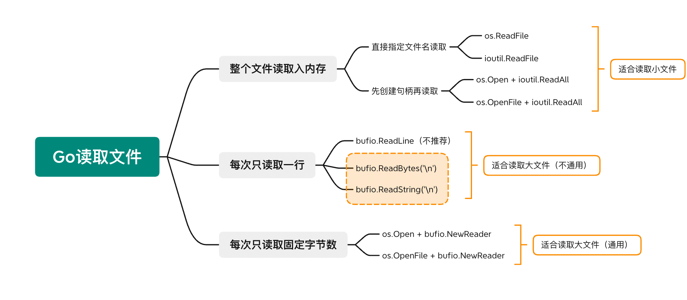

[PyQt5官方教程+帮助文档+模块功能汇总 - 炜柒 - 博客园 (cnblogs.com)](https://www.cnblogs.com/seven-v13/p/12364922.html)

http://t.csdn.cn/Idc9V


https://www.liyongfei.com/go-project-publish-to-github/  在github使用go项目

https://geektutu.com/post/quick-go-mmap.html   go mmap

# 第 1 章 开篇综述

**虚拟机IP地址消失**：

```bash
systemctl stop NetworkManager.service

systemctl disable NetworkManager.service

systemctl restart network
```

## 1.0 Linux下安装go开发环境


```shell
wget https://go.dev/dl/go1.18.linux-amd64.tar.gz
[root@hadoop100 go]# ls
go1.18.linux-amd64.tar.gz
[root@hadoop100 go]# pwd
/root/software/go

执行tar解压到/usr/loacl目录下（官方推荐），得到go文件夹等
[root@hadoop100 go]# tar -C /opt/module/ -zxvf go1.18.linux-amd64.tar.gz

添加/usr/loacl/go/bin目录到PATH变量中。添加到/etc/profile 或$HOME/.profile都可以
vim /etc/profile
# 在最后一行添加
export GOROOT=/opt/module/go
export PATH=$PATH:$GOROOT/bin
# 保存退出后source一下
source /etc/profile
[root@hadoop100 go]# vim /etc/profile
[root@hadoop100 go]# source /etc/profile

验证安装
[root@hadoop100 go]# go version
go version go1.18 linux/amd64
```


**运行第一个程序**：

1. 先创建你的工作空间([Workspaces](https://www.jianshu.com/p/[workspace](https://golang.org/doc/code.html#Workspaces)))，官方建议目录`$HOME/go`。

   ```shell
   mkdir $HOME/go
   ```

2. 将你的工作空间路径声明到环境变量中。

   ```shell
   # 编辑 ~/.bash_profile 文件
   vim ~/.bash_profile
   # 在最后一行添加下面这句。$HOME/go 为你工作空间的路径，你也可以换成你喜欢的路径
   export GOPATH=$HOME/go
   # 保存退出后source一下（vim 的使用方法可以自己搜索一下）
   source ~/.bash_profile
   
   [root@hadoop100 pkg]# echo $GOPATH
   /root/go
   [root@hadoop100 pkg]# echo $PATH
   /usr/local/sbin:/usr/local/bin:/usr/sbin:/usr/bin:/root/bin:/opt/module/go/bin:/root/bin
   ```
   
3. 在你的工作空间创建你的第一个工程目录

   ```shell
   # 创建并进入你的第一个工程目录
   mkdir -p $GOPATH/src/hello && cd $GOPATH/src/hello
   ```

4. 在你的工程目录下创建名为`hello.go`的文件

   ```shell
   vim hello.go
   ```

5. 将下面内容粘贴到 hello.go 文件

   ```shell
   package main
   
   import "fmt"
   
   func main() {
       fmt.Printf("hello, world\n")
   }
   ```

6. 好了，工程目录和工程文件都准备好了。现在我们到我们的工程目录(`$GOPATH/src/hello`)下构建我们的工程

   ```shell
   # 如果你当前的目录不在 $GOPATH/src/hello， 需要先执行 "cd $GOPATH/src/hello" 进入该目录
   # 执行构建工程的命令
   go build
   ```

7. 等一会，命令执行完之后你可以看到目录下会多出一个 hello 的文件，这就是我们编译之后的文件啦。怎么执行我们的程序呢？只需要在当前目录下执行`./xxx`就可以啦！是不是敲鸡煎蛋呢！

   ```shell
   [root@hadoop100 hello]# vim hello.go
   [root@hadoop100 hello]# go build
   go: go.mod file not found in current directory or any parent directory; see 'go help modules'
   [root@hadoop100 hello]# touch go.mod
   [root@hadoop100 hello]# go build
   [root@hadoop100 hello]# ls
   go.mod  hello  hello.go
   [root@hadoop100 hello]# ./hello 
   hello, world
   
   go.mod文件内容：
   module hero
   
   go 1.18
   ```

关于Go的一些介绍


环境变量：

- $GOROOT:
   **表示Go的安装目录。也就是上面我们解压出来的文件夹里面的`go`文件夹**。
- $GOPATH:
   **表示我们的工作空间。用来存放我们的工程目录的地方**。

GOPATH目录：

一般来说GOPATH下面会有三个文件夹：`bin`、`pkg`、`src`，没有的话自己创建。每个文件夹都有其的作用。

- bin：编译后可的执行文件的存放路径
- pkg：编译包时，生成的.a文件的存放路径
- src：源码路径，一般我们的工程就创建在`src`下面。

注意：如果要用`Go Mod`(Go1.11及以上支持)进行包管理，则需要在 GOPATH 以外的目录创建工程。关于`Go Mod`的使用，可以自行Google一下，这里就不赘述了。


作者：Mr_Leung
链接：https://www.jianshu.com/p/c43ebab25484
来源：简书
著作权归作者所有。商业转载请联系作者获得授权，非商业转载请注明出处。

## 1.1 语言介绍
Go 语言由谷歌(Google)公司于 2009 年正式对外发布，设计 Go 语言的初衷都是为了满足 Google 公司的需求。主要目标是“**兼具 Python 等动态语言的开发速度**和 **C/C++等编译型语言的性能与安全性**”，旨在不损失应用程序性能的情况下降低代码的复杂性，具有“部署简单、并发性好、执行性能好”等优势。最主要还是为了并发而生，并发是基于goroutine的，goroutine类似于线程，但并非线程，可以将goroutine理解为一种轻量级线程。**Go 语言运行时会参与调度goroutine，并将goroutine合理地分配到每个 CPU 中，最大限度地使用 CPU 性能**。

### 1.2 作者介绍

从左到右分别是 ：

- **罗伯特·格瑞史莫(Robert Griesemer)：** 曾为谷歌的 V8 JavaScript 引擎和 Chubby 开发代码
- **罗勃·派克(Rob Pike)：** 罗布·派克是 Unix 的先驱，是贝尔实验室最早和 Ken Thompson 以及 Dennis M. Ritche 开发 Unix 的猛人，UTF-8 的设计人。还是 1980 年奥运会射箭的银牌得主。
- **汤普逊(Ken Thompson)：** Ken Thompson 图灵奖得主，C 语言前身 B 语言的作者，Unix 的发明人之一， 操作系统 Plan 9 的主要作者。 共同开发了 UTF-8。

## 1.3 Go 语言特点

Go 语言，作为编程语言的后生，站在巨人的肩膀上，吸收了其他一些编程语言的特点。下面简单解释一下：

1. 拥有编译器很方便

   自带**编译器可以检测出你犯的所有低级错误**，如：变量名拼错，不要小看这种问题，没有编译器情况下，很可能浪费掉很长时间去排查，并且非常不容易发现，而且`Go语言`也是跨平台编译的，你可以在 Mac 电脑上，编译出`linux`或者`windows`的目标程序。

2. 开发速度

   Go 是一个非常简单的语言，上手容易，无论你是小白还是老鸟，都会比其他语言 C/C++ 和 Java 等语言要容易很多，这点在做项目中体现得尤其明显。很多人可能会说那 python 呢，php 呢？从语言上说 python 和 php 他们没有编译检查，同样也会像上面说的出一些小的低级错误，或者运行时错误，这都给 php 和 python 带来了隐患，所以 Go 语言虽然牺牲了一点点代码书写的时间，但是从项目运行安全角度来说，已经非常值得了。

3. 天生高并发

   **Go 语言就是为高并发而生的**。当你需要使用并发场景，如果你有其他语言基础，第一反应是用到锁，但是 **Go 语言提供了更加方便的方式协程+通道**，**在 Go 语言中代码不用修改就能直接多协程运行，只要在调用的时候加入 go 关键字，就可以了，非常方便**。这与其他语言截然不同，你要考虑哪里开辟新的线程，哪里是代码执行逻辑。

4. 部署简单

   **Go 语言最终执行就是一个二进制文件，包括了它所依赖的程序包**，这让开发者不用考虑部署环境的问题，例如，如果你是 java 程序，要考虑执行你的程序，对方机器是否安装了 java 的运行环境，其他语言同理，如果对方机器没有安装，无法运行你的程序，Go 语言可以在 Mac 和 Linux 上交叉编译你的代码，将其拷贝到远程服务器上，然后就可以任其运行了。

## 1.4 Go 语言能做什么

Go 的优点：实现快 + 资源占用低 + 任意环境随便跑，综合考虑在很多场景十分好用 。

1. Go 适合造轮子，哪个库不好用就自己造。
2. Go 适合写工具，比如 hugo 、hub，还有国人写的 linux 下的百度 pan client 都是 go 实现的。
3. Go 适合实现 C/C++ 一部分业务，Java 的大部分业务。
4. Go 适合做最外层的胶水，通过 RPC/REST/CGO 粘合不同语言的模块，而在这个胶水层还可以实现各种业务逻辑，又不用像 shell/python/node 有诸多顾虑和局限。
5. Go 提供了协程、指针、 unsafe， cgo 加上 C/C++ 兼容的内存布局和跨平台的汇编，有了这些你能做很多事情了。

> 所以问题不是它适合做什么，是你有能力用它做什么。

# 第 2 章 开发环境搭建

> “工欲善其事，必先利其器”，做好一件事，准备工作非常重要。在开始学习 Go 技术之前，先介绍如何搭建 Go 开发环境是非常重要的一件事。

## 2.1 安装和配置 SDK

本文基于`go version go1.18`

### 2.1.1 下载

Go 源码包官网下载地址为：https://golang.org/dl/（因为你知道的原因，可能无法访问）

Go 官方镜像站(推荐)：https://golang.google.cn/dl/

Go 语言支持以下系统，根据自己的系统，自行选择安装即可：

- Linux
- FreeBSD
- Mac OS X（也称为 Darwin）
- Windows

| 操作系统 | 包名                        |
| -------- | --------------------------- |
| Windows  | go1.18.windows-amd64.msi    |
| Linux    | go1.18.linux-amd64.tar.gz   |
| Mac      | go1.18.darwin-amd64.pkg     |
| FreeBSD  | go1.18.freebsd-amd64.tar.gz |

### 2.1.2 Win & Mac

对于 Windows 平台和 Mac 平台，只要下载对应的安装包，然后双击，一路 next 点击，就可以安装完成

在 win 中用 cmd,执行下面的命令，查看是否是你安装的版本

```go
PS C:\> go version
go version go1.18 windows/amd64
```

在 mac 中 Terminal 中执行

```
PLAINTEXT
go version
go version go1.18 darwin/arm64
```

如果你在 mac 平台上，也可以使用 brew install go，这样的方式安装，只要这么一条命令就可以搞定。

### 2.1.3 Linux

1. 删除 /usr/local/go 目录，根据官方说法，如果之前有安装过 go，那么需要将该位置的 go 目录删除掉

   ```shell
   $ rm -rf /usr/local/go
   ```

2. 解压并安装

   ```shell
   # 下载安装包
   $ wget https://golang.google.cn/dl/go1.18.linux-amd64.tar.gz
   # 解压 golang 到 /usr/local 下
   $ sudo tar xzvf go1.18.linux-amd64.tar.gz -C /usr/local
   ```

3. 设置环境变量

   ```shell
   # 修改 $HOME/.profile 或 /etc/profile 文件
   # 这里可能会出现权限不足(ubuntu需要加sudo, centos需要切换成root权限)
   $ sudo vim /etc/profile
   # 在该文件最后一行插入(进入后，按 i键进入编辑模式)
   $ export PATH=$PATH:/usr/local/go/bin
   # 按 esc 退出编辑模式, 按 :wq 保存文件
   $ go version
   ```

# 2.2 IDE 安装

### 2.2.1 Goland 下载安装

- 进去官网 GoLand 官网界面，点击 Download 按钮
  - 下载地址：https://www.jetbrains.com/go/

# 第 3 章 第一个 Go 程序

## 3.1 Hello Go

> 在控制台输出“Hello Go!”非常简单，仅需要几行代码就可以搞定，如下所示：

```
GO
package main   // 声明 main 包

import "fmt"   // 导入 fmt 包，打印字符串时需要用到

func main(){   // 声明 main 主函数
    fmt.Println("Hello, Go!")  // 打印 Hello Go!
}
```

大家也许不明白这些代码的含义，没关系，下面就来依次介绍。

### 3.1.1 注释

**作用：**在代码中加一些说明和解释，方便自己或其他程序员程序员阅读代码，能够大大增强程序的可读性。

**两种格式**：

- 单行注释：通常放在一行代码的上方，或者一条语句的末尾，==对该行代码说明==

  ```
  GOLANG
  fmt.Println("Hello, Go!") // 右边的所有东西当做说明，而不是真正要执行的程序，起辅助说明作用
  ```

- 多行注释：通常放在一段代码的上方，==对该段代码做整体说明==

  ```
  GOLANG
  func main() {
  	/*
  		以下两行代码都是将信息打印在屏幕上
  	 */
  	fmt.Println("以下是我的微信公众号:")
  	fmt.Printf("《面向加薪学习》")
  }
  ```

- 特别说明：

  - 编译器在编译代码时，会忽略注释的内容。如果你写的代码不想让计算机执行，那么也可以加上注释。加了注释后代码不会被编译执行，这就是对已有的代码进行注销。
  - 以后写程序要多加注释，这是我们程序猿的专业和职业道德，不加注释就是流氓。

### 3.1.2 package(创建包)

Go 语言以“包”作为管理单位，每个 Go 源文件必须先声明它所属的包，所以我们会看到每个 Go 源文件的开头都是一个 package 声明，格式如下：

```go
package name    // 其中 package 是声明包名的关键字, name 为包的名字。
```

Go 语言的包与文件夹是一一对应的，它具有以下几点特性：

- **一个目录下的同级文件属于同一个包**。
- **包名可以与其目录名不同**。
- main 包是 Go 语言程序的入口包，一个 Go 语言程序必须**有且仅有一个** main 包。**==如果一个程序没有 main 包，那么编译时将会出错，无法生成可执行文件==**。

### 3.1.3 import(导入包）

在包声明之后，是 import 语句，用于导入程序中所依赖的包，导入的包名使用双引号`""`包围，格式如下：

```go
import "name"   // 其中 import 是导入包的关键字，name 为所导入包的名字。
```

代码第 4 行导入了 fmt 包，这行代码会告诉 Go 编译器，我们需要用到 fmt 包中的函数或者变量等，fmt 包是 Go 语言标准库为我们提供的，用于格式化输入输出的内容，**类似的还有 os 包、io 包等**。

另外有一点需要注意，导入的包中不能含有代码中没有使用到的包，否则 Go 编译器会报编译错误，例如` imported and not used: "xxx"`，”xxx” 表示包名。

也可以使用一个 import 关键字导入多个包，此时需要用括号`( )`将包的名字包围起来，并且每个包名占用一行，也就是写成下面的样子：

```go
import(
    "name1"
    "name2"
)
```

### 3.1.4 main 函数

第 5 行代码创建了一个 main 函数，它是 Go 语言程序的入口函数，也即程序启动后运行的第一个函数。**main 函数只能声明在 main 包中，不能声明在其他包中，并且，一个 main 包中也必须有且仅有一个 main 函数。**

main 函数是自定义函数的一种，在 Go 语言中，所有函数都以关键字 func 开头的，定义格式如下所示：

```go
GO
func 函数名 (参数列表) (返回值列表){
    函数体
}
```

注意：**==Go 语言函数的左大括号{必须和函数名称在同一行，否则会报错==**。

### 3.1.5 打印输出

代码的第 6 行`fmt.Println("Hello Go!")`中，Println 是 fmt 包中的一个函数，它用来格式化输出数据，比如字符串、整数、小数等。这里我们使用 Println 函数来打印字符串。注意，Println 函数打印完成后会自动换行，ln 是 line 的缩写。另外，代码`fmt.Println("Hello Go!")`的结尾，不需要使用`;`来作为结束符，Go 编译器会自动帮我们添加，当然，在这里加上`;`也是可以的。

# 第 4 章 变量与常量

## 4.1 变量

**作用：**给一段指定的内存空间起名，方便操作这段内存。

**声明变量的一般形式是使用 var 关键字**。

- 方法一：声明一个变量, 默认的值是 0

  ```go
  package main
  
  import "fmt"
  
  func main(){
      // 方法一：声明一个变量, 默认的值是0
      var a int
      fmt.Println("a = ", a)
      fmt.Printf("a的类型是: %T\n", a)  //Type
  }
  ```

- 方法二：声明一个变量, 并初始化一个值

  ```go
  package main
  
  import "fmt"
  
  func main(){
      // 方法二：声明一个变量, 初始化一个值
      var b int = 100
      fmt.Printf("b = %d, type of b = %T\n", b, b)
  
      var bb string = "从0到Go语言微服务架构师"
      fmt.Printf("bb = %s, bb的类型是: %T\n", bb, bb)
  }
  ```

- 方法三：在初始化的时候，可以省去数据类型，通过值去自动匹配当前变量的数据类型

  ```go
  package main
  
  import "fmt"
  
  func main(){
  
      // 方法三：在初始化的时候，可以省去数据类型，通过值去自动匹配当前变量的数据类型
      var c = 100
      fmt.Printf("c = %d, type of c = %T\n", c, c)
  
      var cc = "Go语言微服务架构师核心22讲"
      fmt.Printf("cc = %s, cc的类型是: %T\n", cc, cc)
  }
  ```

- **==短声明，只能在函数内。(自动推导类型)==**

  ```go
  package main
  
  import "fmt"
  
  func main(){
  
      // 方法四：(常用的方法) 省去var关键字，使用:=，既推导数据类型又赋值
      // 注: 短声明是在函数或方法内部使用, 不支持全局变量声明！！！！
      e := 100
      fmt.Printf("e = %d, e的类型是: %T\n", e, e)
  
      f := "Go语言极简一本通"
      fmt.Printf("f = %s, f的类型是: %T\n", f, f)
  }
  ```

- 多变量声明

  ```go
  package main
  
  import "fmt"
  
  func main(){
  	// 声明多个变量
      var xx, yy int = 100, 200
      var kk, wx = 300, "write_code_666(欢喜哥)"
      
      // 声明多个变量
      var (
          nn int = 100
          mm bool = true
      )
  }
  ```

## 4.2 常量

常量（constant）表示固定的值。在计算机程序运行时，不会被程序修改的。

- 定义一个常量，使用 const 关键字。**常量定义的时候就要赋值**。

  ```go
  package main
  
  import "fmt"
  
  func main(){
      // 常量(只读属性)
      const length int = 10
      // length = 100  // 常量是不允许被修改的
      fmt.Println("length = ", length)
  }
  ```

- **==使用 const 来定义枚举类型==**

  ```go
  package main
  
  import "fmt"
  
  // const来定义枚举类型
  const (
      BEIJING = 0
      SHANGHAI = 1
      SHENZHEN = 2
  )
  
  func main() {
      fmt.Println("BEIJING = ", BEIJING)      // 0
      fmt.Println("SHANGHAI = ", SHANGHAI)    // 1
      fmt.Println("SHENZHEN = ", SHENZHEN)    // 2
  }
  ```

- iota

  **==iota 是 Go 语言的常量计数器,只能在常量的表达式中使用==**。
  iota 在 const 关键字出现时将被重置为 0(const 内部的第一行之前)，const 中每新增一行常量声明将使 iota 计数一次(iota 可理解为 const 语句块中的行索引)。使用 iota 能简化定义，在定义枚举时很有用

  ```go
  package main
  
  import "fmt"
  
  // const来定义枚举类型
  const (
      // 可以在const()中添加一个关键字iota, 每行的iota都会累加1, 第一行的iota默认是0
      BEIJING = 10 * iota   // iota = 0
      SHANGHAI			  // iota = 1
      SHENZHEN			  // iota = 2
  )
  
  func main() {
      fmt.Println("BEIJING = ", BEIJING)      // 0
      fmt.Println("SHANGHAI = ", SHANGHAI)    // 10
      fmt.Println("SHENZHEN = ", SHENZHEN)    // 20
  }
  ```

## 4.3 关键字

关键字是 Go 语言中预先保留的单词，在程序中有特殊含义，不能用来定义变量或常量。

Go 语言中有 25 个关键字：

|          |             |        |           |        |
| -------- | ----------- | ------ | --------- | ------ |
| break    | default     | func   | interface | select |
| case     | defer       | go     | map       | struct |
| chan     | else        | goto   | package   | switch |
| const    | fallthrough | if     | range     | type   |
| continue | for         | import | return    | var    |

# 第 5 章 基础数据类型

在静态类型语言(C++/Java/Golang 等)中规定在创建一个变量或者常量时，必须要指定出相应的数据类型，否则无法给变量分配内存。

## 5.1 整形

整型分两大类

- 有符号整型：int8、int16、int32、int64、int。
- 无符号整型：uint8、uint16、uint32、uint64、uint。

| 类型    | 取值范围                                                     |
| ------- | ------------------------------------------------------------ |
| int8    | [-128 , 127]                                                 |
| int16   | [-32768 , 32767]                                             |
| int32   | [-2147483648 , 2147483647] **Go语言中没有字符类型,所有字符都使用int32存储?** |
| int64   | [-9223372036854775808 , 9223372036854775807]                 |
| int     | 受限于计算机系统,系统是多少位,int为多少位                    |
| uint8   | [0 , 255]                                                    |
| uint16  | [0 , 65535]                                                  |
| uint32  | [0 , 4294967295]                                             |
| uint64  | [0 , 18446744073709551615]                                   |
| uint    | 受限于计算机系统,系统是多少位,uint为多少位                   |
| rune    | 与int32类似,常用在获取值的Unicode码                          |
| byte    | **==与uint8类似.强调值为原始数据.一个字节占用8个二进制==**   |
| uintptr | 大小不确定,类型取决于底层编程                                |

示例程序：

```go
package main

import (
	"fmt"
	"math"
	"unsafe"
)

// 有符号整型
func Integer() {
	var num8 int8 = 127
	var num16 int16 = 32767
	var num32 int32 = math.MaxInt32
	var num64 int64 = math.MaxInt64
	var num int = math.MaxInt
	fmt.Printf("num8的类型是 %T, num8的大小 %d, num8是 %d\n",
		num8, unsafe.Sizeof(num8), num8)
	fmt.Printf("num16的类型是 %T, num16的大小 %d, num16是 %d\n",
		num16, unsafe.Sizeof(num16), num16)
	fmt.Printf("num32的类型是 %T, num32的大小 %d, num32是 %d\n",
		num32, unsafe.Sizeof(num32), num32)
	fmt.Printf("num64的类型是 %T, num64的大小 %d, num64是 %d\n",
		num64, unsafe.Sizeof(num64), num64)
	fmt.Printf("num的类型是 %T, num的大小 %d, num是 %d\n",
		num, unsafe.Sizeof(num), num)
}

// 无符号整型
func unsignedInteger() {
	var num8 uint8 = 128
	var num16 uint16 = 32768
	var num32 uint32 = math.MaxUint32
	var num64 uint64 = math.MaxUint64
	var num uint = math.MaxUint
	fmt.Printf("num8的类型是 %T, num8的大小 %d, num8是 %d\n",
		num8, unsafe.Sizeof(num8), num8)
	fmt.Printf("num16的类型是 %T, num16的大小 %d, num16是 %d\n",
		num16, unsafe.Sizeof(num16), num16)
	fmt.Printf("num32的类型是 %T, num32的大小 %d, num32是 %d\n",
		num32, unsafe.Sizeof(num32), num32)
	fmt.Printf("num64的类型是 %T, num64的大小 %d, num64是 %d\n",
		num64, unsafe.Sizeof(num64), num64)
	fmt.Printf("num的类型是 %T, num的大小 %d, num是 %d\n",
		num, unsafe.Sizeof(num), num)
}

func main() {
	Integer()
	println("---------------------------------------")
	unsignedInteger()
}
```

**Tips：**

- **除非对整型的大小有特定的需求，否则你通常应该使用 `int` 表示整型宽度**，在 `32` 位系统下是 `32` 位，而在 `64` 位系统下是 `64` 位。表示范围：在 `32` 位系统下是 `-2147483648` ~ `2147483647` ，而在 `64` 位系统是 `-9223372036854775808` ~ `9223372036854775807` 。
- 对于 `int8` ， `int16` 等这些类型后面有跟一个数值的类型来说，它们能表示的数值个数是固定的。所以，在有的时候：例如在二进制传输、读写文件的结构描述(**为了保持文件的结构不会受到不同编译目标平台字节长度的影响**)等情况下，使用更加精确的 `int32` 和 `int64` 是更好的。

## 5.2 浮点型

浮点型表示存储的数据是实数，如 3.145。关于浮点型的说明，如表所示。

| 类型    | 字节数 | 说明          |
| ------- | ------ | ------------- |
| float32 | 4      | 32 位的浮点型 |
| float64 | 8      | 64 位的浮点型 |

示例程序：

```go
func showFloat() {
	var num1 float32 = math.MaxFloat32
	var num2 float64 = math.MaxFloat64
	fmt.Printf("num1的类型是%T,num1是%g\n", num1, num1)
	fmt.Printf("num2的类型是%T,num1是%g\n", num2, num2)
}

func main() {
     showFloat()
}
```

**Tips：**

- 通过上面的程序，我们知道浮点数能表示的数值很大，但是浮点数的精度却没有那么大：
  - `float32` 的精度只能提供大约 `6` 个十进制数(表示小数点后 `6` 位)的精度。
  - `float64` 的精度能提供大约 `15` 个十进制数(表示小数点后 `15` 位)的精度。

## 5.3 字符

字符串中的每一个元素叫作“**字符**”，定义字符时使用单引号。Go 语言的字符有两种，如表所示。

| 类 型 | 字 节 数 | 说 明                                                        |
| ----- | -------- | ------------------------------------------------------------ |
| byte  | 1        | **==表示 UTF-8 字符串的单个字节的值，表示的是 ASCII 码表中的一个字符，uint8 的别名类型==** |
| rune  | 4        | 表示单个 unicode 字符，int32 的别名类型                      |

声明示例如下：

```go
package main

import (
	"fmt"
	"unsafe"
)

func showChar() {
     var x byte = 65
     var y uint8 = 65
     fmt.Printf("x = %c\n", x)   // x = A
     fmt.Printf("y = %c\n", y)   // y = A
}

func sizeOfChar() {
    var x byte = 65
    fmt.Printf("x = %c\n", x)
    fmt.Printf("x uses %d bytes\n", unsafe.Sizeof(x))

    var y rune = 'A'
    fmt.Printf("y = %c\n", y)
    fmt.Printf("y uses %d bytes\n", unsafe.Sizeof(y))
}

func main() {
    showChar();
    println()
    sizeOfChar();
}
```

运行结果：

```bash
[root@hero test]# ./test 
x = A
y = A

x = A
x uses 1 bytes
y = A
y uses 4 bytes
```

## 5.4 字符串

**==字符串在 Go 语言中是以基本数据类型出现的==**，使用字符串就像使用其他原生基本数据类型 int、float32、float64、bool 一样。

示例程序：

```go
var study string  	 		// 定义名为str的字符串类型变量
study = "《Go语言极简一本通》"		// 将变量赋值

study2 := "《从0到Go语言微服务架构师》"		// 以自动推断方式初始化
```

有些字符串没有现成的文字代号，所以只能用转义字符来表示。常用的转义字符如表所示。

| 转 义 字 符 | 含 义                                     |
| ----------- | ----------------------------------------- |
| `\r`        | 回车符 return，返回行首                   |
| `\n`        | 换行符 new line, 直接跳到下一行的同列位置 |
| `\t`        | 制表符 TAB                                |
| `\'`        | 单引号                                    |
| `\"`        | 双引号                                    |
| `\\`        | 反斜杠                                    |

定义多行字符串的方法如下。

- 双引号书写字符串被称为字符串字面量（string literal），这种字面量不能跨行。
- **==多行字符串需要使用反引号“`”，多用于内嵌源码和内嵌数据==**。
- **==在反引号中的所有代码不会被编译器识别，而只是作为字符串的一部分==**。

多行字符串定义方式如例所示：

```go
package main
import "fmt"

func main() {
  var s1 string
	s1 = `
    		study := 'Go'
    		fmt.Println(study)
			`
	fmt.Println(s1)
}
```

运行结果：

```bash
[root@hero test]# ./test 

                study := 'Go'
                fmt.Println(study)
                
```

## 5.3 布尔类型

关于 **布尔(bool)** 类型，无非就是两个值：**true** 或者 **false** 。

示例程序：

```go
func showBool(){
	a := true
	b := false
	fmt.Println("a=", a)
	fmt.Println("b=", b)
	fmt.Println("true && false = ", a && b)
	fmt.Println("true || false = ", a || b)
}

func main() {
    showBool()
}
```

运行结果：

```bash
[root@hero test]# ./test 
a= true
b= false
true && false =  false
true || false =  true
```

**Tip：**

- 如果你学过其他编程语言或许会发现，布尔型可以参与数值运算，也可以与其他类型进行转换。==但是在 Go 中，真值是用 `true` 表示，并且 **不与** `1` 相等；同样的，假值是用 `false` 表示，并且 **不与** `0` 相等==。

## 5.4 复数型

复数型用于表示数学中的复数，如 1+2j、1-2j、-1-2j 等。在 Go 语言中提供了两种精度的复数类型：**complex64** 和 **complex128** ，分别对应 float32 和 float64 两种浮点数精度，如表所示。

```go
类 型	字 节 数	说 明
complex64	8	64 位的复数型，由 float32 类型的实部和虚部联合表示
complex128	16	128 位的复数型，由 float64 类型的实部和虚部联合表示
```

示例程序：

```go
func showComplex() {
	// 内置的 complex 函数用于构建复数
	var x complex64 = complex(1, 2)
	var y complex128 = complex(3, 4)
	var z complex128 = complex(5, 6)
	fmt.Println("x = ", x)
	fmt.Println("y = ", y)
	fmt.Println("z = ", z)

	// 内建的 real 和 imag 函数分别返回复数的实部和虚部
	fmt.Println("real(x) = ", real(x))
	fmt.Println("imag(x) = ", imag(x))
	fmt.Println("y * z = ", y*z)
}

func main() {
   showComplex()
}
```

Tip：

- 当然，我们可以对声明进行简化，使用自然的方式书写复数：

  ```go
  x := 1 + 2i
  y := 3 + 4i
  z := 5 + 6i
  ```

## 5.5 fmt **格式输出**

使用函数：`fmt.Printf`

| **格式** | **含义**                                                     |
| -------- | ------------------------------------------------------------ |
| %%       | 一个%字面量                                                  |
| %b       | 一个二进制整数值(基数为 2)，或者是一个(高级的)用科学计数法表示的指数为 2 的浮点数 |
| **%c**   | 字符型。可以把输入的数字按照 ASCII 码相应转换为对应的字符    |
| **%d**   | 一个十进制数值(基数为 10)                                    |
| **%f**   | 以标准记数法表示的浮点数或者复数值                           |
| %o       | 一个以八进制表示的数字(基数为 8)                             |
| %p       | 以十六进制(基数为 16)表示的一个值的地址，前缀为 0x,字母使用小写的 a-f 表示 |
| %q       | 使用 Go 语法以及必须时使用转义，以双引号括起来的字符串或者字节切片[]byte，或者是以单引号括起来的数字 |
| **%s**   | 字符串。输出字符串中的字符直至字符串中的空字符（字符串以’\0‘结尾，这个’\0’即空字符） |
| **%t**   | 以 true 或者 false 输出的布尔值                              |
| **%T**   | 使用 Go 语法输出的值的类型                                   |
| %x       | 以十六进制表示的整型值(基数为十六)，数字 a-f 使用小写表示    |
| %X       | 以十六进制表示的整型值(基数为十六)，数字 A-F 使用小写表示    |

# 第 6 章 容器类型

## 6.1 数组

**数组** 是一个由 **固定长度** 的特定类型元素组成的序列，一个数组可以由零个或多个元素组成。**因为数组的长度是固定的，因此在 Go 语言中很少直接使用数组**。和数组对应的类型是 **slice(切片)** ，**==它是可以动态的增长和收缩的序列==**， `slice` 功能也更灵活，下面我们再讨论 `slice` 。

### 6.1.1 数组声明

可以使用 `[n]Type` 来声明一个数组。其中 `n` 表示数组中元素的数量， `Type` 表示每个元素的类型。

```go
package main

import "fmt"

func test01() {
	// 声明时没有指定数组元素的值, 默认为零值
	var arr [5]int
	fmt.Println(arr)

	arr[0] = 1
	arr[1] = 2
	arr[2] = 3
	fmt.Println(arr)
}

func test02() {
	// 直接在声明时对数组进行初始化
	var arr1 = [5]int{15, 20, 25, 30, 35}
	fmt.Println(arr1)

	// 使用短声明
	arr2 := [5]int{15, 20, 25, 30, 35}
	fmt.Println(arr2)

	// 部分初始化, 未初始化的为零值
	arr3 := [5]int{15, 20} // [15 20 0 0 0]
	fmt.Println(arr3)

	// 可以通过指定索引，方便地对数组某几个元素赋值
	arr4 := [5]int{1: 100, 4: 200}
	fmt.Println(arr4) // [0 100 0 0 200]

	// 直接使用 ... 让编译器为我们计算该数组的长度
	arr5 := [...]int{15, 20, 25, 30, 35, 40}
	fmt.Println(arr5)
}

func test03() {
	// 特别注意数组的长度是类型的一部分，所以 [3]int 和 [5]int 是不同的类型
	arr1 := [3]int{15, 20, 25}
	arr2 := [5]int{15, 20, 25, 30, 35}
	fmt.Printf("type of arr1 is %T\n", arr1)
	fmt.Printf("type of arr2 is %T\n", arr2)
}

func test04() {
	// 定义多维数组
	arr := [3][2]string{
		{"1", "Go语言极简一本通"},
		{"2", "Go语言微服务架构核心22讲"},
		{"3", "从0到Go语言微服务架构师"}}
	fmt.Println(arr) 
}

func main() {
	test01()
	test02()
	test03()
	test04()
}
```

运行结果：

```go
[0 0 0 0 0]
[1 2 3 0 0]
[15 20 25 30 35]
[15 20 25 30 35]
[15 20 0 0 0]
[0 100 0 0 200]
[15 20 25 30 35 40]
type of arr1 is [3]int
type of arr2 is [5]int
[[1 Go语言极简一本通] [2 Go语言微服务架构核心22讲] [3 从0到Go语言微服务架构师]]
```

### 6.1.2 数组长度

使用内置的 `len` 函数将返回数组中元素的个数，即数组的长度。

```go
func arrLength() {
	arr := [...]string{"Go语言极简一本通", "Go语言微服务架构核心22讲", "从0到Go语言微服务架构师"}
	fmt.Println("数组的长度是:", len(arr)) //数组的长度是: 3
}
```

### 6.1.3 数组遍历

使用 `for range` 循环可以获取数组每个索引以及索引上对应的元素。

```GO
func showArr() {
	arr := [...]string{"Go语言极简一本通", "Go语言微服务架构核心22讲", "从0到Go语言微服务架构师"}
	for index, value := range arr {  // 对于map就是key，value
		fmt.Printf("arr[%d]=%s\n", index, value)
	}
    //可以使用下划线_，表示不使用变量
    //否则go语言的变量，声明了不使用的话会报错的
	for _, value := range arr {
		fmt.Printf("value=%s\n", value)
	}
}
```

### 6.1.4 **数组是值类型**

**==Go 中的数组是值类型而不是引用类型==**。当数组赋值给一个新的变量时，该变量会得到一个原始数组的一个副本。如果对新变量进行更改，不会影响原始数组。

```go
func arrByValue() {
	arr := [...]string{"Go语言极简一本通", "Go语言微服务架构核心22讲", "从0到Go语言微服务架构师"}
	copy := arr
	copy[0] = "Golang"
	fmt.Println(arr)
	fmt.Println(copy)
}
```

## 6.2 切片(Slice)

**==切片是对数组的一个连续片段的引用，所以切片是一个引用类型==**。切片 本身不拥有任何数据，它们只是对现有数组的引用，每个切片值都会将数组作为其底层的数据结构。slice 的语法和数组很像，只是没有固定长度而已。

### 6.2.1 创建切片

使用 `[]Type` 可以创建一个带有 `Type` 类型元素的切片。

>切片：[]Type           数组：[n]Type。 **==数组是确定有n的，或者至少有...==**。

```go
//切片：[]Type 数组：[n]Type
// 声明整型切片(这是一个空切片)(与数组一样，只是切片没有N)
var numList []int

// 声明一个空切片
var numListEmpty = []int{} (与数组一样，只是切片没有N)

fmt.Println(numList)
fmt.Println(numListEmpty)
运行结果：
[]
[]
```

你也可以使用 `make` 函数构造一个切片，格式为 `make([]Type, size, cap)` 。

```go
numList := make([]int, 3, 5)
var buf []byte= make([]byte, 102)
var buf = make([]byte, 102)  // 可以省略[]byte
```

当然，我们可以通过对数组进行片段截取创建一个切片。

```go
arr := [5]string{"1", "2", "3", "4", "5"}
var s1 = arr[1:4]  //前闭后开
```

### 6.2.2 切片的长度和容量

一个 slice 由三个部分构成：**指针** 、 **长度** 和 **容量** 。指针指向第一个 slice 元素对应的底层数组元素的地址，**要注意的是 slice 的第一个元素并不一定就是数组的第一个元素**。长度对应 slice 中元素的数目；长度不能超过容量，**==容量一般是从 slice 的开始位置到底层数据的结尾位置==**。简单的讲，容量就是从创建切片索引开始的底层数组中的元素个数，而长度是切片中的元素个数。

内置的 `len` 和 `cap` 函数分别返回 slice 的长度和容量。

```s
s := make([]string, 3, 5)
fmt.Println(len(s)) // 3
fmt.Println(cap(s)) // 5
```

如果切片操作超出上限将导致一个 `panic` 异常。

```go
s := make([]int, 3, 5)
fmt.Println(s[10]) //panic: runtime error: index out of range [10] with length 3
```

Tips:

- **==由于 slice 是引用类型，所以你不对它进行赋值的话，它的默认值是==** `nil`

- 此时我们判断if numList == nil为真，那么我们应该返回而不是继续执行函数。

- 如果是针对返回的错误进行判断，那么if err!=nil为真，那就是错误了。

  ```go
  var numList []int
  fmt.Println(numList == nil) // true
  fmt.Println(len(numList) == 0) // true
  ```

- 切片之间不能比较，因此我们不能使用 `==` 操作符来判断两个 slice 是否含有全部相等元素。**特别注意，如果你需要测试一个 slice 是否是空的**，使用 `len(s) == 0` 来判断，而不应该用 `s == nil` 来判断。why?

### 6.2.3 ==切片元素的修改==

**==切片自己不拥有任何数据。它只是底层数组的一种表示。<u>对切片所做的任何修改都会反映在底层数组中</u>==**。

```go
func modifySlice() {
	var arr = [...]string{"Go语言极简一本通", "Go语言微服务架构核心22讲", "从0到Go语言微服务架构师"}
	s := arr[:] //[0:len(arr)]  //切整个数组，也是是一个指针指向这整个数组
	fmt.Println(arr) //[Go语言极简一本通 Go语言微服务架构核心22讲 从0到Go语言微服务架构师]
	fmt.Println(s) //[Go语言极简一本通 Go语言微服务架构核心22讲 从0到Go语言微服务架构师]

	s[0] = "Go语言"
	fmt.Println(arr) //[Go语言 Go语言微服务架构核心22讲 从0到Go语言微服务架构师]
	fmt.Println(s) //[Go语言 Go语言微服务架构核心22讲 从0到Go语言微服务架构师]
}
```

这里的 `arr[:]` **没有填入起始值和结束值**，默认就是 `0` 和 `len(arr)` 。

### 6.2.4 切片遍历

```go
var buf = make([]byte, 102)
_, err = f.ReadAt(buf, 1)  //读了sono
fmt.Println(string(buf))   //不转换就是数字形式
for _, v := range buf {
	fmt.Printf("value=%c\n", v)
}
```


### 6.2.4 追加切片元素

使用 `append` 可以将新元素追加到切片上。`append` 函数的定义是 `func append(slice []Type, elems ...Type) []Type` 。其中 `elems ...Type` 在函数定义中表示该函数接受参数 `elems` 的个数是可变的。这些类型的函数被称为可变函数。

```go
    func appendSliceData() {
	s := []string{"Go语言极简一本通"}
	fmt.Println(s)
	fmt.Println(cap(s))
	
    //追加一个元素
	s = append(s, "Go语言微服务架构核心22讲")
	fmt.Println(s)
	fmt.Println(cap(s))
	//追加两个元素
	s = append(s, "从0到Go语言微服务架构师", "分布式")
	fmt.Println(s)
	fmt.Println(cap(s))
	
    //追加一个切片，那个...表示将切片解序，然后追加到另一个切片上
	s = append(s, []string{"微服务", "分布式锁"}...)
	fmt.Println(s)
	fmt.Println(cap(s))
}
```

**==当新的元素被添加到切片时，如果容量不足，会创建一个新的数组。现有数组的元素被复制到这个新数组中，并返回新的引用。现在新切片的容量是旧切片的两倍==**。

### 6.2.5 多维切片

类似于数组，切片也可以有多个维度。

```go
func mSlice() {
	numList := [][]string{
		{"1", "Go语言极简一本通"},
		{"2", "Go语言微服务架构核心22讲"},
		{"3", "从0到Go语言微服务架构师"},
	}
	fmt.Println(numList)
}
```

## 6.3 Map

在 Go 语言中，map 是散列表(哈希表)的引用。它是一个拥有键值对元素的**无序集合**，**在这个集合中，键是唯一的，可以通过键来获取、更新或移除操作**。无论这个散列表有多大，这些操作基本上是通过常量时间完成的。所有可比较的类型，如 `整型` ，`字符串` 等，都可以作为 `key` 。

### 6.3.1 创建 Map

**使用 `make` 函数传入键和值的类型，可以创建 map** 。具体语法为 `make(map[KeyType]ValueType)` 。

```go
// 创建一个键类型为 string 值类型为 int 名为 scores 的 map
scores := make(map[string]int)
steps := make(map[string]string)
fmt.Println(scores)
fmt.Println(steps)
运行结果：
map[]
map[]
```

我们也可以用 map 字面值的语法创建 map ，同时还可以指定一些最初的 key/value ：

```go
package main

import "fmt"

func main() {
	var steps2  = map[string]string{  // or var steps2 map[string]string=
		"1": "2",
		"3": "4",
		"5": "6",
}
fmt.Println(steps2)
}
```

或者

```go
steps3 := map[string]string{
		"第一步": "Go语言极简一本通",
		"第二步": "Go语言微服务架构师核心22讲",
		"第三步": "从0到Go语言微服务架构师",
}
fmt.Println(steps3)
运行结果：
map[第一步:Go语言极简一本通 第三步:从0到Go语言微服务架构师 第二步:Go语言微服务架构师核心22讲]
```

**==注意打印出来是无序的==**。

### 6.3.2 Map 操作

- 添加元素

  ```go
  // 可以使用 `map[key] = value` 向 map 添加元素。
  steps3["第四步"] = "总监"
  ```
  
- **==更新元素==**

  ```go
  // 若 key 已存在，使用 map[key] = value 可以直接更新对应 key 的 value 值。
  steps3["第四步"] = "CTO"
  ```
  
- 获取元素

  ```go
  // 直接使用 map[key] 即可获取对应 key 的 value 值,如果 key不存在,会返回其 value 类型的零值。
  fmt.Println(steps3["第四步"] )
  ```
  
- 删除元素

  ```go
  //使用 delete(map, key)可以删除 map 中的对应 key 键值对,如果 key 不存在,delete 函数会静默处理，不会报错。
  delete(steps3, "第四步")
  ```
  
- **==判断 key 是否存在==**

  ```go
  // 如果我们想知道 map 中的某个 key 是否存在，可以使用下面的语法：value, ok := map[key]
  v3, ok := steps3["第三步"]
  fmt.Println(ok)
  fmt.Println(v3)
  
  v4, ok := steps3["第四步"]  
  fmt.Println(ok)   //不存在返回false
  fmt.Println(v4)   //不会有任何打印输出
  ```
  
  这个语句说明 `map` 的下标读取可以返回两个值，第一个值为当前 `key` 的 `value` 值，第二个值表示对应的 `key` 是否存在，若存在 `ok` 为 `true` ，若不存在，则 `ok` 为 `false` 。
  
- 遍历 map

  ```
  // 遍历 map 中所有的元素需要用 for range 循环。
  for key, value := range steps3 {
      fmt.Printf("key: %s, value: %d\n", key, value)
  }
  ```
  
- **==获取 map 长度==**

  ```
  // 使用 len 函数可以获取 map 长度
  func createMap() {
    	//...
       fmt.Println(len(steps3))    // 4
  }
  ```

### 6.3.3 map 是引用类型

当 `map` 被赋值为一个新变量的时候，它们指向同一个内部数据结构。因此，改变其中一个变量，就会影响到另一变量。

```go
func mapByReference() {
		steps4 := map[string]string{
		"第一步": "Go语言极简一本通",
		"第二步": "Go语言微服务架构师核心22讲",
		"第三步": "从0到Go语言微服务架构师",
	}
	fmt.Println("steps4: ", steps4)
	// steps4:  map[第一步:Go语言极简一本通 第三步:从0到Go语言微服务架构师 第二步:Go语言微服务架构师核心22讲]
	newSteps4 := steps4
	newSteps4["第一步"] = "Go语言极简一本通-222"
	newSteps4["第二步"] = "Go语言微服务架构师核心22讲-222"
	newSteps4["第三步"] = "从0到Go语言微服务架构师-222"
	fmt.Println("steps4: ", steps4)
  // steps4:  map[第一步:Go语言极简一本通-222 第三步:从0到Go语言微服务架构师-222 第二步:Go语言微服务架构师核心22讲-222]
	fmt.Println("newSteps4: ", newSteps4)
  // newSteps4:  map[第一步:Go语言极简一本通-222 第三步:从0到Go语言微服务架构师-222 第二步:Go语言微服务架构师核心22讲-222]
}
```

当 `map` 作为函数参数传递时也会发生同样的情况。

**==c++的map可不是引用类型==**。

# 第 7 章 指针

指针也是一种类型，也可以创建变量，称之为指针变量。指针变量的类型为 `*Type`，该指针指向一个 `Type` 类型的变量。指针变量最大的特点就是存储的某个实际变量的内存地址，通过记录某个变量的地址，从而间接的操作该变量。

## 7.1 创建指针

创建指针有三种方法。

- 首先定义普通变量，再通过获取该普通变量的地址创建指针：

  ```go
  // 定义普通变量 x
  x := "面向加薪学习"
  
  // 取普通变量 x 的地址创建指针 p
  ptr := &x   //指针的短声明
  ```

- 先创建指针并分配好内存，再给指针指向的内存地址写入对应的值：

  ```go
  // 创建指针
  ptr2 := new(string)
  
  // 给指针指向的内存地址写入对应的值
  *ptr2 = "从0到Go语言微服务架构师"
  fmt.Println(ptr2)
  fmt.Println(*ptr2)
  ```

- 首先声明一个指针变量，再从其他变量获取内存地址给指针变量：

  ```go
  // 定义变量 x2
  x2 := "Go语言微服务架构师核心22讲"
  // 声明指针变量
  var p *string
  // 指针初始化
  p = &x2
  fmt.Println(p)
  ```

**Tip：**

上面举的创建指针的三种方法对学过 C 语言的人来说可能很简单，但没学过指针相关知识的人可能不太明白，特别是上面代码中出现的指针操作符 `&` 和 `*` 。

- `&` 操作符可以从一个变量中取到其内存地址。
- `*` 操作符如果在赋值操作值的左边，指该指针指向的变量；`*` 操作符如果在赋值操作符的右边，指从一个指针变量中取得变量值，又称指针的解引用。

通过下面的例子，你应该就会比较清楚的理解上面两个指针操作符了。

```go
package main

import "fmt"

func main() {
	x := "面向加薪学习"
	ptr := &x
	fmt.Println("x = ", x)   // x =  面向加薪学习
	fmt.Println("*ptr = ", *ptr) // *p =  面向加薪学习
	fmt.Println("&x = ", &x) // &x =  0x14000010290
	fmt.Println("ptr = ", ptr)   // p =  0x14000010290
}
```

## 7.2 指针的类型

`*(指向变量值的数据类型)` 就是对应的指针类型。

```go
func pointerType() {
	mystr := "Go语言极简一本通"
	myint := 1
	mybool := false
	myfloat := 3.2
	fmt.Printf("type of &mystr is :%T\n", &mystr)
	fmt.Printf("type of &myint is :%T\n", &myint)
	fmt.Printf("type of &mybool is :%T\n", &mybool)
	fmt.Printf("type of &myfloat is :%T\n", &myfloat)
}

func main() {
	//...
	pointerType()
}
```

运行结果：

```go
type of &mystr is :*string
type of &myint is :*int
type of &mybool is :*bool
type of &myfloat is :*float64
```


## 7.3 指针的零值

**如果指针声明后没有进行初始化，其默认零值是** `nil`

```go
func zeroPointer() {
	x := "从0到Go语言微服务架构师"
	var ptr *string
	fmt.Println("ptr is ", ptr)
	ptr = &x
	fmt.Println("ptr is ", ptr)
}
func main() {
	//...
	zeroPointer()
}
```

运行结果：

```go
ptr is  <nil>
ptr is  0xc00004c250
```

## 7.4 函数传递指针参数

在函数中对指针参数所做的修改，在函数返回后会保存相应的修改。

```go
package main

import (
	"fmt"
)

func changeByPointer(value *int) {
	*value = 200
}

func main() {
	x3 := 99
	p3 := &x3
	fmt.Println("执行changeByPointer函数之前p3是", *p3)
	changeByPointer(p3)
	fmt.Println("执行changeByPointer函数之后p3是", *p3)
}
```

运行程序输出如下，函数传入的是指针参数，即内存地址，所以在函数内的修改是在内存地址上的修改，在函数执行后还会保留结果。

## 7.5 ==指针与切片==

切片与指针一样是引用类型，如果我们想通过一个函数改变一个数组的值，**==可以将该数组的切片当作参数传给函数==，也可以将这个数组的指针当作参数传给函数**。但 Go 中建议使用第一种方法，即将该数组的切片当作参数传给函数，因为这么写更加简洁易读。

```go
package main

import "fmt"

// 使用切片
func changeSlice(value []int) {
	value[0] = 200
}

// validEntries []*Entry  这种写法是c语言的指针数组
// value *[3]int          和这个(指向一维数组的)指针是不一样的 主要这不是数组指针
// 使用数组指针
func changeArray(value *[3]int) {  // 这个相当于c语言的int value[]。go语言维数必须对应吗？
	(*value)[0] = 200   //注意要解引用才是数组y
}

func main() {
	x := [3]int{10, 20, 30}
	changeSlice(x[:])  // 这是为整个数组创建切片，相当于一个指针value指向这个数组了
	fmt.Println(x) // [200 20 30]

	y := [3]int{100, 200, 300}
	changeArray(&y)  // 数组不是地址，数组也需要取地址
	fmt.Println(y) // [200 200 300]
}
```

## 7.6 Go 中不支持指针运算

学过 C 语言的人肯定知道在 C 中支持指针的运算，例如：`p++` ，但这在 Go 中是不支持的。

```go
package main

func main() {
	x := [...]int{20, 30, 40}
	p := &x
	p++ // error
}
```

# 第 8 章 结构体

**结构体(struct)** 是一种聚合的数据类型，是由**零个**或多个任意类型的值聚合成的实体。每个值称为结构体的成员。学过 C 或 C++ 的人都知道结构体，但在 Go 中，没有像 C++ 中的 `class` 类的概念，只有 `struct` 结构体的概念，所以也没有继承。

## 8.1 结构体的声明

在 Go 语言 中使用下面的语法是对结构体的声明。

```go
type struct_name struct {
    attribute_name1   attribute_type
    attribute_name2   attribute_type
    ...
}
```

例如下面是定义一个名为 `Lesson(课程)` 的结构体。

```go
type Lesson struct {
	name   string //名称
	target string //学习目标
	spend  int    //学习花费时间
}
```

上面的代码声明了一个结构体类型 `Lesson` ，它有 `name` 、 `target` 和 `spend` 三个属性。可**以把相同类型的属性声明在同一行，这样可以使结构体变得更加紧凑**，如下面的代码所示。

```go
type Lesson2 struct {
    name, target    string
    spend             int
}
```

上面的结构体 `Lesson` 称为 **命名的结构体(Named Structure)** 。我们创建了名为 `Lesson` 的新类型，而它可以用于创建 `Lesson` 类型的结构体变量。


声明结构体时也可以不用声明一个新类型，这样的结构体类型称为 **匿名结构体(Anonymous Structure)** 。

```go
lesson3 := struct {
		name, target string
		spend          int
	}{
		name:   "Go语言微服务架构核心22讲",
		target: "掌握GO语言微服务方法论，全方位了解每个组件的作用",
		spend:   3,
	}
```

上面的代码创建了一个匿名结构体 `lesson3` 。全程只有一个这样的结构体。

## 8.2 创建命名的结构体

```go
package main

import "fmt"

type Lesson struct {
	name, target    string
	spend             int
}

func main() {
	// 使用字段名创建结构体
	lesson1 := Lesson{    //顺序可以换
		name: "tuotao",
		target: "hero",
		spend:  5,
	}
	// 不使用字段名创建结构体
	lesson2 := Lesson{"tuotao", "hero", 5}

	fmt.Println("lesson1 ", lesson1)
	fmt.Println("lesson2 ", lesson2)
}
```

上面的例子使用了两种方法创建了结构体，第一种是在创建结构体时使用字段名对每个字段进行初始化，**而第二种方法是在创建结构体时不使用字段名，直接按字段声明的顺序对字段进行初始化**。

## 8.3 创建匿名结构体

```go
package main

import "fmt"

func main() {
	// 创建匿名结构体变量
	lesson3 := struct {       //你不可以再使用这个结构体定义别的变量了
		name, target string
		spend          int
	}{
		name:   "tuotao",
		target: "hero",
		spend:   3,
	}

	fmt.Println("lesson3 ", lesson3)
}
```

## 8.4 结构体的零值(Zero Value)

**当定义好的结构体没有被显式初始化时，结构体的字段将会默认赋为相应类型的零值**。

**这种是你一个都不初始化，默认为0，没有问题**。

```go
package main

import "fmt"

type Lesson struct {
	name, target    string
	spend             int
}

func main() {
	// 不初始化结构体
	var lesson4 = Lesson{}

	fmt.Println("lesson4 ", lesson4)
}
运行结果：
lesson4  {  0}   //字符串类型初始化为空
```

## 8.5 初始化结构体

```go
package main

import "fmt"

type Lesson struct {
	name, target    string
	spend             int
}

func main() {
	// 为结构体指定字段赋初值
	var lesson5 = Lesson{
		name: "tuotao",
		target: "hero",  //最后必须有这个逗号，不然报错。
               // ./hello.go:15:5: syntax error: unexpected newline, expecting comma or }
	}

    // 上面的结构体变量 lesson5 只初始化了 name 和 target 字段, 
    // spend字段没有初始化,所以会被初始化为零值
	fmt.Println("lesson5 ", lesson5)
}
运行结果：
lesson5  {tuotao hero 0}
```


下面也是初始化需要注意的例子：**==如果你不是按字段名初始化，那么你就得初始化所有成员==**。

```go
package main

import "fmt"

type Lesson struct {
	name, target    string
	age             int
}

func main() {
	var lesson5 = Lesson{
		"tuotao",
		"hero",
	}
	fmt.Println("lesson5 ", lesson5)
}
```

报错：

```go
# hh
./hello.go:14:2: too few values in struct literal
```

你必须为每个成员都初始化：真的鸡肋！

```go
var lesson5 = Lesson{
		"tuotao",
		"hero",
    	6,
	}
```

## 8.6 访问结构体的字段

点操作符 `.` 用于访问结构体的字段。

```go
package main

import "fmt"

type Person struct {
	name, gender    string
	age             int
}

func main() {
	var lesson6 = Lesson{
		name: "tuotao",
		target: "hero",
		spend: 50,
	}

	fmt.Println("lesson6 name: ", lesson6.name)
	fmt.Println("lesson6 target: ", lesson6.target)
	fmt.Println("lesson6 spend: ", lesson6.spend)
}
```

当然，使用点操作符 `.` 可以用于对结构体的字段的赋值。

```go
package main

import "fmt"

type Lesson struct {
	name, target    string
	spend             int
}

func main() {
	var lesson7 = Lesson{}
	lesson7.name = "tuotao"
	lesson7.target = "hero"
	lesson7.spend = 50
	fmt.Println("lesson7 ", lesson7)
}
```

## 8.7 指向结构体的指针

```go
package main

import "fmt"

type Lesson struct {
	name, target    string
	spend             int
}

func main() {
	lesson8 := &Lesson{"tuotao", "hero", 50}
	fmt.Println("lesson8 name: ", (*lesson8).name)  //这两种是等价的
	fmt.Println("lesson8 name: ", lesson8.name)
}
```

在上面的程序中， `lesson8` 是一个指向结构体 `Lesson` 的指针，上面用 `(*lesson8).name` 访问 `lesson8` 的 `name` 字段，上面的 `lesson8.name` 代替 `(*lesson8).name` 的解引用访问。

**Tip：**

- 注意：学过 C 语言的同学会认为`lesson8->name`才是正确的访问形式，但是在 Go 语言中，没有->访问的形式，访问结构体中的字段统一都是用`.`操作符


## 8.8 匿名字段

结构体可以包含一个或多个 匿名（或内嵌）字段，**即这些字段没有显式的名字，只有字段的类型是必须的**，此时**==类型名字就是字段的名字==**。匿名字段本身可以是一个结构体类型，即结构体可以包含内嵌结构体。

可以粗略地将这个和面向对象语言中的继承概念相比较，随后将会看到它被用来模拟类似继承的行为。Go 语言中的继承是通过内嵌或组合来实现的，**所以可以说，在 Go 语言中，相比较于继承，组合更受青睐**。

```go
package main

import "fmt"

type innerS struct {
	in1 int
	in2 int
}

type outerS struct {
	b int
	c float32
	int // anonymous field
	innerS //anonymous field
}

func main() {
	outer := new(outerS)
	outer.b = 6
	outer.c = 7.5
	outer.int = 60
	outer.in1 = 5
	outer.in2 = 10

	fmt.Printf("outer.b is: %d\n", outer.b)
	fmt.Printf("outer.c is: %f\n", outer.c)
	fmt.Printf("outer.int is: %d\n", outer.int)
	fmt.Printf("outer.in1 is: %d\n", outer.in1)
	fmt.Printf("outer.in2 is: %d\n", outer.in2)

	// 使用结构体字面量
	outer2 := outerS{6, 7.5, 60, innerS{5, 10}}
    fmt.Println("outer2 is:", outer2)
}
```

**==注：不能写两个int 否则报错：Duplicate field 'int'==**

## 8.9 嵌套结构体

同样地结构体也是一种数据类型，所以它也可以作为一个匿名字段来使用，如同上面例子中那样。外层结构体通过 outer.in1 直接进入内层结构体的字段，**内嵌结构体甚至可以来自其他包**。内层结构体被简单的插入或者内嵌进外 层结构体。**这个简单的“继承”机制提供了一种方式，使得可以从另外一个或一些类型继承部分或全部实现**。

> 这个可以使用别人的东西，就相当于是继承了。

```go
package main
import "fmt"
type A struct {
        ax, ay int
}

type B struct {
        A
        bx, by float32
}

func main() {
        b1 := B{A{1, 2}, 3.0, 4.0}
        fmt.Println(b1.ax, b1.ay, b1.bx, b1.by)
        fmt.Println(b1.A)
    b2:=B{
        bx:50.1,
        by:50.2,
    }
    b2.A=A{
        ax:60,
        ay:61,   // 必须有逗号
    }
    fmt.Println(b2.ax, b2.ay, b2.bx, b2.by)
        fmt.Println(b2.A)
}
```

运行结果：

```bash
[root@hero tuotao]# ./tuotao 
1 2 3 4
{1 2}
60 61 50.1 50.2
{60 61}
```

## 8.10 结构体比较

如果结构体的全部成员都是可以比较的，那么结构体也是可以比较的，那样的话两个结构体将可以使用 `==` 或 `!=` 运算符进行比较。可以通过==运算符或 DeeplyEqual()函数比较两个结构相同的类型并包含相同的字段值。因此下面两个比较的表达式是等价的：

```go
package main

import "fmt"

type  Lesson  struct{
        name,target string
        spend int
}

func main() {
        lesson11 := Lesson{
                name:   "tuotao",
                target: "7",
        }
        lesson12 := Lesson{
                name:   "tuotao",
                target: "7",
        }
        fmt.Println(lesson11.name == lesson12.name && lesson11.target == lesson12.target)         // true
        fmt.Println(lesson11 == lesson12) // true
}
```

## 8.11 给结构体定义方法

**在 Go 中无法在结构体内部定义方法，这一点与 C 语言类似**。

```go
package main

import "fmt"

// Lesson 定义一个名为 Lesson 的结构体
type Lesson struct {
	name,target string
	spend int
}

// PrintPersonInfo 定义一个与 Person 的绑定的方法
func (l Lesson) ShowLessonInfo() {
	fmt.Println("name:", l.name)
	fmt.Println("target:", l.target)
}

func main() {
	lesson13 := Lesson{
		name:   "tuotao",
		target: "7",
	}
	lesson13.ShowPersonInfo()
}
```

上面的程序中定义了一个与结构体 `Lesson` 绑定的方法 `ShowLessonInfo()` ，其中 `ShowLessonInfo` 是方法名， `(l Lesson)` **表示将此方法与 `Lesson` 的实例绑定**，这在 Go 语言中称为接收者，而 `l` 表示实例本身，相当于 Python 中的 `self` ，在方法内可以使用 `实例本身.属性名称` 来访问实例属性。


**==如果绑定结构体的方法中要改变实例的属性时，必须使用指针作为方法的接收者==**。

```go
package main

import "fmt"

// Lesson 定义一个名为 Lesson 的结构体
type Lesson struct {
	name,target string
	spend int
}

// AddTime 定义一个与 Lesson 的绑定的方法，使 spend 值加 n
func (l *Lesson) AddTime(n int) {
	l.spend = l.spend + n
}

func main() {
	lesson13 := Lesson{
		name:   "tuotao",
		target: "hero",
        spend:50,
	}
	lesson13.AddTime(5)
}
```

# 第 9 章 函数

**函数** 是基于功能或逻辑进行封装的可复用的代码结构。将一段功能复杂、很长的一段代码封装成多个代码片段(即函数)，有助于提高代码可读性和可维护性。由于 Go 语言是编译型语言，所以函数编写的顺序是无关紧要的。

## 9.1 函数的声明

在 Go 语言中，函数声明语法如下：

```go
func function_name(parameter_list) (result_list) {
    //函数体
}
```

函数的声明使用 `func` 关键词，后面依次接 `function_name(函数名)` ， `parameter_list(参数列表)` ， `result_list(返回值列表)` 以及 `函数体` 。

- 形式参数列表:函数的参数名以及参数类型，这些参数作为局部变量，其值由参数调用者提供，**函数中的参数列表和返回值并非是必须的**。
- 返回值列表:函数返回值的变量名以及类型，**==如果函数返回一个无名变量或者没有返回值，返回值列表的括号是可以省略的==**。
- **如果有连续若干个参数的类型一致，那么只需在最后一个参数后添加该类型**。

```go
package main

import "fmt"

// 函数返回一个无名变量，返回值列表的括号省略
func sum(x int, y int) int {
	return x + y
}

// 无参数列表和返回值
func printBookName() {
	fmt.Println("《Go语言极简一本通》")
}

// 参数的类型一致，只在最后一个参数后添加该类型
func sub(x , y int) int {
	return x - y
}

func main() {
	fmt.Println("56 + 1 = ", sum(56, 1))
	printBookName()
	fmt.Println("58 - 2 =", sub(58, 2))
}
```

## 9.2 可变参数

上面的程序参数个数都是固定的，在 Go 语言 中也可以使用可变参数的函数。

### 9.2.1 多个类型一致的参数

**==在参数类型前面加 `...` 表示一个切片==，用来接收调用者传入的参数**。注意，**==如果该函数下有其他类型的参数，这些其他参数必须放在参数列表的前面，切片必须放在最后==**。

```go
package main

import "fmt"

func show(args ...string) int {
	sum := 0
	for _, item := range args {
        fmt.Println(item)
		sum += 1
	}
	return sum
}

func main() {
	fmt.Println(show("Go语言极简一本通","Go语言微服务架构核心22讲","从0到Go语言微服务架构师"))
}
```

### 9.2.2 多个类型不一致的参数

**==如果传多个参数的类型都不一样，可以指定类型为==** `...interface{}` ，然后再遍历。

```go
package main

import "fmt"

func PrintType(args ...interface{}) {
	for _, arg := range args {
		switch arg.(type) {
		case int:
			fmt.Println(arg, "type is int.")
		case string:
			fmt.Println(arg, "type is string.")
		case float64:
			fmt.Println(arg, "type is float64.")
		default:
			fmt.Println(arg, "is an unknown type.")
		}
	}
}

func main() {
	PrintType(57, 3.14, "从0到Go语言微服务架构师")
}
```

## 9.3 解序列

使用 `...` 可以用来解序列，**==能将函数的可变参数(即切片)一个一个取出来，传递给另一个可变参数的函数==，而不是传递可变参数变量本身**。

```go
package main

import "fmt"

func main() {
	var s []string
	s = append(s, []string{"Go语言极简一本通", "Go语言微服务架构核心22讲", "从0到Go语言微服务架构师"}...)   //切片解引用之后，才能够追加到切片s的底层数组的后面
	fmt.Println(s)
}

原型：func append(slice []Type, elems ...Type) []Type  //可变参数的函数
```

## 9.4 函数的返回值

**当函数没有返回值时，函数体可以使用 `return` 语句返回。==在 Go 中一个函数可以返回多个值==**。

```go
package main

import "fmt"

func showBookInfo(bookName, authorName string) (string, error) {  //两个返回值
	if bookName == "" {
		return "", errors.New("图书名称为空")
	}
	if authorName == "" {
		return "", errors.New("作者名称为空")
	}
	return bookName + ",作者:" + authorName, nil   //返回nil表示成功
}

func main() {
	bookInfo, err := showBookInfo("《Go语言极简一本通》", "欢喜")
	fmt.Printf("bookInfo = %s, err = %v", bookInfo, err)
}
```

**==当然，在 Go 中支持返回带有变量名的值==**。可以将上面的函数修改如下：这里没懂作用，很简单啊，就是在返回值列表中指明了要返回的变量名。

```go
func showBookInfo2(bookName, authorName string) (info string, err error) {
	info = ""
	if bookName == "" {
		err = errors.New("图书名称为空")
		return
	}
	if authorName == "" {
		err = errors.New("作者名称为空")
		return
	}
    // 不使用 := 因为已经在返回值那里声明了
	info = bookName + ",作者:" + authorName
  	// 直接返回即可
	return
}
```

## 9.5 匿名函数

没有名字的函数就叫 **==匿名函数==** ，它只有函数逻辑体，而没有函数名。**匿名函数只拥有短暂的生命，一般都是定义后立即使用。在协程中非常的方便**。

```go
func (parameter_list) (result_list) {
	body
}
```

## 9.6 内部方法与外部方法

在 Go 语言中，函数名通过首字母大小写实现控制对方法的访问权限。

- 当方法的首字母为 **大写** 时，这个方法对于 **所有包** 都是 **Public** ，其他包可以随意调用。
- 当方法的首字母为 **小写** 时，这个方法是 **Private** ，其他包是无法访问的。

# 第 10 章 包

https://segmentfault.com/q/1010000004044176

https://www.jianshu.com/p/760c97ff644c  七牛云代理

**包(package)** 用于组织 Go 源代码，提供了更好的可重用性与可读性。Go 语言有超过 100 个的标准包，可以用 `go list std | wc -l` 命令(linux下)查看标准包的具体数目，标准库为大多数的程序提供了必要的基础组件。


go build : 编译出可执行文件
go install : go build + 把编译后的可执行文件放到GOPATH/bin目录下
go get : git clone + go install

## 10.1 main 包

首先，我们先来看看 `main` 包，该包中包含一个 `main()` 函数，该函数是程序运行的入口。

`package packagename` 代码**指定了某一源文件属于某一个包**。它应该放在每一个源文件的第一行。例如我们 Go 的第一个程序。

```go
// hello go
package main

import "fmt"

func main() {
    fmt.Println("《Go语言极简一本通》")
}
```

`package main` 这一行指定该文件属于 `main` 包。`import "fmt"` 语句用于导入一个已存在的名为 `fmt` 的包。

## 10.2 创建包

下面我们创建自定义的 `book` 包，其中，**==属于某一个包的源文件都应该放置于一个单独命名的文件夹里，按照 Go 的惯例，应该用包名命名该文件夹==**。所以应当先创建一个 `book` 文件夹，位于该目录下创建一个 `book.go` 源文件，里面实现我们自定义的数学加法函数。请注意函数名的首字母要大写。

```
// book.go
package book

func ShowBookInfo(bookName, authorName string) (string, error) {
	if bookName == "" {
		return "", errors.New("图书名称为空")
	}
	if authorName == "" {
		return "", errors.New("作者名称为空")
	}
	return bookName + ",作者:" + authorName, nil
}
```

Tips：

- 导出名字（Exported Names)
  - 我们将 `book` 包中的函数 `ShowBookInfo` 首字母大写。在 Go 中这具有特殊意义。在 Go 中，任何以大写字母开头的变量或者函数都是被导出的名字。其它包只能访问被导出的函数和变量。在这里，我们需要在 `main` 包中访问 `ShowBookInfo` 函数，因此会将它们的首字母大写。
  - 如果在 `book.go` 中将函数名从 `ShowBookInfo` 变为 `showBookInfo` ，并且在 `main.go` 中调用 `book.showBookInfo` 函数，则该程序编译不通过。因为如果想在包外访问一个函数，它应该首字母大写。

## 10.3 导入包

**==使用包之前我们需要导入包，在 GoLand 中会帮你自动导入所需要的包==**。导入包的语法为 `import path` ，其中 `path` 可以是相对于工作区文件夹的相对路径，也可以是绝对路径。

```go
package main

import (
	"fmt"
	"book"
)

func main() {
	bookName := "《Go语言极简一本通》"
	author := "欢喜"
	bookInfo, _ := book.ShowBookInfo(bookName, author)
	fmt.Println("bookInfo = ", bookInfo)
}
```

导入包可以单行导入也可以多行导入，像上面的程序代码就是多行导入的例子，一般我们也建议使用多行导入，当然你也可以使用单行导入：

```go
import "fmt"
import "book"
```

## 10.4 使用别名

如果我们导入了两个具有同一包名的包时会产生冲突，这时我们可以为其中一个包定义别名：

> 所以尽量不用写这样的结构。

```go
import (
    "crypto/rand"
    mrand "math/rand" // 将名称替换为 mrand 避免冲突
)
```

当然，我们也可以使用别名代替名字很长的包名。

## 10.5 使用点操作

导入一个包后，如果要使用该包中的函数，都要使用 `包名.方法名` 语法进行调用，**对于一些使用高频的包，例如 `fmt` 包，每次调用打印函数时都要使用 `fmt.Println()` 进行调用，很不方便**。我们可以在导入包的时，使用 `import . package_path` 语法。从此，我们打印再也不用加 `fmt` 了。

```go
import . "fmt"

func main() {
    Println("hello, world")
}
```

**==但这种用法，会有一定的隐患，就是导入的包里可能有函数，会和我们自己的函数发生冲突==**。

## 10.6 包的初始化

每个包都允许有一个或多个 `init` 函数， `init` 函数**不应该有任何返回值类型和参数**，在代码中也不能显式调用它，**当这个包被导入时，就会执行这个包的 `init` 函数，做初始化任务**， ==`init` 函数优先于 `main` 函数执行==。该函数形式如下：

```go
func init() {
}
```

包的初始化顺序：首先初始化 **包级别(Package Level)** 的变量，紧接着调用 `init` 函数。包可以有多个 `init` 函数(在一个文件或分布于多个文件中)，它们按照编译器解析它们的顺序进行调用。**==如果一个包导入了另一个包，会先初始化被导入的包。尽管一个包可能会被导入多次，但是它只会被初始化一次==**。

## 10.7 包的匿名导入

**之前说过，导入一个没有使用的包编译会报错。但有时候我们只是想执行包里的 `init` 函数来执行一些初始化任务的话应该怎么办呢**？

我们可以使用匿名导入的方法，使用 **空白标识符(Blank Identifier)** ：

```go
import _ "fmt"
```

**由于导入时会执行该包里的 `init` 函数，所以编译仍会将此包编译到可执行文件中**。

## 10.8 GOPATH

$GOPATH/go.mod exists but should not。

当我们build时它说GOPATH下不应该存在go.mod。所以在GOPATH我们必须建一个项目目录(文件夹)来管理我们的项目。

***

**==此时我们的MODULE是关闭状态==**，我们在`/root/go/x`路径下做测试。**并非$GOPATH/src下**！！！

```shell
[root@hero x]# echo $GOPATH
/root/go
[root@hero x]# pwd
/root/go/x
[root@hero x]# tree
.
├── calc
│   └── calc.go
└── main.go

1 directory, 2 files

[root@hero x]# cat main.go 
package main
import "x/calc"     // 从GOPATH的下一级开始导包
func main() {
	add := calc.Add(1, 2)
	println(add)
}

[root@hero x]# cat calc/calc.go 
package calc
/**
  * 首字母大写才能别其他的包使用
  */
func Add(x int,y int)(int){
	return x + y
}
```

尝试build,它说在这两个搜包的路径下都没有搜索到`x/calc`这个包。

```bash
[root@hero x]# go build
main.go:2:8: cannot find package "x/calc" in any of:
	/opt/module/go/src/x/calc (from $GOROOT)
	/root/go/src/x/calc (from $GOPATH)
```

现在我们将x这一整个项目移动到src目录下。

```bash
[root@hero src]# mv ../x ./
[root@hero src]# ls
x
[root@hero src]# cd x/
[root@hero x]# ls
calc  main.go
[root@hero x]# go build
[root@hero x]# ls
calc  main.go  x
[root@hero x]# ./x
3
```

运行成功。说明没有使用MODULE管理的时候(GOPATH管理)，项目必须放在`GOPATH/src/`下面。


现在我们移回去，并且打开GOMUDULE。

```bash
[root@hero x]# pwd
/root/go/x
[root@hero x]# go env -w GO111MODULE=on
[root@hero x]# go build
go: go.mod file not found in current directory or any parent directory; see 'go help modules'
```

现在再尝试build它告诉我们需要一个go.mod文件。那么创建该文件。

```bash
[root@hero x]# go mod init x         # 这里必须与项目名相同，即x。乱写后面build不会通过的。！！！
go: creating new go.mod: module x
go: to add module requirements and sums:
	go mod tidy
[root@hero x]# go mod tidy  # 删除多余的，下载缺少的依赖包
[root@hero x]# ls
calc  go.mod  main.go
[root@hero x]# go build
[root@hero x]# ls
calc  go.mod  main.go  x
[root@hero x]# ./x
3
[root@hero x]# cat go.mod 
module x

go 1.18
```

build成功，证明GOMODULE开启后，整个项目不用再放到`GOPATH/src/`下了。但是导包路径仍需要是`x/calc`，否则会报错，`$GOPATH`这个路径省略就行。

现在我在再将该项目移回`GOPATH/src/`下。

```bash
[root@hero x]# cd ../src/
[root@hero src]# ls
[root@hero src]# mv ../x/ ./
[root@hero src]# ls
x
[root@hero src]# cd x
[root@hero x]# ls
calc  go.mod  main.go  x
[root@hero x]# rm -rf x
[root@hero x]# go build
[root@hero x]# ls
calc  go.mod  main.go  x
[root@hero x]# ./x
3
[root@hero x]# cat main.go 
package main
import "x/calc"
func main() {
	add := calc.Add(1, 2)
	println(add)
}
# 什么也不用更改，毫无问题。
```

不要写`import src/x/calc`，会报错。本来就应该写`import "x/calc"`，就算不用MODULE管理，src也不用写。你也不能只写`import "calc"`，会报错的。

GOPATH管理时省略$GOPATH/src。GOMODULE管理时省略`$GOPATH`。

# 11. 流程控制

所谓流程控制就是指“程序怎么执行”或者说“程序执行的顺序”。程序整体上确实是从上往下执行，但又不单纯是从上往下。
流程控制可分为三类：

1. 顺序执行。这个非常简单，就是先执行第一行再执行第二行……这样依次从上往下执行。
2. 选择执行。有些代码可以跳过不执行，有选择地执行某些代码。
3. 循环执行。有些代码会反复执行。

## 11.1 条件语句

在 Go 中 **条件语句模型** 如下：

```go
if 条件1 {
  逻辑代码1
} else if  条件2 {
  逻辑代码2
} else if 条件 ... {
  逻辑代码 ...
} else {
  逻辑代码 else
}
```

如果分支的 `condition` 为真，则执行该分支 `{` 和 `}` 之间的代码。在 Go 中，对于 `{` 和 `}` 的位置有严格的要求，它要求 `else if` (或 `else` ) 和两边的花括号，必须在同一行。**特别注意，即使在 `{` 和 `}` 之间只有一条语句，这两个花括号也是不能省略的**。

- **单分支判断**

  只有一个 `if` 为单分支判断：

  ```go
  score := 88
  if score >= 60 {
      fmt.Println("成绩及格")
  }
  ```
  
- **双分支判断**

  有 `if` 和一个 `else` 为两分支判断：

  ```go
  score := 88
  if score >= 60 {
      fmt.Println("成绩及格")
  } else {
      fmt.Println("成绩不及格")
  }
  ```
  
- **多分支判断**

  有 `if` 、 `else if` 以及 `else` 为多分支判断：

  ```go
  score := 88
  if score >= 90 {
      fmt.Println("成绩等级为A")
  } else if score >= 80 {
      fmt.Println("成绩等级为B")
  } else if score >= 70 {
      fmt.Println("成绩等级为C")
  } else if score >= 60 {
      fmt.Println("成绩等级为D")
  } else {
      fmt.Println("成绩等级为E 成绩不及格")
  }
  ```
  
- ==**条件语句高级写法**==

  `if` 还有另外一种写法，它包含一个 `statement` 可选语句部分，该可选语句在条件判断之前运行。它的语法是：

  ```go
  if statement; condition {
  }
  ```
  
  上面单分支判断的那个例子可以重写如下：
  
  ```go
  if score := 88; score >= 60 {   //score := 88先执行
      fmt.Println("成绩及格")
  }
  ```

## 11.2 选择语句

在 Go **选择语句模型** 如下：

```go
switch 表达式 {
    case 表达式值1:
        业务逻辑代码1
    case 表达式值2:
        业务逻辑代码2
    case 表达式值3:
        业务逻辑代码3
    case 表达式值 ...:
        业务逻辑代码 ...
    default:
        业务逻辑代码
}
```

`switch` 语句是一个选择语句，用于将 `switch` 后的表达式的值与可能匹配的选项 `case` 后的表达式进行比较，并根据匹配情况执行相应的代码块，执行完匹配的代码块后，直接退出 `switch-case` 。如果没有任何一个匹配，就会执行 `default` 的代码块。**它可以被认为是替代多个 `if-else` 子句的常用方式**。注意：`case` **不允许出现重复项**。例如，下面的例子会输出 `Your score is between 80 and 90.` 。

```go
grade := "B"
switch grade {
case "A":
    fmt.Println("Your score is between 90 and 100.")
case "B":
    fmt.Println("Your score is between 80 and 90.")
case "C":
    fmt.Println("Your score is between 70 and 80.")
case "D":
    fmt.Println("Your score is between 60 and 70.")
default:
    fmt.Println("Your score is below 60.")
}
```

- **一个 case 多个条件**

  在 Go 中， `case` 后可以接多个条件，多个条件之间是 **或** 的关系，用逗号 `,` 相隔。

  ```go
  month := 5
  switch month {
  case 1, 3, 5, 7, 8, 10, 12:
      fmt.Println("该月份有 31 天")
  case 4, 6, 9, 11:
      fmt.Println("该月份有 30 天")
  case 2:
      fmt.Println("该月份闰年为 29 天，非闰年为 28 天")
  default:
      fmt.Println("输入有误！")
  }
  ```
  
- **选择语句高级写法**

  `switch` 还有另外一种写法，它包含一个 `statement` 可选语句部分，该可选语句在表达式之前运行。它的语法是：

  ```go
  switch statement; expression {
  }
  ```
  
  可以将上面的例子改写为：
  
  ```go
  switch month := 5; month {
  case 1, 3, 5, 7, 8, 10, 12:
      fmt.Println("该月份有 31 天")
  case 4, 6, 9, 11:
      fmt.Println("该月份有 30 天")
  case 2:
      fmt.Println("该月份闰年为 29 天，非闰年为 28 天")
  default:
      fmt.Println("输入有误！")
  }
  ```

 **这里 `month` 变量的作用域就仅限于这个 `switch` 内**。

- **switch 后可接函数**

  `switch` 后面可以接一个函数，**只要保证 `case` 后的值类型与函数的返回值一致即可**。

  ```go
  package main
  
  import "fmt"
  
  func getResult(args ...int) bool {
   for _, v := range args {
    if v < 60 {
     return false
    }
   }
   return true
  }
  
  func main() {
   chinese := 88
   math := 90
   english := 95
  
   switch getResult(chinese, math, english) {  //都及格才算通过
   case true:
    fmt.Println("考试通过")
   case false:
    fmt.Println("考试未通过")
   }
  }
  ```
  
- **无表达式的 switch**

  `switch` 后面的表达式是可选的。如果省略该表达式，则表示这个 `switch` 语句等同于 `switch true` ，并且每个 `case` 表达式都被认定为有效，相应的代码块也会被执行。

  ```go
  score := 88
  switch {
  case score >= 90 && score <= 100:
      fmt.Println("grade A")
  case score >= 80 && score < 90:
      fmt.Println("grade B")
  case score >= 70 && score < 80:
      fmt.Println("grade C")
  case score >= 60 && score < 70:
      fmt.Println("grade D")
  case score < 60:
      fmt.Println("grade E")
  }
  ```
  
  该 `switch-case` 语句相当于 `if-elseif-else` 语句。
  
- **fallthrough 语句**

  正常情况下 `switch-case` 语句在执行时只要有一个 `case` 满足条件，就会直接退出 `switch-case` ，**如果一个都没有满足，才会执行 `default` 的代码块**。不同于其他语言需要在每个 `case` 中添加 `break` 语句才能退出。使用 `fallthrough` 语句可以在已经执行完成的 `case` 之后，把控制权转移到下一个 `case` 的**执行代码中**。`fallthrough` 只能穿透一层，不管你有没有匹配上，都要退出了。`fallthrough` 语句是 `case` 子句的最后一个语句。如果它出现在了 `case` 语句的中间，编译会不通过。

  ```go
  s := "从0到Go语言微服务架构师"
  switch {
  case s == "从0到Go语言微服务架构师":
      fmt.Println("从0到Go语言微服务架构师")
      fallthrough
  case s == "Go语言微服务架构核心22讲":
      fmt.Println("Go语言微服务架构核心22讲")  //直接穿透到这里
  case s != "Go语言极简一本通":
      fmt.Println("Go语言极简一本通")
  }
  运行结果：
  从0到Go语言微服务架构师
  Go语言微服务架构核心22讲
  ```

## 11.3 循环语句

**循环语句** 可以用来重复执行某一段代码。在 C 语言中，循环语句有 `for` 、 `while` 和 `do while` 三种循环。**但在 Go 中只有 `for` 一种循环语句。下面是 `for` 循环语句的四种基本模型**：

```go
// for 接三个表达式
for initialisation; condition; post {
   code
}

// for 接一个条件表达式
for condition {
   code
}

// for 接一个 range 表达式
for range_expression {
   code
}

// for 不接表达式
for {
   code
}
```

接下来我们对每一种模型进行讲解。

- **接一个条件表达式**

  下面的例子利用 `for` 循环打印 `0` 到 `3` 的数值：

  ```go
  num := 0
  for num < 4 {    //这个相当于while了
      fmt.Println(num)
      num++
  }
  ```
  
- **接三个表达式**

  `for` 后面接的这三个表达式，各有各的用途：

  - 第一个表达式(`initialisation`)：初始化控制变量，在整个循环生命周期内，只执行一次；
  - 第二个表达式(`condition`)：设置循环控制条件，该表达式值为 `true` 时循环，值为 `false` 时结束循环；
  - 第三个表达式(`post`)：每次循环完都会执行此表达式，可以利用其让控制变量增量或减量。

  这三个表达式，使用 `;` 分隔。

  ```go
  for num := 0; num < 4; num++ {
      fmt.Println(num)
  }
  ```
  
  该程序的输出和上面的例子是等价的。这里注意一点，在第一个表达式声明的变量 `num` 的作用域只在 `for` 循环里面有效。
  
- **接一个 range 表达式**

  在 Go 中遍历一个可迭代的对象一般使用 `for-range` 语句实现，其中 `range` 后面可以接数组、切片、字符串等， `range` 会返回两个值，第一个是索引值，第二个是数据值。

  ```go
  str := "从0到Go语言微服务架构师"
  for index, value := range str{
      fmt.Printf("index %d, value %c\n", index, value)
  }
  ```
  
- **不接表达式**

  `for` 后面不接表达式就相当于无限循环，当然，可以使用 `break` 语句退出循环。

  下面两种无限循环的写法等价，但一般使用第一种写法。

  ```go
  // 第一种写法
  for {
      code
  }
  // 第二种写法
  for ;; {
      code
  }
  ```
  
- **break 语句**

  `break` 语句用于终止 `for` 循环，之后程序将执行在 `for` 循环后的代码。上面的例子已经演示了 `break` 语句的使用。

- **continue 语句**

  `continue` 语句用来跳出 `for` 循环中的当前循环。在 `continue` 语句后的所有的 `for` 循环语句都不会在本次循环中执行，执行完 `continue` 语句后将会继续执行一下次循环。下面的程序会打印出 `10` 以内的奇数。

  ```go
  for num := 1; num <= 10; num++ {
      if num % 2 == 0 {
          continue
      }
      fmt.Println(num)
  }
  ```

## 11.4 defer 延迟调用

含有 `defer` 语句的函数，会在该函数将要返回之前，调用另一个函数。简单点说就是 `defer` 语句后面跟着的函数会延迟到当前函数执行完所有程序员写的语句后再执行。

```go
package main

import "fmt"

func bookPrint() {
    fmt.Println("Go语言极简一本通")
}

func main() {
	defer bookPrint()
    fmt.Println("main函数...")
}
```

首先，执行 `main` 函数，因为 `bookPrint()` 函数前有 `defer` 关键字，所以会在执行完 `main` 函数后再执行 `bookPrint()` 函数，所以先打印出 `main函数...` ，再执行 `bookPrint()` 函数打印 `Go语言极简一本通` 。

关于 defer 有几个注意点，下面依次介绍：

- **即时求值的变量快照**

  使用 `defer` 只是延时调用函数，**==传递给函数里的变量，不应该受到后续程序的影响==**。

  ```go
  str := "Go语言极简一本通"
  defer fmt.Println(str)
  str = "欢喜"                //不是打印出两个欢喜哈
  fmt.Println(str)
  运行结果：
  欢喜
  Go语言极简一本通
  ```

- **延迟方法**

  `defer` 不仅能够延迟函数的执行，也能延迟方法的执行。

  ```go
  package main
  
  import "fmt"
  
  type Book struct {
  	bookName, authorName string
  }
  
  func (b Book) printName() {
  	fmt.Printf("%s %s", b.bookName, b.authorName)
  }
  
  func main() {
  	book := Book{"《Go语言极简一本通》", "欢喜"}
  	defer book.printName()
  	fmt.Printf("main... ")
  }
  运行结果：
  main... 《Go语言极简一本通》 欢喜
  ```

- **defer 栈**

  当一个函数内多次调用 `defer` 时，Go 会把 `defer` 调用放入到一个栈中，随后按照 **==后进先出==** 的顺序执行。

  ```go
  package main
  
  import "fmt"
  
  func main() {
  	defer fmt.Printf("1")
  	defer fmt.Printf("2")
  	defer fmt.Printf("3")
  	fmt.Printf("main...")
  }
  main...321
  ```
  
- **defer 在 return 后调用**

```go
package main

import "fmt"

var s string = "hero1"

func showLesson() string {
    defer func() {    // 返回之前修改为hero2
        s = "hero2"
    }()
    fmt.Println("showLesson: s =", s)  // 打印hero1
    return s // 返回hero1(这是一个确实的事实)
}

func main() {
    lesson := showLesson()  // hero1
    fmt.Println("main: s =", s) // hero2
    fmt.Println("main: lesson =", lesson) // hero1
}
运行结果：
[root@hero test]# ./test 
showLesson: s = hero1
main: s = hero2
main: lesson = hero1
```

- **defer 可以使代码更简洁**

  如果没有使用 `defer` ，当在一个操作资源的函数里调用多个 `return` 时，每次都得释放资源，你可能这样写代码：

  ```
  GO
  func f() {
      r := getResource()  //0，获取资源
      ......
      if ... {
          r.release()  //1，释放资源
          return
      }
      ......
      if ... {
          r.release()  //2，释放资源
          return
      }
      ......
      if ... {
          r.release()  //3，释放资源
          return
      }
      ......
      r.release()     //4，释放资源
      return
  }
  ```

  有了 `defer` 之后，你可以简洁地写成下面这样：

  ```
  GO
  func f() {
      r := getResource()  //0，获取资源
  
      defer r.release()  //1，释放资源
      ......
      if ... {
          ...
          return
      }
      ......
      if ... {
          ...
          return
      }
      ......
      if ... {
          ...
          return
      }
      ......
      return
  }
  ```

## 11.5 goto 无条件跳转

在 Go 语言中保留 `goto` 。`goto` 后面接的是标签，表示下一步要执行哪里的代码。

```go
goto label
...
label: code
```

下面是使用 `goto` 的例子：

```go
package main

import "fmt"

func main() {
	fmt.Println("1")
	goto label    
	fmt.Println("2")
label: // label可以是l哈
    fmt.Println("3")
}
```

运行结果：

```bash
[root@hero test]# ./test 
1
3
```

`goto` **==语句与标签之间不能有变量声明，否则编译错误==**。编译下面的程序会报错：

```go
package main

import "fmt"

func main() {
	fmt.Println("从0到Go语言微服务架构师")
	goto label
	fmt.Println("Go语言微服务架构核心22讲")
	var x int = 0
label:
    fmt.Println("《Go语言极简一本通》")
}
```

# 第 12 章 方法

**方法** 其实就是一个函数，在 `func` **这个关键字和方法名中间加入了一个==特殊的接收器类型==**。接收器可以是结构体类型或者是非结构体类型。**接收器是可以在方法的内部访问的**。

> **==这玩意就是类的成员函数==**。**==函数可以放在接口里，这时的函数也是方法了==**。
>
> **==方法就是类的成员函数，它可以不存在在接口里的，你为啥总是喜欢混为一谈==**？？？

```go
func (t Type) methodName(parameterList) returnList{
}  // (t Type)
```

上面的代码片段创建了一个**==接收器类型==**为 `Type` 的方法 `methodName` 。

## 12.1 实例绑定

```go
package main

import "fmt"

// Lesson 定义一个名为 Lesson 的结构体
type Lesson struct {
    Name   string
    Target string
}

// PrintInfo 定义一个与 Lesson 的绑定的方法
func (lesson Lesson) PrintInfo() {
    fmt.Println("name:", lesson.Name)
    fmt.Println("target:", lesson.Target)
}


func main() {
    l := Lesson.Lesson{
        Name: "tuotao",
        Target: "hero",
    }
    l.PrintInfo()
}
```

上面的程序中定义了一个**==与结构体 `Lesson` 绑定的方法==** `PrintInfo()` ，其中 `PrintInfo` 是方法名， `(lesson Lesson)` 表示将此方法与 `Lesson` 的实例绑定，**这里我们把 `Lesson` 称为方法的接收者，而 `lesson` 表示实例本身，相当于 Python 中的 `self` ，Java 中的 `this`**。

当然，你可以把上面程序的方法改成一个函数，如下：

```go
package main

import "fmt"

type Lesson struct {
    Name   string
    Target string
}

func PrintInfo(lesson Lesson) {  //this指针
    fmt.Println("name:", lesson.Name)
    fmt.Println("target:", lesson.Target)
}

func main() {
    lesson := Lesson{
        Name: "从0到Go语言微服务架构师",
        Target: "全面掌握Go语言微服务落地，代码级一次性解决微服务和分布式系统。",
    }
    PrintInfo(lesson)
}
```

运行这个程序，也同样会输出上面一样的答案，那么我们为什么还要用方法呢？**==因为在 Go 中，相同的名字的方法可以定义在不同的类型上，而相同名字的函数是不被允许的==**。如果你在上面这个程序添加一个同名函数，就会报错(不允许函数重载)。**==但是在不同的结构体上面定义同名的方法就是可行的(但是允许方法重载)==**。

**==方法相当于类的成员函数了，每个类当然可以有同名的成员函数==**！！！

```go
package main

import "fmt"

type Lesson struct {
    Name   string
    Target string
}

func (lesson Lesson) PrintInfo() {  //绑定Lesson
    fmt.Println("Lesson name:", lesson.Name)
    fmt.Println("Lesson target:", lesson.Target)
}

type Author struct {
    Name string
}

func (author Author) PrintInfo() {  //绑定Author
    fmt.Println("author name:", author.name)
}

func main() {
    lesson := Lesson{
        Name: "从0到Go语言微服务架构师",
        Target: "全面掌握Go语言微服务落地，代码级一次性解决微服务和分布式系统。",
    }
    lesson.PrintInfo()
    author := Author{"欢喜"}
    author.PrintInfo()   //相当于类的成员函数了，使用.来调用
}
```

## 12.2 指针接收器与值接收器

**值接收器和指针接收器之间的区别在于，在指针接收器的方法内部的改变对于调用者是可见的，然而值接收器的方法内部的改变对于调用者是不可见的，==所以若要改变实例的属性时，必须使用指针作为方法的接收者==**。看看下面的例子就知道了：

```go
package main

import "fmt"


type Person struct {
    name string
	age int
}


func (p Person) PrintInfo() {
    fmt.Println("name:", p.name)
	fmt.Println("age:", p.age)
    
}

func (p Person) ChangeName(name string) {
    p.name = name
}


func (p *Person) ChangeAge(n int) {
    p.age+=n
}

func main() {
    p := Person{name:"tuotao",age:5}
	p.ChangeName("catalan")
	p.PrintInfo()
	p1 := &Person{name:"tuotao",age:5}
	p1.ChangeAge(8)
	p1.PrintInfo()
}
```

运行结果：

```bash
[root@hero db]# ./db
name: tuotao  # no succ
age: 5
name: tuotao
age: 13       # succ
```


## 12.3 在方法中使用值接收器 与 在函数中使用值参数

**当一个函数有一个值参数，它只能接受一个值参数**。**==当一个方法有一个值接收器，它可以接受值接收器和指针接收器==**。

```go
package main

import "fmt"

type Lesson struct {
    Name string
    Target  string
    PrintTimes int
}

func (lesson Lesson) PrintInfo() {
    fmt.Println(lesson.Name)
}

func PrintInfo(lesson Lesson) {
    fmt.Println(lesson.name)
}

func main() {
    lesson := Lesson{"Go语言微服务核心架构22讲"}
    PrintInfo(lesson)
    lesson.PrintInfo()

    bPtr := &lesson
    //PrintInfo(bPtr) // error
    bPtr.PrintInfo()
}
```

函数：只能接收对应类型的实参。

方法：值作为形参，可以接受值和指针类型的实参。指针作为形参，也可以接受值和指针类型的实参

**所以这样使用的方法(形参是值接收器，传递的实参是指针)可以改变类的属性吗？答案是不可以，只有指针接收器才可以改变类的属性**。**当然形参是指针接收器，传递的实参是值也不可以改变类的属性**！！！下面是例子

```go
package main

import "fmt"

type Person struct {
    name string
	age int
}

func (p Person) PrintInfo() {
    fmt.Println("name:", p.name)
	fmt.Println("age:", p.age)
    
}

func (p *Person) ChangeName(name string) {
    p.name = name
}


func main() {
    p := Person{name:"tuotao"}
	p.ChangeName("catalan")     //no succ
	p.PrintInfo()
	p1 := &Person{name:"tuotao"}
	p1.ChangeName("catalan1")   //succ
	p1.PrintInfo()
}
```

运行结果：

```bash
[root@hero db]# ./db
name: catalan
age: 0
name: catalan1
age: 0
```

## 12.4 在非结构体上的方法

不仅可以在结构体类型上定义方法，也可以在非结构体类型上定义方法，**但是有一个问题。为了在一个类型上定义一个方法，方法的==接收器类型定义==和==方法的定义==应该在同一个包中**。例如：

```go
package main

import "fmt"

type myInt int  //必须起别名

func (a myInt) add(b myInt) myInt {  //这个相当于是重载了
    return a + b
}

func main() {
    var x myInt = 50
    var y myInt = 7
    fmt.Println(x.add(y))   // 57
}
```

# 第 13 章 接口

在 Go 语言中， **接口** 就是方法签名(Method Signature)的集合。**在面向对象的领域里，接口定义一个对象的行为，接口只指定了对象应该做什么(函数名)，至于如何实现这个行为(具体实现)，则由对象本身去确定**。当**==一个类型实现了接口中的所有方法，我们称它实现了该接口。接口指定了一个类型应该具有的方法，并由该类型决定如何实现这些方法==**。

## 13.1 接口的定义

使用 `type` 关键字可以定义接口：

```go
type interface_name interface {
    method()
}
```

## 13.2 接口的实现

**创建类型或者结构体，并为其绑定接口定义的方法**，**==接收者为该类型或结构体，方法名为接口中定义的方法名==**，这样就说该类型或者结构体实现了该接口。例如：

```go
package main

import "fmt"

type Study interface {
    learn()
}

type Student struct {
    name string
}

func (s Student) learn() {
    fmt.Printf("%s 在读 %s", s.name, s.book)
}

func main() {
    student1 := Student{
        name: "张三",
        book: "《Go语言极简一本通》",
    }
    student1.learn()
}
```

上面的程序定义了一个名为 `Study` 的接口，接口中有未实现的方法 `learn()` ，**这里还定义了名为 `Student` 的结构体，==其绑定了方法== `learn()` ，也就隐式实现了 `Study` 接口，实现的内容是打印语句**。

上面的例子使用了值接受者实现接口，

**==下面的例子使用了指针接受者实现接口==**。

```go
package main

import "fmt"

type Study interface {
	learn()
}

type Worker struct {
	name string
	book string
	by   string
}

func (w *Worker) learn() { //只接受指针
	fmt.Printf("%s 在读 %s,通过方式 %s\n", w.name, w.book, w.by)
}
func (s Student) learn() {   //可接受指针或变量
	fmt.Printf("%s 在读 %s\n", s.name, s.book)
}

type Student struct {
	name string
	book string
}

func main() {
	var s1 Study   //接口类型(Study)的变量
	var s2 Study

	student2 := Student{
		name: "李四",
		book: "《Go语言极简一本通》",
	}
	s1 = student2  //结构体变量赋值给接口类型
	s1.learn()     //调用该结构体绑定的方法，使用接口变量！！！

	student3 := Student{
		name: "王五",
		book: "Go语言微服务架构核心22讲",
	}
	s1 = &student3 //结构体变量的地址赋值给接口类型
	s1.learn()

	worker1 := Worker{
		name: "老王",
		book: "从0到Go语言微服务架构师",
		by:   "视频",
	}
	// s2 = worker1 // error   //这里没有取地址就报错了
	s2 = &worker1  //因为Worker类型绑定的方法是指针，所以需要取地址
	s2.learn()
}
```

该程序定义了结构体 `Student` ，使用其作为值接受者实现 `Study` 接口。`student2` 的类型为 `Student` ， `student2` 赋值给**==接口变量==** `s1` ，由于 `Student` 实现了接口，所以接口变量 `s1` 会有输出。而接下来 `s1` 又被赋值为 `&student3` ，同样有输出。接下来的结构体 `Worker` 使用指针接受者实现 `Study` 接口。`worker1` 的类型为 `Worker` ， `s2` 被赋值为 `&worker1` ，所以会有输出。但如果把 `s2` 赋值为 `worker1` 会报错，**对于使用指针接受者的方法，用一个指针或者一个可取得地址的值来调用都是合法的**。但接口中存储的具体值(Concrete Value)并不能取到地址，因此对于编译器无法自动获取 `worker1` 的地址，于是程序报错。

## 13.3 接口实现多态

使用接口可以实现多态，例如下面的程序，定义了名为 `Study` 的接口，接口中有方法 `learn()` 。程序中还定义了结构体 `Student` 和 `Worker` ，分别实现了 `Study` 接口，Student 的 learn `name: "李四", book: "《Go语言极简一本通》"` 而 Worker 的 learn 为 `name: "张三",book: "从0到Go语言微服务架构师",by: "视频"` ，**利用的接口实现了不同的功能，这就是多态**。

**==一个接口，不同类。每个类绑定自己的方法就行==**。传猫就猫叫(喵喵喵)，传狗就是狗叫(汪汪汪)。

```go
package main

func main() {
    ...
    s2.learn()
    worker1.learn()
}
```

## 13.4 接口的内部表示

可以把接口的内部看做 `(type, value)`。`type` 是接口底层的具体类型(Concrete Type)，而 `value` 是具体类型的值。

```go
func ShowInterface(s Study) {   //接口类型打印值用%v
	fmt.Printf("接口类型: %T\n,接口值: %v\n", s, s)
}
func main() {
	var s1 Study 
	var s2 Study

	student2 := Student{
		name: "李四",
		book: "《Go语言极简一本通》",
	}
	s1 = student2 
	worker1 := Worker{
		name: "老王",
		book: "从0到Go语言微服务架构师",
		by:   "视频",
	}
	s2 = &worker1 
	ShowInterface(s1)
	ShowInterface(s2)
}
运行结果：
接口类型: main.Student
,接口值: {李四 《Go语言极简一本通》}
接口类型: *main.Worker
,接口值: &{老王 从0到Go语言微服务架构师 视频}
```

在上上面的程序中，定义了 `Study` 接口，其中有 `learn()` 方法，结构体 `Student` 和`Worker`都实现了该接口。

但是现在我们有一个函数`ShowInterface`，它使用一个接口变量作为形参，那么我们就可以定义接口变量和结构体变量(**指针**)，将结构体变量(**指针**)赋值给接口变量。**==然后使用接口变量作为实参调用这个函数==**。

## 13.5 空接口

**空接口** 是特殊形式的接口类型，没**==有定义任何方法的接口就称为空接口，可以说所有类型都至少实现了空接口==**，**==空接口表示为(和前面的接口表示是不一样的)==** `interface{}` 。**==例如，我们之前的写过的空接口参数函数，可以接受任何类型的参数==**：

```go
package main

import "fmt"
             // 这个i前面不用有var
func ShowType(i interface{}) {  //可以看出来，它能够接收任何类型
    fmt.Printf("类型: %T, 值: %v\n", i, i) // 都是用i,%T和%v才是变化的
}

func main() {
    str := "从0到Go语言微服务架构师"
    ShowType(str)
    num := 3.14
    ShowType(num)
}
运行结果：
类型: string, 值: 从0到Go语言微服务架构师
类型: float64, 值: 3.14
```

上面的程序中我们定义了函数 `ShowType` 使用空接口作为参数，**==所以可以给这个函数传递任何类型的参数==**。

**==通过上面的例子不难发现接口都有两个属性，一个是值，而另一个是类型。对于空接口来说，这两个属性都为==** `nil` ：

```go
package main

import "fmt"

func main() {
    var i interface{}
    fmt.Printf("Type: %T, Value: %v", i, i)
    // Type: <nil>, Value: <nil>
}
```

**除了上面讲到的使用空接口作为函数参数的用法**，空接口还有以下两种用法。

**==直接使用 `interface{}` 作为类型声明一个实例，这个实例就能承载任何类型的值==**：

```go
package main

import "fmt"

func main() {
	var i interface{}

	i = "hero"
	fmt.Println(i) // hero

	i = 3.14
	fmt.Println(i) // 3.14
}
```

我们也可以定义一个接收任何类型的 `array` 、 `slice` 、 `map` 、 `strcut` 。例如：

```go
package main

import "fmt"

func main() {
    x := make([]interface{}, 3)   // 类型是[]interface {}
    x[0] = "从0到Go语言微服务架构师"
    x[1] = 3.14
    x[2] = []int{1, 2, 3}
    for _, value := range x {
        fmt.Println(value)
    }
}
运行结果：
从0到Go语言微服务架构师
3.14
[1 2 3]
```

空接口可以承载任何值，**==但是空接口类型的对象==**是不能赋值给另一个固定类型对象的。

```go
package main

func main() {
    var num = 1
    var i interface{} = num  // 肯定不能写i:=num。这不是推出int了。
    var str string = i // Cannot use 'i' (type interface{}) as the type string
}
```

**==当空接口承载数组和切片后，该对象无法再进行切片==**。

```go
package main

import "fmt"

func main() {
    var s = []int{1, 2, 3}

    var i interface{} = s

    var s2 = i[1:2] // Cannot slice 'i' (type 'interface{}')
    fmt.Println(s2)
}
```

## 13.6 类型断言(没看)

**==类型断言用于提取接口的底层值==**(Underlying Value)。使用 `interface.(Type)` 可以获取接口的底层值，其中接口 `interface` 的具体类型是 `Type` 。

```go
package main

import "fmt"

func assert(i interface{}) {
    value, ok := i.(int)    //判断是否为int类型
    fmt.Println(value, ok)
}

func main() {
    var x interface{} = 3
    assert(x)
    var y interface{} = "从0到Go语言微服务架构师"
    assert(y)
}
运行结果：
3 true
0 false
```

## 13.7 类型选择(没看)

类型选择用于将接口的具体类型与 `case` 语句所指定的类型进行比较。它其实就是一个 `switch` 语句，但在 `switch` 后面跟的是 `i.(type)` ，并且每个 `case` 后面跟的是类型。

```go
package main

import "fmt"

func getTypeValue(i interface{}) {
	switch i.(type) {
	case int:
		fmt.Printf("Type: int, Value: %d\n", i.(int))  //注意怎么取值
	case string:
		fmt.Printf("Type: string, Value: %s\n", i.(string))
	default:
		fmt.Printf("Unknown type\n")
	}
}

func main() {
	getTypeValue(300)
	getTypeValue("hero")
	getTypeValue(true)
}
运行结果：
Type: int, Value: 300
Type: string, Value: 从0到Go语言微服务架构师
Unknown type
```

## 13.8 实现多个接口

类型或者结构体可以实现多个接口，例如：

```go
package main

import "fmt"

...


type Happy interface {  //前面一个接口是Study
	rest()
}

func (s Student) rest() {  //实现接口Happy
    fmt.Printf("%s 放学了，出去玩...", s.name)
}

func (w *Worker) rest() {  //实现接口Happy
    fmt.Printf("%s 下班了，吃大餐去...", w.name)
}

func main() {
    worker2 := Worker{
        name: "小明",
        book: "从0到Go语言微服务架构师",
        by:   "视频",
    }
    worker2.learn()
    worker2.rest()
}
```

## 13.9 接口的嵌套

**虽然在 Go 中没有继承机制，但可以通过接口的嵌套实现类似功能**。例如：

```go
package main

import "fmt"

...

type Life interface {   //有啥用？
    Study
    Happy
}

func main() {
    worker2 := Worker{
        name: "小明",
        book: "从0到Go语言微服务架构师",
        by:   "视频",
    }
    worker2.learn()
    worker2.rest()
}
```

# 第 14 章 go 协程

**Go 语言的 协程(Groutine)** 是与其他函数或方法一起并发运行的工作方式。协程可以看作是轻量级线程。与线程相比，创建一个协程的成本很小。因此在 Go 应用中，常常会看到会有很多协程并发地运行。

## 14.1 启动一个 go 协程

**==调用函数或者方法时，如果在前面加上关键字 `go` ，就可以让一个新的 Go 协程并发地运行==**。

```go
// 定义一个函数
func functionName(parameterList) {
    code
}

// 执行一个函数
functionName(parameterList)

// 开启一个协程执行这个函数
go functionName(parameterList)
```

下面是启动一个协程的例子， `go PrintInfo()` ， `PrintInfo()` 函数与 `main()` 函数会并发执行，主函数运行在一个特殊的协程上，这个协程称之为 **主协程(Main Goroutine)** 。

启动一个新的协程时，协程的调用会立即返回。**与函数不同，程序控制不会去等待 Go 协程执行完毕**。在调用 Go 协程之后，程序控制会立即返回到代码的下一行，忽略该协程的任何返回值。**==如果 Go 主协程终止，则程序终止，于是其他 Go 协程也会终止==**。为了让新的协程能继续运行，我们在 `main()` 函数添加了 `time.Sleep(1 * time.Second)` 使主协程休眠 1 秒，但这种做法并不推荐，这里只是为了演示而添加。

```go
package main

import (
 "fmt"
 "time"
)

func PrintInfo() {
 fmt.Println("从0到Go语言微服务架构师")
}

func main() {
 // 开启一个协程执行 PrintInfo 函数
 go PrintInfo()
 // 使主协程休眠 1 秒
 time.Sleep(1 * time.Second)
 // 打印 main
 fmt.Println("main")
}


const (
	Nanosecond  Duration = 1
	Microsecond          = 1000 * Nanosecond
	Millisecond          = 1000 * Microsecond
	Second               = 1000 * Millisecond
	Minute               = 60 * Second
	Hour                 = 60 * Minute
)
```

## 14.2 启动多个 Go 协程

通过下面的例子，可以观察到两个协程就如两个线程一样，并发执行：

```go
package main

import (
	"fmt"
	"time"
)

func PrintNum(num int) {
	for i := 0; i < 3; i++ {
		fmt.Println(num)
		// 避免观察不到并发效果 加个休眠
		time.Sleep(100 * time.Millisecond)
	}
}

func main() {
	// 开启 1 号协程
	go PrintNum(1)
	// 开启 2 号协程
	go PrintNum(2)
	// 使主协程休眠 1 秒
	time.Sleep(time.Second)
}
运行结果：
2
1
1
2
2
1
```

# 第 15 章 channel 通道

**通道(channel)** ，就是一个管道，可以想像成 Go 协程之间通信的管道。**==它是一种队列式的数据结构，遵循先入先出的规则==**。

## 15.1 通道的声明

每个通道都只能传递一种数据类型的数据，在你声明的时候，我们要指定通道的类型。`chan Type` 表示 `Type` 类型的通道。通道的零值为 `nil` 。

```go
var channel_name chan channel_types
```

**下面的语句声明了一个类型为 `string` 的通道** `ch` ，该通道 `ch` 的默认值为 `nil` 。

```go
var ch chan string
```

## 15.2 通道的初始化

**声明完通道后，通道的值为 `nil` ，我们不能直接使用，==必须先使用== `make` 函数对通道进行初始化操作**。

```go
ch = make(chan channel_type)
```

使用下面的语句我们可以对上面声明过的通道 `ch` 进行初始化：

```go
ch = make(chan string)
```

这样，我们就已经定义好了一个 `string` 类型的通道 `nameChan` 。

**==当然，也可以使用简短声明语句一次性定义一个通道==**：

```go
ch := make(chan string)
```

## 15.3 使用通道发送和接收数据

往通道发送数据使用的是下面的语法

```go
// 把 data 数据发送到 channel_name 通道中
// 即把 data 数据写入到 channel_name 通道中
channel_name <- data
```

从通道接收数据使用的是下面的语法：

```go
// 从 channel_name 通道中接收数据到 value
// 即从 channel_name 通道中读取数据到 value
value := <- channel_name
```

**==通道旁的箭头方向指定了是发送数据还是接收数据。箭头指向通道，代表数据写入到通道中；箭头往通道指向外，代表从通道读数据出去==**。

下面的例子演示了通道的使用：

```go
package main

import (
	"fmt"
)

func PrintChan(c chan string) {
	// 往通道传入数据 "从0到Go语言微服务架构师"
	c <- "从0到Go语言微服务架构师"
}

func main() {
	// 创建一个通道
	ch := make(chan string)
    
	// 开启协程
	go PrintChan(ch)
	// 从通道接收数据
	rec := <- ch
	// 打印从通道接收到的数据
	fmt.Println(rec)
    
}
```

该程序模拟了两个协程并发调用的场景，在 `main` 函数中，创建了一个通道，然后开启协程运行 `PrintChan` 函数，**而 `main` 函数通过协程接收数据，主协程发生了阻塞**，等待通道 `ch` 发送的数据，在函数中，数据 `从0到Go语言微服务架构师` 传入通道中，当写入完成时，**主协程接收了数据，解除了阻塞状态**，然后程序结束。
**Tips**: **发送与接收默认是阻塞的**

- 从上面的例子我们知道，**如果从通道接收数据没接收完主协程是不会继续执行下去**的。**==当把数据发送到通道时，会在发送数据的语句处发生阻塞，直到有其它协程从通道读取到数据，才会解除阻塞==**。**与此类似，当读取通道的数据时，如果没有其它的协程把数据写入到这个通道，那么读取过程就会一直阻塞着**。

## 15.4 通道的关闭

对于一个已经使用完毕的通道，我们要将其进行关闭。

```go
close(channel_name)
```

**这里要注意，对于一个已经关闭的通道如果再次关闭会导致报错**，我们可以在接收数据时，判断通道是否已经关闭，从通道读取数据返回的第二个值表示通道是否没被关闭，如果已经关闭，返回值为 `false` ；**如果还未关闭，返回值为 `true` 。**

```go
value, ok := <- channel_name
//then to judge the value ok
```

## 15.5 通道的容量与长度

**我们在前面讲过 `make` 函数是可以接收两个参数的，同理，创建通道可以传入第二个参数——容量**。

- 当容量为 `0` 时，说明通道中不能存放数据，在发送数据时，必须要求立马有人接收，**==否则会报错==**。**此时的通道称之为无缓冲通道**。
- 当容量为 `1` 时，说明通道只能缓存一个数据，若通道中已有一个数据，**~~此时再往里发送数据，会造成程序阻塞。利用这点可以利用通道来做锁~~**。
- 当容量大于 `1` 时，通道中可以存放多个数据，**可以用于多个协程之间的通信管道，共享资源**。

既然通道有容量和长度，那么我们可以通过 `cap` 函数和 `len` 函数获取通道的容量和长度。

```go
package main

import (
	"fmt"
)

func main() {
	// 创建一个通道
	c := make(chan int, 3)
	fmt.Println("初始化后：")
	fmt.Println("cap =", cap(c))
	fmt.Println("len =", len(c))
	c <- 1
	c <- 2
	fmt.Println("传入两个数后：")
	fmt.Println("cap =", cap(c))
	fmt.Println("len =", len(c))
	<- c  //直接出队，不一定要有接收者
	fmt.Println("取出一个数后：")
	fmt.Println("cap =", cap(c))
	fmt.Println("len =", len(c))
}
运行结果：
初始化后：
cap = 3
len = 0
传入两个数后：
cap = 3
len = 2
取出一个数后：
cap = 3
len = 1
```

## 15.6 缓冲通道与无缓冲通道

按照是否可缓冲数据可分为：**缓冲通道** 与 **无缓冲通道** 。

无缓冲通道在通道里无法存储数据，接收端必须先于发送端准备好，以确保你发送完数据后，有人立马接收数据，**==否则发送端就会造成阻塞，原因很简单，通道中无法存储数据。也就是说发送端和接收端是同步运行的==**。

```go
c := make(chan int)
// 或者
c := make(chan int, 0)
```

**==缓冲通道允许通道里存储一个或多个数据，设置缓冲区后，发送端和接收端可以处于`异步`的状态==**。

```go
c := make(chan int, 3)
```

## 15.7 双向通道

**到目前为止，上面定义的都是双向通道，既可以发送数据也可以接收数据**。例如：

```go
package main

import (
	"fmt"
	"time"
)

func main() {
	// 创建一个通道
	c := make(chan int)

	// 发送数据
	go func() {
		fmt.Println("send: 1")
		c <- 1
	}()

	// 接收数据
	go func() {
		n := <- c
		fmt.Println("receive:", n)
	}()

	// 主协程休眠
	time.Sleep(time.Millisecond)
    //必须休眠，不然主协程运行得实在是太快了
}
```

## 15.8 单向通道

**==单向通道只能发送或者接收数据。所以可以具体细分为只读通道和只写通道==**。

`<-chan` 表示只读通道：

```go
// 定义只读通道
c := make(chan string)
// 定义类型
type Receiver = <-chan string
var receiver Receiver = c

// 或者简单写成下面的形式
type Receiver = <-chan int
receiver := make(Receiver)
```

`chan<-` 表示只写通道：

```go
// 定义只写通道
c := make(chan int)
// 定义类型
type Sender = chan<- int
var sender Sender = c

// 或者简单写成下面的形式
type Sender = chan<- int
sender := make(Sender)
```

下面是一个例子：

```go
package main

import (
	"fmt"
	"time"
)

// Sender 只写通道类型
type Sender = chan<- string

// Receiver 只读通道类型
type Receiver = <-chan string

func main() {
	// 创建一个双向通道
	var ch = make(chan string)

	// 开启一个协程
	go func() {
		// 只能写通道
		var sender Sender = ch
		fmt.Println("即将学习:")
		sender <- "Go语言微服务架构核心22讲"
	}()

	// 开启一个协程
	go func() {
		// 只能读通道
		var receiver Receiver = ch
		message := <-receiver
		fmt.Println("开始学习: ", message)
	}()

	time.Sleep(time.Millisecond)
}
```

## 15.9 遍历通道

使用 `for range` 循环可以遍历通道，**==但在遍历时要确保通道是处于关闭状态，否则循环会被阻塞==**。

```go
package main

import (
   "fmt"
)

func loopPrint(c chan int) {
   for i := 0; i < 10; i++ {
      c <- i
   }
   // 记得要关闭通道
   // 否则主协程遍历完不会结束，而会阻塞
   close(c)
}

func main() {
   // 创建一个通道
   var ch2 = make(chan int, 5)
   go loopPrint(ch2)  //协程结束，通道都关闭了。
   for v := range ch2 { //还能遍历通道
      fmt.Println(v)
   }
}
```

## 15.10 用通道做锁

**上面讲过，当通道容量为 `1` 时，说明通道只能缓存一个数据，若通道中已有一个数据，此时再往里发送数据，会造成程序阻塞**。例如：

```go
package main

import (
	"fmt"
	"time"
)

// 由于 x = x+1 不是原子操作
// 所以应避免多个协程对 x 进行操作
// 使用容量为 1 的通道可以达到锁的效果
func increment(ch chan bool, x *int) {
	ch <- true    //有协程到来。会阻塞。
	*x = *x + 1
	<- ch         //自增完以后，阻塞解除
}

func main() {
	ch3 := make(chan bool, 1)
	var x int
	for i := 0; i < 10000; i++ {
		go increment(ch3, &x)
	}
	time.Sleep(time.Millisecond)  //同样，你必须等待，否则主协程结束得会很快
	fmt.Println("x =", x)
}
```

## 15.11 死锁

讲完了锁，不得不提死锁。**==当协程给一个通道发送数据时，照理说会有其他 Go 协程来接收数据==**。**如果没有的话，程序就会在运行时触发 `panic` ，形成死锁**。同理，当有协程等着从一个通道接收数据时，**==我们期望其他的 Go 协程会向该通道写入数据==**，**要不然程序也会触发** `panic` 。

```go
package main

func main() {
	ch := make(chan bool)
	ch <- true
}
```

运行上面的程序，会触发 panic ，报下面的错误：

```go
fatal error: all goroutines are asleep - deadlock!
```

下面再来看看几个例子。

```go
package main

import "fmt"

func main() {
	ch := make(chan bool)
	ch <- true
	fmt.Println(<-ch)
}
```

上面的代码你看起来可能觉得没啥问题，创建一个通道，往里面写入数据，再从里面读出数据，但运行后会报同样的错误：

```go
fatal error: all goroutines are asleep - deadlock!
```

那么为什么会出现死锁呢？**==前面的基础学的好的就不难想到使用 `make` 函数创建通道时默认不传递第二个参数，通道中不能存放数据，在发送数据时，必须要求立马有人接收，即该通道为无缓冲通道==**。**所以在接收者没有准备好前，发送操作会被阻塞**。

分析完引发异常的原因后，我们可以将代码修改如下，使用协程，将接收者代码放在另一个协程里：

```go
package main

import (
	"fmt"
	"time"
)

func funcRecieve(c chan bool) {
	fmt.Println(<-c)  //没有收到数据会阻塞
}
func main() {
	ch4 := make(chan bool)
	go funcRecieve(ch4) //开启协程
	ch4 <- true    //与协程funcRecieve进行通信
	time.Sleep(time.Millisecond)
}
```

当然，还有一种更加直接的方法，把无缓冲通道改为缓冲通道就行了：

```go
package main

import "fmt"

func main() {
	ch5 := make(chan bool, 1)
	ch5 <- true
	fmt.Println(<-ch5)
}
```

**有时候我们定义了通道的容量，但通道里的容量已经放不下新的数据，而没有接收者接收数据，就会造成阻塞**，而对于一个协程来说就会造成死锁：

```go
package main

import "fmt"

func main() {
	ch6 := make(chan bool, 1)
	ch6 <- true
	ch6 <- false
	fmt.Println(<-ch6)
}
```

**同理，当程序一直在等待从通道里读取数据，而此时并没有发送者会往通道中写入数据。此时程序就会陷入死循环，造成死锁**。

## 15.12 WaitGroup

在实际开发中我们并不能保证每个协程执行的时间，**如果需要等待多个协程，全部结束任务后，再执行某个业务逻辑**。下面我们介绍处理这种情况的方式。

`WaitGroup` 有几个方法：

- `Add`：初始值为 `0` ，这里直接传入子协程的数量，你传入的值会往计数器上加。
- `Done`：当某个子协程完成后，可调用此方法，会从计数器上减一，即子协程的数量减一，通常使用 `defer` 来调用。
- `Wait`：阻塞当前协程，直到实例里的计数器归零。

### 15.12.1 使用信道

信(通)道可以实现多个协程间的通信，于是乎我们可以定义一个信道，在任务执行完成后，往信道中写入 `true` ，然后在主协程中获取到 `true` ，就可以认为子协程已经执行完毕。

```go
package main

import "fmt"

func main() {
	isDone := make(chan bool)
	go func() {
		for i := 0; i < 5; i++{
			fmt.Println(i)
		}
		isDone <- true  //发送
	}()
	<- isDone  //立即接收
}
```

**运行上面的程序，主协程就会等待创建的协程执行完毕后退出**。

### 15.12.2 使用 WaitGroup

**使用上面的信道方法，虽然可行，但在你程序中使用很多协程的话，你的代码就会看起来很复杂**，这里就要介绍一种更好的方法，那就是使用 `sync` 包中提供的 **WaitGroup** 类型。`WaitGroup` 用于等待一批 Go 协程执行结束。**==程序控制会一直阻塞，直到这些协程全部执行完毕==**。当然 `WaitGroup` 也可以用于实现工作池。

`WaitGroup` 实例化后就能使用：

```go
var name sync.WaitGroup
```

下面看具体示例：

```go
package main

import (
	"fmt"
	"sync"
)

func task(taskNum int, wg *sync.WaitGroup) {
	// 延迟调用 执行完子协程计数器减一
	defer wg.Done()
	// 输出任务号
	for i := 0; i < 3; i++ {
		fmt.Printf("task %d: %d\n", taskNum, i)
	}
}

func main() {
	// 实例化 sync.WaitGroup
	var waitGroup sync.WaitGroup
	// 传入子协程的数量
	waitGroup.Add(3)
	// 开启一个子协程 协程 1 以及 实例 waitGroup
	go task(1, &waitGroup)
	// 开启一个子协程 协程 2 以及 实例 waitGroup
	go task(2, &waitGroup)
	// 开启一个子协程 协程 3 以及 实例 waitGroup
	go task(3, &waitGroup)
	// 实例 waitGroup 阻塞当前协程 等待所有子协程执行完
	waitGroup.Wait()
}
```

# 第 16 章 Select

**select** 语句**用在多个发送/接收通道操作中进行选择**。

- `select` 语句会一直阻塞，**==直到发送/接收操作准备就绪==**。
- **==如果有多个通道操作准备完毕， `select` 会随机地选取其中之一执行==**。

`select` 语法如下：

```go
select {
    case expression1:
        code
    case expression2:
        code
    default:
        code
}
```

下面是使用 `select-case` 的一个简单例子：

```go
package main

import "fmt"

func main() {
    // 创建3个通道
    ch1 := make(chan string, 1)
    ch2 := make(chan string, 1)
    ch3 := make(chan string, 1)
    // 往通道 1 发送数据 Go语言微服务架构核心22讲
    ch1 <- "Go语言微服务架构核心22讲"
    // 往通道 2 发送数据 从0到Go语言微服务架构师
    ch2 <- "从0到Go语言微服务架构师"
    // 往通道 3 发送数据 Go语言极简一本通
    ch3 <- "Go语言极简一本通"

    select {
    // 如果从通道 1 收到数据
    case message1 := <-ch1:
        fmt.Println("ch1 received:", message1)
    // 如果从通道 2 收到数据
    case message2 := <-ch2:
        fmt.Println("ch2 received:", message2)
    // 如果从通道 3 收到数据
    case message3 := <-ch3:
        fmt.Println("ch3 received:", message3)
    // 默认输出
    default:
        fmt.Println("No data received.")
    }
}
```

上面的程序创建了 3 个通道，并在执行 `select` 语句之前往通道 1 、通道 2 和 通道 3 分别发送数据，在执行 `select` 语句时，如果有机会的话会运行所有表达式，只要其中一个通道接收到数据，那么就会执行对应的 `case` 代码，然后退出。所以运行该程序**可能**输出下面的语句：

```shell
ch1 received: Go语言微服务架构核心22讲
```

也有可能输出下面的这条语句，具体看哪个通道首先接收到数据：

```go
ch2 received: 从0到Go语言微服务架构师
或
ch3 received: Go语言极简一本通
```

## 16.1 select 的应用

每个任务执行的时间不同，使用 `select` 语句等待相应的通道发出响应。`select` **==会选择首先响应先完成的 task，而忽略其它的响应==**。使用这种方法，我们可以做多个 task，并给用户返回最快的 task 结果。

下面的程序模拟了这种服务：

```go
package main

import (
    "fmt"
    "time"
)

func task1(ch chan string) {
    time.Sleep(5 * time.Second)
    ch <- "Go语言极简一本通"
}

func task2(ch chan string) {
    time.Sleep(7 * time.Second)
    ch <- "Go语言微服务架构核心22讲"
}

func task3(ch chan string) {
    time.Sleep(2 * time.Second)
    ch <- "从0到Go语言微服务架构师"
}

func main() {
    // 创建两个通道
    ch1 := make(chan string)
    ch2 := make(chan string)
    ch3 := make(chan string)
    go task1(ch1)
    go task2(ch2)
    go task3(ch3)

    select {  //有协程立即接收数据
        // 如果从通道 1 收到数据
        case message1 := <-ch1:
            fmt.Println("ch1 received:", message1)
        // 如果从通道 2 收到数据
        case message2 := <-ch2:
            fmt.Println("ch2 received:", message2)
        // 如果从通道 3 收到数据
        case message3 := <-ch3:
            fmt.Println("ch3 received:", message3)
	}
}
```

当然，上面的程序会发现，没有 `default` 分支，因为如果加了该默认分支，**==如果还没从通道接收到数据， `select` 语句就会直接执行 `default` 分支然后退出，而不是被阻塞==**。

## 16.2 造成死锁

上面的例子引出了一个新的问题，那就是如果没有 `default` 分支， `select` 就会阻塞，**==如果一直没有命中其中的某个 `case` 最后会造成死锁==**。

```go
package main

import (
    "fmt"
)

func main() {
    // 创建两个通道
    ch1 := make(chan string, 1)
    ch2 := make(chan string, 1)
    ch3 := make(chan string, 1)

    select {
    // 如果从通道 1 收到数据
    case message1 := <-ch1:
        fmt.Println("ch1 received:", message1)
    // 如果从通道 2 收到数据
    case message2 := <-ch2:
        fmt.Println("ch2 received:", message2)
	// 如果从通道 3 收到数据
    case message3 := <-ch3:
        fmt.Println("ch3 received:", message3)
    }
}
```

运行上面的程序会造成死锁。解决该问题的方法是写好 `default` 分支。

当然还有另一种情况会导致死锁的发生，那就是使用空 `select` ：

```go
package main

func main() {
    select {}
}
```

运行上面的程序会抛出 `panic` 。

**Tips：**

- 前面学习 `switch-case` 的时候，里面的 `case` 是顺序执行的，但在 `select` 里并不是顺序执行的。**==在上面的第一个例子就可以看出，当 `select` 由多个 `case` 准备就绪时，将会随机地选取其中之一去执行==**。

## 16.3 select 超时处理

当 `case` 里的通道始终没有接收到数据时，而且也没有 `default` 语句时， `select` 整体就会阻塞，但是有时我们并不希望 `select` 一直阻塞下去，**这时候就可以手动设置一个超时时间**。

```go
package main

import (
    "fmt"
    "time"
)

func makeTimeout(ch chan bool, t int) {
    time.Sleep(time.Second * time.Duration(t))
    ch <- true
}

func main() {
    c1 := make(chan string, 1)
    c2 := make(chan string, 1)
    c3 := make(chan string, 1)
    timeout := make(chan bool, 1)

    go makeTimeout(timeout, 2)

    select {
    case msg1 := <-c1:
        fmt.Println("c1 received: ", msg1)
    case msg2 := <-c2:
        fmt.Println("c2 received: ", msg2)
    case msg3 := <-c3:
        fmt.Println("c3 received: ", msg3)
    case <-timeout:
        fmt.Println("Timeout, exit.")  //output
    }
}
```

## 16.4 读取/写入数据

`select` 里的 `case` 表达式**==只能对通道进行操作，不管你是往通道写入数据，还是从通道读出数据==**。

```go
package main

import (
    "fmt"
)

func main() {
    c1 := make(chan string, 2)

    c1 <- "从0到Go语言微服务架构师"
    select {
    case c1 <- "Go语言微服务架构核心22讲":
        fmt.Println("c1 received: ", <-c1)
        fmt.Println("c1 received: ", <-c1)
    default:
        fmt.Println("channel blocking")
    }
}
运行结果：
c1 received:  从0到Go语言微服务架构师
c1 received:  Go语言微服务架构核心22讲
```

# 第 17 章 线程同步

在 Go 语言中，经常会遇到并发的问题，当然我们会优先考虑使用通道，同时 Go 语言也给出了传统的解决方式 **Mutex(互斥锁)** 和 **RWMutex(读写锁)** 来处理竞争条件。

```go
type Bank struct {
    balance int
}

func (b *Bank) Deposit(amount int) {
    b.balance += amount
}

func (b *Bank) Balance() int {
    return b.balance
}

func main() {
    b := &Bank{}

    b.Deposit(1000)
    b.Deposit(1000)
    b.Deposit(1000)

    fmt.Println(b.Balance())  //3000 no problem
}
```

## 17.1 临界区

首先我们要理解并发编程中临界区的概念。当程序并发地运行时，多个 Go 协程不应该同时访问那些修改共享资源的代码。这些修改共享资源的代码称为**临界区** 。

```go
func main() {
    var wg sync.WaitGroup
    b := &Bank{}

    n := 1000
    wg.Add(n)
    for i := 1; i <= n; i++ {
        go func() {
            b.Deposit(1000)
            wg.Done()
        }()
    }
    wg.Wait()
    fmt.Println(b.Balance())  //972000,962000,941000
}
```

我们这里举一个简单的例子，当前变量的值增加 `b.balance += amount`

当然，对于只有一个协程的程序来说，上面的代码没有任何问题。**但是，如果有多个协程并发运行时，就会发生错误，这种情况就称之为数据竞争(data race)。使用下面的互斥锁 `Mutex` 就能避免这种情况的发生**。

## 17.2 互斥锁 Mutex

**互斥锁(Mutex，mutual exclusion)** 用于提供一种 **加锁机制(Locking Mechanism)** ，可确保在某时刻只有一个协程在临界区运行，以防止出现竞争。也是为了来保护一个资源不会因为并发操作而引起冲突导致数据不准确。

`Mutex` 有两个方法，分别是 `Lock()` 和 `Unlock()` ，即对应的加锁和解锁。在 `Lock()` 和 `Unlock()` 之间的代码，都只能由一个协程执行，就能避免竞争条件。

如果有一个协程已经持有了**锁(Lock)**，当其他协程试图获得该锁时，**这些协程会被阻塞，直到`Mutex`解除锁定**。

下面使用一个例子来讲一讲互斥锁的使用 ：

```go
package main

import (
    "fmt"
    "sync"
)

type BankV2 struct {
    balance int
    m       sync.Mutex
}

func (b *BankV2) Deposit(amount int) {
    b.m.Lock()
    b.balance += amount
    b.m.Unlock()
}

func (b *BankV2) Balance() int {
    return b.balance
}

func main() {
    var wg sync.WaitGroup
    b := &BankV2{}

    n := 1000
    wg.Add(n)
    for i := 1; i <= n; i++ {
        go func() {
            b.Deposit(1000)
            wg.Done()
        }()
    }
    wg.Wait()
    fmt.Println(b.Balance()) //1000000
}
```

为了解决竞争问题，我们就要对 `Deposit` 这个方法中加上互斥锁，使同一时刻，只能有一个协程对 `balance` 进行操作：

更改后的代码不管运行多少次，都只会输出一个结果，那就是 `1000000` 。

**使用互斥锁很简单，但要注意同一协程里不要在尚未解锁时再次加锁，也不要对已经解锁的锁再次解锁**。

当然，使用通道也可以处理竞争条件，把通道作为锁在前面讲通道的时候已经讲过，这里就不再赘述。

## 17.3 读写锁 RWMutex

`sync.RWMutex` 类型实现读写互斥锁，**==适用于读多写少的场景(微博，b站)==**，**它规定了当有人还在读取数据（即读锁占用）时，不允许有人更新这个数据（即写锁会阻塞）**；为了保证程序的效率，**多个人（协程）读取数据（拥有读锁）时，互不影响不会造成阻塞**，它不会像 `Mutex` 那样只允许有一个人（协程）读取同一个数据。**==读锁与读锁兼容，读锁与写锁互斥，写锁与写锁互斥==**。

- 可以同时申请多个读锁；
- **有读锁时申请写锁将阻塞，有写锁时申请读锁将阻塞**；
- **只要有写锁，后续申请读锁和写锁都将阻塞**。

定义一个 `RWMuteux` 读写锁：

```go
var rwMutex sync.RWMutex
```

`RWMutex` 里提供了两种锁，每种锁分别对应两个方法，为了避免死锁，**==两个方法应成对出现，必要时请使用 `defer`==** 。

- 读锁：**调用 `RLock` 方法开启锁，调用 `RUnlock` 释放锁**；
- 写锁：调用 `Lock` 方法开启锁，调用 `Unlock` 释放锁。

```go
package main

import (
    "fmt"
    "sync"
    "time"
)

type BankV3 struct {
    balance int
    rwMutex sync.RWMutex // read write lock
}

func (b *BankV3) Deposit(amount int) {
    b.rwMutex.Lock() // write lock
    b.balance += amount
    b.rwMutex.Unlock() // wirte unlock
}

func (b *BankV3) Balance() (balance int) {
    b.rwMutex.RLock() // read lock
    balance = b.balance
    b.rwMutex.RUnlock() // read unlock
    return
}

func main() {
    var wg sync.WaitGroup
    b := &BankV3{}

    n := 1000
    wg.Add(n)
    for i := 1; i <= n; i++ {
        go func() {
            b.Deposit(1000)
            wg.Done()
        }()
    }
    wg.Wait()
    fmt.Println(b.Balance())
}
```

## 17.4 条件变量 sync.Cond

Cond 实现了一个条件变量，**在 Locker 的基础上增加的一个消息通知的功能，保存了一个通知列表**，**==用来唤醒一个或所有因等待条件变量而阻塞的 Go 协程==**，**以此来实现多个 Go 协程间的同步**。

```go
type Cond struct {
    ...
    L Locker
    ...
}

// 创建一个带锁的条件变量，Locker 通常是一个 *Mutex 或 *RWMutex
func NewCond(l Locker) *Cond

// 唤醒所有因等待条件变量 c 阻塞的 goroutine
func (c *Cond) Broadcast()

// 唤醒一个因等待条件变量 c 阻塞的 goroutine
func (c *Cond) Signal()

// 等待 c.L 解锁并挂起 goroutine，在稍后恢复执行后，Wait 返回前锁定 c.L，
// 只有当被 Broadcast 和 Signal 唤醒，Wait 才能返回。
func (c *Cond) Wait()
```

注意：在调用 Signal，Broadcast 之前，应确保目标 Go 程进入 Wait 阻塞状态。

```go
func listen(name string, s []string, c *sync.Cond) {
    c.L.Lock()
    c.Wait()
    fmt.Println(name, " 报名:", s)
    c.L.Unlock()
}

func broadcast(event string, c *sync.Cond) {
    time.Sleep(time.Second)
    c.L.Lock()
    fmt.Println(event)
    c.Broadcast()
    c.L.Unlock()
}

func main() {
    s1 := []string{"张三"}
    s2 := []string{"赵四"}
    s3 := []string{"刘能"}
    var m sync.Mutex
    cond := sync.NewCond(&m)

    // listener 1
    go listen("Go语言极简一本通", s1, cond)

    // listener 2
    go listen("Go语言微服务核心架构22讲", s2, cond)

    // listener 3
    go listen("从0到Go语言微服务架构师", s3, cond)

    // broadcast
    go broadcast("秒杀开始:", cond)

    ch := make(chan os.Signal, 1)
    signal.Notify(ch, os.Interrupt)
    <-ch
}
```

# 第 18 章 错误与异常

## 18.1 错误

### 18.1.1 内建错误

在 Go 中， **错误** 使用内建的 `error` 类型表示。`error` 类型是一个**接口类型**，它的定义如下：

```go
type error interface {
    Error() string
}
```

`error` 有了一个签名为 `Error() string` 的方法。**所有实现该接口的类型都可以当作一个错误类型**。`Error()` **方法给出了错误的描述**。`fmt.Println` 在打印错误时，会在内部调用 `Error() string` 方法来得到该错误的描述。

下面的例子演示了程序尝试打开一个不存在的文件导致的报错：

```go
package main

import (
    "fmt"
    "os"
)

func main() {
    // 尝试打开文件
    file, err := os.Open("/a.txt")
    // 如果打开文件时发生错误 返回一个不等于 nil 的错误
    if err != nil {   //so odd
        fmt.Println(err)
        return
    }
    // 如果打开文件成功 返回一个文件句柄 和 一个值为 nil 的错误
    fmt.Println(file.Name(), "opened successfully")
}
```

我们这里没有存在一个文件 `a.txt` ，所以尝试打开文件将会返回一个**不等于 `nil` 的错误**。**==等于nil是成功==**。

```go
open /a.txt: The system cannot find the file specified.
```

### 18.1.2 自定义错误

使用 `errors` 包中的 `New` 函数可以创建自定义错误。下面是 `errors` 包中 `New` 函数的实现代码：

```go
package errors

func New(text string) error {
    return &errorString{text}   //先创建变量，再取地址
    //return &errorString{s:text} 
}

type errorString struct {
    s string
}

func (e *errorString) Error() string {
    return e.s
}
```

`errorString` 是一个结构体类型，只有一个字符串字段 `s` 。它使用了 `errorString` 指针接受者，来实现 `error` 接口的 `Error() string` 方法。`New` 函数有一个字符串参数，通过这个参数创建了 `errorString` 类型的变量，并返回了它的地址。于是它就创建并返回了一个新的错误。

下面是一个简单的自定义错误例子，该例子创建了一个计算矩形面积的函数，当矩形的长和宽两者有一个为负数时，就会返回一个错误：

```go
package main

import (
    "errors"
    "fmt"
)

func area(a, b int) (int, error) {
    if a < 0 || b < 0 {
        return 0, errors.New("计算错误, 长度或宽度，不能小于0.")
    }
    return a * b, nil
}
func main() {
    a := 100
    b := -10
    r, err := area(a, b)
    if err != nil {
        fmt.Println(err)
        return
    }
    fmt.Println("Area =", r)
}
```

运行上面的程序会报出自定义的错误：

```
GO
计算错误, 长度或宽度，不能小于0.
```

### 18.1.3 给错误添加更多信息

上面的程序能报出我们自定义的错误，但是没有具体说明是哪个数据出了问题，所以下面就来改进一下这个程序，我们使用 `fmt` 包中的 `Errorf` 函数，规定错误格式，并返回一个符合该错误的字符串。

```go
GO
package main

import (
    "fmt"
)

func area(a, b int) (int, error) {
    if a < 0 || b < 0 {
        return 0, fmt.Errorf("计算错误, 长度%d或宽度%d，不能小于0", a, b)
    }
    return a * b, nil
}
func main() {
    a := 100
    b := -10
    area, err := area(a, b)
    if err != nil {
        fmt.Println(err)
        return
    }
    fmt.Println("Area =", area)
}
```

运行上面的程序，我们可以看到输出的错误中打印了长度和宽度的具体值：

```go
计算错误, 长度100或宽度-10，不能小于0
```

当然，给错误添加更多信息还可以 **使用结构体类型和字段** 实现。下面还是通过改进上面的程序来讲解这种方法的实现：

首先创建一个表示错误的结构体类型，一般错误类型名称都是以 `Error` 结尾，上面的错误是由于面积计算中长度或宽度错误导致的，所以这里把结构体命名为 `areaError` ：

```
GO
package main

import (
    "fmt"
)

type areaError struct {
    // 错误信息
    err string
    // 错误有关的长度
    length int
    // 错误有关的宽度
    width int
}

// 使用指针接收者 *areaError 实现了 error 接口的 Error() string 方法
func (e *areaError) Error() string {
    // 打印长度和宽度以及错误的描述
    return fmt.Sprintf("length %d, width %d : %s", e.length, e.width, e.err)
}

func rectangleArea(a, b int) (int, error) {
    if a < 0 || b < 0 {
        return 0, &areaError{"length or width is negative", a, b}
    }
    return a * b, nil
}
func main() {
    a := 100
    b := -10
    area, err := rectangleArea(a, b)
    // 检查了错误是否为 nil
    if err != nil {
        // 断言 *areaError 类型
        if err, ok := err.(*areaError); ok {
            // 如果错误是 *areaError 类型
            // 用 err.length 和 err.width 来获取错误的长度和宽度 打印出自定义错误的消息
            fmt.Printf("length %d or width %d is less than zero", err.length, err.width)
            return
        }
        fmt.Println(err)
        return
    }
    fmt.Println("Area =", area)
}
```

运行该程序输出如下：

```
GO
length 100 or width -10 is less than zero
```

当然，我们还可以使用 **结构体类型的方法** 来给错误添加更多信息。下面我们继续完善上面的程序，让程序更加精确的定位是长度引发的错误还是宽度引发的错误。

首先，我们还是跟上面一样创建一个表示错误的结构体：

```
GO
package main

import (
    "fmt"
)

type areaError struct {
    // 错误信息
    err string
    // 长度
    length int
    // 宽度
    width int
}

// 使用指针接收者 *areaError 实现了 error 接口的 Error() string 方法
func (e *areaError) Error() string {
    return e.err
}

// 长度为负数返回 true
func (e *areaError) lengthNegative() bool {
    return e.length < 0
}

// 宽度为负数返回 true
func (e *areaError) widthNegative() bool {
    return e.width < 0
}

func area(length, width int) (int, error) {
    err := ""
    if length < 0 {
        err += "length is less than zero"
    }
    if width < 0 {
        if err == "" {
            err = "width is less than zero"
        } else {
            err += " and width is less than zero"
        }
    }
    if err != "" {
        return 0, &areaError{err, length, width}
    }
    return length * width, nil
}

func main() {
    length := 100
    width := -10
    area, err := area(length, width)
    // 检查了错误是否为 nil
    if err != nil {
        // 断言 *areaError 类型
        if err, ok := err.(*areaError); ok {
            // 如果错误是 *areaError 类型
            // 如果长度为负数 打印错误长度具体值
            if err.lengthNegative() {
                fmt.Printf("error: 长度 %d 小于0\n", err.length)
            }
            // 如果宽度为负数 打印错误宽度具体值
            if err.widthNegative() {
                fmt.Printf("error: 宽度 %d 小于0\n", err.width)
            }
            return
        }
        fmt.Println(err)
        return
    }
    fmt.Println("Area =", area)
}
```

还是使用之前的例子中的参数，但我们这次报错结果更加具体，运行该程序输出如下：

```
GO
error: width -10 is less than zero
```

## 18.2 异常

错误和异常是两个不同的概念，非常容易混淆。**错误指的是可能出现问题的地方出现了问题；而异常指的是不应该出现问题的地方出现了问题**。

### 18.2.1 panic

在有些情况，当程序发生异常时，无法继续运行。在这种情况下，我们会使用 `panic` 来终止程序。**当函数发生 `panic` 时，它会终止运行，在执行完所有的延迟函数后，程序返回到该函数的调用方**。这样的过程会一直持续下去，直到当前协程的所有函数都返回退出，然后程序会打印出 `panic` 信息，接着打印出堆栈跟踪，最后程序终止。

我们应该尽可能地使用错误，而不是使用 `panic` 和 `recover` 。只有当程序不能继续运行的时候，才应该使用 `panic` 和 `recover` 机制。

`panic` 有两个合理的用例：

- 发生了一个不能恢复的错误，此时程序不能继续运行。一个例子就是 web 服务器无法绑定所要求的端口。在这种情况下，就应该使用 `panic` ，因为如果不能绑定端口，啥也做不了。
- 发生了一个编程上的错误。假如我们有一个接收指针参数的方法，而其他人使用 `nil` 作为参数调用了它。在这种情况下，我们可以使用 `panic` ，因为这是一个编程错误：用 `nil` 参数调用了一个只能接收合法指针的方法。

### 18.2.2 触发 panic

下面是内建函数 `panic` 的签名：

```
GO
func panic(v interface{})
```

当程序终止时，会打印传入 `panic` 的参数。

```
GO
package main

func main() {
    panic("panic error")
}
```

运行上面的程序，会打印出传入 `panic` 函数的信息，并打印出堆栈跟踪：

```
GO
panic: panic error
```

### 18.2.3 发生 panic 时的 defer

上面已经提到了，当函数发生 `panic` 时，它会终止运行，在执行完所有的延迟函数后，程序返回到该函数的调用方。这样的过程会一直持续下去，直到当前协程的所有函数都返回退出，然后程序会打印出 `panic` 信息，接着打印出堆栈跟踪，最后程序终止。下面通过一个简单的例子看看是不是这样：

```
GO
package main

import "fmt"

func myTest() {
    defer fmt.Println("defer myTest")
    panic("panic myTest")
}
func main() {
    defer fmt.Println("defer main")
    myTest()
}
```

运行该程序后输出如下：

```
GO
defer myTest
defer main
panic: panic myTest
```

### 18.2.4 recover

`recover` 是一个内建函数，用于重新获得 `panic` 协程的控制。下面是内建函数 `recover` 的签名：

```
GO
func recover() interface{}
```

`recover` 必须在 `defer` 函数中才能生效，在其他作用域下，它是不工作的。在延迟函数内调用 `recover` ，可以取到 `panic` 的错误信息，并且停止 `panic` 续发事件，程序运行恢复正常。下面是网上找的一个例子：

```
GO
package main

import "fmt"

func outOfArray(x int) {
    defer func() {
        // recover() 可以将捕获到的 panic 信息打印
        if err := recover(); err != nil {
            fmt.Println(err)
        }
    }()
    var array [5]int
    array[x] = 1
}
func main() {
    // 故意制造数组越界 触发 panic
    outOfArray(20)
    // 如果能执行到这句 说明 panic 被捕获了
    // 后续的程序能继续运行
    fmt.Println("main...")
}
```

虽然该程序触发了 `panic` ，但由于我们使用了 `recover()` 捕获了 `panic` 异常，并输出 `panic` 信息，即使 `panic` 会导致整个程序退出，但在退出前，有 `defer` 延迟函数，还是得执行完 `defer` 。然后程序还会继续执行下去：

```
GO
runtime error: index out of range [20] with length 5
main...
```

这里要注意一点，只有在相同的协程中调用 `recover` 才管用， `recover` 不能恢复一个不同协程的 `panic` 。

# 第 19 章 make 和 new

内置函数 `new` 分配内存。该函数只接受一个参数，该参数是一个任意类型(包括自定义类型)，而不是值，**返回指向该类型新分配零值的指针**。

```go
// The new built-in function allocates memory. The first argument is a type,
// not a value, and the value returned is a pointer to a newly
// allocated zero value of that type.
func new(Type) *Type
```

使用 `new` 函数首先会分配内存，并设置类型零值，最后返回指向该类型新分配零值的指针。

```go
package main

import (
	"fmt"
)

func main() {
	num := new(int)
	// 打印出类型的值
	fmt.Println(*num)  // 0
}
```

## 19.1 make 函数

内置函数 `make` **==只能分配和初始化类型为==** `slice` 、 `map` 或 `chan` 的对象。与 `new` 一样，**第一个参数是类型，而不是值**。与 `new` 不同， `make` **==的返回类型与其参数的类型相同，而不是指向它的指针==**。结果取决于类型：

- `slice`：size 指定长度。切片的容量等于其长度。**==可提供第三个参数以指定不同的容量；它不能小于长度==**。
- `map`：**==为空映射分配足够的空间来容纳指定数量的元素。可以省略大小，在这种情况下，分配一个小的起始大小==**。
- `chan`：使用指定的缓冲区容量初始化通道的缓冲区。**==如果为零，或者忽略了大小，则通道是无缓冲的==**。

```go
func make(t Type, size ...IntegerType) Type
```

注意，**使用 make 函数必须初始化**。例如：

```go
// slice
a := make([]int, 2, 10)

// map
b := make(map[string]int)

// chan
c := make(chan int, 10)
```

## 19.2 new 和 make 的区别

`new`：**为所有的类型分配内存，并初始化为零值，返回指针**。

`make`：只能为 `slice` 、 `map` 、 `chan` 分配内存，并初始化，**返回的是与参数一样的类型**。

# 第 20 章 头等函数(函数指针)

Go 语言拥有 **头等函数(First-class Function)** ，**头等函数是指函数可以被当作变量一样使用，即函数可以被当作参数传递给其他函数，可以作为另一个函数的返回值，还可以被赋值给一个变量**。

## 20.1 把函数赋值给变量

**下面是一个把函数赋值给变量的例子，该函数没有名称，调用该函数的唯一方法就是使用赋值后的变量**。

```go
package main

import "fmt"

func main() {
    bookFunc := func() {
        fmt.Println("《Go语言极简一本通》")
    }
    bookFunc()
    fmt.Printf("bookFunc 的类型是 %T\n", bookFunc)
}
```

运行该程序输出如下：

```go
《Go语言极简一本通》
bookFunc 的类型是 func()
```

## 20.2 传递一个函数作为参数

我们把 **接收==一个或多个==函数作为参数** 或者 **==返回值也是一个函数==** 的函数称为 **高阶函数(Hiher-order Function)** 。

下面的是把函数作为参数，并传递给其他函数的例子：

```go
package main

import "fmt"

// printRes 接收一个函数参数
func printRes(show func(author, book string) string) { //show变量名，后面是函数类型
    fmt.Println(show("欢喜", "《Go语言极简一本通》"))
}

func main() {
    // 创建匿名函数
    f := func(x, y string) string {
       return x + y
    }
    // 把匿名函数作为参数传入另一个函数
    printRes(f)
}
```

## 20.3 **返回一个函数**

下面的是函数返回一个函数的例子：

```go
package main

import "fmt"

// show 返回一个函数
func show() func(author, book string) string {
    return func(x, y string) string {
        return x + y
    }
}

func main() {
    // 变量获取返回的函数
    s := show()
    // 调用返回的函数
    fmt.Println(s("欢喜", "《Go语言极简一本通》"))
}
```

## 20.4 闭包

**闭包(Closure)** 是**==匿名函数的一个特例==**。**==当一个匿名函数<u>所访问的变量定义在函数体的外部时</u>，就称这样的匿名函数为闭包==**。

```go
package main

import "fmt"

func main() {
    x := 100
    func() {
        fmt.Println(x)
    }()
}
```

# 第 21 章 静态类型与动态类型

## 21.1 静态类型(static type)

**静态类型**就是变量声明时候的类型。例如：

```go
// int 是静态类型
var number int
// string 也是静态类型
var name string
```

## 21.2 动态类型(concrete type)

**动态类型**是程序运行时系统才能看见的类型。例如：

```go
// in 的静态类型为 interface{}
var in interface{}
// in 的静态类型为 interface{} 动态类型为 int
in = 100
// in 的静态类型为 interface{} 动态类型为 string
in = "《从0到Go语言微服务架构师训练营》"
```

通过上面的例子，可以看到我们定义了一个空接口 `in` ，**它的静态类型永远是** `interface{}` ，**但它可以接受任何类型**，接受整型数据时，它的动态类型就为 `int` ；接受字符串型数据时，它的动态类型就变为 `string` 。

## 21.3 接口组成

每个接口变量实际上都是由一 `pair` 对组成，其中记录了实际变量的**值和类型**。

知道了接口的组成，我们也可以使用下面的方式定义一个变量：

```go
package main

import "fmt"

func main() {
    number := (int)(100)
    // 或者写成 number := (interface{})(100)
    fmt.Printf("number type: %T, data: %v", number, number)
}                                      //value
```

运行上面的程序输出如下：

```shell
number type: int, data: 100
```

# 第 22 章节 反射

## 22.1 reflect 包

Go 语言提供了一种机制，能够在**运行时更新变量**和**检查它们的值**、**调用它们的方法**，**==而不需要在编译时就知道这些变量的具体类型==**。这种机制被称为 **反射** 。

反射是把双刃剑，功能强大但代码可读性并不理想，若非必要并不推荐使用反射。

在 Go 中 `reflect` **包实现了运行时反射**。`reflect` 包会帮助识别 `interface{}` 变量的**==底层具体类型和具体值==**。

### 22.1.1 reflect.Type

`reflect.Type` 表示 `interface{}` 的具体类型。`reflect.TypeOf()` 方法返回 `reflect.Type` 。

**像我们之前讲过的空接口参数的函数，==可以通过类型断言来判断传入变量的类型，也可以借助反射来确定传入变量的类型==**。

```go
package main

import (
    "fmt"
    "reflect"
)

func reflectType(x interface{}) {
    obj := reflect.TypeOf(x)
    fmt.Println(obj)
}

func main() {
    var a int64 = 123
    reflectType(a)
    var b string = "hero"
    reflectType(b)
}
```

运行结果：

```bash
[root@hero test]# ./test 
int64
string
```

### 22.1.2 reflect.Value

`reflect.Value` 表示 `interface{}` 的具体值。`reflect.ValueOf()` 方法返回 `reflect.Value` 。

```go
package main

import (
    "fmt"
    "reflect"
)

func reflectType(x interface{}) {
    typeX := reflect.TypeOf(x)
    valueX := reflect.ValueOf(x)
    fmt.Println(typeX)
    fmt.Println(valueX)
}

func main() {
    var a int64 = 123
    reflectType(a)
    var b string = "从0到Go语言微服务架构师"
    reflectType(b)
}
```

### 22.1.3 relfect.Kind

`relfect.Kind` **表示的是种类。在使用反射时，需要理解类型（Type）和种类（Kind）的区别**。编程中，使用最多的是类型，但在反射中，**当需要区分一个大品种的类型时，就会用到种类**（Kind）。

Go 语言程序中的类型（Type）指的是系统原生数据类型，如 `int` 、 `string` 、 `bool` 、 `float32` 等类型，以及使用 `type` 关键字定义的类型，这些类型的名称就是其类型本身的名称。例如使用 `type A struct{}` 定义结构体时，`A` 就是 `struct{}` 的类型。

种类（Kind）指的是对象归属的品种，在 `reflect` 包中有如下定义：

```go
// A Kind represents the specific kind of type that a Type represents.
// The zero Kind is not a valid kind.
type Kind uint  // Kind是uint的别名

const (
    Invalid Kind = iota
    Bool
    Int
    Int8
    Int16
    Int32
    Int64
    Uint
    Uint8
    Uint16
    Uint32
    Uint64
    Uintptr
    Float32
    Float64
    Complex64
    Complex128
    Array
    Chan
    Func
    Interface
    Map
    Ptr
    Slice
    String
    Struct
    UnsafePointer
)
```

通过下面这个程序，相信你会很容易明白这两者的区别：

```go
package main

import (
    "fmt"
    "reflect"
)

func reflectType(x interface{}) {
    // var typeX book = reflect.TypeOf(x) 不要这样写，未反射(编译)时编译器不知道typeX的类型是book
    typeX := reflect.TypeOf(x)
    fmt.Println(typeX.Kind()) // struct
    fmt.Println(typeX)        // main.book
}

type book struct {
}

func main() {
    var b book
    reflectType(b)
}
```

**这个是容易理解的，x的Kind是struct，类型是main.book**。

### 22.1.4 relfect.NumField()

`relfect.NumField()` **方法返回结构体中字段的数量**。

```go
package main

import (
    "fmt"
    "reflect"
)

func reflectNumField(x interface{}) {
    // 检查 x 的类别(Kind)是否为 struct。你可别x.Kind()啊，直接就报错了。x又没有反射
    if reflect.ValueOf(x).Kind() == reflect.Struct {
        v := reflect.ValueOf(x)
        fmt.Println("x=",x);
        fmt.Println("v=",v);  // 若为，拿到x有几个字段
        fmt.Println("Number of fields", v.NumField())
    }
}

type book struct {
    name string
    spend  int
}

func main() {
    var b book
    reflectNumField(b)
}
```

运行结果：

```bash
[root@hero test]# ./test 
x= { 0}
v= { 0}
Number of fields 2
```


### 22.1.5 relfect.Field()

`relfect.Field(i int)` **方法==返回字段 `i` 的==** `reflect.Value` 。

```go
package main

import (
    "fmt"
    "reflect"
)

func reflectNumField(x interface{}) {
  
    if reflect.ValueOf(x).Kind() == reflect.Struct {
        v := reflect.ValueOf(x)
        fmt.Println("Number of fields", v.NumField())
        for i := 0; i < v.NumField(); i++ {
            fmt.Printf("Field:%d type:%T value:%v\n", i, v.Field(i), v.Field(i))
        }                        // 这里还是比较神奇的
    }
}

type book struct {
    name string
    spend  int
}

func main() {
    var b book = book{"hero", 8} // or var b = book{"hero", 8}
    reflectNumField(b)
}
```

运行结果：

```go
[root@hero test]# ./test 
Number of fields 2
Field:0 type:reflect.Value value:hero
Field:1 type:reflect.Value value:8
```


## 22.2 反射的三大定律

之前在 `静态类型与动态类型`章节中讲过，一个接口变量，实际上都是由一 `pair` 对（type 和 data）组合而成，**==pair 对中记录着实际变量的值和类型==**。也就是说在真实世界（反射前环境）里，type 和 value 是合并在一起组成接口变量的。

**而在反射的世界（反射后的环境）里，type 和 data 却是分开的**，他们分别由 `reflect.Type` 和 `reflect.Value` 来表现。

Go 语言里有反射三定律，是你在学习反射时，很重要的参考：

1. Reflection goes from interface value to reflection object.
2. Reflection goes from reflection object to interface value.
3. To modify a reflection object, the value must be settable.

接下来我们就来讲一讲反射三大定律。

### 22.2.1 反射第一定律

> Reflection goes from interface value to reflection object.

反射第一定律：反射可以将“接口类型变量”转换为“反射类型对象”。

这里反射类型指 `reflect.Type` 和 `reflect.Value` 。

通过之前我们讲过的 `reflect.TypeOf()` 方法和 `reflect.ValueOf()` 方法可以分别获得接口值的类型和接口值的值。这两个方法返回的对象，我们称之为反射对象。

```
GO
package main

import (
    "fmt"
    "reflect"
)

func main() {
    var a interface{} = 3.14
    fmt.Printf("接口变量的类型为 %T ，值为 %v\n", a, a)
    t := reflect.TypeOf(a)
    v := reflect.ValueOf(a)
    fmt.Printf("从接口变量到反射对象：Type对象类型为 %T\n", t)
    fmt.Printf("从接口变量到反射对象：Value对象类型为 %T\n", v)
}
```

可以看到，使用 `reflect.TypeOf()` 和 `reflect.ValueOf()` 方法完成了从接口类型变量到反射对象的转换。在这里说接口类型是因为 `TypeOf` 和 `ValueOf` 两个函数接收的是 `interface{}` 空接口类型， Go 语言函数都是值传递，会将类型隐式转换成接口类型。

### 22.2.2 反射第二定律

> Reflection goes from reflection object to interface value.

反射第二定律：反射可以将“反射类型对象”转换为“接口类型变量”

第二定律刚好和第一定律相反，第一定律讲的是从接口变量到反射对象的转换，而第二定律讲的是从反射对象到接口变量的转换。

一个 `reflect.Value` 类型的变量，我们可以使用 `Interface` 方法恢复其接口类型的值。事实上，这个方法会把 `type` 和 `value` 信息打包并填充到一个接口变量中，然后返回。

其函数声明如下：

```
GO
// Interface returns v's current value as an interface{}.
// It is equivalent to:
//    var i interface{} = (v's underlying value)
// It panics if the Value was obtained by accessing
// unexported struct fields.
func (v Value) Interface() (i interface{}) {
    return valueInterface(v, true)
}
```

最后转换后的对象静态类型为 `interface{}`，我们可以使用类型断言转换为原始类型。

```
GO
package main

import (
    "fmt"
    "reflect"
)

func main() {
    var a interface{} = 3.14

    fmt.Printf("接口变量的类型为 %T ，值为 %v\n", a, a)

    t := reflect.TypeOf(a)
    v := reflect.ValueOf(a)

    // 反射第一定律
    fmt.Printf("从接口变量到反射对象：Type对象类型为 %T\n", t)
    fmt.Printf("从接口变量到反射对象：Value对象类型为 %T\n", v)

    // 反射第二定律
    i := v.Interface()
    fmt.Printf("从反射对象到接口变量：对象类型为 %T，值为 %v\n", i, i)
    // 使用类型断言进行转换
    x := v.Interface().(float64)
    fmt.Printf("x 类型为 %T，值为 %v\n", x, x)
}
```

### 22.2.3 反射第三定律

> To modify a reflection object, the value must be settable.

反射第三定律：如果要修改“反射类型对象”其值必须是“可写的”

我们首先来看一看下面这段代码：

```
GO
package main

import "reflect"

func main() {
    var a float64 = 3.14
    v := reflect.ValueOf(a)
    v.SetFloat(2.1)
}
```

运行该代码段将会抛出异常：

```
GO
panic: reflect: reflect.Value.SetFloat using unaddressable value
```

这里你可能会疑惑，为什么这里会抛出寻址的异常，其实是因为这里的变量 `v` 是“不可写的”。`settable`（“可写性”）是反射类型变量的一个属性，但也不是说所有的反射类型变量都有这个属性。

要想知道一个 `reflect.Value` 类型变量的“可写性”，我们可以使用 `CanSet` 方法来进行检查：

```
GO
package main

import (
    "fmt"
    "reflect"
)

func main() {
    var a float64 = 3.14
    v := reflect.ValueOf(a)
    fmt.Println("是否可写:", v.CanSet())
}
```

可以看到，我们这个变量 `v` 是不可写的。对于一个不可写的变量，使用 `Set` 方法会报错。这里实质上还是 Go 语言里的函数都是值传递问题，想象一下这里传递给 `reflect.ValueOf` 函数的是变量 `a` 的一个拷贝，而非 `a` 本身，所以如果对反射对象进行更新，其原始变量 `a` 根本不会受到影响，所以是不合法的，“可写性”就是为了避免这个问题而设计出来的。

所以，要让反射对象具备“可写性”，一定要注意创建反射对象时要传入变量的指针，于是乎我们修改代码如下：

```
GO
package main

import (
    "fmt"
    "reflect"
)

func main() {
    var a float64 = 3.14
    v := reflect.ValueOf(&a)
    fmt.Println("是否可写:", v.CanSet())
}
```

但运行该程序还是会输出不可写，因为事实上我们这里要修改的是该指针指向的数据，使用还要使用 `Value` 类型的 `Elem()` 方法，对指针进行“解引用”，该方法返回指针指向的数据。

```
GO
package main

import (
    "fmt"
    "reflect"
)

func main() {
    var a float64 = 3.14
    v := reflect.ValueOf(&a).Elem()
    fmt.Println("是否可写:", v.CanSet())

    v.SetFloat(2)
    fmt.Println(v)
}
```

# 第 23 章 结构体里的 Tag 标签

在之前结构体的章节里我们讲过结构体的使用，一般情况下，我们定义结构体每个字段都是**由字段名字以及字段的类型构成**，例如：

```go
type Book struct {
    Name   string
    Target string
    Spend  int
}
```

## 23.1 Tag 的使用

但这一章要讲的**==是在字段上增加一个属性，这个属性是用反引号括起来的一个字符串==**，我们称之为 **Tag(标签)** 。例如：

```go
type Person struct {
    Name   string `json:"name"`
    Target string `json:"target"`
    Spend  int    `json:"spend,omitempty"`
}
```

**==结构体的 `Tag` 可以是任意的字符串面值==**，**但是通常是一系列用空格分隔的 `key:"value"` 键值对序列**；因为值中含有双引号字符，因此成员 `Tag` 一般用原生字符串面值的形式书写。一般我们常用在 `JSON` 的数据处理方面。

`json` 开头键名对应的值用于控制 **encoding/json** 包的编码和解码的行为，并且 **encoding/…** 下面其它的包也遵循这个约定。`Tag` 中 `json` 对应值的第一部分用于指定 `JSON` 对象的名字，比如将 Go 语言中的 `TotalCount` 成员对应到 `JSON` 中的 `total_count` 对象。

上面的例子中 `gender` 字段的 `Tag` 还带了一个额外的 `omitempty` 选项，表示当 Go 语言结构体成员为空或零值时不生成该 `JSON` 对象（这里 `false` 为零值）。例如：

```go
package main

import (
    "encoding/json"
    "fmt"
)

type Book struct {
    Name   string `json:"name"`
    Target string `json:"target"`
    Spend  int    `json:"spend,omitempty"`
}

func main() {
    // Book 1 without Spend
    book1 := Book{
        Name: "从0到Go语言微服务架构师",
        Target:  "全面掌握Go语言微服务落地，代码级一次性解决微服务和分布式系统。",
    }
    // 结构体转为 JSON
    data1, err := json.Marshal(book1)
    if err != nil {
        panic(err)
    }
    // book1 won't print Spend attribute
    fmt.Printf("%s\n", data1)

    // Book 2 have Gender attribute
    book2 := Book{
        Name:   "从0到Go语言微服务架构师",
        Target:  "全面掌握Go语言微服务落地，代码级一次性解决微服务和分布式系统。",
        Spend:  9,
	}
    // 结构体转为 JSON
    data2, err := json.Marshal(book2)
    if err != nil {
        panic(err)
    }
    // person2 will print Gender attribute
    fmt.Printf("%s\n", data2)
}
```

可以看到，因为 `Spend` 字段里有 `omitempty` 属性，因此 **encoding/json** 在将此结构体对象转化为 `JSON` 字符串时，发现对象里面的 `Spend` 为 false ， 0 ，空指针，空接口，空数组，空切片，空映射，空字符串中的一种，就会被忽略。

## 23.2 Tag 的获取

Tag 的格式上面已经说了，它是由反引号括起来的一系列用空格分隔的 `key:"value"` 键值对序列：

```
GO
`key1:"value1" key2:"value2" key3:"value3"`
```

那么我们如何获取到结构体中的 Tag 呢？这里我们用反射的方法。

使用反射的方法获取 Tag 步骤如下：

1. 获取字段
2. 获取 Tag
3. 获取键值对

其中获取字段有三种方式，而获取键值对有两种方式。

```
GO
// 三种获取 field
field := reflect.TypeOf(obj).FieldByName("Name")
field := reflect.ValueOf(obj).Type().Field(i)  // i 表示第几个字段
field := reflect.ValueOf(&obj).Elem().Type().Field(i)  // i 表示第几个字段

// 获取 Tag
tag := field.Tag

// 获取键值对
labelValue := tag.Get("label")
labelValue,ok := tag.Lookup("label")
// Get 当没有获取到对应 Tag 的内容，会返回空字符串
```

下面是一个获取 Tag 以及键值对的例子：

```
GO
package main

import (
    "fmt"
    "reflect"
)

type Book struct {
    Name   string `json:"name"`
    Target string `json:"target"`
    Spend string `json:"spend,omitempty"`
}

func main() {
    p := reflect.TypeOf(Book{})
    name, _ := p.FieldByName("Name")
    tag := name.Tag
    fmt.Println("Name Tag :", tag)
    keyValue, _ := tag.Lookup("json")
    fmt.Println("key: json, value:", keyValue)
}
```

# 第 24 章 文件操作

## 操作文件包括哪些

操作一个文件离不开这几个动作：

- 创建文件
- 打开文件
- 读取文件
- 写入文件
- 关闭文件
- 打包/解包
- 压缩/解压缩
- 改变文件权限
- 删除文件
- 移动文件
- 重命名文件
- 清空文件

Go语言操作文件可使用的库
Go语言官方库：**os、io/ioutil、bufio**涵盖了文件操作的所有场景，

os提供了对文件IO直接调用的方法，bufio提供缓冲区操作文件的方法，io/ioutil也提供对文件IO直接调用的方法，不过Go语言在Go1.16版本已经弃用了io/ioutil库，这个io/ioutil包是一个定义不明确且难以理解的东西集合。该软件包提供的所有功能都已移至其他软件包，所以io/ioutil中操作文件的方法都在io库有相同含义的方法，大家以后在使用到ioutil中的方法是可以通过注释在其他包找到对应的方法。

文件的基础操作
这里我把 **创建文件、打开文件、关闭文件、改变文件权限**这些归为对文件的基本操作，对文件的基本操作直接使用os库中的方法即可，因为我们需要进行IO操作，来看下面的例子：

```go
import (
 "log"
 "os"
)
func main() {
 // 创建文件
 f, err := os.Create("asong.txt")
 if err != nil{
  log.Fatalf("create file failed err=%s\n", err)
 }
 // 获取文件信息
 fileInfo, err := f.Stat()
 if err != nil{
  log.Fatalf("get file info failed err=%s\n", err)
 }
 
 log.Printf("File Name is %s\n", fileInfo.Name())
 log.Printf("File Permissions is %s\n", fileInfo.Mode())
 log.Printf("File ModTime is %s\n", fileInfo.ModTime())
 
 // 改变文件权限
 err = f.Chmod(0777)
 if err != nil{
  log.Fatalf("chmod file failed err=%s\n", err)
 }
 
 // 改变拥有者
 err = f.Chown(os.Getuid(), os.Getgid())
 if err != nil{
  log.Fatalf("chown file failed err=%s\n", err)
 }
 
 // 再次获取文件信息 验证改变是否正确
 fileInfo, err = f.Stat()
 if err != nil{
  log.Fatalf("get file info second failed err=%s\n", err)
 }
 log.Printf("File change Permissions is %s\n", fileInfo.Mode())
 
 // 关闭文件
 err = f.Close()
 if err != nil{
  log.Fatalf("close file failed err=%s\n", err)
 }
 
 // 删除文件
 err = os.Remove("asong.txt")
 if err != nil{
  log.Fatalf("remove file failed err=%s\n", err)
 }
}
```

# 第 24 章 文件操作

os标准库实现了平台（操作系统）无关的编程接口。

## 创建文件

### os.Create

`os.Create(name string) (file *File, err error)`

文件权限默认0644。

```go
package main
import (
    "fmt"
    "os"
)
func CreateFile(filename string) {
	_, err := os.Create(filename)
	if err != nil {
		fmt.Println(err)
	} else {
		fmt.Println("create file successfully")
	}
}

func main() {
	CreateFile("golang.txt")
}
```

***

### os.OpenFile

OpenFile是一个更一般性的文件打开函数，大多数调用者都应用Open或Create代替本函数。它会使用指定的选项（如O_RDONLY等）、指定的模式（如0666等）打开指定名称的文件。如果操作成功，返回的文件对象可用于I/O。如果出错，err 不为 nil，错误底层类型是*PathError。

```go
os.OpenFile(name string, flag int, perm FileMode) (file *File, err error)
const (
    O_RDONLY int = syscall.O_RDONLY // 只读模式打开文件
    O_WRONLY int = syscall.O_WRONLY // 只写模式打开文件
    O_RDWR   int = syscall.O_RDWR   // 读写模式打开文件
    O_APPEND int = syscall.O_APPEND // 写操作时将数据附加到文件尾部
    O_CREATE int = syscall.O_CREAT  // 如果不存在将创建一个新文件
    O_EXCL   int = syscall.O_EXCL   // 和O_CREATE配合使用，文件必须不存在
    O_SYNC   int = syscall.O_SYNC   // 打开文件用于同步I/O
    O_TRUNC  int = syscall.O_TRUNC  // 如果可能，打开时清空文件
)
```


```go
func H_OpenFile(filename string) {
	_, err := os.OpenFile(filename, os.O_CREATE, 0754)
	if err != nil {
		fmt.Println(err)
	} else {
		fmt.Println("create file successfully")
	}
}
func main() {
	H_OpenFile1("golang1.txt")
}
```

## 打开文件

```go
os.Open(name string) (file *File, err error)

file, err := os.Open(filename)
```

Open打开一个文件用于读取。如果操作成功，返回的文件对象的方法可用于读取数据；对应的文件模式是 O_RDONLY 模式。


```go
os.OpenFile(name string, flag int, perm FileMode) (file *File, err error)
这个方法前面已经介绍过了，就不再介绍了。
```

## 读取文件



### 整个文件读入内存

直接将数据直接读取入内存，是效率最高的一种方式，但此种方式，仅适用于小文件，对于大文件，则不适合，因为比较浪费内存。

#### 直接指定文件名读取

##### 使用 os.ReadFile

```go
package main

import (
	"fmt"
	"os"
)

func main() {
	content, err := os.ReadFile("a.txt")
	if err != nil {
		panic(err)
	}
	fmt.Println(string(content))
}
```

##### **使用 ioutil.ReadFile**

```go
package main

import (
	"io/ioutil"
	"fmt"
)

func main() {
	content, err := ioutil.ReadFile("a.txt")
	if err != nil {
		panic(err)
	}
	fmt.Println(string(content))
}
```

其实在 Go 1.16 开始，ioutil.[ReadFile](https://so.csdn.net/so/search?q=ReadFile&spm=1001.2101.3001.7020) 就等价于 os.ReadFile，二者是完全一致的

```c
// ReadFile reads the file named by filename and returns the contents.
// A successful call returns err == nil, not err == EOF. Because ReadFile
// reads the whole file, it does not treat an EOF from Read as an error
// to be reported.
//
// As of Go 1.16, this function simply calls os.ReadFile.
func ReadFile(filename string) ([]byte, error) {
	return os.ReadFile(filename)
}
```

#### 先创建句柄再读取

如果仅是读取，可以使用高级函数 os.Open。

```go
package main

import (
"os"
"io/ioutil"
"fmt"
)

func main() {
	file, err := os.Open("a.txt")
	if err != nil {
		panic(err)
	}
	defer file.Close()
	content, err := ioutil.ReadAll(file)
	fmt.Println(string(content))
}
```

之所以说它是高级函数，是因为它是只读模式的 **os.OpenFile**。

```go
// Open opens the named file for reading. If successful, methods on
// the returned file can be used for reading; the associated file
// descriptor has mode O_RDONLY.
// If there is an error, it will be of type *PathError.
func Open(name string) (*File, error) {
	return OpenFile(name, O_RDONLY, 0)
}
```

因此，你也可以直接使用 os.OpenFile，只是要多加两个参数

```go
package main

import (
	"fmt"
	"io/ioutil"
	"os"
)

func main() {
	file, err := os.OpenFile("a.txt", os.O_RDONLY, 0) //or 0400
	if err != nil {
		panic(err)
	}
	defer file.Close()
	content, err := ioutil.ReadAll(file)
	fmt.Println(string(content))
}
```

### 每次只读取一行

一次性读取所有的数据，太耗费内存，因此可以指定每次只读取一行数据。方法有三种：

bufio.ReadLine()
bufio.ReadBytes(’\n’)
bufio.ReadString(’\n’)
在 bufio 的源码注释中，曾说道 bufio.ReadLine() 是低级库，不太适合普通用户使用，**更推荐用户使用 bufio.ReadBytes 和 bufio.ReadString 去读取单行数据**。

因此，这里不再介绍 bufio.ReadLine()
#### 使用 bufio.ReadBytes

```go
package main

import (
	"bufio"
	"fmt"
	"io"
	"os"
	"strings"
)

func main() {
	// 创建句柄
	fi, err := os.Open("christmas_apple.py")
	if err != nil {
		panic(err)
	}

	// 创建 Reader
	r := bufio.NewReader(fi)

	for {
		lineBytes, err := r.ReadBytes('\n') 
		line := strings.TrimSpace(string(lineBytes))  // 去空格？
		if err != nil && err != io.EOF {  // 没有读完就出错了
			panic(err)
		}
		if err == io.EOF {
			break
		}
		fmt.Println(line)
	}
}
```

#### 使用 bufio.ReadString

```c
package main

import (
	"bufio"
	"fmt"
	"io"
	"os"
	"strings"
)

func main() {
	// 创建句柄
	fi, err := os.Open("a.txt")
	if err != nil {
		panic(err)
	}

	// 创建 Reader
	r := bufio.NewReader(fi)

	for {
		line, err := r.ReadString('\n')
		line = strings.TrimSpace(line)
		if err != nil && err != io.EOF {
			panic(err)
		}
		if err == io.EOF {
			break
		}
		fmt.Println(line)
	}
}
```

使用方法与上一个函数完全一致。

### 每次只读取固定字节数

每次仅读取一行数据，可以解决内存占用过大的问题，**但要注意的是，并不是所有的文件都有换行符 \n**。

因此对于一些不换行的大文件来说，还得再想想其他办法。

通用的做法是：

* 先创建一个文件句柄，可以使用 os.Open 或者 os.OpenFile
* 然后 bufio.NewReader 创建一个 Reader
* 然后在 for 循环里调用 Reader 的 Read 函数，每次仅读取固定字节数量的数据。

```go
package main

import (
	"bufio"
	"fmt"
	"io"
	"os"
)

func main() {
	// 创建句柄
	fi, err := os.Open("a.txt")
	if err != nil {
		panic(err)
	}

	// 创建 Reader
	r := bufio.NewReader(fi)

	// 每次读取 1024 个字节
	buf := make([]byte, 1024)
	for {
		n, err := r.Read(buf)
		if err != nil && err != io.EOF {
			panic(err)
		}

		if n == 0 {
			break
		}
		fmt.Println(string(buf[:n]))
	}
}


func ReadFile(filename string) {
	file, _ := os.OpenFile(filename, os.O_RDONLY, 0400)
	var read_buffer = make([]byte, 10)    // 没次读10字节
	var content_buffer = make([]byte, 0)
	fileinfo, _ := file.Stat()
	size := fileinfo.Size() //文件大小，单位是字节，int64
	var length int64 = 0 //标记已经读取了多少字节的内容
	for ; length < size; { //循环读取文件内容
		n, _ := file.Read(read_buffer)
		content_buffer = append(content_buffer, read_buffer[:n]...)
		length += int64(n)
	}
	fmt.Println(string(content_buffer))
}
```


## 创建目录

### 单级目录

```go
Mkdir(name string, perm FileMode) error

func MkDir(dirname string, perm os.FileMode) {  //注意你要是os.FileMode
	err := os.Mkdir(dirname, perm)
	if err != nil {
		fmt.Println(err)
		return
	}
	fmt.Println(dirname, "创建成功")
}

func main() {
	MkDir("pic", 0740)
}
```

### 创建多级目录

创建多级目录用到的方法是 `MkdirAll(path string, perm FileMode) error`。**权限位 perm 会应用在每一个被本函数创建的目录上**。如果 path 指定了一个已经存在的目录，MkdirAll 不做任何操作并返回 nil。

```go
func MkDirP(dirname string, perm os.FileMode) {
	err := os.MkdirAll(dirname, perm)
	if err != nil {
		fmt.Println(err)
		return
	}
	fmt.Println(dirname, "创建成功")
}

func main() {
	MkDirP("picture/go", 0740)
}
```

# 第 24 章 文件操作

https://cloud.tencent.com/developer/section/1142755 官网 https://go.dev/src/io/io.go?s=12621:12681#L351

## 介绍

### 万物皆文件

UNIX 的一个基础设计就是"万物皆文件"(everything is a file)。我们不必知道一个文件到底映射成什么，操作系统的设备驱动抽象成文件。操作系统为设备提供了文件格式的接口。

Go语言中的reader和writer接口也类似。我们只需简单的读写字节，不必知道reader的数据来自哪里，也不必知道writer将数据发送到哪里。
你可以在`/dev`下查看可用的设备，有些可能需要较高的权限才能访问。

## 基本操作

### 创建空文件

```go
package main
import (
    "log"
    "os"
)
var (
    newFile *os.File
    err     error
)
func main() {
    newFile, err = os.Create("test.txt")
    if err != nil {      // 返回值不为0，那么就是错误！！！
        log.Fatal(err)
    }
    log.Println(newFile)
    newFile.Close()
}
```

运行结果：

```bash
[root@hero test]# ./test 
2023/02/19 17:10:14 &{0xc00006c180}
```

### Truncate文件

```go
package main
import (
    "log"
    "os"
)
func main() {
    // 裁剪一个文件到100个字节。
    // 如果文件本来就少于100个字节，则文件中原始内容得以保留，剩余的字节以null字节填充。
    // 如果文件本来超过100个字节，则超过的字节会被抛弃。
    // 这样我们总是得到精确的100个字节的文件。
    // 传入0则会清空文件。
    err := os.Truncate("test.txt", 100)
    if err != nil {
        log.Fatal(err)
    }
}
```

### 得到文件信息

```go
package main
import (
    "fmt"
    "log"
    "os"
)
var (
    fileInfo os.FileInfo
    err      error
)
func main() {
    // 如果文件不存在，则返回错误
    fileInfo, err = os.Stat("test.txt")
    if err != nil {
        log.Fatal(err)
    }
    fmt.Println("File name:", fileInfo.Name())
    fmt.Println("Size in bytes:", fileInfo.Size())
    fmt.Println("Permissions:", fileInfo.Mode())
    fmt.Println("Last modified:", fileInfo.ModTime())
    fmt.Println("Is Directory: ", fileInfo.IsDir())
    fmt.Printf("System interface type: %T\n", fileInfo.Sys())
    fmt.Printf("System info: %+v\n\n", fileInfo.Sys())
}
```

运行结果：

```bash
[root@hero test]# ./test 
File name: test.txt
Size in bytes: 100
Permissions: -rw-r--r--
Last modified: 2023-02-19 17:12:11.080953005 +0800 CST
Is Directory:  false
System interface type: *syscall.Stat_t
System info: &{Dev:64768 Ino:67330734 Nlink:1 Mode:33188 Uid:0 Gid:0 X__pad0:0 Rdev:0 Size:100 Blksize:4096 Blocks:0 Atim:{Sec:1676797803 Nsec:808961965} Mtim:{Sec:1676797931 Nsec:80953005} Ctim:{Sec:1676797931 Nsec:80953005} X__unused:[0 0 0]}
```

### 重命名和移动

```go
package main
import (
    "log"
    "os"
)
func main() {
    originalPath := "test.txt"
    newPath := "test2.txt"
    err := os.Rename(originalPath, newPath)  //newPath是新的名字
    if err != nil {
        log.Fatal(err)
    }
}
```

> 译者按： rename 和 move 原理一样

### 删除文件

```go
package main
import (
    "log"
    "os"
)
func main() {
    err := os.Remove("test.txt")
    if err != nil {
        log.Fatal(err)
    }
}
```

### 打开和关闭文件

```go
package main
import (
    "log"
    "os"
)
func main() {
    // 简单地以只读的方式打开。下面的例子会介绍读写的例子。
    file, err := os.Open("test.txt")
    if err != nil {
        log.Fatal(err)
    }
    file.Close()
    
    // OpenFile提供更多的选项。
    // 最后一个参数是权限模式permission mode
    // 第二个是打开时的属性    
    file, err = os.OpenFile("test.txt", os.O_APPEND, 0666)
    if err != nil {
        log.Fatal(err)
    }
    file.Close()
    // 下面的属性可以单独使用，也可以组合使用。
    // 组合使用时可以使用 OR 操作设置 OpenFile的第二个参数，例如：
    // os.O_CREATE|os.O_APPEND
    // 或者 os.O_CREATE|os.O_TRUNC|os.O_WRONLY
    // os.O_RDONLY // 只读
    // os.O_WRONLY // 只写
    // os.O_RDWR // 读写
    // os.O_APPEND // 往文件中添建（Append）
    // os.O_CREATE // 如果文件不存在则先创建
    // os.O_TRUNC // 文件打开时裁剪文件(直接清零)
    // os.O_EXCL // 和O_CREATE一起使用，文件不能存在
    // os.O_SYNC // 以同步I/O的方式打开
}
```

>译者按：熟悉Linux的读者应该很熟悉权限模式，通过Linux命令`chmod`可以更改文件的权限
>https://www.linux.com/learn/understanding-linux-file-permissions
>
>补充了原文未介绍的flag

### 检查文件是否存在

```go
package main
import (
    "log"
    "os"
)
var (
    fileInfo *os.FileInfo
    err      error
)
func main() {
    // 文件不存在则返回error
    fileInfo, err := os.Stat("test.txt")
    if err != nil {
        if os.IsNotExist(err) {   // 判断是否存在
            log.Fatal("File does not exist.")
        }
    }
    log.Println("File does exist. File information:")
    log.Println(fileInfo)
}
```

运行结果：

```bash
[root@hero test]# ./test 
2023/02/19 17:21:16 File does exist. File information:
2023/02/19 17:21:16 &{test2.txt 100 420 {80953005 63812394731 0x5389a0} {64768 67330734 1 33188 0 0 0 0 100 4096 0 {1676797803 808961965} {1676797931 80953005} {1676798113 578940159} [0 0 0]}}
```

### 检查读写权限

```go
package main
import (
    "log"
    "os"
)
func main() {
    // 这个例子测试写权限，如果没有写权限则返回error。
    // 注意文件不存在也会返回error，需要检查error的信息来获取到底是哪个错误导致。
    file, err := os.OpenFile("test.txt", os.O_WRONLY, 0666)
    if err != nil {
        if os.IsPermission(err) {  // os.O_WRONLY
            log.Println("Error: Write permission denied.")
        }
    }
    file.Close()
    // 测试读权限
    file, err = os.OpenFile("test.txt", os.O_RDONLY, 0666)
    if err != nil {
        if os.IsPermission(err) {
            log.Println("Error: Read permission denied.")
        }
    }
    file.Close()
}
```

### 改变权限、拥有者、时间戳

```go
package main
import (
    "log"
    "os"
    "time"
)
func main() {
    // 使用Linux风格改变文件权限
    err := os.Chmod("test.txt", 0777)
    if err != nil {
        log.Println(err)
    }
    // 改变文件所有者
    err = os.Chown("test.txt", os.Getuid(), os.Getgid())
    if err != nil {
        log.Println(err)
    }
    // 改变时间戳
    twoDaysFromNow := time.Now().Add(48 * time.Hour)
    lastAccessTime := twoDaysFromNow
    lastModifyTime := twoDaysFromNow
    err = os.Chtimes("test.txt", lastAccessTime, lastModifyTime)
    if err != nil {
        log.Println(err)
    }
}
```

### 硬链接和软链接

一个普通的文件是一个指向硬盘的inode的地方。
硬链接创建一个新的指针指向同一个地方。只有所有的链接被删除后文件才会被删除。硬链接只在相同的文件系统中才工作。你可以认为一个硬链接是一个正常的链接。

symbolic link，又叫软连接，和硬链接有点不一样，它不直接指向硬盘中的相同的地方，而是通过名字引用其它文件。他们可以指向不同的文件系统中的不同文件。并不是所有的操作系统都支持软链接。

```go
package main
import (
    "os"
    "log"
    "fmt"
)
func main() {
    // 创建一个硬链接。
    // 创建后同一个文件内容会有两个文件名，改变一个文件的内容会影响另一个。
    // 删除和重命名不会影响另一个。
    err := os.Link("original.txt", "original_also.txt")
    if err != nil {
        log.Fatal(err)
    }
    fmt.Println("creating sym")
    // Create a symlink
    err = os.Symlink("original.txt", "original_sym.txt")
    if err != nil {
        log.Fatal(err)
    }
    // Lstat返回一个文件的信息，但是当文件是一个软链接时，它返回软链接的信息，而不是引用的文件的信息。
    // Symlink在Windows中不工作。
    fileInfo, err := os.Lstat("original_sym.txt")
    if err != nil {
        log.Fatal(err)
    }
    fmt.Printf("Link info: %+v", fileInfo)
    //改变软链接的拥有者不会影响原始文件。
    err = os.Lchown("original_sym.txt", os.Getuid(), os.Getgid())
    if err != nil {
        log.Fatal(err)
    }
}
```

## 读写

### 复制文件

```go
package main
import (
    "os"
    "log"
    "io"
)
func main() {
    // 打开原始文件
    originalFile, err := os.Open("test.txt")
    if err != nil {
        log.Fatal(err)
    }
    defer originalFile.Close()
    // 创建新的文件作为目标文件
    newFile, err := os.Create("test_copy.txt")
    if err != nil {
        log.Fatal(err)
    }
    defer newFile.Close()
    // 从源中复制字节到目标文件
    bytesWritten, err := io.Copy(newFile, originalFile)
    if err != nil {
        log.Fatal(err)
    }
    log.Printf("Copied %d bytes.", bytesWritten)
    // 将文件内容flush到硬盘中
    err = newFile.Sync()
    if err != nil {
        log.Fatal(err)
    }
}
```

### 跳转到文件指定位置(Seek)

```go
package main
import (
    "os"
    "fmt"
    "log"
)
func main() {
    file, _ := os.Open("test.txt")
    defer file.Close()
    // 偏离位置，可以是正数也可以是负数
    var offset int64 = 5
    
    // 用来计算offset的初始位置
    // 0 = 文件开始位置
    // 1 = 当前位置
    // 2 = 文件结尾处
    var whence int = 0
    
    newPosition, err := file.Seek(offset, whence)
    if err != nil {
        log.Fatal(err)
    }
    fmt.Println("Just moved to 5:", newPosition) 5
    // 从当前位置回退两个字节
    newPosition, err = file.Seek(-2, 1)
    if err != nil {
        log.Fatal(err)
    }
    fmt.Println("Just moved back two:", newPosition) 3
    // 使用下面的技巧得到当前的位置
    currentPosition, err := file.Seek(0, 1)
    fmt.Println("Current position:", currentPosition) 3
    
    // 转到文件开始处
    newPosition, err = file.Seek(0, 0)
    if err != nil {
        log.Fatal(err)
    }
    fmt.Println("Position after seeking 0,0:", newPosition) 0
}
```

### 写文件

可以使用`os`包写入一个打开的文件。
**==因为Go可执行包是静态链接的可执行文件，你import的每一个包都会增加你的可执行文件的大小==**。其它的包如`io`、`ioutil`、`bufio`提供了一些方法，但是它们不是必须的。

```go
package main
import (
    "os"
    "log"
)
func main() {
    // 可写方式打开文件
    file, err := os.OpenFile(
        "test.txt",
        os.O_WRONLY|os.O_TRUNC|os.O_CREATE,
        0666,
    )
    if err != nil {
        log.Fatal(err)
    }
    defer file.Close()
    // 写字节到文件中
    byteSlice := []byte("Bytes!\n")
    bytesWritten, err := file.Write(byteSlice)
    if err != nil {
        log.Fatal(err)
    } 
    log.Printf("Wrote %d bytes.\n", bytesWritten)  // 7 返回成功写入的字节数
}
```

### 快写文件

`ioutil`包有一个非常有用的方法`WriteFile()`可以处理创建／打开文件、**写字节slice**和关闭文件一系列的操作。**如果你需要简洁快速地写字节slice到文件中，你可以使用它**。

```go
package main
import (
    "io/ioutil"
    "log"
)
func main() {
    err := ioutil.WriteFile("test.txt", []byte("Hi\n"), 0666)
    if err != nil {
        log.Fatal(err)
    }
}
```

不用打开文件，直接写就行。并且文件大小会变为你写入的大小，比如原因是10字节，这里执行后会变为3字节。

### 使用缓存写

`bufio`包提供了带缓存功能的writer，**所以你可以在写字节到硬盘前使用内存缓存**。**==当你处理很多的数据很有用，因为它可以节省操作硬盘I/O的时间。在其它一些情况下它也很有用，比如你每次写一个字节，把它们攒在内存缓存中，然后一次写入到硬盘中，减少硬盘的磨损以及提升性能。==**

```go
package main
import (
    "log"
    "os"
    "bufio"
)
func main() {
    // 打开文件，只写
    file, err := os.OpenFile("test.txt", os.O_WRONLY, 0666)
    if err != nil {
        log.Fatal(err)
    }
    defer file.Close()
    // 为这个文件创建buffered writer
    bufferedWriter := bufio.NewWriter(file)
    // 写字节到buffer
    bytesWritten, err := bufferedWriter.Write(
        []byte{65, 66, 67},
    )
    if err != nil {
        log.Fatal(err)
    }
    log.Printf("Bytes written: %d\n", bytesWritten)
    // 写字符串到buffer
    // 也可以使用 WriteRune() 和 WriteByte()   
    bytesWritten, err = bufferedWriter.WriteString(
        "Buffered string\n",
    )
    if err != nil {
        log.Fatal(err)
    }
    log.Printf("Bytes written: %d\n", bytesWritten)
    // 检查缓存中的字节数
    unflushedBufferSize := bufferedWriter.Buffered()
    log.Printf("Bytes buffered: %d\n", unflushedBufferSize)
    // 还有多少字节可用（未使用的缓存大小）
    bytesAvailable := bufferedWriter.Available()
    if err != nil {
        log.Fatal(err)
    }
    log.Printf("Available buffer: %d\n", bytesAvailable)
    // 写内存buffer到硬盘
    bufferedWriter.Flush()
    // 丢弃还没有flush的缓存的内容，清除错误并把它的输出传给参数中的writer
    // 当你想将缓存传给另外一个writer时有用
    bufferedWriter.Reset(bufferedWriter)
    bytesAvailable = bufferedWriter.Available()
    if err != nil {
        log.Fatal(err)
    }
    log.Printf("Available buffer: %d\n", bytesAvailable)
    // 重新设置缓存的大小。
    // 第一个参数是缓存应该输出到哪里，这个例子中我们使用相同的writer。
    // 如果我们设置的新的大小小于第一个参数writer的缓存大小， 比如10，我们不会得到一个10字节大小的缓存，
    // 而是writer的原始大小的缓存，默认是4096。
    // 它的功能主要还是为了扩容。
    bufferedWriter = bufio.NewWriterSize(
        bufferedWriter,
        8000,
    )
    // resize后检查缓存的大小
    bytesAvailable = bufferedWriter.Available()
    if err != nil {
        log.Fatal(err)
    }
    log.Printf("Available buffer: %d\n", bytesAvailable)
}
```

### 读取最多N个字节

`os.File`提供了文件操作的基本功能， 而`io`、`ioutil`、`bufio`提供了额外的辅助函数。

```go
package main

import (
    "os"
    "log"
)

func main() {
    // 打开文件，只读
    file, err := os.Open("test.txt")
    if err != nil {
        log.Fatal(err)
    }
    defer file.Close()

    // 从文件中读取len(b)字节的文件。
    // 返回0字节意味着读取到文件尾了
    // 读取到文件会返回io.EOF的error
    byteSlice := make([]byte, 16)  // 相当于创建一个大小为16字节的char切片，make不能创建数组
    bytesRead, err := file.Read(byteSlice)
    if err != nil {
        log.Fatal(err)
    }
    log.Printf("Number of bytes read: %d\n", bytesRead)
    log.Printf("Data read: %s\n", byteSlice)
}
```

### 读取正好N个字节

```go
package main
import (
    "os"
    "log"
    "io"
)
func main() {
    // Open file for reading
    file, err := os.Open("test.txt")
    if err != nil {
        log.Fatal(err)
    }
    // file.Read()可以读取一个小文件到大的byte slice中，
    // 但是io.ReadFull()在文件的字节数小于byte slice字节数的时候会返回错误
    byteSlice := make([]byte, 2)
    numBytesRead, err := io.ReadFull(file, byteSlice)
    if err != nil {
        log.Fatal(err)
    }
    log.Printf("Number of bytes read: %d\n", numBytesRead)
    log.Printf("Data read: %s\n", byteSlice)
}
```

### 读取至少N个字节

```go
package main
import (
    "os"
    "log"
    "io"
)
func main() {
    // 打开文件，只读
    file, err := os.Open("test.txt")
    if err != nil {
        log.Fatal(err)
    }
    byteSlice := make([]byte, 512)
    minBytes := 8
    // io.ReadAtLeast()在不能得到最小的字节的时候会返回错误，但会把已读的文件保留
    numBytesRead, err := io.ReadAtLeast(file, byteSlice, minBytes)
    if err != nil {
        log.Fatal(err)
    }
    log.Printf("Number of bytes read: %d\n", numBytesRead)
    log.Printf("Data read: %s\n", byteSlice)
}
```

### 读取全部字节

```go
package main
import (
    "os"
    "log"
    "fmt"
    "io/ioutil"
)
func main() {
    file, err := os.Open("test.txt")
    if err != nil {
        log.Fatal(err)
    }
    // os.File.Read(), io.ReadFull() 和
    // io.ReadAtLeast() 在读取之前都需要一个固定大小的byte slice。
    // 但ioutil.ReadAll()会读取reader(这个例子中是file)的每一个字节，然后把字节slice返回。
    data, err := ioutil.ReadAll(file)
    if err != nil {
        log.Fatal(err)
    }
    fmt.Printf("Data as hex: %x\n", data)
    fmt.Printf("Data as string: %s\n", data)
    fmt.Println("Number of bytes read:", len(data))
}
```

### 快读到内存

```go
package main
import (
    "log"
    "io/ioutil"
)
func main() {
    // 读取文件到byte slice中
    data, err := ioutil.ReadFile("test.txt")
    if err != nil {
        log.Fatal(err)
    }
    log.Printf("Data read: %s\n", data)
}
```

### 使用缓存读

有缓存写也有缓存读。
缓存reader会把一些内容缓存在内存中。它会提供比`os.File`和`io.Reader`更多的函数,缺省的缓存大小是4096，最小缓存是16。

```go
package main
import (
    "os"
    "log"
    "bufio"
    "fmt"
)
func main() {
    // 打开文件，创建buffered reader
    file, err := os.Open("test.txt")
    if err != nil {
        log.Fatal(err)
    }
    bufferedReader := bufio.NewReader(file)
    // 得到字节，当前指针不变
    byteSlice := make([]byte, 5)
    byteSlice, err = bufferedReader.Peek(5)
    if err != nil {
        log.Fatal(err)
    }
    fmt.Printf("Peeked at 5 bytes: %s\n", byteSlice)
    // 读取，指针同时移动
    numBytesRead, err := bufferedReader.Read(byteSlice)
    if err != nil {
        log.Fatal(err)
    }
    fmt.Printf("Read %d bytes: %s\n", numBytesRead, byteSlice)
    // 读取一个字节, 如果读取不成功会返回Error
    myByte, err := bufferedReader.ReadByte()
    if err != nil {
        log.Fatal(err)
    }
    fmt.Printf("Read 1 byte: %c\n", myByte)     
    // 读取到分隔符，包含分隔符，返回byte slice
    dataBytes, err := bufferedReader.ReadBytes('\n')
    if err != nil {
        log.Fatal(err)
    }
    fmt.Printf("Read bytes: %s\n", dataBytes)           
    // 读取到分隔符，包含分隔符，返回字符串
    dataString, err := bufferedReader.ReadString('\n')
    if err != nil {
        log.Fatal(err)
    }
    fmt.Printf("Read string: %s\n", dataString)     
    //这个例子读取了很多行，所以test.txt应该包含多行文本才不至于出错
}
```

### 使用 scanner

`Scanner`是`bufio`包下的类型,在处理文件中以分隔符分隔的文本时很有用。
通常我们使用换行符作为分隔符将文件内容分成多行。在CSV文件中，逗号一般作为分隔符。
`os.File`文件可以被包装成`bufio.Scanner`，它就像一个缓存reader。
我们会调用`Scan()`方法去读取下一个分隔符，使用`Text()`或者`Bytes()`获取读取的数据。

分隔符可以不是一个简单的字节或者字符，有一个特殊的方法可以实现分隔符的功能，以及将指针移动多少，返回什么数据。
如果没有定制的`SplitFunc`提供，缺省的`ScanLines`会使用`newline`字符作为分隔符，其它的分隔函数还包括`ScanRunes`和`ScanWords`,皆在`bufio`包中。

```go
// To define your own split function, match this fingerprint
type SplitFunc func(data []byte, atEOF bool) (advance int, token []byte, err error)
// Returning (0, nil, nil) will tell the scanner
// to scan again, but with a bigger buffer because
// it wasn't enough data to reach the delimiter
```

下面的例子中，为一个文件创建了`bufio.Scanner`，并按照单词逐个读取：

```go
package main
import (
    "os"
    "log"
    "fmt"
    "bufio"
)
func main() {
    file, err := os.Open("test.txt")
    if err != nil {
        log.Fatal(err)
    }
    scanner := bufio.NewScanner(file)
    // 缺省的分隔函数是bufio.ScanLines,我们这里使用ScanWords。
    // 也可以定制一个SplitFunc类型的分隔函数
    scanner.Split(bufio.ScanWords)
    // scan下一个token.
    success := scanner.Scan()
    if success == false {
        // 出现错误或者EOF是返回Error
        err = scanner.Err()
        if err == nil {
            log.Println("Scan completed and reached EOF")
        } else {
            log.Fatal(err)
        }
    }
    // 得到数据，Bytes() 或者 Text()
    fmt.Println("First word found:", scanner.Text())
    // 再次调用scanner.Scan()发现下一个token
}
```

### readAt

https://www.kancloud.cn/uvohp5na133/golang/934060 这个网站有介绍

```go
package main
import "os"
import "fmt"

func writeAt(filename string) error {
	data := []byte{
		0x41, // A
		0x73, // s
		0x20, // space
		0x20, // space
		0x67, // g
	}
	f, err := os.OpenFile(filename, os.O_RDWR|os.O_CREATE|os.O_TRUNC, 0666)
	if err != nil {
		return err
	}
	_, err = f.Write(data)
	if err != nil {
		return err
	}

	replaceSplace := []byte{
		0x6F, // o
		0x6E, // n
        0x6F, // o
	}                                    // write from offet=2              
	_, err = f.WriteAt(replaceSplace, 2) //As  g--->Asono
	if err != nil {
		return err
	}
    var buf = make([]byte,4)
    _, err = f.ReadAt(buf, 1)   // read from offet=1
    fmt.Println(buf)
    fmt.Printf("content:%s\n",string(buf))
    for _,v:=range buf{
        fmt.Printf("value=%c\n", v)
    }
 
	f.Close()
	return nil
}
func main(){
    name:="xx.txt"
    writeAt(name)
}
```

文件offset从0开始索引。

## 压缩

### 打包(zip) 文件

```go
// This example uses zip but standard library
// also supports tar archives
package main
import (
    "archive/zip"
    "log"
    "os"
)
func main() {
    // 创建一个打包文件
    outFile, err := os.Create("test.zip")
    if err != nil {
        log.Fatal(err)
    }
    defer outFile.Close()
    // 创建zip writer
    zipWriter := zip.NewWriter(outFile)
    // 往打包文件中写文件。
    // 这里我们使用硬编码的内容，你可以遍历一个文件夹，把文件夹下的文件以及它们的内容写入到这个打包文件中。
    var filesToArchive = []struct {
        Name, Body string
    } {
        {"test.txt", "String contents of file"},
        {"test2.txt", "\x61\x62\x63\n"},
    }
    // 下面将要打包的内容写入到打包文件中，依次写入。
    for _, file := range filesToArchive {
            fileWriter, err := zipWriter.Create(file.Name)
            if err != nil {
                    log.Fatal(err)
            }
            _, err = fileWriter.Write([]byte(file.Body))
            if err != nil {
                    log.Fatal(err)
            }
    }
    // 清理
    err = zipWriter.Close()
    if err != nil {
            log.Fatal(err)
    }
}
```

### 抽取(unzip) 文件

```go
// This example uses zip but standard library
// also supports tar archives
package main
import (
    "archive/zip"
    "log"
    "io"
    "os"
    "path/filepath"
)
func main() {
    zipReader, err := zip.OpenReader("test.zip")
    if err != nil {
        log.Fatal(err)
    }
    defer zipReader.Close()
    // 遍历打包文件中的每一文件/文件夹
    for _, file := range zipReader.Reader.File {
        // 打包文件中的文件就像普通的一个文件对象一样
        zippedFile, err := file.Open()
        if err != nil {
            log.Fatal(err)
        }
        defer zippedFile.Close()
        // 指定抽取的文件名。
        // 你可以指定全路径名或者一个前缀，这样可以把它们放在不同的文件夹中。
        // 我们这个例子使用打包文件中相同的文件名。
        targetDir := "./"
        extractedFilePath := filepath.Join(
            targetDir,
            file.Name,
        )
        // 抽取项目或者创建文件夹
        if file.FileInfo().IsDir() {
            // 创建文件夹并设置同样的权限
            log.Println("Creating directory:", extractedFilePath)
            os.MkdirAll(extractedFilePath, file.Mode())
        } else {
            //抽取正常的文件
            log.Println("Extracting file:", file.Name)
            outputFile, err := os.OpenFile(
                extractedFilePath,
                os.O_WRONLY|os.O_CREATE|os.O_TRUNC,
                file.Mode(),
            )
            if err != nil {
                log.Fatal(err)
            }
            defer outputFile.Close()
            // 通过io.Copy简洁地复制文件内容
            _, err = io.Copy(outputFile, zippedFile)
            if err != nil {
                log.Fatal(err)
            }
        }
    }
}
```

### 压缩文件

```go
// 这个例子中使用gzip压缩格式，标准库还支持zlib, bz2, flate, lzw
package main
import (
    "os"
    "compress/gzip"
    "log"
)
func main() {
    outputFile, err := os.Create("test.txt.gz")
    if err != nil {
        log.Fatal(err)
    }
    gzipWriter := gzip.NewWriter(outputFile)
    defer gzipWriter.Close()
    // 当我们写如到gizp writer数据时，它会依次压缩数据并写入到底层的文件中。
    // 我们不必关心它是如何压缩的，还是像普通的writer一样操作即可。
    _, err = gzipWriter.Write([]byte("Gophers rule!\n"))
    if err != nil {
        log.Fatal(err)
    }
    log.Println("Compressed data written to file.")
}
```

### 解压缩文件

```go
// 这个例子中使用gzip压缩格式，标准库还支持zlib, bz2, flate, lzw
package main
import (
    "compress/gzip"
    "log"
    "io"
    "os"
)
func main() {
    // 打开一个gzip文件。
    // 文件是一个reader,但是我们可以使用各种数据源，比如web服务器返回的gzipped内容，
    // 它的内容不是一个文件，而是一个内存流
    gzipFile, err := os.Open("test.txt.gz")
    if err != nil {
        log.Fatal(err)
    }
    gzipReader, err := gzip.NewReader(gzipFile)
    if err != nil {
        log.Fatal(err)
    }
    defer gzipReader.Close()
    // 解压缩到一个writer,它是一个file writer
    outfileWriter, err := os.Create("unzipped.txt")
    if err != nil {
        log.Fatal(err)
    }
    defer outfileWriter.Close()
    // 复制内容
    _, err = io.Copy(outfileWriter, gzipReader)
    if err != nil {
        log.Fatal(err)
    }
}
```

## 其他

### 临时文件和目录

`ioutil`提供了两个函数: `TempDir()` 和 `TempFile()`。
使用完毕后，调用者负责删除这些临时文件和文件夹。
有一点好处就是当你传递一个空字符串作为文件夹名的时候，它会在操作系统的临时文件夹中创建这些项目（/tmp on Linux）。
`os.TempDir()`返回当前操作系统的临时文件夹。

```go
package main
import (
     "os"
     "io/ioutil"
     "log"
     "fmt"
)
func main() {
     // 在系统临时文件夹中创建一个临时文件夹
     tempDirPath, err := ioutil.TempDir("", "myTempDir")
     if err != nil {
          log.Fatal(err)
     }
     fmt.Println("Temp dir created:", tempDirPath)
     // 在临时文件夹中创建临时文件
     tempFile, err := ioutil.TempFile(tempDirPath, "myTempFile.txt")
     if err != nil {
          log.Fatal(err)
     }
     fmt.Println("Temp file created:", tempFile.Name())
     // ... 做一些操作 ...
     // 关闭文件
     err = tempFile.Close()
     if err != nil {
        log.Fatal(err)
    }
    // 删除我们创建的资源
     err = os.Remove(tempFile.Name())
     if err != nil {
        log.Fatal(err)
    }
     err = os.Remove(tempDirPath)
     if err != nil {
        log.Fatal(err)
    }
}
```

### 通过HTTP下载文件

```go
package main
import (
     "os"
     "io"
     "log"
     "net/http"
)
func main() {
     newFile, err := os.Create("devdungeon.html")
     if err != nil {
          log.Fatal(err)
     }
     defer newFile.Close()
     url := "http://www.devdungeon.com/archive"
     response, err := http.Get(url)
     defer response.Body.Close()
     // 将HTTP response Body中的内容写入到文件
     // Body满足reader接口，因此我们可以使用ioutil.Copy
     numBytesWritten, err := io.Copy(newFile, response.Body)
     if err != nil {
          log.Fatal(err)
     }
     log.Printf("Downloaded %d byte file.\n", numBytesWritten)
}
```

### 哈希和摘要

```go
package main
import (
    "crypto/md5"
    "crypto/sha1"
    "crypto/sha256"
    "crypto/sha512"
    "log"
    "fmt"
    "io/ioutil"
)
func main() {
    // 得到文件内容
    data, err := ioutil.ReadFile("test.txt")
    if err != nil {
        log.Fatal(err)
    }
    // 计算Hash
    fmt.Printf("Md5: %x\n\n", md5.Sum(data))
    fmt.Printf("Sha1: %x\n\n", sha1.Sum(data))
    fmt.Printf("Sha256: %x\n\n", sha256.Sum256(data))
    fmt.Printf("Sha512: %x\n\n", sha512.Sum512(data))
}
```

上面的例子复制整个文件内容到内存中，传递给hash函数。
另一个方式是创建一个hash writer, 使用`Write`、`WriteString`、`Copy`将数据传给它。
下面的例子使用 md5 hash,但你可以使用其它的Writer。

```go
package main
import (
    "crypto/md5"
    "log"
    "fmt"
    "io"
    "os"
)
func main() {
    file, err := os.Open("test.txt")
    if err != nil {
        log.Fatal(err)
    }
    defer file.Close()
    //创建一个新的hasher,满足writer接口
    hasher := md5.New()
    _, err = io.Copy(hasher, file)
    if err != nil {
        log.Fatal(err)
    }
    // 计算hash并打印结果。
    // 传递 nil 作为参数，因为我们不通参数传递数据，而是通过writer接口。
    sum := hasher.Sum(nil)
    fmt.Printf("Md5 checksum: %x\n", sum)
}
```

### 参考

[Go Standard Library Documentation](https://golang.org/pkg)

# Gin-参数获取总结

## Path 参数

```
GO
func main() {
    router := gin.Default()

    //可以匹配/user/john, 但是不能匹配 /user/ or /user
    router.GET("/user/:name", func(c *gin.Context) {
        name := c.Param("name")
        c.String(http.StatusOK, "Hello %s", name)
    })

    //可以匹配/user/john/ 和 /user/john/send
    //如果没有匹配到 /user/john, 将重定向到 /user/john/
    router.GET("/user/:name/*action", func(c *gin.Context) {
        name := c.Param("name")
        action := c.Param("action")
        message := name + " is " + action
        c.String(http.StatusOK, message)
    })

    router.Run(":8080")
}
```

## Querystring 参数

```
GO
func main() {
    router := gin.Default()

    // 请求响应匹配的 URL:  /welcome?firstname=Jane&lastname=Doe
    router.GET("/welcome", func(c *gin.Context) {
        firstname := c.DefaultQuery("firstname", "Guest")
        lastname := c.Query("lastname")

        c.String(http.StatusOK, "Hello %s %s", firstname, lastname)
    })
    router.Run(":8080")
}
```

## Multipart/Urlencoded Form 参数

```
GO
func main() {
    router := gin.Default()

    router.POST("/form_post", func(c *gin.Context) {
        message := c.PostForm("message")
        nick := c.DefaultPostForm("nick", "anonymous")

        c.JSON(http.StatusOK, gin.H{
            "status":  "posted",
            "message": message,
            "nick":    nick,
        })
    })
    router.Run(":8080")
}
```

## Map as querystring or postform parameters

```
GO
func main() {
    router := gin.Default()

    router.POST("/post", func(c *gin.Context) {
        ids := c.QueryMap("ids")
        names := c.PostFormMap("names")
        fmt.Printf("ids: %v; names: %v", ids, names)
    })
    router.Run(":8080")
}
```

## 上传文件

```
GO
func main() {
    router := gin.Default()
    // Set a lower memory limit for multipart forms (default is 32 MiB)
    router.MaxMultipartMemory = 8 << 20  // 8 MiB
    router.POST("/upload", func(c *gin.Context) {
        // Single file
        file, _ := c.FormFile("file")
        log.Println(file.Filename)

        // Upload the file to specific dst.
        c.SaveUploadedFile(file, dst)

        c.String(http.StatusOK, fmt.Sprintf("'%s' uploaded!", file.Filename))
	})
    router.Run(":8080")
}

curl -X POST http://localhost:8080/upload \
  -F "file=@/Users/appleboy/test.zip" \
  -H "Content-Type: multipart/form-data"
```