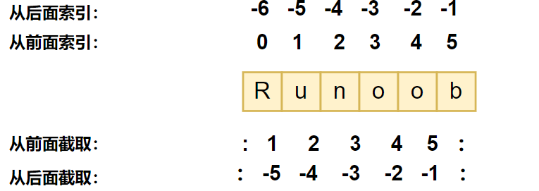
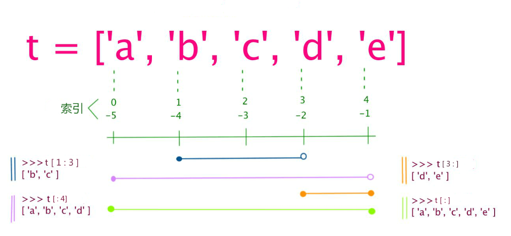
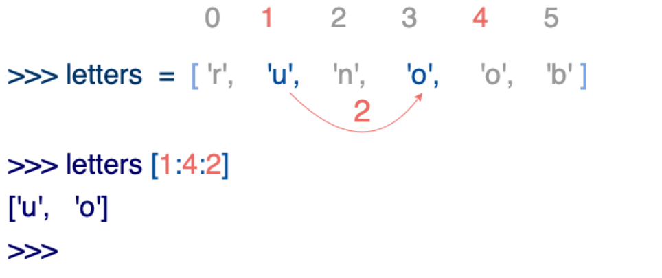
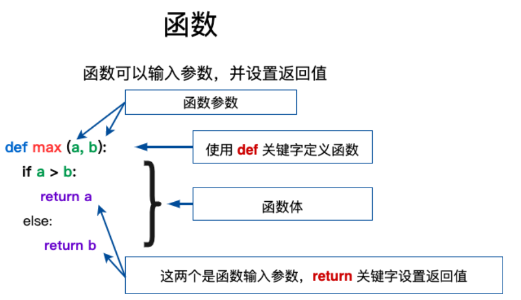

# python‘=

http://t.csdn.cn/LunXY

[root@hadoop102 ~]# ll  /usr/bin/python*
lrwxrwxrwx. 1 root root    7 11月  7 18:45 /usr/bin/python -> python2
lrwxrwxrwx. 1 root root    9 11月  7 18:45 /usr/bin/python2 -> python2.7
-rwxr-xr-x. 1 root root 7216 4月  11 2018 /usr/bin/python2.7

## 字符串

```python
name="tuo tao"
print(name.title()) #Tuo Tao
print(name.upper()) #TUO TAO
print(name.lower()) #tuo tao
```

### 拼接字符串

```python
a="tuo"
b="tao"
name=a+" "+b
print(name) #tuo tao
```

### 删除空格

```python
s=" python "  
s=s.rstrip()  #末尾
s=s.lstrip()  #开头
s=s.strip()   #末尾和开头
```

## 列表

```python
nums=list(range(1,6))
print(nums) #[1,2,3,4,5]
even_nums=list(range(2,11,2)) # step=2 #[2,4,6,8,10]
```


1. **python没有++ --运算符，但是有+=**。

2. **首先是关系运算符，与很多语言不同的是，在Python 中的关系运算符可以连续使用**。

   ```python
   >> print (1<3>2) 
   True
   ```

3. **==另外，在 Python 中，条件表达式中不允许使用赋值运算符“＝”，避免了某些语言中误将关系运算符“＝＝”写作赋值运算符“＝”带来的麻烦==**。

   ```python
   >>> if a=3
     File "<stdin>", line 1
       if a=3
           ^
   SyntaxError: invalid syntax
   ```

4. python双分支结构采用

   ```python
   if con:
       pass
   else:
       pass
   ```

5. python三元表达式采用

   ```python
   value1 if condition else value2 
   ```

   con为真时取value1。另外valuel和value2还可以使用复杂表达式，包括`函数调用`和`基本输出语句`。

   ```python
   >>> import math
   >>> import random  //必须先导入
   >> x=math. sqrt (9) if 2>3 else random. randint (1, 100) 
   ```

6. python多分支结构采用**==elif==**。

   ```python
   if con1:
       pass
   elif con2:
       pass
   elif con3:
       pass
   else:
       pass
   ```

7. python循环(**==注意是可以带else的哦，当然不带也没关系==**)

   ```python
   while 条件表达式:
   循环体
   else: 
   pass
   
   for 取值 in 序列或送代对象：
   循环体
   else: 
   pass
   ```

8. math

   math 是用于数学计算的标准库，除了用于平方根函数 sqrt（）和取整函数 ceil（），还提供
   了最大公约数函数 gcd(), sin （）、 asin （）等三角函数与反三角函数，弧度与角度转换函数
   degrees （）、 radians （），误差函数 erf （）、剩余误差函数 erfc （）、伽马函数 gamma （） 对数函数
   log() log2 （）、 loglO() ，阶乘函数 factorial （），常数 pi和e ，等等。

9. Python 程序中的字符串编码则使用＃coding 显式地指定，常用的方式有：

   ```python
   #coding=utf- 8 
   #coding:GBK 
   #- * -coding:utf-8 - * -
   ```

10. **作为使用者，在调用函数时，一定要注意函数有没有返回值，以及是否会对参数的值进行修改**。例如第 章介绍过的**==列表对象方法 sort==** （）属于原地操作，没有返回值，**而内置函数sorted （）则返回排序后的列表，并不对原列表做任何修改**。

## 面向对象程序设计

与其他面向对象程序设计语言不同的是 Python 中对象的概念很广泛，Python 中的一切内容都可以称为对象，而不一定必须是某个类的实例 ，例如 字符串、列表、字典、元组等内置数据类型**都具有和类完全相似的语法和用法** 

创建类时用**变量形式**表示的对象属性称为数据成员或成员属性，用**函数形式**表示的对象行为称为成员函数或成员方法，成员属性和成员方法统称为类的成员。

### 定义一个类

```python
class Car : ＃新式类必须有至少一个基类
def inf or (self) :   
print (” This is a car”) 
```

> **==self是必须的==**。

定义了类之后，可以用来实例化对象，并通过“对象名．成员”的方式来访问其中的数据成员或成员方法，例如下面的代码

```python
>> car=Car()   # 非常简单的创建对象
>> car .inf or () 
This is a car
```

在Python 中，可以使用内置方法 is instance （）来测试 个对象是否为某个类 实例，下面的代码演示了 isinstance （）的用法

```python
>> isinstance (car, Car) 
True 
> > isinstance (car, str) 
False
```

### self 参数

**类的所有实例方法==都必须至少有一个==名为 self 的参数**，并且必须是方法的第一个形参（如果有多个形参）。` .self` 参数代表对象本身。**==在类的实例方法中访问实例属性时需要以self为前缀==**，但在外部通过对象名调用对象方法时并不需要传递这个参数，**==如果在外部通过类名调用对象方法需要显式为 self 参数传值==**，参考后面 6.2 节的讨论。
Python 中，在类中定义实例方法时将第一个参数定义为 self 只是 个习惯，而实际上名字是可以变化的，而不是必须使用 self 这个名字．例如：

```python
>> class A : 
def init (hahaha , v) : 
hahaha.value=v 
def show (hahaha) :   # hahaha即为self
print(hahaha.value) 
>>>a=A(3) 
>> a.show() 
3 
```

### 类成员与实例成员

这里主要指数据成员，或者广义上的属性。可以说属性有两种： **一种是实例属性；另一种是类属性** 。**实例属性一般是指在构造函数`__init__（）`中定义的，==定义==和==使用==时==必须==以self 作为前缀**；**==类属性是在类中所有方法之外定义的数据成员==**。在主程序中（或类的外部），实例属性属于实例（对象），只能通过对象名访问；而类属性属于类，可以通过类名或对象名访问。
**在类的方法中可以调用类本身的其他方法，也可以访问类属性以及对象属性**。在Python 中比较特殊的是，**可以动态地为类和对象增加成员，这一点是和很多面向对象程序设计语言不同的**．也是 Python 动态类型特点的一种重要体现

```python
class Car:    #这种对齐方式使得python知道这些都是类的
	price=100000       # 定义类属性
	def it (self, c): 
		self. color= c # 定义实例属性
    
ear1= Car(” Red” ) 
car2=Car(” Blue " ) 
print (car1. color, Car. price) 
Car.price= 110000   # 修改类属性
Car.name= 'QQ'    # 增加类属性
ear1.color="Yellow"  # 修改实例属性
print(car2.color, Car.price, Car.name) 
print (car1.color, Car.price, Car. name) 
         
def setSpeed(self, s) : # 动态为对象增加成员方法
	self.speed= s 
car1.setSpeed=types.MethodType(setSpeed, Car) # 动态为对象增加成员方法
car1.setSpeed(50) 
print(car1.speed) 
```


在Python中 ，函数和方法是有区别的。**方法一般指与特定实例绑定的函数**，**通过对象调用方法时，对象本身将被作为第一个参数传递过去**，普通函数并不具备这个特点。

```python
>> class Demo: 
pass 
>> t= Demo()
>> def test(self, v): 
	self.value=v 
>> t.test=test  # 这是动态增加对象属性变量test，然后用一个普通函数为它初始化。
>> t.test
<function test at Ox00000000034B7EAO> # 普通函数
>> t.test(t,3)   # 需要传递一个对象
>> print (t.value) 
3 
>> t.test=types.MethodType(test,t) # 这个才是动态的为对象绑定一个方法
>> t.test
<bound method test of <_main_. Demo object at Ox00000000007>
>> t.test(5) 
>> print(t.value)
5 
```

****

# hero

# The Python Tutorial

Python is an easy to learn, powerful programming language. It has efficient high-level data structures and a simple but effective approach to object-oriented programming. Python’s elegant syntax and dynamic typing, together with its interpreted nature, make it an ideal language for scripting and rapid application development in many areas on most platforms.

The Python interpreter and the extensive standard library are freely available in source or binary form for all major platforms from the Python web site, https://www.python.org/, and may be freely distributed. The same site also contains distributions of and pointers to many free third party Python modules, programs and tools, and additional documentation.

The Python interpreter is easily extended with new functions and data types implemented in C or C++ (or other languages callable from C). Python is also suitable as an extension language for customizable applications.

This tutorial introduces the reader informally to the basic concepts and features of the Python language and system. It helps to have a Python interpreter handy for hands-on experience, but all examples are self-contained, so the tutorial can be read off-line as well.

For a description of standard objects and modules, see [The Python Standard Library](https://docs.python.org/3/library/index.html#library-index). [The Python Language Reference](https://docs.python.org/3/reference/index.html#reference-index) gives a more formal definition of the language. To write extensions in C or C++, read [Extending and Embedding the Python Interpreter](https://docs.python.org/3/extending/index.html#extending-index) and [Python/C API Reference Manual](https://docs.python.org/3/c-api/index.html#c-api-index). There are also several books covering Python in depth.

This tutorial does not attempt to be comprehensive and cover every single feature, or even every commonly used feature. Instead, it introduces many of Python’s most noteworthy features, and will give you a good idea of the language’s flavor and style. After reading it, you will be able to read and write Python modules and programs, and you will be ready to learn more about the various Python library modules described in [The Python Standard Library](https://docs.python.org/3/library/index.html#library-index).

The [Glossary](https://docs.python.org/3/glossary.html#glossary) is also worth going through.

## [2. Using the Python Interpreter](https://docs.python.org/3/tutorial/interpreter.html)

 ### [2.1. Invoking the Interpreter](https://docs.python.org/3/tutorial/interpreter.html#invoking-the-interpreter)

The Python interpreter is usually installed as `/usr/local/bin/python3.11` on those machines where it is available; putting `/usr/local/bin` in your Unix shell’s search path makes it possible to start it by typing the command:

```python
python3.11
```

to the shell. [1](https://docs.python.org/3/tutorial/interpreter.html#id2) Since the choice of the directory where the interpreter lives is an installation option, other places are possible; check with your local Python guru or system administrator. (E.g., `/usr/local/python` is a popular alternative location.)

On Windows machines where you have installed Python from the [Microsoft Store](https://docs.python.org/3/using/windows.html#windows-store), the `python3.11` command will be available. If you have the [py.exe launcher](https://docs.python.org/3/using/windows.html#launcher) installed, you can use the `py` command. See [Excursus: Setting environment variables](https://docs.python.org/3/using/windows.html#setting-envvars) for other ways to launch Python.

#### [2.1.1. Argument Passing](https://docs.python.org/3/tutorial/interpreter.html#argument-passing)

#### [2.1.2. Interactive Mode](https://docs.python.org/3/tutorial/interpreter.html#interactive-mode)

### [2.2. The Interpreter and Its Environment](https://docs.python.org/3/tutorial/interpreter.html#the-interpreter-and-its-environment)

#### [2.2.1. Source Code Encoding](https://docs.python.org/3/tutorial/interpreter.html#source-code-encoding)

Footnotes

- [1](https://docs.python.org/3/tutorial/interpreter.html#id1)

  On Unix, the Python 3.x interpreter is by default not installed with the executable named `python`, so that it does not conflict with a simultaneously installed Python 2.x executable.

# hero

## 安装

centos7自带版本是python2.7，如果要用的3.0以上的版本需要手动安装。

下载地址：https://www.python.org/ftp/python/

### 首先查看系统python的位置在哪儿。

```shell
[root@hadoop100 bin]# whereis python
python: /usr/bin/python /usr/bin/python2.7 /usr/lib/python2.7 /usr/lib64/python2.7 /etc/python /usr/include/python2.7 /usr/share/man/man1/python.1.gz
```

python2.7默认安装是在 /usr/bin目录中，切换到/usr/bin/。

```shell
[root@hadoop100 bin]# ll /usr/bin/python*
lrwxrwxrwx. 1 root root    7 11月  7 18:45 /usr/bin/python -> python2
lrwxrwxrwx. 1 root root    9 11月  7 18:45 /usr/bin/python2 -> python2.7
-rwxr-xr-x. 1 root root 7216 4月  11 2018 /usr/bin/python2.7
```

从上面的结果中我们可以看到，**python指向的是python2**，python2指向的是python2.7，**因此我们可以装个python3，然后将python指向python3**，然后python2仍然指向python2.7，那么两个版本的python就能共存了。

### 下载python3的包之前，要先安装相关的依赖包，用于下载编译python3：

> 这是bi

```shell
yum install zlib-devel bzip2-devel openssl-devel ncurses-devel sqlite-devel readline-devel tk-devel gcc make -y
```

运行了以上命令以后，就安装了编译python3所用到的相关依赖/

### 默认的centos7是没有安装pip，先添加epel扩展源/

```shell
yum -y install epel-release
```

### 安装pip(no)

```shell
yum install python-pip
```

### 用pip装wget(no)

```shell
pip install wget
```

### 用wget下载python3的源码包

```shell
wget https://www.python.org/ftp/python/3.9.1/Python-3.9.1.tgz
www.python.org/ftp/python  // 网页下载更快
```

### 编译python3源码包，解压

```shell
mv ~/Python-3.9.1.tgz /opt/software/
cd /opt/software/
tar zxvf Python-3.9.1.tgz -C /opt/module/
```

### 进入解压后的目录，依次执行下面命令进行手动编译

```shell
cd /opt/module/Python-3.9.1/
./configure prefix=/usr/local/python3  #指定可执行文件及库(就是python这个软件)安装目录
make -j8 && make install  # 会创建/usr/local/python3
[root@hadoop100 Python-3.9.1]# cd /usr/local/python3/
[root@hadoop100 python3]# ls
bin  include  lib  share
[root@hadoop100 python3]# cd bin/
[root@hadoop100 bin]# ls
2to3      easy_install-3.9  idle3.9  pip3.9  pydoc3.9  python3.9         python3-config
2to3-3.9  idle3             pip3     pydoc3  python3   python3.9-config
```

### 安装依赖zlib、zlib-deve(no)

```shell
yum install zlib zlib
yum install zlib zlib-devel
```

### 最后没提示出错，就代表正确安装了，在/usr/local/目录下就会有python3目录

### 添加软链接，将原来的链接备份

```shell
mv /usr/bin/python /usr/bin/python.bak
```

### 添加python3的软链接

```shell
ln -s /usr/local/python3/bin/python3.9 /usr/bin/python
ln -s /usr/local/python3/bin/python3.9 /usr/bin/python3  #同时生成一个名为python3的软链接
python -V
ln -s /usr/local/python3/bin/pip3 /usr/bin/pip # for pip
```

### 更改yum配置，因为其要用到python2才能执行，否则会导致yum不能正常使用

```shell
vi /usr/bin/yum
把第一行的#! /usr/bin/python 修改为如下
#! /usr/bin/python2
还有一个地方也需要修改
vi /usr/libexec/urlgrabber-ext-down
把第一行的#! /usr/bin/python 修改如下
#! /usr/bin/python2
```

### 启动python2

```shell
python2
```

### 启动python3

```shell
python
python3

[root@hadoop100 bin]# ll /usr/bin/python*
lrwxrwxrwx. 1 root root   32 12月  3 17:13 /usr/bin/python -> /usr/local/python3/bin/python3.9
lrwxrwxrwx. 1 root root    9 11月  7 18:45 /usr/bin/python2 -> python2.7
-rwxr-xr-x. 1 root root 7216 4月  11 2018 /usr/bin/python2.7
lrwxrwxrwx. 1 root root   32 12月  3 17:14 /usr/bin/python3 -> /usr/local/python3/bin/python3.9
lrwxrwxrwx. 1 root root    7 11月  7 18:45 /usr/bin/python.bak -> python2
```

## pip 

pip 是 Python 包管理工具，该工具提供了对 Python 包的查找、下载、安装、卸载的功能。

软件包也可以在 https://pypi.org/ 中找到。

目前最新的 Python 版本已经预装了 pip。

>注意：Python 2.7.9 + 或 Python 3.4+ 以上版本都自带 pip 工具。
>
>如果没有安装可以参考：[Python pip 安装与使用。](https://www.runoob.com/w3cnote/python-pip-install-usage.html)

查看是否已经安装 pip 可以使用以下命令：

```python
pip --version
```

下载安装包使用以下命令：

```shell
pip install some-package-name
pip install numpy
```

我们也可以轻易地通过以下的命令来移除软件包：

```python
pip uninstall some-package-name
pip uninstall numpy
```

如果要查看我们已经安装的软件包，可以使用以下命令：

```shell
[root@hadoop100 bin]# pip list

Package    Version
---------- -------
pip        20.2.3
setuptools 49.2.1
WARNING: You are using pip version 20.2.3; however, version 22.3.1 is available.
You should consider upgrading via the '/usr/local/python3/bin/python3.9 -m pip install --upgrade pip' command.
```

最后更新一下，否则安装某些包会报错：

```shell
[root@hadoop100 bin]# python -m pip install --upgrade pip
Collecting pip
  Downloading pip-22.3.1-py3-none-any.whl (2.1 MB)
     |████████████████████████████████| 2.1 MB 15 kB/s 
Installing collected packages: pip
  Attempting uninstall: pip
    Found existing installation: pip 20.2.3
    Uninstalling pip-20.2.3:
      Successfully uninstalled pip-20.2.3
  WARNING: The scripts pip, pip3, pip3.10 and pip3.9 are installed in '/usr/local/python3/bin' which is not on PATH.
  Consider adding this directory to PATH or, if you prefer to suppress this warning, use --no-warn-script-location.
Successfully installed pip-22.3.1
```


## Python3 基础语法

### 编码

默认情况下，Python 3 源码文件以 **UTF-8** 编码，所有字符串都是 unicode 字符串。 当然你也可以为源码文件指定不同的编码：

```python
# -*- coding: cp-1252 -*-
```

述定义允许在源文件中使用 Windows-1252 字符集中的字符编码，对应适合语言为保加利亚语、白罗斯语、马其顿语、俄语、塞尔维亚语。

### 标识符

- 第一个字符必须是字母表中字母或下划线 **_** 。
- 标识符的其他的部分由字母、数字和下划线组成。
- 标识符对大小写敏感。

在 Python 3 中，可以用中文作为变量名，非 ASCII 标识符也是允许的了。

### python保留字

保留字即关键字，我们不能把它们用作任何标识符名称。Python 的标准库提供了一个 keyword 模块，可以输出当前版本的所有关键字：

```python
>>> import keyword
>>> keyword.kwlist
['False', 'None', 'True', '__peg_parser__', 'and', 'as', 'assert', 'async', 'await', 'break', 'class', 'continue', 'def', 'del', 'elif', 'else', 'except', 'finally', 'for', 'from', 'global', 'if', 'import', 'in', 'is', 'lambda', 'nonlocal', 'not', 'or', 'pass', 'raise', 'return', 'try', 'while', 'with', 'yield']
```

### 注释

Python中单行注释以 **#** 开头，实例如下：

```python
#!/usr/bin/python3
 
# 第一个注释
print ("Hello, Python!") # 第二个注释
```

多行注释可以用多个 **#** 号，还有 **'''** 和 **"""**：

```python
#!/usr/bin/python3
 
# 第一个注释
# 第二个注释
 
'''
第三注释
第四注释
'''
 
"""
第五注释
第六注释
"""
print ("Hello, Python!")
```

### 行与缩进

python最具特色的就是使用缩进来表示代码块，不需要使用大括号 **{}** 。

**缩进的空格数是可变的**，**但是同一个代码块的语句必须包含相同的缩进空格数**。实例如下：

```python
if True:
    print ("True")
else:
    print ("False")
```

以下代码最后一行语句缩进数的空格数不一致，会导致运行错误：

```python
if True:
    print ("Answer")
    print ("True")
else:
    print ("Answer")
  print ("False")    # 缩进不一致，会导致运行错误
```

以上程序由于缩进不一致，执行后会出现类似以下错误：

```python
 File "test.py", line 6
    print ("False")    # 缩进不一致，会导致运行错误
                                      ^
IndentationError: unindent does not match any outer indentation level
```

### 多行语句

Python 通常是一行写完一条语句，但如果语句很长，我们可以使用反斜杠` \`来实现多行语句，例如：

```python
total = item_one + \
        item_two + \
        item_three
```

在 [], {}, 或 () 中的多行语句，不需要使用反斜杠 `\`，例如：

```python
total = ['item_one', 'item_two', 'item_three',
        'item_four', 'item_five']
```

### 数字(Number)类型

python中数字有四种类型：整数、布尔型、浮点数和复数。

- **int** (整数), 如 1, **==只有一种整数类型 int，表示为长整型==**，没有 python2 中的 Long。
- **bool** (布尔), 如 True。
- **float** (浮点数), 如 1.23、3E-2
- **complex** (复数), 如 1 + 2j、 1.1 + 2.2j

### 字符串(String)

- Python 中单引号 **'** 和双引号 **"** 使用完全相同。
- 使用三引号(**'''** 或 **"""**)可以指定一个多行字符串。
- 转义符 `\`。
- **==反斜杠可以用来转义，使用 r 可以让反斜杠不发生转义==**。 如 **r"this is a line with \n"** 则 **\n** 会显示，并不是换行。
- **==按字面意义级联字符串==**，如 **"this " "is " "string"** 会被自动转换为 **this is string**。
- 字符串可以用 **+** 运算符连接在一起，用 ***** 运算符**重复**。
- Python 中的字符串有两种索引方式，**==从左往右以 0 开始，从右往左以 -1 开始==**。
- **==Python 中的字符串不能改变==**。
- **==Python 没有单独的字符类型，一个字符就是长度为 1 的字符串==**。
- 字符串的截取的语法格式如下：**变量[头下标:尾下标:步长]**

```python
word = '字符串'
sentence = "这是一个句子。"
paragraph = """这是一个段落，      
可以由多行组成"""
# 有变量来接是字符串。无变量来接是注释，因为无法使用，也就没有意义，所以是注释。
```

```python
#!/usr/bin/python3
 
str='123456789'
 
print(str)                 # 输出字符串 123456789
print(str[0:-1])           # 输出第一个到倒数第二个的所有字符 12345678
print(str[0])              # 输出字符串第一个字符 1
print(str[2:5])            # 输出从第三个开始到第五个的字符 345  注意是开区间
print(str[2:])             # 输出从第三个开始后的所有字符 3456789
print(str[1:5:2])          # 输出从第二个开始到第五个且每隔一个的字符（步长为2）24
print(str * 2)             # 输出字符串两次 123456789123456789
print(str + '你好')         # 连接字符串 123456789你好
 
print('------------------------------')
 
print('hello\nrunoob')      # 使用反斜杠(\)+n转义特殊字符
hello
runoob

print(r'hello\nrunoob')     # 在字符串前面添加一个 r，表示原始字符串，不会发生转义
hello\nrunoob
```

这里的 r 指 raw，即 raw string，会自动将反斜杠转义，例如：

```python
>>> print('\n')       # 输出空行

>>> print(r'\n')      # 输出 \n
\n
>>>
```

### 空行

函数之间或类的方法之间用空行分隔，表示一段新的代码的开始。类和函数入口之间也用一行空行分隔，以突出函数入口的开始。

空行与代码缩进不同，空行并不是 Python 语法的一部分。书写时不插入空行，Python 解释器运行也不会出错。但是空行的作用在于分隔两段不同功能或含义的代码，便于日后代码的维护或重构。

**记住：**空行也是程序代码的一部分。

### 等待用户输入

执行下面的程序在按回车键后就会等待用户输入：

```python
#!/usr/bin/python3
 
input("\n\n按下 enter 键后退出。")
```

以上代码中 ，**\n\n** 在结果输出前会输出两个新的空行。一旦用户按下 **enter** 键时，程序将退出。

### 同一行显示多条语句

**==Python 可以在同一行中使用多条语句，语句之间使用分号 ; 分割==**，以下是一个简单的实例：

```python
#!/usr/bin/python3
import sys; x = 'runoob'; sys.stdout.write(x + '\n')
```

使用脚本执行以上代码，输出结果为：

```c
runoob
```

使用交互式命令行执行，输出结果为：

```python
>>> import sys; x = 'runoob'; sys.stdout.write(x + '\n')
runoob
7
```

此处的 7 表示字符数，**runoob** 有 6 个字符，**\n** 表示一个字符，加起来 **7** 个字符。

```python
>>> import sys
>>> sys.stdout.write(" hi ")    # hi 前后各有 1 个空格
 hi 4
```

### 多个语句构成代码组

缩进相同的一组语句构成一个代码块，我们称之代码组。

像if、while、def和class这样的复合语句，首行以关键字开始，以冒号( : )结束，该行之后的一行或多行代码构成代码组。

我们将首行及后面的代码组称为一个子句(clause)。

如下实例：

```python
if expression : 
   suite
elif expression : 
   suite 
else : 
   suite
```

### print 输出

**print** 默认输出是换行的，如果要实现不换行需要在变量末尾加上 **end=""**：

```python
#!/usr/bin/python3
 
x="a"
y="b"
# 换行输出
print( x )
print( y )
 
print('---------')
# 不换行输出
print( x, end=" " )
print( y, end=" " )
print()
```

以上实例执行结果为：

```python
a
b
---------
a b
```

### import 与 from...import

在 python 用 **import** 或者 **from...import** 来导入相应的模块。

**将整个模块(somemodule)导入**，格式为： **import somemodule**

从某个模块中导入某个函数,格式为： **from somemodule import somefunction**

从某个模块中导入多个函数,格式为： **from somemodule import firstfunc, secondfunc, thirdfunc**

**==将某个模块中的全部函数导入==**，格式为： `from somemodule import *`

导入 sys 模块

```python
import sys
print('================Python import mode==========================')
print ('命令行参数为:')
for i in sys.argv:
    print (i)
print ('\n python 路径为',sys.path)
```

导入 sys 模块的 argv,path 成员

```python
from sys import argv,path  #  导入特定的成员
 
print('================python from import===================================')
print('path:',path) # 因为已经导入path成员，所以此处引用时不需要加sys.path
```

### 命令行参数

很多程序可以执行一些操作来查看一些基本信息，Python可以使用-h参数查看各参数帮助信息：

```python
$ python -h
usage: python [option] ... [-c cmd | -m mod | file | -] [arg] ...
Options and arguments (and corresponding environment variables):
-c cmd : program passed in as string (terminates option list)
-d     : debug output from parser (also PYTHONDEBUG=x)
-E     : ignore environment variables (such as PYTHONPATH)
-h     : print this help message and exit

[ etc. ]
```

我们在使用脚本形式执行 Python 时，可以接收命令行输入的参数，具体使用可以参照 [Python 3 命令行参数](https://www.runoob.com/python3/python3-command-line-arguments.html)。

## 基本数据类型

Python 中的变量不需要声明。**==每个变量在使用前都必须赋值，变量赋值以后该变量才会被创建==**。

在 Python 中，**变量就是变量，它没有类型，==我们所说的"类型"是变量所指的内存中对象的类型==**。

等号（=）用来给变量赋值。

等号（=）运算符左边是一个变量名,等号（=）运算符右边是存储在变量中的值。例如：

```python
#!/usr/bin/python3

counter = 100          # 整型变量
miles   = 1000.0       # 浮点型变量
name    = "runoob"     # 字符串

print (counter)
print (miles)
print (name)
100
1000.0
runoob
```

### 多个变量赋值

Python允许你同时为多个变量赋值。例如：

```python
a = b = c = 1
```

以上实例，创建一个整型对象，值为 1，从后向前赋值，三个变量被赋予相同的数值（**==1在内存中只有一份==**）。

您也可以为多个对象指定多个变量。例如：

```python
a, b, c = 1, 2, "runoob"
```

以上实例，两个整型对象 1 和 2 的分配给变量 a 和 b，字符串对象 "runoob" 分配给变量 c。

### 标准数据类型

Python3 中有六个标准的数据类型：

- Number（数字）
- String（字符串）
- List（列表）
- Tuple（元组）
- Set（集合）
- Dictionary（字典）

Python3 的六个标准数据类型中：

- **不可变数据（3 个）：**Number（数字）、String（字符串）、Tuple（元组）；
- **可变数据（3 个）：**List（列表）、Dictionary（字典）、Set（集合）。

### Number（数字）

Python3 支持 **int、float、bool、complex（复数）**。

在Python 3里，只有一种整数类型 int，表示为长整型，没有 python2 中的 Long。

像大多数语言一样，数值类型的赋值和计算都是很直观的。

**==内置的 type() 函数可以用来查询变量所指的对象类型==**。

```python
>>> a, b, c, d = 20, 5.5, True, 4+3j
>>> print(type(a), type(b), type(c), type(d))
<class 'int'> <class 'float'> <class 'bool'> <class 'complex'>
```

此外还可以用 isinstance 来判断：

```python
>>> a = 111
>>> isinstance(a, int)
True
>>>
```

isinstance 和 type 的区别在于：

- type()不会认为子类是一种父类类型。
- isinstance()**==会认为子类是一种父类类型==**。

```python
>>> class A:
...     pass
... 
>>> class B(A):
...     pass
... 
>>> isinstance(A(), A)
True
>>> type(A()) == A 
True
>>> isinstance(B(), A)  #B继承了A
True
>>> type(B()) == A
False
```

注意：**==Python3 中，bool 是 int 的子类，True 和 False 可以和数字相加==**，`True==1`、`False==0` 会返回True，但可以通过is来判断类型。

```python
>>> issubclass(bool, int) 
True
>>> True==1
True
>>> False==0
True
>>> True+1
2
>>> False+1
1
>>> 1 is True
False
>>> 0 is False
False
```

*在 Python2 中是没有布尔型的，它用数字 0 表示 False，用 1 表示 True。*

当你指定一个值时，Number 对象就会被创建：

```python
var1 = 1
var2 = 10
```

您也可以使用del语句删除一些对象引用。

del语句的语法是：

```python
del var1[,var2[,var3[....,varN]]]
```

您可以通过使用del语句删除单个或多个对象。例如：

```python
del var
del var_a, var_b
```

#### 数值运算

```python
>>> 5 + 4  # 加法
9
>>> 4.3 - 2 # 减法
2.3
>>> 3 * 7  # 乘法
21
>>> 2 / 4  # 除法，得到一个浮点数
0.5
>>> 2 // 4 # 除法，得到一个整数(整除)
0
>>> 17 % 3 # 取余
2
>>> 2 ** 5 # 乘方
32
```

**注意：**

- 1、Python可以同时为多个变量赋值，如a, b = 1, 2。
- 2、**一个变量可以通过赋值指向不同类型的对象**。
- 3、数值的除法包含两个运算符：**/** **==返回一个浮点数==**，**//** 返回一个整数。
- 4、**在混合计算时，Python会把整型转换成为浮点数**。

#### 数值类型实例

| int    | float      | complex    |
| :----- | :--------- | :--------- |
| 10     | 0.0        | 3.14j      |
| 100    | 15.20      | 45.j       |
| -786   | -21.9      | 9.322e-36j |
| 080    | 32.3e+18   | .876j      |
| -0490  | -90.       | -.6545+0J  |
| -0x260 | -32.54e100 | 3e+26J     |
| 0x69   | 70.2E-12   | 4.53e-7j   |

Python 还支持复数，复数由实数部分和虚数部分构成，可以用 **a + bj**，或者 **complex(a,b)** 表示， 复数的实部 **a** 和虚部 **b** 都是浮点型。

### String（字符串）

Python中的字符串用单引号 **'** 或双引号 **"** 括起来，同时使用反斜杠 `\` 转义特殊字符。

字符串的截取的语法格式如下：

```python
变量[头下标:尾下标]
```

索引值以 0 为开始值，-1 为从末尾的开始位置。



加号 **+** 是字符串的连接符， 星号 ***** 表示复制当前字符串，与之结合的数字为复制的次数。实例如下：

```python
>>> word = 'Python'
>>> print(word[0], word[5])
P n
>>> print(word[-1], word[-6])
n P

>>> word = 'Python'
>>> print(word[1:3])  注意3是开区间
yt
```

与 C 字符串不同的是，Python 字符串不能被改变。向一个索引位置赋值，比如 **word[0] = 'm'** 会导致错误。

**注意：**

- 1、反斜杠可以用来转义，使用r可以让反斜杠不发生转义。
- 2、字符串可以用+运算符连接在一起，**用*运算符重复**。
- 3、Python中的字符串有两种索引方式，从左往右以0开始，从右往左以-1开始。
- 4、Python中的字符串不能改变。

### List（列表）

List（列表） 是 Python 中使用最频繁的数据类型。

列表可以完成大多数集合类的数据结构实现。**==列表中元素的类型可以不相同，它支持数字，字符串甚至可以包含列表（所谓嵌套）==**。

列表是写在方括号 **[]** 之间、用逗号分隔开的元素列表。

和字符串一样，**==列表同样可以被索引和截取，列表被截取后返回一个包含所需元素的新列表(地址变了！！！)==**。

列表截取的语法格式如下：

```
变量[头下标:尾下标]
```

索引值以 **0** 为开始值，**-1** 为从末尾的开始位置。



加号 **+** 是列表连接运算符，星号 ***** 是重复操作。如下实例：

```python
#!/usr/bin/python3

list = [ 'abcd', 786 , 2.23, 'runoob', 70.2 ]
tinylist = [123, 'runoob']

print (list)            # 输出完整列表 ['abcd', 786, 2.23, 'runoob', 70.2]
print (list[0])         # 输出列表第一个元素 abcd
print (list[1:3])       # 从第二个开始输出到第三个元素 [786, 2.23]  
print (list[2:])        # 输出从第三个元素开始的所有元素 [2.23, 'runoob', 70.2]
print (tinylist * 2)    # 输出两次列表
print (list + tinylist) # 连接列表
```

**==list[1:3]注意3是开区间==**。

与Python字符串不一样的是，列表中的元素是可以改变的：

```python
>>> a = [1, 2, 3, 4, 5, 6]
>>> a[0] = 9
>>> a[2:5] = [13, 14, 15]
>>> a
[9, 2, 13, 14, 15, 6]
>>> a[2:5] = []   # 将对应的元素值设置为 []
>>> a
[9, 2, 6]
```

List 内置了有很多方法，例如 append()、pop() 等等，这在后面会讲到。

**注意：**

- 1、List写在方括号之间，元素用逗号隔开。
- 2、**==和字符串一样，list可以被索引和切片==**。
- 3、List可以使用+操作符进行拼接。
- 4、List中的元素是可以改变的。

Python 列表截取可以接收第三个参数，参数作用是截取的步长，以下实例在索引 1 到索引 4 的位置并设置为步长为 2（间隔一个位置）来截取字符串：



**==如果第三个参数为负数表示逆向读取，以下实例用于翻转字符串==**：

```shell
def reverseWords(input):
     
    # 通过空格将字符串分隔符，把各个单词分隔为列表
    inputWords = input.split(" ")
 
    # 翻转字符串
    # 假设列表 list = [1,2,3,4],  
    # list[0]=1, list[1]=2 ，而 -1 表示最后一个元素 list[-1]=4 ( 与 list[3]=4 一样)
    # inputWords[-1::-1] 有三个参数
    # 第一个参数 -1 表示最后一个元素
    # 第二个参数为空，表示移动到列表末尾
    # 第三个参数为步长，-1 表示逆向
    inputWords=inputWords[-1::-1]
 
    # 重新组合字符串
    output = ' '.join(inputWords)
     
    return output
 
if __name__ == "__main__":
    input = 'I like runoob'
    rw = reverseWords(input)
    print(rw)
```

输出结果为：

```
runoob like I
```

### Tuple（元组）

元组（tuple）与列表类似，**==不同之处在于元组的元素不能修改==**。元组写在小括号 **()** 里，元素之间用逗号隔开。

**==元组中的元素类型也可以不相同==**：

```python
#!/usr/bin/python3

tuple = ( 'abcd', 786 , 2.23, 'runoob', 70.2  )
tinytuple = (123, 'runoob')

print (tuple)             # 输出完整元组
print (tuple[0])          # 输出元组的第一个元素
print (tuple[1:3])        # 输出从第二个元素开始到第三个元素
print (tuple[2:])         # 输出从第三个元素开始的所有元素
print (tinytuple * 2)     # 输出两次元组
print (tuple + tinytuple) # 连接元组
tuple += tinytuple        # ok
```

以上实例输出结果：

```c
('abcd', 786, 2.23, 'runoob', 70.2)
abcd
(786, 2.23)
(2.23, 'runoob', 70.2)
(123, 'runoob', 123, 'runoob')
('abcd', 786, 2.23, 'runoob', 70.2, 123, 'runoob')
```

元组与字符串类似，可以被索引且下标索引从0开始，-1 为从末尾开始的位置。也可以进行截取（看上面，这里不再赘述）。

**其实，可以把字符串看作一种特殊的元组**。

```python
>>> tup = (1, 2, 3, 4, 5, 6)
>>> print(tup[0])
1
>>> print(tup[1:5])
(2, 3, 4, 5)
>>> tup[0] = 11  # 修改元组元素的操作是非法的
Traceback (most recent call last):
  File "<stdin>", line 1, in <module>
TypeError: 'tuple' object does not support item assignment
>>>
```

**==虽然tuple的元素不可改变，但它可以包含可变的对象，比如list列表==**。

**==构造包含 0 个或 1 个元素的元组比较特殊，所以有一些额外的语法规则==**：

```python
tup1 = ()    # 空元组
tup2 = (20,) # 一个元素，需要在元素后添加逗号
```

string、list 和 tuple 都属于 sequence（序列）。

**注意：**

- 1、与字符串一样，元组的元素不能修改。
- 2、元组也可以被索引和切片，方法一样。
- 3、注意构造包含 0 或 1 个元素的元组的特殊语法规则。
- 4、元组也可以使用+操作符进行拼接。

### Set（集合）

集合（set）是由**一个或数个形态各异的大小整体**组成的，构成集合的事物或对象称作元素或是成员。

基本功能是进行**==成员关系测试==**和**==删除重复元素==**。

可以使用大括号 **{ }** 或者 **set()** 函数创建集合，**==注意==**：创建一个空集合必须用 **set()** 而不是 **{ }**，因为 **{ }** 是用来创建一个空字典。

创建格式：

```python
parame = {value01,value02,...}
或者
set(value)
```

```python
#!/usr/bin/python3

sites = {'Google', 'Taobao', 'Runoob', 'Facebook', 'Zhihu', 'Baidu'}

print(sites)   # 输出集合，重复的元素被自动去掉

# 成员测试
if 'Runoob' in sites :
    print('Runoob 在集合中')
else :
    print('Runoob 不在集合中')


# set可以进行集合运算
a = set('abracadabra')
b = set('alacazam')

print(a)

print(a - b)     # a 和 b 的差集

print(a | b)     # a 和 b 的并集

print(a & b)     # a 和 b 的交集

print(a ^ b)     # a 和 b 中不同时存在的元素
```

以上实例输出结果：

```c
{'Zhihu', 'Baidu', 'Taobao', 'Runoob', 'Google', 'Facebook'}
Runoob 在集合中
{'b', 'c', 'a', 'r', 'd'}
{'r', 'b', 'd'}
{'b', 'c', 'a', 'z', 'm', 'r', 'l', 'd'}
{'c', 'a'}
{'z', 'b', 'm', 'r', 'l', 'd'}
```

### Dictionary（字典）

字典（dictionary）是Python中另一个非常有用的内置数据类型。

**==列表是有序的对象集合(存入取出的有序)==**，字典是无序的对象集合。两者之间的区别在于：**==字典当中的元素是通过键来存取的，而不是通过偏移存取==**。

**==字典是一种映射类型==**，字典用 **{ }** 标识，它是一个无序的 **键(key) : 值(value)** 的集合。

**键(key)必须使用不可变类型**。

**在同一个字典中，键(key)必须是唯一**的。

```python
#!/usr/bin/python3

dict = {}
dict['one'] = "1 - 菜鸟教程"
dict[2]     = "2 - 菜鸟工具"

tinydict = {'name': 'runoob','code':1, 'site': 'www.runoob.com'}


print (dict['one'])       # 输出键为 'one' 的值
print (dict[2])           # 输出键为 2 的值
print (tinydict)          # 输出完整的字典
print (tinydict.keys())   # 输出所有键
print (tinydict.values()) # 输出所有值
```

以上实例输出结果：

```c
1 - 菜鸟教程
2 - 菜鸟工具
{'name': 'runoob', 'code': 1, 'site': 'www.runoob.com'}
dict_keys(['name', 'code', 'site'])
dict_values(['runoob', 1, 'www.runoob.com'])
```

构造函数 **dict()** 可以直接从键值对序列中构建字典如下：

```python
>>> dict([('Runoob', 1), ('Google', 2), ('Taobao', 3)])
{'Runoob': 1, 'Google': 2, 'Taobao': 3}
>>> {x: x**2 for x in (2, 4, 6)}
{2: 4, 4: 16, 6: 36}
>>> dict(Runoob=1, Google=2, Taobao=3)
{'Runoob': 1, 'Google': 2, 'Taobao': 3}
```

**{x: x\**2 for x in (2, 4, 6)}** 该代码使用的是字典推导式，更多推导式内容可以参考：[Python 推导式](https://www.runoob.com/python3/python-comprehensions.html)。

另外，字典类型也有一些内置的函数，例如 clear()、keys()、values() 等。

**注意：**

- 1、字典是一种映射类型，它的元素是键值对。
- 2、字典的关键字必须为不可变类型，且不能重复。
- 3、创建空字典使用 **{ }**。

## 数据类型转换

有时候，我们需要对数据内置的类型进行转换，数据类型的转换，一般情况下你只需要将数据类型作为函数名即可。

Python 数据类型转换可以分为两种：

- 隐式类型转换 - 自动完成
- **显式类型转换 - 需要使用类型函数来转换**

### 隐式类型转换

在隐式类型转换中，Python 会自动将一种数据类型转换为另一种数据类型，不需要我们去干预。

以下实例中，我们对两种不同类型的数据进行运算，较低数据类型（整数）就会转换为较高数据类型（浮点数）以避免数据丢失。

```shell
num_int = 123
num_flo = 1.23

num_new = num_int + num_flo

print("datatype of num_int:",type(num_int))
print("datatype of num_flo:",type(num_flo))

print("Value of num_new:",num_new)
print("datatype of num_new:",type(num_new))
```

以上实例输出结果为：

```shell
num_int 数据类型为: <class 'int'>
num_flo 数据类型为: <class 'float'>
num_new: 值为: 124.23
num_new 数据类型为: <class 'float'>
```

代码解析：

- 实例中我们对两个不同数据类型的变量 `num_int` 和 `num_flo` 进行相加运算，并存储在变量 `num_new` 中。
- 然后查看三个变量的数据类型。
- 在输出结果中，我们看到 `num_int` 是 `整型（integer）` ， `num_flo` 是 `浮点型（float）`。
- 同样，新的变量 `num_new` 是 `浮点型（float）`，这是因为 Python 会自动将较小的数据类型转换为较大的数据类型，以避免数据丢失。

我们再看一个实例，整型数据与字符串类型的数据进行相加：

```python
num_int = 123
num_str = "456"

print("Data type of num_int:",type(num_int))
print("Data type of num_str:",type(num_str))

print(num_int+num_str)
```

以上实例输出结果为：

```shell
num_int 数据类型为: <class 'int'>
num_str 数据类型为: <class 'str'>
Traceback (most recent call last):
  File "/runoob-test/test.py", line 7, in <module>
    print(num_int+num_str)
TypeError: unsupported operand type(s) for +: 'int' and 'str'
```

从输出中可以看出，整型和字符串类型运算结果会报错，输出 TypeError。 Python 在这种情况下无法使用隐式转换。但是，Python 为这些类型的情况提供了一种解决方案，称为显式转换。

### 显式类型转换

在显式类型转换中，用户将对象的数据类型转换为所需的数据类型。 我们使用 `int()`、`float()`、`str()` 等预定义函数来执行显式类型转换。

**int()** 强制转换为整型：

```python
x = int(1)   # x 输出结果为 1
y = int(2.8) # y 输出结果为 2
z = int("3") # z 输出结果为 3
```

**float()** 强制转换为浮点型：

```python
x = float(1)     # x 输出结果为 1.0
y = float(2.8)   # y 输出结果为 2.8
z = float("3")   # z 输出结果为 3.0
w = float("4.2") # w 输出结果为 4.2
```

**str()** 强制转换为字符串类型：

```python
x = str("s1") # x 输出结果为 's1'
y = str(2)    # y 输出结果为 '2'
z = str(3.0)  # z 输出结果为 '3.0'
```

整型和字符串类型进行运算，就可以用强制类型转换来完成：

```python
num_int = 123
num_str = "456"

print("num_int 数据类型为:",type(num_int))
print("类型转换前，num_str 数据类型为:",type(num_str))

num_str = int(num_str)    # 强制转换为整型
print("类型转换后，num_str 数据类型为:",type(num_str))

num_sum = num_int + num_str

print("num_int 与 num_str 相加结果为:",num_sum)
print("sum 数据类型为:",type(num_sum))
```

以上实例输出结果为：

```shell
num_int 数据类型为: <class 'int'>
类型转换前，num_str 数据类型为: <class 'str'>
类型转换后，num_str 数据类型为: <class 'int'>
num_int 与 num_str 相加结果为: 579
sum 数据类型为: <class 'int'>
```

以上实例输出结果为：

```python
num_int 数据类型为: <class 'int'>
类型转换前，num_str 数据类型为: <class 'str'>
类型转换后，num_str 数据类型为: <class 'int'>
num_int 与 num_str 相加结果为: 579
sum 数据类型为: <class 'int'>
```

以下几个内置的函数可以执行数据类型之间的转换。这些函数返回一个新的对象，表示转换的值。

| 函数                                                         | 描述                                                        |
| :----------------------------------------------------------- | :---------------------------------------------------------- |
| [int(x [,base\])](https://www.runoob.com/python3/python-func-int.html) | 将x转换为一个整数                                           |
| [float(x)](https://www.runoob.com/python3/python-func-float.html) | 将x转换到一个浮点数                                         |
| [complex(real [,imag\])](https://www.runoob.com/python3/python-func-complex.html) | 创建一个复数                                                |
| [str(x)](https://www.runoob.com/python3/python-func-str.html) | 将对象 x 转换为字符串                                       |
| [repr(x)](https://www.runoob.com/python3/python-func-repr.html) | 将对象 x 转换为表达式字符串                                 |
| [eval(str)](https://www.runoob.com/python3/python-func-eval.html) | **==用来计算在字符串中的有效Python表达式,并返回一个对象==** |
| [tuple(s)](https://www.runoob.com/python3/python3-func-tuple.html) | 将序列 s 转换为一个元组                                     |
| [list(s)](https://www.runoob.com/python3/python3-att-list-list.html) | 将序列 s 转换为一个列表                                     |
| [set(s)](https://www.runoob.com/python3/python-func-set.html) | 转换为可变集合                                              |
| [dict(d)](https://www.runoob.com/python3/python-func-dict.html) | 创建一个字典。d 必须是一个 (key, value)元组序列。           |
| [frozenset(s)](https://www.runoob.com/python3/python-func-frozenset.html) | 转换为不可变集合                                            |
| [chr(x)](https://www.runoob.com/python3/python-func-chr.html) | 将一个整数转换为一个字符                                    |
| [ord(x)](https://www.runoob.com/python3/python-func-ord.html) | 将一个字符转换为它的整数值                                  |
| [hex(x)](https://www.runoob.com/python3/python-func-hex.html) | 将一个整数转换为一个十六进制字符串                          |
| [oct(x)](https://www.runoob.com/python3/python-func-oct.html) | 将一个整数转换为一个八进制字符串                            |

## 运算符

### 什么是运算符？

本章节主要说明 Python 的运算符。

举个简单的例子:

```
4 + 5 = 9
```

例子中，**4** 和 **5** 被称为**操作数**，**+** 称为**运算符**。

Python 语言支持以下类型的运算符:

- [算术运算符](https://www.runoob.com/python3/python3-basic-operators.html#ysf1)
- [比较（关系）运算符](https://www.runoob.com/python3/python3-basic-operators.html#ysf2)
- [赋值运算符](https://www.runoob.com/python3/python3-basic-operators.html#ysf3)
- [逻辑运算符](https://www.runoob.com/python3/python3-basic-operators.html#ysf4)
- [位运算符](https://www.runoob.com/python3/python3-basic-operators.html#ysf5)
- [成员运算符](https://www.runoob.com/python3/python3-basic-operators.html#ysf6)
- [身份运算符](https://www.runoob.com/python3/python3-basic-operators.html#ysf7)
- [运算符优先级](https://www.runoob.com/python3/python3-basic-operators.html#ysf8)

接下来让我们一个个来学习Python的运算符。

### Python算术运算符

以下假设变量 **a=10**，变量 **b=21**：

| 运算符 | 描述                                            | 实例                      |
| :----- | :---------------------------------------------- | :------------------------ |
| +      | 加 - 两个对象相加                               | a + b 输出结果 31         |
| -      | 减 - 得到负数或是一个数减去另一个数             | a - b 输出结果 -11        |
| *      | 乘 - 两个数相乘或是返回一个被重复若干次的字符串 | a * b 输出结果 210        |
| /      | 除 - x 除以 y                                   | b / a 输出结果 2.1        |
| %      | 取模 - 返回除法的余数                           | b % a 输出结果 1          |
| **     | 幂 - 返回x的y次幂                               | a**b 为10的21次方         |
| //     | 取整除 - 向下取接近商的整数                     | `>>> 9//2 4 >>> -9//2 -5` |

### Python比较运算符

以下假设变量a为10，变量b为20：

| 运算符 | 描述                                                         | 实例                  |
| :----- | :----------------------------------------------------------- | :-------------------- |
| ==     | 等于 - 比较对象是否相等                                      | (a == b) 返回 False。 |
| !=     | 不等于 - 比较两个对象是否不相等                              | (a != b) 返回 True。  |
| >      | 大于 - 返回x是否大于y                                        | (a > b) 返回 False。  |
| <      | 小于 - 返回x是否小于y。所有比较运算符返回1表示真，返回0表示假。这分别与特殊的变量True和False等价。注意，这些变量名的大写。 | (a < b) 返回 True。   |
| >=     | 大于等于 - 返回x是否大于等于y。                              | (a >= b) 返回 False。 |
| <=     | 小于等于 - 返回x是否小于等于y。                              | (a <= b) 返回 True。  |

以下实例演示了Python所有比较运算符的操作：

### Python赋值运算符

以下假设变量a为10，变量b为20：

| 运算符 | 描述                                                         | 实例                                                         |
| :----- | :----------------------------------------------------------- | :----------------------------------------------------------- |
| =      | 简单的赋值运算符                                             | c = a + b 将 a + b 的运算结果赋值为 c                        |
| +=     | 加法赋值运算符                                               | c += a 等效于 c = c + a                                      |
| -=     | 减法赋值运算符                                               | c -= a 等效于 c = c - a                                      |
| *=     | 乘法赋值运算符                                               | c *= a 等效于 c = c * a                                      |
| /=     | 除法赋值运算符                                               | c /= a 等效于 c = c / a                                      |
| %=     | 取模赋值运算符                                               | c %= a 等效于 c = c % a                                      |
| **=    | 幂赋值运算符                                                 | c **= a 等效于 c = c ** a                                    |
| //=    | 取整除赋值运算符                                             | c //= a 等效于 c = c // a                                    |
| :=     | 海象运算符，可在表达式内部为变量赋值。**Python3.8 版本新增运算符**。 | 在这个示例中，赋值表达式可以避免调用 len() 两次:`if (n := len(a)) > 10:    print(f"List is too long ({n} elements, expected <= 10)")` |

### Python位运算符

按位运算符是把数字看作二进制来进行计算的。Python中的按位运算法则如下：

下表中变量 a 为 60，b 为 13二进制格式如下：

```python
a = 0011 1100

b = 0000 1101

-----------------

a&b = 0000 1100

a|b = 0011 1101

a^b = 0011 0001

~a  = 1100 0011
```

| 运算符 | 描述                                                         | 实例                                                         |
| :----- | :----------------------------------------------------------- | :----------------------------------------------------------- |
| &      | 按位与运算符：参与运算的两个值,如果两个相应位都为1,则该位的结果为1,否则为0 | (a & b) 输出结果 12 ，二进制解释： 0000 1100                 |
| \|     | 按位或运算符：只要对应的二个二进位有一个为1时，结果位就为1。 | (a \| b) 输出结果 61 ，二进制解释： 0011 1101                |
| ^      | 按位异或运算符：当两对应的二进位相异时，结果为1              | (a ^ b) 输出结果 49 ，二进制解释： 0011 0001                 |
| ~      | 按位取反运算符：对数据的每个二进制位取反,即把1变为0,把0变为1。**~x** 类似于 **-x-1** | (~a ) 输出结果 -61 ，二进制解释： 1100 0011， 在一个有符号二进制数的补码形式。 |
| <<     | 左移动运算符：运算数的各二进位全部左移若干位，由"<<"右边的数指定移动的位数，高位丢弃，低位补0。 | a << 2 输出结果 240 ，二进制解释： 1111 0000                 |
| >>     | 右移动运算符：把">>"左边的运算数的各二进位全部右移若干位，">>"右边的数指定移动的位数 | a >> 2 输出结果 15 ，二进制解释： 0000 1111                  |

### Python逻辑运算符

Python语言支持逻辑运算符，以下假设变量 a 为 10, b为 20:

| 运算符 | 逻辑表达式 | 描述                                                         | 实例                    |
| :----- | :--------- | :----------------------------------------------------------- | :---------------------- |
| and    | x and y    | 布尔"与" - 如果 x 为 False，x and y 返回 x 的值，否则返回 y 的计算值。 | (a and b) 返回 20。     |
| or     | x or y     | 布尔"或" - 如果 x 是 True，它返回 x 的值，否则它返回 y 的计算值。 | (a or b) 返回 10。      |
| not    | not x      | 布尔"非" - 如果 x 为 True，返回 False 。如果 x 为 False，它返回 True。 | not(a and b) 返回 False |

```python
#!/usr/bin/python3
 
a = 10
b = 20
 
if ( a and b ):
   print ("1 - 变量 a 和 b 都为 true")
else:
   print ("1 - 变量 a 和 b 有一个不为 true")
 
if ( a or b ):
   print ("2 - 变量 a 和 b 都为 true，或其中一个变量为 true")
else:
   print ("2 - 变量 a 和 b 都不为 true")
 
# 修改变量 a 的值
a = 0
if ( a and b ):
   print ("3 - 变量 a 和 b 都为 true")
else:
   print ("3 - 变量 a 和 b 有一个不为 true")
 
if ( a or b ):
   print ("4 - 变量 a 和 b 都为 true，或其中一个变量为 true")
else:
   print ("4 - 变量 a 和 b 都不为 true")
 
if not( a and b ):   # 注意这个not怎么用
   print ("5 - 变量 a 和 b 都为 false，或其中一个变量为 false")
else:
   print ("5 - 变量 a 和 b 都为 true")
```

### Python成员运算符

除了以上的一些运算符之外，Python还支持成员运算符，测试实例中包含了一系列的成员，包括**==字符串，列表或元组==**。

| 运算符 | 描述                                                    | 实例                                              |
| :----- | :------------------------------------------------------ | :------------------------------------------------ |
| in     | 如果在指定的序列中找到值返回 True，否则返回 False。     | x 在 y 序列中 , 如果 x 在 y 序列中返回 True。     |
| not in | 如果在指定的序列中没有找到值返回 True，否则返回 False。 | x 不在 y 序列中 , 如果 x 不在 y 序列中返回 True。 |

```python
#!/usr/bin/python3
 
a = 10
b = 20
list = [1, 2, 3, 4, 5 ]
 
if ( a in list ):
   print ("1 - 变量 a 在给定的列表中 list 中")
else:
   print ("1 - 变量 a 不在给定的列表中 list 中")
 
if ( b not in list ):
   print ("2 - 变量 b 不在给定的列表中 list 中")
else:
   print ("2 - 变量 b 在给定的列表中 list 中")
 
# 修改变量 a 的值
a = 2
if ( a in list ):
   print ("3 - 变量 a 在给定的列表中 list 中")
else:
   print ("3 - 变量 a 不在给定的列表中 list 中")
```

以上实例输出结果：

```
1 - 变量 a 不在给定的列表中 list 中
2 - 变量 b 不在给定的列表中 list 中
3 - 变量 a 在给定的列表中 list 中
```

### Python身份运算符

身份运算符用于比较两个对象的存储单元。

| 运算符 | 描述                                        | 实例                                                         |
| :----- | :------------------------------------------ | :----------------------------------------------------------- |
| is     | is 是判断两个标识符是不是引用自一个对象     | **x is y**, 类似 **id(x) == id(y)** , 如果引用的是同一个对象则返回 True，否则返回 False |
| is not | is not 是判断两个标识符是不是引用自不同对象 | **x is not y** ， 类似 **id(x) != id(y)**。如果引用的不是同一个对象则返回结果 True，否则返回 False。 |

**注：** [id()](https://www.runoob.com/python/python-func-id.html) 函数用于获取对象内存地址。

以下实例演示了Python所有身份运算符的操作：

```python
#!/usr/bin/python3
 
a = 20
b = 20
 
if ( a is b ):
   print ("1 - a 和 b 有相同的标识")   @
else:
   print ("1 - a 和 b 没有相同的标识")
 
if ( id(a) == id(b) ):
   print ("2 - a 和 b 有相同的标识")   @
else:
   print ("2 - a 和 b 没有相同的标识")
 
# 修改变量 b 的值
b = 30
if ( a is b ):
   print ("3 - a 和 b 有相同的标识")
else:
   print ("3 - a 和 b 没有相同的标识")  #
 
if ( a is not b ):
   print ("4 - a 和 b 没有相同的标识")
else:
   print ("4 - a 和 b 有相同的标识")   #
```

is 与 == 区别：

is 用于判断两个变量引用对象（即地址）是否为同一个， == 用于判断引用变量的值是否相等。

```python
>>>a = [1, 2, 3]
>>> b = a
>>> b is a 
True
>>> b == a
True
>>> b = a[:]   # a的一个切片，不是a，返回了一个新的列表
>>> b is a
False
>>> b == a
True
```


## 推导式

Python 推导式是一种独特的数据处理方式，可以从一个数据序列构建另一个新的数据序列的结构体。

Python 支持各种数据结构的推导式：

- 列表(list)推导式
- 字典(dict)推导式
- 集合(set)推导式
- 元组(tuple)推导式

### 列表推导式

列表推导式格式为：

```python
[表达式 for 变量 in 列表] 
[out_exp_res for out_exp in input_list]

或者 

[表达式 for 变量 in 列表 if 条件]
[out_exp_res for out_exp in input_list if condition]

先取出变量，然后判断条件，然后进行操作。
```

- out_exp_res：列表生成元素表达式，可以是有返回值的函数。
- for out_exp in input_list：迭代 input_list 将 out_exp 传入到 out_exp_res 表达式中。
- if condition：条件语句，可以过滤列表中不符合条件的值。

过滤掉长度小于或等于3的字符串列表，并将剩下的转换成大写字母：

```python
>>> names = ['Bob','Tom','alice','Jerry','Wendy','Smith']
>>> new_names = [name.upper() for name in names if len(name)>3]
>>> print(new_names)
['ALICE', 'JERRY', 'WENDY', 'SMITH']
```

计算 30 以内可以被 3 整除的整数：

```python
for i in range(1,31) if(i%3)

>>> multiples = [i for i in range(30) if i % 3 == 0]
>>> print(multiples)
[0, 3, 6, 9, 12, 15, 18, 21, 24, 27]
```

### 字典推导式

字典推导基本格式：

```python
{ key_expr: value_expr for value in collection }

或

{ key_expr: value_expr for value in collection if condition }
```

**使用字符串及其长度创建字**典：

```python
listdemo = ['Google','Runoob', 'Taobao']
# 将列表中各字符串值为键，各字符串的长度为值，组成键值对
>>> newdict = {key:len(key) for key in listdemo}
>>> newdict
{'Google': 6, 'Runoob': 6, 'Taobao': 6}
```

提供三个数字，以三个数字为键，三个数字的平方为值来创建字典：

```python
a,b,c=1,2,3
num={}

>>> dic = {x: x**2 for x in (2, 4, 6)}
>>> dic
{2: 4, 4: 16, 6: 36}
>>> type(dic)
<class 'dict'>
```

### 集合推导式

集合推导式基本格式：

```python
{ expression for item in Sequence }
或
{ expression for item in Sequence if conditional }
```

计算数字 1,2,3 的平方数：

```python
>>> setnew = {i**2 for i in (1,2,3)}
>>> setnew
{1, 4, 9}
```

判断不是 abc 的字母并输出：

```python
>>> a = {x for x in 'abracadabra' if x not in 'abc'}
>>> a
{'d', 'r'}
>>> type(a)
<class 'set'>
```

### 元组推导式（生成器表达式）

元组推导式可以利用 range 区间、元组、列表、字典和集合等数据类型，快速生成一个满足指定需求的元组。

元组推导式基本格式：

```python
(expression for item in Sequence )
或
(expression for item in Sequence if conditional )
```

元组推导式和列表推导式的用法也完全相同，只是元组推导式是用 **()** 圆括号将各部分括起来，而列表推导式用的是中括号 **[]**，**==另外元组推导式返回的结果是一个生成器对象==**。

例如，我们可以使用下面的代码生成一个包含数字 1~9 的元组

```python
>>> a = (x for x in range(1,10))
>>> a
<generator object <genexpr> at 0x7faf6ee20a50>  # 返回的是生成器对象

>>> tuple(a)       # 使用 tuple() 函数，可以直接将生成器对象转换成元组
(1, 2, 3, 4, 5, 6, 7, 8, 9)
```

## 循环语句

### while 循环

Python 中 while 语句的一般形式：

```python
while 判断条件(condition)：
    执行语句(statements)……
```

同样需要注意冒号和缩进。另外，在 Python 中没有 do...while 循环。

以下实例使用了 while 来计算 1 到 100 的总和：

```python
#!/usr/bin/env python3
 
n = 100
 
sum = 0
counter = 1
while counter <= n:
    sum = sum + counter
    counter += 1
 
print("1 到 %d 之和为: %d" % (n,sum))
```

执行结果如下：

```c
1 到 100 之和为: 5050
```

### 无限循环

我们可以通过设置条件表达式永远不为 false 来实现无限循环，实例如下：

```python
#!/usr/bin/python3
 
var = 1
while var == 1 :  # 表达式永远为 true
   num = int(input("输入一个数字  :"))
   print ("你输入的数字是: ", num)
 
print ("Good bye!")
```

你可以使用 **CTRL+C** 来退出当前的无限循环。

无限循环在服务器上客户端的实时请求非常有用。

### while 循环使用 else 语句

如果 while 后面的条件语句为 false 时，则执行 else 的语句块。

语法格式如下：

```python
while <expr>:
    <statement(s)>
else:
    <additional_statement(s)>
```

expr 条件语句为 true 则执行 statement(s) 语句块，**如果为 false，则执行** additional_statement(s)。

循环输出数字，并判断大小：

```python
count = 0
while count < 5:
   print (count, " 小于 5")
   count = count + 1
else:
   print (count, " 大于或等于 5")  # 没有这个else不也一样？
```

### 简单语句组

类似if语句的语法，如果你的while循环体中只有一条语句，你可以将该语句与while写在同一行中， 如下所示：

```python
#!/usr/bin/python
 
flag = 1
 
while (flag): print ('欢迎访问菜鸟教程!')
 
print ("Good bye!")
```

### for 语句

Python for 循环可以遍历任何可迭代对象，如一个列表或者一个字符串。

for循环的一般格式如下：

```python
for <variable> in <sequence>:
    <statements>
else:
    <statements>
```

Python for 循环实例：

```python
>>>languages = ["C", "C++", "Perl", "Python"] 
>>> for x in languages:
...     print (x)
... 
C
C++
Perl
Python
>>>
```

以下 for 实例中使用了 break 语句，break 语句用于跳出当前循环体：

```python
#!/usr/bin/python3
 
sites = ["Baidu", "Google","Runoob","Taobao"]
for site in sites:
    if site == "Runoob":
        print("菜鸟教程!")
        break
    print("循环数据 " + site)
else:
    print("没有循环数据!")
print("完成循环!")
```

### ==range()==函数

如果你需要遍历数字序列，可以使用内置range()函数。它会生成数列，例如:

```python
>>>for i in range(5):
...     print(i)
...
0
1
2
3
4
```

你也可以使用range指定区间的值：

```python
>>>for i in range(5,9) :
    print(i)
 
    
5
6
7
8
>>>
```

也可以使range以指定数字开始并指定不同的增量(甚至可以是负数，有时这也叫做'步长'):

```python
>>>for i in range(0, 10, 3) :
    print(i)
 
    
0
3
6
9
>>>
```

负数：

```python
>>>for i in range(-10, -100, -30) :  # add -30 every time,dont beyond 100
    print(i)
 
    
-10
-40
-70
>>>
```

**==您可以结合range()和len()函数以遍历一个序列的索引,==**如下所示:

```python
>>>a = ['Google', 'Baidu', 'Runoob', 'Taobao', 'QQ']
>>> for i in range(len(a)):  # to remember
...     print(i, a[i])
... 
0 Google
1 Baidu
2 Runoob
3 Taobao
4 QQ
>>>
```

还可以使用range()函数来创建一个列表：

```python
>>>list(range(5))
[0, 1, 2, 3, 4]
>>>
```


循环语句可以有 else 子句，它在穷尽列表(以for循环)或条件变为 false (以while循环)导致循环终止时被执行，但循环被 break 终止时不执行。

while 循环语句和 for 循环语句使用 else 的区别：

- 1、如果 else 语句和 while 循环语句一起使用，则当条件变为 False 时，则执行 else 语句。
- 2.如果 else 语句和 for 循环语句一起使用，else 语句块只在 for 循环正常终止时执行！

### pass 语句

Python pass是空语句，是为了保持程序结构的完整性。

pass 不做任何事情，一般用做占位语句，如下实例

```python
>>>while True:
...     pass  # 等待键盘中断 (Ctrl+C)
```

最小的类:

```python
>>>class MyEmptyClass:
...     pass
```

pass只是为了防止语法错误。

```python
if a>1:
    pass #如果没有内容，可以先写pass，但是如果不写pass，就会语法错误
```

pass就是一条空语句。在代码段中或定义函数的时候，如果没有内容，或者先不做任何处理，直接跳过，就可以使用pass。

## 函数

函数是组织好的，可重复使用的，用来实现单一，或相关联功能的代码段。

函数能提高应用的模块性，和代码的重复利用率。你已经知道Python提供了许多内建函数，比如print()。但你也可以自己创建函数，这被叫做用户自定义函数。

### 定义一个函数

你可以定义一个由自己想要功能的函数，以下是简单的规则：

- 函数代码块以 **def** 关键词开头，后接函数标识符名称和圆括号 **()**。
- 任何传入参数和自变量必须放在圆括号中间，圆括号之间可以用于定义参数。
- 函数的第一行语句可以选择性地使用文档字符串—用于存放函数说明。
- 函数内容以冒号 **:** 起始，并且缩进。
- **return [表达式]** 结束函数，选择性地返回一个值给调用方，**==不带表达式的 return 相当于返回 None==**。



### 语法

Python 定义函数使用 def 关键字，一般格式如下：

```python
def 函数名（参数列表）:
    函数体
```

默认情况下，参数值和参数名称是按函数声明中定义的顺序匹配起来的。

让我们使用函数来输出"Hello World！"：

```python
#!/usr/bin/python3

def hello() :
    print("Hello World!")

hello()
```

更复杂点的应用，函数中带上参数变量:

```python
#!/usr/bin/python3
 
def max(a, b):
    if a > b:
        return a
    else:
        return b
 
a = 4
b = 5
print(max(a, b))
```

### 参数传递

在 python 中，类型属于对象，对象有不同类型的区分，变量是没有类型的：

```python
a=[1,2,3]

a="Runoob"
```

以上代码中，**[1,2,3]** 是 List 类型，**"Runoob"** 是 String 类型，而变量 a 是没有类型，她仅仅是一个对象的引用（一个指针），可以是指向 List 类型对象，也可以是指向 String 类型对象。

### 可更改(mutable)与不可更改(immutable)对象

在 python 中，strings, tuples, 和 numbers 是不可更改的对象，**而 list,dict 等则是可以修改的对象**。

- **不可变类型：**变量赋值 **a=5** 后再赋值 **a=10**，**这里实际是新生成一个 int 值对象 10，再让 a 指向它，==而 5 被丢弃，不是改变 a 的值，相当于新生成了 a==**。基于值的内存管理/
- **可变类型：**变量赋值 **la=[1,2,3,4]** 后再赋值 **la[2]=5** 则是将 list la 的第三个元素值更改，本身la没有动，只是其内部的一部分值被修改了。

python 函数的参数传递：

- **不可变类型：**类似 C++ 的值传递，如整数、字符串、元组。如 fun(a)，**传递的只是 a 的值，没有影响 a 对象本身。==如果在 fun(a) 内部修改 a 的值，则是新生成一个 a 的对==象**。
- **可变类型：**类似 C++ 的引用传递，如 **列表，字典**。如 fun(la)，则是将 la 真正的传过去，修改后 fun 外部的 la 也会受影响

python 中一切都是对象，严格意义我们不能说值传递还是引用传递，**我们应该说传不可变对象和传可变对象**。

### python 传不可变对象实例

通过 **id()** 函数来查看内存地址变化：

```python
def change(a):
    print(id(a))   # 指向的是同一个对象
    a=10
    print(id(a))   # 一个新对象
 
a=1
print(id(a))
change(a)
```

以上实例输出结果为：

```c
4379369136
4379369136
4379369424
```

可以看见在调用函数前后，形参和实参指向的是同一个对象（对象 id 相同），在函数内部修改形参后，形参指向的是不同的 id。

### 传可变对象实例

可变对象在函数里修改了参数，那么在调用这个函数的函数里，原始的参数也被改变了。例如：

一直报错，不知道为什么。

```python
#!/usr/bin/python3
 
# 可写函数说明
def changeme( mylist ):
   "修改传入的列表"
   mylist.append([1,2,3,4])
   print ("函数内取值: ", mylist)
   return
 
# 调用changeme函数
mylist = [10,20,30]
changeme( mylist )
print ("函数外取值: ", mylist)
```

传入函数的和在末尾添加新内容的对象用的是同一个引用。故输出结果如下：

```c
函数内取值:  [10, 20, 30, [1, 2, 3, 4]]
函数外取值:  [10, 20, 30, [1, 2, 3, 4]]
```

### 参数

以下是调用函数时可使用的正式参数类型：

- 必需参数
- 关键字参数
- 默认参数
- 不定长参数

#### 必需参数

必需参数须以正确的顺序传入函数。调用时的数量必须和声明时的一样。

调用 printme() 函数，你必须传入一个参数，不然会出现语法错误：

```python
#!/usr/bin/python3
 
#可写函数说明
def printme( str ):
   "打印任何传入的字符串"
   print (str)
   return
 
# 调用 printme 函数，不加参数会报错
printme()
```

以上实例输出结果：

```python
Traceback (most recent call last):
  File "test.py", line 10, in <module>
    printme()
TypeError: printme() missing 1 required positional argument: 'str'
```

#### 关键字参数

关键字参数和函数调用关系紧密，**函数调用使用关键字参数来确定传入的参数值**。

**==使用关键字参数允许函数调用时参数的顺序与声明时不一致，因为 Python 解释器能够用参数名匹配参数值==**。

以下实例在函数 printme() 调用时使用参数名：

```python
#!/usr/bin/python3
 
#可写函数说明
def printme( str ):
   "打印任何传入的字符串"
   print (str)
   return
 
#调用printme函数
printme( str = "菜鸟教程")
```

以下实例中演示了函数参数的使用不需要使用指定顺序：

```python
#!/usr/bin/python3
 
#可写函数说明
def printinfo( name, age ):
   "打印任何传入的字符串"
   print ("名字: ", name)
   print ("年龄: ", age)
   return
 
#调用printinfo函数
printinfo( age=50, name="runoob" )
```

#### 默认参数

调用函数时，如果没有传递参数，则会使用默认参数。以下实例中如果没有传入 age 参数，则使用默认值：

```python
#!/usr/bin/python3
 
#可写函数说明
def printinfo( name, age = 35 ):
   "打印任何传入的字符串"
   print ("名字: ", name)
   print ("年龄: ", age)
   return
 
#调用printinfo函数
printinfo( age=50, name="runoob" )
print ("------------------------")
printinfo( name="runoob" )
```

### 不定长参数

你可能需要一个函数能处理比当初声明时更多的参数。这些参数叫做不定长参数，和上述 2 种参数不同，声明时不会命名。基本语法如下

```python
def functionname([formal_args,] *var_args_tuple ):
   "函数_文档字符串"
   function_suite
   return [expression]
```

加了星号 ***** 的参数**会以元组(tuple)的形式导入，存放所有未命名的变量参数**。

```python
#!/usr/bin/python3
  
# 可写函数说明
def printinfo( arg1, *vartuple ):
   "打印任何传入的参数"
   print ("输出: ")
   print (arg1)
   print (vartuple)
 
# 调用printinfo 函数
printinfo( 70, 60, 50 )
```

以上实例输出结果：

```c
输出: 
70
(60, 50)
```

如果在函数调用时没有指定参数，它就是一个空元组。**==我们也可以不向函数传递未命名的==变量**。如下实例：

```python
#!/usr/bin/python3
 
# 可写函数说明
def printinfo( arg1, *vartuple ):
   "打印任何传入的参数"
   print ("输出: ")
   print (arg1)
   for var in vartuple:
      print (var)
   return
 
# 调用printinfo 函数
printinfo( 10 )   # 不传递
printinfo( 70, 60, 50 )
```

以上实例输出结果

```c
输出:
10
输出:
70
60
50
```

还有一种就是参数带两个星号 ***\***基本语法如下：

```python
def functionname([formal_args,] **var_args_dict ):
   "函数_文档字符串"
   function_suite
   return [expression]
```

加了两个星号 ***\*** 的参数会以字典的形式导入。

```python
#!/usr/bin/python3
  
# 可写函数说明
def printinfo( arg1, **vardict ):
   "打印任何传入的参数"
   print ("输出: ")
   print (arg1)
   print (vardict)
 
# 调用printinfo 函数
printinfo(1, a=2,b=3)
```

以上实例输出结果：

```c
输出: 
1
{'a': 2, 'b': 3}
```

==声明函数时，参数中星号 ***** 可以单独出现，例如==:

```python
def f(a,b,*,c):
    return a+b+c
```

如果单独出现星号 *****，**==则星号 * 后的参数必须用关键字传入==**：

```python
>>> def f(a,b,*,c):
...     return a+b+c
... 
>>> f(1,2,3)   # 报错
Traceback (most recent call last):
  File "<stdin>", line 1, in <module>
TypeError: f() takes 2 positional arguments but 3 were given
>>> f(1,2,c=3) # 正常
6
>>>
```

### 匿名函数

Python 使用 **lambda** 来创建匿名函数。

所谓匿名，意即不再使用 **def** 语句这样标准的形式定义一个函数。

- **lambda** 只是一个表达式，函数体比 **def** 简单很多。
- lambda 的**主体是一个表达式，而不是一个代码块**。仅仅能在 lambda 表达式中封装有限的逻辑进去。
- lambda 函数**拥有自己的命名空间**，**==且不能访问自己参数列表之外或全局命名空间里的参数==**。
- 虽然 lambda 函数看起来只能写一行，**却不等同于 C 或 C++ 的内联函数，后者的目的是调用小函数时不占用栈内存从而增加运行效率**。

ambda 函数的语法只包含一个语句，如下：

```python
lambda [arg1 [,arg2,.....argn]]:expression
```

设置参数 a 加上 10:

```python
x = lambda a : a + 10
print(x(5)) # 15
```

以下实例匿名函数设置两个参数：

```python
#!/usr/bin/python3
 
# 可写函数说明
sum = lambda arg1, arg2: arg1 + arg2
 
# 调用sum函数
print ("相加后的值为 : ", sum( 10, 20 ))
print ("相加后的值为 : ", sum( 20, 20 ))
```

我们可以将匿名函数封装在一个函数内，这样可以使用同样的代码来创建多个匿名函数。

**以下实例将匿名函数封装在 myfunc 函数中，通过传入不同的参数来创建不同的匿名函数**：

```python
def myfunc(n):
  return lambda a : a * n
 
mydoubler = myfunc(2)  # 这里是调用函数myfunc
mytripler = myfunc(3)
 
print(mydoubler(11))   # 这里是调用lambda
print(mytripler(11))
```

### return 语句

**return [表达式]** 语句用于退出函数，选择性地向调用方返回一个表达式。不带参数值的 return 语句返回 None。之前的例子都没有示范如何返回数值，以下实例演示了 return 语句的用法：

怎么返回多个值

```python
#!/usr/bin/python3
 
# 可写函数说明
def sum( arg1, arg2 ):
   # 返回2个参数的和."
   total = arg1 + arg2
   print ("函数内 : ", total)
   return total
 
# 调用sum函数
total = sum( 10, 20 )
print ("函数外 : ", total)
```

### 强制位置参数

Python3.8 新增了一个函数形参语法 `/`用来指明函数形参必须使用指定位置参数，不能使用关键字参数的形式。

在以下的例子中，**形参 a 和 b ==必须使用==指定位置参数**，c 或 d **==可以是==**位置形参或关键字形参，而 e 和 f 要求为关键字形参:有够无聊的。

```python
def f(a, b, /, c, d, *, e, f):
    print(a, b, c, d, e, f)
f(10, 20, 30, d=40, e=50, f=60)       # true
f(10, b=20, c=30, d=40, e=50, f=60)   # b 不能使用关键字参数的形式
f(10, 20, 30, 40, 50, f=60)           # e 必须使用关键字参数的形式
```

## 输入和输出

### 输出格式美化

Python两种输出值的方式: 表达式语句和 print() 函数。

第三种方式是使用文件对象的 write() 方法，**标准输出文件可以用 sys.stdout 引用**。


如果你希望输出的形式更加多样，**可以使用 str.format() 函数来格式化输出值**。

如果你希望将输出的值转成字符串，可以使用 repr() 或 str() 函数来实现。

- **str()：** 函数返回一个用户易读的表达形式。
- **repr()：** 产生一个解释器易读的表达形式。

```python
>>> s = 'Hello, Runoob'
>>> str(s)
'Hello, Runoob'
>>> repr(s)
"'Hello, Runoob'"
>>> str(1/7)
'0.14285714285714285'
>>> x = 10 * 3.25
>>> y = 200 * 200
>>> s = 'x 的值为： ' + repr(x) + ',  y 的值为：' + repr(y) + '...'
>>> print(s)
x 的值为： 32.5,  y 的值为：40000...
>>> #  repr() 函数可以转义字符串中的特殊字符
... hello = 'hello, runoob\n'
>>> hellos = repr(hello)
>>> print(hellos)
'hello, runoob\n'
>>> # repr() 的参数可以是 Python 的任何对象
... repr((x, y, ('Google', 'Runoob')))
"(32.5, 40000, ('Google', 'Runoob'))"
```

## 类

### 面向对象技术简介

- **类(Class):** 用来描述具有相同的属性和方法的对象的集合。它定义了该集合中每个对象所共有的属性和方法。对象是类的实例。
- **类变量：**类变量在整个实例化的对象中是公用的。类变量定义在类中且在函数体之外。类变量通常不作为实例变量使用。
- **数据成员：**类变量或者实例变量, 用于处理类及其实例对象的相关的数据。
- **方法重写：**如果从父类继承的方法不能满足子类的需求，可以对其进行改写，这个过程叫方法的覆盖（override），也称为方法的重写。
- **局部变量：**定义在方法中的变量，只作用于当前实例的类。
- **实例变量：**在类的声明中，属性是用变量来表示的。这种变量就称为实例变量，是在类声明的内部但是在类的其他成员方法之外声明的。
- **继承：**即一个派生类（derived class）继承基类（base class）的字段和方法。继承也允许把一个派生类的对象作为一个基类对象对待。例如，有这样一个设计：一个Dog类型的对象派生自Animal类，这是模拟"是一个（is-a）"关系（例图，Dog是一个Animal）。
- **实例化：**创建一个类的实例，类的具体对象。
- **方法：**类中定义的函数。
- **对象：**通过类定义的数据结构实例。对象包括两个数据成员（类变量和实例变量）和方法。

### 创建类

使用 class 语句来创建一个新类，class 之后为类的名称并以冒号结尾:

```python
class ClassName:
   '类的帮助信息'   #类文档字符串
   class_suite  #类体
```

类的帮助信息可以通过ClassName.__doc__查看。

实例：

```python
#!/usr/bin/python
# -*- coding: UTF-8 -*-
 
class Employee:
   '所有员工的基类'
   empCount = 0
 
   def __init__(self, name, salary):
      self.name = name
      self.salary = salary
      Employee.empCount += 1
   
   def displayCount(self):
     print "Total Employee %d" % Employee.empCount
 
   def displayEmployee(self):
      print "Name : ", self.name,  ", Salary: ", self.salary
```

empCount 变量是一个类变量，它的值将在这个类的所有实例之间共享。你可以在内部类或外部类使用 Employee.empCount 访问。

第一种方法__init__()方法是一种特殊的方法，被称为类的构造函数或初始化方法，当创建了这个类的实例时就会调用该方法

self 代表类的实例，self 在定义类的方法时是必须有的，虽然在调用时不必传入相应的参数。

### self代表类的实例，而非类

类的方法与普通的函数只有一个特别的区别——它们必须有一个额外的**第一个参数名称**, 按照惯例它的名称是 self。

```python
class Test:
    def prt(self):
        print(self)
        print(self.__class__)
 
t = Test()
t.prt()
```

以上实例执行结果为：

```python
<__main__.Test instance at 0x10d066878>
__main__.Test
```

从执行结果可以很明显的看出，self 代表的是类的实例，代表当前对象的地址，而 **self.__class__** 则指向类。

self 不是 python 关键字，我们把他换成 runoob 也是可以正常执行的。

### 创建实例对象

实例化类其他编程语言中一般用关键字 new，但是在 Python 中并没有这个关键字，类的实例化类似函数调用方式。

以下使用类的名称 Employee 来实例化，并通过 __init__ 方法接收参数。

```python
"创建 Employee 类的第一个对象"
emp1 = Employee("Zara", 2000)
"创建 Employee 类的第二个对象"
emp2 = Employee("Manni", 5000)
```

### 访问属性

您可以使用点号 **.** 来访问对象的属性。使用如下类的名称访问类变量:

```python
emp1.displayEmployee()
emp2.displayEmployee()
print "Total Employee %d" % Employee.empCount
```

完整实例：

```python
#!/usr/bin/python
# -*- coding: UTF-8 -*-
 
class Employee:
   '所有员工的基类'
   empCount = 0
 
   def __init__(self, name, salary):
      self.name = name
      self.salary = salary
      Employee.empCount += 1
   
   def displayCount(self):
     print "Total Employee %d" % Employee.empCount
 
   def displayEmployee(self):
      print "Name : ", self.name,  ", Salary: ", self.salary
 
"创建 Employee 类的第一个对象"
emp1 = Employee("Zara", 2000)
"创建 Employee 类的第二个对象"
emp2 = Employee("Manni", 5000)
emp1.displayEmployee()
emp2.displayEmployee()
print "Total Employee %d" % Employee.empCount
```

执行以上代码输出结果如下：

```
Name :  Zara ,Salary:  2000
Name :  Manni ,Salary:  5000
Total Employee 2
```

你可以添加，删除，修改类的属性，如下所示：

```python
emp1.age = 7  # 添加一个 'age' 属性
emp1.age = 8  # 修改 'age' 属性
del emp1.age  # 删除 'age' 属性
```

你也可以使用以下函数的方式来访问属性：

- getattr(obj, name[, default]) : 访问对象的属性。
- hasattr(obj,name) : 检查是否存在一个属性。
- setattr(obj,name,value) : 设置一个属性。如果属性不存在，会创建一个新属性。
- delattr(obj, name) : 删除属性。

```python
hasattr(emp1, 'age')    # 如果存在 'age' 属性返回 True。
getattr(emp1, 'age')    # 返回 'age' 属性的值
setattr(emp1, 'age', 8) # 添加属性 'age' 值为 8
delattr(emp1, 'age')    # 删除属性 'age'
```

### Python内置类属性

- __dict__ : 类的属性（包含一个字典，由类的数据属性组成）
- __doc__ :类的文档字符串
- __name__: 类名
- __module__: **类定义所在的模块**（类的全名是'__main__.className'，如果类位于一个导入模块mymod中，那么className.__module__ 等于 mymod）
- __bases__ : 类的所有父类构成元素（包含了一个由所有父类组成的元组）

Python内置类属性调用实例如下：

```python
#!/usr/bin/python
# -*- coding: UTF-8 -*-
 
class Employee:
   '所有员工的基类'
   empCount = 0
 
   def __init__(self, name, salary):
      self.name = name
      self.salary = salary
      Employee.empCount += 1
   
   def displayCount(self):
     print "Total Employee %d" % Employee.empCount
 
   def displayEmployee(self):
      print "Name : ", self.name,  ", Salary: ", self.salary
 
print "Employee.__doc__:", Employee.__doc__
print "Employee.__name__:", Employee.__name__
print "Employee.__module__:", Employee.__module__
print "Employee.__bases__:", Employee.__bases__
print "Employee.__dict__:", Employee.__dict__
```

执行以上代码输出结果如下：

```python
Employee.__doc__: 所有员工的基类
Employee.__name__: Employee
Employee.__module__: __main__
Employee.__bases__: ()
Employee.__dict__: {'__module__': '__main__', 'displayCount': <function displayCount at 0x10a939c80>, 'empCount': 0, 'displayEmployee': <function displayEmployee at 0x10a93caa0>, '__doc__': '\xe6\x89\x80\xe6\x9c\x89\xe5\x91\x98\xe5\xb7\xa5\xe7\x9a\x84\xe5\x9f\xba\xe7\xb1\xbb', '__init__': <function __init__ at 0x10a939578>}
```

### python对象销毁(垃圾回收)

Python 使用了引用计数这一简单技术来跟踪和回收垃圾。

在 Python 内部记录着所有使用中的对象各有多少引用。

一个内部跟踪变量，称为一个引用计数器。

当对象被创建时， 就创建了一个引用计数， 当这个对象不再需要时， 也就是说， 这个对象的引用计数变为0 时， 它被垃圾回收。但是回收不是"立即"的， 由解释器在适当的时机，将垃圾对象占用的内存空间回收。

```python
a = 40      # 创建对象  <40>
b = a       # 增加引用， <40> 的计数
c = [b]     # 增加引用.  <40> 的计数

del a       # 减少引用 <40> 的计数
b = 100     # 减少引用 <40> 的计数
c[0] = -1   # 减少引用 <40> 的计数
```

垃圾回收机制不仅针对引用计数为0的对象，同样也可以处理循环引用的情况。循环引用指的是，两个对象相互引用，但是没有其他变量引用他们。这种情况下，仅使用引用计数是不够的。Python 的垃圾收集器实际上是一个引用计数器和一个循环垃圾收集器。作为引用计数的补充， 垃圾收集器也会留心被分配的总量很大（即未通过引用计数销毁的那些）的对象。 在这种情况下， 解释器会暂停下来， 试图清理所有未引用的循环。

实例：

析构函数 __del__ ，__del__在对象销毁的时候被调用，当对象不再被使用时，__del__方法运行：

```python
#!/usr/bin/python
# -*- coding: UTF-8 -*-
 
class Point:
   def __init__( self, x=0, y=0):
      self.x = x
      self.y = y
   def __del__(self):
      class_name = self.__class__.__name__
      print(class_name) 
 
pt1 = Point()
pt2 = pt1
pt3 = pt1
print(id(pt1), id(pt2), id(pt3)) # 打印对象的id
del pt1
del pt2
del pt3
```

以上实例运行结果如下：

```python
3083401324 3083401324 3083401324
Point 销毁
```

**注意：**通常你需要在单独的文件中定义一个类。

### 类的继承

面向对象的编程带来的主要好处之一是代码的重用，实现这种重用的方法之一是通过继承机制。

通过继承创建的新类称为**子类**或**派生类**，被继承的类称为**基类**、**父类**或**超类**。

**继承语法**

```python
class 派生类名(基类名)
    ...
```

在python中继承中的一些特点：

- 1、如果在子类中需要父类的构造方法就需要显式的调用父类的构造方法，或者不重写父类的构造方法。详细说明可查看：[ python 子类继承父类构造函数说明](https://www.runoob.com/w3cnote/python-extends-init.html)。
- 2、在调用基类的方法时，需要加上基类的类名前缀，且需要带上 self 参数变量。区别在于类中调用普通函数时并不需要带上 self 参数
- 3、Python 总是首先查找对应类型的方法，如果它不能在派生类中找到对应的方法，它才开始到基类中逐个查找。（先在本类中查找调用的方法，找不到才去基类中找）。

如果在**继承元组**中列了一个以上的类，那么它就被称作"多重继承" 。

**语法：**

派生类的声明，与他们的父类类似，继承的基类列表跟在类名之后，如下所示：

```python
class SubClassName (ParentClass1[, ParentClass2, ...]):
    ...
```

实例：

```python
#!/usr/bin/python
# -*- coding: UTF-8 -*-
 
class Parent:        # 定义父类
   parentAttr = 100
   def __init__(self):
      print "调用父类构造函数"
 
   def parentMethod(self):
      print '调用父类方法'
 
   def setAttr(self, attr):
      Parent.parentAttr = attr
 
   def getAttr(self):
      print "父类属性 :", Parent.parentAttr
 
class Child(Parent): # 定义子类
   def __init__(self):
      print "调用子类构造方法"
 
   def childMethod(self):
      print '调用子类方法'
 
c = Child()          # 实例化子类
c.childMethod()      # 调用子类的方法
c.parentMethod()     # 调用父类方法
c.setAttr(200)       # 再次调用父类的方法 - 设置属性值
c.getAttr()          # 再次调用父类的方法 - 获取属性值
```

以上代码执行结果如下：

```python
调用子类构造方法
调用子类方法
调用父类方法
父类属性 : 200
```

你可以继承多个类

```python
class A:        # 定义类 A
.....

class B:         # 定义类 B
.....

class C(A, B):   # 继承类 A 和 B
.....
```

你可以使用issubclass()或者isinstance()方法来检测。

- issubclass() - 布尔函数判断一个类是另一个类的子类或者子孙类，语法：issubclass(sub,sup)
- isinstance(obj, Class) 布尔函数如果obj是Class类的实例对象或者是一个Class子类的实例对象则返回true。

#### 方法重写

如果你的父类方法的功能不能满足你的需求，你可以在子类重写你父类的方法：

实例：

```python
#!/usr/bin/python
# -*- coding: UTF-8 -*-
 
class Parent:        # 定义父类
   def myMethod(self):
      print '调用父类方法'
 
class Child(Parent): # 定义子类
   def myMethod(self):
      print '调用子类方法'
 
c = Child()          # 子类实例
c.myMethod()         # 子类调用重写方法
```

### 基础重载方法

下表列出了一些通用的功能，你可以在自己的类重写：

| 序号 | 方法, 描述 & 简单的调用                                      |
| :--- | :----------------------------------------------------------- |
| 1    | **__init__ ( self [,args...] )** 构造函数 简单的调用方法: *obj = className(args)* |
| 2    | **__del__( self )** 析构方法, 删除一个对象 简单的调用方法 : *del obj* |
| 3    | **__repr__( self )** 转化为供解释器读取的形式 简单的调用方法 : *repr(obj)* |
| 4    | **__str__( self )** 用于将值转化为适于人阅读的形式 简单的调用方法 : *str(obj)* |
| 5    | **__cmp__ ( self, x )** 对象比较 简单的调用方法 : `cmp(obj, x)` |

### 运算符重载

Python同样支持运算符重载，实例如下：

```python
#!/usr/bin/python
 
class Vector:
   def __init__(self, a, b):
      self.a = a
      self.b = b
 
   def __str__(self):
      return 'Vector (%d, %d)' % (self.a, self.b)
   
   def __add__(self,other):
      return Vector(self.a + other.a, self.b + other.b)
 
v1 = Vector(2,10)
v2 = Vector(5,-2)
print(v1 + v2)
```

以上代码执行结果如下所示:

```c
Vector(7,8)   // 调用__str__
```

### 类属性与方法

#### 类的私有属性

**__private_attrs**：**==两个下划线开头，声明该属性为私有，不能在类的外部被使用或直接访问==**。在类内部的方法中使用时 **self.__private_attrs**。

#### 类的方法

在类的内部，使用 **def** 关键字可以为类定义一个方法，与一般函数定义不同，类方法必须包含参数 self,且为第一个参数

#### 类的私有方法

**__private_method**：**==两个下划线开头，声明该方法为私有方法==**，不能在类的外部调用。在类的内部调用 **self.__private_method**

实例：

```python
#!/usr/bin/python
# -*- coding: UTF-8 -*-
 
class JustCounter:
    __secretCount = 0  # 私有变量
    publicCount = 0    # 公开变量
 
    def count(self):
        self.__secretCount += 1
        self.publicCount += 1
        print self.__secretCount
 
counter = JustCounter()
counter.count()
counter.count()
print counter.publicCount
print counter.__secretCount  # 报错，实例不能访问私有变量
```

Python不允许实例化的类访问私有数据，但你可以使用 **object._className__attrName**（ **对象名._类名__私有属性名** ）访问属性，参考以下实例：

```python
#!/usr/bin/python
# -*- coding: UTF-8 -*-

class Runoob:
    __site = "www.runoob.com"

runoob = Runoob()
print runoob._Runoob__site
```

执行以上代码，执行结果如下：

```
www.runoob.com
```

#### 单下划线、双下划线、头尾双下划线说明：

- **__foo__**: 定义的是特殊方法，一般是系统定义名字 ，类似 **__init__()** 之类的。
- **_foo**: 以单下划线开头的表示的是 protected 类型的变量，即保护类型只能允许其本身与子类进行访问，不能用于 **from module import \***
- **__foo**: 双下划线的表示的是私有类型(private)的变量, 只能是允许这个类本身进行访问了。

## 多线程

多线程类似于同时执行多个不同程序，多线程运行有如下优点：

- 使用线程可以把占据长时间的程序中的任务放到后台去处理。
- 用户界面可以更加吸引人，比如用户点击了一个按钮去触发某些事件的处理，可以弹出一个进度条来显示处理的进度。
- 程序的运行速度可能加快。
- 在一些等待的任务实现上如用户输入、文件读写和网络收发数据等，线程就比较有用了。在这种情况下我们可以释放一些珍贵的资源如内存占用等等。

每个独立的线程有一个程序运行的入口、顺序执行序列和程序的出口。但是线程不能够独立执行，必须依存在应用程序中，由应用程序提供多个线程执行控制。

每个线程都有他自己的一组CPU寄存器，称为线程的上下文，该上下文反映了线程上次运行该线程的CPU寄存器的状态。

指令指针和堆栈指针寄存器是线程上下文中两个最重要的寄存器，线程总是在进程得到上下文中运行的，这些地址都用于标志拥有线程的进程地址空间中的内存。

- 线程可以被抢占（中断）。
- 在其他线程正在运行时，线程可以暂时搁置（也称为睡眠） -- 这就是线程的退让。

线程可以分为:

- **内核线程：**由操作系统内核创建和撤销。
- **用户线程：**不需要内核支持而在用户程序中实现的线程。

Python3 线程中常用的两个模块为：

- **_thread**
- **threading(推荐使用)**

thread 模块已被废弃。**用户可以使用 threading 模块代替**。所以，在 Python3 中不能再使用"thread" 模块。为了兼容性，Python3 将 thread 重命名为 "_thread"。

### 开始学习Python线程

Python中使用线程有两种方式：**函数**或者**用类来包装线程对象**。

函数式：调用 _thread 模块中的`start_new_thread()`函数来产生新线程。语法如下:

```python
_thread.start_new_thread ( function, args[, kwargs] )
```

参数说明:

- function - **线程函数**。
- args - **==传递给线程函数的参数,他必须是个tuple类型==**。
- kwargs - 可选参数。

```python
#!/usr/bin/python3

import _thread
import time

# 为线程定义一个函数
def print_time( threadName, delay):
   count = 0
   while count < 5:
      time.sleep(delay)
      count += 1
      print ("%s: %s" % ( threadName, time.ctime(time.time()) ))

# 创建两个线程
try:
   _thread.start_new_thread( print_time, ("Thread-1", 2, ) )
   _thread.start_new_thread( print_time, ("Thread-2", 4, ) )
except:
   print ("Error: 无法启动线程")

while 1:
   pass
```

## Json

Python有内置的JSON模块，可以方便地处理JSON数据。下面是一个完整的JSON教程，包括如何解析JSON字符串和**如何将Python对象转换为JSON字符串**。

### 解析JSON字符串

**首先，==让我们看看如何解析JSON字符串==。假设我们有以下JSON字符串**：

```c
{
    "name": "Alice",
    "age": 25,
    "is_student": true,
    "courses": ["Python", "Data Science"]
}
```

我们可以使用Python的`json`模块将其解析为一个Python对象。以下是如何做到这一点：

```python
import json

json_str = '{"name": "Alice", "age": 25, "is_student": true, "courses": ["Python", "Data Science"]}'
data = json.loads(json_str)
print(data)
```

输出：

```python
{'name': 'Alice', 'age': 25, 'is_student': True, 'courses': ['Python', 'Data Science']}
```

我们使用`json.loads()`函数将JSON字符串转换为Python对象。**==此函数返回一个字典，其中包含JSON对象的键值对==**。

注意，`true`在JSON中是一个关键字，而在Python中是一个布尔值。同样，`false`和`null`在JSON中是关键字，但在Python中是`False`和`None`。

**如果JSON字符串不是有效的JSON格式**，`json.loads()`函数将引发`json.JSONDecodeError`异常。

### 将Python对象转换为JSON字符串

**现在，让我们看看如何将Python对象转换为JSON字符串**。以下是一个Python字典对象：

```python
data = {
    "name": "Bob",
    "age": 30,
    "is_student": False,
    "courses": ["Java", "Web Development"]
}
```

我们可以使用`json.dumps()`函数将其转换为JSON字符串。以下是如何做到这一点：

```python
import json

data = {
    "name": "Bob",
    "age": 30,
    "is_student": False,
    "courses": ["Java", "Web Development"]
}

json_str = json.dumps(data)
print(json_str)
```

输出：

```python
{"name": "Bob", "age": 30, "is_student": false, "courses": ["Java", "Web Development"]}
```

我们使用`json.dumps()`函数**将Python字典对象转换为JSON字符串**。此函数返回一个字符串，其中包含JSON对象的键值对。

注意，Python中的`False`和`None`在JSON中分别对应于`false`和`null`关键字。

### 从文件读取JSON数据

如果我们有一个存储JSON数据的文件，我们可以使用`json.load()`函数将其读入Python对象。以下是如何做到这一点：
```c
import json

with open('data.json', 'r') as f:
    data = json.load(f)

print(data)
```

假设我们的文件`data.json`包含以下JSON数据：

```c
{
    "name": "Charlie",
    "age": 35,
    "is_student": true,
    "courses": ["Python", "Machine Learning"]
}
```

运行以上代码，将打印以下输出：

### 将JSON数据写入文件

如果我们想将Python对象中的JSON数据写入文件，我们可以使用`json.dump()`函数。以下是如何做到这一点：

```c
import json

data = {
    "name": "Dave",
    "age": 40,
    "is_student": False,
    "courses": ["JavaScript", "React"]
}

with open('output.json', 'w') as f:
    json.dump(data, f)
```

这将在文件`output.json`中写入以下JSON数据：

```c
{
    "name": "Dave",
    "age": 40,
    "is_student": false,
    "courses": ["JavaScript", "React"]
}
```

### 处理JSON数组

JSON数组是一组JSON对象，通常使用方括号括起来。例如：

```json
[
    {
        "name": "Alice",
        "age": 25
    },
    {
        "name": "Bob",
        "age": 30
    },
    {
        "name": "Charlie",
        "age": 35
    }
]
```

**我们可以像处理普通的JSON对象一样处理JSON数组**。以下是如何解析JSON数组：

```python
import json

json_str = '[{"name": "Alice", "age": 25}, {"name": "Bob", "age": 30}, {"name": "Charlie", "age": 35}]'
data = json.loads(json_str)
print(data)
```

输出：

```c
[{'name': 'Alice', 'age': 25}, {'name': 'Bob', 'age': 30}, {'name': 'Charlie', 'age': 35}]
```


如果我们有一个Python列表对象，我们可以使用`json.dumps()`函数将其转换为JSON数组。以下是如何做到这一点：

```python
import json

data = [
    {
        "name": "Alice",
        "age": 25
    },
    {
        "name": "Bob",
        "age": 30
    },
    {
        "name": "Charlie",
        "age": 35
    }
]

json_str = json.dumps(data)
print(json_str)
```

输出：

```c
[{"name": "Alice", "age": 25}, {"name": "Bob", "age": 30}, {"name": "Charlie", "age": 35}]
```

**==注意，这将生成一个JSON数组而不是一个JSON对象==**。
