# 正则表达式

## 正则表达式概念

**正则表达式**（Regular Expression、regex或regexp，缩写为RE），也译为正规表示法、常规表示法，是一种字符模式，用于在查找过程中匹配指定的字符。

许多程序设计语言都支持利用正则表达式进行**字符串操作**。例如，在Perl中就内建了一个功能强大的正则表达式引擎。

正则表达式这个概念最初是由Unix中的工具软件（例如sed和grep）普及开的。

支持正则表达式的程序如：locate(搜索不精确) |find| vim| grep| sed |awk

## 正则能干什么？

1. 匹配邮箱、匹配身份证号码、手机号、银行卡号等
2. 匹配某些特定字符串，做特定处理等等

## 正则当中名词解释

- **元字符**

  指那些在正则表达式中具有**==特殊意义的专用字符==**,如:点(`.`) 星(`*`) 问号(`?`)等

  首先强调一点，bash中的`*`和`?`与正则表达式中的`*`和`?`含义是是不同的。

- **==前导字符==**

  位于**元字符**前面的字符.	ab**==c==*** aoo**==o==.**

## 第一类正则表达式

### 正则中普通常用的元字符

| 元字符 | 功能                                                         | 备注      |
| ------ | ------------------------------------------------------------ | --------- |
| .      | 匹配**除了换行符**以外的**任意==单个(一个)==字符**           |           |
| *      | **==前导字符出现0次或连续多次(即任意次)==**                  |           |
| .*     | **==任意长度字符==**                                         | ab.*      |
| ^      | 行首(以...开头) 后面是说以root开头                           | ^root     |
| $      | 行尾(以...结尾)                                              | bash$     |
| ^$     | **==空行==**                                                 |           |
| `[]`   | 匹配括号里任意单个字符或**一组**单个字符 (即a b c三个字符的任意组合) | `[abc]`   |
| `[^]`  | 匹配不包含括号里任一单个字符或一组单个字符(即a b c三个字符的任意组合都不要) | `[^abc]`  |
| `^[]`  | **==匹配以括号里任意单个(一个)字符开头(即要么a，要么b，要么c开头)==** | `^[abc]`  |
| `^[^]` | 匹配不以括号里任意单个字符或一组单个字符开头(不要以或a 或b 或c开头) | `^[^abc]` |

`.*`匹配任意长度字符：(不理解的话，你就记住)(一种理解方式是，.代表任意一个字符，*代表它的前导字符(即这个.)出现任意次，那就是**任意字符出现任意次**，那不就是匹配任意长度的字符嘛)

****

准备文本test.txt

```txt
gg
gg
kkkkk ll\n abc bac cab
hero hh
oooaaaabn
ddd

hjhdfgad
oddggjjqq
a
ab
b
c vb cbd
eeeeeegeee
```

****
**==我们先说明一下，有颜色的才算是匹配上。至于没颜色的为什么能够打印出来，因为`grep`是查询行的==**。

***


匹配除了换行符以外的任意单个字符，这些字符当然都符合啦。`\n`在这个文本中应该不是换行的意思。

***

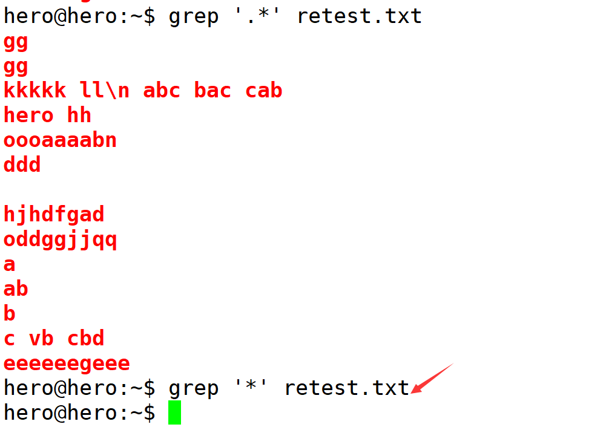

`grep '*' retest.txt`匹配不到任何东西，因为你根本没有指定前导字符啊。

***


匹配空行。

***


匹配`abc`这3个字符的任意组合。

****

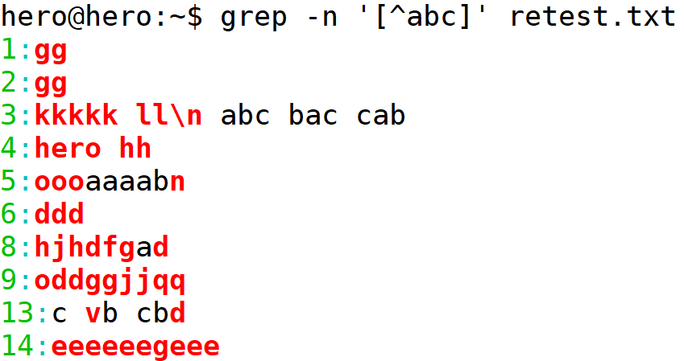

**==不要匹配`abc`这3个字符的任意组合==**。

***


**==匹配以a，或以b，或以c开头的单个字符==**。

***


**匹配不以a，或不以b，或不以c开头的单个字符**。

***

### 正则中其他常用元字符

| 元字符    | 功能                                    | 备注         |
| --------- | --------------------------------------- | ------------ |
| `\<`      | 取单词的头                              |              |
| `\>`      | 取单词的尾                              |              |
| `\< \>`   | 精确匹配                                |              |
| `\{n\}`   | 匹配前导字符连续出现n次                 |              |
| `\{n,\}`  | 匹配前导字符至少出现n次                 |              |
| `\{n,m\}` | 匹配前导字符出现n次与m次之间            |              |
| `\( \)`   | **保存被匹配的字符**    保存`abc`。     | `\(abc\)`    |
| `\d`      | 匹配数字（**grep -P**）                 | [0-9]        |
| `\w`      | 匹配字母数字下划线（**grep -P**）       | [a-zA-Z0-9_] |
| `\s`      | 匹配空格、制表符、换页符（**grep -P**） | [\t\r\n]     |

***

准备文本：

```txt
ggle
gogle
google
gooogle
goooooogle
gooooooogle
taobao.com
taotaobaobao.com

jingdong.com
dingdingdongdong.com
10.1.1.1
Adfjd8789JHfdsdf/
a87fdjfkdLKJK
7kdjfd989KJK;
bSKJjkksdjf878.
cidufKJHJ6576,

hello world
helloworld yourself
```

***


匹配单词的头。

***


匹配单词的尾。

***


==**这样就精确的匹配了**`world`**这个单词**，等价于`w`这个参数==。


****


`g`是固定的，前导字符`o`要出现两次。

***


前导字符`o`至少出现两次，注意和只出现两次对比。

***


前导字符`o`至少出现2到4次。

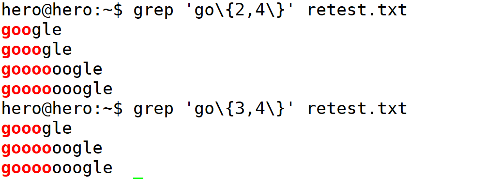

***


**==匹配前导字符是任意数字(0到9范围的)，出现两个，不要求连续(即一样)，只能这么记住了==**!!!

***

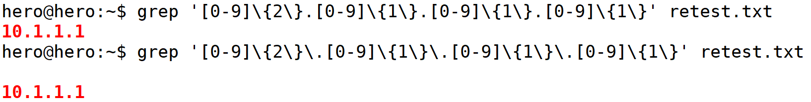

这个`.`是元字符，这个元字符的意思是匹配任意单个字符。按道理，它本身也能够匹配。所以是不用进行转义的.

这样就能够匹配出这个`ip`地址了。

***


*****


`\1`这个标签就代表`10.1.1`。vim是支持正则表达式匹配的。

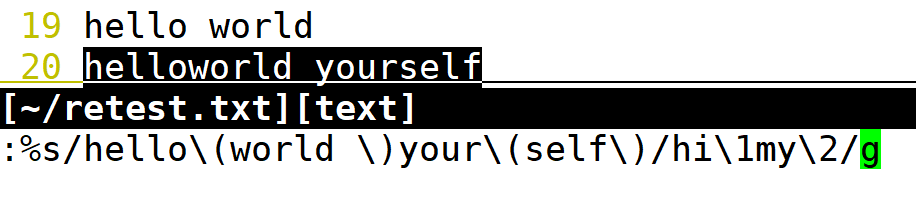


将helloworld yourself替换为hiworld myself。

***


没有`-P`这个参数是不行的。

***


***


### 扩展类正则常用元字符

**丑话说在前面：**

我说我比较特殊，你要相信！否则我错给你看:smirk:

- grep你要用我，必须加 **-E** 或者 让你兄弟`egrep`来找我
- sed你要用我，必须加 **-r** 或-E

| 扩展元字符 | 功能                       | 备注                                         |
| ---------- | -------------------------- | -------------------------------------------- |
| +          | **匹配一个或多个前导字符** | bo+ 匹配boo、 bo                             |
| ?          | 匹配`零个`或`一个`前导字符 | bo? 匹配b、 bo  可不能匹配boo                |
| `|`        | 或                         | 匹配a或b                                     |
| ()         | 组字符（看成整体）         | (my\|your)self：表示匹配myself或匹配yourself |
| {n}        | 前导字符重复n次            |                                              |
| {n,}       | 前导字符重复至少n次        |                                              |
| {n,m}      | 前导字符重复n到m次         |                                              |


****

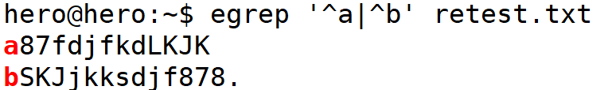

***


以`a`开头或者包含`b`。

***


匹配`a8`或`b8`。

***


**==匹配前导字符g出现两次==**。

***


**前面确定是`g`，后面是任意字符出现0次或1次**。

***

## 第二类正则

使用`man tr`可以查到这个表。

| 表达式    | 功能                             | 示例            |
| --------- | -------------------------------- | --------------- |
| [:alnum:] | 字母与数字字符                   | [[:alnum:]]+    |
| [:alpha:] | 字母字符(包括大小写字母)         | [[:alpha:]]{4}  |
| [:blank:] | 空格与制表符                     | [[:blank:]]*    |
| [:digit:] | 数字                             | [[:digit:]]?    |
| [:lower:] | 小写字母                         | [[:lower:]]{4,} |
| [:upper:] | 大写字母                         | [[:upper:]]+    |
| [:punct:] | 标点符号                         | [[:punct:]]     |
| [:space:] | 包括换行符，回车等在内的所有空白 | [[:space:]]+    |

```
[root@server shell05]# grep -E '^[[:digit:]]+' 1.txt  
[root@server shell05]# grep -E '^[^[:digit:]]+' 1.txt
[root@server shell05]# grep -E '[[:lower:]]{4,}' 1.txt
```

**扩展正则需要加**`-E`。

## 6. 正则表达式总结

## 正则表达式总结

**把握一个原则，让你轻松搞定可恶的正则符号：**

1. 我要找什么？
   - 找数字 [0-9]
   - 找字母 [a-zA-Z]
   - 找标点符号 [[:punct:]]
2. 我要如何找？看心情找
   - 以什么为首 ^key
   - 以什么结尾 key$
   - 包含什么或不包含什么 `[abc]` `^[abc]` `[^abc]` `^[^abc]`
3. 我要找多少呀？
   - 找前导字符出现0次或连续多次 ab==*==
   - 找任意单个(一次)字符 ab==.==
   - 找任意字符 ab==.*==
   - 找前导字符连续出现几次 {n} {n,m} {n,}
   - 找前导字符出现1次或多次 go==+==
   - 找前到字符出现0次或1次 go==?==

### 正则元字符一栏表

**元字符**：在正则中，具有特殊意义的专用字符，如: 星号(*)、加号(+)等

**前导字符**：元字符前面的字符叫前导字符

| 元字符           | 功能                                     | 示例              |
| ---------------- | ---------------------------------------- | ----------------- |
| *                | 前导字符出现0次或者连续多次              | ab* abbbb         |
| .                | 除了换行符以外，任意单个字符             | ab. ab8 abu       |
| .*               | 任意长度的字符                           | ab.* adfdfdf      |
| []               | 括号里的任意单个字符或一组单个字符       | `[abc][0-9][a-z]` |
| [^]              | 不匹配括号里的任意单个字符或一组单个字符 | [^abc]            |
| ^[]              | 匹配以括号里的任意单个字符开头           | ^[abc]            |
| `^[^]`           | 不匹配以括号里的任意单个字符开头         | `^[^abc]`         |
| ^                | 行的开头                                 | ^root             |
| $                | 行的结尾                                 | bash$             |
| ^$               | 空行                                     |                   |
| `\{n\}`和{n}     | 前导字符连续出现n次                      | [0-9]\{3\}        |
| `\{n,\}`和{n,}   | 前导字符至少出现n次                      | [a-z]{4,}         |
| `\{n,m\}`和{n,m} | 前导字符连续出现n-m次                    | go{2,4}           |
| `\<\>`           | 精确匹配单词                             | \<hello\>         |
| `\(\)`           | 保留匹配到的字符                         | \(hello\)         |
| +                | 前导字符出现1次或者多次                  | [0-9]+            |
| ?                | 前导字符出现0次或者1次                   | go?               |
| \|               | 或                                       | ^root\|^ftp       |
| ()               | 组字符                                   | (hello\|world)123 |
| \d               | perl内置正则                             | grep -P \d+       |
| \w               | 匹配字母数字下划线                       |                   |

### 正则练习作业

#### 1. 文件准备

```
# vim test.txt 
Aieur45869Root0000
9h847RkjfkIIIhello
rootHllow88000dfjj
8ikuioerhfhupliooking
hello world
192.168.0.254
welcome to uplooking.
abcderfkdjfkdtest
rlllA899kdfkdfj
iiiA848890ldkfjdkfj
abc
12345678908374
123456@qq.com
123456@163.com
abcdefg@itcast.com23ed
```

#### 2. 具体要求

```shell
1、查找不以大写字母开头的行（三种写法）。
grep '^[^A-Z]' 2.txt
grep -v '^[A-Z]' 2.txt
grep '^[^[:upper:]]' 2.txt
2、查找有数字的行（两种写法）
grep '[0-9]' 2.txt
grep -P '\d' 2.txt
3、查找一个数字和一个字母连起来的
grep -E '[0-9][a-zA-Z]|[a-zA-Z][0-9]' 2.txt
4、查找不以r开头的行
grep -v '^r' 2.txt
grep '^[^r]' 2.txt
5、查找以数字开头的
grep '^[0-9]' 2.txt
6、查找以大写字母开头的
grep '^[A-Z]' 2.txt
7、查找以小写字母开头的
grep '^[a-z]' 2.txt
8、查找以点结束的     # 这个就必须要转义了
grep '\.$' 2.txt  
9、去掉空行
grep -v '^$' 2.txt
10、查找完全匹配abc的行
grep '\<abc\>' 2.txt
11、查找A后有三个数字的行
grep -E 'A[0-9]{3}' 2.txt
grep  'A[0-9]\{3\}' 2.txt
12、统计root在/etc/passwd里出现了几次
grep -o 'root' 1.txt |wc -l

13、用正则表达式找出自己的IP地址、广播地址、子网掩码
ifconfig eth0|grep Bcast|grep -o '[0-9]\{1,3\}\.[0-9]\{1,3\}\.[0-9]\{1,3\}\.[0-9]\{1,3\}'
ifconfig eth0|grep Bcast| grep -E -o '([0-9]{1,3}.){3}[0-9]{1,3}'
ifconfig eth0|grep Bcast| grep -P -o '\d{1,3}.\d{1,3}.\d{1,3}.\d{1,3}'
ifconfig eth0|grep Bcast| grep -P -o '(\d{1,3}.){3}\d{1,3}'
ifconfig eth0|grep Bcast| grep -P -o '(\d+.){3}\d+'

# egrep --color '[0-9]{1,3}\.[0-9]{1,3}\.[0-9]{1,3}\.[0-9]{1,3}' /etc/sysconfig/network-scripts/ifcfg-eth0
IPADDR=10.1.1.1
NETMASK=255.255.255.0
GATEWAY=10.1.1.254

# egrep --color '[[:digit:]]{1,3}\.[[:digit:]]{1,3}\.[[:digit:]]{1,3}\.[[:digit:]]{1,3}' /etc/sysconfig/network-scripts/ifcfg-eth0 
IPADDR=10.1.1.1
NETMASK=255.255.255.0
GATEWAY=10.1.1.254


14、找出文件中的ip地址并且打印替换成172.16.2.254
grep -o -E '([0-9]{1,3}\.){3}[0-9]{1,3}' 1.txt |sed -n 's/192.168.0.\(254\)/172.16.2.\1/p'

15、找出文件中的ip地址
grep -o -E '([0-9]{1,3}\.){3}[0-9]{1,3}' 1.txt

16、找出全部是数字的行
grep -E '^[0-9]+$' test
17、找出邮箱地址
grep -E '^[0-9]+@[a-z0-9]+\.[a-z]+$'


grep --help:
匹配模式选择：
Regexp selection and interpretation:
  -E, --extended-regexp     扩展正则
  -G, --basic-regexp        基本正则
  -P, --perl-regexp         调用perl的正则
  -e, --regexp=PATTERN      use PATTERN for matching
  -f, --file=FILE           obtain PATTERN from FILE
  -i, --ignore-case         忽略大小写
  -w, --word-regexp         匹配整个单词
  
```


# Shell好用的工具： cut

## 目标

使用cut可以切割提取指定列\字符\字节的数据


## 介绍

`cut`  译为“剪切, 切割”  ,  是一个强大文本处理工具，它可以将文本按列进行划分的文本处理。cut命令逐行读入文本，然后按列划分字段并进行提取、输出等操作。


## 语法

```shell
cut [options]  filename
```

**注：可以是重定向文件**。


options参数说明

| 选项参数            | 功能                                                         |
| ------------------- | ------------------------------------------------------------ |
| **==-f 提取范围==** | 列号，获取第几列。                                           |
| -d 自定义分隔符     | 自定义分隔符，**默认为制表符(你最好指明)**。                 |
| -c **==提取范围==** | 以字符为单位进行分割                                         |
| -b **==提取范围==** | 以字节为单位进行分割。这些字节位置将忽略多字节字符边界，除非也指定了 -n 标志。 |
| -n                  | **==与“-b”选项连用，不分割多字节字符==**；                   |

**==提取范围说明==**

| 提取范围  | 说明                                                         |
| --------- | ------------------------------------------------------------ |
| n-        | 提取指定第n列或字符或字节后面所有数据(**==包含n==**)         |
| n-m       | 提取指定第n列或字符或字节到第m列或字符或字节中间的所有数据(**==前闭后闭==**) |
| -m        | 提取指定第m列或字符或字节前面所有数据(**==包含m==**)         |
| n1,n2,... | **提取指定枚举列的所有数据**                                 |


## 示例：切割提取指定列数据

cut1.txt文件数据准备

```shell
touch cut1.txt
```

编辑文件添加内容

```shell
AA  itheima 11 XX
BB  itcast 22 XXX
CC  Shell 33 XXXX
DD  it 44 XXXXXXX
```

提取文件中第一列数据

```shell
cut cut1.txt -d " " -f 1
```


提取文件中第一列,第三列, 枚举查找

```shell
cut cut1.txt -d " " -f 1,3
```


***

**提取文件中第二列到第五列, 范围查找**。


***

提取文件中第二列及后面所有列的数据

```shell
 cut cut1.txt -d " "  -f 2- 
```


提起文件中结束列及前面所有列的数据

```shell
cut -d " " -f -5 cut1.txt
# -5 提取指定列前面所有列数据
```

运行效果

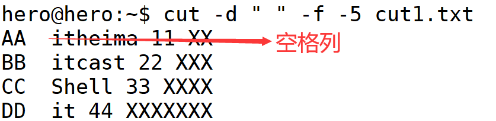

## 示例: 切割提取指定字符数据

提取每行前4个字符

```shell
cut cut1.txt -c 1-4
```

运行效果


提取每行第4个字符及以后的数据

```shell
cut cut1.txt -c 4-
```

运行效果


提取每行第3个字符及前面所有字符

```shell
cut cut1.txt -c -3
```

运行效果


**==注意第3个字符是空格==**。

***


## 示例：切割提取指定字节数据

提取字符串"abc传智播客" 前3个字节

```shell
echo "abc传智播客" | cut -b -3
```

运行效果


提取字符串"abc传智播客" 前4个字节

```shell
echo "abc传智播客" | cut -b -4
```

运行效果


提取字符串"abc传智播客" 前6个字节

```shell
echo "abc传智播客" | cut -b -6
# 由于linux系统默认utf-8码表, 所以一个汉字占3个字节
```

运行效果

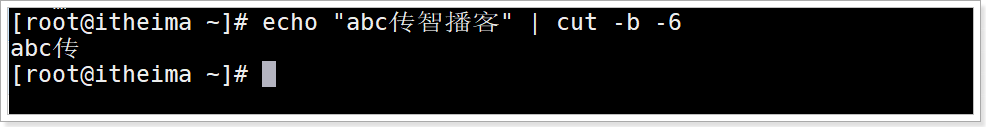

提取字符串"abc传智播客" 前4个字节, 就可以将汉字 "传"输出,

```shell
echo "abc传智播客" | cut -nb -4
#  -n 取消多字节字符分割直接输出
```

运行效果


## 示例：切割提取指定单词数据

**==在cut1.txt文件中切割出"itheima"==**

**==注意这个的前提是我们已经把前面的两个空格改为了一个空格，方便处理==**。

```shell
cat cut1.txt | grep itheima | cut -d " " -f 2
```


****


**==先使用cat过滤出想要的行，再将结果交给cut使用==**。


## 示例：切割提取bash进程的PID号

命令

```shell
ps -aux | grep 'bash' | head -n 1 | cut -d " " -f 8
```

运行效果


****


`ubuntu`**==是第9列==**。

**==这里我们说一下这个是怎么按空格切割的，反正黑色部分空格是7个，所以是7列==**。

## 示例：切割提取IP地址

```shell
ifconfig | grep broadcast | cut -d " " -f 10
```

运行效果

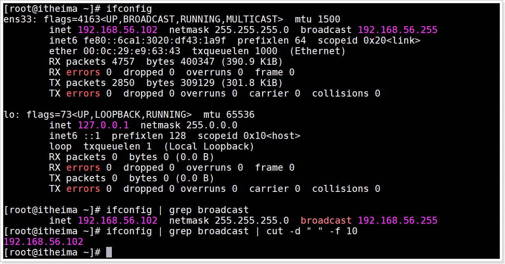

`broadcast`**==在第二行是唯一的==**。

****


**==这里只是碰巧第一行的第10列是空格，所以我们能拿到一个空格(空行)和ip地址(这俩是在同一列)==**。

## 小结

cut的作用

> **一个强大文本处理工具，它可以将文本==按列进行划分==的文本处理。==cut命令逐行读入文本==，然后按列划分字段并进行提取、输出等操作**。

cut切割提取列

> `cut  文件或数据 -d 分隔符切割 -f 提取第x列 `

cut切割提取字符

> `cut  文件或数据 -c 提取字符范围 `

cut切割提取字节

> `cut  文件或数据 -nb 提取字节范围 `

# Shell好用的工具：sed

## 目标

**==使用sed编辑文件替换文件中的单词==**

编写在文件中插入或修改行的sed程序

使用sed作为过滤器来过滤管道数据命令


## 介绍

**==sed （stream editor, 流编辑器） 是Linux下一款功能强大的非交互流式文本编辑器(vim是交互式文本编辑器)，可以对文本文件的每一行数据匹配查询之后进行`增、删、改、查`等操作，支持按`行`、按`字段`、按`正则`匹配文本内容，灵活方便，特别适合于大文件的编辑==**.

**sed是一种流编辑器，它一次处理一行内容,  将这行放入缓存(缓存空间称为：模式空间)，然后才对这行进行处理，处理完后，==将缓存区的内容发送到终端==**。

## sed处理数据原理


## 语法

```shell
sed [选项参数] [模式匹配/sed程序命令] [文件名]

# 模式匹配,sed会读取每一行数据到模式空间中, 之后判断当前行是否符合模式匹配要求,符合要求就会
#     执行sed程序命令, 否则不会执行sed程序命令;如果不写匹配模式,那么每一行都会执行sed程序命令
```

选项参数说明

| 选项参数                         | 功能                                                         |
| -------------------------------- | ------------------------------------------------------------ |
| `-e`                             | 直接在指令列模式上进行sed的动作编辑。**它告诉sed将下一个参数解释为一个sed指令**，==只有当命令行上给出多个sed指令时才需要使用-e选项;一行命令语句可以执行多条sed命令== |
| `-i`                             | **==直接对内容进行修改，不加-i时默认只是预览，不会对文件做实际修改==** |
| `-f`                             | 后跟保存了sed指令的文件                                      |
| `-n`                             | **取消默认输出，sed默认会输出所有文本内容，==使用-n参数后只显示处理过的行==** |
| `-r ruguler              `or`-E` | **==使用扩展正则表达式，默认情况sed只识别基本正则表达式==** * |


sed程序命令功能描述

| 命令 | 功能描述                                              |
| ---- | ----------------------------------------------------- |
| `a`  | **add新增，a的后面可以接字串，==在下一行出现==**      |
| `c`  | **change更改, 更改匹配行的内容**                      |
| d    | **delete删除, 删除匹配的内容**                        |
| `i`  | **insert插入, 向匹配行前插入内容，在前一行出现**      |
| `p`  | **print打印, 打印出匹配的内容，==通常与-n选项和用==** |
| s    | **==substitute替换, 替换掉匹配的内容==**              |
| `=`  | **==用来打印被匹配的行的行号==**                      |
| `n`  | 读取下一行，遇到n时会自动跳入下一行                   |

特殊符号

| 命令                | 功能描述                                                     |
| ------------------- | ------------------------------------------------------------ |
| `!`                 | 就像一个sed命令，放在限制条件后面, 对指定行以外的所有行应用命令(取反) |
| {sed命令1;sed命令2} | **==多个命令操作`同一行`，多个命令用分号分隔==**             |


## 数据准备

sed.txt文件内容

```shell
ABC
itheima itheima
itcast
123
itheima
```

****

* 说明一下这个`-n`参数。使用-n参数后只显示处理过的行。

  * 对于添加，修改。我们仅使用-n参数，就能够做到只打印出修改过的行。

    

    删除的话，删了就是删了，无法获取到删除的行。这个p命令根本就没有地方加到添加和修改的合适位置，你总不能`sed -n '3affff;p' sed.txt`或`sed -n '3d;p' sed.txt`

    

    **这样子就是执行两条命令了**。

    

    **==或者不识别分号==**。

    

  * **==对于，替换，查询。有了-n参数，还必须配和p命令才能打印出修改过或查询出的行。==**


## 示例：向文件中添加数据

### 演示1: 指定行号的前或后面添加数据

**向第三行后面添加**hello

```shell
 sed '3ahello' sed.txt
```

> 3 , **==代表第三行==**
>
> a,  代表在后面添加, 出现在下一行
>
> **==注意这里没有修改源文件==**

运行效果


向第三行前面添加hello

```shell
 sed '3ihello' sed.txt
```

> 3 , 代表第三行
>
> **==i,  代表在前面添加, 出现在上一行==**
>
> 注意这里没有修改源文件

运行效果


### 演示2: **==指定内容前或后面添加数据==**

向内容 `itheima` 后面添加 `hello` ，如果文件中有多行包括 ``itheima``，则每一行后面都会添加

```shell
sed '/itheima/ahello' sed.txt
```

`/文本/`是正则表达式，匹配想要的文本。**==你把这个整体当成前面的3不就好了吗==**。

运行效果


**==向内容 `itheima` 前面添加 `hello` ，`如果文件中有多行包括` `itheima `，则每一行前面都会添加==**

```shell
sed '/itheima/ihello' sed.txt
```

运行效果

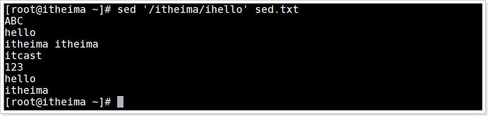

### 演示3: 在最后一行前或后添加hello

在最后一行后面添加hello

```shell
sed '$ahello' sed.txt
```

> $:  **==代表最后一行。那么第一行是什么？当然是1了！！！==**

运行效果


在最后一行前面添加hello

```shell
sed '$ihello' sed.txt
```

> $:  代表最后一行

运行效果


## 示例: 删除文件中的数据

### 演示1: 删除第2行

命令

```shell
sed  '2d' sed.txt
# d 用于删除
# 2d 删除第2行


# sed -i '/^$/d' sed.txt 删除文件中的空行
```

运行效果


**==命令: 删除第1行,第4行数据==**

```shell
sed '1d;4d' sed.txt
sed  '3affff;4aggggg' sed.txt  # 不可以ffff;4aggggg被视为一个整体
```

运行效果


### 演示2: **==删除奇数行==**

**==从第一行开始删除，每隔2行就删掉一行==**

```shell
sed '1~2d' sed.txt
# 1~2 从第1行开始, 每隔2行
sed '2~2d' sed.txt  # 删除偶数行

sed '1~2aggg' sed.txt # 可以
```

运行效果

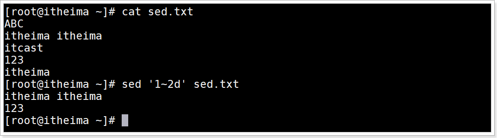

***


**==说明，这种不含有歧义的大家都是通用的，而`sed '1d;4d' sed.txt`这样的在做添加时就含有歧义，不通用==**。

### 演示3:  删除指定范围的多行数据

**==删除从第1行到第3行的数据==**

```shell
sed '1,3d' sed.txt
# 1,3  从指定第1行开始到第3行结束
```

运行效果


### 演示3:  删除指定范围取反的多行数据

**==删除从第1行到第3行`取反`的数据==**

```shell
sed '1,3!d' sed.txt
# 1,3! 从指定第1行开始到第3行结束取反, 就是不在这个范围的行
```

运行效果


### 演示4: 删除最后一行

命令

```shell
sed  '$d'   sed.txt
```

运行效果


### 演示5: 删除匹配itheima的行

命令

```shell
sed '/itheima/d' sed.txt
```

运行效果


### 演示6: 删除匹配行到最后一行

**==删除匹配itheima行到最后一行==** , 命令

```shell
sed '/itheima/,$d' sed.txt
# , 代表范围匹配
```

运行效果


### 演示7: 删除匹配行及其后面一行

**==删除匹配itheima行及其后面一行==**

```shell
sed '/itheima/,+1d' sed.txt
```

运行效果


### 演示9: 删除不匹配的行

删除不匹配 `itheima` **==或==** `itcast` 的行

```shell
sed '/itheima\|itcast/!d' sed.txt  

# \| 是正则表达式的或者 这里|需要转义, 所以为\|  必须要有转义
# ! 取反
```


运行效果


## 示例：更改文件中的数据

### 演示1:将文件的第一行修改为hello

命令

```shell
sed  '1chello'  sed.txt
```

运行效果

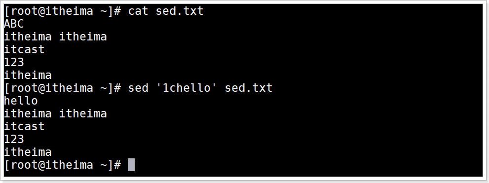

### 演示2: 将包含itheima的行修改为hello

**==命令==**

```shell
sed  '/itheima/chello' sed.txt
```

运行效果


### 演示3: 将最后一行修改为hello

命令

```shell
sed '$chello' sed.txt
```

运行效果


### 演示4: 将文件中的itheima替换为hello

注意：**==不可以有`sed '1sddd' sed.txt`这种操作。替换时，似乎只能模式匹配==**。

***

将文件中的itheima替换为hello,**==默认只替换每行第一个==**itheima

```shell
sed 's/itheima/hello/'  sed.txt  # s 然后是把什么替换为什么
```

运行效果


> **==注意 `'s/itheima/hello/'`  最后一个`/` 不可少==**

**==将文本中所有的itheima都替换为hello, 全局替换==**

```shell
sed 's/itheima/hello/g'  sed.txt
# g 代表匹配全局所有符合的字符
```


### 演示5: 将每行中第二个匹配替换

**==将每行中第二个匹配的itheima替换为hello 命令==**

```shell
sed 's/itheima/hello/2'   sex.txt
```

运行效果

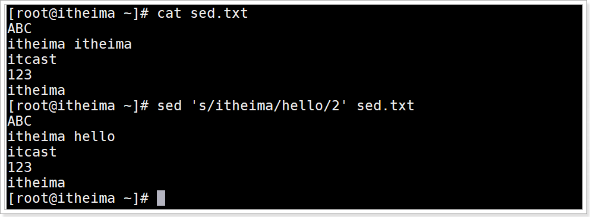

### 演示6: 替换后的内容写入文件

将每行中第二个匹配的itheima替换为hello ,  将替换后的内容写入到sed2.txt文件中

```shell
# 第一种方式
sed -n 's/itheima/hello/2pw sed2.txt' sed.txt  # 在终端只打印你修改的行 不能是wp
# w写入
# p打印, -n只是获取

# 第二种方式 重定向取代w
sed -n 's/itheima/hello/2p' sed.txt > sed2.txt  # 这个能写入，但是不会打印什么出来
```

运行效果


### 演示7: 正则表达式匹配替换

匹配有 `i` 的行，替换匹配行中 `t` 后的所有内容为空 

```shell
sed '/i/s/t.*//g' sed.txt  #没有g(全局)似乎也可以，最好有吧
# 这个比较特殊，s是放中间的
# //代表空
# .* 是正则表达式，代表任意字符
```

运行效果

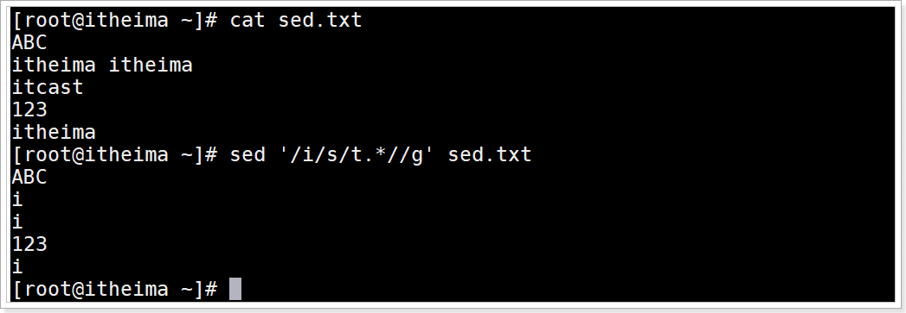

### 演示8: 每行末尾拼接test

```shell
sed 's/$/& test/' sed.txt
# & 用于拼接  可以省略
# $ 代表每行的末尾 正则表达式的$符号就是这个意思啊
# 最后的/不可少，它代表结束
# /文本/ 此处的文本是$
```

运行效果


```shell
sed 's/$/&test/' sed.txt  # 按照下面的行首添加字符串的规则，没有&也可以，所以我尝试了一下。
                          # 确实可以
```


### 演示9: 每行行首添加注释 `#`

命令

```shell
sed 's/^/#/' sed.txt
```

运行效果


## 示例: 查询文件或管道中的数据

### 需求1: 查询含有  `itcast`  的行数据

命令

```shell
sed -n '/itcast/p' sed.txt   # n过滤出想要的 p打印出来 ，没p是不行的
```

运行效果


***


### 需求2: 管道过滤查询

管道查询所有进程中含有sshd的进程信息命令

```shell
 ps -aux | sed -n '/sshd/p' # sed主编辑
 ps -aux | grep sshd   # grep主查询
```

运行效果

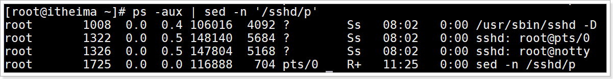

***


## 示例: 多个sed程序命令执行

将sed.txt文件中的第1行删除并将 `itheima` 替换为 `itcast`

```shell
# 第一种方式, 多个sed程序命令 在每个命令之前使用 -e 参数
sed -e '1d' -e 's/itheima/itcast/g' sed.txt 

# 第二种方式
sed  '1d;s/itheima/itcast/g' sed.txt  # 注意 ; 在添加时会被当作插入的文本
```

运行效果

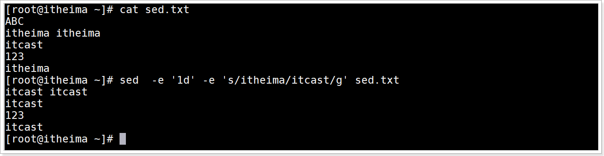

## sed高级用法: 缓存区数据交换

### 模式空间与暂存空间介绍

1. 首先需要明白, sed处理文件是逐行处理的, 即**读取一行处理一行,输出一行**;

2. **sed把文件读出来每一行存放的空间叫==模式空间==, 会在该空间中对读到的内容做相应处理**;

3. **==此外sed还有一个额外的空间即暂存空间, 暂存空间刚开始里边只有个空行(是可以被使用的), 记住这一点==**;

4. sed可使用**相应的命令** **从模式空间往暂存空间放入内容**，或**从暂存空间取内容放入模式空间**;

   > **==2个缓存空间(模式，暂存)传输数据的目的是为了更好的处理数据==**, 一会参考案例学习  

### 关于缓存区sed程度命令

| 命令 | 含义                                                         |
| ---- | ------------------------------------------------------------ |
| h    | 将**模式空间**里面的内容复制到**暂存空间**缓存区(**覆盖**方式) |
| H    | 将**模式空间**里面的内容复制到**暂存空间**缓存区(追加方式)   |
| g    | 将**暂存空间**里面的内容复制到**模式空间**缓存区(**覆盖**方式) |
| G    | 将**暂存空间**里面的内容复制到**模式空间**缓存区(追加方式)   |
| x    | 交换2个空间的内容                                            |


## 示例: 缓存空间数据交换

### 演示1: 第一行粘贴到最后1行

将模式空间第一行复制到暂存空间(覆盖方式),并将暂存空间的内容复制到模式空间中的最后一行(追加方式)

```shell
sed '1h;$G' sed.txt
# 1h 从模式空间中将第一行数据复制到暂存空间(覆盖方式)
# $G 将暂存空间中的内容复制到模式空间中最后一行(追加方式)
# 没有改变原文件内容
```

运行效果


### 演示2: 第一行删除后粘贴到最后1行

将模式空间第一行复制到暂存空间(覆盖方式)并删除, 最后将暂存空间的内容复制到模式空间中的最后一行(追加方式)

```shell
sed '1{h;d};$G' sed.txt
# 1{h;d}对模式空间中的第一行数据同时进行复制到暂存空间(覆盖方式)和删除模式空间中的第一行数据
# 对同一行的数据执行多条命令需要{}包起来
# 显示到终端的都是模式空间的数据
```

运行效果

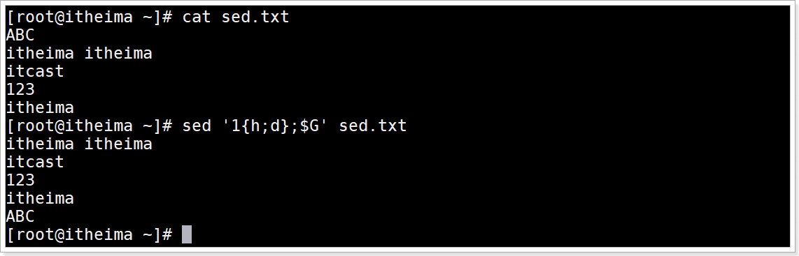

### 演示3: 第一行数据复制粘贴替换其他行数据

将模式空间第一行复制到暂存空间(覆盖方式), 最后将暂存空间的内容复制到模式空间中替换从第2行开始到最后一行的每一行数据(覆盖方式)

```shell
sed '1h;2,$g' sed.txt
# $代表最后一行
# g代表覆盖，而不是全局
```

运行命令


### 演示4: 将前3行数据数据复制粘贴到最后一行

将前3行数据复制到暂存空间(追加方式), 之后将暂存空间的所有内容复制粘贴到模式空间最后一行(追加方式)

```shell
sed '1,3H;$G' sed.txt
```


运行效果


**==注意：这里多了一个空行，它是暂存空间原有的==**。

## 示例: 给每一行添加空行

插入空行

```shell
sed G -i sed.txt
# G 每行后面添加一个空行
# -i 修改源文件
```

运行效果


***

```shell
sed 'a/^$/' sed.txt # 不写行就是默认对每一行都操作 a命令将它后面的无论什么都当作字符串!!!
```

运行效果


***

```shell
sed '1~1aryy' sed.txt # 这样也是对每一行都操作
```


运行效果


***
```shell
sed 'a\ ' sed.txt
sed '1~1a\ ' sed.txt   #等价上面条命令
```

运行效果


**==这样子，我们也能通过a命令在每一行后面添加一个空行==**。

## 示例: 删除所有的空行

命令

```shell
sed -i '/^$/d' sed.txt
```

运行效果


# Shell好用的工具：awk

## 介绍

awk是一个强大的文本分析工具，相对于`grep`的**查找**，`sed`的**编辑**，`awk`在其**对数据分析并生成报告**时,显得尤为强大。**简单来说awk就是把文件逐行的读入(大家都是逐行的)，==以空格为默认分隔符将每行切片==，切开的部分再进行各种分析处理, 因为切开的部分使用awk可以定义变量,运算符, 使用流程控制语句进行深度加工与分析**。

> 创始人 Alfred V. **A**ho、Peter J. **W**einberger和Brian W. **K**ernighan  awk由来是姓氏的首字母

## 语法

```shell
awk [options] 'pattern{action}' {filenames}
```

> pattern：**==表示AWK在数据中查找的内容，就是匹配模式==**
>
> action：**==在找到匹配内容时所执行的一系列命令==**
>

选项参数说明

| 选项参数 | 功能                   |
| -------- | ---------------------- |
| -F       | 指定输入文件拆分分隔符 |
| -v       | 赋值一个用户定义变量   |

## awk内置变量

| 内置变量 | 含义                                                         |
| -------- | ------------------------------------------------------------ |
| ARGC     | 命令行参数个数                                               |
| ARGV     | 命令行参数排列                                               |
| ENVIRON  | 支持队列中系统环境变量的使用                                 |
| FILENAME | awk浏览的文件名                                              |
| FNR      | 浏览文件的记录数                                             |
| FS       | 设置输入域分隔符，等价于命令行 -F选项                        |
| NF       | 浏览记录的域的个数, 根据分隔符分割后的列数                   |
| NR       | 已读的记录数, 也是行号                                       |
| OFS      | 输出域分隔符                                                 |
| ORS      | 输出记录分隔符                                               |
| RS       | 控制记录分隔符                                               |
| `$n`     | `$0`变量是指整条记录(一行，即所有列)。`$1`表示当前行的第一个域(列),`$2`表示当前行的第二个域,......以此类推。 |
| $NF      | $NF是number finally,表示最后一列的信息，跟变量NF是有区别的，变量NF统计的是每行列的总数 |


## 数据准备

```shell
cp /etc/passwd ./
```


## 示例 : 默认每行空格切割数据

命令

```shell
 echo "abc 123 456" | awk '{print $1"&"$2"&"$3}' # 必须要有双引号且不能是单引号
 # 拼接字符串&
```


运行效果

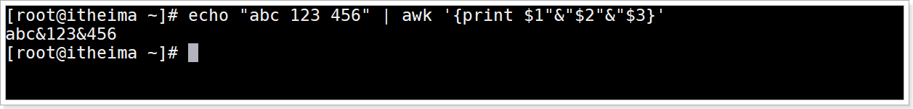


## 示例: 打印含有匹配信息的行

搜索passwd文件有root关键字的所有行，**==默认就是空格切割==**。

```shell
awk '/root/' passwd
# '/root/' 是查找匹配模式, 没有action命令, 默认输出所有符合的行数据

awk '/root/{print $0}' passwd
先找出含有root的所有行，然后同$0打出每一整行
```

运行效果


***

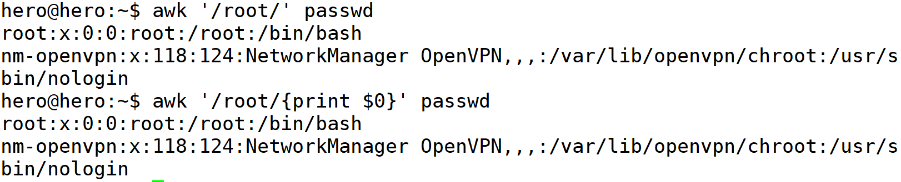

## 示例: 打印匹配行中第7列数据

搜索passwd文件有root关键字的所有行, 然后以":"拆分并打印输出第7列

```shell
awk -F: '/root/{print $7}' passwd
awk -F ":" '/root/{print $7}' passwd
# -F: 以':'分隔符拆分每一个列(域)数据
```

运行效果


***


## 示例: 打印文件每行属性信息

统计passwd:  文件名，每行的行号，每行的列数，对应的完整行内容:

```shell
awk -F ':' '{print "文件名:" FILENAME ",行号:" NR ",列数:" NF ",内容:" $0}' passwd
# "文件名:" 用于拼接字符串
```


运行效果


使用printf替代print,可以让代码阅读型更好

```shell
awk -F ':' '{printf("文件名:%5s,行号:%2s, 列数:%1s, 内容:%2s\n",FILENAME,NR,NF,$O)}' passwd
# printf(格式字符串,变量1,变量2,...)
# 格式字符串: %ns 输出字符串,n 是数字，指代输出几个字符, n不指定自动占长度
# 格式字符串: %ni 输出整数,n 是数字，指代输出几个数字
# 格式字符串: %m.nf 输出浮点数,m 和 n 是数字，指代输出的整数位数和小数位数。如 %8.2f 代表共输出 8 位数，其中 2 位是小数，6 位是整数；
```

运行效果

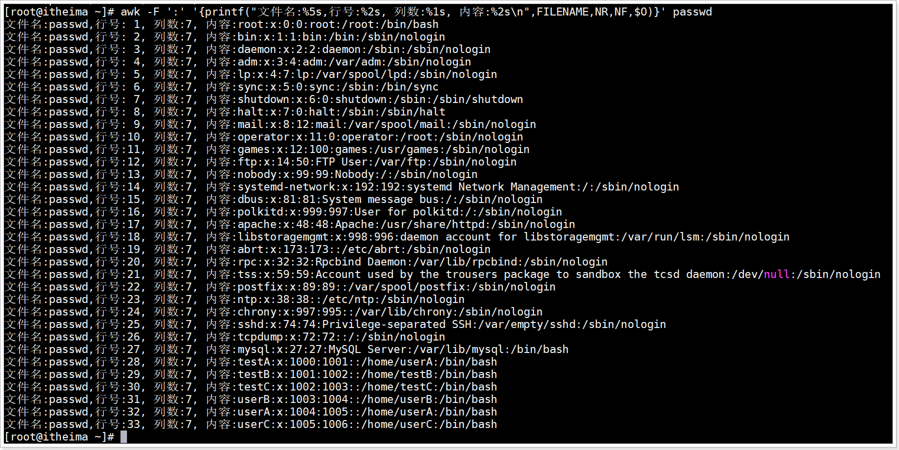


## 示例: 打印第二行信息

打印/etc/passwd/的第二行信息

```shell
awk -F ':' 'NR==2{printf("filename:%s,%s\n",FILENAME,$0)}' passwd # 是双等号
```

运行效果


## 示例: 查找以c开头的资源

awk过滤的使用,  查找当前目录下文件名以c开头的文件列表

```shell
ls -a | awk '/^c/'
```

运行效果


## 示例: 打印第一列

按照":" 分割查询第一列打印输出

```shell
awk -F ':' '{print $1}' passwd
```

运行效果


## 示例: 打印最后1列

按照":" 分割查询最后一列打印输出

```shell
awk -F: '{print $NF}' passwd
```

运行效果


## 示例: 打印倒数第二列

按照":" 分割查询倒数第二列打印输出

```shell
 awk -F: '{print $(NF-1)}' passwd
 # $(NF-N) N是几, 就是倒数第N+1列
```

运行效果


## 示例: 打印10到20行的第一列

获取第10到20行的第一列的信息

```shell
awk -F: '{if(NR>=10 && NR<=20) print $1}' passwd
```

运行效果


## 示例: 多分隔符使用

"one:two/three"字符串按照多个分隔符":"或者"/" 分割, 并打印分割后每个列数据

```shell
echo "one:two/three" | awk -F '[:/]' '{printf("%s\n%s\n%s\n%s\n",$0,$1,$2,$3)}'
```

运行效果

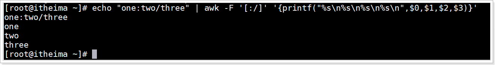

## 示例: 添加开始与结束内容

给数据添加开始与结束

```shell
echo -e  "abc\nabc" | awk 'BEGIN{print "开始..."} {print $0} END{print "结束..."}'

# BEGIN 在所有数据读取行之前执行；END 在所有数据执行之后执行。
```

运行效果


## 示例 : 使用循环拼接分割后的字符串

"abc itheima     itcast   21" 使用空格分割后, 通过循环拼接在一起

```shell
 echo "abc itheima     itcast   21" | awk -v str="" -F '[ ]+' '{for(n=1;n<=NF;n++){ str=str$n} print str }'
 
 # -v 定义变量
```

运行效果


## 示例: 操作指定数字运算

将passwd文件中的用户id增加数值1并输出

```shell
 echo "2.1" | awk -v i=1 '{print $0+i}'
```

运行效果


## 示例: 切割ip

切割IP

```shell
ifconfig | awk '/broadcast/{print}' | awk -F " " '{print $2}'
```

运行效果


***

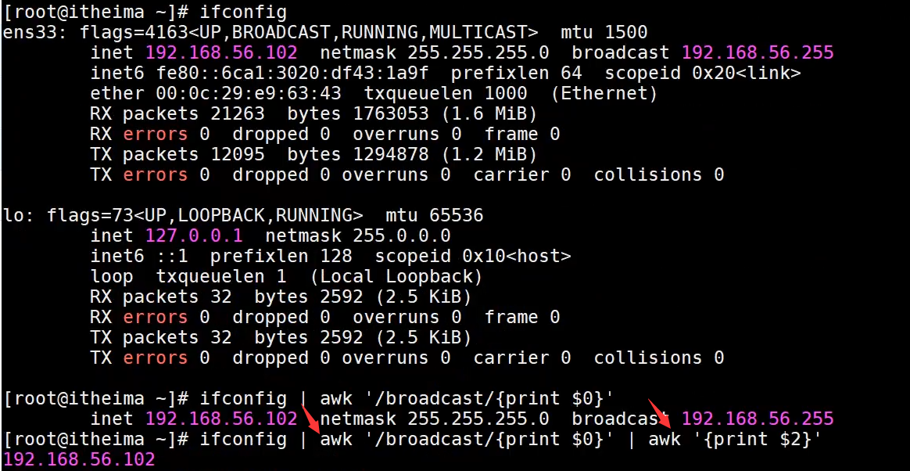

**==它是非常强大的，即使有很多空格，也只视作一个==**。


## 示例: 显示空行行号

查询sed.txt中空行所在的行号

```shell
sed 'G' sed.txt | awk '/^$/{print NR}'
```

运行效果

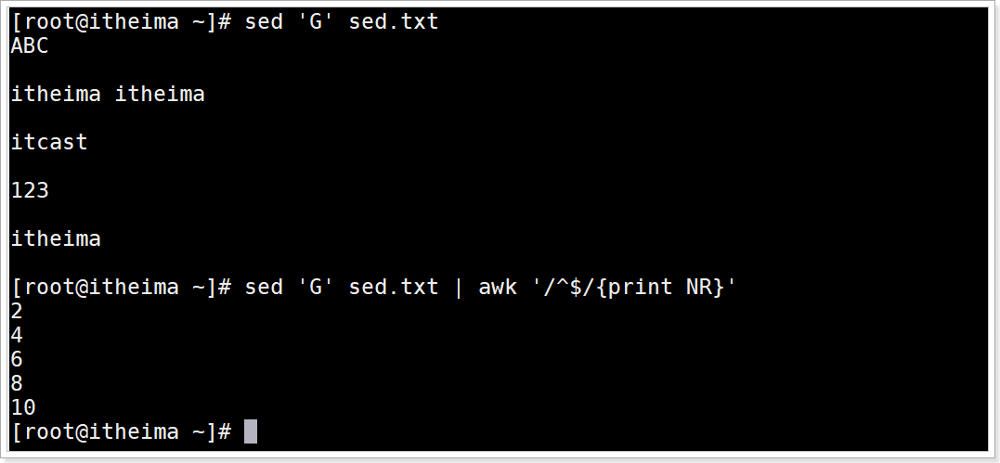

**==这是没有改变原始文件内容的==**。

## 小结

grep , sed ,awk , cut 文本字符串操作四剑客的区别

> grep：用于查找匹配的行
>
> cut：  截取数据. 截取某个文件中的列, 重点是按照列分割,  这个命令不适合截取文件中有多个空白字符的字段
>
> sed： 增删改查数据. sed用于在文件中以行来截取数据进行增\删\改\查
>
> awk：截取分析数据.  可以在某个文件中是以竖列来截取分析数据,  如果字段之间含有很多空白字符也可以获取需要的数据, awk是一种语言,可以深入分析文件数据


# Shell好用的工具：sort

## 目标

能够使用sort对字符串升序或降序排序

能够使用sort 对数字升序或降序

能够使用sort 对多列进行排序


## 介绍

sort命令是在Linux里非常有用，它将文件进行排序，并将排序结果**标准输出**或**重定向输出到指定文件**。

## 语法

```shell
sort (options) 参数
```

| 选项            | 说明                                                     |
| --------------- | -------------------------------------------------------- |
| ==-n==          | number,依照数值的大小排序                                |
| ==-r==          | reverse, 以相反的顺序来排序                              |
| ==-t 分隔字符== | 设置排序时所用的分隔字符, 默认空格是分隔符               |
| ==-k==          | **==指定需要排序的列==**                                 |
| -d              | 排序时，处理英文字母、数字及空格字符外，忽略其他的字符。 |
| -f              | 排序时，将小写字母视为大写字母                           |
| -b              | 忽略每行前面开始出的空格字符                             |
| ==-o 输出文件== | 将排序后的结果存入指定的文件                             |
| -u              | **==意味着是唯一的(unique)，输出的结果是去完重了的==**   |
| -m              | 将几个排序好的文件进行合并                               |

参数：指定待排序的文件列表

## 数据准备

sort.txt文本文件代码

```shell
张三 30  
李四 95  
播仔 85 
播仔 85
播仔 86
AA 85
播妞 100
```

## 示例1: 数字升序

按照“ ”空格分割后的第2列数字升序排序。

```shell
sort -t " " -k2n,2 sort.txt
sort -t " " -nk2,2 sort.txt   //用这个
# -t " " 代表使用空格分隔符拆分列
# -k 2n,2 代表根据从第2列开始到第2列结束进行数字升序, 仅对第2列排序 否则是第2列及后面所有列
# -n  代表按照数值进行排序
```

运行效果


## 示例2: 数字升序去重

先按照`" "`空格分割, 然后按照第2列数字升序排序,  最后对所有列去重

```shell
 sort -t " " -nk2,2 -uk1,2 sort.txt  # 1,2表示第一列到第2列 这是范围不是枚举值
 sort -t " " -nk2,2 -uk1 sort.txt   # 等价 按第一列及以后的排序
```

运行效果

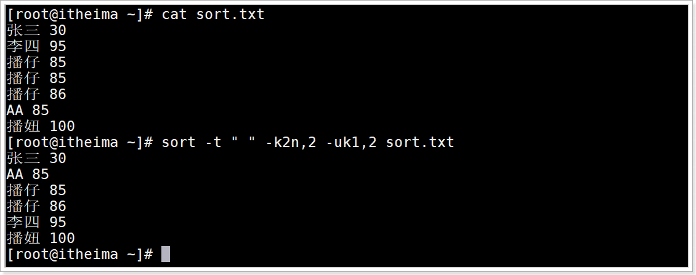

> 注意: 先排序再去重

## 示例3: 数字升序去重结果保存到文件

命令

```shell
sort -t " " -k2n,2 -uk1,2 -o sort2.txt sort.txt
sort -t " " -k2n,2 -uk1,2  sort.txt > sort3.txt
```

运行效果

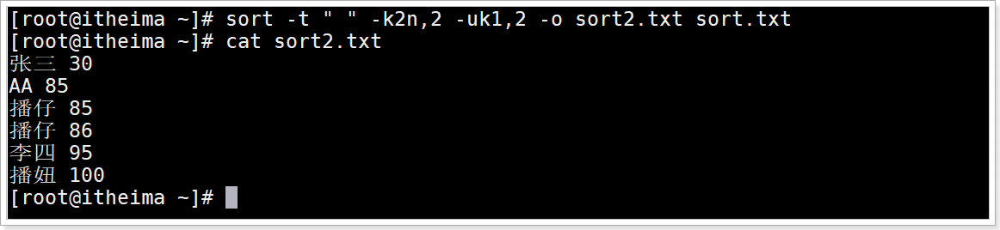

## 示例4: 数字降序去重

**==去重一定要放到排序之后==**。

```shell
sort -t " " -k2nr,2 -uk1,2 sort.txt  # 加一个-r参数即可 
```

运行效果


## 示例5: 多列排序

数据准备sort3.txt

```shell
公司A,部门A,3
公司A,部门B,0
公司A,部门C,10
公司A,部门D,9
公司B,部门A,30
公司B,部门B,40
公司B,部门C,43
公司B,部门D,1
公司C,部门A,30
公司C,部门B,9
公司C,部门C,100
公司C,部门D,80
公司C,部门E,60
```

要求:  **==以","分割先对第一列字符串升序,  再对第3列数字降序==**

```shell
sort -t "," -k1,1 -k3nr,3 sort3.txt
```

运行效果


## 小结

能够使用sort对**==字符串==**升序或降序排序，默认就是字符串。

> 字符串升序: `sort -kstart,end 文件`
>
> 字符串降序: `sort -kstartr,end 文件`

能够使用sort 对数字升序或降序

> 数字升序: `sort -kstartn,end 文件`
>
> 数字降序: `sort -kstartnr,end 文件`

能够使用sort 对多列进行排序

> `sort -kstart[nr],end  -kstart[nr],end ... 文件`


# 面试题：查空行

问题：使用Linux命令查询file.txt中空行所在的行号

file1.txt数据准备

```shell
itheima itheima

itcast
123

itheima
```


答案：

```shell
awk '/^$/{print NR}' file1.txt
```

若不是行号：

```shell
sed -n '/^$/p' sed.txt
grep -n '^$' sed.txt   # 不需要/文本/ 直接文本
```


运行效果


# 面试题：求一列的和

问题：有文件file2.txt内容如下:

```shell
张三 40
李四 50
王五 60
```


使用Linux命令计算第二列的和并输出

```shell
awk '{sum+=$2} END{print "求和: "sum}' file2.txt  # 直接写变量名sun即可
```


运行效果


```txt
张三 40 30                                                                   
李四 50 50
王五 60 20
```


# 面试题：检查文件是否存在

问题：Shell脚本里如何检查一个文件是否存在？如果不存在该如何处理？

答: 

```shell
if [ -e /root/file1.txt ]; then  echo "文件存在"; else echo "文件不存在"; fi
```

运行效果

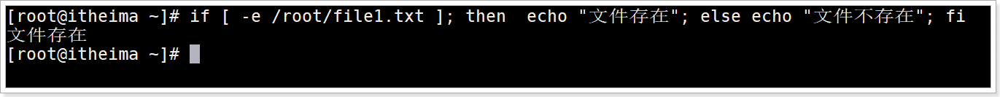


# 面试题：数字排序

问题：用shell写一个脚本，对文本中无序的一列数字排序

cat file3.txt文件内容

```shell
9
8
7
6
5
4
3
2
10
1
```

答

```shell
sort -n file3.txt | awk '{sum+=$1; print $1} END{print "求和: "sum}'
# 很明显，有多少行sum+=$1; print $1就会循环多少次
```

运行效果

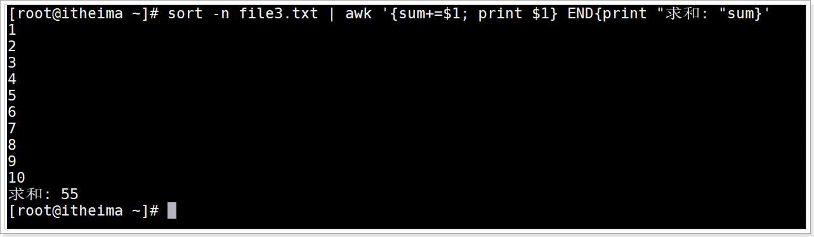


# 面试题：搜索指定目录下文件内容

问题：请用shell脚本写出查找当前文件夹（/root）下所有的文本文件内容中包含有字符”123”的文件名称?

答:

```shell
grep -r "123" /root | cut -d ":" -f 1| sort -u # -r代表搜索文件内容
```

运行效果


# 面试题：批量生成文件名

问题: 批量生产指定数目的文件,文件名采用"纳秒"命名

答: file4.sh

```shell
#!/bin/bash
read -t 30 -p "请输入创建文件的数目:" n
test=$(echo $n | sed 's/[0-9]//g') #检测非数字输入
if [ -n "$n" -a -z "$test" ] # 检测空输入 判断字符串最好加上双引号，不然出错
then
        for ((i=0;i<$n;i=i+1 ))
        do
                name=$(date +%N)
                [ ! -d ./temp ] &&  mkdir -p ./temp
                touch "./temp/$name"
                echo "创建 $name 成功!"
        done
        else
                echo "创建失败"
                exit 1
fi
```

运行效果


# 面试题：批量改名

问题: 将/root/temp目录下所有文件名重命名为"旧文件名-递增数字"?

重命名命令

```shell
rename 旧文件名 新文件名 旧文件所在位置
```

脚本代码file5.sh

```shell
#!/bin/bash
filenames=$(ls /root/temp)
number=1
for name in $filenames
do
        printf "命令前:%s" ${name}
        newname=${name}"-"${number}
        rename $name ${newname} /root/temp/*
        let number++ #每个改名后的文件名后缀数字加1
        printf "重命名后:%s \n" ${newname}
done
```

运行效果

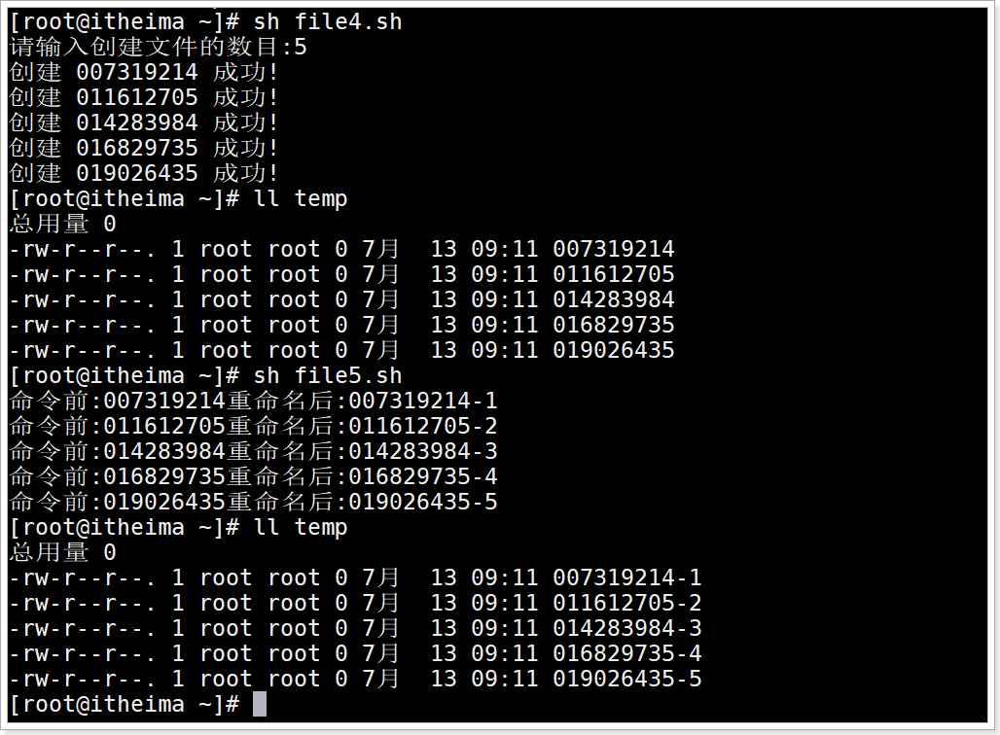

# 面试题：批量创建用户

问题: 根据users.txt中提供的用户列表,一个名一行, 批量添加用户到linux系统中

已知users.txt数据准备

```shell
user1
user2
```


知识点分析1: 添加用户命令

```shell
useradd 用户名
```

知识点分析2: 设置每个用户密码默认密码

```shell
echo "123456" | passwd --stdin 用户名
```

运行效果


面试题答案: 脚本代码file6.sh

```shell
#!/bin/bash
ULIST=$(cat /root/users.txt)  ##/root/users.txt  里面存放的是用户名，一个名一行
for UNAME in $ULIST
do
        useradd $UNAME
        echo "123456" | passwd --stdin $UNAME &>/dev/null
        [ $? -eq 0 ] && echo "$UNAME用户名与密码添加初始化成功!"
done
```

运行效果


# 面试题：筛选单词

问题: 根据给出的数据输出里面单词长度大于3的单词

数据准备

```shell
I may not be able to change the past, but I can learn from it.
```

shell脚本file7.sh

```shell
 echo "I may not be able to change the past, but I can learn from it." | awk -F "[ ,.]" '{for(i=1;i<NF;i++){ if(length($i)>3){print $i}}}'
```

运行效果

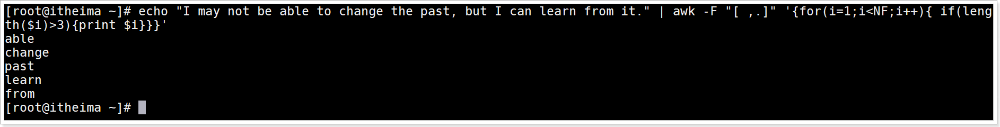


# 面试题：单词及字母去重排序

问题

```dart
1、按单词出现频率降序排序！
2、按字母出现频率降序排序！
```

file8.txt 文件内容

```shell
No. The Bible says Jesus had compassion2 on them for He saw them as sheep without a shepherd. They were like lost sheep, lost in their sin. How the Lord Jesus loved them! He knew they were helpless and needed a shepherd. And the Good Shepherd knew He had come to help them. But not just the people way back then. For the Lord Jesus knows all about you, and loves you too, and wants to help you.
```

按照单词出现频率降序

```shell
awk -F "[,. ]+" '{for(i=1;i<=NF;i++)S[$i]++}END{for(key in S)print S[key],key}' file8.txt |sort -rn|head
```

运行效果


按照字符出现频率降序前10个

```shell
awk -F "" '{for(i=1;i<=NF;i++)S[$i]++}END{for(key in S)print S[key],key}' file8.txt |sort -rn|head
```

运行效果

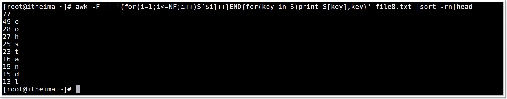

# 面试题：扫描网络内存活主机

问题:  扫描192.168.56.1到192.168.56.254之间ip的是否存活, 并输出是否在线?


服务器ip存活分析

```shell
ping ip地址 -c 2
# 如果ip地址存活发送2个数据包会至少接收返回1个数据包
```

效果如图


完整脚本代码

```shell
#!/bin/bash
count=0
for i  in 192.168.56.{1..254}
do
    # 使用ping命令发送2个包测试, 并获取返回接收到包的个数
    receive=$(ping $i -c 2|awk 'NR==6{print $4}')
    # 接收返回包大于0 说明主机在线
    if [ ${receive} -gt 0 ]
    then
        echo "${i} 在线"
        ((count+=1))
    else
        echo "${i} 不在线"
    fi

done
echo "在线服务器有:"$count"个"
```

运行效果


# 面试题：MySQL分库备份

```shell
#!/bin/sh
user=root      #用户名
pass=root      #密码
backfile=/root/mysql/backup #备份路径
[ ! -d $backfile ] && mkdir -p $backfile #判断是否有备份路径
cmd="mysql -u$user -p$pass"  #登录数据库
dump="mysqldump -u$user -p$pass " #mysqldump备份参数
dblist=`$cmd -e "show databases;" 2>/dev/null |sed 1d|egrep -v "_schema|mysql"` #获取库名列表
echo "需要备份的数据列表:"
echo $dblist
echo "开始备份:"
for db_name in $dblist #for循环备份库列表
do
 printf '正在备份数据库:%s' ${db_name}
 $dump $db_name 2>/dev/null |gzip >${backfile}/${db_name}_$(date +%m%d).sql.gz #库名+时间备份打包至指定路径下
 printf ',备份完成\n'
done
echo "全部备份完成!!!"
```

运行效果

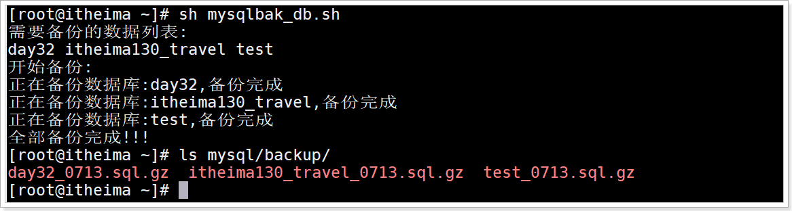

# 面试题：MySQL数据库分库分表备份

```shell
#!/bin/sh
user=root      #用户名
pass=root      #密码
backfile=/root/mysql/backup #备份路径
[ ! -d $backfile ] && mkdir -p $backfile #判断是否有备份路径
cmd="mysql -u$user -p$pass"  #登录数据库
dump="mysqldump -u$user -p$pass " #mysqldump备份参数
dblist=`$cmd -e "show databases;" 2>/dev/null |sed 1d|egrep -v "_schema|mysql"` #获取库名列表
echo "需要备份的数据列表:"
echo $dblist
echo "开始备份:"
for db_name in $dblist #for循环备份库列表
do
 printf '正在备份数据库:%s\n' ${db_name}
 tables=`mysql -u$user -p"$pass" -e "use $db_name;show tables;" 2>/dev/null|sed 1d`
 for j in $tables
  do
    printf '正在备份数据库 %s 表 %s ' ${db_name} ${j}
    $dump -B --databases $db_name --tables $j 2>/dev/null > ${backfile}/${db_name}-${j}-`date +%m%d`.sql
    printf ',备份完成\n'
  done


 printf '数据库 %s 备份完成\n' ${db_name}
done
echo "全部备份完成!!!"
```

运行效果


