# hero

## 音符与唱名

in music，there are 7 basic musical notes which are 

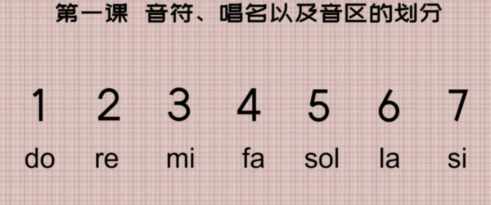

在音乐中有7个基本的(音级？音区？)音符，都是以阿拉伯数字的形式来表现的，但是需要读成它们的唱名。

 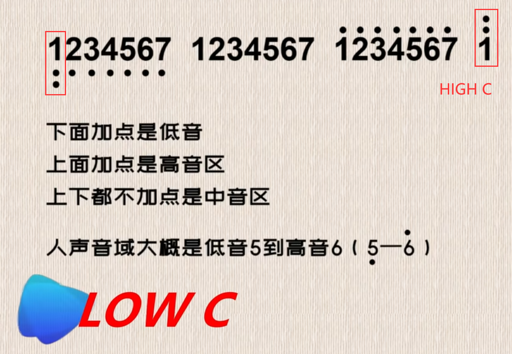

注意一下倍低/高音这个概念/ 

5.到6.是大部分人的，大概两个8度的音域。共16个数字。

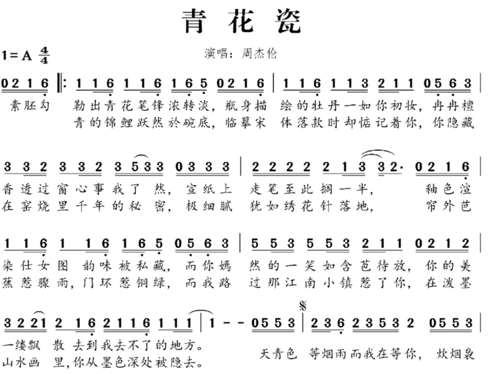

***

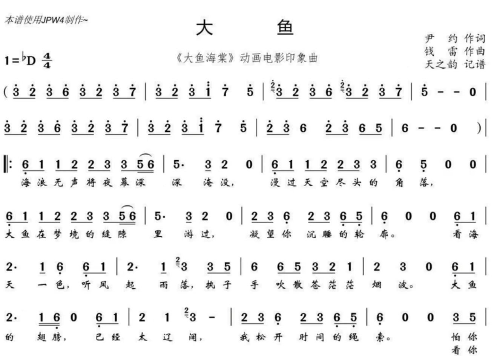

可以观察这些简谱上的音一般也没有超出那个范围。

## 认识四分音符

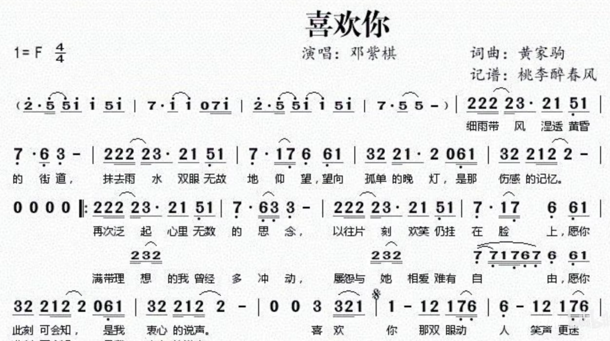

***

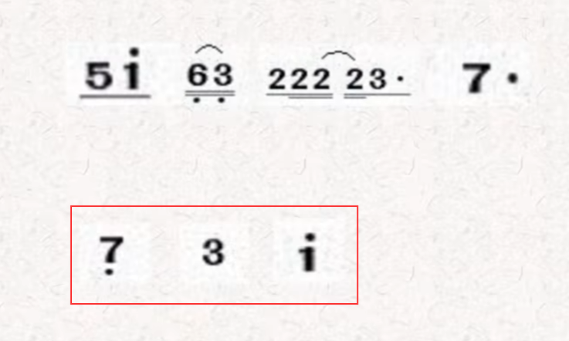

**==提取出关键音符。下面那种纯阿拉伯数字的音符就叫做四分音符，我们目前学到的都是四分音符==**/

> 注意那个是1上面有个点。

**==说到四分音符，我们可以暂时把它理解为一拍==**，那么什么叫做一拍(拍一下手，跺一下脚，敲一下桌子)？

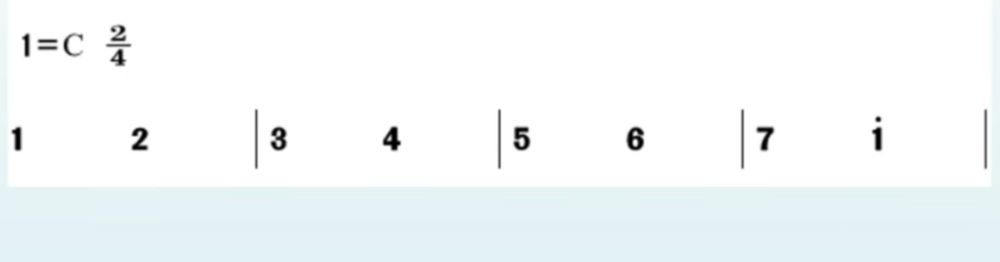

上图中一共有8个四分音符，所以是有8拍。

> while u are practcing u can say "da da da" with your mouth and tap your desk at the same time,but you must keep average speed which is entirely slow or fast.

>why do we call it dotted crotchet?next time i will tell u.

- dotted crotchet

  四分音符; 

- dotted note

  四分音符; 

* quarter note 

  四分音符;

## 调号，拍号，小节线，终止线

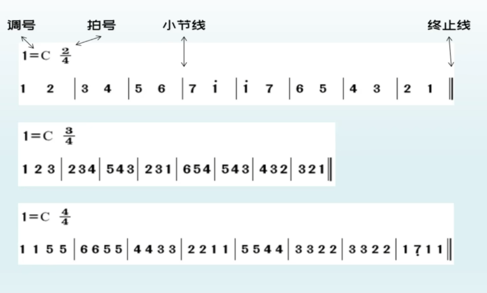

调号目前不是很重要，你知道就行。

小节线是简谱看起来更加的清晰和规整，两个小节线是距离叫做一个节/

拍号的意义：以几分音符为一拍，每小节有几拍。==比如42拍，以4分音符为一拍，每小节有2拍==。看图是很容易懂的/

## 认识二分音符

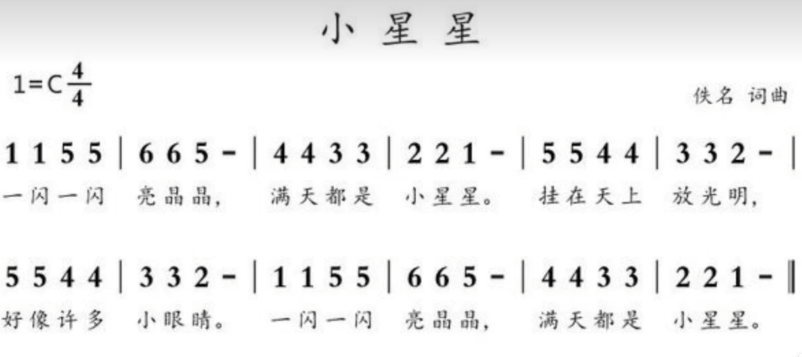

**那条短斜线叫做增时线，意思就是增加它前面那个音符是时值/(延长它的时间)，本来那个5是只唱一拍的，但是现在它需要唱两拍**/  `5 -`是一个二分音符/

二分音符的打法，嘴里只发一次音，但是需要打满两拍/

二分音符代表两拍，四分音符代表一拍。

> you can watch the section more times.

此处是以四分音符为一拍，每小节有4拍/

## 认识八分音符

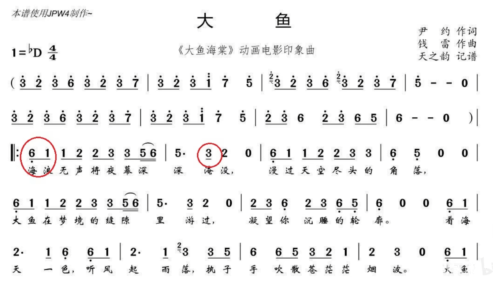

**==只要是下面有一条横线的就叫做8分音符==**。

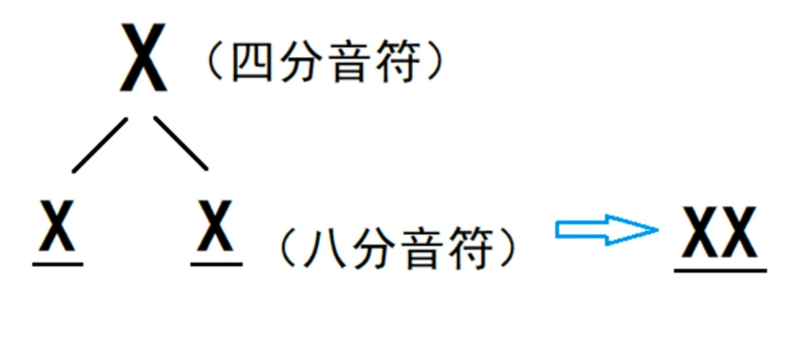

**一个四分音符是一拍，一个八分音符是半拍，两个八分音符组成一拍。**

**当两个八分音符写在一起的时候，就要写成右边的这种形式。**

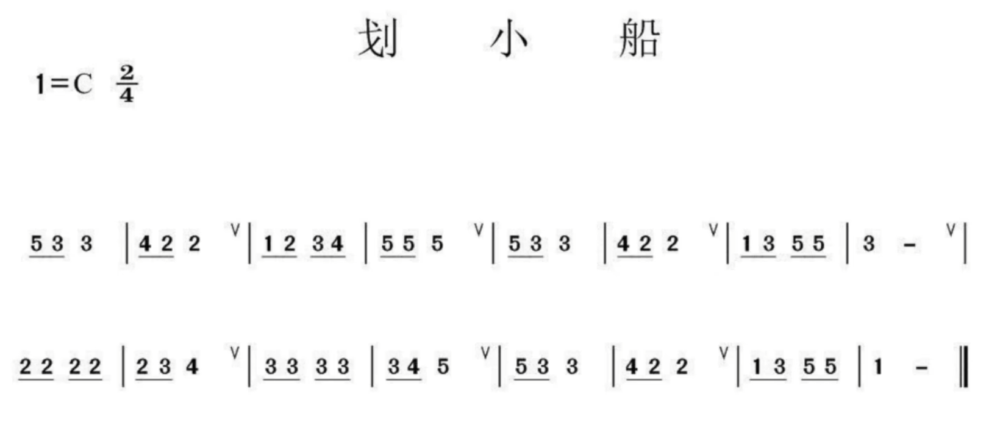

这张图包含了2，4，8分音符。

8分音符的节奏如何打？其实敲桌子的动作可以分为：**==敲下去的过程是前半拍，手拿起来的过程是后半拍==**，也就是说敲一下需要发出两个da的读音。

**==那个V是换气记号==**。

这节需要多练习这个节奏。

## 认识十六分音符

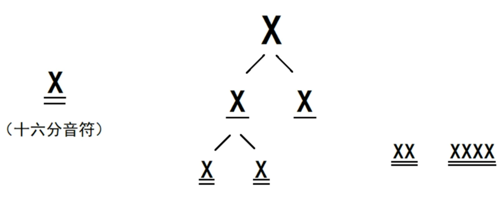

一个四分音符是一拍，一个八分音符是半拍，一个十六分音符是1/4拍。

16分音符的节奏如何打？其实敲桌子的动作可以分为：敲下去的==过程==是前半拍，手拿起来的过程是后半拍，也就是说敲前半下需要发出两个da的读音。

## 认识附点音符

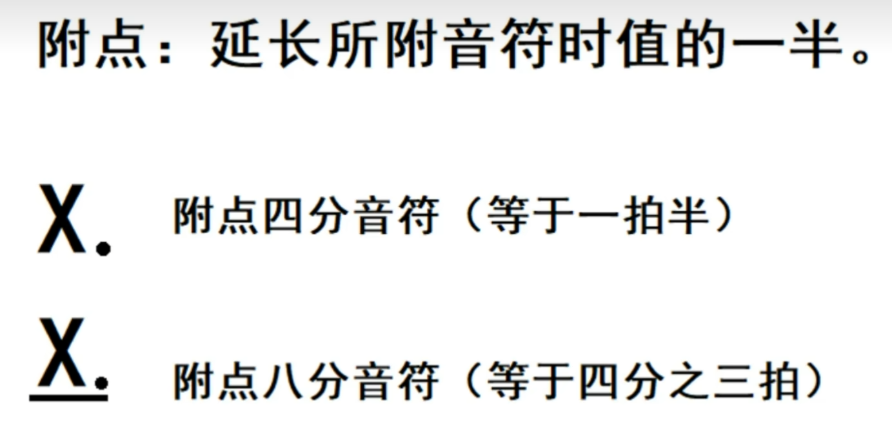

四分音符为一拍，附点就是二分之一拍/

八分音符为二分之一拍，附点就是四分之一拍，共计四分之三拍

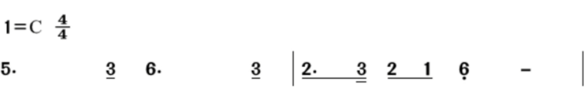

***

**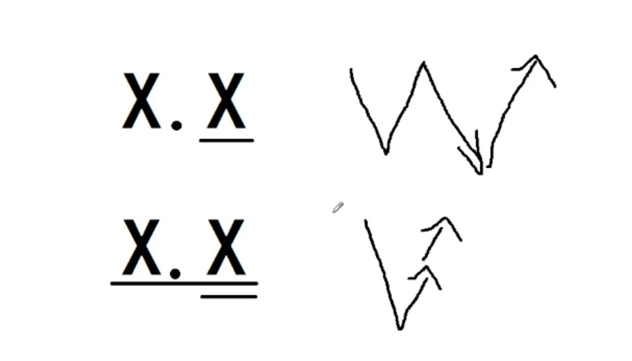**

一个附点四分音符加上一个八分音符，附点四分音符一拍半，八分音符半拍。**==总共两个大==**。

一个附点8分音符加上一个16分音符。附点八分音符是四分之三拍，16分音符是四分之一拍，合计一拍。大得，这个得非常短。

注意：一拍就是手拍下桌子再拿起来。

虽然这两种节奏型都是附点音符的节奏，但是上面那种是两拍，称作大附点。

下面那种是一拍，称作小附点。

这节的末尾还需再看。

## 认识全音符

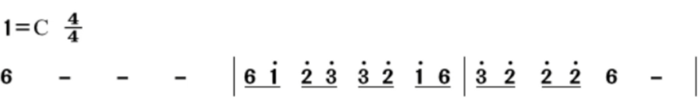

全音符：`6 - - - `，四拍/

这节需要再看。

## 认识音符关系图

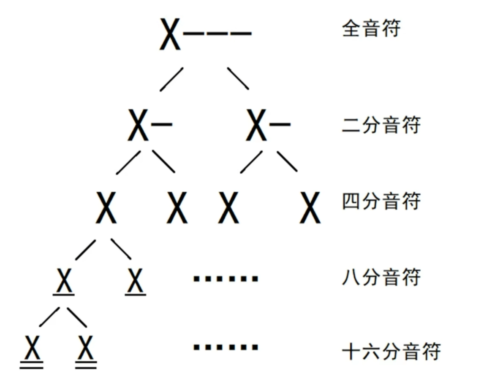

拍数：4 2 1 1/2 1/4 。