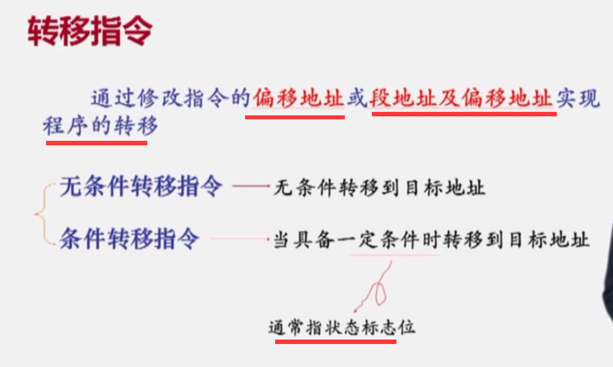
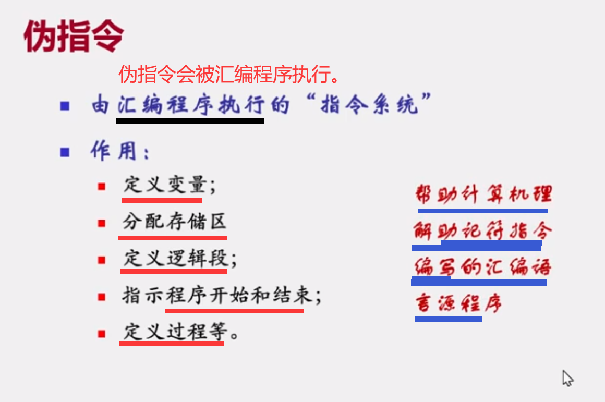
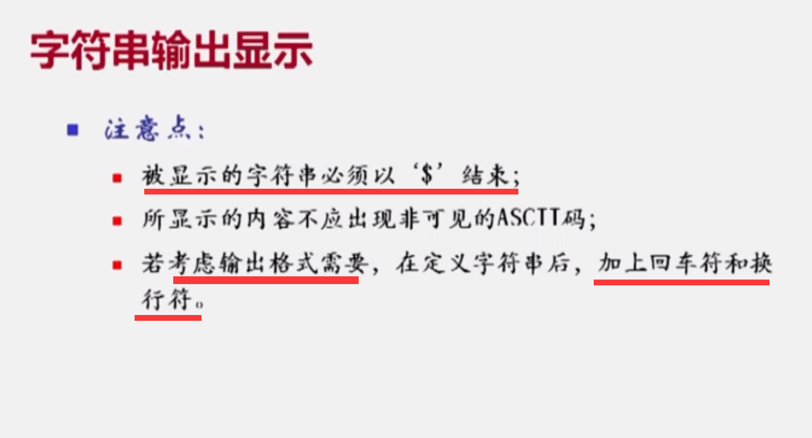
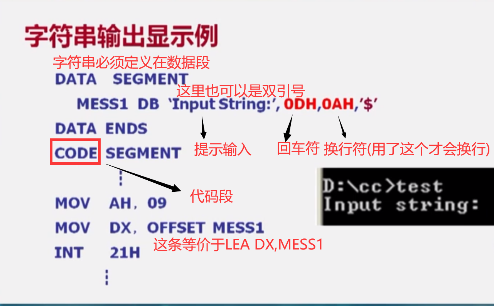
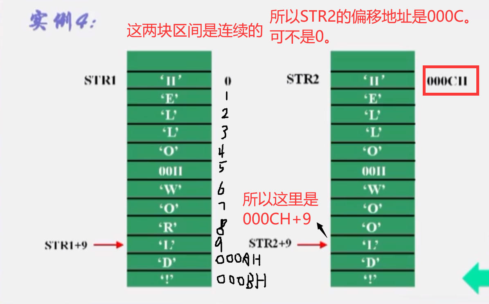

# 第一章

* ==间址(间接寻址)寄存器(或称地址指针)包括基址寄存器BX,基址指针寄存器BP，一组变址寄存器SI,DI。==

  ==若选用BP作为间址寄存器，则操作数在堆栈段，段基地址由SS决定。==

  ==若选其它三个，则操作数在数据段，段基地址由DS决定。==


****

`MOV AX,3012H ` 立即寻址

`MOV AX,[2000H]` 直接寻址

`MOV SI,AX` 寄存器寻址（两个操作数都是寄存器）

`MOV AX,[SI]` 寄存器间接寻址（一个寄存器，一个存储器）

`MOV AX,DATA[BX]`  寄存器相对寻址 （一个寄存器，一个存储器，加一个偏移量）一维数组

`MOV AX,[BX][SI]` 基址-变址寻址 （同时存在基址寄存器和编址寄存器）

`MOV AX,5[DI][BX]` 基址-变址寻址-相对寻址 （同时存在基址寄存器和编址寄存器还有偏移量）二维数组

**==相对就是偏移量==**


## 第二章

### 1.8086/8088CPU中，标志寄存器包含哪此标志位?各位为0(为1) 分别表示什么含义?

* 答案:

  在8086/8088 CPU中,标志寄存器包含以下标志位。
  CF:进位标志位。若算术运算时最高位有进(借)位,则CF=1,否则CF=0。
  PF,奇偶标志位。当运算结果的低8位中1的个数为偶数时,PF=1,为奇数时，PF=0。
  AF:辅助进位标志位。在加(减)法操作中,D。向D有进位(借位)时,AF=1,否则AF=0。
  ZF:零标志位,当**运算结果**为零时,ZF-1,否则ZF=0。
  SF:符号标志位。当运算结果的最高位为1时,SF=1,否则SF=0。OF:溢出标志位。当算术运算的结果溢出时,OF=1,否则OF一0。TF:陷阱标志位。TF=1时,使CPU处于单步执行指令的工作方式。
  IF:中断允许标志位。IF=1时,CPU可以响应可屏蔽中断请求。IF=0时,则禁止响应中断请求。
  DF:方向标志位。DF=1时,串操作按减地址方式进行。DF=0时,串操作按增地址方式进行。

### 3.8086/8088CPU中， 有哪些通用寄存器和专用寄存器?说明它们的作用。

* 解:(1)通用寄存器包括:
  ①数据寄存器AX、BX,CX和 DX。它们一般用于存放参与运算的数据或运算的结果。除此之外:
  ·AX主要存放算术逻辑运算中的操作数,以及存放I/O操作的数据。·BX存放访问内存时的基地址。
  第2章微型计算机基础
  -CX在循环和串操作指令中用作计数器。
  **·DX在寄存器间接寻址的1/O指令中存放1/O地址。在做双字长乘除法运算时,DX 与AX合起来存放一个双字长数。**
  ②地址寄存器SP,BP,SI和 DI。SP存放栈顶偏移地址,BP存放访问内存时的基地址。SP和BP也可以存放数据,但它们的默认段寄存器都是SS。SI和 DI常在变址寻址方式中作为索引指针。
  (2）专用寄存器包括:
  ①段寄存器CS,DS,ES和SS。其中,CS是代码段寄存器,SS是堆栈段寄存器，DS是数据段寄存器,ES是附加数据段寄存器。段寄存器用于存放段起始地址的高16位。
  控制寄存器IP,FLAGS。IP(Instruction Pointer)称为指令指针寄存器,用于存放预取指令的偏移地址。CPU取指令时总是以CS为段基址,以IP为段内偏移地址。当CPU 从 CS段中偏移地址为(IP)的内存单元中取出指令代码的-个字节后,IP自动加1，指向指令代码的下一个字节。用户程序不能直接访问IP。FLAGS称为标志寄存器或程序状态字(PSW),它是16位寄存器,但只使用其中的9位,这9位包括6个状态标志和3个控制标志(参见主教材中图2-9)。

### 4.在8088CPU中， 物理地址和逻辑地址是指什么?已知逻辑地址为1F 00：38A0H，如何计算出其对应的物理地址?若已知物理地址.其逻辑地址唯一吗?

* 解:物理地址是CPU存取存储器所用的地址。逻辑地址是段和偏移形式的地址,即汇编语言程序中使用的存储器地址。
  若已知逻辑地址为 1F00:38A0H,则对应的物理地址=1F00×16＋38AO=228AOH。若已知物理地址,其逻辑地址不是唯一的。一个物理地址可以对应于不同的逻辑地址。如228A0H对应的逻辑地址可以是1F00H:38A0H,2000H:28A0H、2200H:08A0H等。


# 第三章

### 1.串操作

* 1. 
  2. 
  3. 
  4. 

### 2.程序控制指令说明

* 1. 
  2. 
  3. 

### 2.1转移类指令1

* 1. 
  2. 
  3. 
  4. 
  5. 
  
  * ==注意目标地址放在某个16位存储器或寄存器的某两个单元中，所以直接是IP=[MEM]（MEM代表存储器）.==
  
    ==而不是IP=IP+偏移量。==
  
  6. 
  
  * **数据高位送IP高位，数据低位送到IP的低位。**
  
  ******
  
  1. 
  2. 
  
  * **请记住，我们JMP后面的操作数是什么形式，他都是转移的目标地址。jmp label算也是系统去算(IP=IP+偏移量)，我们只认为是转移到符号label所在的地址即可。**
  * **这个段间间接转移是不用FAR的。**
  
* ==16位：段内转移。==

* ==32位：段间转移==。

### 3.1过程调用指令

* 1. 
  2. 


### 3.2中断指令

* 1. 
  2. 
  3. 

## # 第四章

## 1. 汇编语言源程序

* 1. 
  2. 
  3. 
  4. 
  5. 
  6. 
  7. 
  8. 
  9. 
  10. 
  11. 

## 2.1伪指令1

* 1. 
  2. 
  3. 
  4. 
  5. 
  6. 
  * DB **代表字节，一个字节是一个单元，所以我们在画的时候要只画一个格子。使用DB后面==可以只跟一个元素，也可以跟多个元素(数组)==**。但是每个元素的大小不要超过数据范围。
  
    如`DATA DB 8871H `肯定是错的，因为超出了数据范围。可以看到，汇编中也是先定义变量，后定义类型。
  
    **==另外。字符的本质也是整型，所以我们可以用DB来定义字符或字符串。而且规定，字符串的定义必须使用DB伪指令。==**
  
    另外，注意`'A'`的ascii码是`41H`，空格的ascii码是`20H`。数字0的ascii码是`30H`
  
  * DW **代表一个字，即两个字节，所以我们在画的时候要画两个格子**。所以如果你定义了`DATA DW 11H`，**==即使你只是写了==`11H`，==但是它实际上是==`0011H`**，在内存中占两个内存单元。所以我们在画时要画两个格子.
  
    **==注意上面是低地址(存放数据低位)（栈底），下面是高地址(存放数据高位)（栈顶）。==**
  
    下面的DD同理。
  
  * DD代表双字，即4个字节(int),所以我们在画的时候要画4个格子。
  7. 
  8. 
  9. 
  10. 
  11. 
  12. 

## 2.2伪指令2

* 1. 
  2. 
  3. 
* 就像我们每一层楼的房间，第一个房间的编号通常都是1一样，不会从第10号开始去编码。所以我们在逻辑段中第一个变量的偏移地址是从0开始编号的。所以这里MEM1它的偏移地址就是0。因为MEM1占用了两个字节的空间，所以我们可以得到MEM2的偏移地址就是2。MEM3以此类推。
* 我们定义的这个逻辑段，名字是DATA，里面也定义了三个变量，但是这个DATA类型的段到底是什么性质的段呢。我们刚才说因为它里面定义的是变量，我们认为它肯定不是代码段，但它是不是数据段，或者是不是附加段，还是堆栈段呢？我们并不知道。所以，用段定义伪指令，我们只是完成了对一个逻辑段的声明。但是我们并没有声明这个逻辑段的性质。所以下面，我们要来看第四类伪指令，也就是也就是设定段寄存器伪指令。
* 这个伪指令说明所定义的逻辑段的性质到底是属于什么性质的逻辑段。
* 我们知道一个程序模块中，我们通常只能有一个逻辑段，刚好我们有4个段寄存器。我们知道，我们一共有4个段寄存器，每一个段寄存器中它的内容，性质都非常的唯一。就是对应逻辑段的段基地址。那么我们因为只有四个段寄存器，所以我们一个程序模块中，通常只能有4个逻辑段，每一个逻辑段对应着一个段寄存器。因此，段寄存器的名字就和逻辑段的名字联系在一起的话，这个逻辑段的性质也就确定了。

* 4. 
* 假设你只声明了一个逻辑段，那个这个段寄存器的名字:段名联系完就结束了。如果你声明了多个逻辑段，那么他们之间用逗号隔开。我们在一个程序中，因为我们说程序的代码一定要放在代码段里，我们的一个源程序中一定要，或者说必须要声明的逻辑段就是代码段。所以这里首先是CS:代码段的名字。通常情况下，我们一个程序一定要有操作的数据，而且这个操作的数据不能仅仅是寄存器，或者是立即数。更多的时候，它实际上来自于内存，因此，我们一般的程序中，还会定义数据段。我们已经讲了那么6大类指令，我们说过，串操作指令它的目标操作数要求必须在附加段，所以在有串操作指令的程序中，我们一定要声明附加段。在有堆栈操作的指令的程序中，我们一定要定义堆栈段。
* 5. 

## 2.3伪指令3

* 1. 

  * 无论你声明了几个逻辑段，哪怕只声明了一个代码段，你也要用END伪指令来结束汇编语言源程序。

  2. 
  
  * 这几条伪指令定义之后，这几个逻辑段的性质才被确定下来。但是在内存中应该占有的区域目前还没有被分配。还应该把相应的段基地址赋给相应的段寄存器，及段寄存器的初始化。只有做了这样的工作，你前面声明的数据段，附加段和堆栈段应该占有的区域系统才会真正的为你分配。也就是说，这个时候，你才真正的占有了你前面所定义的这些存储区。**==只有代码段(的段基地址)不需要初始化，代码段寄存器的值由系统自动的赋给`CS`，不需要你用指令来完成==**。这样准备工作才算是做完了！
  
  3. 

## 2.4伪指令4

* 1. 
  2. 
  3. 
  4. 
  5. 
  6. 
  7. 
  8. 
  9. 

## 3.1系统功能调用1

* ==所谓系统功能调用，主要指的是调用系统BIOS或者操作系统内核的一些功能。==

* 1. 
  2. 
  3. 

  * 关于DOS软中断说明:
    ==是包含多个子功能的功能包;==

    ==各子功能用功能号区分;==
    ==用软中断指令调用，中断类型码固定为21H。==

4. 

## 3.2系统功能调用2

* 1. 
  2. 
  3. 
  4. 
  5. 

  * ==在数据段定义了一个字符输入缓冲区，第一个问号，你可以写成0，也可以是其它任何数字都不要紧。因为等你输入完成后系统会自动更改。但是一定要把这个位置留下来让系统来数你敲了几个键，注意不数回车键==

  6. 
  7. 
  8. 
  9. 
  10. 
  11. 
  12. 
  
  不管是字符串的输入还是输出,我们都要把功能号送到`AH`中,使用`MOV AH,功能号`。
  
  * 单字符输入功能号：`01H`。你可以直接写`MOV AH,1 `,也可以写`MOV AH,01H`。**==写16进制形式加上H。==**
  
    **==另外，输入的字符一定是存放在AL中的。==**
  
  * 字符串输入功能号：`0AH`（10进制的10）。这个建议写`MOV AH,0AH`。
  
    **规定了这种输入的字符串在内存中的起始存放地址**是`DS:DX`，**==所以首先必须把偏移地址送==**`DX`。
  
    **也规定了待输入的字符串必须存放在数据段**。**==就是我们必须在数据段开辟(定义)一个数组来存放要输入字符串。==**
  
    例如：
  
    ```c++
    DAT1 DB 20，?，30 DUP ( ? )
    // 20代表最多输入19个字符，还有一个位置放回车符。。
    // ?那里写0也可以，反正系统最后会自己数的
    // 30代表开了一个大小为30的数组，里面存放的是随机数。就是个未初始化的数组，大小为30啦。
    // 这行规定要在数据段中定义
    
    LEA DX,DAT1  //别人规定这个地址要送到DX里。 等价于MOV DX,OFFSET DAT1
    MOV AH，OAH  //功能号为10. 这句和上句可以互换位置，没有关系的。
    INT 21H
    ```
  
  ***
  
  * 单字符输出功能号：`02H`
  
    规定了待输出字符放`DL`。
  
    例如：该段代码在屏幕上显示`A`字符。
  
    ```c++
    MOV AH，O2H // 我们已经开启了在屏幕上输出一个字符的功能
    MOV DL, 41H // 待输出字符必须存放在DL中
    INT 21H     // 当我们运行到这行代码时，若DL中有字符，那么它会被显示到屏幕上
                // 所以这行代码相当于一个开关
    ```
  
  * 字符串输出功能号：`09H`。
  
    **==规定了这种输出的字符串在内存中的起始存放地址==**是`DS:DX`，**==所以首先必须把偏移地址送==**`DX`。
  
    ==**也规定了待输出的字符串必须定义在数据段。**==
  
    例如：
  
    

## 4.1汇编语言程序示例1

* 1. 
  2. 

  * ==中断指令主要针对的就是系统功能调用。==
  * ==中断码21H是一个大大的功能包。==
  * ==显示单字符的入口参数就是DL，就是把DL中的内容显示到屏幕上。==
* 
  
3. 

  * ==因为这是基址变址相对寻址的方式，那么它在内存中的哪一个逻辑段的性质就是由基址寄存器来确定的。现在这个基址寄存器是BX，说明他是在数据段的。所以转移的目标地址在数据段中，偏移地址为BX+SI+2所指的内存单元开始4个字节的内容。==
  * ==4个单元=4个字节。==

## 4.2汇编语言程序示例2

* 1. 

  * 逻辑段是一个浮动的性质，我们的一个逻辑段和另外一个逻辑段可以是完全不搭边的放在两个很远的地方，我们也可以有一部分重合甚至完全重合(一样)。数据段和附加段是两个不同性质的逻辑段，他们可以同时存在在一个程序模块里头，那么就可以在同一个程序模块里出现，即他们是可以重合的。所以这里两个不同类型的逻辑段同时出现在了一个程序模块里，可以完全使用同样的一块区域，这个是允许的。
  * **==我们千万不要忘记了段寄存器的初始化。==**
  * 段基地址既送给DS，也送给ES。
  * **==源串默认在数据段，可以段重设，但没必要，指针必须是SI来给出，目标串必须是在附加段(不可段重设)，指针必须用DI来表示。所以这也就是我们将数据段和附加段设置为重合段的原因，这样能够让编程更加简单一些。==**
  * 所以我们把STR1的偏移地址送给SI，STR2的偏移地址送给DI。这样的话，CMPSB就默认了附加段和数据段之间的比较了。

  2. 