# hero

## 长度的测量

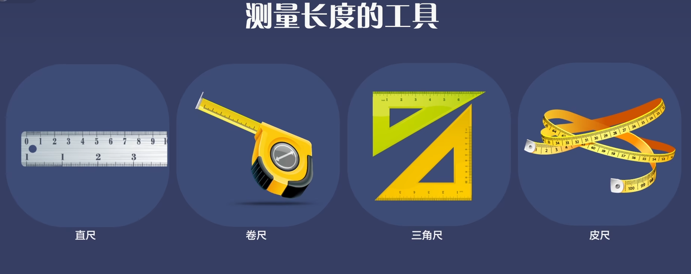

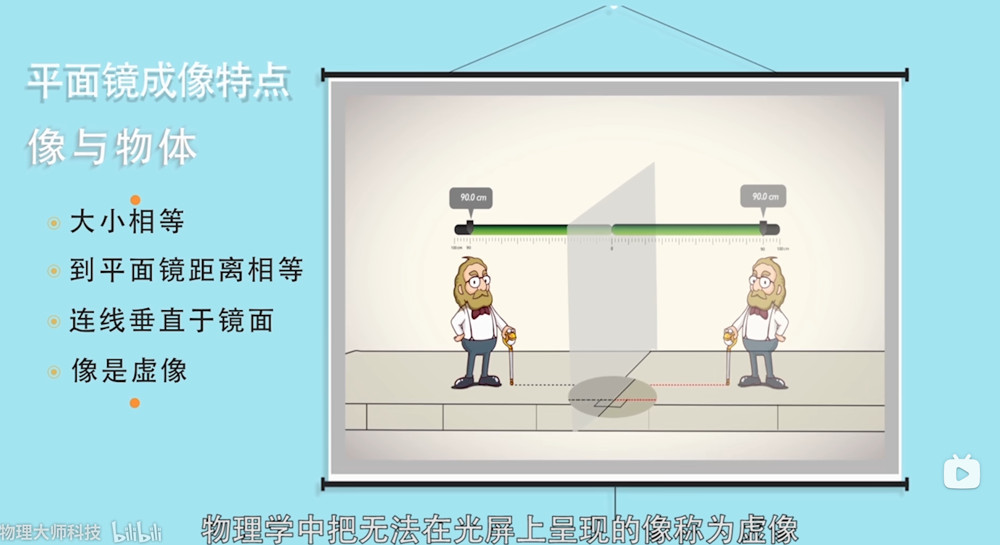

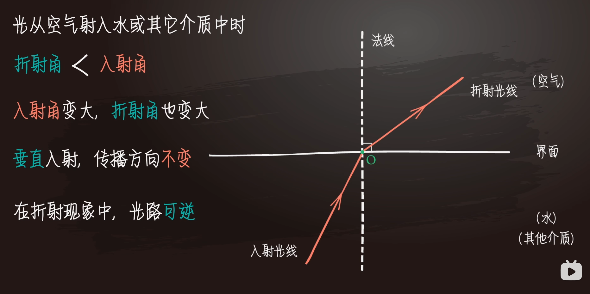

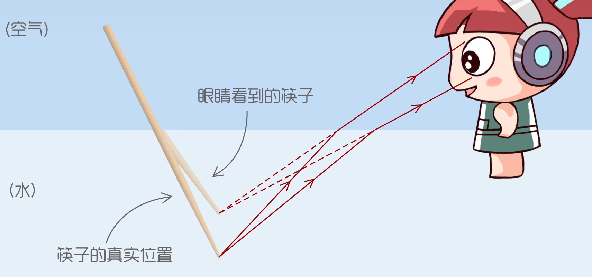

原来，筷子某点反射的光从水中斜射向空气时会发生偏折。逆着折射光看去，会觉得这点的位置升高，所以看起来如同筷子被折断一样。

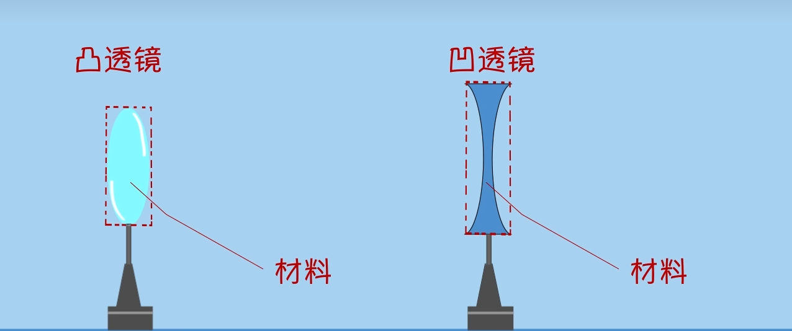

注：材料而不是形状。

透镜指的是光线可以透过的光学仪器，

一般透镜的两个面至少有一面是球面的一部分，如果透镜的厚度远小于球面半径，这种透镜叫做薄透镜。

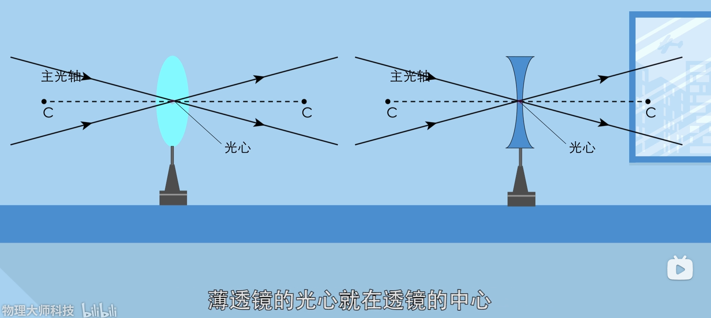

通过两个球面球心的直线叫做主光轴,简称主轴。主轴上有个特殊的点，通过这个点的光的传播方向不发生改变，这个点叫做透镜的光心。

透镜对光有什么作用呢？

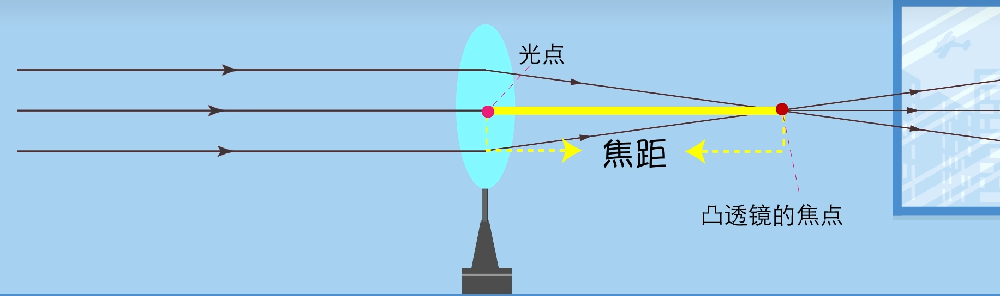

让平行于主光轴的几束光线射向凸透镜，观察光透过透镜后的偏折方向，

发现凸透镜对光有会聚作用，它能使和主光轴平行的光会聚在主光轴上的一点，这个点叫做凸透镜的焦点。

焦点到光心的距离称为焦距。焦距越小，凸透镜的会聚作用越强。

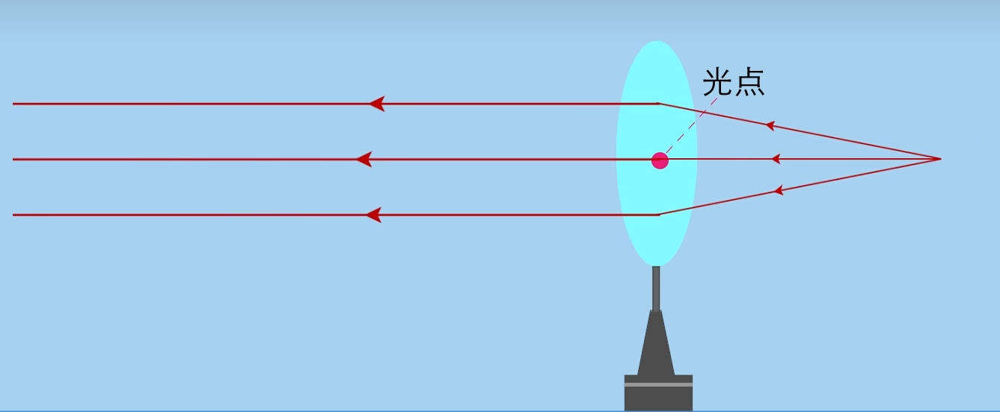

根据光路可逆，通过焦点的光经过凸透镜后平行于主光轴。

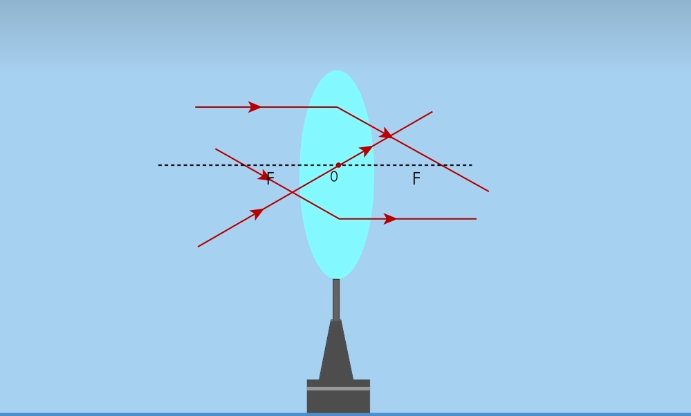

如上图是凸透镜的三条特殊光线。

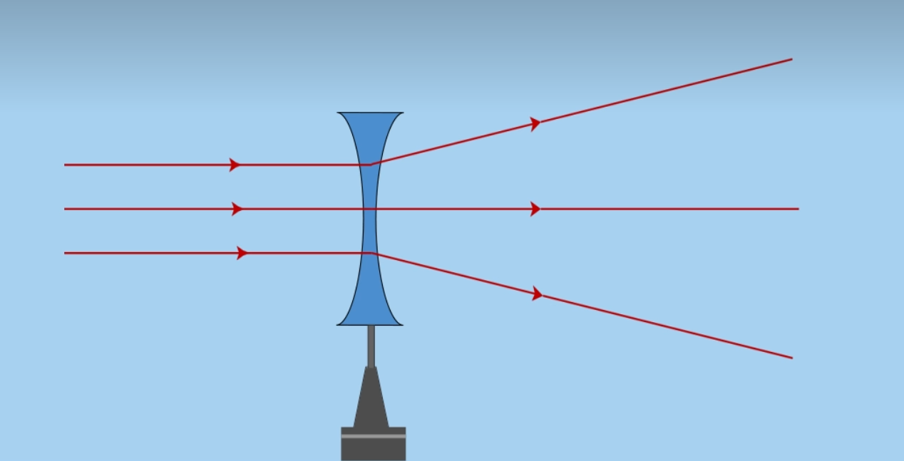

让平行于凹透镜主光轴的几束光线射向凹透镜，观察通过凹透镜后的偏折方向，实验表明，凹透镜对光线有发散作用。

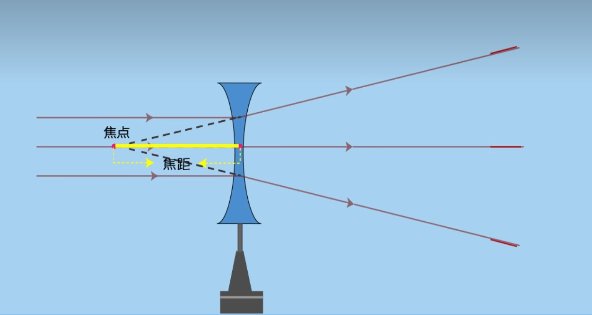

平行于主光轴的光线,经过凹透镜的发散作用后，其反向延长线会聚于一点，这个点就是凹透镜的焦点，焦点到光心的距离就是凹透镜的焦距。

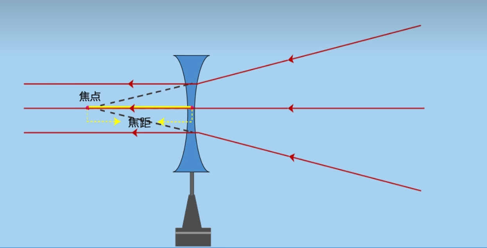

根据光路可逆，延长线通过焦点的光经过凹透镜后平行于主光轴

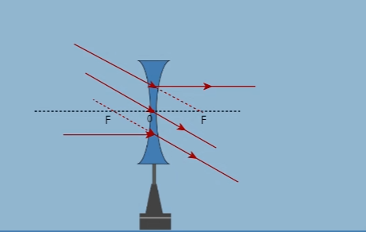

如上图是凹透镜的三条特殊光线。

物理大师通过几条特殊光线来研究凸透镜的成像特点。

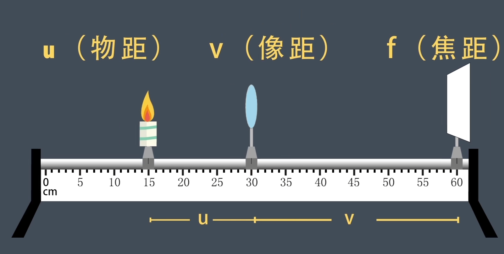

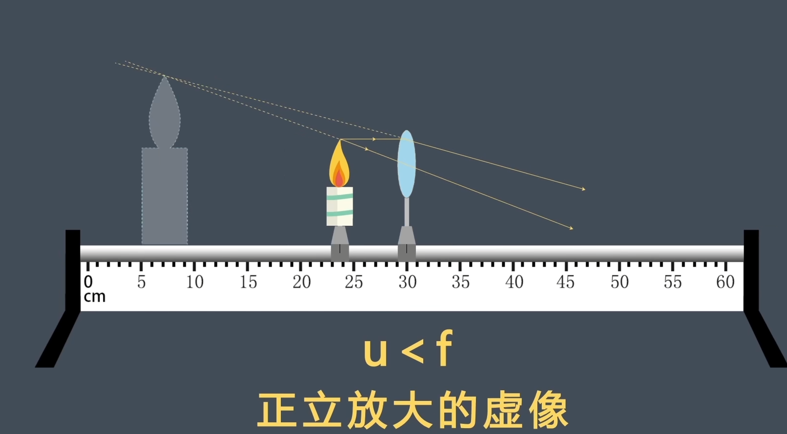