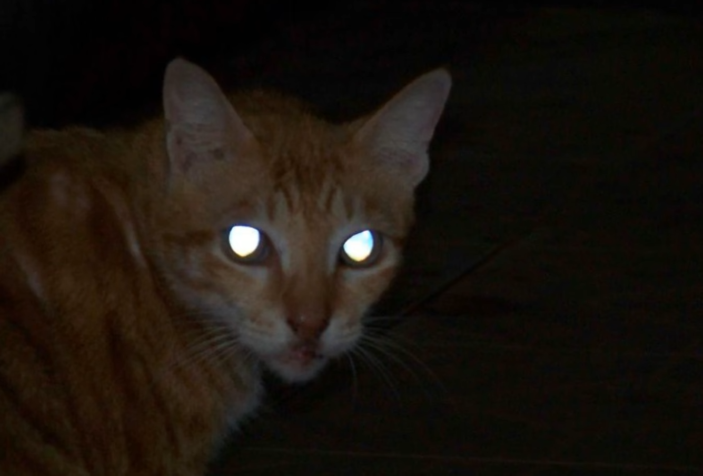
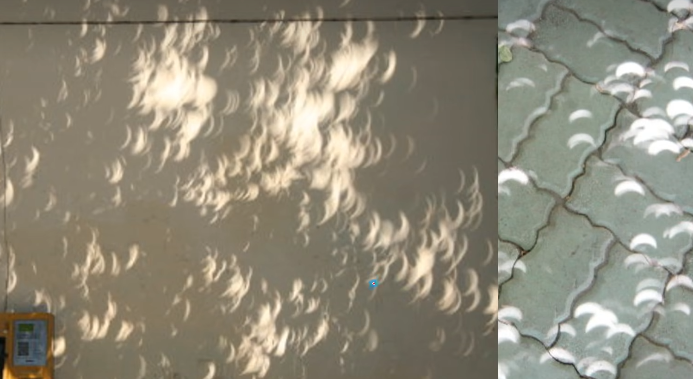
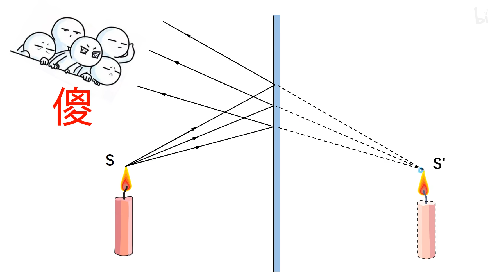
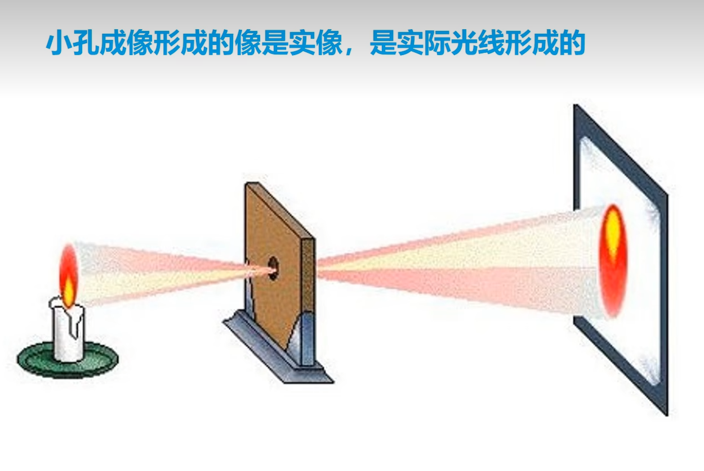
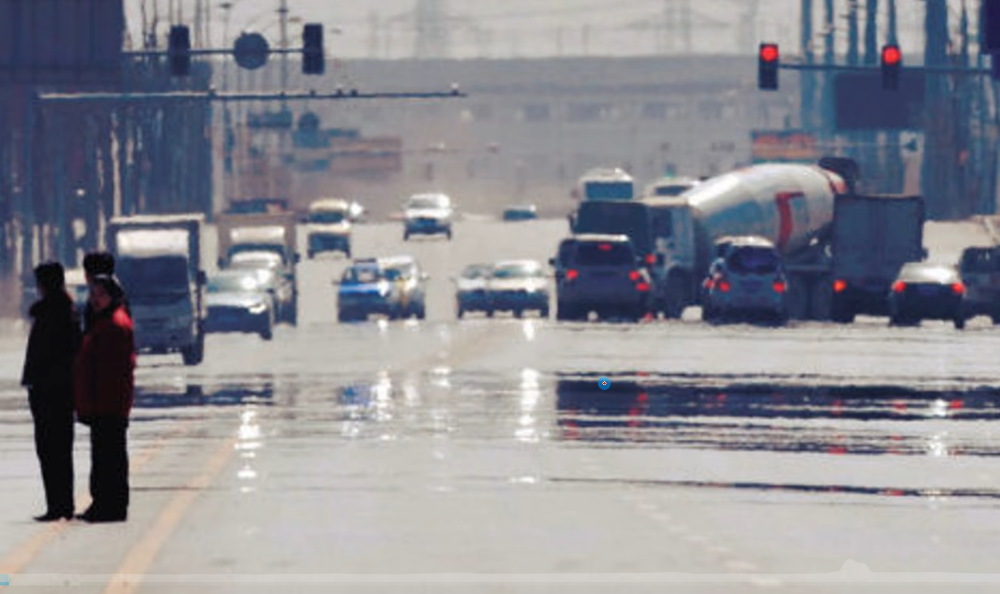
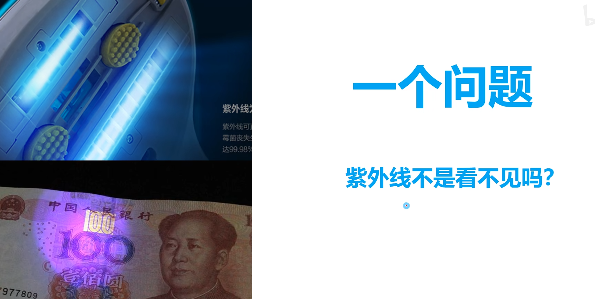
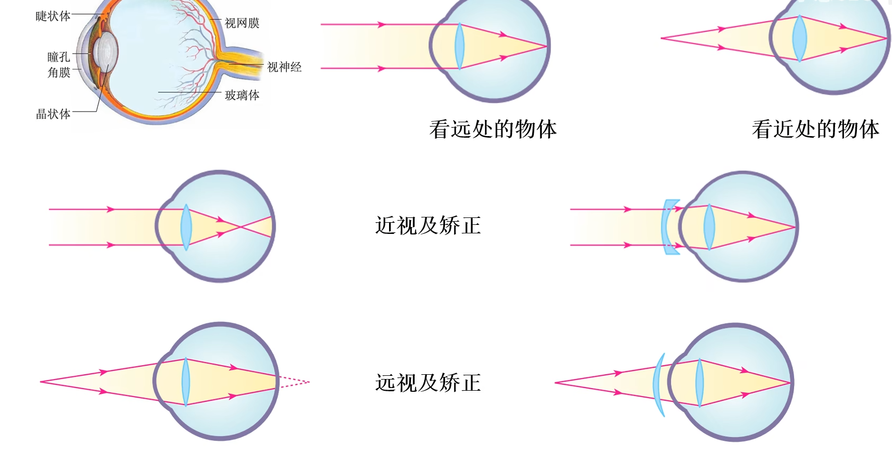

# 1.1 光源

月亮不是光源/你看到的是反射回到你眼里的光。

光源：

## 1.2 光的直线传播

**没有介质光也能够传播，比如真空中**/

太阳移动从不同角度照过来的光，形成了不同的阴影，以此辨认时间。

日食是太阳被挡住了/

# 1.3 小孔成像

**==注意，他是倒像，是有色彩的，不是阴影==**。

***

太阳光透过树叶的小孔，也会形成太阳的像/

注：有些可能不是透过小孔来的，那就是太阳光呗。

光屏或蜡烛位置移到像大小都会发生变化/

例题：

最后一个孔的形状也是改变了的/

# 1.4 光的直线传播的应用

# 1.5 光的传播速度

仙女座星云。

d

答案是AD。

# 1.6 光的反射定律

看到月球发光，眼睛有光，都是反射。

下面是实验

不能，三条线在同一平面上的。

# 反射定律的应用

# 1.8 光路的可逆性

# 1.9 镜面反射和漫反射

生活中大部分都是漫反射.

# 3.1 平面镜成像规律

# 3.2 平面镜成像规律的应用

把纸翻过来就行。

# 3.3 平面镜成虚像

# 3.5 光的折射定律

路上像是有水，其实是没有的。

从水中到空气中，折射角大于入射角。

# 3.6 光的折射规律的应用

在海平面上空气中空气中，密度不均匀，光会折射到你的眼睛中。

# 3.7 光的色散

阳光是白光，它通过棱镜后，被“分解”成各种颜色的光，这种现象叫做光的色散。

人们发现，把红、绿、蓝三种色光按不同比例混合后，就可以产生各种颜色的光。

上图是显示器。

蛇能够看到你发出的红外线。

特殊材料遇到紫外线发出荧光。

看到的是紫光。

# 3.8 凸透镜凹透镜

凸透镜：(手机，摄像机)摄像头，投影仪，电影放映机。

# 4.1 三种特殊光线

差了过光心的那条线。

横着的是原始的。

# 6.1 照相机

里面有胶卷用于成像。

这还需要去冲印照片。

现在的照相机更加高级，不用胶卷，直接成像在电子元器件上，01存储。

1.2m的参天大树被照到小小的胶卷里。

现在的手机摄像都有自动翻转的功能。

眼熟吗

# 6.2 投影仪

粗糙的光屏，为了漫反射。里面是带着胶卷的图片在慢慢转动，形成了电影/

里面有幻灯片，投影到光屏上。

相对于原像来说是倒立的。

实现是由实际光线得到的像。

下面图反着看一下/

# 6.3 放大镜

# 6.4 凸透镜成像原理

练习。

# 6.5 探究凸透镜成像规律

**光屏是需要移动的，以便于成(寻找到)一个清晰的像**。

# 6.6 蜡烛变短

# 6.7 有F的改进版

# 6.9 交换位置

# 7.0 添加凹透镜

# 7.1 换凸透镜

 

# 7.2 遮住透镜

上图是两条最主要的光线/

光屏上仍成完整的像，只不过更暗了一些/

# 7.3 判断焦距

# 7.4 眼镜，眼镜

在神经末梢呈倒立缩小的实像，然后视神经传递给大脑进行处理/

远视眼是凸透镜有放大作用，所以显眼大。

