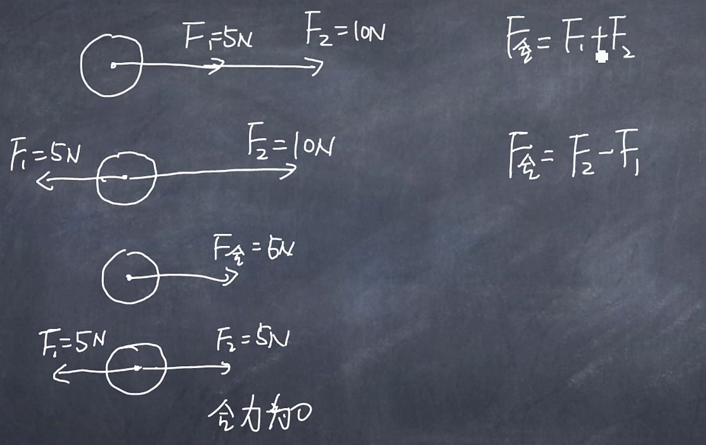
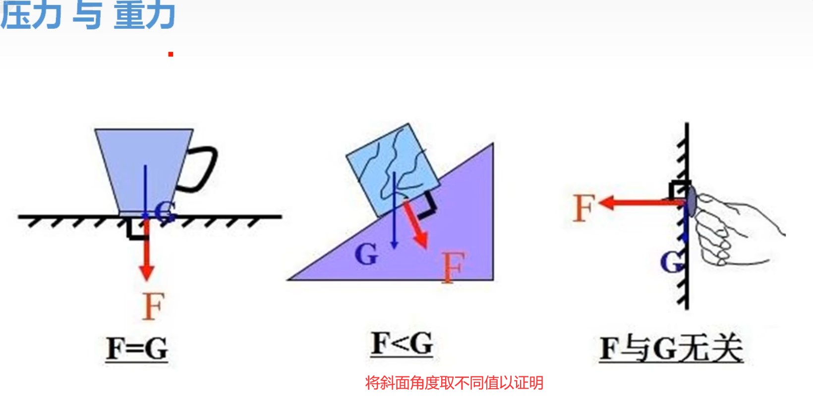
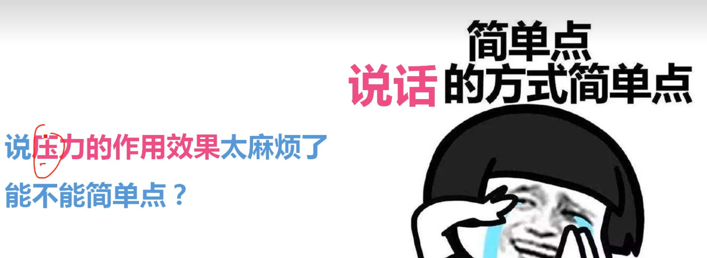
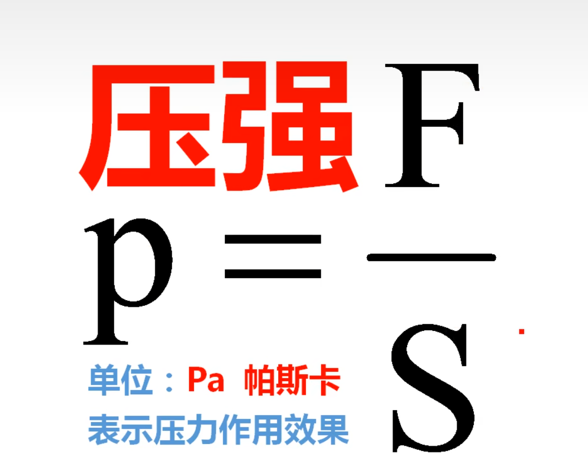
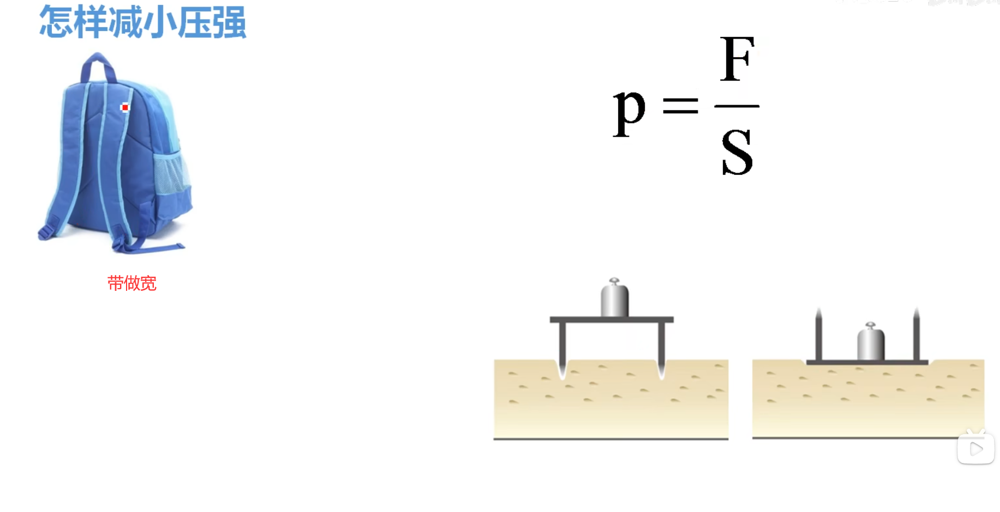
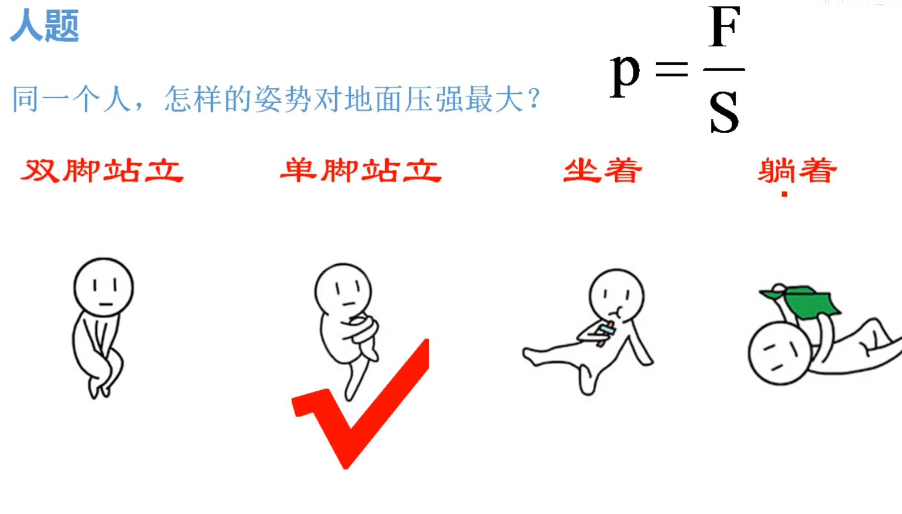
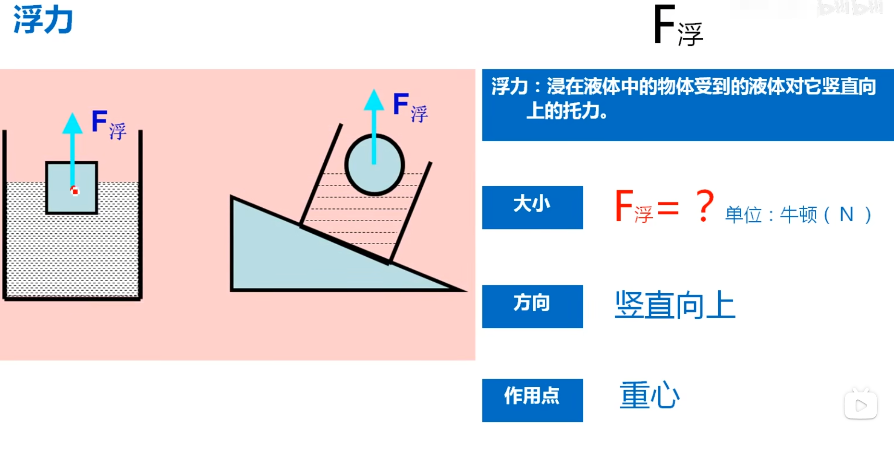
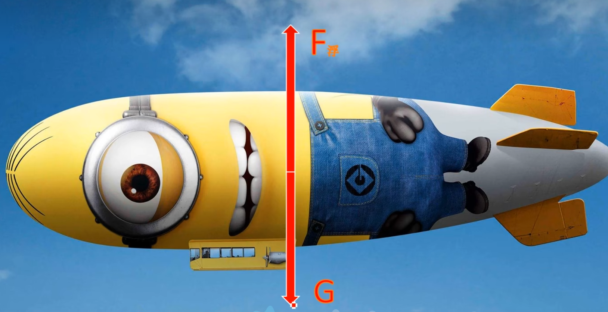
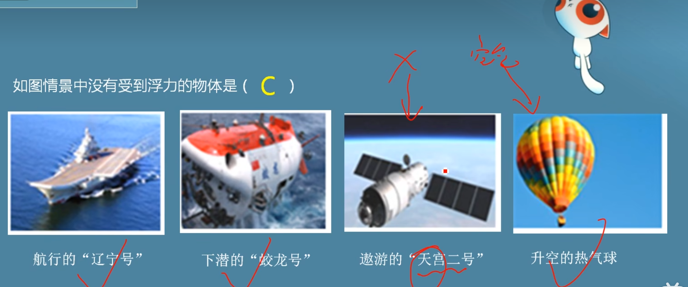
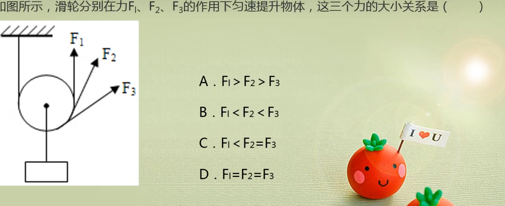

# 2 弹力

分为弹性形变和塑性形变。弹性形变超过一定限度会变成塑性形变。

瓶子放在桌面上，桌面和瓶子都有微小的形变。所以产生了力，因为它们都想恢复原状。

用手挤压瓶子，吸管的水面会上升，这是形变存在的证据。

## 弹簧测力计

只有刻度尺才需要估读。

# 3 压力

## 压强

笔尖戳手更疼。

## 增大减小压强

## 压强计算1

# 4 浮力

### 4.1 认识浮力

在水中就有浮力，不论是浸没还是表面还是中间

若没有浸没，测得的是浸在水中那部分的浮力。

### 6.2.1 定滑轮和动滑轮

例题：

B等价于D，只是B可以改变力的方向。用的都是滑动摩擦力。

BCDB

忽略动**滑轮的重力**和**绳子的重力**和**轴间摩擦力**时，动滑轮相当于动力臂是阻力臂2倍的杠杆省一半力。

dd

