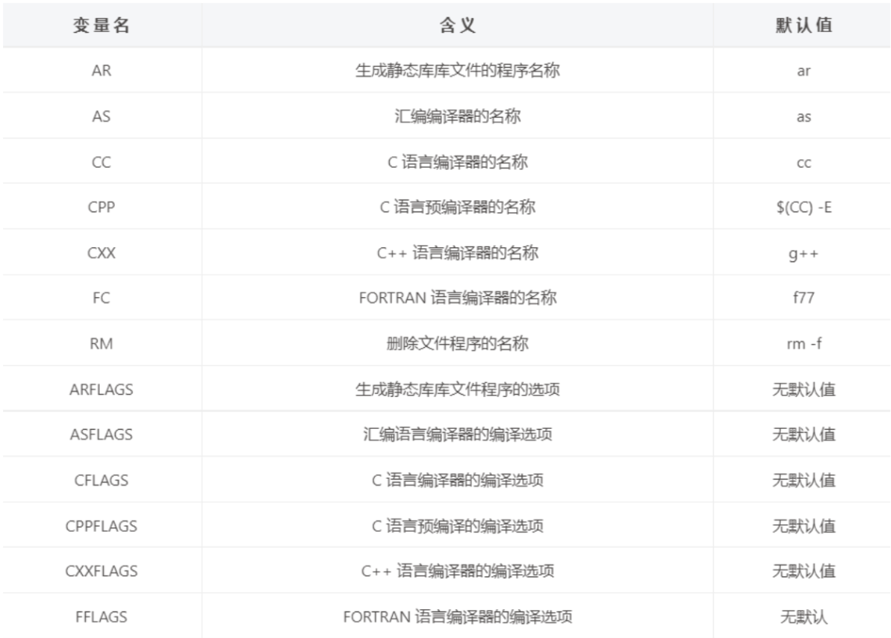
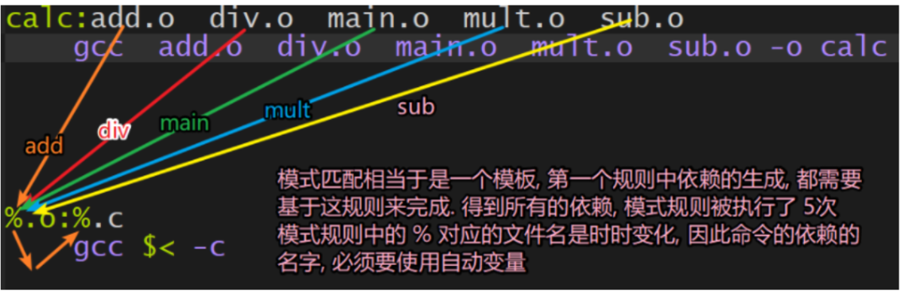

# hh

```makefile
COMMON_DIR:=./src/common/
FUSE_DIR:=./src/fuse/
HIJACKER_DIR:=./src/hijacker/

all: ./lib/libcommon.a ./build/tcss3fs ./build/hijacker.so

#
# BUILD PHASE
#

# DEBUG_FLAG:=-g

./lib/libcommon.a:./src/common/*.cpp ./include/*
	g++ ${DEBUG_FLAG} -std=c++11 -fPIC ./src/common/*.cpp -Iinclude -c
	gcc ${DEBUG_FLAG} -std=c11 -fPIC ./src/common/*.c -fPIC -Iinclude -fPIC -ls3 -c
	ar -crv ./lib/libcommon.a *.o
	-rm *.o

./build/tcss3fs: ./src/fuse/*
	@# g++ -ls3 -std=c++11 ./src/fuse/main.cpp -Iinclude -Llib -lcommon -o ./build/s3fs
	g++ ${DEBUG_FLAG} -ls3 -std=c++11 ${FUSE_DIR}tcsfs.cc ${FUSE_DIR}path.cc ${FUSE_DIR}newdirs.cc -g -o ./build/tcss3fs -g -D_FILE_OFFSET_BITS=64 -lfuse -Iinclude -Llib -lcommon -std=c++11
	-rm *.o

./build/hijacker.so: ./src/hijacker/*
	g++ ${DEBUG_FLAG} -ls3 -ltcsnet -std=c++11 ${HIJACKER_DIR}*.cpp -fPIC -Iinclude -c
	g++ ${DEBUG_FLAG} -ldl  -ltcsnet  -ls3 -Wl,--whole-archive ./lib/libcommon.a -Wl,--no-whole-archive -shared hijacker.o -o ./build/hijacker.so
	-rm *.o

#
# TEST
#


TARGET_FILE=images/test/ILSVRC2012_test_00025002.JPEG
TARGET_FILE=main.c
TARGET_FILE=100K/0

# REDIR="> trash"

## test with GOOFYS
run:
	#
	# START TO TEST GOOFYS
	#
	-time -p cat ${GOOFYS_MOUNTPOINT}${TARGET_FILE} ${REDIR} > trash
	#
	# START TO TEST TCSFS S3
	#
	env LD_PRELOAD=./build/hijacker.so time -p cat ${S3_MOUNTPOINT}${TARGET_FILE} > trash
	#
	# START TO TEST TCSFS LUSTRE
	#
	env LD_PRELOAD=./build/hijacker.so time -p cat ${LUSTRE_MOUNTPOINT}${TARGET_FILE} > trash

l:
	env LD_PRELOAD=./build/hijacker.so time -p cat ${LUSTRE_MOUNTPOINT}${TARGET_FILE} > trash

s:
	env LD_PRELOAD=./build/hijacker.so time -p cat ${S3_MOUNTPOINT}${TARGET_FILE} > trash

tl:
	env LD_PRELOAD=./build/hijacker.so time -p bash test.sh ${LUSTRE_MOUNTPOINT}

ts:
	env LD_PRELOAD=./build/hijacker.so time -p bash test.sh ${S3_MOUNTPOINT}

#
# HELPER COMMAND
#

mount:
	@-mkdir ${GOOFYS_MOUNTPOINT}
	-goofys --endpoint=http://10.198.106.233 ${S3_BUCKET} ${GOOFYS_MOUNTPOINT}
	@-mkdir ${S3_MOUNTPOINT}
	./build/tcss3fs -f ${S3_MOUNTPOINT}

umount:
	-sudo umount ${S3_MOUNTPOINT}
	-sudo umount ${GOOFYS_MOUNTPOINT}
	-rm -r ${S3_MOUNTPOINT}
	-rm -r ${GOOFYS_MOUNTPOINT}

clean:
	@-rm *.o
	@-rm ./lib/*
	@-rm ./build/*
	@-rm trash

refresh:
	make clean
	make
	make umount
	make mount

rebuild:
	make clean
	make
```


## 一、简介

使用 GCC 的命令行进行程序编译在单个文件下是比较方便的，当工程中的文件逐渐增多，甚至变得十分庞大的时候，使用 GCC 命令编译就会变得力不从心。这种情况下我们需要借助项目构造工具 make 帮助我们完成这个艰巨的任务。 `make` 是一个命令工具，是一个解释 makefile 中指令的命令工具**，一般来说，大多数的 IDE 都有这个命令，比如：Visual C++ 的 nmake，QtCreator 的 qmake 等。

`make` 工具在构造项目的时候需要加载一个叫做 `makefile` 的文件，`makefile` 关系到了整个工程的编译规则。**一个工程中的源文件不计数，其按类型、功能、模块分别放在若干个目录中，makefile 定义了一系列的规则来指定哪些文件需要先编译，哪些文件需要后编译，哪些文件需要重新编译，甚至于进行更复杂的功能操作，因为 makefile 就像一个 Shell 脚本一样，其中也可以执行操作系统的命令。**


**makefile 带来的好处就是 ——“自动化编译”，一旦写好，只需要一个 make 命令，整个工程完全自动编译，极大的提高了软件开发的效率。**


makefile 文件有两种命名方式 makefile 和 Makefile，**==构建项目的时候在哪个目录下执行构建命令 make 这个目录下的 makefile 文件就会别加载，因此在一个项目中可以有多个 makefile 文件，分别位于不同的项目目录中。==**


**makefile是图纸，make是建筑师。**

## 二、规则

**==Makefile 的框架是由规则构成的==**。make 命令执行时先在 Makefile 文件中查找各种规则，对各种规则进行解析后运行规则。规则的基本格式为：

```makefile
# 每条规则的语法格式:
target1,target2...: depend1, depend2, ...
	command
	......
	......
```

**==每条规则由三个部分组成分别是目标(target), 依赖(depend) 和命令(command)。==**

- 命令(command): 当前这条规则的动作，一般情况下这个动作就是一个 shell 命令
  - 例如：`通过某个命令编译文件`、`生成库文件`、`进入目录`等。
  - **动作(命令)可以是多个，==每个命令前必须有一个Tab缩进并且独占占一行。==**
- 依赖(depend): 规则所必需的依赖条件，在规则的命令中可以使用这些依赖。
  - **例如：生成可执行文件的目标文件（*.o）可以作为依赖使用**
  - **如果规则的命令中不需要任何依赖，那么规则的依赖可以为空**
  - **==当前规则中的依赖可以是其他规则中的某个目标，这样就形成了规则之间的嵌套，非常重要==**
  - **依赖可以根据要执行的命令的实际需求，指定很多个**
- 目标(target)： 规则中的目标，这个目标和规则中的命令是对应的
  - **==通过执行规则中的命令，`可以生成一个和目标同名的文件`==**
  - **==规则中可以有多个命令，因此可以通过这多条命令来生成多个目标，`所以目标也可以有很多个`==**
  - **==通过执行规则中的命令，`可以只执行一个动作，不生成任何文件`，`这样的目标被称为伪目标`==**
  
  重要：**==Makefile 中的第一个目标会被作为其默认目标，它的特性是，总是会被执行的==**。

关于上面的解释可能有些晦涩，下面通过一个例子来阐述一下:

```makefile
# 举例: 有源文件 a.c b.c c.c head.h, 需要生成可执行程序 app 这个head.h必须要在当前目录下
################# 例1 #################                     否则你就得指定出来
app:a.c b.c c.c
	gcc a.c b.c c.c -o app

################# 例2 #################
# 有多个目标, 多个依赖, 多个命令
app,app1:a.c b.c c.c d.c
	gcc a.c b.c -o app
	gcc c.c d.c -o app1
	
################# 例3 #################	
# 规则之间的嵌套
app:a.o b.o c.o
	gcc a.o b.o c.o -o app
# a.o 是第一条规则中的依赖
a.o:a.c
	gcc -c a.c
# b.o 是第一条规则中的依赖
b.o:b.c
	gcc -c b.c
# c.o 是第一条规则中的依赖
c.o:c.c
	gcc -c c.c
```

## 三、工作原理

在此主要为大家剖析一下通过提供的 makefile 文件，构建工具 make 什么时候编译项目中的所有文件，什么时候只选择更新项目中的某几个文件。另外再研究一下如果 makefile 里边有多个规则它们之间是如何配合工作的，我们基于下边的例子，依次进行讲解。

### 3.1 规则的执行

在调用 make 命令编译程序的时候，**make 会首先找到 Makefile 文件中的第 1 个规则，分析并执行相关的动作。==但是需要注意的是，好多时候要执行的动作（命令）中使用的依赖是不存在的==，如果使用的依赖不存在，这个动作也就不会被执行。**

**对应的解决方案是先将需要的依赖生成出来，我们就可以在 makefile 中添加新的规则，将不存在的依赖作为这个新的规则中的目标，当这条新的规则对应的命令执行完毕，对应的目标就被生成了，同时另一条规则中需要的依赖也就存在了。**

**==这样，makefile 中的某一条规则在需要的时候，就会被其他的规则调用，直到 makefile 中的第一条规则中的所有的依赖全部被生成，第一条规则中的命令就可以基于这些依赖生成对应的目标，make 的任务也就完成了。==**

```makefile
# makefile
# 规则之间的嵌套
# 规则1
app:a.o b.o c.o
	gcc a.o b.o c.o -o app
# 规则2
a.o:a.c
	gcc -c a.c
# 规则3
b.o:b.c
	gcc -c b.c
# 规则4
c.o:c.c
	gcc -c c.c
```

在这个例子中，如果执行 make 命令就会根据这个 makefile 中的 4 条规则编译这三个源文件。在解析第一条规则的时候发现里边的三个依赖都是不存在的，因此规则对应的命令也就不能被执行。

**==当依赖不存在的时候，make 就是查找其他的规则，看哪一条规则是用来生成需要的这个依赖的，找到之后就会执行这条规则中的命令。因此规则 2， 规则 3， 规则 4 里的命令会相继被执行，当规则 1 中依赖全部被生成之后对应的命令也就被执行了，因此规则 1 的目标被生成，make 工作结束。==**


知识点拓展:

**==如果想要执行 makefile 中非第一条规则对应的命令，那么就不能直接 make==, ==需要将那条规则的目标也写到 make 的后边，比如只需要执行规则 3 中的命令==，就需要: `make b.o`。**

### 3.2 文件的时间戳

make 命令执行的时候会根据文件的时间戳判定是否执行 makefile 文件中相关规则中的命令。

**目标是通过依赖生成的，因此正常情况下：目标时间戳 > 所有依赖的时间戳(时间戳是一个整数，越大表示越晚) , 如果执行 make 命令的时候检测到规则中的目标和依赖满足这个条件，那么规则中的命令就不会被执行。目标肯定在规则之后生成呀。**
==**当依赖文件被更新了，文件时间戳也会随之被更新，这时候 目标时间戳 < 某些依赖的时间戳 , 在这种情况下目标文件会通过规则中的命令被重新生成。**==
**==如果规则中的目标依赖的文件根本就不存在， 那么规则中的命令肯定会被执行==。**

```shell
# makefile
# 规则之间的嵌套
# 规则1
app:a.o b.o c.o
	gcc a.o b.o c.o -o app
# 规则2
a.o:a.c
	gcc -c a.c
# 规则3
b.o:b.c
	gcc -c b.c
# 规则4
c.o:c.c
	gcc -c c.c
```

根据上文的描述，先执行 make 命令，基于这个 makefile 编译这几个源文件生成对应的目标文件。**==然后再修改例子中的 a.c, 再次通过 make 编译这几个源文件，那么这个时候先执行规则 2 更新目标文件 a.o， 然后再执行规则 1 更新目标文件 app，其余的规则是不会被执行的。==**

**==就是在说如果你修改了一部分，那么就只会make就只会执行你修改过后的文件对应的规则。==**

### 3.3 自动推导

make 是一个功能强大的构建工具，**虽然 make 需要根据 makefile 中指定的规则来完成源文件的编译。作为小白的我们编写 makefile 的时候难免写的不是那么严谨从而漏写一些构建规则，但是我们会发现程序还是会被编译成功。==这是因为 make 有自动推导的能力，不会完全依赖 makefile。==**

比如：使用命令 `make` 编译扩展名为`.c` 的 `C` 语言文件的时候，源文件的编译规则不用明确给出。这是因为 `make` 进行编译的时候会使用一个默认的编译规则，按照默认规则完成对`.c` 文件的编译，生成对应的`.o` 文件。它使用命令 `cc -c` 来编译`.c` 源文件。在 `Makefile` 中只要给出需要构建的目标文件名（一个`.o` 文件），`make` **会自动为这个`.o` 文件寻找合适的依赖文件**（对应的`.c` 文件），并且使用默认的命令来构建这个目标文件。

假设本地项目目录中有以下几个源文件:

```shell
$ tree
.
├── add.c
├── div.c
├── head.h
├── main.c
├── makefile
├── mult.c
└── sub.c
```

目录中 makefile 文件内容如下

```makefile
# 这是一个完整的 makefile 文件
calc:add.o  div.o  main.o  mult.o  sub.o
        gcc  add.o  div.o  main.o  mult.o  sub.o -o calc
```

**==或者，给个面子写得更全面一点==**？

```makefile
obj=add.o mult.o sub.o div.o main.o
calc:${obj}
        gcc $(obj)   # 这里需要写-o calc吗
add.o:
mult.o:
sub.o:
div.o:
main.o:head.h
```

或者

```makefile
obj=add.o mult.o sub.o div.o main.o
calc:${obj}
        gcc $(obj)
$(obj):
```

**==注意==**：`()`或者`{}`是不可以省略的，否则会识别为`$o`,**后面的bj成为字符串**。

通过 make 构建项目:

```shell
$ make
cc    -c -o add.o add.c
cc    -c -o div.o div.c
cc    -c -o main.o main.c
cc    -c -o mult.o mult.c
cc    -c -o sub.o sub.c
gcc  add.o  div.o  main.o  mult.o  sub.o -o calc
```

**==我们可以发现上边的 makefile 文件中只有一条规则，依赖中所有的 .o 文件在本地项目目录中是不存在的，并且也没有其他的规则用来生成这些依赖文件，这时候 make 会使用内部默认的构造规则先将这些依赖文件生成出来，然后在执行规则中的命令，最后生成目标文件 calc。==**

## 四、变量

使用 Makefile 进行规则定义的时候，为了写起来更加灵活，我们可以在里边使用变量。makefile 中的变量分为三种：**自定义变量**，**预定义变量**和**自动变量**。

### 4.1 自定义变量

用 Makefile 进行规则定义的时候，用户可以定义自己的变量，称为用户自定义变量。**==makefile 中的变量是没有类型的，直接创建变量然后给其赋值就可以了==**。

```makefile
# 错误, 只创建了变量名, 没有赋值
变量名 
# 正确, 创建一个变量名并且给其赋值
变量名=变量值
```

在给 makefile 中的变量赋值之后，如何在需要的时候将变量值取出来呢？

```makefile
# 如果将变量的值取出?
$(变量的名字)

# 举例 add.o  div.o  main.o  mult.o  sub.o
# 定义变量并赋值
obj=add.o  div.o  main.o  mult.o  sub.o
# 取变量的值
$(obj)
```

自定义变量使用举例：

```makefile
# 这是一个规则，普通写法
calc:add.o  div.o  main.o  mult.o  sub.o
        gcc  add.o  div.o  main.o  mult.o  sub.o -o calc
        
# 这是一个规则，里边使用了自定义变量
obj=add.o  div.o  main.o  mult.o  sub.o
target=calc
$(target):$(obj)
        gcc  $(obj) -o $(target)
```

### 4.2 预定义变量

**在 Makefile 中有一些已经定义的变量，用户可以直接使用这些变量，不用进行定义**。**在进行编译的时候，某些条件下 Makefile 会使用**这些**==预定义变量的值==**进行编译。**这些预定义变量的名字一般都是大写的**，经常采用的预定义变量如下表所示：



这里意思是说你编译c语言时要么用cc，要么用$(CC)，他们所代表的含义都是gcc。当然，你直接用gcc也没有任何问题。

你编译c++语言时要么用g++，要么用$(CXX)，他们所代表的含义都是g++。

至于没有默认值的变量，你用的时候给他赋值就行了，相当于他给你声明了这个变量，等着你自己给他赋值。


变量CC的默认值cc就是gcc的意思。

```makefile
# 这是一个规则，普通写法
calc:add.o  div.o  main.o  mult.o  sub.o
        gcc  add.o  div.o  main.o  mult.o  sub.o -o calc
        
# 这是一个规则，里边使用了自定义变量和预定义变量
obj=add.o  div.o  main.o  mult.o  sub.o
target=calc
CFLAGS=-O3 # 代码优化
$(target):$(obj)
        $(CC)  $(obj) -o $(target) $(CFLAGS)
```

### 4.3 自动变量

Makefile 中的变量除了**用户自定义变量**和**预定义变量**外，还有一类自动变量。**Makefile 中的规则语句中经常会出现目标文件和依赖文件，自动变量用来代表这些规则中的目标文件和依赖文件，==`并且它们只能在规则的命令中使用`。==**  他们只能在命令中使用！！！！！！！！！

下表中是一些常见的自动变量。


**==常用的是倒数4个中除开倒数第3个。==**

`@`**表示目标(文件)的名称**。这个指的不是预处理，编译，汇编，链接那一套中得到的目标文件，**而是规则中的目标**.

`<`**表示第一个依赖**。

`^`**==表示所有的依赖(带自动去重功能，可是为什么要有重复的依赖呢，可能有人会不小心写错吧)==**。 **你看它是把第一个依赖向右旋转，==然后像一把伞，表示所有的依赖==**。

下面几个例子，演示一下自动变量如何使用。

```makefile
# 这是一个规则，普通写法
calc:add.o  div.o  main.o  mult.o  sub.o
        gcc  add.o  div.o  main.o  mult.o  sub.o -o calc
        
# 这是一个规则，里边使用了自定义变量
# 使用自动变量, 替换相关的内容
calc:add.o  div.o  main.o  mult.o  sub.o
	gcc $^ -o $@ 			# 自动变量只能在规则的命令中使用 
$@ 表示calc
%.o:%.c
	gcc $< -c -o $@
$@ 表示%.o
```

**我不知道这有啥不好懂的，add.o依赖add.c，而现在恰好能够有一条规则(一个模板)(%.o:%.c)能够做这样的事，那我应该感到开心才是**。

## 五、模式匹配

在介绍概念之前，先读一下下面的这个 makefile 文件:

```makefile
calc:add.o  div.o  main.o  mult.o  sub.o
        gcc  add.o  div.o  main.o  mult.o  sub.o -o calc
# 语法格式重复的规则, 将 .c -> .o, 使用的命令都是一样的 gcc *.c -c
add.o:add.c
        gcc add.c -c

div.o:div.c
        gcc div.c -c

main.o:main.c
        gcc main.c -c

sub.o:sub.c
        gcc sub.c -c

mult.o:mult.c
        gcc mult.c -c
```

**在阅读过程中能够发现从第二个规则开始到第六个规则做的是相同的事情，但是由于文件名不同不得不在文件中写出多个规则，这就让 makefile 文件看起来非常的冗余，我们可以将这一系列的相同操作整理成一个模板，==所有类似的操作都通过模板去匹配 makefile 会因此而精简不少，只是可读性会有所下降==。**

这个规则模板可以写成下边的样子，这种操作就称之为模式匹配。

`%`==**是一个通配符, 匹配的是文件名**==。

```makefile
# 模式匹配 -> 通过一个公式, 代表若干个满足条件的规则
# 依赖有一个, 后缀为.c, 生成的目标是一个 .o 的文件, % 是一个通配符, 匹配的是文件名(只针对文件名？)
%.o:%.c
	gcc $< -c   //你也可以写$^。因为这里只有一个依赖，所以可写$<
```



**如果不使用自动变量的话，你用什么来表示实时变化的文件名呢？**

## 六、函数

`makefile` 中有很多函数**==并且所有的函数都是有返回值的==**。`makefile` 中函数的格式和 `C/C++` 中函数也不同，其写法是这样的： `$(函数名 参数1, 参数2, 参数3, ...)`，主要目的是让我们能够快速方便的得到函数的返回值。

这里为大家介绍两个 `makefile` 中使用频率比较高的函数：`wildcard` 和 `patsubst`。

### 6.1 wildcard（==n.通配符==）

这个函数的主要作用是**获取==指定目录==下==指定类型==的==文件名==**，其**返回值**是以空格分割的、指定目录下的所有符合条件的**==文件名列表(指定的目录也一起返回了)==**。函数原型如下：

```makefile
# 该函数的参数只有一个, 但是这个参数可以分成若干个部分, 通过空格间隔
$(wildcard PATTERN...)
	参数:	指定某个目录, 搜索这个路径下指定类型的文件，比如： *.c
```

- 参数功能:
  - PATTERN 指的是某个或多个目录下的对应的某种类型的文件，**比如当前目录下的.c 文件可以写成 *.c**
  - **可以指定多个目录，每个路径之间使用空格间隔**
- 返回值：
  - 得到的若干个文件的文件列表， 文件名之间使用空格间隔
  - 示例：$(wildcard *.c ./sub/*.c)
    - 返回值格式: a.c b.c c.c d.c e.c f.c ./sub/aa.c ./sub/bb.c

函数使用举例:

```makefile
# 使用举例: 分别搜索三个不同目录下的 .c 格式的源文件
src = $(wildcard /home/robin/a/*.c /home/robin/b/*.c *.c)  # *.c == ./*.c
# 返回值: 得到一个大的字符串, 里边有若干个满足条件的文件名, 文件名之间使用空格间隔
/home/robin/a/a.c /home/robin/a/b.c /home/robin/b/c.c /home/robin/b/d.c e.c f.c
```

### 6.2 subst

substitute string。

```makefile
$(subst <from>,<to>,<text>) #将什么替换为什么
```

* 名称：字符串替换函数
* 功能：把字符串<text>中的<from> 字符串替换成 <to>。
* 返回：函数返回被替换过后的字符串。

例子：

```makefile
comma:= ,
empty:=
space:= $(empty) $(empty)  #这能生成一个空格
foo:= a b c
bar:= $(subst $(space),$(comma),$(foo)) # 将空格替换为逗号
```

这个函数也就是 把 $(foo) 中的空格替换成逗号，所以 $(bar) 的值是 a,b,c

例子：

```makefile
$(subst ee,EE,feet on the street)
```

把 feet on the street 中的 ee 替换成 EE ，返回结果是 fEEt on the strEEt 。

### 6.3  patsubst

pattern substitute string。

这个函数的功能是**按照指定的模式==替换==指定的文件名的==后缀==**，函数原型如下:

```makefile
# 有三个参数, 参数之间使用 逗号间隔
$(patsubst <pattern>,<replacement>,<text>)
```

参数功能:
`pattern`: **这是一个模式字符串，==需要指定出要将要被替换的文件名的后缀是什么==**
**文件名和路径不需要关心，因此使用 % 表示即可 [通配符是 %]**
**在通配符后边指定出要被替换的后缀，比如: %.c, 意味着 .c 的后缀要被替换掉**
`replacement`: **这是一个模式字符串，==指定参数 `pattern` 中的后缀最终要被替换为什么==**
还是使用 `%` 来表示参数 `pattern` 中文件的**==路径和名字==**
**在通配符 % 后边指定出新的后缀名，比如: `%.o` 这表示原来的后缀被替换为 `.o`**
`text`: **该参数中存储这要被替换的原始数据**
`返回值`: 函数返回被替换过后的字符串。

函数使用举例:

```makefile
src = a.cpp b.cpp c.cpp e.cpp
# 把变量 src 中的所有文件名的后缀从 .cpp 替换为 .o
obj = $(patsubst %.cpp, %.o, $(src)) 
# obj 的值为: a.o b.o c.o e.o

1、输出打印信息的方法是：$(warning xxxxx)，$(error xxxxx)
2、输出打印变量值的方法是：$(warning  $(XXX))
在makefile中打印警告或者错误消息的方法：你还不如直接用echo
$(warning xxxxx)或者$(error xxxxx) 

输出变量方式为：
$(warning  $(XXX))
```

示例：

```makefile
a=$(patsubst %.c,%.o,x.c.c bar.c)
$(warning $(a)) 
main:   # 必须要有一个目标
```

运行结果：

```makefile
[root@localhost ~]# make
Makefile:2: x.c.o bar.o
make: 对“main”无需做任何事。
```

### 6.4 strip

```makefile
$(strip <string>)
```

* 名称：去空格函数。 
* 功能：去掉  字串中开头和结尾的空字符。 
* 返回：返回被去掉空格的字符串值。

例子：

```makefile
$(strip a b c ) # 末尾是有一个空格的
```

运行结果：

```makefile
Makefile:2: a b c
make: 对“main”无需做任何事。
```


### 6.3 basename

`$(basename NAMES…) `
函数名称：**==取==**前缀函数—basename。 
函数功能：从文件名序列“NAMES…”中取出各个文件名的前缀部分（点号之前的
部分）。**前缀部分指的是文件名中最后一个点号之前的部分。** 
返回值：空格分割的文件名序列“NAMES…”中各个文件的前缀序列。****如果文件没**
有前缀，则返回空字串。** 
函数说明：==**如果“NAMES…”中包含没有后缀的文件名，此文件名不改变。如果一**==
==**个文件名中存在多个点号，则返回值为此文件名的最后一个点号之前的**==
文件名部分。 
示例： 

```makefile
$(basename src/foo.c src-1.0/bar.c /home/jack/.font.cache-1 hacks) 
```

返回值为：`“src/foo src-1.0/bar /home/jack/.font hacks”`

### 6.4 addsuffix

`$(addsuffix SUFFIX,NAMES…) `

函数名称：**==加==**后缀函数—addsuffix。 
函数功能：为`“NAMES…”`中的每一个文件名添加后缀`“SUFFIX”`。参数`“NAMES…”`
为空格分割的文件名序列，将`“SUFFIX”`追加到此序列的每一个文件名的末尾。 
返回值：**==以单空格分割的添加了后缀`“SUFFIX”`的文件名序列。==** 
函数说明： 
示例： 

```makef
$(addsuffix .c,foo bar) 
```

返回值为`“foo.c bar.c”`

## 七、makefile 的编写

下面基于一个简单的项目，为大家演示一下编写一个 makefile 从不标准到标准的进化过程。

```shell
# 项目目录结构
.
├── add.c
├── div.c
├── head.h
├── main.c
├── mult.c
└── sub.c
# 需要编写makefile对该项目进行自动化编译
```

### 7.1 版本 1

```makefile
calc:add.c  div.c  main.c  mult.c  sub.c
        gcc add.c  div.c  main.c  mult.c  sub.c -o calc  
```

1.**==如果你不写-o calc,默认会得到a.out==**。

2.**==如果你的头文件不在当前目录，那么需要用-I参数指定出头文件所在的目录==**。

这个版本的优点：书写简单

**这版本的缺点：只要依赖中的某一个源文件被修改，所有的源文件都需要被重新编译，太耗时、效率低**

**改进方式：提高效率，修改哪一个源文件，哪个源文件被重新编译，不修改就不重新编译。**

**从那个时间戳的规则得知。**

### 7.2 版本 2

```makefile
# 默认所有的依赖都不存在, 需要使用其他规则生成这些依赖
# 因为 add.o 被更新, 需要使用最新的依赖, 生成最新的目标
calc:add.o  div.o  main.o  mult.o  sub.o
        gcc  add.o  div.o  main.o  mult.o  sub.o -o calc

# 如果修改了add.c, add.o 被重新生成  这个很重要
add.o:add.c
        gcc add.c -c

div.o:div.c
        gcc div.c -c

main.o:main.c
        gcc main.c -c

sub.o:sub.c
        gcc sub.c -c

mult.o:mult.c
        gcc mult.c -c
```

这个版本的优点：相较于版本 1 效率提升了

这个版本的缺点：规则比较冗余(写了很多条类似的规则)，需要精简

改进方式：在 makefile 中使用变量 和 模式匹配

### 7.3 版本 3

```makefile
# 添加自定义变量 -> makefile中注释前 使用 # 
obj=add.o  div.o  main.o  mult.o  sub.o
target=calc

$(target):$(obj)
        gcc $(obj)  -o $(target)

%.o:%.c
        gcc $< -c
```

这个版本的优点：文件精简不少，变得简洁了

这个版本的缺点：**变量 obj 的值需要手动的写出来，如果需要编译的项目文件很多，都用手写出来不现实**

**改进方式：==在 makefile 中使用函数==**

### 7.4 版本 4

```makefile
# 添加自定义变量 -> makefile中注释前 使用 # 
# 使用函数搜索当前目录下的源文件 .c
src=$(wildcard *.c)
# 将源文件的后缀替换为 .o
# % 匹配的内容是不能被替换的, 需要替换的是第一个参数中的后缀, 替换为第二个参数中指定的后缀
# obj=$(patsubst %.cpp, %.o, $(src)) 将src中的关键字 .cpp 替换为 .o
obj=$(patsubst %.c, %.o, $(src))
target=calc

$(target):$(obj)
        gcc $(obj)  -o $(target)

%.o:%.c
        gcc $< -c
```

这个版本的优点：**==解决了自动加载项目文件的问题，解放了双手==**

这个版本的缺点：**没有文件删除的功能，不能删除项目编译过程中生成的目标文件（*.o）和可执行程序**

**改进方式：在 makefile 文件中添加新的规则用于删除生成的目标文件（*.o）和可执行程序**

1. 用函数搜索所有的`.c`。
2. 用函数将所有的`.c`替换成`.o`。
3. 模式匹配

### 7.5 版本 5

```makefile
# 添加自定义变量 -> makefile中注释前 使用 # 
# 使用函数搜索当前目录下的源文件 .c
src=$(wildcard *.c)
# 将源文件的后缀替换为 .o
obj=$(patsubst %.c, %.o, $(src))
target=calc
# obj 的值 xxx.o xxx.o xxx.o xx.o
$(target):$(obj)
        gcc $(obj)  -o $(target)

%.o:%.c
        gcc $< -c

# 添加规则, 删除生成文件 *.o 可执行程序
# 这个规则比较特殊, clean根本不会生成, 这是一个伪目标
# 因为根本没有东西要依赖这条规则，所有clean这个目标不会生成。
clean:
        rm $(obj) $(target)
   或者 rm *.o calc
```

这个版本的优点：**添加了新的规则（16 行）用于文件的删除，直接 make clean 就可以执行规则中的删除命令了**

这个版本的缺点：在下面有具体的问题演示和分析

==**改进方式：在 `makefile` 文件中声明 `clean` 是一个伪目标，让 `make` 放弃对它的时间戳检测。**==


正常情况下这个版本的 makefile 是可以正常工作的，但是我们如果在这个项目目录中添加一个叫做 clean 的文件（**==和规则中的目标名称相同==**），再进行 make clean 发现这个规则就不能正常工作了。

```makefile
# 在项目目录中添加一个叫 clean的文件, 然后在 make clean 这个规则中的命令就不工作了
$ ls
add.c  calc   div.c  head.h  main.o    mult.c  sub.c
add.o  div.o  main.c  makefile  mult.o  sub.o  clean  ---> 新添加的

# 使用 makefile 中的规则删除生成的目标文件和可执行程序
$ make clean
make: 'clean' is up to date. 

# 查看目录, 发现相关文件并没有被删除, make clean 失败了
$ ls
add.c  calc   div.c  head.h  main.o    mult.c  sub.c
add.o  clean  div.o  main.c  makefile  mult.o  sub.o
```

**这个问题的关键点在于 clean 是一个伪目标(只执行一个动作(`rm`)，==不生成任何文件==)**，**不对应任何实体文件**，在前边讲关于文件时间戳更新问题的时候说过，如果目标不存在规则的命令肯定被执行， 如果目标文件存在了就需要比较规则中目标文件和依赖文件的时间戳，满足条件才执行规则的命令，否则不执行。

**==解决这个问题需要在 makefile 中声明 clean 是一个伪目标，这样 make 就不会对文件的时间戳进行检测，规则中的命令也就每次都会被执行了。==**

在 `makefile` 中声明一个伪目标需要使用 `.PHONY` 关键字，**==声明方式为==**: `.PHONY:伪文件名称`

### 7.6 最终版

```makefile
# 添加自定义变量 -> makefile中注释前 使用 # 
# 使用函数搜索当前目录下的源文件 .c
src=$(wildcard *.c)
# 将源文件的后缀替换为 .o
obj=$(patsubst %.c, %.o, $(src))
target=calc

$(target):$(obj)
        gcc $(obj)  -o $(target)

%.o:%.c
        gcc $< -c

# 添加规则, 删除生成文件 *.o 可执行程序
# 声明clean为伪文件
.PHONY:clean
clean:
        # shell命令前的 - 表示强制这个指令执行, 如果执行失败也不会终止
        -rm $(obj) $(target) 
        echo "hello, 我是测试字符串"
        
        cd ..;ls #这样确实会列出上一级目录下的东西，但是你不要想make c能够真正的将你的终端切换到上一级目录，这样也行的话，真是太离谱了。
```

**==shell命令前的 - 表示强制这个指令执行, 如果执行失败也不会终止==**

### 7.7 练习题

如果觉得上边讲的内容看懂了，可以试着根据这个目录结构写出其对应的 makefile 文件。

```shell
# 目录结构
.
├── include
│   └── head.h	==> 头文件, 声明了加减乘除四个函数
├── main.c		==> 测试程序, 调用了head.h中的函数
└── src
    ├── add.c	==> 加法运算
    ├── div.c	==> 除法运算
    ├── mult.c  ==> 乘法运算
    └── sub.c   ==> 减法运算
```

根据上边的项目目录结构编写的 makefile 文件如下:

```makefile
# 最终的目标名 app
target = app
# 搜索当前项目目录下的源文件
src=$(wildcard *.c ./src/*.c)
# 将文件的后缀替换掉 .c -> .o
obj=$(patsubst %.c, %.o, $(src))
# 头文件目录
include=./include

# 第一条规则
# 依赖中都是 xx.o yy.o zz.o
# gcc命令执行的是链接操作
$(target):$(obj)
        gcc $^ -o $@

# 模式匹配规则
# 执行汇编操作, 前两步: 预处理, 编译是自动完成
%.o:%.c
        gcc $< -c -I $(include) -o $@

# 添加一个清除文件的规则
.PHONY:clean

clean:
        -rm $(obj) $(target) -f
```

## 八、伪目标

最早先的一个例子中，我们提到过一个“clean”的目标，这是一个“伪目标”，

```makefile
clean:
	rm *.o temp   # 并没有执行能够生成make这个文件有关的命令
```

正像我们前面例子中的“clean”一样，**既然我们生成了许多文件编译文件，我们也应该提供一个清 除它们的“目标”以备完整地重编译而用**。（以`“make clean”`来使用该目标）

**因为，我们并不生成“clean”这个文件(我们在命令中没有做生成clean这个文件的动作)**。“伪目标”并不是一个文件，只是一个标签，**==由于“伪目 标”不是文件，所以 make 无法生成它的依赖关系和决定它是否要执行==**。**我们只有通过显式地指明这个 “目标”才能让其生效**。当然，“伪目标”的取名不能和文件名重名，不然其就失去了“伪目标”的意义了(和文件重名，文件会生成或存在。那这不就成了真目标吗)。

当然，为了避免和文件重名的这种情况，我们可以使用一个特殊的标记`“.PHONY”`来显式地指明一 个目标是“伪目标”，**向 make 说明，不管是否有(clean)这个文件，这个目标就是“伪目标”**。

只要有这个声明，不管是否有“clean”文件，要运行“clean”这个目标，只有“make clean”这 样。于是整个过程可以这样写：

```c
.PHONY : clean
clean :
	rm *.o temp
```

### 8.1 如何依赖伪目标一次性生成若干个可执行文件

注：通常情况下，一个makefile只能生成一个可执行文件，但是一般会有多个目标文件。

伪目标**一般没有**依赖的文件。**==但是，我们也可以为伪目标指定所依赖的文件==**。伪目标同样可以作为 “默认目标”(放在开头)，只要将其放在第一个。**一个示例就是，如果你的 Makefile 需要一口气生成若干个可执行 文件，但你只想简单地敲一个 make 完事，并且，所有的目标文件都写在一个 Makefile 中，那么你可 以使用“伪目标”这个特性**：

```makefile
#.PHONY:clean all          # 以后我的标配
.PHONY : all              # 以后我的标配
all : prog1 prog2 prog3   # 该伪目标依赖于这3个可执行文件。
prog1 : prog1.o utils.o
	cc -o prog1 prog1.o utils.o
prog2 : prog2.o
	cc -o prog2 prog2.o
prog3 : prog3.o sort.o utils.o
	cc -o prog3 prog3.o sort.o utils.o
```

**我们知道，Makefile 中的第一个目标会被作为其默认目标**。我们声明了一个“all”的伪目标，其依 赖于其它三个目标。**由于默认目标的特性是，总是被执行的**，**==但由于“all”又是一个伪目标，伪目标只是 一个标签不会生成文件，所以不会有“all”文件产生==**。于是，其它三个目标的规则总是会被决议。也就达 到了我们一口气生成多个目标的目的。.PHONY : all 声明了“all”这个目标为“伪目标”。（注：这里的 显式“.PHONY : all”不写的话一般情况也可以正确的执行，这样 make **可通过隐式规则推导出(因为我们没有做出gcc   prog2 prog3 -o all这样的操作，所以make推断它是一个伪目标。事实上，你也不可能那样做，因为我们需要的是prog1.o)**，“all” 是一个伪目标，执行 make 不会生成“all”文件，而执行后面的多个目标。建议：显式写出是一个好习 惯。） 随便提一句，从上面的例子我们可以看出，目标也可以成为依赖(这是显而易见的)。**==所以，伪目标同样也可成为依赖==**。 看下面的例子：

```makefile
.PHONY : cleanall cleanobj cleandiff # 即使你不声明，make也知道他们是伪目标
cleanall : cleanobj cleandiff  # 作为依赖，make的时候，他俩会先被执行
	rm program
cleanobj :
	rm *.o
cleandiff :
	rm *.diff
```

“make cleanall”(实际上，应该只make就可以了)**将清除所有要被清除的文件**。“cleanobj”和“cleandiff”这两个伪目标有点像 “子程序”的意思。**==我们可以输入“make cleanall”和“make cleanobj”和“make cleandiff”命令 来达到清除不同种类文件的目的==**。

## 九、嵌套执行 make

```v
sudo su
yum install -y install
vim authorized_keys
ssh-rsa 

AAAAB3NzaC1yc2EAAAADAQABAAABAQCV5Pa1nVTX4jIXmO2Ts99b3bJSzkhULpDPL3IGplJdEE9VP5U0zRL2tQzlTgglezjS6nt035NOxnLqwVik+w9MXvavtuxOt+KDwNY0IJ8xSztEugso0BecKNSEhM6ISu2fgyS6O2s3/ul2KEYp/WbvhhytNQNskg5Htt0/xwacKeXRyyiMCFugZ4yzDFKTEmCD0Azq6dtVm99y+5RPwdjstieEiq14iAnAwny64qCvMV8M+WrALpr09FJttRN4YzR2fDYFzn4SEZThIcc0n+su43olIVc7dSKWuy/jZc/uXn1uVAJKMtgCcGg9ao2RBzcO5hJxR5N2Ed45Wh4/Xijn root@HOST-10-142-7-74
```


在一些大的工程中，我们会把我们**不同模块**或是**不同功能的源文件**放在不同的目录中，我们可以在 每个目录中都书写一个该目录的 Makefile，这有利于让我们的 Makefile 变得更加地简洁，而不至于 把所有的东西全部写在一个 Makefile 中，这样会很难维护我们的 Makefile，**这个技术对于我们模块 编译和分段编译有着非常大的好处**。 例如，我们有一个子目录叫 subdir，这个目录下有个 Makefile 文件，来指明了这个目录下文件的 编译规则。那么我们总控的 Makefile 可以这样书写：

```makefile
subsystem:  # 伪目标
	cd subdir && $(MAKE)
```

其等价于：

```makefile
subsystem:
	$(MAKE) -C subdir  # -C就是change啊
```

定义 `$(MAKE)` 宏变量的意思是，**也许我们的 make 需要一些参数(比如make -j8)，所以定义成一个变量比较利于 维护**。这两个例子的意思都是先进入“subdir”目录，然后执行 make 命令。

我们把这个 Makefile 叫做“总控 Makefile” ，**总控 Makefile 的变量可以传递到下级的 Makefile 中**（**==如果你显示的声明==**），**但是不会覆盖下层的 Makefile 中所定义的变量，除非指定了 -e 参数**。

如果你要传递变量到下级 Makefile 中，那么你可以使用这样的声明:

```makefile
export <variable ...>;
```

如果你不想让某些变量传递到下级 Makefile 中，那么你可以这样声明:

```makefile
unexport <variable ...>;
```

如： 

示例一：

```makefile
export variable = value
```

其等价于：

```makefile
variable = value
export variable
```

其等价于：

```makefile
export variable := value
```

其等价于：

```makefile
variable := value
export variable
```

示例二：

```makefile
export variable += value
```

其等价于：

```makefile
variable += value
export variable
```


需要注意的是，有两个变量，一个是 **SHELL** ，一个是 **MAKEFLAGS** ，这两个变量不管你是否 export， 其总是要传递到下层 Makefile 中，**特别是 MAKEFLAGS 变量，其中包含了 make 的参数信息，如果我 们执行“总控 Makefile”时有 make 参数或是在上层 Makefile 中定义了这个变量，那么 MAKEFLAGS 变量将会是这些参数，并会传递到下层 Makefile 中，这是一个系统级的环境变量**。 但 是 make 命 令 中 的 有 几 个 参 数 并 不 往 下 传 递， 它 们 是 -C , -f , -h, -o 和 -W （有 关 Makefile 参数的细节将在后面说明），如果你不想往下层传递参数，那么，你可以这样来：

```makefile
subsystem:
	cd subdir && $(MAKE) MAKEFLAGS=
```

**如果你定义了环境变量 MAKEFLAGS ，那么你得确信其中的选项是大家都会用到的，如果其中有 -t , -n 和 -q 参数，那么将会有让你意想不到的结果，或许会让你异常地恐慌**。 **==还有一个在“嵌套执行”中比较有用的参数，-w 或是 --print-directory 会在 make 的过程中输 出一些信息，让你看到目前的工作目录。比如，如果我们的下级 make 目录是“/home/hchen/gnu/make”， 如果我们使用 make -w 来执行，那么当进入该目录时，我们会看到==**:

```makefile
make: Entering directory `/home/hchen/gnu/make'.
```

而在完成下层 make 后离开目录时，我们会看到:

```makefile
make: Leaving directory `/home/hchen/gnu/make'
```

当你使用 **==-C 参数==**来指定 make 下层 Makefile 时，**-w** 会被自动打开的。**当然如果参数中有 -s （--slient ）或是 --no-print-directory ，那么，-w 总是失效的**。

## 十、make的运行

一般来说，最简单的就是直接在命令行下输入 make 命令，make 命令会找当前目录的 makefile 来 执行，一切都是自动的。**==但也有时你也许只想让 make 重编译某些文件，而不是整个工程，而又有的时候 你有几套编译规则，你想在不同的时候使用不同的编译规则==**，等等。本章节就是讲述如何使用 make 命 令的。

### 10.1 make 的退出码

make 命令执行后有三个退出码： 

0 表示成功执行。 

1 如果 make 运行时出现任何错误，其返回 1。 

2 **如果你使用了 make 的“-q”选项，并且 make 使得一些目标不需要更新，那么返回 2**。 

Make 的相关参数我们会在后续章节中讲述。

### 10.2 指定 Makefile

前面我们说过，GNU make 找寻默认的 Makefile 的规则是在当前目录下依次找三个文件—— “GNUmakefile”、“makefile”和“Makefile”。其按顺序找这三个文件，一旦找到，就开始读取这个 文件并执行。 **当前，我们也可以给 make 命令指定一个特殊名字的 Makefile。要达到这个功能，我们要使用 make 的 -f 或是 --file 参数（--makefile 参数也行）**。例如，我们有个 makefile 的名字是“hchen.mk”， 那么，我们可以这样来让 make 来执行这个文件：

```makefile
make –f hchen.mk
```

如果在 make 的命令行是，你不只一次地使用了 -f 参数，那么，所有指定的 makefile 将会被连在一起传递给 make 执行。

### 10.3 指定目标

一般来说，**make 的最终目标是 makefile 中的第一个目标**，而其它目标一般是由这个目标连带出 来的。**这是 make 的默认行为**。当然，一般来说，你的 makefile 中的第一个目标是由许多个目标组成， **你可以指示 make，让其完成你所指定的目标。要达到这一目的很简单，需在 make 命令后直接跟目标的 名字就可以完成（如前面提到的“make clean”形式）**

任何在 makefile 中的目标都可以被指定成终极目标，但是除了以 - 打头，或是包含了 = 的目标， 因为有这些字符的目标，会被解析成命令行参数或是变量。**甚至没有被我们明确写出来的目标也可以成 为 make 的终极目标，也就是说，只要 make 可以找到其隐含规则推导规则，那么这个隐含目标同样可 以被指定成终极目标**。 

有一个 make 的环境变量叫 MAKECMDGOALS ，这个变量中会存放你所指定的终极目标的列表，如果 在命令行上，你没有指定目标，那么，这个变量是空值。这个变量可以让你使用在一些比较特殊的情形 下。比如下面的例子：

```makefile
sources = foo.c bar.c
ifneq ( $(MAKECMDGOALS),clean)
	include $(sources:.c=.d)
endif
```

基于上面的这个例子，只要我们输入的命令不是“make clean”，那么 makefile 会自动包含“foo.d” 和“bar.d”这两个 makefile。 使用指定终极目标的方法可以很方便地让我们编译我们的程序，例如下面这个例子：

```makefile
.PHONY: all
all: prog1 prog2 prog3 prog4
```

从 这 个 例 子 中， 我 们 可 以 看 到， 这 个 makefile 中 有 四 个 需 要 编 译 的 程 序 —— “prog1”，“prog2”，“prog3”和“prog4”，我们可以使用“make all”命令来编译所有的目标 （如果把 all 置成第一个目标，那么只需执行“make”），我们也可以使用“make prog2”来单独编译目 标“prog2”。

**既然 make 可以指定所有 makefile 中的目标，那么也包括“伪目标”**，于是我们可以根据这种性 质来让我们的 makefile **==根据指定的不同的目标来完成不同的事==**。在 Unix 世界中，软件发布时，特别 是 GNU 这种开源软件的发布时，其 makefile 都包含了编**译、安装、打包**等功能。我们可以参照这种规 则来书写我们的 makefile 中的目标。

* all: 这个伪目标是所有目标的目标，其功能一般是编译所有的目标。 

* clean: **这个伪目标功能是删除所有被 make 创建的文件**。
* install: 这个伪目标功能是**==安装已编译好的程序，其实就是把目标执行文件拷贝到指定的目录中去==**。

* print: 这个伪目标的功能是例出改变过的源文件。

* tar: **这个伪目标功能是把源程序打包备份。也就是一个 tar 文件**。

* dist: **这个伪目标功能是创建一个压缩文件，一般是把 tar 文件压成 Z 文件。或是 gz 文件**。

* TAGS: **这个伪目标功能是更新所有的目标，以备完整地重编译使用**。

* check 和 test: 这两个伪目标一般用来测试 makefile 的流程。
