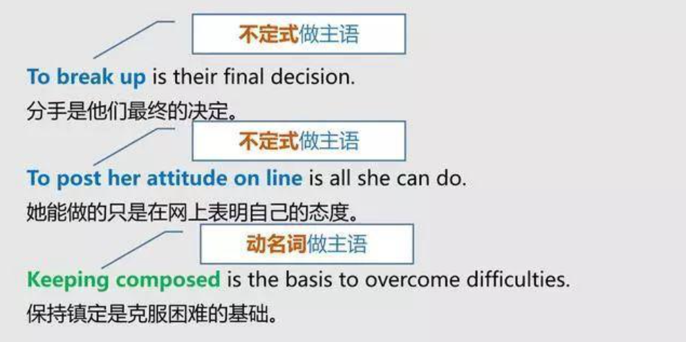
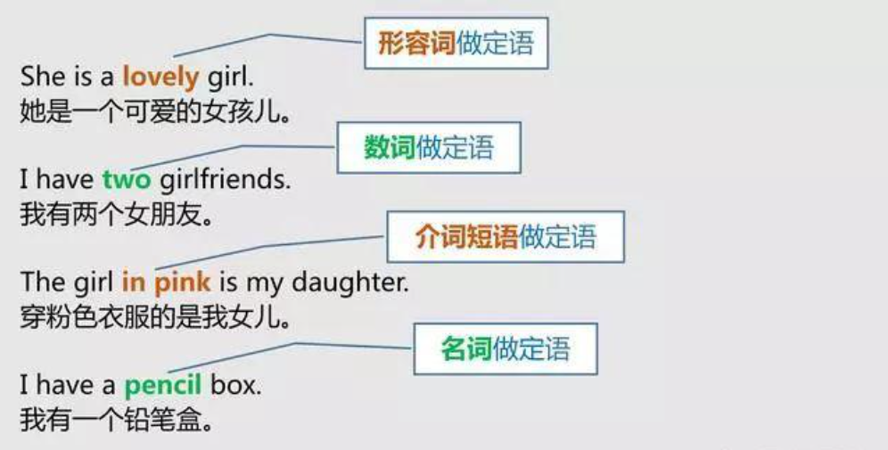
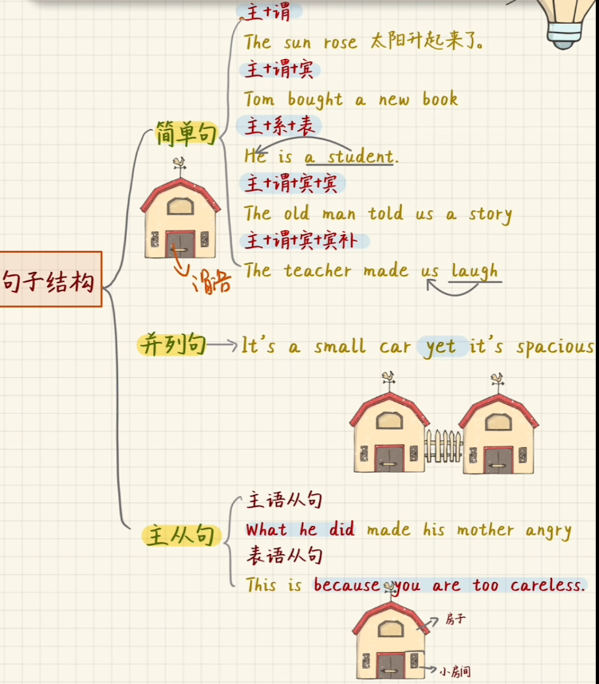

# hero

```basic
used to do sth 过去常常做某事
Tina used to go to school by bike.
蒂娜过去常常骑车上学。
   
be used to do sth 被用来做某事＝be used for doing sth
The pen is used to write. 钢笔被用来写字。＝The pen is used for writing.

be/get/become used to (doing) sth 习惯于(做)某事
He is used to climbing mountains on weekends.
他习惯于周末爬山。
```


清辅音放在音标[s]之后，要变为浊辅音，共4种情况，

```c
[sp]  [st] [sk] [str]
[sb]  [sd] [sg] [sdr]
strength speak split stoke skip
```


## 介词


through：通过。

***

以下是方向介词：


## 句子成分(词性)


系动词通常分为be动词与感官动词。


## 如何分清英语中的主语、谓语、宾语、定语、状语、补语和表语？


### 主语

1.**主语的含义**：

主语即“动作的发出者”（主谓宾结构中）或者“表述的对象”（主系表结构中），一般放在句首，**有时也放在中间或者句尾**。充当主语的**可以是名词、代词；也可以是短语、不定式；甚至可以是整个句子**。所以，在找主语的时候，脑子里一定要有这些认知。

2.**充当主语的有哪些**？

（1）名词/代词/数词做主语


（2）不定式/名词化短语做主语



（3）从句做主语（即主语从句）

从句做主语的句子，就是我们学过的“主语从句”。主语从句可以由连词**that/whether**引导；也可以由**关系代词**what/who/which引导；还可以由**连接副词**how/when/why/where引导。


（4）有时为了避免**头重脚轻(重点的偏移)**，经常会借助“it”充当形式主语，而真正的主语则放在句尾：


**（5）“There be …”句型**

“there be…”比较特殊。在这种句型中，主语的位置在中间。比如：

There are **six beautiful French ladies** walking on the street.

大街上有六位漂亮的法国女郎在散步。

### 谓语

1.**含义**：

谓语是句子的灵魂，主要用来“陈述主语的状态”或者“表明主语发出的动作”。

2.**分类：简单谓语 复合谓语**

（1）简单谓语：由一个动词或者一个动词短语构成谓语；

I love my girlfriend.

我爱我的女朋友。

My boss stayed up late last night.

我的老板昨晚熬夜了。

（2） **复合谓语**：

① 情态动词/助动词+动词构成


② 系动词+表语构成


③ 情态动词+系动词：


### 宾语

含义：宾语与主语相对，表示动作的承受者。**名词、代词、数词以及句子**都可以做宾语（宾语从句）。

（1）直接宾语&间接宾语/代词做宾语/名词做宾语


（2）数词/从句做宾语


### 定语

“定语”顾名思义就是为了限定句中某个的成分。**形容词、==名词==、数词、代词、从句**（定语从句）等成分基本都可以做定语（**动词除外**）。定语在所修饰的词前，就被称为前置定语；反之，则为后置定语。




### 状语

英语中，状语传递的信息包括：**时间、地点、原因、目的、结果、方式、程度**等，其使用的目的就是**==使表达更为丰满、具体(也就是可以没有)==**。

英语中的**副词、不定式、介词、名词、从句**等都可以做状语。

那么如何判定哪些成分是“状语”呢？关键就看这个词/词组/从句是否在**修饰动词**or**形容词**or**副词**or**整个句子**。

具体使用方式，见下图：


### 表语

表语存在于英语中的“主系表结构”中，主要用来**解释说明**主语的**性质、状态、特性**等。

同样，做表语的可以是**名词、形容词、副词介词短语、不定式等或者由整个从句**充当表语（即表语从句）。


其实，系动词后面的就是表语。

### **补语**

补语，意在**补充说明**主语or宾语，分别称为“主语补足语”及“宾语补足语”，而后者使用更为频繁。

（1）主语补足语：


（2）宾语补足语：


不要背：

经过对以上七种语言成分的逐个分析，我相信你对英语句子的构成已经有了比较基础的了解。

**最后，分享一个判断主+谓+宾的顺口溜：**

主谓宾、定状补，主干枝叶分清楚。

定语必居主宾前，谓前为状谓后补。

状语有时位主前，逗号分开心有数。

基本成分主谓宾，连带成分定状补。

定语必居主宾前，谓前为状谓后补。

六者关系难分辨，心中有数析正误。

什么谁称主，做是怎样才充谓；

宾语动支配，回答谓语什么谁。

前置状语目（的）时（间）地（点），意义不变能复位。

补语从后说前谓，定语才和后宾配。

介宾短语多状补，不能充当宾主谓。

的定地状与得补，语言标志定是非。

对于什么是主语、谓语、宾语、定语、表语的理解，最好的还是带着定义去在具体实际的句子中去理解，有简单句和复杂句，简单句相对好判断，复杂句，就真的需要认认真真的分析了。

## 句子结构



我们把简单句比作是一个房子，谓语就是房子的唯一主人。

并列句的谓语是平等的，它们由连词进行连接，就像是两栋房子之间的小栅栏。

主从句是一种主从关系，一般是把某种词(宾语，主语)抽象为一个句子，这个句子就是从句。**他有两个谓语动词，为了避免打架，一个谓语动词是在从句里的**。从句就像房子里的一个小房间，离开了从句，句子意思是不完整的.

**当然，解决谓语两个动词的另一种方式是使用非谓语(这应该是属于简单句吧)**。

## 5大基本句型

He put the apple on the desk.请问这个on the desk是状语还是补语，如何分析啊？地点状语


**laugh是对us的修饰。**

## 英语语法体系(词性)


情态动词一般不单独使用，后接动词原型。

## 英语9大时态


将来不仅可以用will+v，这里待补充。


一般现在，过去，将来时。

现在，过去，将来进行时。 **进行时是be doing。将来时是will+v，那么将来进行时是will be doing**。

现在，过去，将来完成时。 **现在完成时是have/has done，将来是will+v，那么将来完成时是will have done**。

​                                               **当然了，过去完成时是had(过去) done(完成时)。**

```
Hamburgers have been his favorite fast food since he was six/
从他6岁到现在当然是现在完成时，而不是过去完成时/
```


## 非谓语


## 被动语态


## 倒装句

### 全部倒装


## 从句

### 主语从句


### 宾语从句


### 表语从句


### 定语从句


定语变成了**去年建造的**，**==不能用一个单独的形容词来表示，所以我们将它变成一个句子==**。

***

定语就是形容词，用来修饰名词。

单独的形容词放在名词的前面。

定语从句(也可以称为形容词性从句)或非谓语带宾语放在名词后面。

什么是从句，连接词后面的**句子**(五种句子结构)就是从句。

```c
The girl who often helps me with my English is from England
         做主语     谓语  宾语
When I came into the room,he was writing a letter.
     主 谓            宾
```


```c
8 . This is the boy without ____ help I couldn't have passed that difficult exam.
A. who
B. whom
c. whose  111
D. that
```


**==当从句缺的是宾语,关系代词可以省略==**。

```c
She is the girl I like.
    She is the girl that I like.
                    who
                    whom
在一个句子中，不可以同时出现两个动词。
解决方法：
    1.连词
    2.非谓语
    3.它可能是一个省略了关系代词的定语从句
从句是两个句子，它可没有同时出现两个动词。
```


用关系副词的情况：

1. 从句句子完整。就是包含主谓宾。特别的，对于不及物动词做谓语，那么主谓就是完整的，它又不能直接接宾语。

2. 先行词是时间，地点，原因(resson)。

   ​               when  where  why

```c
After living in Paris for fifty years he returned to the small town ____ he grew up as a child.  
A . which
B . where
c . that
D . when
```

注：as a child是状语哈。grow是不及物动词。


非限制性定语从句：

由于从句比较长，所以在必要的时候我们还需要逗号的帮助，什么时候加逗号，什么时候不加逗号呢？

一般来说，如果从句的作用是下定义，不加逗号，

The lady ==who is wearing a red dress== is my friend.

在为lady下定义，不然谁知道是哪个lady。

如果从句的作用是修饰，**最好**加逗号。

Danielle, **==who is wearing a red dress==**, is my friend.

仅仅是在修饰Danielle，即使去掉了，我们也知道我的朋友到底是谁。


```c
The vegetables that people leave uneaten are often the most nutritious.
    
花椰菜
Broccoli,which people often leave uneaten, is very nutritious.
```

****

**==值得注意的是，定语从句的先行词可以是一个句子，这在非限制性定语从句中尤为常见==**。

eg.

```c
Taiwan is a part of China,as is well known to us all.
You are responsible for the class work,which helps set up a good image and make others believe in you.
my leader who give me the goal is that average iops can reach 1700,but now average iops can reach  3000 through my optmization,which indicates that I am a fast learner.     
```

***

更多的例句：

```
一.定语从句就是用作定语的句子，修饰名词或者代词或者修饰整个句子。
二.连接定语从句的连接词有关系代词和关系副词，分别是：
1)关系代词who/whom/whose/which/that/as；
2)关系副词when/where/why.
用法如下：
*当被定语从句修饰的词（先行词）指人时，用who,whom,whose引导定语从句。
eg.
Do you know the boy who is playing football?
The baby whom the nurse is looking after is one year old .
The student whose father is an engineer is named Tom.

*当先行词指人时有时候要用that,此时不能用who/whom，
eg.
Who is the boy that is playing the piano?  # 这个句子挺好的
Which of the boys is your brother that(修饰boys) are playing football?

当先行词指物时，一般用which,that.,whose,
eg.
The book which/that I am reading now was written by Shakespear .
The car whose color is red belongs to Mary.

通常用which或as引导定语从句修饰整个句子，如：
He won the gold medal in the game yesterday,which made us happy.
As we all know,he is an honest person and can be trusted on.

关系副词when,where,why的用法：
eg.
The days are gone when we Chinese were looked upon .
I visited the school where Tom studied 10 years ago.
Can you tell me the reason/excuse why you were late for school yesterday?
```

```
科学家正在寻找一个和地球相似的地方。
Scientists are looking for a place that is similar to the Earth.
```


#### 定语从句解题技巧


注：很明显，who包含whom。

对于例子1，我们就只划到了第二个谓语动词are。

**对于例子2和例子3，我们从连词那里开始划，但是没有碰到第二个谓语动词，所以直接划完整个句子即可**。

#### 定语从句翻译技巧


主干：除了枝干外的就是主干。

枝干：充当定语的部分，也就是形容词，也就是修饰语。

先翻译主干，**再翻译枝干，并且将翻译出来的枝干插入到主句中的先行词后面**。

例子1先行词(that man)(人)在从句中是做主语，因为从句缺主语呀。

例子2先行词(the factory)(物)在从句中是做宾语，因为从句缺宾语呀。

**例子3先行词在从句中是做地点状语，因为从句有完整的主谓宾**。考虑到factory是(我们拜访老师的)一个地点，所以填where。如果此时先行词是一个表示原因或时间的词的话，我们填why或者when。

### 同位语从句


a simple example,the woman who is my English teacher。这应该是同位语而不是定语ba？

同位语例子：这是我的英语老师，章鱼。英语老师就是章鱼，章鱼就是英语老师。这两个词是互为同位语关系的。

既是同位语，又是句子，自然就是同位语从句啦。

同位语只表示一种补充说明，没有同位语是不影响句子本身的含义的，比如这里的we have heard the news。

句子成分是完整的，只是你可能想要对消息的内容进行补充(为了满足表达的需求)，那么我们可以利用同位语。

同位语从句会在哪里出现呢？**一般会在一些需要解释的抽象名词后面出现**。

### (名词性)从句连接词解题技巧


who可以换成相应的when,where。是who you are吗。

```
what we want to do is to find where the last write to this pointer occured.
我们想要的是什么，很明显用what
最后一次写发生在哪里，用where
to this pointer 介词短语
the last write 主语
```

add to cart。加入购物车/

***

测验：


BC**A**DD。

### 状语从句

状语从句的主要作用是修饰一个动作发生时的外界条件，表达了一种关系。

那都有哪些关系可以用状语从句来表达呢？


此处while翻译为然而，也可以做时间状语来表达时间关系，翻译为与此同时。

```c
I  am also grateful    that I have many loving friends.
主 系(谓)   仅仅修饰主语  宾语从句
```


***


知道这些状语从句的学名并没有那么的重要，理解文字背后所代表的意思才是最重要的。

## 杂乱

### other家族


以第三题为例，不一定所有剩余的，都喜欢物理。所以是其他人喜欢物理，在这其他人之中，可能有一些不喜欢物理，它们就是有剩余。

注：another是大于等于3。

### 英语中的三三两两


例子2是一个宾语从句哈。这是很明显的。

### there be和have的区别


注：地点状语，时间状语放在最后。

这里是in the road还是on the road有待考证。

there be表示存在关系，译为有。中文里地点做主语时使用。

比如这里的例1。先写上There are表示有，然后把in the garden(事实上它是主语，但是我们把There are)写到最前面了，**所以之间把真正的地点主语搞成地点状语**。


## 发音

### 名词或动词三单 加s或者es


```
comb
英 [kəʊm]美 [koʊm]
combed
[kəumd]
combs
[kəumz]

为什么problem是发S啊/ 
```

```
clean
英 [kliːn]美 [kliːn]
cleaned
英 [kliːnd]美 [ klind]
cleans
英 [kli:nz]美 [klinz]
```

```
ling
英 [lɪŋ]美 [lɪŋ] n.鳕鱼
lings
[liŋz]
```

所以可以看到这三个鼻辅音，我们当作浊辅音来对待。**下面这个叫做舌测音的l也是一样的，当作浊辅音**。

```
enroll
英 [ɪnˈrəʊl]美 [ɪnˈroʊl]
v.注册; 登记; 招收
enrolled
英 [en'rəʊld]美 [en'roʊld]
enrolls
[inˈrəulz]

tells [telz]
```


清对清，浊对浊，元对浊。

1.单词结尾发音是清辅音，s就发清辅音[s]。

```
map
英 [mæp]

maps
[mæps]
```

2.单词结尾发音是浊辅音，s就发浊辅音[z]。

```
dog
英 [dɒɡ]

dogs
[dɔɡz]
```

3.单词结尾发音是元音，s也发浊辅音[z]。

```
shoe
英 [ʃuː]

shoes
英 ['ʃu:z]
```

特殊：

```
字母t or 单词结尾发音是发音/t/    +s 发音[ts]
因为t只有一种发音嘛，所以说字母t也是可以的
cats
[kæts]

notes     // 原单词e不发音，所以是这样子的
[nəuts]

creates   // 这个也是一样的
英 [kri':eɪts]美 [kri'eɪts]
```

```
字母d or 单词结尾发音是发音/d/    +s 发音[dz]

beds
[bedz]
```


**如果一个单词的尾(发)音就是/s/或者/z/，我们总不能读ss或zz。所以此时的s或es就要变音为/IZ/**。

**==除此之外，还有4个辅音，后面跟s或es时，也要发音为/IZ/。这四个辅音不遵守规则也许是为了发音的省力吧==**。

```
orange
英 [ˈɒrɪndʒ]

oranges
英 [ˈɒrɪndʒɪz]
```

## 提问

### **直接疑问句：（Direct Questions）**

（疑问词Question Word) + 助动词Auxiliary + 主语Subject + 动词Verb Form +（宾语objects) + 疑问号？


**直接疑问句是提问时最常用的句式，在询问简单信息和复杂信息时均可使用。**

Eg:    

When do you get to work? 

Do you like fish? 

**How long have you been working on this project?** 

Where are those ties manufactured?

### **是否问题：（Yes / No Questions）**

助动词Auxiliary + 主语Subject + 动词Verb Form + (宾语objects) + ?

是否问题常用来询问简单信息，针对性较强，提问人往往只需要得到对方肯定或否定的答复即可。

Eg:   

Does he live in New York? **Have you seen that film? Is she going to come to the party?**

### **如何就主语或宾语提问：(Subject or Object Questions)**

例如：Jason likes playing golf. 如果我们想就这句话中的某种信息进行询问或确认，就可以使用下列句式： 

问主语——Wh? + (auxiliary) + verb + object?

**Who likes playing golf**? - ANSWER Jason


问宾语——Wh? + auxiliary + subject + verb?

**What does Jason like playing**? - ANSWER golf


注意：**问主语时，==只有句子为一般现在时态或一般过去时态时，基本结构中的助动词才可省略==**。如下面两句中，将来时态的句子需要使用Be动词is充当助动词，而现在时态的句子则无助动词。

Eg：

Who enjoys playing tennis? 

**Who is coming to the party next week?**

就主语提问的常见形式还有：

Which

Which bicycle goes fast?


What kind of

What kind of cheese tastes mild?


What sort of

What sort of tea costs very little?


Who

Who goes to school here?

### **反意疑问句（Question Tags）：**

反问句借助疑问号和疑问语气提问，这种方法常用来确认某些你已经了解到信息或你认为你已掌握的信息，也可以用于检验你是否已经完全理解了对方表达的意思。

构造反问句的方法是：在一般陈述性的语句后写上逗号，再构造与前文相反的陈述（前文为肯定陈述，后文则需否定；前文为否定，后文则需肯定），最后加上疑问号表达疑问含义（口语中还需使用疑问语气）。

Examples:

You're married, aren't you?

 He's been here before, hasn't he?

 You didn't buy the new car, did you?

### **间接疑问句：**

当我们需要使表达更加婉转礼貌，或让语言显得更为正式时可以使用间接疑问句。

Introductory phrase + question word /if + 肯定句（一般陈述句）

positive sentence

间接疑问句常由直接疑问句改造而来：例如，当疑问句是一个是否疑问句时，我们可以用疑问词或if连接前后两个部分。

Examples:

I was wondering if you know the way to the nearest bank.

 Do you know when the next train leaves?

常见句式主要有：

Do you know... 

I wonder / was wondering .... 

Can you tell me...

 I'm not sure...

 I don't know...

Do you know when the next train leaves?

 I wonder when he will arrive. 

Can you tell me where he lives?

 I'm not sure what he wants to do.

 I don't know if he is coming.


