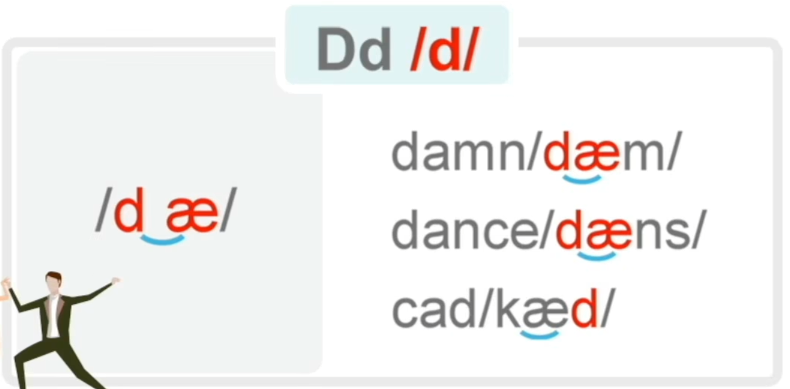
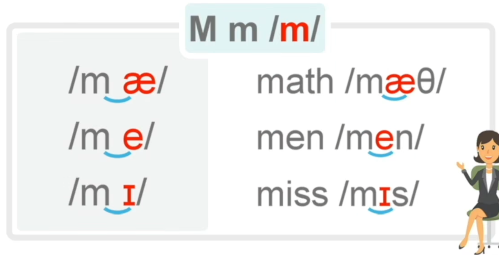

26个字母在单词当中都是如何发音的?
某两个字母组合是如何发音的?

某三个/更多的字母组合在单词中是如何发音的?

主要是为了进行拼读，一辅一元，前辅后元。

> 元音有多种发音，辅音在单词中一般只有一种发音。

嘴巴张大。

比如辅音字母c就有两种发音，/k/和/s/(蛇吐信子)，都只是气息的流动，而不需要实际的发出声音。一般情况下发/k/，**==当字母c+i,e,y时发/s/。==**

> 羊叫的那个尾音。

### 二

注意就是很短的一声噫，不是1。

这个发音是知道的知，带一点摩擦感。

> m发音，嘴巴闭上，发鼻音。
>
> l发音，舌头网上抬，哦儿。

## 三

> 这个字母读A哦。

字母l+元音字母时发了。

舌头往上抬，放在上排牙齿那个地方不动。

> ir作为一个字母组合发图中那个音。

> 这个字母读Am。

发音是么。

> 当字母m出现在单词末尾的时候，它只需要把嘴巴闭上，发一个en的鼻音。

发音是了。

发鼻音n。

